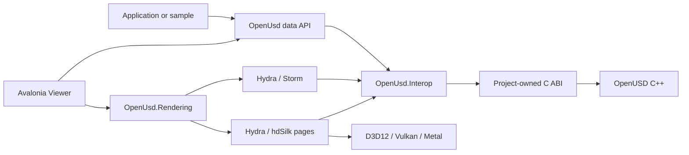

# OpenUsd

[![CI][ci-badge]][ci] [![Native][native-badge]][native] [![Shaders][shaders-badge]][shaders]
[![Performance][perf-badge]][performance] [![.NET][dotnet-badge]][frameworks]
[![License][license-badge]][license] [![Status][status-badge]][status]

A high-performance, NativeAOT-compatible .NET data and rendering stack for
[OpenUSD](https://openusd.org/), plus an Avalonia desktop viewer.

OpenUsd keeps OpenUSD C++ types behind a versioned, project-owned C ABI. Its managed surface covers
stages, layers, prims, typed values, composition, focused schema facades, ordered live authoring, and
renderer-neutral state. Hydra/Storm is the primary renderer; Hydra-fed Silk.NET backends provide
D3D12, Vulkan, and Metal alternatives without putting per-element P/Invoke on scene or render hot
paths.

> **Current distribution:** public source repository and 23 published `0.11.0-alpha` packages,
> with pre-1.0 APIs. This set includes the five Cesium package IDs enumerated below, which
> became public after being withheld from NuGet.org at `0.5.0-alpha`.
> Package identities and public APIs may still change before 1.0.

```shell
dotnet add package OpenUsd --version 0.11.0-alpha
dotnet add package OpenUsd.Runtime.Core --version 0.11.0-alpha
```

`OpenUsd.Runtime.Core` is the RID-agnostic metapackage for `win-x64`, `linux-x64`, and
`osx-arm64`. Rendering consumers add the managed backend and `OpenUsd.Runtime.Imaging`; the
RID-specific package IDs remain available when a project wants explicit asset selection. RID-less
builds and publishes copy the current host's assets only on `win-x64`, `linux-x64`, and
`osx-arm64`; cross-publishing, CI matrix jobs, and unsupported hosts should set
`RuntimeIdentifier` explicitly. See [Packaging](docs/packaging.md).

Release evidence now includes a checked CycloneDX SBOM, nuget.org symbol-package promotion wiring,
and render gates that run before releases. The details and caveats live in
[Packaging](docs/packaging.md#release-sbom),
[Packaging symbols](docs/packaging.md#symbol-packages-for-nugetorg), and
[Testing](docs/testing.md#continuous-render-gates).

## ✨ Highlights

- **Idiomatic data API** for stage and layer lifecycle, prims, attributes, relationships, variants,
  metadata, composition arcs, world bounds, and bulk values.
- **Focused schemas** for `UsdGeom`, `UsdShade`, `UsdLux`, and `UsdSkel`.
- **Owned native boundary** with opaque handles, bulk buffers, explicit lifetime rules, and no
  exposure of OpenUSD C++ layouts.
- **Ordered shared-stage access** through `UsdStageScheduler`, change notifications, and retained
  render sources for live editing.
- **Renderer-neutral viewer state** for camera, time, selection, picking, diagnostics, and failover.
- **A managed Hydra renderer** over D3D12, Vulkan, and Metal covering materials, textures, `UsdLux`
  lighting, point instancing, curves, points, draw modes, clip planes, `UsdSkel` skinning, and
  time-varying values.
- **Measured parity with Storm** on 22 hard-gated curated scenes whose structured gate requires
  `1.000000` adjusted IoU for D3D12 WARP and Vulkan SwiftShader; the render workflow also attempts
  the same curated capture on macOS CGL/Metal and records an explicit capability skip when hosted
  CGL cannot create the required pixel format.
- **Cross-platform packaging gates** for `win-x64`, `linux-x64`, and `osx-arm64`.
- **A local MCP stdio tool** installed as `OpenUsd.Mcp.Tool` with the `openusd-mcp` command and
  12 bounded scene workflow tools.
- **NativeAOT and trimming analyzers** across production libraries targeting .NET 8, 9, and 10.

## 🚀 Start from source

The repository pins .NET SDK `10.0.301`. The managed baseline does not build OpenUSD itself:

```shell
git clone https://github.com/marcschier/openusd-dotnet.git
cd openusd-dotnet
dotnet --version
dotnet build OpenUsd.slnx -c Release
./eng/run-managed-tests.ps1 -Configuration Release
dotnet build samples/OpenUsd.HelloStage/OpenUsd.HelloStage.csproj -c Release -f net10.0
```

`dotnet --version` must print `10.0.301`. If it is unavailable, use `./eng/install-dotnet.ps1` on
Windows or `bash ./eng/install-dotnet.sh` on macOS/Linux. Managed projects compile without OpenUSD;
executing `OpenUsd.HelloStage` requires the matching Core runtime.

For the native-backed API, inspect and build the locked runtime for the current RID:

```shell
./eng/build-native.ps1 -Rid win-x64 -PlanOnly
./eng/fetch-native.ps1 -Rid win-x64
./eng/build-native.ps1 -Rid win-x64
./eng/run-native-probe.ps1 -Rid win-x64
```

The public API used by the native probe and package consumers starts like this:

```csharp
using OpenUsd;

using UsdStage stage = UsdStage.Create("scene.usda");
UsdPrim world = stage.DefinePrim("/World", "Xform");
world.SetString("custom:greeting", "hello");
stage.SetDefaultPrim("/World");
stage.Save();
```

See [Getting started](docs/getting-started.md) for platform prerequisites, native staging, the viewer,
and NativeAOT commands. The runnable source setup is in the
[HelloStage guide](samples/OpenUsd.HelloStage/README.md), and the complete API walkthrough is in
[Data API](docs/data-api.md).

## 🏗️ Architecture



The data facade, renderer-neutral contracts, Hydra translation, Cesium importer, and concrete RHIs remain separate.
Large scene and render payloads cross owned bulk boundaries rather than one native call per element.
See [Architecture](docs/architecture.md) and [Rendering](docs/rendering.md).

## 📦 Package matrix

All 23 package IDs below are buildable from this repository and published to NuGet.org at
`0.11.0-alpha`. The five Cesium IDs became public after being withheld at `0.5.0-alpha`.

| Package | TFM | Purpose |
| --- | --- | --- |
| `OpenUsd.Interop` | 8/9/10 | Generated NativeAOT-safe C ABI declarations |
| `OpenUsd` | 8/9/10 | Managed stage, layer, prim, value, and schema API |
| `OpenUsd.Rendering` | 8/9/10 | Renderer-neutral state, capabilities, picking, and failover |
| `OpenUsd.Rendering.Storm` | 8/9/10 | Hydra/Storm adapter |
| `OpenUsd.Cesium` | 8/9/10 | Optional Cesium 3D Tiles importer |
| `OpenUsd.Rendering.Silk` | 8/9/10 | Hydra-fed managed renderer and backend-neutral RHI |
| `OpenUsd.Rendering.Silk.D3D12` | 8/9/10 | Direct3D 12 backend |
| `OpenUsd.Rendering.Silk.Vulkan` | 8/9/10 | Vulkan backend |
| `OpenUsd.Rendering.Silk.Metal` | 8/9/10 | Metal backend |
| `OpenUsd.Viewer` | 8/9/10 | Embeddable Avalonia Viewer shell |
| `OpenUsd.Mcp.Tool` | 10 tool | Framework-dependent MCP stdio host; native runtime separate |
| `OpenUsd.Runtime.Core` | 8 carrier | RID-agnostic Core metapackage for `win-x64`, `linux-x64`, and `osx-arm64` |
| `OpenUsd.Runtime.Core.win-x64` | 8 carrier | Windows OpenUSD core runtime and data plugins |
| `OpenUsd.Runtime.Core.linux-x64` | 8 carrier | Linux OpenUSD core runtime and data plugins |
| `OpenUsd.Runtime.Core.osx-arm64` | 8 carrier | macOS OpenUSD core runtime and data plugins |
| `OpenUsd.Runtime.Imaging` | 8 carrier | RID-agnostic Imaging metapackage for `win-x64`, `linux-x64`, and `osx-arm64` |
| `OpenUsd.Runtime.Imaging.win-x64` | 8 carrier | Windows Hydra, Storm, hdSilk, and plugins |
| `OpenUsd.Runtime.Imaging.linux-x64` | 8 carrier | Linux Hydra, Storm, hdSilk, and plugins |
| `OpenUsd.Runtime.Imaging.osx-arm64` | 8 carrier | macOS Hydra, Storm, hdSilk, and plugins |
| `OpenUsd.Runtime.Cesium` | 8 carrier | Cesium metapackage for all supported RIDs |
| `OpenUsd.Runtime.Cesium.win-x64` | 8 carrier | Windows Cesium 3D Tiles native shim |
| `OpenUsd.Runtime.Cesium.linux-x64` | 8 carrier | Linux Cesium 3D Tiles native shim |
| `OpenUsd.Runtime.Cesium.osx-arm64` | 8 carrier | macOS Cesium 3D Tiles native shim |

Runtime projects use `net8.0` as their NuGet asset-carrier TFM; the managed libraries they accompany
target .NET 8, 9, and 10. Package layout and clean-consumer gates are documented in
[Packaging](docs/packaging.md).

## 🎯 Target frameworks

| Surface | `net8.0` | `net9.0` | `net10.0` | Notes |
| --- | :---: | :---: | :---: | --- |
| Packable managed libraries | ✅ | ✅ | ✅ | AOT, trim, and single-file analyzers enabled |
| `OpenUsd.LiveAuthoring` sample library | ✅ | ✅ | ✅ | Source sample, not a package |
| Runtime asset carrier projects | Carrier | — | — | RID assets consumed by supported applications |
| Viewer, executable samples, probes | — | — | ✅ | Repository development and evidence tools |
| `OpenUsd.Mcp.Tool` | — | — | ✅ | Framework-dependent `openusd-mcp` command |

## 🖥️ RID and viewer matrix

The package prefix in the runtime columns is `OpenUsd.Runtime.`.

| RID | Core package | Imaging package | Viewer choices | Evidence |
| --- | --- | --- | --- | --- |
| `win-x64` | `Core.win-x64` | `Imaging.win-x64` | Storm, D3D12, Vulkan | Native, package, 19 gated parity scenes |
| `linux-x64` | `Core.linux-x64` | `Imaging.linux-x64` | Storm, Vulkan | Native, package, Storm child render gate |
| `osx-arm64` | `Core.osx-arm64` | `Imaging.osx-arm64` | Storm, Metal | Native, package, Metal probe |

Curated parity runs on Windows against D3D12 WARP and Vulkan SwiftShader. Two Vulkan composition
proofs are narrowed on hosted runners and need GPU-equipped self-hosted hardware: hosted Windows has
no system Vulkan ICD, and SwiftShader lacks the Win32 external-memory and external-semaphore
extensions needed to export a Vulkan image to a D3D11 shared handle. Hosted Linux reaches lavapipe,
but the compositor reports no supported image handles, so no external Vulkan image can be imported.

See [Support matrix](docs/support-matrix.md) for the distinction between implemented source,
workflow-defined gates, and hosted execution evidence.

## 🎨 Renderer and backend matrix

| Viewer kind | Scene source | Presentation/API | RID | Role |
| --- | --- | --- | --- | --- |
| Storm | Hydra/Storm | WGL, GLX, or NSOpenGL host | all supported | Primary |
| D3D12 | Hydra to hdSilk pages | Direct3D 12 | `win-x64` | Managed fallback |
| Vulkan | Hydra to hdSilk pages | Vulkan | `win-x64`, `linux-x64` | Managed fallback |
| Metal | Hydra to hdSilk pages | Metal | `osx-arm64` | Managed fallback |

The renderer-neutral capability declarations are:

| Capability | Storm | D3D12 | Vulkan | Metal |
| --- | :---: | :---: | :---: | :---: |
| Presentation | ✅ | ✅ | ✅ | ✅ |
| Offscreen | — | ✅ | ✅ | ✅ |
| Compute | — | ✅ | ✅ | ✅ |
| Multisampling | Up to 8x | 1x | 1x | 1x |
| Shadows | ✅ | — | — | — |
| Device-loss detection | ✅ | ✅ | ✅ | ✅ |
| One-pixel picking | ✅ | ✅ | ✅ | ✅ |
| Selection display | Storm highlight | Visible outline | Visible outline | Visible outline |

An em dash means the capability is not advertised by the current renderer-neutral descriptor, not
that the underlying graphics API can never provide it. The `Shadows` row states that the Storm
descriptor advertises the capability; it does not mean shadows are rendered in every configuration,
and the offscreen parity harness is measured not to produce them at all.

## 🧩 Feature matrix

| Area | Current alpha coverage | Status |
| --- | --- | --- |
| Stage and layer lifecycle | Create, open, masked open, save, reload, export, edit targets, muting | Implemented |
| Prim lifecycle | Define, override, class prims, traversal, children, active/load/instance state | Implemented |
| Values | Scalars, arrays, matrices, vectors, quaternions, colors, tokens, time samples | Implemented |
| Relationships | Create, enumerate, replace, read, and clear targets | Implemented |
| Composition | References, payloads, inherits, specializes, sublayers, population masks | Implemented |
| Variants and metadata | Variant sets/selections plus typed prim and layer metadata | Implemented |
| `UsdGeom` | Xform, xformable, imageable, mesh, camera, bounds, transforms | Focused facade |
| `UsdShade` | Materials, shaders, preview surface, UV texture, connections, binding | Focused facade |
| `UsdLux` | Distant, sphere, rect, disk, dome, cylinder, common light/shaping API | Focused facade |
| `UsdSkel` | Root, skeleton, animation, binding, joints, transforms, influences | Focused facade |
| Shared-stage authoring | Scheduler, change feed, retained render source, bounded sample queue | Implemented |
| Viewer | Hierarchy, properties, layers, timeline, cameras, switching, diagnostics | Implemented |
| Viewer diagnostics | Backend API/device, compute, descriptor indexing, software device, frame counters | Implemented |
| Primitive picking | Storm and hdSilk backend paths with stale-result handling | Implemented |
| Face picking | hdSilk preserves authored triangle/subprim identity | Implemented on Silk |
| Edge and point picking | Valid requests report unsupported | Not supported |
| Selection outlines | Visible-only hdSilk outline; Storm uses its native highlight | Implemented |
| X-ray selection | Explicitly rejected by the current outline contract | Not supported |
| NativeAOT | Compile gates on all RIDs; package-only execution gates per RID | Alpha-gated |

### hdSilk rendering features

These are the managed renderer's Hydra-fed features. "Parity-gated" means a curated scene is
compared against Storm and must match exactly; see the section below for what that does and does
not claim.

| Area | Coverage | Status |
| --- | --- | --- |
| Mesh topology and transforms | Triangulated meshes, authored normals, UVs, display colour | Parity-gated |
| Primvar interpolation | Constant, vertex, varying, uniform, face-varying | Implemented; constant/vertex gated |
| `UsdPreviewSurface` | All 14 inputs, both specular and metallic workflows | Implemented; specular workflow gated |
| Textures | Image decode, GPU cache, `UsdUVTexture` wrap and colour space | Implemented; `repeat`+`sRGB` gated |
| MaterialX | Projection plus generated Vulkan SPIR-V and Metal MSL source | Vulkan generated path gated |
| `UsdLux` lighting | Distant, sphere, and untextured dome ambient with exposure | Parity-gated |
| Shadows | Transport exists; Storm produces no offscreen reference to gate against | Measured, ungated |
| Image-based lighting | Dome textures and IBL | Not implemented |
| Point instancing | Prototype-plus-instance wire format, hardware instanced draws | Parity-gated |
| Basis curves | Linear curves as line topology | Implemented subset; gated |
| Points | `UsdGeomPoints` as point-list topology | Parity-gated |
| Draw modes | Cards, bounds, and origin | Parity-gated |
| Cull style | `doubleSided` and authored cull style | Implemented; `doubleSided` gated |
| Clip planes | Eye-space clip planes through the camera API | Parity-gated |
| Time-varying values | Transforms and primvars resample without a full scene rebuild | Parity-gated |
| `UsdSkel` skinning | CPU evaluation in hdSilk sync | Parity-gated |
| Blend shapes | Narrow CPU point-offset subset before skinning; GPU deformation excluded | Implemented subset |
| Subdivision | Storm renders the control cage at harness complexity | Measured, ungated |
| Draw batching | Sorted and batched by pipeline and material | Implemented |
| Volumes beyond Vulkan single-density OpenVDB, path tracing, full MaterialX | — | Out of current alpha scope |

## 🔬 What "parity with Storm" means here

Storm is the reference renderer. A parity harness renders the same USD stage through Storm and
through hdSilk and compares coverage and colour, and the claim this project makes is deliberately
narrow:

- **25 curated scenes are registered; 22 are hard gates** with a structured required adjusted IoU of
  exactly `1.000000` against **D3D12 WARP and Vulkan SwiftShader**. A gate is only accepted with a
  perturbation margin of at least `0.18`, so a scene that would score well by symmetry alone cannot
  qualify.
- **Metal is wired into the curated set but hosted Storm/Metal parity is not yet observed.** The
  macOS render job runs the same capture only when CGL is available; hosted arm64 currently records a
  CGL capability skip instead of counting that path as passing.
- **Three scenes are measured and deliberately left ungated**, because Storm in the offscreen
  harness renders the subdivision control cage, renders MaterialX black, and does not cast shadows
  at all. Those are recorded limits, not hidden failures.
- Several shipped features are reachable but **not** proven by a gate — non-diffuse texture slots,
  most `UsdPreviewSurface` inputs, metallic shading, and animated materials among them.

**Where it runs matters as much as the number.** The parity harness is driven by the `render`
workflow, *not* by ordinary CI, so a green `ci` badge does not mean parity ran. Today:

| Environment | Backends | State |
| --- | --- | --- |
| Windows with a conformant GPU driver | D3D12 WARP, Vulkan SwiftShader | All 22 gates pass |
| Hosted Linux (`render`) | Vulkan SwiftShader | Runs and passes |
| Hosted Windows (`render`, Mesa Storm) | D3D12 WARP | 7 WGL tests; Vulkan composition skip |
| Hosted macOS (`render`) | Metal; CGL when available | Metal tests; CGL parity skip on hosted arm64 |

Hosted Windows still has no usable Vulkan ICD, which is the `render-unblock-vulkan` limitation
described in [Testing](docs/testing.md) and needs a GPU-equipped self-hosted runner for Vulkan
composition. Hosted WGL and hosted Linux are automated render gates.

[Support matrix](docs/support-matrix.md) carries the full feature-to-scene table naming every
uncovered feature, and [Testing](docs/testing.md) records every rejected hypothesis and measured
divergence.

## 🗺️ Repository map

| Path | Contents |
| --- | --- |
| [`src/`](src) | Managed data, interop, rendering packages, runtime packages, and Viewer |
| [`native/`](native) | Project C ABI shims, Hydra integration, CMake inputs, and native tests |
| [`samples/`](samples) | Managed smoke and ordered live-authoring examples |
| [`tests/`](tests) | Managed, native, package, rendering, performance, and Viewer evidence |
| [`benchmarks/`](benchmarks) | BenchmarkDotNet workloads |
| [`eng/`](eng) | SDK, native, shader, packaging, test, performance, and Viewer scripts |
| [`test-assets/`](test-assets) | Repository-owned USD fixtures and fuzz seeds |
| [`docs/`](docs) | Architecture, API, rendering, packaging, testing, and contributor guides |

## 🧪 Samples

| Sample | Purpose | Native runtime |
| --- | --- | --- |
| [`OpenUsd.HelloStage`](samples/OpenUsd.HelloStage/README.md) | Create/save/open round trip | Required to run |
| [`OpenUsd.LiveAuthoring`](samples/OpenUsd.LiveAuthoring/README.md) | Ordered update adapter | No for build/tests |
| [`OpenUsd.LiveAuthoring.Sample`](samples/OpenUsd.LiveAuthoring.Sample/README.md) | End-to-end authoring | Required |

See the [samples overview](samples/README.md) for prerequisites, expected output, and package versus
source consumption.

## 📚 Documentation

| Start here | Use it for |
| --- | --- |
| [Documentation hub](docs/README.md) | Audience-oriented routes through all project docs |
| [Getting started](docs/getting-started.md) | Source build, native staging, Viewer, and AOT |
| [Support matrix](docs/support-matrix.md) | Framework, RID, renderer, backend, and feature status |
| [Architecture](docs/architecture.md) | Layering, ownership, and bulk native boundaries |
| [Programming model](docs/programming-model.md) | Ownership, scheduling, cancellation, errors, paths, and AOT |
| [Data API](docs/data-api.md) | Public stage, prim, value, composition, and schema APIs |
| [Live authoring](docs/live-authoring.md) | Ordered batches, backpressure, consumers, and disposal |
| [Rendering](docs/rendering.md) | Renderer-neutral contracts, Storm, hdSilk, picking, and selection |
| [Viewer](docs/viewer.md) | Desktop workflows, camera controls, editing, and diagnostics |
| [MCP server](docs/mcp.md) | .NET tool install, Copilot CLI setup, 12 tools, security, and RID bundles |
| [Samples](samples/README.md) | Runnable data API and live-authoring examples |
| [Native build](docs/native-build.md) | Locked OpenUSD inputs, toolchains, and native probes |
| [Packaging](docs/packaging.md) | Runtime asset layout and clean package consumers |
| [Versioning](docs/versioning-compatibility.md) | Managed, ABI, package, runtime, and plugin compatibility |
| [Shader pipeline](docs/shader-pipeline.md) | Reproducible DXIL, SPIR-V, and Metal inputs |
| [Performance](docs/performance.md) | Boundary shape, allocation gates, resources, and benchmarks |
| [Testing](docs/testing.md) | Managed runner, conformance, performance, and platform evidence |
| [Troubleshooting](docs/troubleshooting.md) | Native loading, plugins, platforms, AOT, and evidence triage |

## 🛠️ Build, test, and NativeAOT

```shell
dotnet restore OpenUsd.slnx
dotnet build OpenUsd.slnx -c Release --no-restore
./eng/run-managed-tests.ps1 -Configuration Release
dotnet format OpenUsd.slnx --verify-no-changes --no-restore
./eng/check-line-length.ps1
./eng/test-documentation.ps1
./eng/run-performance.ps1
```

Managed tests use TUnit on Microsoft.Testing.Platform. Use `eng/run-managed-tests.ps1`, not a bare
`dotnet test`, for the repository's verified execution path. Targeted commands are in
[Testing](docs/testing.md).

The same NativeAOT compile smoke used by CI can be reproduced with the platform AOT toolchain. On
Windows, run it from an x64 Visual Studio developer shell:

```shell
dotnet publish samples/OpenUsd.HelloStage/OpenUsd.HelloStage.csproj -c Release -f net10.0 -r win-x64 -p:PublishAot=true
```

Native-backed execution additionally requires the matching locked runtime and shim. Use
`eng/run-native-probe.ps1` after the native build rather than manually assembling loader paths.

## 🚧 Non-goals

- A stable public package or API compatibility promise before 1.0.
- Direct bindings to the OpenUSD C++ ABI or exposure of C++ object layouts.
- Per-prim, per-vertex, or per-element P/Invoke on scene and render hot paths.
- Complete generated coverage of every OpenUSD schema and optional component.
- A Python-hosting `usdview` clone, full DCC, or general-purpose game engine. The Viewer can still
  pursue `usdview`-style inspection parity over the C++ USD and Hydra APIs.
- Runtime packages for RIDs outside `win-x64`, `linux-x64`, and `osx-arm64` today.
- Bundling Python, usdview, tutorials, examples, Embree, or RenderMan in the locked native profile.
  OpenVDB, Alembic, Draco, and Ptex are now included in that profile.

## 🔒 Security

Treat USD files, asset paths, plugin metadata, and native package contents as untrusted input. Report
vulnerabilities privately through GitHub Security Advisories; do not open a public issue. See
[Security](SECURITY.md).

## 🤝 Contributing

Keep changes focused, analyzer-clean, deterministic, and separated across data, renderer-neutral,
Hydra translation, and concrete backend layers. Native or public API changes require corresponding
tests and documentation. See [Contributing](CONTRIBUTING.md).

## 📄 License

[MIT](LICENSE). OpenUSD and bundled third-party native dependencies retain their own licenses; see
[NOTICE](NOTICE).

## Status

OpenUsd is a substantial public `0.11.0-alpha` baseline with 23 packages published to NuGet.org,
but it is not a stable release. Data, rendering, Viewer, package, NativeAOT, shader, parity, and
performance gates exist, and this README states what they do and do not prove. Public API and package
identities may change before 1.0. Workflow badges above are the authoritative status for the default branch.

Before 1.0 the remaining work is code signing and notarization credentials for signed Viewer
distributions, GPU-equipped self-hosted runners for the two Vulkan composition gates, and closing
the measured divergences recorded in [Testing](docs/testing.md).

The standalone Viewer bundle smoke is now proven on `win-x64` and `linux-x64`. Run 31290108012
records `viewer distribution linux-x64` as successful and reports a rendered Storm/OpenGL frame under
Xvfb after the Linux X11 error-trap self-deadlock was fixed in 278b1f6. The `osx-arm64` result is
also established, but still red: the same evidence records `GPU composition: ready (808 x 513)`,
`initialized=True resources=True`, and the stage-open task completing successfully as
`RanToCompletion` on a pool thread. Probes posted after initialization at both
`DispatcherPriority.Send` and `Background` were armed and posted, but neither priority was processed
before the smoke timed out. The published packages are unaffected — they are gated separately — and
the observations point at Avalonia dispatcher servicing after initialization rather than the Metal
renderer, backend initialization, or stage-open async chain.

[ci]: https://github.com/marcschier/openusd-dotnet/actions/workflows/ci.yml
[ci-badge]: https://github.com/marcschier/openusd-dotnet/actions/workflows/ci.yml/badge.svg?branch=main
[native]: https://github.com/marcschier/openusd-dotnet/actions/workflows/native.yml
[native-badge]: https://github.com/marcschier/openusd-dotnet/actions/workflows/native.yml/badge.svg?branch=main
[shaders]: https://github.com/marcschier/openusd-dotnet/actions/workflows/shaders.yml
[shaders-badge]: https://github.com/marcschier/openusd-dotnet/actions/workflows/shaders.yml/badge.svg?branch=main
[performance]: https://github.com/marcschier/openusd-dotnet/actions/workflows/performance.yml
[perf-badge]: https://github.com/marcschier/openusd-dotnet/actions/workflows/performance.yml/badge.svg?branch=main
[frameworks]: docs/support-matrix.md#target-frameworks
[dotnet-badge]: https://img.shields.io/badge/.NET-8%20%7C%209%20%7C%2010-512BD4?logo=dotnet
[license]: LICENSE
[license-badge]: https://img.shields.io/badge/license-MIT-blue.svg
[status]: #status
[status-badge]: https://img.shields.io/badge/status-0.9.0--alpha%20%7C%20public-orange
