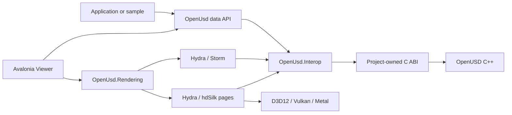

# OpenUsd

[![CI][ci-badge]][ci] [![Native][native-badge]][native] [![Shaders][shaders-badge]][shaders]
[![Performance][perf-badge]][performance] [![.NET][dotnet-badge]][frameworks]
[![License][license-badge]][license] [![Status][status-badge]][status]

A high-performance, NativeAOT-compatible .NET data and rendering stack for
[OpenUSD](https://openusd.org/), plus an Avalonia desktop viewer.

OpenUsd keeps OpenUSD C++ types behind a versioned, project-owned C ABI. Its managed surface covers
stages, layers, prims, typed values, composition, focused schema facades, ordered live authoring, and
renderer-neutral state. Hydra/Storm is the primary renderer; Hydra-fed Silk.NET backends provide
D3D12, Vulkan, and Metal alternatives without putting per-element P/Invoke on scene or render hot
paths.

> **Current distribution:** public source repository and published packages, version `0.4.0-alpha`,
> with pre-1.0 APIs. Managed and runtime packages are on
> [NuGet.org](https://www.nuget.org/packages/OpenUsd) and on GitHub Packages; package identities and
> public APIs may still change before 1.0.

```shell
dotnet add package OpenUsd --version 0.4.0-alpha
dotnet add package OpenUsd.Runtime.Core.win-x64 --version 0.4.0-alpha
```

Keep every `OpenUsd*` package at the same version, and add the matching
`OpenUsd.Runtime.Imaging.<rid>` package for rendering. See [Packaging](docs/packaging.md).

## ✨ Highlights

- **Idiomatic data API** for stage and layer lifecycle, prims, attributes, relationships, variants,
  metadata, composition arcs, world bounds, and bulk values.
- **Focused schemas** for `UsdGeom`, `UsdShade`, `UsdLux`, and `UsdSkel`.
- **Owned native boundary** with opaque handles, bulk buffers, explicit lifetime rules, and no
  exposure of OpenUSD C++ layouts.
- **Ordered shared-stage access** through `UsdStageScheduler`, change notifications, and retained
  render sources for live editing.
- **Renderer-neutral viewer state** for camera, time, selection, picking, diagnostics, and failover.
- **A managed Hydra renderer** over D3D12, Vulkan, and Metal covering materials, textures, `UsdLux`
  lighting, point instancing, curves, points, draw modes, clip planes, `UsdSkel` skinning, and
  time-varying values.
- **Measured parity with Storm** on 19 hard-gated curated scenes at exactly `1.000000` adjusted IoU,
  with every uncovered feature named rather than implied.
- **Cross-platform packaging gates** for `win-x64`, `linux-x64`, and `osx-arm64`.
- **NativeAOT and trimming analyzers** across production libraries targeting .NET 8, 9, and 10.

## 🚀 Start from source

The repository pins .NET SDK `10.0.301`. The managed baseline does not build OpenUSD itself:

```shell
git clone https://github.com/marcschier/openusd-dotnet.git
cd openusd-dotnet
dotnet --version
dotnet build OpenUsd.slnx -c Release
./eng/run-managed-tests.ps1 -Configuration Release
dotnet build samples/OpenUsd.HelloStage/OpenUsd.HelloStage.csproj -c Release -f net10.0
```

`dotnet --version` must print `10.0.301`. If it is unavailable, use `./eng/install-dotnet.ps1` on
Windows or `bash ./eng/install-dotnet.sh` on macOS/Linux. Managed projects compile without OpenUSD;
executing `OpenUsd.HelloStage` requires the matching Core runtime.

For the native-backed API, inspect and build the locked runtime for the current RID:

```shell
./eng/build-native.ps1 -Rid win-x64 -PlanOnly
./eng/fetch-native.ps1 -Rid win-x64
./eng/build-native.ps1 -Rid win-x64
./eng/run-native-probe.ps1 -Rid win-x64
```

The public API used by the native probe and package consumers starts like this:

```csharp
using OpenUsd;

using UsdStage stage = UsdStage.Create("scene.usda");
UsdPrim world = stage.DefinePrim("/World", "Xform");
world.SetString("custom:greeting", "hello");
stage.SetDefaultPrim("/World");
stage.Save();
```

See [Getting started](docs/getting-started.md) for platform prerequisites, native staging, the viewer,
and NativeAOT commands. The runnable source setup is in the
[HelloStage guide](samples/OpenUsd.HelloStage/README.md), and the complete API walkthrough is in
[Data API](docs/data-api.md).

## 🏗️ Architecture



The data facade, renderer-neutral contracts, Hydra translation, and concrete RHIs remain separate.
Large scene and render payloads cross owned bulk boundaries rather than one native call per element.
See [Architecture](docs/architecture.md) and [Rendering](docs/rendering.md).

## 📦 Package matrix

All package IDs below are published to NuGet.org and GitHub Packages, and are buildable from this
repository.

| Package | TFM | Purpose |
| --- | --- | --- |
| `OpenUsd.Interop` | 8/9/10 | Generated NativeAOT-safe C ABI declarations |
| `OpenUsd` | 8/9/10 | Managed stage, layer, prim, value, and schema API |
| `OpenUsd.Rendering` | 8/9/10 | Renderer-neutral state, capabilities, picking, and failover |
| `OpenUsd.Rendering.Storm` | 8/9/10 | Hydra/Storm adapter |
| `OpenUsd.Rendering.Silk` | 8/9/10 | Hydra-fed managed renderer and backend-neutral RHI |
| `OpenUsd.Rendering.Silk.D3D12` | 8/9/10 | Direct3D 12 backend |
| `OpenUsd.Rendering.Silk.Vulkan` | 8/9/10 | Vulkan backend |
| `OpenUsd.Rendering.Silk.Metal` | 8/9/10 | Metal backend |
| `OpenUsd.Runtime.Core.win-x64` | 8 carrier | Windows OpenUSD core runtime and data plugins |
| `OpenUsd.Runtime.Core.linux-x64` | 8 carrier | Linux OpenUSD core runtime and data plugins |
| `OpenUsd.Runtime.Core.osx-arm64` | 8 carrier | macOS OpenUSD core runtime and data plugins |
| `OpenUsd.Runtime.Imaging.win-x64` | 8 carrier | Windows Hydra, Storm, hdSilk, and plugins |
| `OpenUsd.Runtime.Imaging.linux-x64` | 8 carrier | Linux Hydra, Storm, hdSilk, and plugins |
| `OpenUsd.Runtime.Imaging.osx-arm64` | 8 carrier | macOS Hydra, Storm, hdSilk, and plugins |

Runtime projects use `net8.0` as their NuGet asset-carrier TFM; the managed libraries they accompany
target .NET 8, 9, and 10. Package layout and clean-consumer gates are documented in
[Packaging](docs/packaging.md).

## 🎯 Target frameworks

| Surface | `net8.0` | `net9.0` | `net10.0` | Notes |
| --- | :---: | :---: | :---: | --- |
| Packable managed libraries | ✅ | ✅ | ✅ | AOT, trim, and single-file analyzers enabled |
| `OpenUsd.LiveAuthoring` sample library | ✅ | ✅ | ✅ | Source sample, not a package |
| Runtime asset carrier projects | Carrier | — | — | RID assets consumed by supported applications |
| Viewer, executable samples, probes | — | — | ✅ | Repository development and evidence tools |

## 🖥️ RID and viewer matrix

The package prefix in the runtime columns is `OpenUsd.Runtime.`.

| RID | Core package | Imaging package | Viewer choices | Evidence |
| --- | --- | --- | --- | --- |
| `win-x64` | `Core.win-x64` | `Imaging.win-x64` | Storm, D3D12, Vulkan | Native, package, 19 gated parity scenes |
| `linux-x64` | `Core.linux-x64` | `Imaging.linux-x64` | Storm, Vulkan | Native, package, Storm child render gate |
| `osx-arm64` | `Core.osx-arm64` | `Imaging.osx-arm64` | Storm, Metal | Native, package, Metal probe |

Curated parity runs on Windows against D3D12 WARP and Vulkan SwiftShader. Two Vulkan composition
proofs are narrowed on hosted runners and need GPU-equipped self-hosted hardware: hosted Windows has
no system Vulkan ICD and SwiftShader cannot export to a D3D11 shared handle, and the hosted Linux
compositor reports no supported image handles.

See [Support matrix](docs/support-matrix.md) for the distinction between implemented source,
workflow-defined gates, and hosted execution evidence.

## 🎨 Renderer and backend matrix

| Viewer kind | Scene source | Presentation/API | RID | Role |
| --- | --- | --- | --- | --- |
| Storm | Hydra/Storm | WGL, GLX, or NSOpenGL host | all supported | Primary |
| D3D12 | Hydra to hdSilk pages | Direct3D 12 | `win-x64` | Managed fallback |
| Vulkan | Hydra to hdSilk pages | Vulkan | `win-x64`, `linux-x64` | Managed fallback |
| Metal | Hydra to hdSilk pages | Metal | `osx-arm64` | Managed fallback |

The renderer-neutral capability declarations are:

| Capability | Storm | D3D12 | Vulkan | Metal |
| --- | :---: | :---: | :---: | :---: |
| Presentation | ✅ | ✅ | ✅ | ✅ |
| Offscreen | — | ✅ | ✅ | ✅ |
| Compute | — | ✅ | ✅ | ✅ |
| Multisampling | Up to 8x | 1x | 1x | 1x |
| Shadows | ✅ | — | — | — |
| Device-loss detection | ✅ | ✅ | ✅ | ✅ |
| One-pixel picking | ✅ | ✅ | ✅ | ✅ |
| Selection display | Storm highlight | Visible outline | Visible outline | Visible outline |

An em dash means the capability is not advertised by the current renderer-neutral descriptor, not
that the underlying graphics API can never provide it. The `Shadows` row states that the Storm
descriptor advertises the capability; it does not mean shadows are rendered in every configuration,
and the offscreen parity harness is measured not to produce them at all.

## 🧩 Feature matrix

| Area | Current alpha coverage | Status |
| --- | --- | --- |
| Stage and layer lifecycle | Create, open, masked open, save, reload, export, edit targets, muting | Implemented |
| Prim lifecycle | Define, override, class prims, traversal, children, active/load/instance state | Implemented |
| Values | Scalars, arrays, matrices, vectors, quaternions, colors, tokens, time samples | Implemented |
| Relationships | Create, enumerate, replace, read, and clear targets | Implemented |
| Composition | References, payloads, inherits, specializes, sublayers, population masks | Implemented |
| Variants and metadata | Variant sets/selections plus typed prim and layer metadata | Implemented |
| `UsdGeom` | Xform, xformable, imageable, mesh, camera, bounds, transforms | Focused facade |
| `UsdShade` | Materials, shaders, preview surface, UV texture, connections, binding | Focused facade |
| `UsdLux` | Distant, sphere, rect, disk, dome, cylinder, common light/shaping API | Focused facade |
| `UsdSkel` | Root, skeleton, animation, binding, joints, transforms, influences | Focused facade |
| Shared-stage authoring | Scheduler, change feed, retained render source, bounded sample queue | Implemented |
| Viewer | Hierarchy, properties, layers, timeline, cameras, switching, diagnostics | Implemented |
| Viewer diagnostics | Backend API/device, compute, descriptor indexing, software device, frame counters | Implemented |
| Primitive picking | Storm and hdSilk backend paths with stale-result handling | Implemented |
| Face picking | hdSilk preserves authored triangle/subprim identity | Implemented on Silk |
| Edge and point picking | Valid requests report unsupported | Not supported |
| Selection outlines | Visible-only hdSilk outline; Storm uses its native highlight | Implemented |
| X-ray selection | Explicitly rejected by the current outline contract | Not supported |
| NativeAOT | Compile gates on all RIDs; package-only execution gates per RID | Alpha-gated |

### hdSilk rendering features

These are the managed renderer's Hydra-fed features. "Parity-gated" means a curated scene is
compared against Storm and must match exactly; see the section below for what that does and does
not claim.

| Area | Coverage | Status |
| --- | --- | --- |
| Mesh topology and transforms | Triangulated meshes, authored normals, UVs, display colour | Parity-gated |
| Primvar interpolation | Constant, vertex, varying, uniform, face-varying | Implemented; constant/vertex gated |
| `UsdPreviewSurface` | All 14 inputs, both specular and metallic workflows | Implemented; specular workflow gated |
| Textures | Image decode, GPU cache, `UsdUVTexture` wrap and colour space | Implemented; `repeat`+`sRGB` gated |
| MaterialX | `ND_standard_surface_surfaceshader` projected onto PreviewSurface | Implemented subset; projection gated |
| `UsdLux` lighting | Distant, sphere, and untextured dome ambient with exposure | Parity-gated |
| Shadows | Transport exists; Storm produces no offscreen reference to gate against | Measured, ungated |
| Image-based lighting | Dome textures and IBL | Not implemented |
| Point instancing | Prototype-plus-instance wire format, hardware instanced draws | Parity-gated |
| Basis curves | Linear curves as line topology | Implemented subset; gated |
| Points | `UsdGeomPoints` as point-list topology | Parity-gated |
| Draw modes | Cards, bounds, and origin | Parity-gated |
| Cull style | `doubleSided` and authored cull style | Implemented; `doubleSided` gated |
| Clip planes | Eye-space clip planes through the camera API | Parity-gated |
| Time-varying values | Transforms and primvars resample without a full scene rebuild | Parity-gated |
| `UsdSkel` skinning | CPU evaluation in hdSilk sync | Parity-gated |
| Blend shapes | Direct skinning skips them; Hydra computed points remain a fallback | Not supported |
| Subdivision | Storm renders the control cage at harness complexity | Measured, ungated |
| Draw batching | Sorted and batched by pipeline and material | Implemented |
| Volumes, path tracing, arbitrary MaterialX graphs | — | Out of scope for 1.0 |

## 🔬 What "parity with Storm" means here

Storm is the reference renderer. A parity harness renders the same USD stage through Storm and
through hdSilk and compares coverage and colour, and the claim this project makes is deliberately
narrow:

- **22 curated scenes are registered; 19 are hard gates** at exactly `1.000000` adjusted IoU against
  **D3D12 WARP and Vulkan SwiftShader**. A gate is only accepted with a perturbation
  margin of at least `0.18`, so a scene that would score well by symmetry alone cannot qualify.
- **Metal is not covered by the curated set.** It is validated by a single macOS native pipeline
  probe. Do not read three-backend scene parity into the backend table above.
- **Three scenes are measured and deliberately left ungated**, because Storm in the offscreen
  harness renders the subdivision control cage, renders MaterialX black, and does not cast shadows
  at all. Those are recorded limits, not hidden failures.
- Several shipped features are reachable but **not** proven by a gate — non-diffuse texture slots,
  most `UsdPreviewSurface` inputs, metallic shading, and animated materials among them.

**Where it runs matters as much as the number.** The parity harness is driven by the `render`
workflow, *not* by ordinary CI, so a green `ci` badge does not mean parity ran. Today:

| Environment | Backends | State |
| --- | --- | --- |
| Windows with a conformant GPU driver | D3D12 WARP, Vulkan SwiftShader | All 19 gates pass |
| Hosted Linux (`render`) | Vulkan SwiftShader | Runs and passes |
| Hosted Windows (`render`, Mesa Storm) | — | Currently fails at `vkCreateInstance: ErrorIncompatibleDriver` |

Hosted Windows has no usable Vulkan ICD, which is the `render-unblock-vulkan` limitation described
in [Testing](docs/testing.md) and needs a GPU-equipped self-hosted runner. Until then the full
Windows matrix is reproduced on a developer machine, and hosted Linux is the automated gate.

[Support matrix](docs/support-matrix.md) carries the full feature-to-scene table naming every
uncovered feature, and [Testing](docs/testing.md) records every rejected hypothesis and measured
divergence.

## 🗺️ Repository map

| Path | Contents |
| --- | --- |
| [`src/`](src) | Managed data, interop, rendering packages, runtime packages, and Viewer |
| [`native/`](native) | Project C ABI shims, Hydra integration, CMake inputs, and native tests |
| [`samples/`](samples) | Managed smoke and ordered live-authoring examples |
| [`tests/`](tests) | Managed, native, package, rendering, performance, and Viewer evidence |
| [`benchmarks/`](benchmarks) | BenchmarkDotNet workloads |
| [`eng/`](eng) | SDK, native, shader, packaging, test, performance, and Viewer scripts |
| [`test-assets/`](test-assets) | Repository-owned USD fixtures and fuzz seeds |
| [`docs/`](docs) | Architecture, API, rendering, packaging, testing, and contributor guides |

## 🧪 Samples

| Sample | Purpose | Native runtime |
| --- | --- | --- |
| [`OpenUsd.HelloStage`](samples/OpenUsd.HelloStage/README.md) | Create/save/open round trip | Required to run |
| [`OpenUsd.LiveAuthoring`](samples/OpenUsd.LiveAuthoring/README.md) | Ordered update adapter | No for build/tests |
| [`OpenUsd.LiveAuthoring.Sample`](samples/OpenUsd.LiveAuthoring.Sample/README.md) | End-to-end authoring | Required |

See the [samples overview](samples/README.md) for prerequisites, expected output, and package versus
source consumption.

## 📚 Documentation

| Start here | Use it for |
| --- | --- |
| [Documentation hub](docs/README.md) | Audience-oriented routes through all project docs |
| [Getting started](docs/getting-started.md) | Source build, native staging, Viewer, and AOT |
| [Support matrix](docs/support-matrix.md) | Framework, RID, renderer, backend, and feature status |
| [Architecture](docs/architecture.md) | Layering, ownership, and bulk native boundaries |
| [Programming model](docs/programming-model.md) | Ownership, scheduling, cancellation, errors, paths, and AOT |
| [Data API](docs/data-api.md) | Public stage, prim, value, composition, and schema APIs |
| [Live authoring](docs/live-authoring.md) | Ordered batches, backpressure, consumers, and disposal |
| [Rendering](docs/rendering.md) | Renderer-neutral contracts, Storm, hdSilk, picking, and selection |
| [Viewer](docs/viewer.md) | Desktop workflows, camera controls, editing, and diagnostics |
| [Samples](samples/README.md) | Runnable data API and live-authoring examples |
| [Native build](docs/native-build.md) | Locked OpenUSD inputs, toolchains, and native probes |
| [Packaging](docs/packaging.md) | Runtime asset layout and clean package consumers |
| [Versioning](docs/versioning-compatibility.md) | Managed, ABI, package, runtime, and plugin compatibility |
| [Shader pipeline](docs/shader-pipeline.md) | Reproducible DXIL, SPIR-V, and Metal inputs |
| [Performance](docs/performance.md) | Boundary shape, allocation gates, resources, and benchmarks |
| [Testing](docs/testing.md) | Managed runner, conformance, performance, and platform evidence |
| [Troubleshooting](docs/troubleshooting.md) | Native loading, plugins, platforms, AOT, and evidence triage |

## 🛠️ Build, test, and NativeAOT

```shell
dotnet restore OpenUsd.slnx
dotnet build OpenUsd.slnx -c Release --no-restore
./eng/run-managed-tests.ps1 -Configuration Release
dotnet format OpenUsd.slnx --verify-no-changes --no-restore
./eng/check-line-length.ps1
./eng/test-documentation.ps1
./eng/run-performance.ps1
```

Managed tests use TUnit on Microsoft.Testing.Platform. Use `eng/run-managed-tests.ps1`, not a bare
`dotnet test`, for the repository's verified execution path. Targeted commands are in
[Testing](docs/testing.md).

The same NativeAOT compile smoke used by CI can be reproduced with the platform AOT toolchain. On
Windows, run it from an x64 Visual Studio developer shell:

```shell
dotnet publish samples/OpenUsd.HelloStage/OpenUsd.HelloStage.csproj -c Release -f net10.0 -r win-x64 -p:PublishAot=true
```

Native-backed execution additionally requires the matching locked runtime and shim. Use
`eng/run-native-probe.ps1` after the native build rather than manually assembling loader paths.

## 🚧 Non-goals

- A stable public package or API compatibility promise before 1.0.
- Direct bindings to the OpenUSD C++ ABI or exposure of C++ object layouts.
- Per-prim, per-vertex, or per-element P/Invoke on scene and render hot paths.
- Complete generated coverage of every OpenUSD schema and optional component.
- A replacement for `usdview`, a full DCC, or a general-purpose game engine.
- Runtime packages for RIDs outside `win-x64`, `linux-x64`, and `osx-arm64` today.
- Bundling Python, usdview, tutorials, examples, Embree, or RenderMan in the locked native profile.

## 🔒 Security

Treat USD files, asset paths, plugin metadata, and native package contents as untrusted input. Report
vulnerabilities privately through GitHub Security Advisories; do not open a public issue. See
[Security](SECURITY.md).

## 🤝 Contributing

Keep changes focused, analyzer-clean, deterministic, and separated across data, renderer-neutral,
Hydra translation, and concrete backend layers. Native or public API changes require corresponding
tests and documentation. See [Contributing](CONTRIBUTING.md).

## 📄 License

[MIT](LICENSE). OpenUSD and bundled third-party native dependencies retain their own licenses; see
[NOTICE](NOTICE).

## Status

OpenUsd is a substantial public `0.4.0-alpha` baseline, published to NuGet.org, but not a stable
release. Data, rendering, Viewer, package, NativeAOT, shader, parity, and performance gates exist,
and this README states what they do and do not prove. Public API and package identities may change
before 1.0. Workflow badges above are the authoritative status for the default branch.

Before 1.0 the remaining work is code signing and notarization credentials for signed Viewer
distributions, GPU-equipped self-hosted runners for the two Vulkan composition gates, and closing
the measured divergences recorded in [Testing](docs/testing.md).

[ci]: https://github.com/marcschier/openusd-dotnet/actions/workflows/ci.yml
[ci-badge]: https://github.com/marcschier/openusd-dotnet/actions/workflows/ci.yml/badge.svg?branch=main
[native]: https://github.com/marcschier/openusd-dotnet/actions/workflows/native.yml
[native-badge]: https://github.com/marcschier/openusd-dotnet/actions/workflows/native.yml/badge.svg?branch=main
[shaders]: https://github.com/marcschier/openusd-dotnet/actions/workflows/shaders.yml
[shaders-badge]: https://github.com/marcschier/openusd-dotnet/actions/workflows/shaders.yml/badge.svg?branch=main
[performance]: https://github.com/marcschier/openusd-dotnet/actions/workflows/performance.yml
[perf-badge]: https://github.com/marcschier/openusd-dotnet/actions/workflows/performance.yml/badge.svg?branch=main
[frameworks]: docs/support-matrix.md#target-frameworks
[dotnet-badge]: https://img.shields.io/badge/.NET-8%20%7C%209%20%7C%2010-512BD4?logo=dotnet
[license]: LICENSE
[license-badge]: https://img.shields.io/badge/license-MIT-blue.svg
[status]: #status
[status-badge]: https://img.shields.io/badge/status-0.4.0--alpha%20%7C%20public-orange
