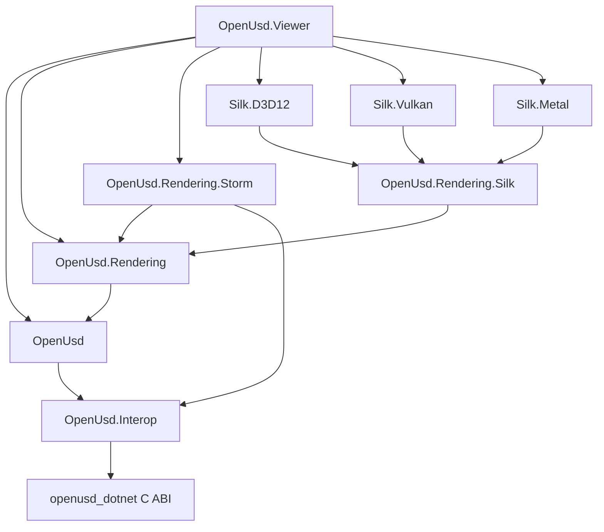
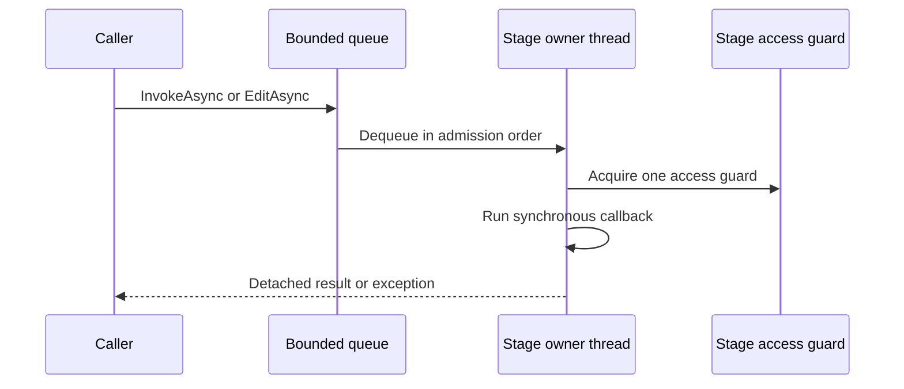
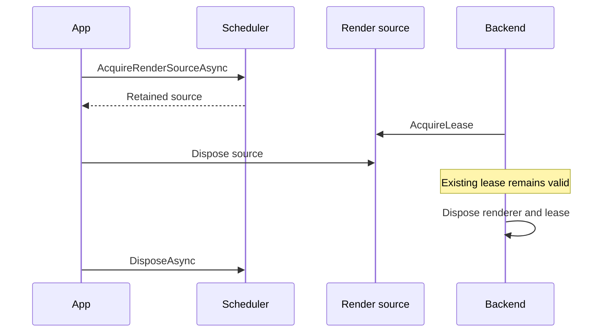
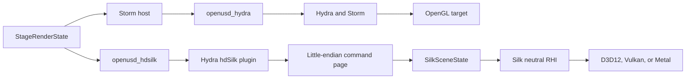

# Architecture

OpenUsd separates stage ownership, renderer-neutral coordination, native ABI adapters, and concrete
graphics backends. The main architectural rule is that OpenUSD C++ objects remain behind
project-owned C ABIs; managed code exchanges opaque handles, fixed-layout values, and bulk buffers.

**On this page:** [Components](#component-and-package-dependencies) ·
[native boundary](#project-owned-native-boundaries) · [stage ownership](#stage-scheduler-and-one-owner-model) ·
[render lifetime](#render-source-and-lease-lifetime) · [render paths](#render-command-paths) ·
[Viewer](#viewer-coordination) · [deployment](#nativeaot-and-runtime-packaging)

## Architectural constraints

- A stage has one ordered owner. Shared authoring and rendering use `UsdStageScheduler`.
- Stage-bound wrappers do not escape scheduler callbacks. Results must be detached managed values.
- OpenUSD C++ types, STL containers, and C++ exception behavior never cross the managed boundary.
- Collections cross native boundaries in bulk. Scene and render hot paths do not use per-element P/Invoke.
- Renderer-neutral state and lifecycle policy stay above Storm, hdSilk, D3D12, Vulkan, and Metal code.
- Native resources have explicit owners and deterministic teardown paths.
- Production libraries remain compatible with .NET 8, .NET 9, .NET 10, trimming, and NativeAOT.

These constraints are enforced by managed tests, native probes, package tests, source-contract tests,
and platform render evidence. See [Testing](testing.md) and [Performance](performance.md).

## Component and package dependencies

Arrows in this diagram mean "depends on." Concrete graphics projects depend inward on neutral
contracts; neutral projects do not depend on a platform backend or the Viewer.

The layers have distinct responsibilities:

- `OpenUsd.Interop` contains generated `LibraryImport` declarations, native status handling, UTF-8
  marshalling, safe handles, and bulk transfer helpers for the data ABI.
- `OpenUsd` exposes stages, layers, prims, properties, schemas, detached math, scheduler ownership,
  change notifications, and retained render sources.
- `OpenUsd.Rendering` owns immutable `StageRenderState`, backend contracts, selection, picking,
  diagnostics, deterministic backend selection, switching, and failover.
- `OpenUsd.Rendering.Storm` adapts the renderer-neutral contracts to the project Storm ABIs and
  publishes the deterministic Storm headlight convention used by parity renders.
- `OpenUsd.Rendering.Silk` consumes hdSilk command pages, retains managed scene state, and defines
  the backend-neutral Silk RHI.
- The D3D12, Vulkan, and Metal projects implement that RHI and platform presentation details.
- `OpenUsd.Viewer` coordinates stage ownership, render state, backend sessions, input, picking,
  switching, recovery, and final disposal.

Runtime content is packaged separately from managed assemblies. `OpenUsd.Runtime.Core.<rid>` carries
the OpenUSD runtime, data shim, native dependencies, and data plugin resources.
`OpenUsd.Runtime.Imaging.<rid>` depends on the exact Core version and adds the imaging shims and
renderer plugin resources. See [Packaging](packaging.md).

## Project-owned native boundaries

The data boundary is declared in `native/openusd_dotnet/include/openusd_dotnet.h`. It exposes opaque
stage, access, layer, string-list, and payload-list handles. The managed declarations in
`OpenUsdNativeMethods.g.cs` are generated from that header by `eng/generate-interop.py`.
The current managed contract requires data ABI 8 and capability mask `0x1FF`.

The boundary uses a small status model:

- `Ok`
- `InvalidArgument`
- `NotFound`
- `BufferTooSmall`
- `NativeError`
- `WrongThread`

Native diagnostics are written into caller-owned UTF-8 error buffers. The managed data, Storm, and
Silk adapters map failures to `OpenUsdNativeException`, `OpenUsdStormException`, or
`OpenUsdSilkException` while retaining the native status.

No OpenUSD C++ type appears in a public managed signature or C ABI signature. Native implementation
code converts between project structs and OpenUSD classes on the native side.

### Bulk transfer rule

Interop cost must be constant with respect to the number of collection elements. Current patterns
include:

- packed UTF-8 bytes plus offset tables for string collections;
- caller-owned contiguous arrays for numeric and matrix data;
- one packed relationship-target or population-mask call;
- one packed Storm selection update;
- immutable hdSilk command pages containing frame and mesh commands.

Two-call buffer sizing is allowed: one call obtains the required size and one call fills the buffer.
What is prohibited is placing a native call inside a managed or native element loop. The
source-contract tests in `OpenUsd.Performance.Tests` enforce representative boundaries.

Packed output is validated before use. Offsets must be canonical and contiguous, entries must be
properly terminated where required, and UTF-8 decoding is strict. See
[Programming model](programming-model.md#file-paths-usd-paths-and-unicode).

## Stage scheduler and one-owner model

`UsdStageScheduler` opens or creates one stage on a dedicated background thread. Its bounded
multi-writer channel accepts work from callers, while the owner thread is the only reader.

Each callback runs synchronously inside one lexical native stage-access guard. A callback must not
return a task, await work, recursively call the scheduler, dispose the borrowed stage, or retain a
stage-bound wrapper. Scheduler reentrancy is rejected explicitly.

Scheduler results are default-deny. Primitive values, strings, enums, trusted arrays and concrete
collections of detached values, tuples of detached values, and concrete `IUsdDetachedResult`
implementations are accepted. Stages, layers, prims, properties, interfaces, lazy sequences,
arbitrary classes, and asynchronous wrappers are rejected.

Use `EditAsync` for operations that may mutate the stage. The scheduler compares the native change
serial before and after the callback and publishes an ordered `UsdStageChange` with the requested
invalidation strength. The bounded change feed supports one active reader. If that reader falls
behind, the newest queued notification absorbs later edits and preserves the serial range.

Cancellation is checked before native access. It can cancel queue admission or prevent a callback
from starting, but it cannot interrupt the native lock wait or preempt a synchronous callback that
has begun. See [Programming model](programming-model.md#cancellation-boundaries).

## Render source and lease lifetime

Rendering uses the exact scheduler-owned stage identity rather than reopening the stage path.
`AcquireRenderSourceAsync` creates a retained `UsdStageRenderSource`. Each renderer session obtains
an independent `UsdStageRenderLease` from that source.

Disposing a source stops new leases but does not invalidate a lease already retained by a renderer.
The scheduler counts both source and lease registrations and refuses disposal while any remain.
Normal ownership order is:

1. dispose renderer sessions and other consumers;
2. dispose the render source;
3. dispose the scheduler.

Storm renderer disposal has an additional thread and context requirement. The direct renderer must
be destroyed on its creation thread while its original OpenGL context is current. If that context
is permanently lost, `Abandon` releases stage and wrapper bookkeeping without invoking an unsafe GL
destructor. The Viewer child host owns the corresponding render-thread teardown decision.

## Renderer-neutral state

`StageRenderState` is an immutable snapshot containing:

- stage identity;
- automatic or explicit matrix camera;
- sampled time;
- ordered selection identities;
- purpose, visibility, and draw mode;
- physical viewport dimensions;
- render settings;
- diagnostics;
- a monotonic state revision.

Changing a value returns a new snapshot and advances the revision. A no-op `With...` operation
returns the same instance. `AdvanceRevision` represents stage content changes that do not alter the
other renderer-neutral fields.

`RenderBackendManager` serializes probing, initialization, state updates, resizing, rendering,
switching, cleanup retry, and device-loss failover. It passes the exact immutable state reference to
the active backend. Backend-specific handles and device objects never enter `StageRenderState`.

Picking follows the same separation. Requests bind one top-left physical pixel to exact state and
optional scene revisions. Results carry detached prim, instancer, instance, and subprim identity.
See [Rendering](rendering.md#renderer-neutral-picking-contract).

## Render command paths

Storm and hdSilk share stage ownership and renderer-neutral state, but their command paths are
intentionally different.

### Storm

The direct Storm adapter calls `openusd_hydra` ABI 5. Creation, rendering, picking, selection, and
destruction remain on the creating OpenGL owner thread and context.

The Viewer uses `openusd_storm_child` ABI 7 to host a native child window and a dedicated render
thread. The child owns its context and prioritized command queue. Frame requests may be coalesced,
while synchronous lifecycle, picking, input, diagnostics, and teardown commands retain explicit
ordering. The child creates Storm from a lease on the exact scheduler stage.

Both paths use the shared 264-byte naturally aligned camera struct. Storm picking uses caller-owned
buffers, and selection crosses the ABI once as a packed update.

### Hydra to Silk

`openusd_hdsilk` session ABI 4 registers the hdSilk Hydra plugin against the exact retained stage.
Each sync returns a native-owned immutable page. Managed code validates page ABI 5, copies the page
bytes once, and releases the native page.

The wire format is pointer-free and little-endian. Commands currently describe the frame,
triangulated mesh upserts, mesh removals, material upserts, and material removals. Paths are
length-prefixed UTF-8 and remain the authoritative identity; hashes are collision-checked indexes.
Page ABI 3 made instance identity meaningful, so a retained mesh is keyed by
`(path, instance index)` rather than by path alone. Page ABI 4 adds the vertex attribute table and
the material binding, which is how authored normals, texture coordinates and arbitrary primvars
travel without a further ABI bump. Page ABI 5 adds the material commands, whose scalar and texture
parameter tables are keyed the same way, so supporting a further UsdPreviewSurface input needs a new
parameter id rather than another bump.

Every attribute entry carries its authored primvar name, whatever its semantic, because a mesh may
carry several texture coordinate sets and a `UsdUVTexture` reader selects one of them by name. A
nameless entry could not be bound. Entries are sorted by name so an unchanged scene produces
byte-identical pages, which the reproducibility and parity evidence depend on. hdSilk publishes only
the interpolations it can resolve directly onto emitted triangle-list vertices; faceVarying and
uniform primvars are omitted entirely rather than guessed at, so a consumer sees an absent attribute
instead of silently wrong data. `SilkMeshData.Attributes` retains them, and
`SilkMeshData.FindTexCoord` selects a UV set by the name a material references.

hdSilk creates mesh Rprims, an `extComputation` Sprim so skinned points can be pulled from computed
primvars, a material Sprim that resolves a bound UsdPreviewSurface network, and a point instancer
that resolves one record per instance. A network hdSilk does not understand is still published,
marked unsupported with empty tables, so the consumer can diagnose it rather than silently
approximate it. A prim that cannot be serialized is skipped and counted rather than aborting the
page, so a single malformed prim cannot blank an entire frame.

`SilkSceneState` retains materials by USD material path, which is exactly what a mesh's
`MaterialPath` references, alongside the retained meshes. An unsupported material is retained rather
than dropped, so a consumer reports which material it could not shade instead of quietly rendering a
default. Because the retained state rejects any command it does not know, a new command kind must be
handled there in the same change that starts emitting it.

`SilkSceneState` applies dirty pages into retained managed scene state. Geometry resources are
rebuilt only when topology changes. Frame and property updates reuse retained resources where their
contracts allow. `SilkMeshRenderer` then records backend-neutral RHI work using 32-bit indices.

Concrete device creation, resource handles, command submission, synchronization, external handles,
and presentation stay in the D3D12, Vulkan, and Metal projects. This prevents platform code from
leaking into Hydra translation or renderer-neutral policy.

## Viewer coordination

`ViewerRenderCoordinator` owns one scheduler, one render source, one backend manager, and the sole
stage-change pump. It creates the initial `StageRenderState`, advances its revision for stage
changes, and serializes state mutation, switching, rendering, and change delivery through one gate.

The Viewer backend host attaches Storm or a concrete Silk backend to the same render source. The
backend registry publishes the active session and exact last-rendered pick state. Switching
reapplies the current full state, including selection. Device-loss fallback excludes the lost
backend for that render chain and records ordered diagnostics.

The Viewer also owns platform coordination:

- logical Avalonia coordinates are converted to top-left physical pixels;
- one immutable rendered snapshot binds picking and stale-result checks;
- Storm child and composition viewports are activated and detached through backend sessions;
- the Linux X11 threading prerequisites run before Avalonia or other Xlib work;
- final disposal stops the change pump, disposes the manager, releases the source, then disposes the
  scheduler.

See [Viewer](viewer.md), [Rendering](rendering.md), and
[Live authoring](live-authoring.md#render-consumer-ownership).

## NativeAOT and runtime packaging

Production managed libraries target `net8.0`, `net9.0`, and `net10.0`. Build settings enable the
trimming, NativeAOT, and single-file analyzers. Data imports are generated `LibraryImport`
declarations with a custom UTF-8 marshaller; graphics APIs use explicit imports or
`NativeLibrary` loading rather than reflection-based native resolution.

The current runtime matrix is:

- `win-x64`
- `linux-x64`
- `osx-arm64`

Core and Imaging packages place native libraries in NuGet RID-native locations. Their
`buildTransitive` targets copy `usd/**` and `plugin/usd/**` resource trees without flattening
duplicate `plugInfo.json` names. Imaging packages and managed packages are built at the same
repository version, and Imaging has an exact dependency on its Core counterpart.

NativeAOT compilation is only one part of compatibility. A deployed application must also contain
the matching RID assets, plugin trees, ABI versions, and native dependencies. Package-only and AOT
probes verify those conditions. See [Versioning and compatibility](versioning-compatibility.md),
[Packaging](packaging.md), and [Troubleshooting](troubleshooting.md).

## Related documentation

- [Programming model](programming-model.md)
- [Live authoring](live-authoring.md)
- [Versioning and compatibility](versioning-compatibility.md)
- [Performance](performance.md)
- [Troubleshooting](troubleshooting.md)
- [Data API](data-api.md)
- [Rendering](rendering.md)
- [Viewer](viewer.md)
- [Packaging](packaging.md)
- [Native build](native-build.md)
