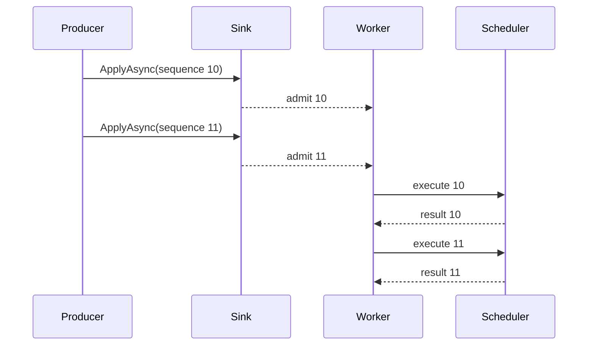

# Live authoring

The live-authoring sample library adapts ordered external updates to one scheduler-owned stage. It
provides data-only update records, pure validation, bounded admission, tail coalescing, scheduler
execution, and ownership of the exact render source used by its consumer.

It is not a renderer, transaction engine, multi-producer ordering service, or OPC UA client. The
external Pump integration described below is outside this repository.

See [Programming model](programming-model.md) for general ownership and scheduler rules and
[Architecture](architecture.md) for the one-owner stage design.

## End-to-end boundary

```mermaid
flowchart LR
    Pump["external Pump"] --> Producer["one serialized producer"]
    Producer --> Sink["QueuedLiveAuthoringSink"]
    Sink --> Executor["UsdStageBatchExecutor"]
    Executor --> Scheduler["UsdStageScheduler"]
    Scheduler --> Changes["ordered change feed"]
    Changes --> Consumer["render consumer"]
    Consumer --> Renderer["renderer on exact source"]
```



The Pump maps external domain values into renderer-neutral batches. The sink controls backpressure and
ordering. The executor applies admitted batches through public stage APIs. The render consumer owns the
change-feed pump and updates its renderer from the exact scheduler and render source supplied by the
host.

## Host ownership

`UsdLiveAuthoringHost` owns:

- one `UsdStageScheduler`;
- one `UsdStageRenderSource` retained from that scheduler;
- one `QueuedLiveAuthoringSink`; and
- the supplied `IUsdStageRenderSourceConsumer`.

The consumer's `AttachAsync` receives both the scheduler and render source. It must not reopen
`stagePath`, because reopening creates another native stage identity and breaks authoring/render
synchronization.

The consumer owns its renderer sessions, render leases, change-feed task, and internal cancellation. The
host invokes `DisposeAsync` on the consumer before releasing the source and scheduler.

The host defaults live edits to the session layer. Select the root layer only when edits are intended to
be persistent and the hosting application also performs the required save operation.

## Batches and validation

A `LiveAuthoringBatch` contains:

- a positive, strictly increasing `Sequence`;
- one or more immutable, data-only `LiveStageUpdate` values;
- the strongest invalidation required by those updates; and
- an optional non-empty `CoalescingKey`.

Construction snapshots relationship targets and known variant lists. Pure managed validation runs
before a batch reaches the scheduler. It checks paths, identifiers, time codes, scalar payloads,
relationship targets, references, payloads, and variant selections.

```csharp
var batch = new LiveAuthoringBatch(
    sequence: 42,
    updates:
    [
        new DefinePrimUpdate("/World/Sensor", "Xform"),
        new SetScalarUpdate(
            "/World/Sensor",
            "userProperties:temperature",
            LiveScalarValue.FromDouble(21.5))
    ],
    coalescingKey: "sensor:/World/Sensor");

LiveAuthoringBatchResult result =
    await host.ApplyAsync(batch, cancellationToken);
```

Updates are applied in list order. The batch invalidation is the maximum invalidation declared by its
updates: property, topology, or composition as appropriate.

Validation is not a transaction. After validation succeeds, a native failure partway through a
multi-update batch does not roll back earlier updates. The caller receives the failure, and any native
changes already made remain part of the stage.

## Producer and ordering contract

`QueuedLiveAuthoringSink` supports one logical producer. That producer may have several outstanding
calls, but it must invoke them in strictly increasing sequence order.

Independent producers must serialize before calling `ApplyAsync`. The admission gate orders racing
calls by admission, not by their sequence values. If sequence 11 is admitted before sequence 10, the
later call is rejected rather than reordered.

After admission, one worker executes batches in queue order. The worker does not reorder, retry, or
parallelize stage edits.



Assign sequences at the serialized producer boundary. Do not derive correctness from wall-clock time,
network arrival order, task scheduling, or a renderer frame number.

## Backpressure and coalescing

The queue has a fixed `QueueCapacity`. When capacity is available, admission reserves a slot and appends
the batch. When capacity is exhausted, a caller waits unless the exact tail-coalescing rule applies.

A newer batch supersedes an older pending batch only when all of these conditions hold:

1. the pending queue is full;
2. the current tail has a non-null coalescing key;
3. the new batch has the same key by ordinal comparison; and
4. the tail is still pending rather than already executing.

The sink does not search earlier queue entries and does not supersede the active batch. A coalesced tail
is replaced by the newest complete snapshot. All waiters for that tail complete with one result whose
sequence range and batch count describe the superseded group.

Use a coalescing key only when the newer batch fully replaces the meaning of the older snapshot. Do not
coalesce deltas, commands with side effects, accumulated counters, or updates whose intermediate order
is significant.

The sink exposes `PendingBatchCount`, `PeakPendingBatchCount`, and `CoalescedBatchCount` for health and
capacity diagnostics.

## Cancellation and disposal

Cancellation has two distinct phases:

| Phase | Result |
| --- | --- |
| Before admission | The batch is not accepted and cannot execute. |
| After admission | The caller's wait may be canceled, but the accepted batch remains ordered work. |

The worker deliberately calls its executor with `CancellationToken.None`. This preserves the queue's
ordering contract after admission. A canceled caller must not resubmit the same logical update with an
old sequence merely because it stopped waiting.

Disposal:

1. stops new admission;
2. wakes callers waiting for queue capacity;
3. drains all accepted batches;
4. completes `Completion`; and
5. disposes the owned executor.

`UsdLiveAuthoringHost.DisposeAsync` then disposes the render consumer, render source, and scheduler in
dependency order. Observe disposal failures; the host aggregates failures from later cleanup steps.

## Render consumer ownership

The consumer is responsible for turning scheduler changes into renderer work. A typical consumer:

1. stores the exact scheduler and source received by `AttachAsync`;
2. creates renderer sessions from that source;
3. starts the sole `ReadChangesAsync` enumeration;
4. coalesces or translates invalidation into renderer-neutral state;
5. serializes render, switch, and stage-change handling; and
6. stops its pump and disposes renderer sessions in `DisposeAsync`.

The scheduler change feed is bounded and has one active reader. When that reader falls behind, queued
notifications coalesce in order. The consumer should treat the notification as invalidation information,
not as an event log containing every authored value.

The consumer must not expose scheduler callbacks or stage-bound objects to the external Pump. Keep the
native stage and renderer lifecycle on the host side of the boundary.

## External Pump boundary

An external Pump adapter owns:

- monitored-value or message semantics;
- reconnect and resubscribe behavior;
- namespace and address mapping;
- conversion into `LiveScalarValue` and other update records;
- the single serialized producer and sequence allocation;
- cancellation policy for callers waiting on admission or completion; and
- health reporting for queue, validation, native, and disposal failures.

The Pump should submit batches and observe every returned task. It should not open the USD stage, call
native APIs, own render leases, or add its domain-specific types to the live-authoring contracts.

This repository does not ship or validate the external OPC UA integration. The sample library is the
boundary that such an integration can consume.

## Operational checklist

- Use one logical producer with positive, strictly increasing sequences.
- Size `QueueCapacity` for bounded bursts, not unbounded retention.
- Use coalescing keys only for complete replaceable snapshots.
- Keep batch updates data-only and NativeAOT-safe.
- Observe every `ApplyAsync` and disposal result.
- Treat cancellation after admission as cancellation of the wait, not of the edit.
- Attach rendering to the host-provided source; never reopen the stage path.
- Keep the consumer's change-feed enumeration singular and bounded.
- Choose session or root edit layers deliberately.
- Do not assume rollback after a native failure.

## Related documentation

- [Programming model](programming-model.md)
- [Architecture](architecture.md)
- [Data API](data-api.md)
- [Rendering](rendering.md)
- [Performance](performance.md)
- [Troubleshooting](troubleshooting.md)
- [Live-authoring sample library](../samples/OpenUsd.LiveAuthoring/README.md)
