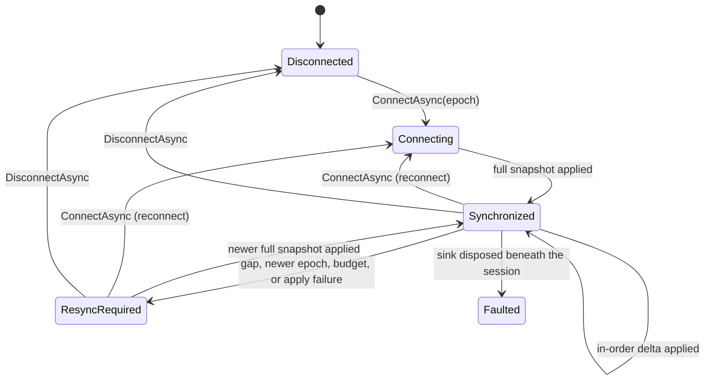
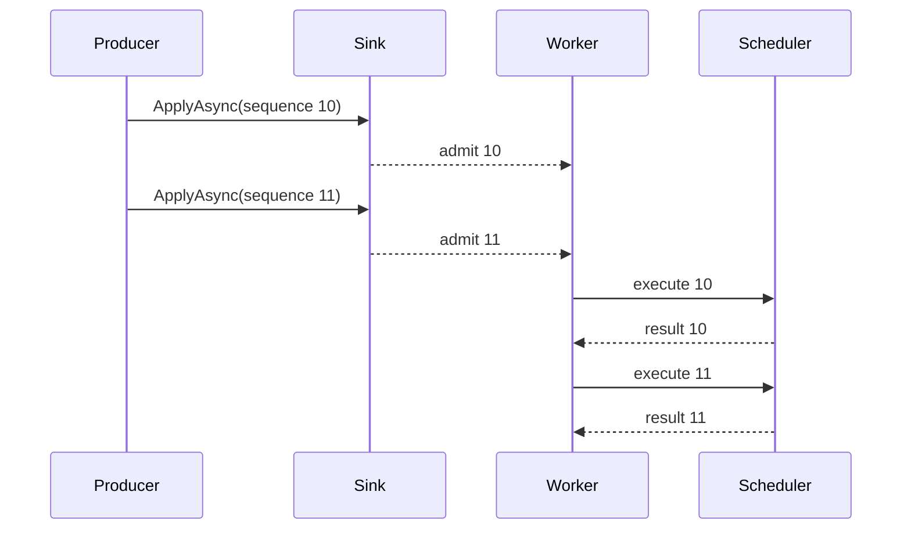

# Live authoring

`OpenUsd.LiveAuthoring` is a supported package that adapts ordered external updates to one
scheduler-owned stage. It provides a bounded, discriminated data model (scalars, arrays, matrices,
metadata, and a curated API-schema registry), pure validation, bounded admission separated from the
eventual applied result, opaque correlation/origin tracking, structured health snapshots and events,
tail coalescing, scheduler execution, ownership of the exact render source used by its consumer, and a
transport-neutral session coordinator with explicit recovery semantics.

`OpenUsd.LiveAuthoring` is published from `src/OpenUsd.LiveAuthoring` with its own
`PublicAPI.Shipped.txt`/`PublicAPI.Unshipped.txt` baseline, the same compatibility discipline as any
other managed package described in [Versioning](versioning-compatibility.md).

It is not a renderer, transaction engine, multi-producer ordering service, distributed merge engine, or
OPC UA client. It adds no network transport: there is no gRPC, protobuf, or WebSocket dependency, and
the wire contract that carries snapshots and deltas lives in the separate, optional
[Omniverse bridge](omniverse-bridge.md) packages. A native or
unsupported-operation failure partway through a validated batch is not rolled back: raw
`QueuedLiveAuthoringSink` partial-failure semantics are explicit and retained by design, not pretended
away. Recovery from such a failure lives in the coordinator described in
[Session recovery](#session-recovery), which converts it into a `ResyncRequired` session rather than
synthesizing a rollback. The external Pump integration described below is outside this repository.

See [Programming model](programming-model.md) for general ownership and scheduler rules and
[Architecture](architecture.md) for the one-owner stage design.

## End-to-end boundary

```mermaid
flowchart LR
    Pump["external Pump"] --> Producer["one serialized producer"]
    Producer --> Sink["QueuedLiveAuthoringSink"]
    Sink --> Executor["UsdStageBatchExecutor"]
    Executor --> Scheduler["UsdStageScheduler"]
    Scheduler --> Changes["ordered change feed"]
    Changes --> Consumer["render consumer"]
    Consumer --> Renderer["renderer on exact source"]
```



The Pump maps external domain values into renderer-neutral batches. The sink controls backpressure and
ordering. The executor applies admitted batches through public stage APIs. The render consumer owns the
change-feed pump and updates its renderer from the exact scheduler and render source supplied by the
host.

## Host ownership

`UsdLiveAuthoringHost` owns:

- one `UsdStageScheduler`;
- one `UsdStageRenderSource` retained from that scheduler;
- one `QueuedLiveAuthoringSink`; and
- the supplied `IUsdStageRenderSourceConsumer`.

The consumer's `AttachAsync` receives both the scheduler and render source. It must not reopen
`stagePath`, because reopening creates another native stage identity and breaks authoring/render
synchronization.

The consumer owns its renderer sessions, render leases, change-feed task, and internal cancellation. The
host invokes `DisposeAsync` on the consumer before releasing the source and scheduler.

The host defaults live edits to the session layer. Select the root layer only when edits are intended to
be persistent and the hosting application also performs the required save operation.

## Batches and validation

A `LiveAuthoringBatch` contains:

- a positive, strictly increasing `Sequence`;
- one or more immutable, data-only `LiveStageUpdate` values, bounded to
  `LiveAuthoringValidation.MaxUpdatesPerBatch`;
- the strongest invalidation required by those updates;
- an optional non-empty `CoalescingKey`, bounded to `LiveAuthoringValidation.MaxTextValueLength`; and
- optional opaque `CorrelationId`/`OriginId` strings, bounded to
  `LiveAuthoringValidation.MaxOpaqueIdLength` characters, that this library never interprets.

Construction snapshots relationship targets, known variant lists, and orientation arrays. Pure managed
validation runs before a batch reaches the scheduler. It checks paths, identifiers, time codes,
attribute payloads (including array element text), relationship targets, references, payloads,
variant selections, metadata keys, API-schema tokens, and opaque-ID length/content.

```csharp
var batch = new LiveAuthoringBatch(
    sequence: 42,
    updates:
    [
        new DefinePrimUpdate("/World/Sensor", "Xform"),
        new SetAttributeUpdate(
            "/World/Sensor",
            "userProperties:temperature",
            LiveAttributeValue.FromDouble(21.5))
    ],
    coalescingKey: "sensor:/World/Sensor",
    correlationId: "opcua-sub-42");

LiveAuthoringAdmissionReceipt receipt = await host.ApplyAsync(batch, cancellationToken);
LiveAuthoringBatchResult result = await receipt.WaitForResultAsync(cancellationToken);
```

Updates are applied in list order. The batch invalidation is the maximum invalidation declared by its
updates: property, topology, or composition as appropriate.

Validation is not a transaction. After validation succeeds, a native or unsupported-operation failure
partway through a multi-update batch does not roll back earlier updates. The caller observes the
failure through the admission receipt's `Applied` task, and any changes already made remain part of the
stage. This is deliberate: pretending every batch is atomic would hide exactly the failures a health
observer needs to see.

## Bounds and finiteness

Every limit is a public constant on `LiveAuthoringValidation`, so a producer can size its own buffers
against the same numbers this library enforces:

- `MaxUpdatesPerBatch` — updates in one batch.
- `MaxOpaqueIdLength` — a `CorrelationId` or `OriginId`.
- `MaxIdentifierLength` — an attribute/relationship/variant-set/variant name, schema token, prim type
  name, or metadata key.
- `MaxPathLength` — an absolute prim path, including relationship targets and reference/payload target
  prim paths.
- `MaxTextValueLength` — a coalescing key, asset path, or scalar/array string/token value.
- `MaxCollectionElementCount` — relationship targets, known variants, one attribute array, or one
  orientation array.
- `MaxTotalCollectionElementCountPerBatch` — the combined relationship/variant/array/orientation
  element count across one whole batch, an aggregate cap even when no single collection is at its own
  limit.
- `MaxEstimatedBatchPayloadBytes` — the combined estimated retained byte size across one whole batch:
  every text value (identifiers, prim paths, asset paths, metadata keys/strings, scalar and array
  string/token values, and the batch's own coalescing key/correlation/origin) counted as its UTF-8 byte
  length, plus every numeric scalar and array value counted at its natural in-memory size. Element-count
  bounds alone do not bound retained memory: `MaxTotalCollectionElementCountPerBatch` string elements at
  `MaxTextValueLength` characters each could retain tens of gigabytes without this separate byte budget.
  16 MiB is sized for a bounded, high-rate live-authoring burst, not a bulk scene dump; split a larger
  payload across several ordered batches instead of raising this bound.
- `MaxBridgeOverlayUpdates` — the authored opinions in one bridge-owned overlay, and therefore in one
  full snapshot.
- `MaxBridgeOverlayPayloadBytes` — the estimated retained payload of one bridge-owned overlay, measured
  the same way as `MaxEstimatedBatchPayloadBytes` but deliberately smaller, so an overlay at its own
  limit still fits inside the single replacement batch that carries it.
- `MaxReplayWindowLength`, `DefaultReplayWindowLength`, `ReplayLedgerEntryBytes`, and
  `MaxReplayLedgerBytes` — the bounds on the session replay ledger described in
  [The replay ledger](#the-replay-ledger). An entry holds one sequence and one fixed-size fingerprint,
  never the delta payload, so ledger retention does not grow with message size.

Every `double`, `float`, `Vec2f`/`Vec3f`/`Color3f`, `Matrix4d`, and quaternion orientation value —
scalar or array element — must be finite. `NaN` and positive/negative infinity are rejected at
validation time with an `ArgumentOutOfRangeException`, before the value can reach the scheduler or the
stage.

`LiveAttributeValue.From*Array` (and the point-instancer orientation snapshot) enforce
`MaxCollectionElementCount`, and text array factories additionally enforce `MaxTextValueLength` per
element, before copying their input. An oversized collection is rejected as soon as a caller constructs
the value — with a bounded `ArgumentException`, not an unbounded allocation followed later by rejection
once the value reaches a batch. Every arithmetic accumulation behind these bounds is overflow-checked,
so a hypothetical overflow surfaces as the same bounded `ArgumentException` rather than an unhandled
`OverflowException`.

## Data model

`LiveStageUpdate` is a closed, discriminated hierarchy. Related concerns share one bounded, discriminated
type instead of one shallow type per USD primitive:

- `DefinePrimUpdate`, `RemovePrimUpdate` — prim existence.
- `SetActiveUpdate`, `SetInstanceableUpdate` — prim classification.
- `SetAttributeUpdate` carries one `LiveAttributeValue`: Boolean/Int64/Double/String/Token/Vec3f
  scalars, `Matrix4d`, and Int32/Float/Double/Vec2f/Vec3f/Color3f/Boolean/Token/String arrays.
- `ClearUpdate` explicitly clears an attribute value, relationship targets, references, payloads, or
  one metadata field, discriminated by `LiveClearTargetKind`.
- `SetRelationshipTargetsUpdate`, `SetReferenceUpdate`, `SetPayloadUpdate` — relationship and
  composition arcs (replace-with-one semantics).
- `SetVariantSelectionUpdate` — known variant set and selection; a `null` selection already clears it.
- `SetMetadataUpdate` carries one `LiveMetadataValue`: Boolean/Int64/Double/String prim metadata.
- `ApiSchemaUpdate` applies or removes a single-apply API schema by bare token, discriminated by
  `LiveApiSchemaOperation`.
- `SetPointInstancerOrientationsUpdate` authors a `UsdGeomPointInstancer` quaternion orientation array
  through the existing typed facade.
- `ReplaceBridgeOverlayUpdate` replaces one bridge-owned overlay subtree with a complete snapshot inside
  a single scheduler edit. It is the only update that removes and re-authors a whole subtree, it must be
  the only update in its batch, it cannot nest another replacement, and every nested update must target
  its bridge root or a descendant. See [Session recovery](#session-recovery).

`LiveAttributeValue` and `LiveMetadataValue` are NativeAOT-safe discriminated unions: every payload maps
to an existing typed `UsdPrim` accessor (`SetDouble`, `SetVec3f`, `SetMatrix4d`, `SetDoubleArray`, and so
on), so the executor never introduces a new native entry point or per-element P/Invoke.

`ApiSchemaUpdate` only supports a bounded, curated registry of schema tokens with an existing typed
OpenUSD apply API, exposed as `UsdStageBatchExecutor.SupportedApiSchemaTokens` (currently
`SkelBindingAPI`, `AssetPreviewsAPI`, `NodeGraphNodeAPI`, and `SceneGraphPrimAPI`). Applying an unlisted
token, or removing any schema, throws an explicit `NotSupportedException` rather than silently doing
nothing: no underlying OpenUSD typed API exposes generic schema removal yet.

Positions, velocities, and scales for a `UsdGeomPointInstancer` are ordinary Vec3f-array
`SetAttributeUpdate`s against the `"positions"`, `"velocities"`, and `"scales"` attribute names — the
same generic path the schema facade itself uses. Only quaternion orientations need a dedicated update
type, because the underlying typed API is schema-specific, not a generic named attribute.

## Admission and observability

`ILiveAuthoringSink.ApplyAsync` returns a `LiveAuthoringAdmissionReceipt` as soon as a batch is admitted
(enqueued or coalesced into a pending tail), separated from the eventual applied result:

```csharp
LiveAuthoringAdmissionReceipt receipt = await sink.ApplyAsync(batch);
// The batch is queued in strict sequence order as soon as this line returns; receipt.Sequence,
// receipt.CorrelationId, and receipt.OriginId are the sequence acknowledgement. This is an
// in-process memory guarantee, not a durability guarantee: a process crash before Applied
// completes discards any batch that has not yet reached the stage.
LiveAuthoringBatchResult result = await receipt.Applied;
// Or: await receipt.WaitForResultAsync(cancellationToken) to cancel only this caller's wait.
```

Cancelling a `WaitForResultAsync` wait never cancels the underlying edit: `Applied` keeps running to
completion regardless, because the batch was already admitted as ordered work.

`QueuedLiveAuthoringSink` exposes two observability surfaces:

- `GetHealthSnapshot()` returns a bounded `LiveAuthoringHealthSnapshot` — capacity, pending/peak/coalesced
  counts, accepting state, and the last admitted/applied/failed sequence and a length-capped failure
  detail — suitable for polling from an external health endpoint.
- An optional `IProgress<LiveAuthoringHealthEvent>` (`UsdLiveAuthoringOptions.HealthObserver`, or passed
  directly to the `QueuedLiveAuthoringSink` constructor) receives bounded, length-capped `Admitted`,
  `Coalesced`, `Rejected`, `Applied`, `Failed`, and `Disposed` events as they happen.

The existing queue metrics (`Capacity`, `PendingBatchCount`, `PeakPendingBatchCount`,
`CoalescedBatchCount`) remain available directly on `QueuedLiveAuthoringSink` alongside the snapshot.

A caller-supplied health observer is untrusted code running inline on the admission or worker path.
`QueuedLiveAuthoringSink` isolates every exception the observer's `Report` throws: it is never rethrown
to `ApplyAsync` or an executing batch, so a broken observer can neither fail admission nor lose an
already-admitted batch. Instead, `GetHealthSnapshot().HealthObserverFailureCount` and
`.LastHealthObserverFailureDetail` (and the equivalent `QueuedLiveAuthoringSink.HealthObserverFailureCount`
property) count and record the most recent observer failure so a misbehaving observer is discoverable
without changing the sink's own admission or execution semantics.

## Session recovery

`LiveAuthoringSessionCoordinator` adds recovery on top of the sink without changing it. The sink still
admits, orders, coalesces, and applies batches exactly as documented above; the coordinator is one more
producer in front of it that owns session state and converts an applied-result failure into an explicit
resync instead of a rollback.

It is transport-neutral by construction. An adapter decodes whatever wire format it uses into
`LiveAuthoringSnapshot` and `LiveAuthoringDelta` values and calls the coordinator. No socket, protocol
negotiation, or serializer is involved, so every recovery rule below is testable without networking.

### Session states

| State | Accepts | Meaning |
| --- | --- | --- |
| `Disconnected` | `ConnectAsync` | No remote epoch is bound. |
| `Connecting` | a full snapshot | An epoch is bound but there is no agreed baseline yet. |
| `Synchronized` | in-order deltas, newer snapshots | A baseline exists and deltas apply. |
| `ResyncRequired` | a newer full snapshot | The baseline is lost; deltas are rejected. |
| `Stopping` | nothing | Disposal or disconnect is draining in-flight work. |
| `Faulted` | disconnect, disposal | The underlying sink is gone; operator attention is required. |



### Identity, ordering, and loop prevention

`LiveAuthoringRemoteEpoch` names the one authoritative remote origin, its session identifier, and the
epoch generation. Sequence numbers are only comparable inside one epoch, so a remote that restarts must
advance the epoch rather than resume a stale numbering.

| Inbound condition | Outcome |
| --- | --- |
| Session is not `Synchronized` | `Rejected` (`SessionState` / `ResyncRequired`) — checked first |
| Different remote origin or session identifier | `Rejected` (`RemoteOrigin` / `SessionIdentity`) |
| Older epoch | `Rejected` (`EpochRetired`) |
| Newer epoch | `Rejected` (`EpochAdvanced`) and the session enters `ResyncRequired` |
| Retained sequence, identical fingerprint | `Duplicate` — idempotent, never applied twice |
| Retained sequence, different fingerprint | `Rejected` (`DuplicateConflict`) and `ResyncRequired` |
| At or below the last accepted sequence, outside the window | `Rejected` (`ReplayExpired`) and `ResyncRequired` |
| Sequence exactly one above the last accepted sequence | applied |
| Sequence more than one above | `Rejected` (`SequenceGap`) and `ResyncRequired` |
| `OriginId` equals the coordinator's `LocalOriginId` | `LoopSuppressed` — an echo, not re-authored |
| Target outside the bridge root | `Rejected` (`BridgeScope`) |
| Applying it would exceed the overlay bounds | `Rejected` (`OverlayBudget`) and `ResyncRequired` |
| Admitted but failed while applying | `Rejected` (`ApplyFailed`) and `ResyncRequired` |

Order matters, and the table is in evaluation order. Identity is checked before loop suppression on
purpose: a message that names a different session, a retired epoch, or an unbound session is not a
harmless echo of a local edit even when it carries the local origin identifier, and reporting it as one
would hide a misrouted or stale producer behind a benign outcome.

Loop prevention is the reason both `OriginId` values exist. Local edits carry `LocalOriginId`, the
remote echoes them back, and the coordinator suppresses that echo instead of reapplying it. A suppressed
echo still consumes its remote sequence and is folded into the overlay model: the content is already on
the stage because the local edit authored it, and skipping the sequence would make the next in-order
delta look like a gap and force a resync on every round trip.

`LocalOriginId` is therefore an identity, not a label, and it has no shared default. Left unset it
resolves through `LiveAuthoringSessionOptions.LocalOriginIdFactory`, or through
`LiveAuthoringOriginId.CreateProcessInstanceUnique()` when no factory is supplied — a value naming
the process, the instance sequence within it, and eight bytes of entropy. A literal shared by two
coordinators in one process would make each suppress the other's edits as its own echoes, so those
edits would be acknowledged and never authored. `LocalOriginIdFactory` exists so a test can fix the
identity without a shared literal reappearing as the production default, and
`LiveAuthoringSessionCoordinator.LocalOriginId` reports the resolved value an adapter must publish
under.

Every opaque identity the coordinator accepts — origin, session, and correlation identifiers — must
also be well-formed UTF-16. An unpaired surrogate has no UTF-8 encoding, and the default encoder
substitutes U+FFFD instead of failing, so two distinct identifiers would collapse into one set of
bytes: one replay fingerprint, one idempotency key, one origin comparison.
`LiveAuthoringValidation.IsWellFormedUtf16` is the check, applied before anything encodes or hashes
the value.

### The replay ledger

A duplicate acknowledgement is a promise that nothing was lost, so it must be backed by evidence that
the replayed message really is the one already accepted. Comparing sequence numbers alone cannot do
that: a producer that reuses a sequence for different content would be silently acknowledged while the
two sides diverge.

`LiveAuthoringSessionCoordinator` therefore keeps a bounded replay ledger of recently accepted remote
sequences and a content fingerprint for each. The fingerprint is a SHA-256 digest over a canonical
encoding of the epoch identity, the effective origin (the delta's own origin, or the authoritative
remote origin when it omits one), the correlation identifier, the coalescing key, and the canonical
update payload — never reference identity and never a synthesized `ToString`, which would compare array
properties by type name and call two completely different payloads identical.

- Identical fingerprint inside the window → `Duplicate`, acknowledged idempotently, nothing applied.
- Different fingerprint inside the window → `DuplicateConflict` and `ResyncRequired`. Two different
  messages cannot occupy the same place in one ordered stream.
- At or below the last accepted sequence but outside the window → `ReplayExpired` and `ResyncRequired`.
  The session cannot prove the replay is harmless, and claiming an unprovable duplicate is exactly the
  silent divergence the ledger exists to prevent.

The ledger is bounded in both entries and bytes. `LiveAuthoringSessionOptions.ReplayWindowLength`
(default `LiveAuthoringValidation.DefaultReplayWindowLength`, capped at
`LiveAuthoringValidation.MaxReplayWindowLength`) sets the retained entry count, and each entry costs a
fixed `LiveAuthoringValidation.ReplayLedgerEntryBytes` — one sequence and one digest, never the payload
— so retention cost is independent of message size. `LiveAuthoringValidation.MaxReplayLedgerBytes` caps
the ledger independently of the configured length. `GetStatus()` exposes `ReplayWindowLength`,
`ReplayLedgerCount`, `ReplayLedgerBytes`, and `OldestRetainedSequence`.

Size `ReplayWindowLength` at or above the deepest retransmission an adapter can perform after a
transport hiccup. A window that is too small turns a legitimate retransmission into a full resync
instead of a cheap acknowledgement.

The ledger belongs to one epoch agreement. Connecting, reconnecting, disconnecting, and applying a full
snapshot all clear it, because sequences from a previous agreement can be neither duplicates nor
conflicts of the new one — and because a new epoch may legitimately reuse the same sequence numbers.

### The bridge-owned overlay

Recovery replaces one bounded, bridge-owned overlay and nothing else. `BridgeRootPath` (default
`/Bridge`) must be reserved for the bridge; every snapshot and delta update must target that root or a
descendant of it, and anything else is rejected before it reaches the stage.

A full snapshot is applied as a single `ReplaceBridgeOverlayUpdate`, which must be the only update in
its batch. `UsdStageBatchExecutor` handles it inside one scheduler edit:

1. re-validate every nested update against the bridge root while the previous overlay is still intact;
2. remove the bridge root's opinions from the current edit-target layer;
3. re-define the bridge root anchor; and
4. apply every nested update in order.

Removal targets the current edit-target layer only. A user-edit layer, a `UsdSessionOverlay` physics
overlay, and the root layer keep every opinion they hold outside the bridge root, which is what makes
"replace the overlay" safe to run at any time. If a nested update fails partway through, the executor
removes the bridge root again before rethrowing, so the overlay is left empty — a well-defined state a
newer snapshot can replace — rather than a partial mixture of two snapshots.

Because the whole replacement runs inside one serialized scheduler edit, no other stage operation and no
render consumer observes an intermediate overlay.

### Snapshots are bounded, not whole-scene dumps

`LiveAuthoringValidation.MaxBridgeOverlayUpdates` bounds the authored opinions in one overlay and
`MaxBridgeOverlayPayloadBytes` bounds its estimated retained payload. The byte budget is deliberately
smaller than `MaxEstimatedBatchPayloadBytes` so an overlay at its own limit still fits inside the
replacement batch that carries it. A scene larger than these bounds belongs in a referenced layer, not
in a live bridge message.

The coordinator keeps an in-memory model of exactly what the bridge authored, keyed by prim path,
opinion kind, name, and time code. That is why `ExportSnapshot()` and `ExportOverlayUpdates()` are
deterministic and never claim opinions the bridge does not own: reading the composed stage back would
report root-layer, user, and physics contributions too. Re-authoring the same opinion supersedes it
instead of accumulating, a `RemovePrimUpdate` drops the whole subtree, and a `ClearUpdate` drops exactly
the slots that clear would revert, so an exported snapshot rebuilds the same overlay on a fresh session.

### No per-batch checkpoints

An incremental failure never triggers a checkpoint, a rollback, or a repair edit. The session moves to
`ResyncRequired`, rejects every further delta, and waits for a newer full snapshot. This is the
deliberate trade the plan calls for: high-rate transform traffic must not pay for a checkpoint on every
batch, and a bounded overlay replacement is cheap enough to be the only recovery path.

The candidate overlay model is adopted only after the stage edit succeeds, so a rejected or failed delta
never leaves the model describing content the stage does not hold.

```csharp
var coordinator = new LiveAuthoringSessionCoordinator(
    host.Sink,
    new LiveAuthoringSessionOptions
    {
        BridgeRootPath = "/Bridge",
        LocalOriginId = "openusd-viewer"
    });

var epoch = new LiveAuthoringRemoteEpoch("kit-bridge", sessionId, generation);
await coordinator.ConnectAsync(epoch, cancellationToken);
await coordinator.ApplySnapshotAsync(snapshot, cancellationToken);

LiveAuthoringSessionResult result = await coordinator.ApplyDeltaAsync(delta, cancellationToken);
if (result.Rejection == LiveAuthoringSessionRejection.SequenceGap)
{
    // The adapter requests a new full snapshot; deltas stay rejected until one succeeds.
}
```

### Observability and disposal

`GetStatus()` returns a bounded `LiveAuthoringSessionStatus`: state, remote origin/session/epoch, last
accepted and applied sequences, applied/duplicate/rejected/loop-suppressed counts, resync count, overlay
prim and update counts, replay-window length and ledger count/bytes/oldest retained sequence, a
length-capped failure detail, and session-observer failure count/detail. An
optional `IProgress<LiveAuthoringSessionEvent>` receives the same information as bounded events. Like the
sink's health observer, a session observer is untrusted code: every exception it throws is caught,
counted, and recorded, never allowed to change acceptance or rejection semantics.

Disposal is deterministic. Every operation is serialized on one gate, and disposal waits for the
in-flight operation, cancels admission for anything queued behind it, clears the session, optionally
disposes the sink when `OwnsSink` is set, and reports one `Disposed` event. It is idempotent, and later
operations throw `ObjectDisposedException`.

Cancellation applies to admission only. Once a batch is admitted the coordinator always observes its
applied result, because an admitted batch will reach the stage regardless and abandoning the wait would
let the overlay model and the stage diverge.

## Producer and ordering contract

`QueuedLiveAuthoringSink` supports one logical producer. That producer may have several outstanding
calls, but it must invoke them in strictly increasing sequence order.

Independent producers must serialize before calling `ApplyAsync`. The admission gate orders racing
calls by admission, not by their sequence values. If sequence 11 is admitted before sequence 10, the
later call is rejected rather than reordered.

After admission, one worker executes batches in queue order. The worker does not reorder, retry, or
parallelize stage edits.



Assign sequences at the serialized producer boundary. Do not derive correctness from wall-clock time,
network arrival order, task scheduling, or a renderer frame number.

## Backpressure and coalescing

The queue has a fixed `QueueCapacity`. When capacity is available, admission reserves a slot and appends
the batch. When capacity is exhausted, a caller waits unless the exact tail-coalescing rule applies.

A newer batch supersedes an older pending batch only when all of these conditions hold:

1. the pending queue is full;
2. the current tail has a non-null coalescing key;
3. the new batch has the same key by ordinal comparison; and
4. the tail is still pending rather than already executing.

The sink does not search earlier queue entries and does not supersede the active batch. A coalesced tail
is replaced by the newest complete snapshot. All waiters for that tail observe the same coalesced
sequence range, batch count, and actual execution outcome (invalidation, change serials, edit target
layer), but each waiter's own result preserves that specific caller's opaque `CorrelationId`/`OriginId`
exactly as it submitted them: a superseded caller must never see another caller's correlation value in
its own result, even though the underlying edit only ran once.

Use a coalescing key only when the newer batch fully replaces the meaning of the older snapshot. Do not
coalesce deltas, commands with side effects, accumulated counters, or updates whose intermediate order
is significant.

The sink exposes `PendingBatchCount`, `PeakPendingBatchCount`, and `CoalescedBatchCount` for health and
capacity diagnostics.

## Cancellation and disposal

Cancellation has two distinct phases:

| Phase | Result |
| --- | --- |
| Before admission | The batch is not accepted and cannot execute; `ApplyAsync` throws. |
| After admission | Only the caller's own wait may be canceled; the batch stays ordered work and executes. |

The worker deliberately calls its executor with `CancellationToken.None`. This preserves the queue's
ordering contract after admission. A canceled caller must not resubmit the same logical update with an
old sequence merely because it stopped waiting on the applied result.

Disposal:

1. stops new admission;
2. wakes callers waiting for queue capacity;
3. drains all accepted batches;
4. completes `Completion`; and
5. disposes the owned executor.

`UsdLiveAuthoringHost.DisposeAsync` then disposes the render consumer, render source, and scheduler in
dependency order. Observe disposal failures; the host aggregates failures from later cleanup steps.

## Render consumer ownership

The consumer is responsible for turning scheduler changes into renderer work. A typical consumer:

1. stores the exact scheduler and source received by `AttachAsync`;
2. creates renderer sessions from that source;
3. starts the sole `ReadChangesAsync` enumeration;
4. coalesces or translates invalidation into renderer-neutral state;
5. serializes render, switch, and stage-change handling; and
6. stops its pump and disposes renderer sessions in `DisposeAsync`.

The scheduler change feed is bounded and has one active reader. When that reader falls behind, queued
notifications coalesce in order. The consumer should treat the notification as invalidation information,
not as an event log containing every authored value.

The consumer must not expose scheduler callbacks or stage-bound objects to the external Pump. Keep the
native stage and renderer lifecycle on the host side of the boundary.

## External Pump boundary

An external Pump adapter owns:

- monitored-value or message semantics;
- reconnect and resubscribe behavior;
- namespace and address mapping;
- conversion into `LiveAttributeValue` and other update records;
- the single serialized producer and sequence allocation;
- cancellation policy for callers waiting on admission or the applied result; and
- health reporting for queue, validation, native, and disposal failures — optionally by forwarding
  `LiveAuthoringHealthEvent`s from a `HealthObserver` to its own health endpoint.

The Pump should submit batches and observe every admission receipt's `Applied` task. It should not open
the USD stage, call native APIs, own render leases, or add its domain-specific types to the
live-authoring contracts.

This repository does not ship or validate the external OPC UA integration. `OpenUsd.LiveAuthoring` is a
supported package dependency for such an integration, not a source pattern to vendor.

### OPC UA Pump spike findings and resolution

The `opcua-pump-spike` package-consumer test models the Pump outside this repository. Its external
adapter defines its own `IUsdSink` and `OpenUsdStageSink`, consumes local packages for shipped
OpenUSD assemblies (including `OpenUsd.LiveAuthoring` itself), and maps ordered simulated OPC UA
samples into the real `ILiveAuthoringSink` and `LiveAuthoringBatch` types. The test executor records
every `custom:sourceSequence` time sample and fails on the first gap, duplicate, drop, or reorder.

The real public names are:

- `ILiveAuthoringSink`, not `IUsdSink`;
- `UsdLiveAuthoringHost`, `QueuedLiveAuthoringSink`, and `UsdStageBatchExecutor`, not
  `OpenUsdStageSink`; and
- `LiveAuthoringBatch` for ordered update groups.

An earlier revision of this document tracked six API gaps found by the first external ordered-update
consumer. This productization pass closes them:

1. **Package status.** `OpenUsd.LiveAuthoring` moved from `samples/` to `src/OpenUsd.LiveAuthoring` and
   is now a supported, published package with a `PublicAPI` baseline, not a source-only sample. A Pump
   references it as an ordinary `PackageReference`.
2. **Admission versus applied result.** `ILiveAuthoringSink.ApplyAsync` now returns a
   `LiveAuthoringAdmissionReceipt` as soon as a batch is admitted. The receipt's `Applied` task is the
   separate eventual execution result, so an external producer can have several admitted-but-not-yet-
   applied batches without serializing its own submission around full execution.
3. **Sequence enforcement** remains strictly "in call/admission order" by design: the sink still rejects
   a late lower sequence instead of buffering or reordering. Multi-callback OPC UA clients still need
   their own single producer, source-sequence gap detection, and reconnect/resubscribe policy before
   calling OpenUSD; that ordering policy was correct and is unchanged.
4. **Correlation.** `LiveAuthoringBatch` now accepts an opaque `CorrelationId`/`OriginId` pair that this
   library never interprets. Both are echoed on the admission receipt and the applied
   `LiveAuthoringBatchResult`, so a Pump no longer needs to encode a source sequence as a USD attribute
   update merely to prove delivery.
5. **Data-model coverage.** The update set now includes bounded arrays (Int32/Float/Double/Vec2f/Vec3f/
   Color3f/Boolean/Token/String), a `Matrix4d` scalar, `UsdGeomPointInstancer` quaternion orientations,
   prim metadata (`SetMetadataUpdate`), a curated single-apply API-schema registry (`ApiSchemaUpdate`),
   and explicit clear/remove operations (`ClearUpdate`) for attribute values, relationship targets,
   references, payloads, and metadata — discriminated bounded value/update models rather than one
   shallow type per primitive.
6. **Structured health.** `QueuedLiveAuthoringSink.GetHealthSnapshot()` returns a bounded point-in-time
   snapshot, and an optional `IProgress<LiveAuthoringHealthEvent>` observer receives bounded, structured
   `Admitted`/`Coalesced`/`Rejected`/`Applied`/`Failed`/`Disposed` events. The existing pull-only queue
   metrics (`PendingBatchCount`, `PeakPendingBatchCount`, `CoalescedBatchCount`) remain available
   alongside these.

What remains deliberately out of scope for this pass is the wire contract itself — a versioned message
schema and its gRPC or WebSocket adapter. Recovery semantics (`ResyncRequired`, bounded snapshot
export/import, idempotent replay, reconnect, and loop prevention) are implemented and described in
[Session recovery](#session-recovery); they were deliberately settled before the transport so the wire
contract can encode an already-proven state machine instead of inventing one.

## Operational checklist

- Use one logical producer with positive, strictly increasing sequences.
- Size `QueueCapacity` for bounded bursts, not unbounded retention.
- Use coalescing keys only for complete replaceable snapshots.
- Keep batch updates data-only, NativeAOT-safe, within the `LiveAuthoringValidation` bounds, and finite.
- Observe every admission receipt's `Applied` task, or attach a `HealthObserver`, and every disposal
  result.
- Treat cancellation after admission as cancellation of the wait, not of the edit.
- Reserve the bridge root path for the bridge, and keep user and physics content outside it.
- Treat `ResyncRequired` as a request for a newer full snapshot, never as a retry of the rejected delta.
- Advance the epoch whenever a remote loses its outbound ordering; never resume stale sequences.
- Size `ReplayWindowLength` at or above the adapter's deepest retransmission, and never reuse a remote
  sequence for different content: a reused sequence is a `DuplicateConflict`, not a free retry.
- Attach rendering to the host-provided source; never reopen the stage path.
- Keep the consumer's change-feed enumeration singular and bounded.
- Choose session or root edit layers deliberately.
- Do not assume rollback after a native failure.
- Do not assume admission is durable across a process crash or restart.
- Make a `HealthObserver` implementation exception-safe internally where possible; the sink isolates and
  counts observer failures, but it cannot recover state the observer itself corrupted.

## Related documentation

- [Programming model](programming-model.md)
- [Architecture](architecture.md)
- [Omniverse bridge](omniverse-bridge.md)
- [Data API](data-api.md)
- [Rendering](rendering.md)
- [Performance](performance.md)
- [Troubleshooting](troubleshooting.md)
- [Versioning](versioning-compatibility.md)
- [`OpenUsd.LiveAuthoring` package](../src/OpenUsd.LiveAuthoring/README.md)
- [Executable sample](../samples/OpenUsd.LiveAuthoring.Sample/README.md)
