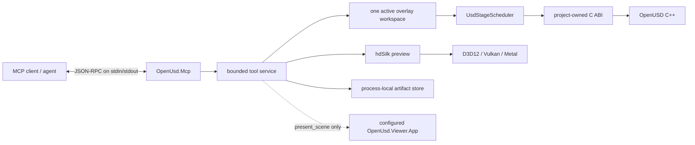

# OpenUSD MCP server

`OpenUsd.Mcp` is a local Model Context Protocol (MCP) stdio server for bounded,
transactional inspection, editing, preview, analysis, and finalization of OpenUSD scenes.
It gives an agent typed operations rather than arbitrary USDA, native handles, shell access,
or unrestricted filesystem access. Install the framework-dependent .NET tool package
`OpenUsd.Mcp.Tool` to get the `openusd-mcp` command, run the host from source, or create a
self-contained RID bundle.

**On this page:** [Architecture](#architecture-and-session-model) ·
[Prerequisites](#prerequisites) · [Install](#install-the-net-tool) ·
[Run from source](#run-from-source) ·
[RID bundles](#publish-a-local-rid-bundle) · [Client configuration](#client-configuration) ·
[Security](#path-roots-and-containment) · [Tools](#tool-reference) ·
[Resources](#artifact-resources) · [Workflow](#end-to-end-agent-workflow) ·
[Troubleshooting](#troubleshooting) · [Support](#support-matrix) · [Testing](#testing)

## Architecture and session model



One server process owns **at most one active scene session**. `open_scene` opens a source
stage read-only and creates an isolated `overlay.usda`, manifest, journal, checkpoint
directory, and output directory. All later scene tools carry the exact `sessionId`,
`generation`, and `stageRevision` returned by the preceding successful operation.
`close_scene` deterministically releases the session before another scene can be opened.

The two revision values are optimistic concurrency coordinates:

- `generation` advances after `apply_edits`, `apply_proposals`, or `rollback_scene`.
- `stageRevision` is refreshed from the native stage and must also match exactly.
- `checkpoint_scene`, inspection, analysis, preview, and finalization do not advance either
  value.
- A stale coordinate fails with `stale_revision`; a foreign session ID fails with
  `stale_session`.

The server serializes service operations and keeps OpenUSD C++ objects behind the
project-owned C ABI and scheduler. Tool results are detached, bounded DTOs; scene or render
hot paths do not perform per-element P/Invoke.

## Prerequisites

- The **.NET 10 SDK or runtime** for the `OpenUsd.Mcp.Tool` package. Repository source builds
  require the pinned **.NET SDK 10.0.301**; `global.json` disables roll-forward.
- One supported host/RID: `win-x64`, `linux-x64`, or `osx-arm64`.
- For actual scene operations, a matching Core and Imaging native runtime. The .NET tool package
  does not embed Core, Imaging, hdSilk, or OpenUSD plugin assets. A repository source run uses
  `native/install/<rid>` and `native/install/shim/<rid>`; a self-contained RID bundle stages the
  same assets beside the executable. Core is needed to open and edit stages. Imaging, hdSilk,
  plugin metadata, and a working graphics API are needed for `render_preview`.
- Windows preview uses D3D12 and defaults to WARP; Linux uses Vulkan; macOS uses Metal.
  Platform loader/device prerequisites from [Rendering](rendering.md) still apply.
- `present_scene` additionally requires a separately built `OpenUsd.Viewer.App` executable.
  The MCP server never auto-launches it.

Install .NET 10 from the official .NET distribution for tool-package use. For repository work,
run `./eng/install-dotnet.ps1` on Windows or `bash ./eng/install-dotnet.sh` on Linux/macOS if
`dotnet --version` is not `10.0.301`.

Restore and build before using the source command:

```powershell
dotnet restore OpenUsd.slnx
dotnet build OpenUsd.slnx -c Release
```

## Install the .NET tool

Install the command for the current user:

```shell
dotnet tool install --global OpenUsd.Mcp.Tool
openusd-mcp
```

The second command starts a stdio protocol server and waits for an MCP client; it does not print a
human-oriented prompt. Use `Get-Command openusd-mcp` in PowerShell or `command -v openusd-mcp` in
bash to verify command discovery. The global tool directory must be on the `PATH` inherited by
Copilot CLI.

To pin a release, add `--version <VERSION>`. Update or remove the global tool with:

```shell
dotnet tool update --global OpenUsd.Mcp.Tool
dotnet tool uninstall --global OpenUsd.Mcp.Tool
```

For a repository-local manifest:

```shell
dotnet new tool-manifest --output .config
dotnet tool install OpenUsd.Mcp.Tool
dotnet tool run openusd-mcp
```

Commit `.config/dotnet-tools.json` when collaborators should restore the same pinned version, then
use `dotnet tool restore`. Update or remove that manifest entry with
`dotnet tool update OpenUsd.Mcp.Tool` or `dotnet tool uninstall OpenUsd.Mcp.Tool`.

For an isolated command directory instead of a global or manifest install:

```shell
dotnet tool install --tool-path <TOOL_PATH> OpenUsd.Mcp.Tool
```

Invoke `<TOOL_PATH>\openusd-mcp.exe` on Windows or `<TOOL_PATH>/openusd-mcp` on Linux/macOS.
Use the .NET tool when .NET 10 is already managed on the host and native runtime assets are staged
separately. Use a self-contained RID bundle when the host should not depend on an installed .NET
runtime or when one validated archive should carry the managed host and matching Core/Imaging
assets together.

## Run from source

Set absolute roots, then use the source runner. It combines the Core/Imaging plugin trees,
configures the platform loader path, and starts `dotnet run` without writing a wrapper banner to
stdout:

```powershell
$repo = (Resolve-Path .).Path
$env:OPENUSD_MCP_SOURCE_ROOT = (Join-Path $repo 'assets')
$env:OPENUSD_MCP_OUTPUT_ROOT = (Join-Path $repo 'artifacts/openusd-mcp-output')
./eng/run-mcp.ps1 -Rid win-x64 -Configuration Release
```

Use `linux-x64` or `osx-arm64` on those hosts. The runner stages only runtime inputs below
`artifacts/mcp-source-runtime/<rid>`, sets `OPENUSD_PLUGIN_PATH`, and prepends `PATH`,
`LD_LIBRARY_PATH`, or `DYLD_LIBRARY_PATH` as appropriate. The source root must already exist.
The output root is created if needed. Build Release first because the runner deliberately uses
`--no-build`; build output on stdout would corrupt stdio JSON-RPC.

Before creating staging output or changing the current source runtime, the runner invokes
`eng/native-install-metadata.ps1 -Operation Verify` for the selected RID. That binds the install to
the current lock and OpenUSD commit; hashed ABI sources and installed headers; data, Storm, hdSilk,
and Storm-child ABI versions; the complete data capability mask including bounded stage inspection;
and the data, Hydra, hdSilk, and Storm-child native binary hashes. It then verifies the RID-specific
OpenUSD monolith and plugin directories, copies them into a uniquely named sibling directory,
validates the complete runtime and its Viewer/sample/test/Cesium exclusions, and replaces the prior
runtime by rename. Metadata, preflight, copy, or validation failure leaves the previous runtime in
place and creates no staging directory; a replacement failure rolls its backup back into place.
Package tests execute these failure and replacement paths against synthetic installs.

The staged `plugin/usd` directory is a merge of all three required trees:
`<native>/lib/usd`, `<native>/plugin/usd`, and `<shim>/plugin/usd`. Omitting `lib/usd` can make
`open_scene` appear to start while schema-backed source layers fail composition. On Windows the
runner also co-locates `usd_ms.dll` and the shim DLLs in the staged `bin` directory because loading
the shim by absolute path does not make a split `lib` directory reliable for transitive DLL
resolution. Do not manually assemble a runtime by copying only `bin` and `plugin/usd`; use
`eng/run-mcp.ps1` or `eng/publish-mcp-bundle.ps1`.

The host reserves **stdout exclusively for MCP JSON-RPC**. Microsoft.Extensions.Logging is
configured so every console log level, including trace, goes to **stderr**. Do not merge the
two streams or wrap the command with a tool that writes banners to stdout.

## Publish a local RID bundle

The source-distribution script publishes a self-contained net10.0 MCP application and stages the
matching Core/Imaging native libraries and plugin resources:

```powershell
./eng/publish-mcp-bundle.ps1 -Rid win-x64
./eng/publish-mcp-bundle.ps1 -Rid linux-x64
./eng/publish-mcp-bundle.ps1 -Rid osx-arm64
```

The matching immutable native installs must already exist. Output is written below
`artifacts/mcp-distribution`:

```text
layout/<rid>/                         runnable bundle
artifacts/<rid>/OpenUsd.Mcp.<rid>.*   local archive and SHA-256
artifacts/<rid>/OpenUsd.Mcp.<rid>.manifest.json
```

The layout contains `OpenUsd.Mcp`, its managed Core/Rendering/hdSilk backend assemblies,
native `bin` and `lib` assets, and the merged Core/Imaging/hdSilk `plugin/usd/**` tree.
Windows bundles duplicate native DLLs from `lib` into `bin` for reliable transitive loading.
It deliberately excludes `OpenUsd.Viewer.App`, Viewer UI dependencies, samples, tests, and
Cesium packaging.
Configure a separate Viewer executable only when `present_scene` is required.

Publishing performs the same metadata and native/plugin preflight before creating output or
invoking `dotnet publish`. The app, native layout, archive, checksum, manifest, and exclusions are
built and validated in uniquely named sibling staging directories. Only then are the RID layout and
artifact directories replaced with same-volume renames. The script retains backups until both
renames succeed and rolls them back if replacement fails, so metadata, preflight, publish, copy,
archive, or validation failure preserves the previous published RID. Synthetic package tests verify
metadata, stale bounded-inspection capability, and binary-hash rejection; fail-before-mutation;
failed-publish survival; exclusion rejection; successful replacement; and staging cleanup.

The optional `-NativeRoot` and `-ShimRoot` overrides must retain the verifier's install topology:
`<install>/<rid>` and `<install>/shim/<rid>`. This lets both scripts pass the common `<install>`
directory through the verifier's supported `-InstallRoot` parameter.

This script is a reproducible local/source distribution path. The repository does not claim
that MCP archives are signed, notarized, attached to releases, or available for unsupported
RIDs. The archives are distinct from the framework-dependent `OpenUsd.Mcp.Tool` NuGet package.

Run a bundle with the same roots plus bundle-local runtime paths:

```powershell
$bundle = (Resolve-Path artifacts/mcp-distribution/layout/win-x64).Path
$env:OPENUSD_MCP_SOURCE_ROOT = 'C:\work\usd-input'
$env:OPENUSD_MCP_OUTPUT_ROOT = 'C:\work\usd-output'
$env:OPENUSD_PLUGIN_PATH = (Join-Path $bundle 'plugin/usd')
$env:PATH = (
  $bundle,
  (Join-Path $bundle 'bin'),
  (Join-Path $bundle 'lib'),
  $env:PATH
) -join [IO.Path]::PathSeparator
& (Join-Path $bundle 'OpenUsd.Mcp.exe')
```

## Client configuration

GitHub Copilot CLI starts this host as a local stdio server. Configure the four security and
runtime roots explicitly. `PATH` is the only environment variable automatically inherited by a
Copilot CLI stdio server; configure every other required variable with repeated `--env KEY=VALUE`
options before `--`. The unconfigured base syntax is
`copilot mcp add openusd -- openusd-mcp`; use the configured forms below for real scene work.

### Add the global tool to Copilot CLI

PowerShell on Windows:

```powershell
$sourceRoot = '<ABSOLUTE_SOURCE_ROOT>'
$outputRoot = '<ABSOLUTE_OUTPUT_ROOT>'
$pluginRoot = '<ABSOLUTE_MCP_RUNTIME_ROOT>\plugin\usd'
$viewerRoot = '<ABSOLUTE_VIEWER_ROOT>'

copilot mcp add openusd `
  --env "OPENUSD_MCP_SOURCE_ROOT=$sourceRoot" `
  --env "OPENUSD_MCP_OUTPUT_ROOT=$outputRoot" `
  --env "OPENUSD_PLUGIN_PATH=$pluginRoot" `
  --env "OPENUSD_MCP_VIEWER_ROOT=$viewerRoot" `
  -- openusd-mcp
```

`PATH` must already contain both the global .NET tool directory and the native DLL directories.
For example, prepend the validated runtime root, `bin`, and `lib` directories before starting
Copilot CLI; do not replace the existing `PATH`.

bash on Linux:

```bash
source_root='<ABSOLUTE_SOURCE_ROOT>'
output_root='<ABSOLUTE_OUTPUT_ROOT>'
runtime_root='<ABSOLUTE_MCP_RUNTIME_ROOT>'
viewer_root='<ABSOLUTE_VIEWER_ROOT>'

copilot mcp add openusd \
  --env "OPENUSD_MCP_SOURCE_ROOT=$source_root" \
  --env "OPENUSD_MCP_OUTPUT_ROOT=$output_root" \
  --env "OPENUSD_PLUGIN_PATH=$runtime_root/plugin/usd" \
  --env "OPENUSD_MCP_VIEWER_ROOT=$viewer_root" \
  --env "LD_LIBRARY_PATH=$runtime_root:$runtime_root/bin:$runtime_root/lib" \
  -- openusd-mcp
```

bash on macOS:

```bash
source_root='<ABSOLUTE_SOURCE_ROOT>'
output_root='<ABSOLUTE_OUTPUT_ROOT>'
runtime_root='<ABSOLUTE_MCP_RUNTIME_ROOT>'
viewer_root='<ABSOLUTE_VIEWER_ROOT>'

copilot mcp add openusd \
  --env "OPENUSD_MCP_SOURCE_ROOT=$source_root" \
  --env "OPENUSD_MCP_OUTPUT_ROOT=$output_root" \
  --env "OPENUSD_PLUGIN_PATH=$runtime_root/plugin/usd" \
  --env "OPENUSD_MCP_VIEWER_ROOT=$viewer_root" \
  --env "DYLD_LIBRARY_PATH=$runtime_root:$runtime_root/bin:$runtime_root/lib" \
  -- openusd-mcp
```

The standard Viewer filename defaults to `OpenUsd.Viewer.App.exe` on Windows and
`OpenUsd.Viewer.App` elsewhere. Add
`--env "OPENUSD_MCP_VIEWER_PATH=<ABSOLUTE_VIEWER_EXECUTABLE>"` before `--` only when a
non-default confined path is required.

PowerShell uses backticks for line continuation and quotes each complete `KEY=VALUE` token. bash
uses backslashes and double quotes so the shell expands variables while preserving spaces. Do not
put quotes inside the stored value.

### Add interactively

Start `copilot`, enter `/mcp add`, and complete the form:

1. **Server Name:** `openusd`
2. **Server Type:** choose **STDIO**.
3. **Command:** `openusd-mcp`
4. **Environment Variables:** enter JSON containing
   `OPENUSD_MCP_SOURCE_ROOT`, `OPENUSD_MCP_OUTPUT_ROOT`, `OPENUSD_PLUGIN_PATH`, and
   `OPENUSD_MCP_VIEWER_ROOT`; add the platform loader variable when required.
5. **Tools:** `*`
6. Press <kbd>Ctrl</kbd>+<kbd>S</kbd>.

Use absolute placeholder replacements in the environment JSON:

```json
{
  "OPENUSD_MCP_SOURCE_ROOT": "<ABSOLUTE_SOURCE_ROOT>",
  "OPENUSD_MCP_OUTPUT_ROOT": "<ABSOLUTE_OUTPUT_ROOT>",
  "OPENUSD_PLUGIN_PATH": "<ABSOLUTE_MCP_RUNTIME_PLUGIN_ROOT>",
  "OPENUSD_MCP_VIEWER_ROOT": "<ABSOLUTE_VIEWER_ROOT>"
}
```

### Inspect, edit, update, and remove

Verify the persisted server and discovered tools from the terminal:

```shell
copilot mcp list
copilot mcp get openusd
```

In interactive mode use `/mcp show openusd` for status and the available tool list, or
`/mcp show` for all servers. Use `/mcp edit openusd` to update the command, roots, or enabled
tools. The non-interactive CLI has no in-place edit subcommand; run
`copilot mcp remove openusd`, then repeat `copilot mcp add ...` to replace the user entry.
Interactive deletion is `/mcp delete openusd`. A project-defined server must instead be changed or
removed in its `.mcp.json` or `.github/mcp.json` file.

Updating the MCP registration is separate from updating the executable:

```shell
dotnet tool update --global OpenUsd.Mcp.Tool
```

Pin production automation with `--version <VERSION>` on install/update. After a major or prerelease
change, restart Copilot CLI and run `copilot mcp get openusd` so the new process rediscovers the
same 12-tool surface. Uninstall the executable only after removing registrations that use it:

```shell
copilot mcp remove openusd
dotnet tool uninstall --global OpenUsd.Mcp.Tool
```

### Local manifest, tool-path, source, and bundle commands

For a local manifest, make the repository containing `.config/dotnet-tools.json` the Copilot
working directory and place the complete command after `--`:

```shell
copilot mcp add openusd --env OPENUSD_MCP_SOURCE_ROOT=<ABSOLUTE_SOURCE_ROOT> \
  --env OPENUSD_MCP_OUTPUT_ROOT=<ABSOLUTE_OUTPUT_ROOT> \
  --env OPENUSD_PLUGIN_PATH=<ABSOLUTE_MCP_RUNTIME_PLUGIN_ROOT> \
  --env OPENUSD_MCP_VIEWER_ROOT=<ABSOLUTE_VIEWER_ROOT> \
  -- dotnet tool run openusd-mcp
```

In PowerShell, replace each trailing `\` with a backtick and quote any `KEY=VALUE` containing
spaces. A `--tool-path` install uses its absolute executable after `--`. A source checkout places
this complete command after `--`:

```text
pwsh -NoLogo -NoProfile -File <REPOSITORY_ROOT>/eng/run-mcp.ps1 -Rid <RID> -Configuration Release
```

The wrapper configures native plugin and loader paths. A RID bundle uses its absolute
`OpenUsd.Mcp[.exe]` path after `--`.

Checked JSON variants are:

- [.NET tool, Windows](examples/openusd-mcp-tool-windows.json)
- [.NET tool, Linux](examples/openusd-mcp-tool-linux.json)
- [.NET tool, macOS](examples/openusd-mcp-tool-macos.json)
- [Repository source runner](examples/openusd-mcp-source.json)
- [Self-contained RID bundle](examples/openusd-mcp-published.json)

### Configuration files and project trust

`copilot mcp add` writes the user configuration to `~/.copilot/mcp-config.json`. If
`COPILOT_HOME` is set, the same `mcp-config.json` lives below that directory. User configuration is
appropriate when all projects use the same explicitly confined roots.

For repository-specific setup, put the same `mcpServers` object in `.mcp.json` for local or
per-checkout configuration, or `.github/mcp.json` for shared committed configuration. Copilot CLI
loads files from the working directory toward the Git root. A nearer definition wins; `.mcp.json`
wins over `.github/mcp.json` in the same directory; project definitions win over user definitions.
Do not commit machine-specific paths or secrets. Replace placeholders locally or keep the
machine-specific file untracked.

Project MCP servers run only after folder trust is confirmed. They are silently skipped in an
untrusted directory. In prompt mode (`copilot -p`), an already trusted workspace loads them
normally. Because prompt mode cannot display the trust prompt, an untrusted workspace skips them
unless `GITHUB_COPILOT_PROMPT_MODE_WORKSPACE_MCP=true` is set deliberately. Do not use that override
for an unreviewed checkout.

Copilot CLI does not read VS Code's `.vscode/mcp.json` `servers` shape. Use `mcpServers` in the
Copilot locations above.

### Native runtime assets

The framework-dependent tool package contains the managed MCP host, not the OpenUSD Core, Imaging,
hdSilk, or plugin payloads. Tool discovery and no-session protocol checks can run without those
assets, but `open_scene` and every real scene/render workflow require a version-matched runtime.

Use either the staged root created by the source workflow or the runtime root from a validated RID
bundle. It must preserve `bin`, `lib`, and `plugin/usd` and include at least the root
`plugInfo.json`, `hdStorm/resources/plugInfo.json`, and `hdSilk/resources/plugInfo.json`. Configure:

- Windows: prepend the runtime root, `bin`, and `lib` to the `PATH` of the shell that starts
  `copilot`. Copilot passes that `PATH` to `openusd-mcp`.
- Linux: set `LD_LIBRARY_PATH` explicitly in the MCP environment to the runtime root, `bin`, and
  `lib`.
- macOS: set `DYLD_LIBRARY_PATH` explicitly in the MCP environment to the runtime root, `bin`, and
  `lib`.

Always set `OPENUSD_PLUGIN_PATH` to that runtime's `plugin/usd` directory. Do not flatten the plugin
tree, combine versions, or point the tool at a system OpenUSD install. `present_scene` still needs a
separate Viewer root; it is not included in either the tool package or MCP RID bundle.

### Environment variables

- **`OPENUSD_MCP_SOURCE_ROOT`:** defaults to the client process current directory. It is
  the existing canonical read-only root for `open_scene` relative paths.
- **`OPENUSD_MCP_OUTPUT_ROOT`:** defaults to
  `<MCP app directory>/openusd-mcp-output`. It is created if absent, and each session gets
  one direct child.
- **`OPENUSD_MCP_MAX_CHECKPOINTS`:** defaults to `256`; it is the non-negative maximum
  retained checkpoint count per session.
- **`OPENUSD_MCP_MAX_JOURNAL_ENTRIES`:** defaults to `1024`; it must be at least `4` and
  includes the close-failure, close-retry, and close-success reserve.
- **`OPENUSD_MCP_MAX_APPLIED_PROPOSALS`:** defaults to `1024`; it is the non-negative
  maximum applied proposal ID history per session.
- **`OPENUSD_MCP_MAX_ARTIFACT_STORE_BYTES`:** defaults to `67108864` (64 MiB); it is the
  positive maximum logical byte total across process-local artifact descriptors.
- **`OPENUSD_MCP_MAX_ARTIFACT_READ_BYTES`:** defaults to `67108864` (64 MiB); it is the
  positive maximum decoded size of one `resources/read` response. The MCP protocol represents
  resource content as materialized text or base64, so reads above this limit fail before allocation.
- **`OPENUSD_PLUGIN_PATH`:** defaults to empty. Preview and Viewer launch require the
  staged `plugin/usd` tree.
- **`OPENUSD_MCP_VIEWER_ROOT`:** defaults to the MCP app directory. It is the existing
  root containing the one permitted Viewer executable.
- **`OPENUSD_MCP_VIEWER_PATH`:** defaults to
  `<viewer root>/OpenUsd.Viewer.App[.exe]`. It must use the platform filename and remain
  below Viewer root.

The source, output, Viewer root, and Viewer executable defaults are converted to absolute paths
when host options load. `OPENUSD_PLUGIN_PATH` is preserved as supplied; the source runner and
bundle examples deliberately supply an absolute staged plugin root. Use absolute values so client
working-directory changes cannot silently select different resources. In Copilot CLI, configure
all of these variables explicitly; only `PATH` is inherited automatically.

### Verify from Copilot

After `copilot mcp get openusd` reports the server and its available tools, start interactive Copilot in a
trusted directory and try read-only prompts first:

```text
Use the openusd MCP server to open "shots/robot.usda", inspect the scene, summarize the bounded
statistics, and close the scene without making edits.
```

```text
Use openusd to open "shots/robot.usda", render one 512x512 still at time code 0, describe the
returned image resource, and close the scene. Do not apply edits or proposals.
```

For a controlled mutation and finalization check:

```text
Use openusd to open "shots/robot.usda", create a checkpoint, define an Xform at
"/World/McpVerification", inspect the result, finalize the current revision, report every output
path and partial failure, then close the scene. Do not present the scene.
```

The first prompt verifies Core loading and path containment. The second additionally verifies
Imaging, hdSilk, and artifact resources. The third verifies the optimistic revision chain,
checkpoint, typed edit, immutable finalization, and output-root confinement.

## Path roots and containment

`open_scene.sourcePath` must be a relative `.usd`, `.usda`, `.usdc`, or `.usdz` path below
the source root. Rooted paths, traversal, missing files, control characters, paths over 1024
characters, and any existing reparse-point/symlink segment from source root to source file are
rejected. The output root and each session output directory are canonicalized, direct-child
contained, and reparse points are rejected. Before creating an output directory, every existing
ancestor is checked; missing segments are then created one at a time and revalidated before the
next segment. Finalization applies the same checks before creating its revision directory, private
staging directory, presentation subdirectories, and every output file; paths are revalidated before
publication. Finalization writes only within that session directory.

The Viewer executable is separately confined to `OPENUSD_MCP_VIEWER_ROOT`, must be named
`OpenUsd.Viewer.App.exe` on Windows or `OpenUsd.Viewer.App` elsewhere, must exist, and may
not traverse a reparse point. Tool callers never provide an executable path.

`OPENUSD_PLUGIN_PATH` is a trusted host configuration input, not a tool-call path. The server
does not confine it below the source or output roots and does not reject reparse points in its
tree. Preview requires a non-blank value; Viewer launch requires it to resolve to an existing
directory. Point it only at the staged, version-matched `plugin/usd` tree and do not let an agent
or untrusted workspace rewrite that location.

These controls contain authored workspace files; they are **not an asset resolver sandbox**.
A composed stage may resolve sublayers, references, payloads, textures, or other dependencies
outside `OPENUSD_MCP_SOURCE_ROOT`. Finalization records this caveat and does not copy those
dependencies. Use trusted resolver configuration and treat USD input as untrusted.

Overlay behavior is intentionally narrower than arbitrary layer editing:

- `set_active: false` authors deactivation in the strongest session overlay. It does not
  delete a prim from a weaker layer.
- `clear_overlay_attribute` clears only the value opinion authored in the overlay. Any
  weaker-layer value becomes visible again.
- There is no arbitrary USDA, source code, filesystem delete, weaker-layer mutation, or
  caller-selected executable operation.

## Tool reference

All tools take one top-level `request` object. Every successful result contains structured
content plus one summary text block bounded to 2048 characters. Artifact-producing tools add
at most 16 image/resource-link blocks, with at most 17 content blocks total.

- **`open_scene`:** requires no active session and one confined relative USD `sourcePath`.
  It creates one overlay session. Errors are `invalid_argument`, `path_denied`, or
  `native_failure`.
- **`close_scene`:** requires the exact session and revision. It disposes render/native
  state before persisting `SessionClosed`; failed teardown permits only close retry.
  Errors are `no_session`, `stale_session`, `stale_revision`, `invalid_argument`, or
  `native_failure`.
- **`get_scene`:** requires the exact session and revision. It returns read-only identity
  and current coordinates. Errors are `no_session`, `stale_session`, `stale_revision`,
  `invalid_argument`, or `native_failure`.
- **`inspect_scene`:** requires the exact session and revision. It performs count-only
  preflight followed by bounded traversal and scalar statistics. Errors are `no_session`,
  `stale_session`, `stale_revision`, `invalid_argument`, `quota_exceeded`, or
  `native_failure`.
- **`apply_edits`:** requires the exact revision and 1-128 typed edits. It creates a
  recovery checkpoint and atomically commits prim, scalar, string/token, float3, and color3f
  opinions to the overlay. Errors are `invalid_argument`,
  `no_session`, `stale_session`, `stale_revision`, `quota_exceeded`, or `native_failure`.
- **`checkpoint_scene`:** requires the exact revision. It creates one immutable overlay
  checkpoint without changing coordinates. Errors are `invalid_argument`, `no_session`,
  `stale_session`, `stale_revision`, `quota_exceeded`, or `native_failure`.
- **`rollback_scene`:** requires the exact revision and a known `checkpointId`. It creates
  a recovery checkpoint, atomically restores the target, and returns successor coordinates.
  Errors are `invalid_argument`, `no_session`, `stale_session`, `stale_revision`,
  `quota_exceeded`, or `native_failure`.
- **`render_preview`:** requires the exact revision, 1-4096 dimensions, and 1-16 views.
  It accepts an optional authored camera path; otherwise turntables orbit the scene bounds.
  It emits at most 16 PNG descriptors/blocks. Errors are `invalid_argument`, `no_session`,
  `stale_session`, `stale_revision`, `quota_exceeded`, or `render_failure`.
- **`render_sequence`:** current unreleased source adds disk-backed PNG sequences with exact revision,
  sampled camera/time, up to 4096 frames and generated session-confined paths. Only completed jobs
  are published. Errors include malformed/stale requests, path, render and quota failures.
- **`render_product`:** a bounded authored-product execution route using the shared job planner. It
  preserves selected settings, variable order, camera samples and scene filters rather than treating
  a viewport capture as a product. It requires a matching ingestion-capable native runtime.
- **`read_sequence_frame`:** exposes one completed job frame through the existing immutable resource
  store after verifying its recorded length and SHA256. Historical frames retain their original
  revision. Unknown jobs, changed files, invalid indexes and exhausted artifact quotas are refused.
- **`read_sequence_sheet`:** makes one bounded PNG contact sheet from verified completed-job frames,
  without rendering or touching the active scene. Up to 16 ordered cells retain original frame/time
  metadata and fit images without cropping.
- **`analyze_scene`:** requires the exact revision and bounded finite observations. It
  replaces the proposal set with at most 128 revision-bound proposals. Errors are
  `invalid_argument`, `no_session`, `stale_session`, `stale_revision`, or `native_failure`.
- **`apply_proposals`:** requires the exact revision and 1-128 current
  `overlay_applicable` IDs. It creates a recovery checkpoint and atomically applies typed
  edits. Errors are `invalid_argument`, `proposal_stale`, `no_session`, `stale_session`,
  `stale_revision`, `quota_exceeded`, or `native_failure`.
- **`finalize_scene`:** requires the exact revision; previews are optional. It publishes
  overlay, flattened stage, reports, manifest, and media with at most three report resources
  and 16 returned failures. Errors are `invalid_argument`, `no_session`, `stale_session`,
  `stale_revision`, `native_failure`, or an explicitly reported partial success.
- **`present_scene`:** requires the exact revision and a successful final stage for that
  revision. It launches the configured Viewer with renderer and optional camera. Errors are
  `invalid_argument`, `no_session`, `stale_session`, `stale_revision`, or `launch_failure`.

### Revision request

Scene operations other than `open_scene` include the following coordinates. `read_sequence_frame`
and `read_sequence_sheet` instead use a completed job ID and frame selection, because their
immutable historical outputs do not depend on the active scene revision.

```json
{
  "request": {
    "sessionId": "<open_scene sessionId>",
    "generation": 0,
    "stageRevision": 1
  }
}
```

`sessionId` is 1-128 non-control characters, `generation` is non-negative, and
`stageRevision` is an unsigned integer. Always copy all three values from the latest successful
scene result rather than predicting them.

### `open_scene`

```json
{"request":{"sourcePath":"shots/robot.usda"}}
```

The result has `sessionId`, `generation`, `stageRevision`, normalized relative
`sourcePath`, and `createdAt`. A second open while a session is active is rejected.

### `get_scene`, `close_scene`, and `inspect_scene`

These use only the revision request. `inspect_scene` returns counts for composed prims, meshes,
curve vertices, mesh vertices, faces, root prims, leaf prims, maximum depth, checkpoints, and
journal entries, plus default prim path and latest journal kind. Analysis is capped at 100,000
prims, 16 MiB of retained UTF-8 hierarchy path data, and 10 million aggregate mesh-point,
mesh-face, and curve-point elements. The path budgets are checked before packed traversal paths
are materialized, and geometry uses count-only bulk ABI queries rather than copying complete
attribute arrays. A limit failure returns no partial statistics. The tool does not return arbitrary
USDA or layer contents.

### `apply_edits`

Edits are atomic and limited to 128:

```json
{
  "request": {
    "sessionId": "<id>",
    "generation": 0,
    "stageRevision": 1,
    "edits": [
      {"kind":"define_prim","primPath":"/World/Look","typeName":"Xform"},
      {"kind":"set_active","primPath":"/World/Legacy","active":false},
      {
        "kind":"set_double",
        "primPath":"/World/Look",
        "attributeName":"custom:exposure",
        "value":1.25,
        "timeCode":0
      },
      {
        "kind":"set_float3",
        "primPath":"/World/Look",
        "attributeName":"xformOp:scale",
        "vectorValue":[1.0,1.25,1.0]
      },
      {
        "kind":"set_color3f",
        "primPath":"/World/Look",
        "attributeName":"primvars:displayColor",
        "vectorValue":[0.2,0.55,0.9]
      },
      {
        "kind":"set_token",
        "primPath":"/World/Look",
        "attributeName":"purpose",
        "stringValue":"render"
      },
      {
        "kind":"clear_overlay_attribute",
        "primPath":"/World/Look",
        "attributeName":"custom:exposure"
      }
    ]
  }
}
```

Prim paths are absolute USD prim paths. Type/property components use USD identifier syntax.
Supported attribute kinds are `set_double` (`value`), `set_bool` (`boolValue`), `set_int64`
(`int64Value`), `set_string` and `set_token` (`stringValue`), and `set_float3` and
`set_color3f` (`vectorValue`, exactly three finite components). Text values contain at most
4096 non-control characters. Numeric values and optional `timeCode` must be finite. The result
includes the recovery `checkpointId`, committed `operationCount`, and successor revision.

### `checkpoint_scene` and `rollback_scene`

`checkpoint_scene` uses the revision request and does not change coordinates. Roll back with:

```json
{
  "request": {
    "sessionId": "<id>",
    "generation": 1,
    "stageRevision": 2,
    "checkpointId": "<checkpoint_scene or apply_edits checkpointId>"
  }
}
```

Rollback first creates a recovery checkpoint, restores and reloads the selected overlay
atomically, and advances generation and stage revision. Checkpoints are session-local and
immutable.

### `render_preview`

```json
{
  "request": {
    "sessionId": "<id>",
    "generation": 1,
    "stageRevision": 2,
    "kind": "contact_sheet",
    "width": 1024,
    "height": 1024,
    "cameraPath": "/World/ShotCamera",
    "views": [
      {"name":"start","timeCode":0},
      {"name":"middle","timeCode":12},
      {"name":"end","timeCode":24}
    ]
  }
}
```

Modes are `still` (exactly one view and one PNG), `contact_sheet` (1-16 views tiled into
one PNG), and `turntable` (one PNG per view, at most 16). View names are bounded to 128
characters and sanitized only for artifact IDs. When `cameraPath` is supplied, each finite
`timeCode` samples that `UsdGeomCamera`. Without `cameraPath`, still/contact-sheet captures use
automatic framing and turntable views are distributed around a bounds-framed orbit in list order.

Default quotas are 4096x4096, 16 views, 64 MiB generated bytes per capture, a capture queue
capacity of 8, 128 process-local artifact resources, and 64 MiB total artifact-store bytes.
Windows preview selects D3D12 WARP by default. Set the host environment variable
`OPENUSD_MCP_USE_WARP=false` to request the first enumerated D3D12 adapter instead;
`true` retains the deterministic software default. Invalid values fail startup rather than
silently choosing a device. This is a host choice, not a tool argument, and does not select
a named adapter or guarantee a particular GPU vendor. D3D12 device capabilities record the
actual DXGI adapter description and software flag, not a generic label or an inference from
this option. Linux still selects Vulkan and macOS
Metal; the Windows WARP choice does not change those backends.
There is no tool input for choosing a preview backend. Preview output uses the renderer's Reinhard
presentation preset with a `-6` stop exposure; strict Storm/hdSilk parity captures continue to use
identity output instead. The result's bounded `diagnostics` array reports unresolved or unsupported
materials, missing or invalid texture assets, and authored fallback use with stable machine-readable
codes. An empty array means the retained preview renderer reported no current material or texture
degradation; material changes clear stale entries before the next capture.

### `render_sequence` and `read_sequence_frame`

These tools are unreleased source additions. The current source exposes 16 tools; the published
`0.14.0-alpha` tool does not include disk-sequence execution.

```json
{
  "request": {
    "sessionId": "<id>",
    "generation": 1,
    "stageRevision": 2,
    "cameraPath": "/World/ShotCamera",
    "width": 1024,
    "height": 1024,
    "startTimeCode": 0,
    "timeStep": 1,
    "frameCount": 48
  }
}
```

`render_sequence` uses the shared renderer-neutral disk-job engine, not an enlarged in-memory preview.
It samples the camera at each requested time, renders sequentially on the existing owned capture
thread, and writes generated `frame-000000.png` names and `manifest.json`. The manifest records exact
requested time, camera, display/colour settings and encoded image hashes. A scene-authored output name
or RenderPass command is never filesystem or executable authority.

The job admits 1-4096 frames, at most 4096 pixels per side and 64 MiB of RGBA/encoded data per frame.
Completed sequence output is charged to an 8-job/4-GiB quota for the MCP process, independently of the
existing 16-view/64-MiB preview and artifact-store quotas. Failed or canceled jobs remove their staging
directory; only a completed directory is atomically published, without replacing an existing job.
Cancellation keeps the scene-operation gate until the actual capture worker drains. Native rendering
still requires cooperative completion; this is not a process sandbox for a hung GPU driver.

The fixed-shape result includes `jobId`, output-root-relative directory and manifest paths,
`frameCount` and `totalBytes`; it does not embed thousands of images or frame descriptors.
The first adapter uses the same explicit presentation settings as `render_preview`, including its
Reinhard transform and `-6` stop exposure. It does not claim arbitrary UsdRender/AOV or authored product
execution. The unchanged source revision is returned.

Set `includeDeviceDepth` to `true` to additionally capture the real visible-pass depth attachment.
Color-and-depth admission charges 20 managed bytes per pixel within the 64-MiB frame budget, so a
4096-square depth request is refused before scene inspection. Each depth file is packed top-down
IEEE float32, little-endian, in `[0,1]`. The manifest names this
`normalized-device-depth-zero-to-one`: near is zero, far/clear is one, perspective values are
nonlinear, and clear cannot be distinguished from a far-plane write. Transparent draws with
depth writes disabled do not contribute depth. These samples are not metric `cameraDepth` or a
fabricated coverage mask.
The conservative charge includes HDR color staging, color/depth outputs and a selection-compositing
RGBA upload copy, even when a particular frame does not need that copy.

Set `includeHdrColor` to `true` for an additional `.hdr.rgba16f` plane from the same render.
The samples are top-down little-endian RGBA binary16 before exposure, tone mapping and display
conversion. They preserve finite HDR values, negatives, signed zero and stored framebuffer alpha;
no named primaries, universal straight-alpha convention or physical-radiance guarantee is implied.
The same 20-byte-per-pixel admission applies with HDR alone or with both HDR and depth. All encoded
planes count toward the existing output quotas. This is raw HDR data, not an EXR file.

To encode that plane as lossless half EXR, add `"hdrColorFormat":"exr"` alongside
`"includeHdrColor":true`. The default is `"raw"`; other values, or EXR without HDR, are
invalid before scene inspection. EXR currently requires Windows x64 and the matching Data ABI 24
Core runtime. It preserves the same working values and stored alpha, with origin-zero equal
windows, square pixels and unspecified primaries/alpha association. It neither applies a display
transform nor uses scene-authored product filenames. PNG, depth and the actual EXR encoded extent
share the existing byte quotas; those quotas do not cover native codec scratch or kernel cache.

Use `read_sequence_frame` to inspect a chosen output without loading the whole sequence:

```json
{"request":{"jobId":"<render_sequence jobId>","frameIndex":24}}
```

Only process-known completed jobs and valid zero-based indexes are accepted. The generated file is
copied into content-addressed artifact storage only if its length and SHA256 still match the job.
The response contains one PNG resource link accepted by the existing `openusd://artifact/{id}` reader.
Existing resource-count, byte and response quotas apply. A cached resource remains immutable even if
an external process later changes the output file. No caller-supplied path is accepted.

For a job captured with depth, the response also contains a verified `deviceDepth` raw-data resource.
It uses the same recorded size/SHA256 checks and existing resource limits. HDR jobs additionally
return a verified `hdrColor` resource and its `hdrColorFormat` (`"raw"` or `"exr"`).
Raw binary16 uses `application/octet-stream`; EXR uses `image/x-exr` and a generated `.hdr.exr`
identifier. EXR is a resource link, not an inline PNG substitute.
At most three resource links accompany the selected frame;
the rest of the sequence remains on disk. All uncached planes
are admitted and verified before their descriptors and quota charges are committed together.
A missing/changed depth or HDR file, cancellation or insufficient capacity cannot leave only a newly
registered PNG behind. Existing cached resources stay available and are not charged again.

### `read_sequence_sheet`

Present a completed sequence or authored product as a contact sheet without rerendering:

```json
{"request":{"jobId":"<completed jobId>","frameIndices":[0,12,24],"width":768,"height":512}}
```

Omit `frameIndices` to sample up to 16 evenly spaced frames, including the first and last.
An explicit selection accepts 1-16 unique indices and preserves its order. Sheet dimensions are
4-1024 pixels per side. Each original display PNG is verified against the completed job's length,
SHA256 and dimensions, decoded one at a time, and fitted into the existing deterministic grid with
nearest-neighbor sampling and transparent letterboxing. No source image is cropped, no camera
is queried, and no HDR/depth plane is relabeled as a display image.

The result returns one immutable PNG resource plus the original session/revision and at most 16
cell rectangles with frame indices and time codes. It remains usable after the source session
closes. Only the resulting artifact consumes artifact capacity, not another render-job slot;
repeated calls create new resources. Invalid selections, changed files, cancellation and exhausted
artifact quotas cannot register a partial sheet. Encoded sheet output is limited to 8 MiB. Input
decoding is separately bounded by the original 64-MiB-per-frame PNG/raster limits; those limits
do not describe whole-process memory.

### `render_product`

This route selects one authored raster product and reuses the bounded disk-job and selected-frame
resource machinery. It does not authorize output to the scene's `productName` and never executes
RenderPass commands. Supply `settingsPath` explicitly when the workspace overlay has no authored
default; stage-root metadata is not implicitly inherited from its source sublayer. Omitting
`productPath` is accepted only when the selected settings contain exactly one product.

```json
{
  "request": {
    "sessionId": "<id>",
    "generation": 0,
    "stageRevision": 1,
    "settingsPath": "/Render/Settings",
    "productPath": "/Render/Product",
    "frameCount": 3,
    "startTimeCode": 0,
    "timeStep": 1,
    "hdrColorFormat": "raw"
  }
}
```

The initial admitted profile is raw `half4` / `color` and/or `float` / `depth`, one variable per
plane. Depth is normalized device depth, not camera-space distance. Named rendering color spaces,
unevaluated settings, other variable types, non-unit camera exposure and active shutter/DOF
requirements are refused. Native adapters must apply the exact purpose mask and material-binding
purpose, preserve retained state when returning to viewport jobs, and pass actual pixel cases.
The current explicit hdSilk profile requires session ABI 6, masks containing `default` and a single
`full` or `preview` binding purpose. Filter changes repopulate from current USD data rather than
restoring cached geometry. Windows execution covers D3D12 MCP output and D3D12/Vulkan native
ingestion; it does not establish other-platform or general UsdRender support.

Completed products share the existing 8-job/4-GiB quota and `read_sequence_frame` resource path.
Their response includes `authoredProduct` and ordered variable bindings. PNG is a display
companion, not a substitute for the requested raw/EXR variable. Source revision is checked during
preparation and before/after capture; all output planes publish together. This source interface
must not be mistaken for released or complete general UsdRender execution.

### `analyze_scene` and proposals

```json
{
  "request": {
    "sessionId": "<id>",
    "generation": 1,
    "stageRevision": 2,
    "observations": {
      "viewportWidth": 1024,
      "viewportHeight": 1024,
      "subjectCoverage": 0.5,
      "nearClip": 0.1,
      "farClip": 1000,
      "nearestGeometryDistance": 1,
      "farthestGeometryDistance": 100,
      "samplesPerPixel": 1,
      "lightingEnabled": true,
      "shadowsEnabled": true,
      "qualityPreset": "balanced",
      "frameMilliseconds": 16.7,
      "drawSucceeded": true,
      "finitePixelRatio": 1,
      "backgroundPixelRatio": 0.1,
      "drawCalls": 40,
      "triangleCount": 12000,
      "resourceCount": 30,
      "residentBytes": 1048576,
      "rendererId": "silk",
      "validationIssues": []
    }
  }
}
```

Numeric observations must be finite and satisfy their schema ranges. `qualityPreset` is
`draft`, `balanced`, or `final`; `rendererId` is `silk` or `storm`; validation has at most
128 messages of at most 4096 characters each. Omitted observation properties use schema
defaults.

Each of at most 128 proposals has a deterministic ID, category, code, title, applicability,
risk, and explanation. Applicability is:

- `overlay_applicable`: may be selected by `apply_proposals`;
- `flatten_only`: informs final output but cannot be represented safely as a typed overlay edit;
- `diagnostic_only`: advice/evidence only.

Renderer-specific proposals can be advisory. They describe the named renderer's observation;
they are not universal truth and are not silently applied. `apply_proposals` accepts 1-128 IDs
from the **latest** analysis only. An analysis may contain no `overlay_applicable` proposals;
in that case, present the diagnostic/flattening guidance and do not call `apply_proposals`:

```json
{
  "request": {
    "sessionId": "<id>",
    "generation": 1,
    "stageRevision": 2,
    "proposalIds": ["<overlay_applicable proposal id>"]
  }
}
```

Analysis replaces the prior proposal set. Any edit or rollback invalidates proposals and the
last successful finalization. Applying proposals consumes the proposal set. A revision-stale,
flatten-only, diagnostic-only, missing, or otherwise inapplicable proposal produces
`proposal_stale` (unknown/malformed IDs may produce `invalid_argument`).

### `finalize_scene`

Finalization uses the revision request and keeps the session active. It persists:

```text
finalizations/
  generation-<20-digit generation>/
    revision-<20-digit stage revision>/
      finalization-<manifest sha256>/
        overlay.usda
        final-stage.usda
        analysis-report.json
        analysis-report.md
        finalization-manifest.json
        presentation/hero-still.png
        presentation/contact-sheet.png
        presentation/turntable/frame-00.png ... frame-15.png
```

Finalization builds the complete file set in a uniquely named private staging directory directly
under the session output root. Keeping the staging path shallow prevents OpenUSD export failures
under Windows' native path limits even when the immutable publication hierarchy is deeply nested.
It streams overlay copies and SHA-256 computation through bounded buffers, validates every
file using its 64-bit `FileInfo.Length` and a streaming hash, and atomically renames that directory
to the immutable manifest-addressed path. Identical reruns reuse the same validated directory and resource IDs;
changed inputs or failures produce a different manifest hash. Earlier complete finalizations remain
available at their versioned paths but are never returned as the current result. Consequently, a
failed export cannot expose an earlier `final-stage.usda`, a shorter turntable cannot retain older
frames, and preview invalidation cannot expose presentation files from the preceding run. The
returned session coordinates, versioned output path, reports, manifest, and revision-scoped
resource IDs identify exactly which generation and stage revision was finalized.

`final-stage.usda` is the flattened composed stage. The copied `overlay.usda` and every other file
in the immutable directory belong to the same publication. The JSON/Markdown reports record
bounded validation findings, selected performance statistics, applied proposal IDs, artifact
hashes, statuses, and the asset-containment caveat. The manifest records the complete
artifact/failure inventory. Preview files are copied only from verified artifact-store resources
created by the latest captures retained for the current revision. Any edit, proposal application,
or rollback invalidates the preview selections used by finalization; the older immutable resources
remain readable until the server exits.

Previews are optional: absent hero/contact-sheet/turntable inputs are explicit partial failures,
not fabricated media. Export/publication failures can also return `partial: true` with at most
16 bounded messages while reports and manifest are still produced. The tool publishes at most
three MCP resources: manifest, JSON report, and Markdown report. Their bytes are streamed into the
artifact store's SHA-256-addressed disk cache; overlay and flattened-stage bytes are never loaded
into or published through the in-memory resource store. Overlay, flattened stage, and media remain
in the confined versioned output directory and are listed in reports/manifests. Report resources
and the manifest are immutable and content-addressed. If manifest resource
publication fails, that failure is appended to the inventory and the disk manifest is regenerated
atomically; the result does not claim an unpublished manifest resource.

### `present_scene`

Viewer presentation is never automatic. Call it only after a successful flattened final stage
exists for exactly the current revision:

```json
{
  "request": {
    "sessionId": "<id>",
    "generation": 1,
    "stageRevision": 2,
    "renderer": "auto",
    "cameraPath": "/World/Camera"
  }
}
```

`renderer` is `auto`, `silk`, or `storm`. `cameraPath` is an optional absolute USD prim path,
not a filesystem path. The server launches only the configured Viewer child with an argument
list and redirected standard streams; it never executes a caller-supplied command.

## Artifact resources

Preview and finalization results return immutable descriptors containing `id`, URI, MIME type,
decoded byte length, lowercase SHA-256, and `inline`. Read any descriptor URI through MCP
`resources/read`:

```text
openusd://artifact/{id}
```

The identifier is process-local, percent-decoded, at most 1024 characters, and cannot contain
control characters or path separators. Text, JSON, XML, and `+json`/`+xml` media types return
strict UTF-8 text resources; other types return base64 MCP blobs. Unknown IDs return
`artifact_not_found`; invalid text returns `artifact_invalid_text`.

The default inline threshold is **32 KiB**. Generated PNGs remain in the bounded in-memory store;
an image at or below that threshold is eligible for an inline image content block. Larger images
and non-image artifacts are resource links. Finalization report resources are copied with
cancellation into immutable SHA-256-addressed files below
`OPENUSD_MCP_OUTPUT_ROOT/.artifact-resources`; a resource read verifies the recorded 64-bit length
and SHA-256 before returning content. The descriptor registry lives only for the server process and
resources cannot be modified through MCP.

The store defaults to **128 resources** and **64 MiB** total logical content. Every
`resources/read` response is also limited to **64 MiB**, configurable with
`OPENUSD_MCP_MAX_ARTIFACT_READ_BYTES`, because MCP 2.2 text/blob resource responses are materialized
by the SDK. An oversized read returns `artifact_too_large`; a changed disk-backed cache entry
returns `artifact_integrity_error`. `OPENUSD_MCP_MAX_ARTIFACT_STORE_BYTES` changes the total store
budget. These limits are checked as 64-bit values before any response buffer is allocated.

## Error envelope

Tool execution failures set MCP `isError: true` and return:

```json
{"error":{"code":"stale_revision","message":"The generation or stage revision is stale."}}
```

| Code | Meaning |
| --- | --- |
| `invalid_argument` | Malformed, unsupported, out-of-range, or cross-field-invalid input |
| `path_denied` | Source/root path unavailable, escaping, indirect, or unauthorized |
| `no_session` | No scene session is active |
| `stale_session` | Request names a different session |
| `stale_revision` | Generation or native stage revision does not match |
| `proposal_stale` | Proposal set/coordinates/applicability no longer permit application |
| `quota_exceeded` | Inspection, checkpoint, journal, proposal, capture, or artifact budget exhausted |
| `native_failure` | OpenUSD/native operation failed without a narrower safe classification |
| `render_failure` | Preview backend/frame capture failed |
| `launch_failure` | Final stage/Viewer configuration or child launch failed |

Resource reads additionally use `artifact_not_found`, `artifact_invalid_text`,
`artifact_too_large`, and `artifact_integrity_error` in MCP exceptions.

## End-to-end agent workflow

1. Start the stdio server with absolute source, output, plugin, and optional Viewer roots.
2. Call `open_scene` for `shots/robot.usda`; retain all returned session coordinates.
3. Call `inspect_scene` to establish bounded topology/statistics.
4. Call `checkpoint_scene` before a logical change set and retain its ID.
5. Call `apply_edits` with a small atomic batch; replace local coordinates with the returned
   successor values.
6. Call `render_preview` in `still` and `contact_sheet` modes. Inspect inline images or read
   their `openusd://artifact/{id}` resources.
7. Call `analyze_scene` with measurements from that exact revision. Present advisory,
   flatten-only, and diagnostic-only findings to the user; select only explicitly approved
   `overlay_applicable` proposal IDs.
8. If an approved `overlay_applicable` ID was returned, call `apply_proposals` and replace local
   coordinates. If visual quality regresses, call `rollback_scene` with the earlier checkpoint
   and the latest coordinates.
9. Re-render and re-analyze after any rollback or mutation; old previews may remain readable,
   but proposals/finalization are revision-stale.
10. Call `finalize_scene`. Read the three report resources and inspect `partial`, failures,
    hashes, and final-stage status. Consume overlay, flattened stage, reports, manifest, and
    media from the session output directory.
11. Only when a human-visible desktop window is requested, call `present_scene`; otherwise do
    not launch Viewer.
12. Call `close_scene` with the current coordinates before opening another asset or stopping
    the client.

The repository includes `test-assets/mcp-monkey-car-city.usda` as a complete visual workflow
sample. It contains a 96-frame animated chase, an authored monkey-view camera, UV-mapped geometry,
USD Preview Surface networks, and compact CC0 PBR maps. Open it with `open_scene`, pass
`/World/MonkeyChaseCamera` to `render_preview`, render multiple time codes as a turntable sequence
or contact sheet, then call `finalize_scene` and `present_scene` for the same revision.

## Troubleshooting

- **`openusd-mcp` is not found:** run `dotnet tool list --global`, verify
  `OpenUsd.Mcp.Tool` is installed, and put the global .NET tool directory on the `PATH` inherited
  by Copilot. For a local manifest run `dotnet tool restore` and configure
  `dotnet tool run openusd-mcp` instead of the bare command.
- **The tool cannot start:** run `dotnet --list-runtimes` and install a .NET 10 runtime. Repository
  source builds specifically require SDK 10.0.301.
- **Copilot lists no `openusd` server:** run `copilot mcp list` and
  `copilot mcp get openusd`. For project configuration, confirm folder trust and the
  `.mcp.json` or `.github/mcp.json` precedence.
- **Malformed JSON-RPC:** a wrapper or log wrote to stdout. Keep stdout protocol-only and
  inspect stderr separately. The host writes logs to stderr; never merge stderr into stdout.
- **Server exits during startup:** verify the .NET 10 runtime, explicit source/output/plugin/Viewer
  roots, source-root existence, and output-root creation.
- **`path_denied`:** use a relative supported USD path, remove traversal/reparse points,
  and verify source-root permissions.
- **`native_failure` or a missing library:** match the host RID, stage both native installs,
  and configure `PATH`, `LD_LIBRARY_PATH`, or `DYLD_LIBRARY_PATH`. Do not mix runtime versions.
- **USD/Hydra plugin discovery failure:** preserve `plugin/usd/**`, point
  `OPENUSD_PLUGIN_PATH` at its root, and keep repeated `plugInfo.json` paths distinct.
- **`render_failure`:** verify hdSilk metadata/native shim and D3D12/WARP on Windows,
  Vulkan on Linux, or Metal on macOS.
- **`quota_exceeded`:** reduce inspection size, dimensions, views, or history use, or
  restart the server. Defaults include 256 checkpoints, 1024 journal entries,
  1024 applied proposal IDs, and 128 artifact resources totaling 64 MiB. Resource reads have a
  separate configurable 64 MiB decoded-response ceiling.
- **`stale_revision`:** re-read current state and use the exact latest generation and stage
  revision; do not guess mutation coordinates.
- **`proposal_stale`:** re-run analysis after edits/rollback and apply only current
  `overlay_applicable` IDs.
- **`launch_failure`:** finalize the current revision, configure the exact Viewer filename
  below Viewer root, and preserve the Viewer bundle's native/plugin assets.
- **Missing media after finalization:** inspect `partial` and failure messages.
  Finalization records absent previews rather than generating them.

The MCP bundle and Viewer bundle are separate native applications. A working MCP preview does not
prove the separately configured Viewer runtime, and a working Viewer does not correct a missing MCP
Core/Imaging layout. See [Troubleshooting](troubleshooting.md) for ABI, loader, plugin, Vulkan,
Linux shell, and macOS details.

## Support matrix

| Surface | `win-x64` | `linux-x64` | `osx-arm64` |
| --- | --- | --- | --- |
| `OpenUsd.Mcp.Tool` | net10.0 tool | net10.0 tool | net10.0 tool |
| Core operations | Core install | Core install | Core install |
| Preview | hdSilk D3D12/WARP | hdSilk Vulkan | hdSilk Metal |
| RID bundle script | Implemented | Implemented | Implemented |
| Viewer | Separate config | Separate config | Separate config |

There are no MCP bundles for Windows arm64, Linux arm64, macOS x64, mobile, or browser RIDs.
The server application targets net10.0; the production libraries it consumes remain multi-targeted
for net8.0, net9.0, and net10.0. The tool package is framework-dependent and does not extend the
supported native RID set. MCP is pre-1.0 local functionality, not a stable hosted service or remote
security boundary.

## Testing

Use SDK 10.0.301 and the repository's Microsoft.Testing.Platform runner:

```powershell
dotnet build OpenUsd.slnx -c Release

./eng/run-managed-tests.ps1 `
  -Project tests/OpenUsd.Mcp.Tests/OpenUsd.Mcp.Tests.csproj `
  -Framework net10.0 `
  -Configuration Release

./eng/run-managed-tests.ps1 `
  -Project tests/OpenUsd.Package.Tests/OpenUsd.Package.Tests.csproj `
  -Framework net10.0 `
  -Configuration Release `
  -TestArguments @(
    '--treenode-filter',
    '/*/*/McpApplicationPackagingTests/*'
  )
```

The MCP protocol tests use the official in-memory MCP client/server transports to discover all 12
tools and their schemas, invoke a tool, and read an artifact resource. A separate actual-process
stdio test performs initialization, `tools/list`, `resources/list`, resource-template discovery,
and a safe no-session invocation; the official transport rejects non-protocol stdout and captures
host logs from stderr. Native overlay/checkpoint/rollback and retained-capture integration tests run
when the repository Core/Imaging runtime layout is present and otherwise skip with the missing path
reported explicitly. Package tests assert the tool-package identity and command plus the RID
script's Core/Imaging/plugin/exclusion and fail-before-mutation contracts. Creating a real bundle
additionally requires the matching native installs:

```powershell
./eng/publish-mcp-bundle.ps1 -Rid win-x64 -NoArchive
```

## Related documentation

- [Architecture](architecture.md)
- [Programming model](programming-model.md)
- [Rendering](rendering.md)
- [Native build](native-build.md)
- [Packaging](packaging.md)
- [Testing](testing.md)
- [Troubleshooting](troubleshooting.md)
