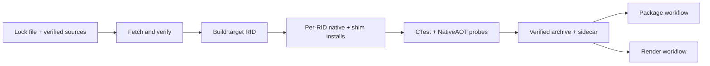

# Native build

Use this guide to follow locked OpenUSD inputs through host-specific native installs, verified
archives, and the package and render consumers that reuse them.

**On this page:** [Build and archive flow](#build-and-archive-flow) ·
[Locked inputs](#locked-inputs) · [Cesium-native quarantine](#cesium-native-quarantine) ·
[PhysX quarantine](#physx-quarantine) ·
[Local build](#local-build) · [Archive consumers](#verified-archives-and-consumers) ·
[macOS install names](#macos-install-name-policy) · [Related documentation](#related-documentation)

## Build and archive flow



The archive is a transport for verified install trees, not a second build product with different
contents.

## Locked inputs

The native runtime is pinned to OpenUSD v26.05 commit
`2095fafafd033fa23386d7ec6d58c7cc33974518`. `eng/openusd.lock.json` records the OpenUSD archive
hash, the upstream build-script hash, every direct dependency archive hash, and the platform
toolchain matrix.

The fetch step applies verified compatibility patches to the upstream build script: Windows Boost
bootstrap is launched through `cmd.exe` with the `vc143` toolset, Boost is bound to the `cl.exe`
already configured by the developer shell, existing lean Boost installs are rejected when OpenVDB
needs `boost_iostreams`, Alembic's install root is passed to USD configure so the Ogawa-only build
does not require HDF5, and the locked Windows monolithic profile is permitted to build the Draco
plugin. OpenVDB is configured through the locked Boost install, and USD is pointed at the locked
OpenVDB prefix so hioOpenVDB cannot resolve from a system or vcpkg tree. This handles Python
3.13 process launching, hardened Windows command search, Visual Studio versions newer than Boost's
discovery table, and the expanded asset-format profile; the patched script hash is locked.

The viewer-standard profile retains core USD, validation, Imaging, Hydra, Storm, MaterialX,
OpenImageIO, OpenColorIO, Ptex, OpenVDB, Alembic, and Draco. OpenVDB brings locked Blosc
compression. Python remains deliberately disabled and is not a native runtime dependency. usdview,
examples, tutorials, tools, documentation, Embree, and RenderMan are excluded.

## Isolated storage-admission SDK profile

The render-specification deferred-input profile uses the same OpenUSD commit and dependency set,
with the exact SDK source patches in `eng\openusd-storage-admission.lock.json`. It adds the
native-only version-1 storage-admission accessor, borrowed Vt array-edit instruction access, and
pre-allocation native list-composition accounting. A separate small prerequisite patch repairs
render-product hash ADL for strict MSVC compilation; no compiler diagnostic is disabled.
The project-owned C ABI and Core `GetRenderSpecification` API remain unchanged.

Build this profile in a **new real directory**, never through a shared install/source junction or
over an accepted runtime. From the existing x64 developer environment, after copying verified
dependencies into the new prefix and configuring the existing Vulkan SDK:

```powershell
.\eng\build-native.ps1 -Rid win-x64 `
    -NativeRoot artifacts\render-deferred-sdk `
    -SdkBuildRoot artifacts\render-deferred-sdk\build `
    -PatchLockPath eng\openusd-storage-admission.lock.json `
    -SdkOnly -ReuseExistingDependencies -Jobs 4
```

`-ReuseExistingDependencies` requires a successful native build plan reporting **Dependencies None**;
it does not download substitutes. Source archives and patch bytes are hash-verified. Patch application
requires exact whole-patch preimages or postimages and refuses source drift, traversal and reparse
points. The SDK is built in strict mode. `sdk-storage-admission-metadata.ps1` binds source commit,
source/build-script/patch identities, accessor version, installed public headers, import library and
actual SDK DLL. The shim validates that provenance and its actual link target at configure time,
then repeats file/patch identity validation on every build. Same-version header or binary drift fails
closed. The existing exact PCP header guards remain independently enforced.
`-DisableSdkPrecompiledHeaders` trades compile time for a smaller isolated SDK build cache without
relaxing diagnostics. The SDK admission scope rejects nested construction before changing TLS,
including when the enclosing scope already has a sticky failure; nested render queries cannot
replace an outer admission budget.

Configure a fresh shim graph against that SDK, rather than reusing cached `pxr_DIR` or imported
libraries from another prefix. Preserve the full matched SDK/shim runtime and its plugin/resource
layout. Core runtime packages verify and retain SDK provenance under
`build/OpenUsd.Runtime.Core.<rid>.storage-admission.json`; the manifest's paths describe the source
SDK install, not the flattened publish directory. Package execution compares the actual published
SDK/shim bytes and requires a real USDC NativeAOT query when this profile is present.
Pack-time verification requires both pinned public headers and the target RID's SDK binary
(plus the Windows import library) in a nonempty, unique, hash-bearing inventory. The packer passes
its target RID explicitly; an empty/header-only sidecar or another RID's inventory cannot certify
the SDK merely because the files happen to exist on disk.

Run `eng\test-openusd-source-patches.ps1` for patch-application contracts and
`eng\test-sdk-storage-admission.ps1 -SdkRoot <prefix> -CMake <cmake.exe>` for isolated
configure/every-build drift controls. The native deferred-input probes cover mapped-path replacement,
dirty overrides, array/list/decompression admission, malformed lengths and real constrained-memory
negative controls. Set `OPENUSD_TEST_STORAGE_ADMISSION=1` when running the matching Core native tests;
`OpenUsd.NativeProbe --render-deferred` requires the profile rather than skipping it.
Windows x64 data execution is the local proof; this is not Linux/macOS or hardware-rendering evidence.
`eng\test-sdk-storage-admission-metadata.ps1 -SdkRoot <win-x64-prefix>` covers malformed pack-time
sidecars and actual missing/drifted binary files in isolated copies.

## Cesium-native quarantine

`eng/cesium.lock.json` is separate from `eng/openusd.lock.json` by design. The Cesium lock pins
cesium-native v0.63.0 by commit and archive SHA-256, and it pins vcpkg manifest resolution to
baseline `56bb2411609227288b70117ead2c47585ba07713`. `eng/fetch-cesium-native.ps1` verifies the
source archive, verifies the upstream `vcpkg.json` and `vcpkg-configuration.json` hashes, checks out
that exact vcpkg commit under `native/.cache`, and bootstraps the tool from the pinned tree. vcpkg
then resolves the manifest from that baseline plus cesium-native's overlay ports/triplets, so the
resolved port versions and port git-tree hashes are reproducible in `vcpkg-manifest-install.log`.

The build is intentionally quarantined and does not feed the Core or Imaging packages. The default
`cmake --preset <rid>` shim presets search only `OPENUSD_ROOT`; use the `*-cesium` presets when
building the optional Cesium shim so vcpkg libraries cannot leak into the locked OpenUSD runtime.
cesium-native brings a much larger native surface than the lean OpenUSD runtime, including curl,
OpenSSL, Draco, KTX, SQLite, Blend2D, asmjit, s2geometry/abseil, spdlog, meshoptimizer, WebP,
zstd, and other support libraries. Keeping it in `native/install/cesium/<rid>` prevents a user who
only needs USD authoring or rendering from receiving the Cesium dependency set.

This reachable path is `cesium-native` itself, not Cesium for Omniverse. The Omniverse extension
bypasses Hydra and writes tiles into NVIDIA Fabric through `omni::fabric::StageReaderWriter`, which
is not an open Hydra delegate or scene index this project can consume. cesium-native ships no C
bindings, so the repository hand-writes and versions its own quarantined C ABI shim.

Inspect the locked Cesium plan:

```shell
./eng/build-cesium-native.ps1 -Rid win-x64 -PlanOnly
```

Build and smoke-test the Windows install from an x64 developer shell:

```shell
./eng/build-cesium-native.ps1 -Rid win-x64
```

The install contains static libraries in `native/install/cesium/<rid>/lib`, expanded headers in
`native/install/cesium/<rid>/include`, and generated third-party notices. These files are a
build-time SDK for a later C ABI shim, not runtime assets. Packaging is deliberately deferred until
that shim exists because the shipped artifact should be one linked shared library
(`.dll`/`.so`/`.dylib`) that statically contains cesium-native, not hundreds of megabytes of `.lib`
or `.a` files that consumers cannot load directly. Do not add `OpenUsd.Runtime.Cesium.<rid>`
packages for the static libraries.

The smoke probe is `native/cesium_probe`. It links against the installed `cesium-native` CMake
package, parses an in-memory 3D Tiles `tileset.json` with `Cesium3DTilesReader::TilesetReader`, and
fails unless the parsed asset version, top-level geometric error, and recursive tile count match the
expected values. It is deliberately stronger than a load-only check.

`cesium-native.yml` builds `win-x64`, `linux-x64`, and `osx-arm64`, runs the same probe, and records
install/library byte counts for each RID. Local Windows verification measured `win-x64` at
1,012,407,536 install bytes and 984,482,970 static-library bytes. Linux and macOS sizes must come
from CI because they cannot be verified on the Windows workstation.

## PhysX quarantine

`eng/physx.lock.json` pins PhysX 5.5.0 through the same vcpkg baseline the Cesium lock uses, and
installs it into `native/install/physx/<rid>` so a consumer who only needs USD authoring or
rendering never receives the simulation dependency set. The port declares:

```text
(windows & x64 & !mingw & !uwp) | (linux & x64) | (linux & arm64)
```

There is no `arm64-osx` build, so `-Rid` accepts `win-x64` and `linux-x64` only and macOS has no
physics package. Build it, then build the shim:

```shell
./eng/build-physx-native.ps1 -Rid win-x64 -PlanOnly
./eng/build-physx-native.ps1 -Rid win-x64
./eng/build-physx-shim.ps1 -Rid win-x64
```

The linkage is static, including `PhysXVehicle2`, so `openusd_physx` contains the whole CPU solver
and has no PhysX runtime dependency of its own. The port's CMake config appends `PhysXVehicle2` to
its aggregate SDK target only inside an `if(WIN32)`, while `openusd_physx` compiles
`physx::vehicle2` unconditionally, so `native/openusd_physx/CMakeLists.txt` locates that library
explicitly on every other platform and fails configure when it is absent rather than building a
solver that cannot run the vehicles the package advertises.

The `*-physx` presets set `OPENUSD_WITH_VULKAN=OFF`. The physics shim links neither Vulkan nor
hdSilk, and inheriting the imaging platform presets otherwise made every physics build require a
Vulkan SDK it never used.

The GPU acceleration modules (`PhysXGpu_64` and, on Windows, `PhysXDevice64`) are packman binaries
the port downloads from NVIDIA rather than building from the BSD-3-Clause sources. They are staged
beside the built shim so local runs and CI probes can exercise GPU domains, and they are licensed
under NVIDIA proprietary terms this project has no agreement to redistribute, so no OpenUsd package
contains one. The generated `THIRD-PARTY-PHYSX.md` states both facts separately.

`eng/build-physx-shim.ps1` installs into `native/install/shim/<rid>-physx` and never into
`native/install/shim/<rid>`. The `<rid>-physx` preset configures the whole native project, so
`cmake --install` writes `openusd_dotnet`, `openusd_hydra`, `openusd_hdsilk`, and
`openusd_storm_child` as well. Installing those over the verified prefix would replace binaries a
separate pipeline run built and verified, at exactly the paths packaging reads. The physics package
therefore names the single asset it publishes instead of globbing that prefix; see
[Packaging](packaging.md#physics-packages).

## Local build

Inspect the exact command without downloading or building:

```shell
./eng/build-native.ps1 -Rid win-x64 -PlanOnly
```

Fetch and verify sources:

```shell
./eng/fetch-native.ps1 -Rid win-x64
```

Build from a Visual Studio developer shell:

```shell
./eng/build-native.ps1 -Rid win-x64
```

If `VULKAN_SDK` is not set, the build wrapper creates the required 1.4.321.0 headers, loader,
shaderc, and VMA headers under `native/install` from the exact source revisions in the lock file. It
does not require a machine-wide LunarG installation.

While those Vulkan sources bootstrap their own dependencies, the log prints
`error: No such remote 'known-good'`, sometimes several times. It comes from the upstream
dependency scripts, not from this repository, and it does not affect the build: the pinned commits
are still checked out and verified against the lock file. It is deliberately not filtered, because
suppressing that stream would also hide genuine `git` failures from the same step.

Run both the native C ABI probe and the NativeAOT managed probe:

```shell
./eng/run-native-probe.ps1 -Rid win-x64
```

## Verified archives and consumers

`native.yml` builds each RID once per locked source identity, verifies CTest and
NativeAOT probes, then calls `eng/create-native-archive.ps1`. The archive contains
only `native/install/<rid>` and `native/install/shim/<rid>` plus a sidecar binding
its SHA-256 to the install metadata, OpenUSD commit, ABI versions, and lock hash.
`eng/test-render-native-archive.ps1` proves the producer and consumer preserve
safe subtrees, hashes, headers, Unix links, and executable modes.

Package and render workflow dispatches can consume an artifact from a successful
native workflow run by passing its numeric run ID as `native-pipeline-run-id`.
The workflow downloads `openusd-native-<rid>`, verifies the sidecar, and routes the
local archive through `eng/prepare-workflow-native-input.ps1`. Existing external
HTTPS archive URL plus SHA-256 inputs remain available after GitHub artifacts expire.

Native artifacts are produced separately from normal managed CI and consumed as
immutable inputs. The `win-x64` gate runs native and NativeAOT probes from a clean
staging directory, registers the copied plugin tree, opens a copied USDA stage,
and reads its root-layer identifier without a global OpenUSD installation.

Archive-mode render staging validates the SHA-256, safe subtrees, symlinks, and
executable modes before installation. On macOS, the workflow then runs the
runtime package gates against that staged install, including `otool` install
name/rpath validation and the signed, hardened package-only NativeAOT consumer.

## macOS install-name policy

The macOS shim configure step sets:

```text
CMAKE_INSTALL_NAME_DIR=@rpath
CMAKE_INSTALL_RPATH=@loader_path
CMAKE_BUILD_WITH_INSTALL_RPATH=OFF
```

Installed package inputs must therefore contain no build or source rpaths.
Packaging accepts exactly one LC_RPATH entry, `@loader_path`.

## Related documentation

- [Packaging](packaging.md) describes how Core and Imaging packages consume each RID install.
- [Testing](testing.md) describes the native, package, render, and release evidence gates.
