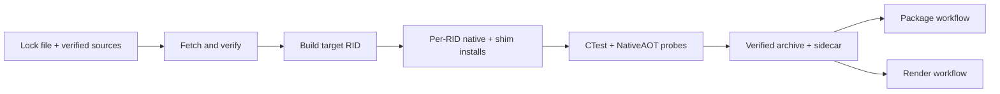

# Native build

Use this guide to follow locked OpenUSD inputs through host-specific native installs, verified
archives, and the package and render consumers that reuse them.

**On this page:** [Build and archive flow](#build-and-archive-flow) ·
[Locked inputs](#locked-inputs) · [Local build](#local-build) ·
[Archive consumers](#verified-archives-and-consumers) ·
[macOS install names](#macos-install-name-policy) ·
[Related documentation](#related-documentation)

## Build and archive flow



The archive is a transport for verified install trees, not a second build product with different
contents.

## Locked inputs

The native runtime is pinned to OpenUSD v26.05 commit
`2095fafafd033fa23386d7ec6d58c7cc33974518`. `eng/openusd.lock.json` records the OpenUSD archive
hash, the upstream build-script hash, every direct dependency archive hash, and the platform
toolchain matrix.

The fetch step applies verified compatibility patches to the upstream build script: Windows Boost
bootstrap is launched through `cmd.exe` with the `vc143` toolset, and Boost is bound to the `cl.exe`
already configured by the developer shell. This handles Python 3.13 process launching, hardened
Windows command search, and Visual Studio versions newer than Boost's discovery table; the patched
script hash is locked.

The viewer-standard profile retains core USD, validation, Imaging, Hydra, Storm, MaterialX,
OpenImageIO, and OpenColorIO. Python, usdview, examples, tutorials, Embree, Alembic, Draco, OpenVDB,
and RenderMan are excluded.

## Local build

Inspect the exact command without downloading or building:

```shell
./eng/build-native.ps1 -Rid win-x64 -PlanOnly
```

Fetch and verify sources:

```shell
./eng/fetch-native.ps1 -Rid win-x64
```

Build from a Visual Studio developer shell:

```shell
./eng/build-native.ps1 -Rid win-x64
```

If `VULKAN_SDK` is not set, the build wrapper creates the required 1.4.321.0 headers, loader,
shaderc, and VMA headers under `native/install` from the exact source revisions in the lock file. It
does not require a machine-wide LunarG installation.

While those Vulkan sources bootstrap their own dependencies, the log prints
`error: No such remote 'known-good'`, sometimes several times. It comes from the upstream
dependency scripts, not from this repository, and it does not affect the build: the pinned commits
are still checked out and verified against the lock file. It is deliberately not filtered, because
suppressing that stream would also hide genuine `git` failures from the same step.

Run both the native C ABI probe and the NativeAOT managed probe:

```shell
./eng/run-native-probe.ps1 -Rid win-x64
```

## Verified archives and consumers

`native.yml` builds each RID once per locked source identity, verifies CTest and
NativeAOT probes, then calls `eng/create-native-archive.ps1`. The archive contains
only `native/install/<rid>` and `native/install/shim/<rid>` plus a sidecar binding
its SHA-256 to the install metadata, OpenUSD commit, ABI versions, and lock hash.
`eng/test-render-native-archive.ps1` proves the producer and consumer preserve
safe subtrees, hashes, headers, Unix links, and executable modes.

Package and render workflow dispatches can consume an artifact from a successful
native workflow run by passing its numeric run ID as `native-pipeline-run-id`.
The workflow downloads `openusd-native-<rid>`, verifies the sidecar, and routes the
local archive through `eng/prepare-workflow-native-input.ps1`. Existing external
HTTPS archive URL plus SHA-256 inputs remain available after GitHub artifacts expire.

Native artifacts are produced separately from normal managed CI and consumed as
immutable inputs. The `win-x64` gate runs native and NativeAOT probes from a clean
staging directory, registers the copied plugin tree, opens a copied USDA stage,
and reads its root-layer identifier without a global OpenUSD installation.

Archive-mode render staging validates the SHA-256, safe subtrees, symlinks, and
executable modes before installation. On macOS, the workflow then runs the
runtime package gates against that staged install, including `otool` install
name/rpath validation and the signed, hardened package-only NativeAOT consumer.

## macOS install-name policy

The macOS shim configure step sets:

```text
CMAKE_INSTALL_NAME_DIR=@rpath
CMAKE_INSTALL_RPATH=@loader_path
CMAKE_BUILD_WITH_INSTALL_RPATH=OFF
```

Installed package inputs must therefore contain no build or source rpaths.
Packaging accepts exactly one LC_RPATH entry, `@loader_path`.

## Related documentation

- [Packaging](packaging.md) describes how Core and Imaging packages consume each RID install.
- [Testing](testing.md) describes the native, package, render, and release evidence gates.
