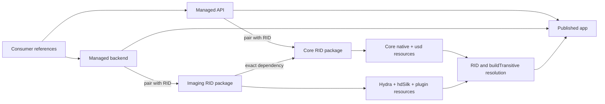

# Packaging

Use this guide to identify the managed and RID-specific packages a consumer needs, understand how
Core and Imaging assets reach publish output, and find the package-only resolution gates.

**On this page:** [Package resolution](#package-resolution) ·
[Package layout](#package-layout) · [Pack](#pack) · [Release SBOM](#release-sbom) ·
[Publish](#publish) · [Symbols](#symbol-packages-for-nugetorg) ·
[Core execution](#package-only-execution-gate) ·
[Imaging execution](#package-only-imaging-execution-gate) ·
[Required mode](#required-execution-mode) · [Related documentation](#related-documentation)

## Package resolution



Data-only consumers pair the managed API with `OpenUsd.Runtime.Core`. Rendering consumers add a
managed backend and `OpenUsd.Runtime.Imaging`, whose RID-specific dependencies also bring Core.
The Core and Imaging metapackages depend on the published `win-x64`, `linux-x64`, and `osx-arm64`
runtime packages, letting NuGet select the native asset group for the consuming app's
`RuntimeIdentifier`.

RID-less build, run, and publish are supported only when the SDK host RID is one of those three
RIDs. In that case the buildTransitive targets copy only the matching host resources and native
libraries into the output. Cross-publishing and unsupported hosts such as `linux-arm64` must set
`RuntimeIdentifier` explicitly so NuGet resolves a single runtime asset group.

Projects that need explicit per-RID control can reference the RID packages directly:

- `win-x64`: `OpenUsd.Runtime.Core.win-x64`, `OpenUsd.Runtime.Imaging.win-x64`,
  and `OpenUsd.Runtime.Cesium.win-x64`.
- `linux-x64`: `OpenUsd.Runtime.Core.linux-x64`,
  `OpenUsd.Runtime.Imaging.linux-x64`, and `OpenUsd.Runtime.Cesium.linux-x64`.
- `osx-arm64`: `OpenUsd.Runtime.Core.osx-arm64`,
  `OpenUsd.Runtime.Imaging.osx-arm64`, and `OpenUsd.Runtime.Cesium.osx-arm64`.

Managed libraries target .NET 8, 9, and 10. Native assets are split into two extensible runtime
packages for each supported RID:

- `OpenUsd.Runtime.Core.<rid>` contains the monolithic OpenUSD runtime, its load-time native
  dependencies, the `openusd_dotnet` C ABI shim, and the nested `lib/usd` data plugin tree. The
  Windows package also carries the locked `vulkan-1.dll` required by `usd_ms.dll`.
- `OpenUsd.Runtime.Imaging.<rid>` depends on the exact matching Core package and adds the
  `openusd_hydra` and `openusd_hdsilk` C ABI shims, renderer plugins, and the hdSilk plugin tree.
  Windows includes `openusd_storm_child.dll`; Linux includes the exact ABI-8 Storm child SONAME link
  chain; macOS includes exactly one `libopenusd_storm_child.dylib`.
- `OpenUsd.Runtime.Cesium.<rid>` contains only the optional `openusd_cesium` C ABI shim.
  Consumers opt in by referencing `OpenUsd.Cesium`, which depends on the RID-agnostic
  `OpenUsd.Runtime.Cesium` metapackage.

The package set requires project-owned data ABI version 15 and native capabilities `0x3FFFF`.
Package-only execution prints and verifies both values before exercising stage operations.

The first package matrix covers `win-x64`, `linux-x64`, and `osx-arm64`. Package projects consume
immutable native installs from:

```text
native/install/<rid>
native/install/shim/<rid>
```

Packing fails with a direct diagnostic when either install or a required library/plugin tree is
missing. It never creates an empty runtime package.

## Package layout

Cesium has no OpenUSD plugin resource tree to merge; the package-only gate publishes a clean
consumer, loads `openusd_cesium`, and reads a real `tileset.json` through `CesiumTileset`.

Native libraries use NuGet's RID layout:

```text
runtimes/<rid>/native/*
```

OpenUSD resources are kept outside the native asset group so NuGet cannot flatten files with
repeated names such as `plugInfo.json`. Package-specific `buildTransitive` targets copy them into
published applications while retaining their source layout:

```text
runtimes/<rid>/resources/usd/**
runtimes/<rid>/resources/plugin/usd/**
```

The resulting application contains `usd/**` for built-in USD metadata and `plugin/usd/**` for
renderer metadata. `openusd_hdsilk` is published exactly once as a normal NuGet native asset at the
application root, where managed `LibraryImport` resolves it. During packing, the installed hdSilk
metadata is copied to the package intermediate directory and its `LibraryPath` is changed to the
matching root library:

```text
win-x64:   ../../../openusd_hdsilk.dll
linux-x64: ../../../libopenusd_hdsilk.so
osx-arm64: ../../../libopenusd_hdsilk.dylib
```

The immutable `native/install/shim/<rid>/plugin/usd/hdSilk/resources/plugInfo.json` file is never
modified. This avoids loading physically distinct root and `bin`/`lib` copies of hdSilk, which
would register its OpenUSD types twice.

`OpenUsd.Runtime.Imaging.win-x64` publishes exactly one
`openusd_storm_child.dll` at the application root. It comes from
`native/install/shim/win-x64/bin`, while the existing `plugin/usd/hdStorm/**`
resource tree supplies Storm renderer metadata.

`OpenUsd.Runtime.Imaging.linux-x64` requires ELF `DT_SONAME` to be exactly
`libopenusd_storm_child.so.8`. CMake uses `SOVERSION 8` and `VERSION 8.0.0`, so
its native asset set is exactly
`libopenusd_storm_child.so -> libopenusd_storm_child.so.8 ->
libopenusd_storm_child.so.8.0.0`, with only `.so.8.0.0` a regular ELF. Missing
links, regular duplicate copies, unversioned or arbitrary SONAMEs, absolute
link targets, and extra `.so.*` entries fail packing. The nupkg records links using Unix ZIP
symlink metadata and link-target payloads; its Linux build target rehydrates
those links after NuGet extraction. They are never flattened into resources.
Packing validates the source header as ABI v8, requires the ABI-query, v2/v3 frame,
pick, packed-selection, navigation-input, and framebuffer-capture exports, and parses
`readelf --dynamic --wide` output for
the Storm child, Hydra, and hdSilk.
Linux additionally requires `openusd_storm_child_initialize_linux`; Windows and
macOS intentionally omit that platform-only export.
The exact allowed dynamic-loader policy is one `DT_RUNPATH` entry containing
only `$ORIGIN`. Legacy `DT_RPATH`, absolute paths, source/build/install paths,
empty or duplicate entries, additional relative directories, and missing or
multiple `DT_RUNPATH` tags fail packing. The build helper configures the Linux
shim install with `CMAKE_INSTALL_RPATH=$ORIGIN`; packaging fails instead of
patching an ELF binary when that contract is not met.

`OpenUsd.Runtime.Imaging.osx-arm64` publishes
`runtimes/osx-arm64/native/libopenusd_storm_child.dylib` exactly once. Packing
uses `nm` to require every current Storm child header export, including ABI
query and framebuffer capture, and uses `otool` to require
`@rpath/<library>.dylib` install names and the exact LC_RPATH allowlist
`[@loader_path]` for Storm child, Hydra, and hdSilk. Rooted paths, duplicates,
extra relative paths, and any source, build, or install path are rejected.
Dependencies are limited to system libraries and safe `@rpath` or
`@loader_path` names without traversal. The validation evidence is stored in
the package under `build/`.

Each Imaging package has an exact dependency on its matching Core version, for example
`[0.10.0-alpha]`. Its dependency includes build assets, so Core native files and `buildTransitive`
resource staging arrive when a consumer references only Imaging.

## Pack

Build the locked native inputs first, then pack the runtime projects for the current RID:

```shell
./eng/pack-packages.ps1 -Scope runtime -Rid win-x64 -OutputPath artifacts/packages
```

Use `linux-x64` or `osx-arm64` for the platform job that produced that native install. The Linux
and macOS RID packages are ready to consume the same locked layout, but require native installs
produced on those platforms. The RID-agnostic metapackages (`OpenUsd.Runtime.Core`, `OpenUsd.Runtime.Imaging`, and
`OpenUsd.Runtime.Cesium`) are packed with the managed package scope because they contain no native
files; they depend on the three RID packages so a consumer can keep one unconditional
`PackageReference`.

Package archives include repository documentation such as `README.md`, so their
byte sizes and SHA-256 digests change with packaged inputs. Inspect the current
build instead of copying a historical list into this guide:

```powershell
Get-ChildItem artifacts/packages -File |
  Where-Object { $_.Extension -in '.nupkg', '.snupkg' } |
  Sort-Object Name |
  ForEach-Object {
    [pscustomobject]@{
      Artifact = $_.FullName
      Bytes = $_.Length
      Sha256 = (Get-FileHash -LiteralPath $_.FullName -Algorithm SHA256).Hash
    }
  }
```

Canonical evidence is generated with the build it describes:

- `native/install/<rid>/.openusd-install-metadata.json` binds the current native
  sources, headers, installed libraries, and their hashes. Verify it with
  `./eng/native-install-metadata.ps1 -Operation Verify -Rid <rid>`.
- `eng/sbom/openusd-release.cdx.json` is the checked CycloneDX 1.6 SBOM generated from
  `eng/openusd.install.lock.json`, `eng/cesium.lock.json`, `eng/physx.lock.json`,
  `eng/shaders/toolchain.lock.json`, `Directory.Packages.props`, `global.json`, the Viewer publish
  script, the published package list in `eng/pack-packages.ps1`, and the committed resolved vcpkg
  data in `eng/sbom/cesium-vcpkg-components.lock.json`. The check path is hermetic and performs no
  network I/O; after intentionally changing the Cesium vcpkg pin, refresh that data with
  `python eng/generate-sbom.py --refresh-vcpkg`, then regenerate and validate the SBOM with
  `./eng/check-sbom.ps1 -Update`. CI runs `./eng/check-sbom.ps1` so dependency lock changes cannot
  leave the checked SBOM stale. Release runs regenerate the same SBOM after stamping the tag version
  and upload it as
  `openusd-release.cdx.json`.
- `artifacts/package-linux-storm-child/package-evidence.json` records the Linux
  nupkg and validation-manifest hashes, exact ABI-8 SONAME topology, RUNPATH
  policy, package-only ABI output, and loaded-library confinement.
- `artifacts/package-macos-storm-child/package-evidence.json` records the macOS
  nupkg and validation-manifest hashes, install names, RPATH policy, package-only
  ABI output, dyld confinement, and signing verification.
- The Linux and macOS Imaging nupkgs embed their platform validation manifest
  under `build/` as `OpenUsd.Runtime.Imaging.<rid>.native-validation.json`.

## Release SBOM

The checked release SBOM is `eng/sbom/openusd-release.cdx.json`. It is CycloneDX 1.6 and currently
contains 112 components. `eng/generate-sbom.py` builds it from repository pins rather than from a
restored machine state: `eng/openusd.install.lock.json`, `eng/cesium.lock.json`,
`eng/physx.lock.json`, `eng/shaders/toolchain.lock.json`, `Directory.Packages.props`,
`global.json`, the published package list, and the Viewer publish script
are hashed into the metadata. Cesium's transitive vcpkg component resolution is committed in
`eng/sbom/cesium-vcpkg-components.lock.json`, so the normal check path does not fetch port manifests
from the network. Refreshing that committed vcpkg data is an explicit operation:

```powershell
python eng/generate-sbom.py --refresh-vcpkg
```

`eng/check-sbom.ps1` regenerates to a temporary comparison, reports stale output when the pinned
inputs move, then validates the checked file. CI runs it on Linux. Release packing also regenerates
and validates the SBOM after the tag stamps the package version, uploads it as the
`openusd-release-sbom` workflow artifact, and attaches `openusd-release.cdx.json` to the GitHub
release for tag builds.

The SBOM does not replace `THIRD-PARTY-NOTICES.md` in the runtime packages. Notices are attribution
files carried with the packages; the SBOM lists components, versions, hashes, sources, and dependency
relationships for release audit tooling. Both are expected.

One entry is intentionally unresolved: `Microsoft.NETCore.App` has no `version` field. Its
`openusd:unresolved` property says the exact runtime-pack patch is selected by the pinned .NET SDK at
restore time and is not recorded in the repository. That is more accurate than inventing a patch
version that the checked inputs do not prove.

The expanded native profile adds Ptex, OpenVDB, Alembic, Draco, and Blosc. On the local `win-x64`
build, the Core package grew from 27.50 MiB to 33.45 MiB compressed and from 78.67 MiB to
110.87 MiB uncompressed; the Imaging package grew from 0.17 MiB to 0.35 MiB compressed and from
0.40 MiB to 0.98 MiB uncompressed. OpenVDB is the dominant payload: `openvdb.dll` contributes
23.65 MiB uncompressed before ZIP compression. Linux and macOS package deltas must be measured by
the hosted native/package pipeline for the same lock.

The package workflow uploads the platform evidence directory with the nupkg and
native-source metadata. Run `./eng/validate-linux-package-evidence.ps1` or
`./eng/validate-macos-package-evidence.ps1` on its matching platform to
recompute and validate the current artifact hashes.

Package layout tests create isolated synthetic installs under
`artifacts/package-tests`, inspect the nupkgs as zip archives, verify the
Core-to-Imaging dependency, and restore or publish clean consumers from the
generated local feed. After a Release build, run them with:

```powershell
./eng/run-managed-tests.ps1 `
  -Project tests/OpenUsd.Package.Tests/OpenUsd.Package.Tests.csproj `
  -Framework net10.0 `
  -Configuration Release
```

## Publish

Twenty-two packages are published at `0.10.0-alpha`: the eight non-Cesium managed libraries
(`OpenUsd`, `OpenUsd.Interop`, `OpenUsd.Rendering`, `OpenUsd.Rendering.Silk`, the three hdSilk
backends, and `OpenUsd.Rendering.Storm`), the embeddable `OpenUsd.Viewer` shell, the two runtime
metapackages, the six per-RID Core/Imaging runtime packages, and the five Cesium IDs
(`OpenUsd.Cesium`, `OpenUsd.Runtime.Cesium`, and the three per-RID Cesium runtime packages) that
became public after being withheld at `0.5.0-alpha`. `eng/pack-packages.ps1` is the single
source of truth for the published set. The script enumerates
the packages explicitly rather than packing the solution. It asserts afterwards that the produced set
matches exactly, so adding a project cannot silently ship it. Missing native input fails the run
instead of publishing a partial release.
`OpenUsd.LiveAuthoring` is intentionally outside this set because it is source-only sample code, not a
supported package surface.

`OpenUsd.Viewer` stays classified as an application project so the strict production-library gates
are not applied to its Avalonia UI code, but it opts back into packing because hosts embed the
viewport on a stage they own. `OpenUsd.Viewer.App` is the desktop entry point and is not published.
Projects outside `src/` are never packable regardless of their name.

Publishing runs from `.github/workflows/release.yml` and only for a `v*` tag. The tag is
authoritative: it is stamped into `version.json` before packing. Packing is split across a `pack`
matrix, one job per RID, because no single host can produce every package without changing what is
published: the Metal package embeds the macOS-only `mesh.metallib`, and the Linux and macOS Imaging
packages run ELF and Mach-O validation that only their own platform can perform and whose evidence
is embedded in the package. Each job stages its RID from the native archive of the same run, so the
published bytes are the bytes the gates verified. The platform-neutral libraries are packed once, on
Linux. A `publish` job then downloads every packed set, requires every package from
`eng/pack-packages.ps1 -ListPublished` to be present, and pushes.

Both jobs depend on `ci`, `shaders`, `native` and `packages`, which together build, verify and
execute the exact packages that get pushed, with `packages` running the package-only consumer gates
on all three platforms. They deliberately do not depend on `render`, which covers viewer and
windowing behaviour that no published package relies on. The release aggregate still requires
`render` separately, so a render regression turns a release run red rather than being silently
dropped or treated as package proof.

Packages flow through two feeds/artifact stores:

- The GitHub Packages feed at `https://nuget.pkg.github.com/marcschier/index.json`, authenticated
  with the auto-issued `GITHUB_TOKEN`, receives every `.nupkg` from `release.yml`. The push uses
  `--no-symbols` because `dotnet nuget push` uploads an adjacent `.snupkg` automatically and the
  GitHub feed rejects symbol packages.
- The `openusd-published-nupkgs` release artifact keeps the packed `.nupkg` and `.snupkg` files
  together for 90 days. The artifact is the symbol source for nuget.org promotion because the GitHub
  feed cannot store `.snupkg` files.
- `nuget.org` promotion is performed by `.github/workflows/nuget.yml` using NuGet trusted publishing
  (OIDC), not by `release.yml`. The trusted-publishing policy is bound to this repository, the
  `nuget.yml` workflow file, and the `release` environment, plus a `NUGET_USER` secret holding the
  nuget.org username.

`.github/workflows/nuget.yml` remains the manual promotion path for the tagged release bytes. It
downloads each `.nupkg` from the GitHub feed so the promoted package bytes are exactly the bytes that
were already released, then downloads the matching `openusd-published-nupkgs` artifact from the
release run and stages each `.snupkg` beside its `.nupkg`. The nuget.org push intentionally omits
`--no-symbols`, so `dotnet nuget push` uploads the adjacent symbol packages implicitly.

Both pushes use `--skip-duplicate`, so re-running a partially failed publish is safe. A version
pushed to nuget.org can be unlisted but never withdrawn or replaced.

## Symbol packages for nuget.org

SourceLink is enabled through `Microsoft.SourceLink.GitHub`, `PublishRepositoryUrl`, and
`EmbedUntrackedSources` in `Directory.Build.props`. Production library packs inherit
`IncludeSymbols=true`, `SymbolPackageFormat=snupkg`, and portable PDBs, so managed library packages
produce `.snupkg` files beside their `.nupkg` files. Runtime asset packages deliberately set
`IncludeSymbols=false`, and the embeddable Viewer does not inherit the production-library symbol
properties because it is classified as an application project.

The release workflow still pushes GitHub Packages with `--no-symbols`. That is intentional: NuGet's
client uploads adjacent `.snupkg` files automatically, and the GitHub Packages feed rejects symbol
packages. The tagged release artifact `openusd-published-nupkgs` keeps the packed `.nupkg` and
`.snupkg` files together so nuget.org promotion has a symbol source that the GitHub feed cannot
provide. For the source-bearing managed packages that produce symbols, consumers can step from a
NuGet package into the OpenUsd repository sources under a debugger.

`.github/workflows/nuget.yml` now resolves the completed `release.yml` run for the exact tag, or uses
the manual `release_run_id` input, and fails with a hard error if it cannot find that run. It
downloads the released `.nupkg` files from GitHub Packages, downloads `openusd-published-nupkgs` from
the release run, copies each matching `.snupkg` beside its `.nupkg`, and then runs
`dotnet nuget push` without `--no-symbols` so nuget.org receives the symbols implicitly. The workflow
throws if the release artifact contains no `.snupkg` files or if any downloaded package lacks its
matching symbol package; because the current runtime and Viewer projects do not produce symbols, that
check is the mechanism that will expose an incomplete release artifact rather than silently publishing
another 404.

A pushed symbol package is served from NuGet's symbol CDN at:

```text
https://globalcdn.nuget.org/symbol-packages/<lowercase-id>.<lowercase-version>.snupkg
```

For example, the managed package `OpenUsd 0.10.0-alpha` should appear as
`https://globalcdn.nuget.org/symbol-packages/openusd.0.10.0-alpha.snupkg` after a successful
nuget.org promotion. The corrected promotion path is wired in the tree, but it has not yet been
proven by a real tagged release promotion end to end.

## Package-only execution gate

When the locked native and shim install for the current host is present,
`OpenUsd.Package.Tests` performs a NativeAOT execution gate for `win-x64`,
`linux-x64`, or `osx-arm64`:

1. Pack `OpenUsd.Interop`, `OpenUsd`, `OpenUsd.Runtime.Core`, and the matching
   `OpenUsd.Runtime.Core.<rid>` into an isolated local feed.
2. Generate a temporary consumer containing only `PackageReference` items.
3. Restore into an isolated global-packages folder with source mapping that resolves every
   `OpenUsd*` ID from the local feed.
4. Publish the consumer as NativeAOT for the current RID.
5. Create a small USDA input in the publish directory and launch the executable with a sanitized
   `PATH`.
6. Register the staged `usd` plugin tree, open the input stage, create and save a second stage, then
   reopen it and verify an authored value.

The test asserts that all three OpenUsd dependencies have `package` entries in
`project.assets.json`, no project dependency exists, the process runs with the publish directory as
its working directory, and successful output contains:

```text
PACKAGE_EXECUTION_OK
ABI=15
CAPABILITIES=0x3FFFF
INPUT_OPENED=true
CAMERA_STATE_QUERY=true
ROUNDTRIP_SAVED=true
ROUNDTRIP_VALUE=42.5
CWD_IS_PUBLISH=true
```

The process output and generated consumer project must not contain repository source paths,
`ProjectReference`, or `native/install`.
A separate clean-feed managed consumer loads only `OpenUsd.Interop` from its
nupkg and invokes the compatibility validator. Data ABI 14 with the complete
v15 mask and Data ABI 15 with the previous `0x1FFFF` mask must both throw the typed
`OpenUsdNativeException`.

## Package-only Imaging execution gate

The Imaging consumer has exactly two direct package references:

| RID | Managed backend | Runtime package | GPU gate |
| --- | --- | --- | --- |
| `win-x64` | `OpenUsd.Rendering.Silk.D3D12` | `OpenUsd.Runtime.Imaging` | D3D12 WARP |
| `linux-x64` | `OpenUsd.Rendering.Silk.Vulkan` | `OpenUsd.Runtime.Imaging` | Hash-locked Vulkan SwiftShader |
| `osx-arm64` | `OpenUsd.Rendering.Silk.Metal` | `OpenUsd.Runtime.Imaging` | Metal |

The RID-specific Imaging package IDs are still published and can be referenced directly when a
project deliberately wants a fixed asset package.

The backend brings `OpenUsd.Rendering.Silk`, `OpenUsd.Rendering`, `OpenUsd`,
and `OpenUsd.Interop` transitively. Imaging brings the exact matching Core
runtime package and both runtime packages' targets. The Windows package test
also compiles all three clean-feed consumer sources without executing foreign
RID binaries.

The packaged `minimal.usda` stage is opened through `plugin/usd`. The first
hdSilk page must contain one frame and at least one mesh upsert; the mesh is
retained and incrementally uploaded through the platform backend. The steady
page must contain one frame and no repeated mesh changes, after which the
device waits idle.

Linux execution sets `VK_ICD_FILENAMES` and `VK_DRIVER_FILES` to the
`vk_swiftshader_icd.json` staged at the publish root by the backend NuGet
package. `LD_LIBRARY_PATH` is restricted to that publish root, which also
contains the packaged `libvulkan.so` and `libvk_swiftshader.so`; `LD_PRELOAD`
points at that packaged loader so OpenUSD and the managed backend share it.
macOS launches with `DYLD_LIBRARY_PATH` removed. The packaged Mach-O install
names and loader-relative rpaths must resolve from the publish root without a
host SDK or repository native install.

Linux also runs a dedicated package-only NativeAOT Storm child consumer with
only `OpenUsd.Runtime.Imaging.linux-x64` directly referenced. It queries ABI v8
and calls invalid-handle navigation-input and framebuffer-capture exports,
requiring status 1, the typed invalid-child message, and a fully reset navigation
snapshot with `LD_LIBRARY_PATH` removed, then reads `/proc/self/maps`. Every
mapped `libopenusd_*.so*` and
`libusd_*.so*` must resolve under the package publish root; Storm child and
`libusd_ms.so` must both be present, and repository `native/install`, build,
source, or system copies fail the process. Its project, output, and evidence
must not contain source paths. Synthetic tests cover clean-feed compilation,
exact Core dependency versioning, real ELF hashes, ZIP symlink targets, exact
ABI-8 SONAME topology, no flattened or duplicate Storm child copies, and
negative topology/parser cases for missing/wrong links, arbitrary `.so.*`,
RPATH, absolute/source paths, missing RUNPATH, empty, duplicate, and unexpected
entries.

macOS runs the equivalent package-only NativeAOT consumer with direct package
references to Imaging and the managed Metal backend. The latter supplies the
validated `mesh.metallib` and schema-v4 sidecar. The test verifies their hashes,
queries Storm child ABI v8, performs invalid-handle navigation and capture
checks, loads the packaged core and Storm dylibs plus the system Metal framework,
and enumerates dyld
images through `_dyld_image_count` and `_dyld_get_image_name`. Every project
dylib is canonicalized with `realpath` and must be under
`AppContext.BaseDirectory`; global, source, build, and `native/install` copies
fail. Every published dylib is signed first and the self-contained executable
last. Each file independently runs `codesign --verify --strict --verbose=4`
and hardened-runtime flag inspection; all failures are aggregated. Package
bytes are compared with the installed input before signing. Evidence derives
the install name from the `otool` validation manifest, derives each
`underAppBase` value from canonical dyld paths, and records a separate
post-sign SHA-256 with each file's signature result.

Successful output includes:

```text
PACKAGE_IMAGING_EXECUTION_OK
FIRST_PAGE_FRAMES=1
FIRST_PAGE_UPSERTS=<positive count>
FIRST_PAGE_REMOVALS=0
STEADY_PAGE_FRAMES=1
STEADY_PAGE_UPSERTS=0
STEADY_PAGE_REMOVALS=0
<platform upload marker>=true
GPU_BACKEND=<D3D12_WARP|VULKAN_SWIFTSHADER|METAL>
INCREMENTAL_GPU_UPLOAD=true
WAIT_IDLE=true
PLUGIN_LAYOUT=true
STORM_CHILD_ABI=8
STORM_CHILD_DLLIMPORT=true
STORM_CHILD_CAPTURE_STATUS=1
STORM_CHILD_CAPTURE_ERROR=A valid Storm native child is required.
STORM_CHILD_CAPTURE_DLLIMPORT=true
STORM_CHILD_NAVIGATION_STATUS=1
STORM_CHILD_NAVIGATION_ERROR=A valid Storm native child is required.
STORM_CHILD_NAVIGATION_RESET=true
STORM_CHILD_NAVIGATION_DLLIMPORT=true
STORM_CHILD_INITIALIZE_LINUX_EXPORT=false
CWD_IS_PUBLISH=true
```

The gate verifies the renderer plugin tree and exactly one root hdSilk library:

```text
win-x64:   openusd_hdsilk.dll
linux-x64: libopenusd_hdsilk.so
osx-arm64: libopenusd_hdsilk.dylib
```

It parses the published `plugin/usd/hdSilk/resources/plugInfo.json` and checks
the RID-specific root-relative `LibraryPath`. Core native files, USD resources,
and `OpenUsd.Runtime.Core.<rid>.targets` must arrive transitively.
On Windows it also calls `openusd_storm_child_get_abi_version` and
`openusd_storm_child_capture_framebuffer` through `DllImport`, without creating
a window. The capture call must return the explicit invalid-child status and
message before any frame is rendered, proving the ABI v8 entry point and
marshalling path. The gate verifies the single published DLL byte-for-byte
against the validated shim install.

## Required execution mode

On machines without the locked native install matching the current host,
ordinary test runs report `PACKAGE_EXECUTION_PREREQUISITES_ABSENT` and continue
to run synthetic package-layout tests. Setting:

```text
OPENUSD_PACKAGE_EXECUTION_REQUIRED=true
```

turns an unsupported host or missing OpenUSD, shim, or Windows Vulkan
prerequisite into a test failure.

`.github/workflows/package.yml` runs a required-mode matrix. It is reusable from `release.yml`,
runs after successful `native artifact pipeline` completions on `main`, and also runs on pushes or
pull requests that touch packaging paths, package tests, runtime package projects, Cesium inputs,
or native hdSilk/package-validation inputs.


| Runner | RID | Native/GPU prerequisites |
| --- | --- | --- |
| `windows-latest` | `win-x64` | MSVC x64, D3D12 WARP |
| `ubuntu-latest` | `linux-x64` | clang, Ninja, X11/Wayland/OpenGL headers, locked SwiftShader from NuGet |
| `macos-15` | `osx-arm64` | Apple Silicon, Xcode 16.4, CMake, Ninja, Metal |

Each job restores or builds its locked native install, verifies install
metadata, builds the package tests, and directly runs all tests with required
execution enabled. A successful job therefore proves both Core and Imaging
package-only NativeAOT execution for that RID. The Linux job additionally
requires evidence schema 3; recomputes the nupkg, native-validation, Storm link
payloads, and real ELF hash; requires
`DT_SONAME=libopenusd_storm_child.so.8` with the exact symlink chain; enforces
exact `DT_RUNPATH=[$ORIGIN]`; and requires ABI 8,
invalid-handle navigation/capture status 1, a reset navigation snapshot,
`LD_LIBRARY_PATH_PRESENT=false`, and confined `/proc/self/maps` results.
The macOS job requires evidence schema 2, the
`@rpath/libopenusd_storm_child.dylib` package entry, exact
`LC_RPATH=[@loader_path]`, ABI/navigation/capture output,
`DYLD_LIBRARY_PATH_PRESENT=false`, canonical confined dyld image paths, and
strict/hardened verification for every dylib and the executable. The render
workflow repeats these gates for both source-build and archive inputs.
Linux archive dispatch requires an HTTPS URL and full SHA-256, extracts only
the validated `native/install/linux-x64` and shim subtrees, runs the dedicated
package-only NativeAOT consumer, validates source metadata as `archive`, and
uploads the package evidence. Missing or malformed evidence fails both
`package.yml` and the render workflow. Source-build mode remains the default.
macOS package dispatch similarly supports pinned HTTPS archive mode with a full
SHA-256 and requires archive source metadata before accepting package evidence.

The native cache key hashes the OpenUSD lock, relevant native fetch/build/prepare
scripts, CMake files and presets, plugin resource templates, and checked-in
native source and header files. Generated `native/build`, `native/install`,
`native/downloads`, `native/src`, and `native/.cache` trees are excluded.

Every completed native build writes
`native/install/<rid>/.openusd-install-metadata.json`. Before package tests run,
the workflow verifies its RID, OpenUSD commit, lock-file SHA-256, Data ABI 15 and
capabilities `0x3FFFF`, Storm ABI 6, hdSilk session/page ABI 5/11, and Storm child
ABI 8. Metadata schema 3 records camera-state version 1, Storm-child navigation
input version 2, exact data-shim and Storm-child source SHA-256 values, plus
SHA-256 for the installed data, Hydra, hdSilk, and Storm-child libraries, their
exact source-matching headers, and the shared render-camera, render-lighting, and render-pick headers. A post-build
source change therefore invalidates metadata even if an installed binary is
still present. The Windows gate also requires the locked Vulkan loader.
Missing or mismatched metadata fails clearly and requires rebuilding the native
install, preventing a stale cache from reaching package tests. Linux and macOS
execution remains CI-gated when their native installs and hardware APIs are
unavailable on a developer machine.

## Related documentation

- [Native build](native-build.md) covers the immutable per-RID installs consumed by package projects.
- [Rendering](rendering.md) covers backend activation and the hdSilk command-page path.
- [Shader pipeline](shader-pipeline.md) covers checked backend shader assets.
- [Testing](testing.md) covers package-only and release evidence gates.
