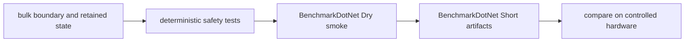
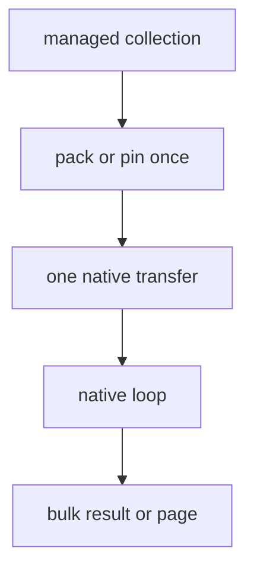

# Performance

OpenUsd performance work begins with boundary shape and lifetime stability, not isolated stopwatch
numbers. The repository uses deterministic safety gates for allocations, native-call placement, and
resource churn, then uses BenchmarkDotNet for informational measurements.

See [Architecture](architecture.md) for data flow and [Programming model](programming-model.md) for
ownership and scheduler constraints.

## Performance validation flow



The deterministic tests are pass/fail gates. `Dry` verifies that selected benchmarks build and execute;
it is not a timing measurement. `Short` produces informational measurements and JSON artifacts, but the
script does not impose timing thresholds.

## Run the repository performance workflow

The workflow requires .NET SDK `10.0.301`.

Run the default smoke:

```powershell
.\eng\run-performance.ps1 -Mode Smoke
```

This builds the deterministic tests and benchmarks, repeats the safety suite three times, and runs the
packed-string and command-page benchmarks with the BenchmarkDotNet `Dry` job.

Run all benchmarks with informational artifacts:

```powershell
.\eng\run-performance.ps1 -Mode Artifacts -Repeat 3
```

Artifacts are written under `artifacts/performance/<mode>/`. Each run includes build logs, test results,
the BenchmarkDotNet artifact tree, a benchmark log, and `summary.json`.

Use `-NoBuild` only when the Release `net10.0` outputs are known to match the current source. A successful
benchmark process means its cases executed without critical validation errors; it does not establish a
regression threshold.

## Deterministic allocation gates

`OpenUsd.Performance.Tests` measures post-warmup allocations with
`GC.GetAllocatedBytesForCurrentThread`. Current zero-allocation cases cover:

- hdSilk command enumeration;
- detached matrix inversion and point transforms;
- camera projection math and no-op `StageRenderState` updates;
- frame-only `SilkSceneState.Apply`; and
- retained pick-token resolution.

These tests deliberately warm up the path before measuring. They execute synchronously on the measured
thread and consume results so the work cannot be optimized away.

When adding a similar gate:

1. prepare all arrays, pages, strings, and objects before measurement;
2. warm up JIT and lazy initialization;
3. measure a repeated steady-state operation;
4. keep the operation on the same thread;
5. consume a checksum or observable result; and
6. assert the exact allocation contract justified by the path.

Do not use a zero-allocation assertion for setup, error creation, first-use initialization, asynchronous
continuations, or operations whose public contract returns newly owned objects.

## P/Invoke and transfer shape

The primary rule is: no per-element P/Invoke on scene or render hot paths.

Preferred forms are:

- one contiguous numeric array;
- one packed UTF-8 string block and offset table;
- one caller-owned output buffer;
- one packed selection update;
- one immutable command page; or
- a constant two-call size-query and bulk-fill pattern.



The element loop belongs on one side of the boundary, not around the boundary call.

Source-contract tests enforce that renderer-neutral state and Silk scene parsing contain no native
imports. They also verify that representative collection wrappers keep native calls outside managed
loops and that delegate-based array helpers have constant native-call counts.

When reviewing a change, count native transitions as input size grows. If the count grows with element
count, redesign the ABI before optimizing managed syntax.

## Object and resource churn

Retain objects whose identity is part of the render contract:

- return the same immutable `StageRenderState` instance for a no-op update;
- retain `SilkSceneState` across pages;
- reuse geometry buffers for property-only updates;
- update uniforms only when their content changed;
- retain pick-token ranges while mesh identity is stable; and
- dispose pages and renderer sessions promptly.

Current resource tests apply hundreds of frame-only or property-only updates and require stable buffer,
geometry-build, pick-range, page, and GPU-resource counters. Topology changes may rebuild resources;
frame or property changes should not pretend to be topology changes.

Track object churn separately from managed bytes. Recreating native sessions, GPU buffers, command
queues, or child windows may be expensive even when managed allocation counters look small.

## Scheduler and live-authoring throughput

The stage scheduler and live-authoring sink use bounded queues. Measure saturation behavior as well as
single-operation latency:

- queue wait time;
- pending and peak pending batches;
- coalesced batch count;
- scheduler operation capacity;
- notification coalescing; and
- renderer catch-up after a burst.

Do not increase capacities merely to hide a stalled consumer. Bounded queues make backpressure visible
and limit retained object growth.

Coalescing can reduce redundant snapshots but changes which intermediate states execute. Use it only
where the newer batch fully supersedes the older one. See
[Live authoring](live-authoring.md#backpressure-and-coalescing).

## BenchmarkDotNet guidance

The benchmark project covers packed strings, command pages, retained managed state, pick identity,
detached math, and camera state.

For meaningful comparisons:

- use Release builds and the same SDK;
- use the same benchmark job, filter, runtime, and source revision;
- keep CPU power policy, thermal state, and background load controlled;
- record OS, CPU, memory, GPU, driver, and native runtime identity;
- compare full result distributions, not one displayed mean;
- inspect allocation columns with timing columns; and
- rerun suspicious changes on the same machine.

Do not compare `Dry` timing. Do not treat `Short` results from different machines as a regression gate.
For GPU work, separate CPU submission time, synchronization, presentation, and GPU completion where the
backend exposes those concepts.

## Contribution checklist

- Preserve bulk or page-based native transfers.
- Keep native calls out of element loops.
- Warm up before allocation measurement.
- Reuse retained scene and GPU resources when invalidation permits.
- Avoid rebuilding geometry for frame-only or property-only changes.
- Dispose owned pages, sessions, buffers, and handles.
- Run deterministic gates before interpreting benchmark data.
- Use BenchmarkDotNet artifacts as evidence, not as an implicit pass threshold.
- Document any intentional change to allocation, call-count, or resource-lifetime contracts.

## Related documentation

- [Architecture](architecture.md)
- [Programming model](programming-model.md)
- [Live authoring](live-authoring.md)
- [Rendering](rendering.md)
- [Testing](testing.md)
- [Troubleshooting](troubleshooting.md)
