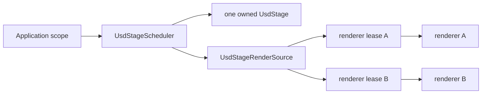
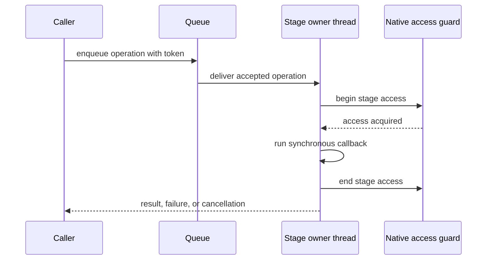

# Programming model

OpenUsd presents managed objects over a project-owned C ABI. Correct use depends on explicit ownership,
synchronous stage access, bounded cross-thread scheduling, and bulk native transfers.

This guide covers application-facing rules. See [Architecture](architecture.md) for component boundaries,
[Data API](data-api.md) for stage operations, and [Rendering](rendering.md) for renderer contracts.

## Ownership at a glance



The scheduler owns one stage on its dedicated thread. A render source retains that exact native stage
identity, and each renderer acquires its own lease. A lease can outlive disposal of the source, but the
normal shutdown order is still consumer or renderer, source, then scheduler.

| Type | Ownership rule |
| --- | --- |
| `UsdStage` | Dispose a directly opened or created stage. Scheduler callbacks receive a borrowed facade. |
| `UsdPrim` | Borrowed stage-bound view; do not use it after its owning stage is disposed. |
| `UsdLayer` | Owned native layer view returned by a stage; dispose it independently. |
| `UsdStageScheduler` | `IAsyncDisposable`; disposal drains accepted work before releasing the stage. |
| `UsdStageRenderSource` | `IDisposable`; release it before disposing its scheduler. |
| Renderer session | Dispose before its source when practical; the session owns its independent lease. |
| `OpenUsdSilkPage` | `IDisposable`; it owns the managed copy and diagnostic lifetime for one page. |

Use nested scopes so reverse-order disposal expresses the dependency:

```csharp
await using var scheduler = UsdStageScheduler.Open(stagePath);
using var source = await scheduler.AcquireRenderSourceAsync(cancellationToken);
using var renderer = OpenUsdSilkRuntime.Create(pluginPath, source);

using OpenUsdSilkPage page = renderer.Sync(width, height, timeCode, camera);
```

## Direct stages and scheduler-owned stages

A direct `UsdStage.Open` or `UsdStage.Create` is suitable when one call stack owns all access and can
serialize it. The caller owns the stage, prim views borrow its lifetime, and owned layer views require
independent disposal.

Use `UsdStageScheduler` when work can arrive from multiple threads, when rendering must share the exact
stage identity, or when ordered change notifications are required. Its operation and notification
queues are bounded. All stage callbacks execute on one dedicated owner thread under one native access
guard.

```csharp
await using var scheduler = UsdStageScheduler.Open(stagePath);

await scheduler.EditAsync(
    static stage =>
    {
        UsdPrim prim = stage.DefinePrim("/World/Box", "Xform");
        prim.SetDouble("userProperties:temperature", 21.5);
    },
    UsdStageInvalidationKind.Topology,
    cancellationToken);
```

Scheduler callbacks are synchronous:

- do not make a callback `async`;
- do not block on work that needs the scheduler;
- do not reenter the same scheduler;
- finish enumeration inside the callback instead of returning a lazy sequence; and
- return detached values, never `UsdStage`, `UsdPrim`, `UsdLayer`, or another stage-bound wrapper.

The result guard accepts primitives, enums, strings, project detached value types, trusted containers
made only from accepted values, and concrete `IUsdDetachedResult` implementations. It rejects arbitrary
classes and structs, interfaces, abstract types, lazy sequences, tasks, and other asynchronous wrappers.

```csharp
public sealed record StageSummary(
    string RootLayer,
    ulong ChangeSerial) : IUsdDetachedResult;

StageSummary summary = await scheduler.InvokeAsync(
    static stage => new StageSummary(
        stage.RootLayerIdentifier,
        stage.ChangeSerial),
    cancellationToken);
```

Use `EditAsync` for any callback that may mutate the stage. It records the change-serial interval and
publishes the declared `UsdStageInvalidationKind` when native state changed. Use `InvokeAsync` for reads.

Only one active enumeration of `ReadChangesAsync` is supported. The render coordinator or equivalent
consumer should own that enumeration.

## Cancellation boundaries

Cancellation is cooperative and has explicit limits.



- Cancellation before native access prevents the callback from running.
- Cancellation while waiting for the native stage-access lock cannot interrupt that native wait.
- Cancellation observed after the lock is acquired still prevents the callback.
- Once the callback starts, cancellation does not preempt it. Callback code may inspect its own token.
- Disposal stops new admission and drains work already accepted by the scheduler.

Do not interpret a canceled wait as proof that an operation was interrupted unless the API contract says
the operation had not yet been admitted or started. Live authoring has an additional admission boundary;
see [Live authoring](live-authoring.md#cancellation-and-disposal).

## Errors

Managed argument and lifetime checks use normal .NET exceptions such as `ArgumentException`,
`ArgumentOutOfRangeException`, `ObjectDisposedException`, and `InvalidOperationException`.

The data C ABI returns one of these statuses:

- `Ok`
- `InvalidArgument`
- `NotFound`
- `BufferTooSmall`
- `NativeError`
- `WrongThread`

A non-`Ok` data status becomes `OpenUsdNativeException`. Its `Status` property preserves the native
status, and its message is decoded from the native UTF-8 diagnostic buffer. Direct Storm and hdSilk
operations use `OpenUsdStormException` and `OpenUsdSilkException` for their respective native failures.

Catch the typed exception when recovery depends on the native status. Do not parse diagnostic text to
determine the error category.

```csharp
try
{
    using UsdStage stage = UsdStage.Open(stagePath);
}
catch (OpenUsdNativeException exception)
    when (exception.Status == OpenUsdNativeStatus.NotFound)
{
    // Report or select another stage without parsing exception.Message.
}
```

## File paths, USD paths, and Unicode

Managed strings crossing the data ABI are encoded as UTF-8. Embedded NUL characters are rejected before
the call. Pass .NET paths directly; do not convert them through an ANSI code page.

For file-system inputs:

- resolve relative paths deliberately, normally with `Path.GetFullPath`;
- retain the original path in diagnostics when useful;
- keep the target runtime's file-system case rules in mind; and
- verify that referenced assets are deployed beside the stage or at their intended resolved location.

Absolute prim paths are validated in managed code before applicable native calls. Identifier segments
follow the Unicode XID rules mirrored from the repository's locked OpenUSD version, so valid non-ASCII
USD identifiers are not reduced to ASCII. File paths and USD prim paths are different domains: never
normalize a prim path with `System.IO.Path`.

## The native boundary

OpenUSD C++ types never cross the project-owned C ABI. Managed code holds opaque handles and detached
values only. New interop should preserve that rule.

Never introduce per-element P/Invoke on a scene, traversal, geometry, selection, or render hot path.
Existing boundary forms include:

- contiguous scalar, vector, matrix, and topology arrays;
- packed UTF-8 string lists;
- caller-owned output buffers;
- packed selection updates; and
- immutable hdSilk command pages copied once into managed ownership.

A two-call size query followed by one bulk fill is a constant native-call pattern. A native call inside a
managed element loop is not. See [Performance](performance.md#pinvoke-and-transfer-shape).

## NativeAOT, trimming, and single-file applications

Production libraries target `net8.0`, `net9.0`, and `net10.0` and enable trimming, NativeAOT, and
single-file analyzers. Data imports are generated `LibraryImport` declarations with an AOT-safe custom
UTF-8 marshaller.

Application code should:

- avoid reflection-only construction of OpenUsd-facing contracts;
- keep interop declarations source-generated or otherwise statically reachable;
- publish for one supported RID;
- reference the matching Core runtime, plus Imaging when rendering needs it; and
- preserve the `usd/**` and `plugin/usd/**` resource trees in published output.

NativeAOT does not make mismatched native assets compatible. ABI versions, capability bits, plugin
metadata, native dependencies, and package versions must still align. See
[Versioning and compatibility](versioning-compatibility.md) and
[Troubleshooting](troubleshooting.md#nativeaot-and-package-only-failures).

## Related documentation

- [Architecture](architecture.md)
- [Data API](data-api.md)
- [Live authoring](live-authoring.md)
- [Versioning and compatibility](versioning-compatibility.md)
- [Performance](performance.md)
- [Rendering](rendering.md)
- [Packaging](packaging.md)
- [Troubleshooting](troubleshooting.md)
