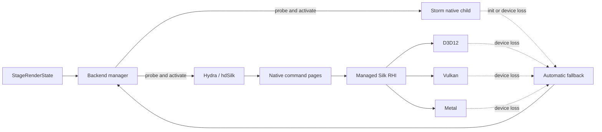

# Rendering

Use this guide to trace renderer-neutral state through Storm or the hdSilk command-page path, then
find the backend selection, fallback, picking, presentation, and platform evidence details.

**On this page:** [Backend flow](#backend-flow) ·
[Picking](#renderer-neutral-picking-contract) ·
[Vulkan composition](#avalonia-vulkan-composition-smoke) ·
[Related documentation](#related-documentation)

## Backend flow



Solid arrows show the active data path. Dotted arrows return clean initialization or device-loss
failures to the platform candidate order; they do not imply recovery from a process-ending driver
crash.

Hydra/Storm is the primary viewer renderer. The fallback is a custom Hydra renderer that emits dirty scene updates into
native-owned command pages consumed by managed Silk.NET code.

The normal Windows Viewer keeps one Avalonia shell fixed to `Win32RenderingMode.AngleEgl`. Linux keeps one Avalonia
X11/GLX shell: directly on X11, or as a whole-shell XWayland client in a Wayland session. Storm is hosted in an
application-owned native child through `StormNativeControlHost`; D3D12 and Vulkan continue to use Avalonia composition
controls. `RendererSwitchingViewport` swaps these children in one process without restarting `AppBuilder` or replacing
the scheduler's exact `StageRenderState`.

The interactive Viewer can start without `--stage`, then open or drop `.usd`, `.usda`, `.usdc`, and `.usdz` files.
Open, reload, layer commands, and shutdown are serialized per document; playback and pending time updates stop before
the old render coordinator and backend are disposed or when refreshed authored timing changes. One scheduler callback
detaches hierarchy, authored timing, and the local layer stack in strong-to-weak order, including root, session, current
edit-target, and retained muted-layer state. The Layers tab exposes explicit root/session edit-target buttons and mute
controls only for eligible local sublayers; commands use scheduler edits with composition invalidation, native failures
are surfaced, and no layer action runs in automated evidence modes. Layer refresh preserves valid selection and current
time, clears selection when composition removes its prim, and clamps time only when a new finite authored range requires
it. Invalid timing is reported rather than replaced, while finite ranges remain available for invariant numeric entry
and slider scrubbing. Playback advances renderer-neutral `StageRenderState.Time` at the authored frame cadence,
coalesces pending updates, and loops from the authored end to start. Hierarchy data is filtered and expanded
managed-side, while the property inspector queries only the selected prim. A missing plugin directory disables rendering
but does not disable hierarchy or layer inspection. Up to ten normalized recent paths are stored under
`LocalApplicationData/OpenUsd/Viewer`; missing entries are removed when the list is loaded.

`openusd_storm_child` owns the child HWND/XID/NSView and one dedicated render thread. Native views are created and
destroyed only on their UI/creator thread; wrong-thread creation, resize, and destruction are rejected without changing
ownership. Windows and Linux create OpenGL 4.6/4.5 compatibility contexts for WGL/GLX on the render thread. On macOS,
the Cocoa main thread creates and attaches the NSView and application-owned NSOpenGLContext drawable; the render thread
alone makes the OpenGL 4.1 core context current, updates it, drives Storm, preserves the completed frame, flushes,
recreates the renderer, and clears current ownership. The child preserves `openusd_hydra`'s actual `Storm / Metal`
renderer name, rejects any other Hgi, and appends only `OpenGL 4.1 core presentation`. Main-thread waits pump Cocoa
work so context recreation cannot deadlock the render thread.

The Storm child v7 C ABI provides create/retryable destroy, synchronous render, revision-tagged asynchronous render
requests, prioritized synchronous picking and packed selection updates, resize/DPI/visibility/focus, context-loss
recreation, diagnostics, and explicit framebuffer evidence capture. Every render request carries the shared
project-owned `openusd_render_camera`: `AUTO` preserves the fixed `(4,3,4)` look-at and 45-degree perspective camera,
while `MATRICES` carries finite row-major double view/projection matrices. The struct has stable natural layout
(`struct_size`, 32-bit mode, then two 16-double matrices), contains no booleans, and is also used by Storm ABI v6 and
hdSilk session ABI v4; the hdSilk page ABI is v4. Asynchronous requests coalesce to one latest time/revision/camera;
Stop, pick, selection, and other synchronous commands take priority, queued waiters are completed with cancellation, and
new commands are rejected once closing begins. Native handles use a registry-backed never-dereferenced token so
operations racing teardown retain shared state rather than waiting on freed memory. Managed session operations use one
operation lease, and backend disposal dispatches session destruction and control detachment together to the UI thread.

Viewer frame adapters capture one immutable `StageRenderState` request and forward its exact revision,
time, and camera. Storm synchronous/asynchronous requests and the D3D12, Vulkan, and Metal hdSilk
session sync paths therefore cannot combine a new revision with an older camera. The legacy
OpenGL compatibility host uses the same snapshot; automatic camera mode remains unchanged.

hdSilk normalizes both clip-space conventions in renderer-neutral scene constants rather than per backend, so one
`objectToClip` matrix drives every geometry pass on every RHI. Depth is converted from the OpenGL `[-1, 1]` range the
Storm and Viewer cameras produce to the `[0, 1]` range D3D12, Vulkan, and Metal expect. Clip-space Y is mirrored when
`ISilkGraphicsDevice.ClipSpaceYPointsDown` is set, which only the Vulkan backend reports, because Vulkan's framebuffer
origin is top-left while D3D12 and Metal are bottom-left. Mirroring in the scene constants rather than through a
negative-height viewport keeps fullscreen composite passes such as the selection outline upright: those share the
backend's generic command-list viewport but never use `objectToClip`. `SilkCrossBackendParityTests` renders a
vertically asymmetric scene and separately proves that scene compares unequal to its own vertical mirror, so a
regression in either convention cannot pass the gate vacuously.

### hdSilk material texture table capability

Material texture bindings remain renderer-neutral `SilkBindingLayoutDescriptor.MaterialSlots`: set 0/binding 0 is still
the 80-byte `SceneParameters` uniform, and material slots continue to be validated through `RequireMaterialSlot`. Devices
now also report `SilkGraphicsCapabilities.SupportsDescriptorIndexedTextureTables`. When it is `true`, the backend may copy
material texture and sampler descriptors into a persistent descriptor-indexed table before a draw; when it is `false`, the
backend must use the existing per-draw descriptor path. D3D12 enables the shared table only for Resource Binding Tier 2 or
Tier 3 devices and falls back to per-draw shader-visible heaps otherwise. Vulkan and Metal currently keep the fallback
path observable through the same capability until their descriptor-indexing/argument-buffer shader contracts are wired.

## Renderer-neutral picking contract

`OpenUsd.Rendering` owns picking identity and revision semantics; Storm, hdSilk, RHIs, and the Viewer
remain adapters and consumers. `RenderPickRequest` describes exactly one physical pixel using a
top-left origin (`X = 0`, `Y = 0` is the upper-left pixel), includes the exact physical
`ViewportDimensions`, and binds the request to a requested `StageRenderState.Revision` plus an
optional application scene-content revision. Region width and height are explicit but must both be
one in the initial contract. The request also carries a `RenderPickTarget`
(`Primitive`, `Face`, `Edge`, or `Point`) and `RenderPickOptions`; a backend may report
`Unsupported` for a valid target or flag combination it cannot implement.

`IRenderPickingBackend` is an optional capability interface advertised by
`RenderBackendCapability.Picking`. It consumes the backend's retained state snapshot and returns
`RenderPickResult` with one of `Hit`, `Miss`, `Stale`, or `Unsupported`. A result retains the exact
request and separately reports the state and optional scene revisions actually consumed. The
coordinator/backend must report the scene revision actually bound, not merely copy a requested
value. `RenderPickStaleReason` is a flags enum covering state revision, scene revision, camera,
viewport, time, context generation, and other backend state invalidation. State and bound-scene
revision mismatches are inferred automatically and combined with backend-supplied reasons. A stale
result requires at least one reason but does not require a revision mismatch; hit, miss, and
unsupported results always report `None` and require a current revision binding.
Operational backend failures are not result statuses: implementations throw their typed backend
exceptions and may attach `RenderBackendDiagnosticCategory.Picking` diagnostics.

A hit always has authoritative `SelectionItem` identity: an absolute prim path, optional absolute
instancer path plus zero-based instance index, and optional zero-based element/subprim index.
World-space position, world-space normal, and normalized near-to-far depth in `[0, 1]` are
independently optional so ID-only backends do not fabricate geometry. Every geometry value a backend
does provide must be finite. Optional backend kind/token values are diagnostic hints only and must
never replace the path/instance/subprim identity or survive as authoritative identity across frames.
Miss, stale, and unsupported results always clear all identity, geometry, and backend-token fields
deterministically.

`SelectionState` remains source-compatible for path-only callers through
`SelectionState(IEnumerable<string>)` and `PrimPaths`. `Items` and the
`SelectionState(IEnumerable<SelectionItem>)` constructor preserve richer identity. Input order is
stable. Exact duplicate strings and exact duplicate items are rejected rather than deduplicated,
while distinct instances or elements of one prim are allowed; `PrimPaths` consequently repeats a
prim path for those distinct items. Selection equality and hashing include complete ordered item
identity.

### Viewer click-to-selection integration

The Viewer advertises `Picking` on Storm, D3D12, Vulkan, and Metal and routes each active hosted
session through `IRenderPickingBackend`. Storm delegates to the native child or compatibility
renderer's `Pick`; D3D12 delegates to its retained `SilkMeshRenderer`, while Vulkan and Metal capture
the renderer belonging to the current presentation generation. A missing renderer/generation returns
`Unsupported`, never a fabricated miss. The Viewer binds hdSilk picks to the rendered
`StageRenderState.Revision` and leaves the optional application scene revision null because the native
hdSilk page serial advances on every sync rather than identifying stable scene content. The retained
identity-table revision and device generation still invalidate topology/token or RHI changes
independently.

An unmodified left press/release inside the viewport performs a primitive pick. Alt+left,
Alt+middle, and Alt+right remain camera orbit/pan/dolly gestures; any modifier, other button, or at
least four physical pixels of movement suppresses the click. Avalonia logical coordinates are
measured against the viewport content bounds, multiplied by the current render scale, floored, and
validated against the exact physical viewport. They are passed through unchanged as top-left-origin
pixel coordinates. Native Storm child-window mouse messages do not become Avalonia routed events, so
the existing 16 ms native input poll recognizes the same plain-left press/release and drag policy;
composition backends use Avalonia routed input directly.

`ViewerRenderCoordinator.PickAsync` serializes backend admission and coalesces requests so the latest
click wins. A superseding click cancels waiting work and the admitted backend token. An already
admitted native call may finish, but cancellation is checked again after it returns and its result is
suppressed. A stale result is retried at most once after the newest rendered state has stabilized;
the second stale result is surfaced. Backend switches invalidate an admitted pick and reapply the
current immutable state, including full selection identity, to the replacement backend.

A hit updates `SelectionState` with the complete `SelectionItem`, selects the hierarchy prim path,
and shows instancer, instance index, and subprim element identity in the inspector when present. A
miss clears selection. Storm receives one packed selection update using opaque yellow `(1,1,0,1)` and framebuffer
evidence verifies both the highlight hash change and exact clear restoration. Scene-index Storm still highlights an
instance as its whole prim path. hdSilk retains selection through rendering and backend switches and renders the shared
visible-only orange mask/composite outline on D3D12, Vulkan, and Metal. D3D12 WARP and Vulkan SwiftShader conformance
prove real outline pixels, physical width, occlusion suppression, exact clear restoration, resize/generation recovery,
cleanup, and NativeAOT. Metal source and ten-entry shader contracts are complete; real pixels remain gated on hosted
macOS with Xcode 16.4. Stale, unsupported, canceled, and failed picks retain the last valid selection.

Normal automated Viewer runs do not execute picking. The dedicated short Windows scenario is:

```powershell
pwsh eng/run-viewer-picking-smoke.ps1 -SmokeSeconds 180
```

It writes a local schema-2 short-smoke artifact (not the final long-evidence schema) and proves Storm/D3D12/Vulkan hit
and miss outcomes on the same prim path, one stale retry, selection preservation across switches, exact Storm highlight
clear restoration, and D3D12/Vulkan mask plus outline passes with no additional pass after selection clears. The
artifact cryptographically binds the Viewer, outline core, concrete backend code, checked shaders, conformance tests,
stage, and native Storm runtime. It overlays the already-built finalized Storm probe runtime into the disposable Viewer
output because package artifacts are intentionally not repacked by this workflow.

The backend-neutral Silk RHI now defines the request-driven GPU ID-pass contract independently of
the D3D12, Vulkan, and Metal implementations. A pick-capable device implements
`ISilkPickingGraphicsDevice`; its command list additionally implements
`ISilkPickGraphicsCommandList`. `SilkMeshRenderer` implements `IRenderPickingBackend` and requires
the rendering owner to use the `SilkPickFrameBinding` render overload so each request is compared
with the exact `StageRenderState.Revision` and optional application scene revision actually
rendered. The retained `SilkPickIdentityTable.Revision` separately invalidates an in-flight result
when active identity, topology, or token ranges change.

Silk records no ID pass when no request exists. A supported primitive or face request records one
single-sample RGBA8/D32 pass after the unchanged visible submission, scopes rasterization to the
requested one-pixel top-left-origin scissor, and copies that exact top-left coordinate to a
persistent readback slot. The fragment shader adds `SV_PrimitiveID` to the mesh's retained base
token and writes the token bytes as normalized R, G, B, and A. Managed encoding and decoding always
use explicit little-endian order, independent of host endianness. Token zero is the cleared
background miss. A nonzero token must resolve through `SilkPickIdentityTable`; the authoritative
path and authored triangle subprim become `SelectionItem`, while world position, normal, and depth
remain null. Edge, point, and back-face-culling requests are currently `Unsupported`.

The renderer consumes only `SilkPickIdentityTable.TryGetRange`, `TryResolve`, and `Revision`.
Coalesced same-path Rprim recreation may therefore emit a logical old-prim removal plus new-prim
upsert, or reset topology revision under the same prim ID, without exposing range internals.
`SilkSceneGpuResources` applies that delta, the renderer looks up the current range by
`(path, instance index)` for each draw, and deactivated ranges are pruned from searchable storage so
old tokens cannot resolve. Pick identity is per instance, matching page ABI 5: a point-instanced
prototype allocates one range per resolved instance, so picking selects the instance that was
actually drawn, and retiring one instance leaves the others resolvable. The prim ID and path hash
indexes are shared by every instance of a prototype and are retired only with the last one.
`TryGetRange(path)` resolves the non-instanced record, which is instance index zero.
`SilkSceneGpuResources` may share the prototype vertex/index upload across same-path instance
records, but it deliberately keeps a separate uniform buffer and pick range per instance while page
ABI 5 still publishes one mesh record per resolved instance.
`AllocatedRangeCount` remains a monotonic diagnostic rather than a retained-entry count, and the
renderer does not depend on it or on `SilkMeshData.TopologyFingerprint`.
Frame-only pages and property-only same-topology upserts leave the identity-table revision
unchanged, so they do not falsely stale an in-flight ID result.

The queue retains one active request and one latest-wins pending request. Submitted work is bounded
by a persistent three-slot `SilkPickReadbackRing`; saturation returns to the render loop without
waiting, and completed slots are consumed and reused in deterministic round-robin order. Pick
pipeline and readback resources are cached per device generation, while RGBA8/D32 pick targets are
reused until the viewport changes. Viewport, scene/topology, state-revision, or device-generation
invalidation returns `Stale` with the corresponding `RenderPickStaleReason`; backend-owned viewport,
identity-table, and context-generation reasons remain truthful even when requested revisions still
match. Selection-only state changes do not apply an hdSilk page and therefore do not rebuild or
upload mesh geometry.

### Silk visible-only selection outline contract

`SilkMeshRenderer.UpdateSelection` retains the immutable renderer-neutral `SelectionState` directly.
It resolves `SelectionItem.PrimPath` through `SilkSceneState.MeshesByPath` and the existing
`SilkSceneGpuResources`; repeated instance or subprim items for one path produce one whole-mesh mask
draw. Updating selection never synchronizes hdSilk, changes `SilkPickIdentityTable.Revision`, or
rebuilds vertex/index buffers. Missing paths are skipped and reported by
`SilkSelectionOutlineDiagnostics`.

The shared policy is `SilkSelectionOutlineSettings.Default`: enabled, straight-alpha
`(1.0, 0.55, 0.0, 0.9)`, a two-physical-pixel radius, and visible-only occlusion. Width is finite and
bounded to `[1,16]` physical pixels. X-ray/occluded selection is explicitly unsupported:
`SilkSelectionOutlineCapabilities.VisibleOnly.SupportsXRay` is false, and requesting
`VisibleOnly=false` records `XRayUnsupported` without changing the visible target.

A capable backend implements `ISilkSelectionOutlineGraphicsDevice`, and its command list implements
`ISilkSelectionOutlineGraphicsCommandList`. The stable RHI sequence is:

1. Render the ordinary visible color/depth pass.
2. Clear and render selected meshes into one reusable single-sample sampled RGBA8 mask while loading
   the sampled D32 visible depth read-only, using less-equal depth, no depth writes, no blending, and
   no culling.
3. Load the visible RGBA8 target and draw one generated fullscreen triangle with straight-alpha-over
   blending. The fragment shader samples the mask and visible depth with a nearest clamp sampler,
   applies the physical-pixel circular edge kernel, and suppresses pixels over nearer occluders.

The fullscreen binding is D3D `t0` mask, `t1` visible depth, `s0` sampler, and `b0`
`SelectionOutlineParameters`; Vulkan uses set 0 bindings 0, 1, 2, and 3. The 32-byte parameter buffer
contains float4 color at byte 0, float2 inverse viewport at byte 16, width at byte 24, and the locked
depth epsilon at byte 28. Pipelines, sampler, parameter buffer, mask texture, and sampled-resource
binding are cached. Resize recreates only the mask and binding; device-generation change invalidates
all selection resources. Empty, disabled, missing-only, unsupported-device, x-ray, and unsampled-depth
states record no mask or composite pass. Warm visible selection rendering adds no managed allocation
or resource churn.

On D3D12, sampled D32 targets use an `R32_TYPELESS` resource with separate `D32_FLOAT` writable and
read-only DSVs plus an `R32_FLOAT` SRV; unsampled depth targets retain the ordinary typed allocation.
The mask pass transitions visible depth to `DEPTH_READ`, binds the read-only DSV, then transitions
mask and depth to pixel-shader-resource state for the fullscreen pass. One shader-visible two-SRV
heap is owned by each cached outline binding, while the cached nearest-clamp sampler heap and
32-byte upload buffer are retained through submission leases. Device-removal generation changes
invalidate pipelines and bindings before reuse.

On Vulkan, sampled masks and depth targets include `VK_IMAGE_USAGE_SAMPLED_BIT`. The mask pass uses
`DEPTH_STENCIL_READ_ONLY_OPTIMAL`; the composite samples the mask in
`SHADER_READ_ONLY_OPTIMAL`, preserves the loaded visible color attachment, and returns it to the
existing transfer-read layout. Descriptor sets and attachment framebuffers are cached with the
pipelines/binding, and generation, submission, or fence loss invalidates them with loss-safe teardown.
The checked fullscreen SPIR-V is normalized backend-side to remove the unused
`SPV_KHR_shader_draw_parameters` BaseVertex dependency so the same `SV_VertexID` triangle runs on
SwiftShader. SwiftShader conformance and the NativeAOT RHI probe prove outline pixels, exact clear
restoration, occlusion suppression, physical width, resize/depth replacement, loss recovery, and
full dependent cleanup.

Silk reports inferred `StateRevision` and `SceneRevision` reasons plus explicit `Viewport`,
`ContextGeneration`, and `BackendState` reasons when those independent retained values change.
Camera and time remain components of the immutable `StageRenderState.Revision` binding in this
initial adapter, so Silk reports `StateRevision` rather than fabricating separate `Camera` or `Time`
reasons without an independently retained camera/time request binding.

Checked `pickVertexMain` and `pickFragmentMain` artifacts are embedded alongside the visible mesh
shaders for DXIL and SPIR-V, with normalized reflection validating `SceneParameters` at set 0 /
binding 0 and the 16-byte `PickParameters` uint4 at set 0 / binding 1. Checked MSL is generated by
the same pinned Windows authority workflow. The combined ten-entry `mesh.metallib` remains a hosted
macOS/Xcode 16.4 artifact and is never fabricated on Windows.

### Material binding layout

`SilkBindingLayoutDescriptor` originally described exactly one 80-byte `SceneParameters` uniform
buffer at set 0 / binding 0, so a draw could bind no textures or samplers at all. It now carries an
additive `MaterialSlots` list, built through `SilkBindingLayoutDescriptor.ForMaterial`, where each
`SilkBindingSlot` declares a set, binding, `SilkBindingKind` (uniform buffer, sampled texture, or
sampler), uniform byte size, and stage visibility.

The contract is deliberately narrow so it cannot describe a binding no backend can reach:

- `SceneParameters` stays at set 0 / binding 0 with 80 bytes and vertex plus fragment visibility, so
  every pipeline that existed before material slots keeps its exact layout.
- A material slot must use set 0, because Vulkan binds one descriptor set and neither D3D12 nor
  Metal has a set concept.
- A material slot cannot occupy set 0 / binding 0, and two slots cannot collide on the same binding.
- Only a uniform-buffer slot carries a byte size, which must be a non-zero multiple of 16.
- A slot invisible to every stage is rejected rather than silently ignored.

Each backend maps the slots to its own binding model. Vulkan appends one `DescriptorSetLayoutBinding`
per slot to the single set-0 layout and sizes the draw submission's descriptor pool from the slot
kinds, because a pool holding only uniform-buffer descriptors fails `vkAllocateDescriptorSets` with
`VK_ERROR_OUT_OF_POOL_MEMORY` as soon as the layout declares an image or sampler. D3D12 keeps root
parameter 0 as the `SceneParameters` root CBV, adds a root CBV per uniform slot, and groups sampled
textures and samplers into SRV and sampler descriptor tables. Metal has no layout object at all,
since resources bind by argument index at encode time, so its layout only carries and validates the
descriptor.

Conformance proves the widening is inert: on both D3D12 WARP and Vulkan SwiftShader the checked
triangle rendered through a material layout is byte-identical to the same triangle rendered through
the plain `SceneParameters` layout, so a wider root signature or descriptor set cannot have shifted
the scene-constant binding.

### Binding material resources to a draw

`ISilkGraphicsCommandList.SetTexture` and `SetSampler` bind an actual resource to a declared slot,
alongside the existing `SetUniformBuffer`. Both validate against the bound pipeline's layout through
the shared `SilkBindingLayoutDescriptor.RequireMaterialSlot`, so a slot that is the wrong kind, is
not declared at all, or is bound before any pipeline fails identically on every backend rather than
producing a different backend-specific error or a silently unbound resource. A sampled texture must
also carry `SilkTextureUsage.Sampled`. The last write to a slot before a draw wins, matching how
pipeline and buffer bindings already behave.

Backends differ in what they must keep alive, and the difference is deliberate:

- **Vulkan** transitions the texture to `VK_IMAGE_LAYOUT_SHADER_READ_ONLY_OPTIMAL` (legitimately
  outside a render pass, because the render pass only begins inside the draw), then writes
  `SampledImage` and `Sampler` descriptors into the per-draw set. Because the live sampler handle is
  written into the set, the sampler is leased for the submission's lifetime.
- **D3D12** transitions the texture to `D3D12_RESOURCE_STATE_PIXEL_SHADER_RESOURCE`, then *copies*
  each view into a per-draw shader-visible heap and points the matching root descriptor table at it.
  Since the descriptor is copied rather than referenced, the source sampler heap needs no lease. One
  heap per kind is created per draw and released with the submission; a shared descriptor ring is
  deliberately left to `perf-bindless-textures`.
- **Metal** has separate texture, sampler, and buffer argument tables rather than one descriptor set,
  so the slot binding is used directly as the index within its own table, still validated against the
  layout.

The checked mesh shader does not sample yet, so what conformance proves today is that binding a real
texture and sampler is accepted end to end and leaves the draw byte-identical, and that the three
rejection cases above throw. Sampling correctness arrives with the UsdPreviewSurface permutations.

D3D12 binds the checked pick shaders through one generation-tagged RGBA8/D32 PSO. `SceneParameters`
uses root CBV b0 and the mesh token base uses four 32-bit root constants at b1, so a draw does not
allocate a token upload buffer. D3D12 keeps three persistently mapped 256-byte readback slots; each
slot also retains its command allocator, command list, and fence. A request resets one completed
slot, renders only the one-pixel scissor, copies a 1x1 top-left-origin source box, and restores the
ID target's prior state. Completion only polls the slot fence. Resize or device-generation changes
discard stale results, and observed `DXGI_ERROR_DEVICE_REMOVED` or `DXGI_ERROR_DEVICE_RESET`
advances the generation so replacement resources can be created.

The Metal backend implements the optional picking interfaces with one cached single-sample
`RGBA8Unorm`/`Depth32Float` pipeline using `pickVertexMain` and `pickFragmentMain`. Scene constants
bind at Metal buffer 0, while the per-draw nonzero base token is an inline uint4 at buffer 1. Pick
targets use shared storage and remain separate from the visible attachments. The renderer-owned
three-slot ring allocates exactly three persistent logical four-byte shared `MTLBuffer` readbacks,
padded once to the device-required linear row alignment. Each request blits only its exact
top-left-origin 1x1 pixel and polls the tagged command-buffer status without a render-loop wait.
Resize reuses the neutral target invalidation path, and a failed pick command buffer advances the
Metal pick-device generation so the next render recreates the pipeline, targets, and readback ring.

Vulkan uses a cached single-sample `VK_FORMAT_R8G8B8A8_UNORM`/`VK_FORMAT_D32_SFLOAT` render pass,
pipeline, and one framebuffer per persistent readback slot. The checked pick vertex shader and a
backend fragment replay shader preserve the checked two-binding token ABI without relying on
SwiftShader's unsupported fragment `PrimitiveId`; a cached secondary command buffer binds one
persistent descriptor/token offset per triangle and is rerecorded only when buffers, topology,
viewport, or the exact one-pixel scissor changes. Each of the three host-visible slots owns its
command buffer and fence, copies one top-left-origin pixel at an aligned nonzero buffer offset,
invalidates the atom-aligned mapped range before CPU access, and polls completion without waiting.
The ID image transitions exactly from `COLOR_ATTACHMENT_OPTIMAL` to `TRANSFER_SRC_OPTIMAL` for the
copy and back for reuse. Resize, submission failure, device loss, and device-generation changes
invalidate cached pick resources and pending results while leaving visible render attachments
unchanged. Teardown treats failed fence polling as terminal, skips further GPU waits after device
loss, and still releases every slot's mappings, buffers, command pool, fence, and device lifetime
registration. The NativeAOT RHI probe gates on SwiftShader and verifies an ID hit, one-pixel
readback, authoritative token resolution, and nullable geometry.

Storm ABI v6 renders with one repository-owned camera-space directional headlight before any parity
capture or pick. The convention is defined in `native/include/openusd_render_lighting.h` and
`native/openusd_hydra/src/openusd_hydra.cpp`, and managed consumers read it through
`OpenUsdStormRuntime.Headlight`: direction `(0, 0, 1)` from the shaded point toward the camera in
camera space, linear RGB colour `(1, 1, 1)`, intensity `1`, and ambient `0`. Storm sets
`enableLighting=true`, `enableSceneLights=false`, and `enableSceneMaterials=true`; authored
materials affect shading, but authored `UsdLux` lights are ignored so scene content cannot add a
second, parity-breaking light to the reference image.

Storm ABI v6 implements nearest-hit primitive picking with the pinned OpenUSD v26.05
`UsdImagingGLEngine::TestIntersection` convention. The versioned native request binds one physical
top-left pixel to the exact viewport, time, camera bytes, state/optional scene revision, and (for a
child) context generation. The one-pixel projection uses the OpenUSD test bounds
`left=2*x/w-1`, `right=2*(x+1)/w-1`, `top=1-2*y/h`,
`bottom=1-2*(y+1)/h`; post-multiplying the rendered OpenGL projection by that clip-window transform
preserves both perspective and orthographic cameras and performs the required Y flip. Picking uses
the stage pseudo-root and the same frame plus render-purpose visibility used by the rendered frame.
World point and normal come from Storm, while normalized depth is recomputed from the original
OpenGL view/projection in `[0,1]`.

The native result returns one hit through caller-owned bounded UTF-8 buffers. It includes prim path,
the nearest instancer path/index when available, and every `HdInstancerContext` path/index entry;
no OpenUSD or native pointer escapes. Managed `OpenUsdStormRenderer.Pick` and
`OpenUsdStormChildSession.Pick` strictly decode UTF-8, map the supported identity to
`SelectionItem`, report `RenderBackendKind.Storm`, and allocate nothing for a stack-buffer miss
after warmup. A Storm hit supplies its measured world position/normal and computed OpenGL depth;
miss, stale, and unsupported results leave all three nullable managed geometry properties `null`.
Stale results additionally carry their non-empty reason flags while preserving the same empty
identity and geometry. The zeroed native storage used for deterministic non-hit ABI output is never
surfaced as geometry.
Face, edge, and point targets are explicitly `Unsupported` because the pinned public
`UsdImagingGLEngine::IntersectionResult` does not expose target selection or element indices.
State/scene revision, camera, physical viewport, time, and child context-generation mismatches are
`Stale` with explicit `RenderPickStaleReason` flags. Actual context recreation failures, shutdown
cancellation, invalid input, and native errors remain operational failures.

`SetSelection` sends one packed UTF-8 update and calls `SetSelected`/`ClearSelected`, `AddSelected`,
and `SetSelectionColor` on the Storm owner/render thread under stage access. Path highlighting works
in both OpenUSD modes. Rendering sets `highlight=true` and disables lighting because this adapter
does not install a lighting context; leaving lighting enabled prevented the Storm selection mixin
from producing visible color. Windows WGL probes force legacy and scene-index modes independently
and require both a selected framebuffer hash/RGBA delta and exact baseline restoration after
`ClearSelected`; the native-child probe requires the same hash/color transition and restoration.
The pinned scene-index implementation of `AddSelected` currently discards
the supplied instance index and highlights the whole path; per-instance highlighting is therefore
only truthful on the legacy scene-delegate path and is documented rather than emulated.

Initial and changed sizes are computed in physical pixels with `ViewportPixelMath`. The host listens to
`TopLevel.ScalingChanged`, so a 150%/200% monitor transition updates both DPI and pixel dimensions even when logical
bounds do not change. On macOS, resize holds the same context gate as rendering while Cocoa updates and lays out the
NSView; only then does it publish width, height, DPI, resize generation, and the required context-update flag. A render
therefore cannot observe new dimensions with the previous drawable state. The render thread consumes that flag and calls
`NSOpenGLContext.update` before recording a frame for the new generation. Pointer, wheel, keyboard, and focus
diagnostics use Win32 messages on Windows, X11 events on Linux, and NSEvent/NSView injection on macOS; macOS never calls
user32. Traditional AppKit wheel events normalize to signed detents. Precise trackpad deltas divide by the documented
40-points-per-step constant, clamp to four logical steps per event, preserve fractional values, and compensate for
`isDirectionInvertedFromDevice`.

F/Home/P command counters suppress held-key repeat. Win32 uses bit 30 plus shared pressed state,
X11 enables detectable repeat and retains a release/press fallback, and AppKit rejects
`isARepeat`. Focus loss resets pressed command state. Avalonia applies the same press/release guard
for composition backends.

Context loss is handled by safely abandoning only the old engine and recreating from the retained stage while preserving
the latest accepted camera. macOS recovery has three serialized phases: under `context_gate`, the render thread
abandons Storm, clears preserved-frame state, and stages the old context out of shared state; without that gate held, it
synchronously requests Cocoa-main drawable release/replacement; after dispatch returns, it reacquires the gate,
atomically publishes the new context generation, makes it current, updates it, and recreates Storm before diagnostics,
resize, or reattachment can observe partial state. The first preserved frame records the recovered context generation.
Normal teardown destroys Storm with its context current, clears it on the render thread, joins without a UI/render wait
cycle, and stages NSOpenGLContext drawable release on the main thread. Failed destroy falls back to abandon without
using a lost context.

The native HWND has the standard Win32 airspace limitation: Avalonia content cannot composite above it. Storm overlays
must be rendered inside Storm or use separate native popup windows. The host can be hidden while a composition backend
is active, but transparent Avalonia overlays over a visible Storm child are unsupported.

The previous Avalonia `OpenGlControlBase` path remains as a compatibility and test path. `windows-wgl` and the
shared-stage WGL soak force Avalonia to a WGL 4.6/4.5 compatibility profile because OpenUSD 26.05 HgiGL requires GL 4.5
and compatibility-only state such as `GL_POINT_SMOOTH` and `GL_MAX_CLIP_PLANES`. `openusd_hydra` creates
`UsdImagingGLEngine` while that Avalonia context is current and presents through `HgiInterop` without CPU readback.

`eng/run-viewer.ps1` publishes the viewer, preserves the native `bin`, `lib`, and merged core/renderer plugin layout,
and can wait for automated status-file proof. `eng/run-storm-native-child.ps1` gates 100 in-process Storm/D3D12/Vulkan
switches, one native context-loss recreation, at least 90 seconds of survival, exact shared-state identity, composition
draw and one-pixel native diagnostic evidence, one named authored stage-camera run, forced Storm-to-D3D12 fallback,
fifteen fresh processes, retained-kind cleanup quarantine/recovery, and zero reclaimable final resources. Its schema-8
aggregate contains SHA-256 and size records for every run artifact plus file SHA-256, pixel SHA-256, size, and
dimensions for every screenshot; validation reopens the files under the evidence root and rejects missing, modified,
external, traversing, or duplicate references. The stage-camera run opens the repository fixture, queries
`/World/CameraRig/Offset/ShotCamera` through the scheduler source at time codes 0 and 24, preserves each exact state
while switching Storm/D3D12/Vulkan, binds the detached snapshot and stage hashes, and proves both sampled and
automatic-reset pixels. `eng/run-viewer-stage-camera-smoke.ps1` executes only that bounded headed proof. Windows proof
is runtime-observed: successful D3D11 NT-handle/keyed-mutex imports and the compositor LUID classify the ANGLE/D3D11
path, synchronous Win32 messages must traverse the real Viewer and Storm window procedures before routed/native input
counters can advance, diagnostic `WM_DPICHANGED` must change and restore DPI, and Win32 child enumeration supplies Storm
visibility and ownership transitions. A separate Alt-left drag targets the Storm HWND, advances ABI-7 navigation
snapshots, changes the renderer-neutral Viewer camera and preserved Storm pixels, and records zero overlapping Avalonia
routed events. Persistent cleanup failure must keep Storm candidate/factory/attach counts unchanged and the actual
native-child peak at one until cleanup reaches zero. The single-pixel readback is smoke diagnostics only; interactive
presentation does not use CPU readback.

`OpenUsdStormChildSession.CaptureFramebuffer` is a separate diagnostic-only, synchronous GPU
readback. On Linux, each completed Storm frame is copied from `GL_BACK` into a child-owned texture
before `glXSwapBuffers`. On macOS the render thread copies the exact completed RGBA8 frame into
child-owned bytes before `flushBuffer`; later capture and deterministic test-pattern statistics use
those owned bytes, never post-swap `GL_BACK`.
It executes through the prioritized child render-thread command queue with the WGL/GLX
context current and returns tightly packed bottom-up RGBA8,
and reports dimensions, DPI, FNV-1a 64-bit pixel hash, non-background count, and average/minimum/
maximum packed RGBA values. Callers may explicitly request a bounded pixel copy (maximum 64 MiB)
for screenshot artifacts. Capture fails before any completed frame and is never called by the
interactive render loop.

OpenUSD v26.05 does not provide a Linux EGL platform-context adapter. Its Linux Glf/Garch path is GLX, so the Viewer
intentionally fixes its Linux shell to X11. This also lets one process hide/show the Storm GLX child while Vulkan
opaque-FD composition is active.

In a Wayland session, Weston owns XWayland and its X window manager; the runner does not launch a
standalone rootless Xwayland server. The entire mapped Avalonia shell uses that compositor-managed
display and reports `X11 / compositor-managed XWayland`; no renderer switch changes the platform
backend. Storm presents through GLX, while Vulkan composition uses opaque-FD images/semaphores when
the compositor path supports them. Evidence includes the exact preserved Storm frame plus mapped
Viewer viewport pixels captured with `XGetImage` for every exercised backend.

`eng/run-platform-smoke.ps1` selects one executable presentation proof:

- `windows-wgl` restricts Avalonia to the current WGL path.
- `linux-x11` starts an isolated Xvfb display and restricts X11 rendering to GLX.
- `linux-wayland` starts a headless Weston compositor and isolated XWayland server, then runs the whole Avalonia shell
  through XWayland and requires a Storm frame proof.
- `macos-arm64` requires an Apple Silicon host and restricts Avalonia Native rendering to OpenGL.

The script records Viewer, Xvfb, and Weston-managed XWayland/XWM diagnostics under
`artifacts/platform-smoke` and stops only the Viewer and display-server processes it started, by
PID. Linux hosted-runner proofs use Mesa software OpenGL. A Wayland Storm run without native Glf
EGL support and without a compositor-managed XWayland display fails early rather than silently
selecting a different renderer.

## Avalonia Vulkan composition smoke

`VulkanCompositionViewportPresenter.Create(VulkanCompositionRenderCallback, bool)` supplies a presenter-owned
`SilkMeshRenderer` and frame-local color/depth targets to a callback. On Windows ANGLE/WinUI composition, the presenter
prefers `D3D11TextureNtHandle`: it creates a compositor-LUID-matched RGBA8 D3D11 texture with a keyed mutex, imports
that allocation into Vulkan with `VK_EXTERNAL_MEMORY_HANDLE_TYPE_D3D11_TEXTURE_BIT`, GPU-copies the rendered Vulkan
target, and uses the 0/1 keyed-mutex cycle expected by Avalonia. A true Vulkan compositor can still use opaque NT
handles; Linux retains opaque-FD images and semaphores. Presentation never uses CPU readback.

`eng/publish-avalonia-vulkan-smoke.ps1` publishes the dedicated smoke app. `eng/run-avalonia-vulkan-smoke-linux.sh`
proves opaque-FD external images and semaphores. `eng/run-storm-native-child-linux.sh` discovers `dotnet` from
`OPENUSD_DOTNET_ROOT`, an existing valid `DOTNET_ROOT`, or the resolved executable on `PATH`; it never embeds a
developer home directory. The runner gates the GLX child under Xvfb or whole-shell compositor-managed XWayland, 100
in-process Storm/Vulkan switches when available, ten fresh processes, first/live-edit/capture evidence,
resize/DPI/native input-counter deltas, context loss, and teardown counters. Storm-only fallback is accepted only from a
schema-versioned `outcome=unavailable` artifact. Non-zero runners, timeouts, missing or malformed artifacts fail, and CI
requires Vulkan whenever published native runtime and plugin metadata are ready.

Linux input evidence requires the XTest extension (`libXtst`): focus is assigned with
`XSetInputFocus`, while motion, buttons, wheel buttons 4/5, and keys are injected through
`XTestFake*` calls and synchronized with `XFlush`/`XSync`. Evidence schema 8 records the XTest
version, display/XID, every call/result, native Storm counter deltas, and canonical camera evidence.
Camera records contain the explicit mode, a base64 little-endian mode-plus-32-double payload, its
SHA-256, and the native camera signature. Automated runs capture automatic, deterministic explicit,
and restored automatic frames for each exercised backend; Storm also binds latest requested/rendered
camera diagnostics to the explicit revision. Schema 7 artifacts are rejected. The Storm event pump
counts only events whose X11 `send_event` flag is false, so legacy `XSendEvent` evidence is rejected.
An unavailable XTest extension produces a typed unavailable failure; the required Linux CI gate
does not downgrade it.

Linux processes must call `XInitThreads`, then immediately call
`openusd_storm_child_initialize_linux`, before **any** other Xlib call, including creation of the
parent XID. `OpenUsd.Viewer.Program` performs both steps before Avalonia platform detection. The
idempotent ABI call installs one process-lifetime XError dispatcher; checked request windows are
serialized while all unmatched errors are forwarded to the most recently displaced process handler.
The managed startup path invokes `InitializeLinux` before `GetAbiVersion`; merely referencing the
source-generated `LibraryImport` type or stubs does not execute a native import. Creation before
initialization fails clearly and permanently marks initialization too late. Because Avalonia's X11
platform setup may replace the process handler, `App.OnFrameworkInitializationCompleted` invokes
`InitializeLinux` again before constructing `MainWindow`. Each call reinstalls the dispatcher,
adopts a newly displaced Avalonia handler for unmatched-error forwarding, and preserves that
downstream handler when the dispatcher is already current.

```powershell
.\eng\run-avalonia-vulkan-smoke.ps1 -IcdPath C:\path\to\vk_icd.json -Required -Repetitions 10
.\eng\run-avalonia-vulkan-smoke.ps1 -IcdPath C:\path\to\vk_icd.json -Required -AotProbe
```

`.github/workflows/render.yml` runs all four proofs on their native hosts. Its `native-source` input either builds the
OpenUSD commit and dependency inputs pinned by `eng/openusd.lock.json`, or consumes platform `tar.gz` archives supplied
by explicit HTTPS URL and SHA-256 inputs. Archives must preserve `native/install/<rid>` and `native/install/shim/<rid>`
at their root, including Unix links, executable modes, and the installed macOS Storm probe. The pinned `macos-15`
gate runs the same native first/edit/preserved-frame probe for build and archive input, Cocoa
input/threading/DPI/context-loss/teardown checks, actual Avalonia Storm/Metal switching, a signed package-only launch,
non-zero Metal stage draws, and rejects every `STAGE_DRAW_BLOCKED` diagnostic. Artifacts include native probe,
switching, package, shader, CTest, and test results. Platform execution remains unverified until that workflow has run
successfully on the corresponding hosted runner.

The fallback walking skeleton is a real Hydra renderer plugin, `hdSilk`. Hydra creates mesh Rprims, drives dirty-bit
`Sync` calls, triangulates topology, captures canonical `displayColor`, and executes a render pass that captures
camera/frame state. The plugin serializes native-owned little-endian pages containing `FRAME`, dirty `MESH_UPSERT`,
and `MESH_REMOVE` commands; a matrix-mode `FRAME` contains the exact 32 double values supplied by the caller. Page ABI
v2 made each mesh path authoritative and added the collision-checked 64-bit path hash, explicit Hydra prim ID,
topology kind/revision, triangle count, and one authored USD face index per emitted triangle. Dirty topology rebuilds
the `primitiveParams` mapping and increments its revision; property-only updates preserve it.

Page ABI v3 turns the previously reserved instance fields into real identity. A prim with no instancer publishes
exactly one record with `instance_id` and `instance_index` both zero. A point-instanced prototype publishes one
record per resolved instance: `path` stays the authoritative prototype path, `instance_index` is the zero-based
instance ordinal, `instance_id` is a stable non-zero diagnostic identifier for the owning instancer, and every record
carries its own fully resolved transform. Consumers must therefore key retained meshes by `(path, instance_index)`
rather than by path alone. A `MESH_REMOVE` retires exactly one such identity, so a shrinking instancer emits one
removal per dropped instance, and a selected path highlights all of its instances.

Page ABI v4 adds the vertex attribute table and the material binding, and is the transport every material
feature depends on. Each `MESH_UPSERT` carries `attribute_count` entries of `(semantic, component_count,
interpolation, name, element_count, float data)`, plus a `material_binding_hash` and the authoritative bound
`material_path`, empty when the mesh has no binding. Every fixed offset through `transform` is unchanged from
v3; only the variable section moved, so the addition is structural rather than a re-layout.

The table is how every per-vertex value other than position travels, so authored normals, texture coordinates
and arbitrary primvars all use one mechanism and a new attribute needs no further ABI bump. Attribute data is
always float and always already resolved onto the emitted triangle-list vertices, so a consumer never
re-indexes it against the topology: `element_count` equals `point_count` for vertex interpolation and 1 for
constant interpolation, which the consumer expands.

Authored normals are the first attribute to use it, and they close a real gap. Before v4 the renderer
recomputed area-weighted vertex normals from topology because the page could not carry them, so authored
normals were silently discarded. hdSilk now publishes them when it can resolve them directly onto emitted
vertices; when it cannot, it publishes none and the renderer computes them exactly as before, rather than
this delegate guessing at a re-indexing it cannot verify. Both paths still normalise and reject a degenerate
normal, so an authored zero or non-finite value never reaches the GPU.

hdSilk registers `extComputation` as a supported Sprim type. Without that Sprim, Hydra never creates the computation
that UsdSkel depends on, and pulling computed primvars for a skinned mesh faults. Skinned points are therefore read
from computed primvars whenever a mesh declares them, and points are refreshed whenever topology refreshes, so
deformed positions can never be indexed against a stale point array.

Serialization isolates failures per prim. A record whose points, indices, or triangle mapping do not validate is
skipped with a warning and counted by a rejected-mesh counter instead of aborting the page, so one malformed prim in
a production asset cannot blank an entire frame. Indices are 32-bit end to end across the wire, retained managed
state, and the D3D12, Vulkan, and Metal backends; the previous 65,536-vertex ceiling is gone. hdSilk still supports
only mesh Rprims, and its surface shading remains an absolute-normal debug visualization tinted by `displayColor`
until the material and lighting parity slices land.

Managed `SilkMeshData` owns defensive immutable copies indexed by authoritative path and explicit prim ID; hashes are
path-derived secondary indexes and different paths with the same hash are rejected. It computes one deterministic 64-bit
FNV-1a topology fingerprint while constructing the record from point/index/triangle counts, the full index sequence, and
the triangle-to-subprim mapping. The native topology revision remains authoritative; the non-cryptographic fingerprint
is only a constant-time defensive check for malformed same-revision updates, so a deliberate or extremely unlikely
64-bit collision can evade that check. `SilkPickIdentityTable` allocates retained nonzero 32-bit token ranges without
GPU work, resolves each token to `{path, primId, hash, instance, topologyRevision, subprim}`, preserves ranges for
property-only updates, and permanently invalidates/rebuilds them after topology changes or removal. Its monotonic
`Revision` advances only when active identity/topology changes (including removal or recreation), so property-only scene
pages do not stale an in-flight GPU pick. A same-path/same-hash upsert with a changed prim ID or regressed topology
revision is a coalesced implicit recreation: the old active range is removed from the sorted lookup and a fresh
monotonic range is allocated. Because tokens are never reused, absent historical intervals still resolve as misses;
`AllocatedRangeCount` separately reports total allocations. Active ranges retain only compact identity, the cached
fingerprint, and the triangle-to-subprim mapping, while deactivated ranges retain nothing in the lookup. Token zero is
reserved for a miss, and exhaustion is diagnosed before active ranges change. Managed code consumes pages through a
NativeAOT-safe session/page API and zero-allocation ref-struct enumerator; camera interop uses blittable sequential
structs and no per-frame managed allocation, and no per-prim managed callback or per-vertex P/Invoke is used. The future
Silk RHI picking pass only needs to encode these retained tokens into its ID target and bind readback results to the
identity revision. An ID-only Silk hit passes the resolved `SelectionItem` and backend token to `RenderPickResult.Hit`
without geometry arguments; world position, world normal, and normalized depth remain `null` until actually measured and
are never fabricated as zero values.

```shell
./eng/run-silk-probe.ps1 -Rid win-x64
```

The probe requires an initial page containing frame and mesh data, followed by a steady-state page containing only frame
state when the scene is unchanged.

`--shared-stage-soak` mode binds one exact `UsdStage` to both renderer sessions instead of reopening its
path. The viewer requests Storm frames throughout live scheduler edits while hdSilk continuously
synchronizes immutable pages. A one-shot soak-only GL-thread hook exercises the documented context-loss
abandon path and recreates Storm from the same source; normal viewer startup/rendering is unchanged.
The mandatory Windows WGL, Linux X11/XWayland, and headless NativeAOT gates emit
`shared-stage-soak.json`. Each artifact carries a deterministic source hash, executable hash/timestamp,
data/renderer ABI versions, exact invalidation and target-mesh evidence, renderer fault and post-loss
frame counts, periodic retained-memory checkpoints/slopes, and baseline/peak/final lifecycle counters.
They also record the exact initialized/final mesh ID/path sets, the removed and restored prim paths,
deterministic default-time final display color, and post-pump-shutdown diagnostics. Removal and
restoration are proven by prim path because Hydra does not reuse a prim ID for a prim re-created at
the same path: a soak run removes and restores four paths while allocating well over a hundred
distinct IDs, so the final ID set legitimately differs from the initialized one. Path is the
identity the renderer and pick table already resolve by. Scripts reject artifacts whose source or
executable identity no longer matches the current build.

The first stable release targets production viewport parity for meshes and subdivision, points and curves, instancing
and skinning, cameras, lights, shadows, animation, textures, USD Preview Surface, and a documented MaterialX subset.
Volumes, path tracing, proprietary shaders, and third-party Hydra render plugins are out of scope.

Automatic fallback covers capability and initialization failures plus device-loss conditions reported cleanly by the
graphics API. It cannot recover from a native driver crash that terminates the process.

## Related documentation

- [Shader pipeline](shader-pipeline.md) covers checked shader payloads and host validation.
- [Packaging](packaging.md) covers managed backends and RID-specific runtime assets.
- [Testing](testing.md) maps rendering proofs into the required workflow evidence.
