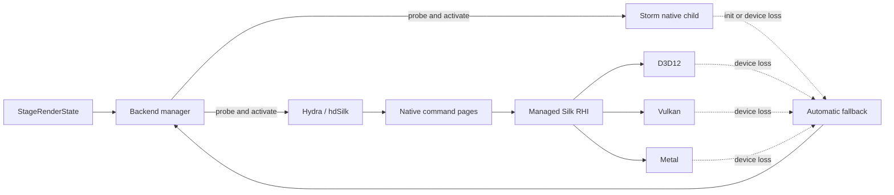

# Rendering

Use this guide to trace renderer-neutral state through Storm or the hdSilk command-page path, then
find the backend selection, fallback, picking, presentation, and platform evidence details.

**On this page:** [Backend flow](#backend-flow) ·
[Headless CI rendering](#headless-ci-rendering-on-linux) ·
[hdSilk shader pipeline cache](#hdsilk-shader-pipeline-cache) ·
[Picking](#renderer-neutral-picking-contract) ·
[Vulkan composition](#avalonia-vulkan-composition-smoke) ·
[Related documentation](#related-documentation)

## Backend flow



Solid arrows show the active data path. Dotted arrows return clean initialization or device-loss
failures to the platform candidate order; they do not imply recovery from a process-ending driver
crash.

Hydra/Storm is the primary viewer renderer. The fallback is a custom Hydra renderer that emits dirty
scene updates into native-owned command pages consumed by managed Silk.NET code.

## Headless CI rendering on Linux

Linux CI can exercise the rendering path today without an interactive GPU by using the Silk Vulkan
backend with SwiftShader. The package-only Imaging gate publishes and runs a real consumer with
these references:

```xml
<ItemGroup>
  <PackageReference Include="OpenUsd" Version="0.14.0-alpha" />
  <PackageReference Include="OpenUsd.Rendering.Silk.Vulkan" Version="0.14.0-alpha" />
  <PackageReference Include="OpenUsd.Runtime.Imaging" Version="0.14.0-alpha" />
</ItemGroup>
```

`OpenUsd.Rendering.Silk.Vulkan` brings Silk.NET's Vulkan loader and the pinned
`Stride.Dependencies.SwiftShader` package. `OpenUsd.Runtime.Imaging` brings the matching Core
runtime through the RID-specific Imaging package selected for the published app. Publish for
`linux-x64` in CI or when publishing from a different host. A RID-less publish on a `linux-x64`
host copies the same runtime assets, but unsupported hosts must set `RuntimeIdentifier`
explicitly. Run from the publish directory and point the Vulkan loader at the packaged SwiftShader
ICD:

```bash
dotnet publish -c Release -r linux-x64 -o artifacts/viewer-smoke
cd artifacts/viewer-smoke
export VK_ICD_FILENAMES="$PWD/vk_swiftshader_icd.json"
export VK_DRIVER_FILES="$VK_ICD_FILENAMES"
export LD_LIBRARY_PATH="$PWD"
export LD_PRELOAD="$PWD/libvulkan.so"
./ViewerSmoke
```

The package test asserts that this path reports `GPU_BACKEND=VULKAN_SWIFTSHADER`,
`SOFTWARE_DEVICE=true`, and `INCREMENTAL_GPU_UPLOAD=true` after opening a packaged USDA stage and
uploading one hdSilk page. Repository CI also runs `eng/run-parity-capture.ps1 -Rid linux-x64`
under Xvfb so the Storm/GLX side of the parity capture has a display while the managed Vulkan side
uses the same software Vulkan runtime.

The normal Windows Viewer keeps one Avalonia shell fixed to `Win32RenderingMode.AngleEgl`. Linux keeps one Avalonia
X11/GLX shell: directly on X11, or as a whole-shell XWayland client in a Wayland session. Storm is hosted in an
application-owned native child through `StormNativeControlHost`; D3D12 and Vulkan continue to use Avalonia composition
controls. `RendererSwitchingViewport` swaps these children in one process without restarting `AppBuilder` or replacing
the scheduler's exact `StageRenderState`.

The interactive Viewer can start without `--stage`, then open or drop `.usd`, `.usda`, `.usdc`, and `.usdz` files.
Open, reload, layer commands, and shutdown are serialized per document; playback and pending time updates stop before
the old render coordinator and backend are disposed or when refreshed authored timing changes. One scheduler callback
detaches hierarchy, authored timing, and the local layer stack in strong-to-weak order, including root, session, current
edit-target, and retained muted-layer state. The Layers tab exposes explicit root/session edit-target buttons and mute
controls only for eligible local sublayers; commands use scheduler edits with composition invalidation, native failures
are surfaced, and no layer action runs in automated evidence modes. Layer refresh preserves valid selection and current
time, clears selection when composition removes its prim, and clamps time only when a new finite authored range requires
it. Invalid timing is reported rather than replaced, while finite ranges remain available for invariant numeric entry
and slider scrubbing. Playback advances renderer-neutral `StageRenderState.Time` at the authored frame cadence,
coalesces pending updates, and loops from the authored end to start. Hierarchy data is filtered and expanded
managed-side, while the property inspector queries only the selected prim. A missing plugin directory disables rendering
but does not disable hierarchy or layer inspection. Up to ten normalized recent paths are stored under
`LocalApplicationData/OpenUsd/Viewer`; missing entries are removed when the list is loaded.

Storm subdivision remains measured at the parity harness's Low complexity. At Low, hdSilk intentionally publishes the
same coarse `HdMeshUtil` triangle-list path it used before subdivision support, so the ungated `catmullClark` frustum
still records the known 0.931015 adjusted-IoU divergence from Storm's coarse all-quad output. That measurement is not
the subdivision implementation gate.

`RenderComplexity` now reaches UsdImaging and selects uniform mesh refinement level 0, 1, 2, or 3 for Low, Medium, High,
or VeryHigh. `HdSilkMeshSubdivision` owns one cached OpenSubdiv `Far::TopologyRefiner` and evaluates Catmull-Clark,
Loop, and bilinear schemes with USD boundary, face-varying, crease, corner, triangle, orientation, and hole semantics.
Points and vertex, varying, face-varying, and uniform primvars follow the refined topology; animated points reuse the
cached refiner, and normals are normalized after interpolation. Refinement is refused before allocation when its
predicted vertices or faces exceed the `1 << 21` bounds. Unsupported or invalid topology and undescribable face-varying
channels publish the complete control cage with a bounded diagnostic, never a partial surface. The analytic
`hdsilk_subdivision_probe` gates exact level counts, known Catmull-Clark positions, primvar partition of unity,
creases/corners, holes, subset mapping, face-varying values and normals, bilinear and Loop refinement, cache reuse, and
bounded fallback.

`openusd_storm_child` owns the child HWND/XID/NSView and one dedicated render thread. Native views are created and
destroyed only on their UI/creator thread; wrong-thread creation, resize, and destruction are rejected without changing
ownership. Windows and Linux create OpenGL 4.6/4.5 compatibility contexts for WGL/GLX on the render thread. On macOS,
the Cocoa main thread creates and attaches the NSView and application-owned NSOpenGLContext drawable; the render thread
alone makes the OpenGL 4.1 core context current, updates it, drives Storm, preserves the completed frame, flushes,
recreates the renderer, and clears current ownership. The child preserves `openusd_hydra`'s actual `Storm / Metal`
renderer name, rejects any other Hgi, and appends only `OpenGL 4.1 core presentation`. Main-thread waits pump Cocoa
work so context recreation cannot deadlock the render thread.

The Storm child v8 C ABI provides create/retryable destroy, synchronous render, revision-tagged asynchronous render
requests, prioritized synchronous picking and packed selection updates, resize/DPI/visibility/focus, context-loss
recreation, diagnostics, and explicit framebuffer evidence capture. Every render request carries the shared
project-owned `openusd_render_camera`: `AUTO` preserves the fixed `(4,3,4)` look-at and 45-degree perspective camera,
while `MATRICES` carries finite row-major double view/projection matrices. The struct has stable natural layout
(`struct_size`, 32-bit mode, then two 16-double matrices), contains no booleans, and is also used by Storm ABI v8 and
hdSilk session ABI v5; the hdSilk page ABI is v23. Asynchronous requests coalesce to one latest time/revision/camera;
Stop, pick, selection, and other synchronous commands take priority, queued waiters are completed with cancellation, and
new commands are rejected once closing begins. Native handles use a registry-backed never-dereferenced token so
operations racing teardown retain shared state rather than waiting on freed memory. Managed session operations use one
operation lease, and backend disposal dispatches session destruction and control detachment together to the UI thread.

`CameraState.FromStageCamera` creates a renderer-neutral matrix camera directly from a `UsdGeomCamera` prim. The
overloads without viewport dimensions preserve the authored aperture aspect; pass `ViewportDimensions` or width/height
for offscreen captures so the same shared aperture-conformance and projection path used by the Viewer is applied to the
target output aspect. Numeric-time overloads sample both the camera optics and composed world transform at that time.

`SilkFrameCapturer` captures **repeatedly** from one hdSilk session. `OpenUsdSilkSession.Sync` reports only what
changed since the previous synchronization, so the first page carries the whole scene and later pages carry deltas.
A capturer therefore has to keep its renderer — and with it the retained scene — alive across captures:

```csharp
using var capturer = new SilkFrameCapturer(device);
SilkFrameCaptureResult first = capturer.Capture(session, 640, 360, camera: a);
SilkFrameCaptureResult second = capturer.Capture(session, 640, 360, camera: b);
```

The one-shot `SilkFrameCapture.Capture` helper builds a renderer per call and so can only serve a session that has
never been synchronized. It now throws `InvalidOperationException` naming `SilkFrameCapturer` when handed an
already-synchronized session, rather than silently returning a cleared frame with `DrawCount = 0`. A session that has
never been synchronized still returns a blank frame for a stage with no renderable geometry, which is not an error.

`SilkFrameCapture.CaptureRetained` is the capture path for a live presentation renderer, such as the Viewer's hdSilk
backend. The presentation loop has already synchronized the session for the frame on screen, so a second session sync
would receive no geometry. `CaptureRetained` instead renders the existing `ISilkRenderTargetRenderer` offscreen without
synchronizing hdSilk, using the retained scene, camera, time code, and complexity from the most recently presented
frame. Because no command page is consumed, the result reports `CommandCount = 0` and echoes the caller-supplied page
revision.

### CPU capture with OpenColorIO

For export workflows that require colour-managed output, the capture path supports an optional
`SilkOpenColorIoProcessor`. The processor is created once from a `SilkOpenColorIoDisplayTransform`
(OCIO config path, source colour space, optional display/view/looks) and reused across frames:

```csharp
var transform = new SilkOpenColorIoDisplayTransform(
    configPath: "studio.ocio",
    sourceColorSpace: "ACES - ACEScg",
    display: "sRGB",
    view: "ACES 1.0 - SDR Video");
using var processor = transform.CreateProcessor();
SilkFrameCaptureResult result = SilkFrameCapture.Capture(
    session, device, 1920, 1080, renderSettings, processor);
```

`RenderSettings.Exposure` is applied to linear RGB channels **before** the OCIO display/view
transform. `RenderSettings.OutputTransform` must be `Identity` when an OCIO processor is
supplied; supplying `Reinhard` or any other built-in transform alongside OCIO is rejected to
prevent double-transforming. `RenderSettings.DisplayTransform` must also be `null` on this path,
because the GPU display transform and this CPU processor are two conversions of the same image
and running both would colour manage it twice. This path is unchanged by the live GPU display
transform below: the same processor, the same bulk native call, and the same bytes.

### Live GPU display transforms

`RenderSettings.DisplayTransform` carries a renderer-neutral `RenderDisplayTransform`: an OCIO
config path plus an optional display, view, and look, or a prebuilt immutable descriptor. When it
is set, hdSilk renders the scene into a renderer-owned linear RGBA16Float intermediate at the
target's dimensions with no output transform and no exposure, then runs one fullscreen pass that
applies exposure and the colour-managed transform into the caller's target. This affects live
Viewer presentation and ordinary `SilkFrameCapture` captures identically, because both go through
`SilkMeshRenderer.RenderCore`.

```csharp
RenderSettings settings = RenderSettings.Default with
{
    DisplayTransform = new RenderDisplayTransform(
        configPath: "studio.ocio",
        sourceColorSpace: "ACES - ACEScg",
        display: "sRGB",
        view: "ACES 1.0 - SDR Video"),
};
SilkFrameCaptureResult result = SilkFrameCapture.Capture(
    session, device, 1920, 1080, settings);
```

**Ordering.** Exposure is applied to linear RGB first, then the display transform, on both the GPU
and the CPU export path, so a presented frame and an exported frame agree on what exposure means.
Alpha is passed through unchanged and clamped to `[0, 1]`; the selection outline still composites
after the display transform, exactly as it already composited after CPU tone mapping.

**Looks.** An explicit `Look` is an override, not an addition. It is applied through
OpenColorIO's `LegacyViewingPipeline`, which converts into each look's declared process space,
applies the look there, converts back through its result space, and bypasses the view's own
looks. Composing a look in the source space, or leaving the view's authored looks in place
alongside an override, produces a plausible-but-wrong image for any config whose look process
space differs from the source space or whose view declares a look;
`test-assets/ocio-look-override-config.ocio` is exactly such a config and
`SilkDisplayTransformNativeTests` pins the analytic result. When no override is supplied the
view's own looks still apply, unchanged.

**What is implemented: a precise 3D-LUT subset, not arbitrary OCIO GPU shader generation.** The
transform is baked once, through the same `SilkOpenColorIoProcessor` the CPU export path uses,
into a bounded lattice that the GPU samples. The whole lattice is converted in exactly one bulk
transition to native code -- one RGBA32Float image in, one display-referred RGBA8 image out --
so there is no per-entry and no per-pixel native call anywhere, and no native call at all on the
per-frame path once a lattice exists. The lattice source is 32-bit float rather than half
precision because its samples are generated rather than captured: a half-float source underflows
to zero below 2^-14 and overflows to infinity above 2^15, which would silently misrepresent the
samples the shaper asked for at the widest accepted bounds. The capture and export path keeps its
own half-float entry point, byte for byte unchanged. The lattice is a cube of `LatticeSize`
entries per axis unrolled into a single RGBA8 strip of `LatticeSize` tiles, so it uploads and
samples as an ordinary 2D texture on every backend; red varies across a tile, green down a tile,
and blue selects the tile, and the blue axis is interpolated explicitly with two bilinear samples
because hardware filtering cannot cross tiles.

**Orientation.** The fullscreen triangle is generated from the vertex id, so which framebuffer row
a fragment lands on is decided by the backend's origin convention while the texture coordinate it
carries is not. On a backend whose framebuffer origin opposes clip-space Y -- Vulkan, reported by
`ISilkGraphicsDevice.ClipSpaceYPointsDown` -- the sampled V is flipped through a shader constant,
so one checked vertex program serves every RHI and the composite is upright everywhere. Both the
D3D12 and Vulkan gates render a vertically asymmetric scene through an identity view and require
the transformed image to match the untransformed one row for row.

**Configuration identity.** A path is not an identity, and neither is file metadata. Every lattice
lookup revalidates the configuration through a content-aware digest: OpenColorIO's own
`Config::getCacheID` taken with the config's current context, combined with a hash of the config
file's bytes and of the bytes of every file its transforms reference, resolved through that same
context. Metadata alone is not enough, because a LUT rewritten to the same length inside one clock
tick keeps its size and its modification time while changing every rendered pixel -- and that is
exactly what `Config::getCacheID` misses. The walk covers colour spaces, looks, view transforms,
and named transforms, recursing through group transforms, and is bounded at 256 files and 64 MiB;
beyond either bound the identity is marked as bounded rather than silently claiming to be
exhaustive. An edit, a changed or deleted referenced LUT, a retargeted link, and a context change
that resolves a reference elsewhere therefore each invalidate the cached lattice on the CPU and,
because the pass keys its uploaded texture on the lattice the cache returned rather than on the
transform that was asked for, on the GPU as well.

The walk is transitive, not one level deep. A `FileTransform` naming a CTF or CLF file is opened
and its `Reference` elements are followed to the files they name, recursively, so editing a LUT
that only a referenced process list mentions still changes the identity. Whether a dependency *is*
a process list is decided by its content, never by its name: the leading bytes are inspected for an
optional byte-order mark, XML whitespace, and `<`. OpenColorIO falls back to trying its readers when
an extension identifies no format, so a valid process list called `grade.lut`, or one reached
through a symbolic link whose name says nothing, really is loaded as CTF and really can reference
more files -- and an extension test called such an identity exhaustive while ignoring every one of
them. The alias case is proved by a test that requires a real symbolic link and refuses to
substitute a copy; `eng/test-ocio-alias-evidence.ps1` reads the evidence the test writes and fails
on Linux, where unprivileged symbolic links are always available, unless it actually executed.

Process lists are read by a real, deliberately conservative XML reader rather than scanned for a
substring: it skips XML declarations, processing instructions, comments, and CDATA sections, reads
tag and attribute names as names, tracks element nesting, honours attribute quoting, normalizes
attribute values as XML requires (line ends to LF, then each literal tab, line feed, and carriage
return to one space, before entity decoding and never after), and decodes the predefined entities
together with decimal and hexadecimal character references of any length into UTF-8. Substring
scanning could not be made correct here -- `<Reference` also matches `<ReferenceList`, `path=` also
matches `xpath=`, and a `&gt;` in any attribute ends the element early -- and each of those
mistakes is either a stale image or a rebake every frame.

The reader is exact rather than a superset. Only a `<Reference>` that is a direct child of the root
`<ProcessList>` is a reference, which is where OpenColorIO's CTF reader accepts one; a `<Reference>`
inside `<Info>` or any other element is metadata and is ignored. Names are matched complete and
unprefixed, with ASCII case folding, matching OpenColorIO's `Platform::Strcasecmp`. The `basePath`
attribute is not honoured, because OpenColorIO accepts and discards it. Anything the reader will not
interpret with certainty -- a DOCTYPE, a general or unknown entity reference, a namespace-prefixed
name, unbalanced or mismatched markup, a non-`ProcessList` root, a document past its 16 MiB bound --
makes the file report itself unsupported. The whole identity is then marked non-exhaustive and the
managed cache refuses the transform with an explicit diagnostic, so an uncertain parse becomes a
named refusal rather than a silently stale image.

Every reference is resolved through OpenColorIO's own `Context::resolveFileLocation` on the config's
**unchanged** context, exactly as written, for nested references as much as for the config's own
file transforms. Prepending the referencing document's directory would make the identity depend on
a file OpenColorIO never opens, and when a same-named file exists both beside the referencing
document and on the search path it would hash the wrong one. An unresolvable reference stays in the
identity by name, so a later resolution is a change rather than a silent match. Paths are then
resolved to a canonical form and recorded in a visited set, so a cycle terminates and a file reached
through several spellings -- `scale.spi1d`, `./scale.spi1d`, a link -- is hashed once. Deduplication
happens *before* the 256-file and 64 MiB bounds are applied, so a config that names one LUT from
three hundred colour spaces stays exhaustive rather than being downgraded by its own repetition.
Windows paths are converted through the wide-character APIs throughout, so a config or LUT under a
non-ASCII directory is read rather than silently missed.

One revalidation costs exactly one walk. The identity is a fixed-format digest, so the managed
side sizes its buffer statically and calls the entry point once, retrying only on a genuine
capacity shortfall; probing for a length first ran the whole transitive file walk twice for every
observation. `openusd_ocio_config_dependency_walks` reports the process-wide walk count, surfaced
as `SilkOpenColorIoConfigIdentityProvider.NativeDependencyWalks`, so that cost is asserted rather
than assumed.

The native ABI returns whether the walk was exhaustive as an explicit out-parameter, and the
managed cache refuses any transform whose configuration identity is only partial: it drops every
retained entry for that config, raises `TransformUnsupported` with the bound that was exceeded, and
records the refusal in `SilkDisplayTransformLatticeCache.PartialIdentityRefusals`. A partial
identity never authorizes a retained success hit and never becomes a negative-cache entry that
would suppress retries, because something the walk never looked at can change without the identity
changing. Reporting the configuration as unsupported is the only answer that stays true.

OpenColorIO caches parsed configs, loaded file transforms, and processors process-globally, so an
externally edited LUT is otherwise re-referenced but never re-read. Both the identity read and
every processor construction therefore clear those caches first, under one process-wide interlock
so a clear can never overlap a build. Reading an identity re-parses the config, so it is read at
most once per `SilkOpenColorIoConfigIdentityProvider` `RevalidationInterval` -- 250 ms by default,
and the exact documented staleness window. Failures are cached under the same
transform-plus-identity key, so a transform naming a view the config does not contain fails once
rather than rebuilding an OpenColorIO processor every frame, and is retried as soon as the
configuration changes. The processor is constructed and validated before any lattice memory is
allocated.

Restoring a byte-identical file after a deletion produces a new identity rather than the original
one, because the digest folds in OpenColorIO's metadata-derived identity as well. That costs one
extra rebake and never a stale image, which is the safe direction for the trade.

**Configuration paths must be absolute.** `RenderDisplayTransform` rejects a relative path outright
rather than resolving it against the working directory and comparing normalized strings, because
string comparison is not a containment guarantee: a link defeats it and a working directory that
changes between validation and use defeats it. Both real sources of a config path -- the Viewer's
file chooser and OpenColorIO's own `OCIO` environment variable -- already yield absolute paths.

Each axis is indexed through a base-2 logarithmic shaper, which is what lets a bounded table cover
an unbounded scene-referred range: lattice index `i` corresponds to the linear value
`2^(ShaperMinimumLog2 + i / (LatticeSize - 1) * ShaperRangeLog2)`. The defaults are a 64-entry edge
over the 20 stops from `2^-14` to `2^6`, about a third of a stop between neighbours.
`RenderDisplayTransform` accepts edges from 8 to 64 and shaper bounds from -32 to +32 stops with a
minimum one-stop interval, so the largest lattice a caller can ask for is 64x64x64 RGBA8 --
1 MiB, held in a `SilkDisplayTransformLatticeCache` bounded by both an entry count (8 by default)
and a byte budget (16 MiB by default) with least-recently-used eviction.

`RenderDisplayTransform.CacheKey` is length-prefixed and therefore injective. Colour-space,
display, view, and look names are free-form strings, so joining them with a separator lets two
different transforms produce one key -- and two transforms sharing a cache key share a baked
lattice and a cached failure, which is a wrong image rather than a wasted rebake. Every field is
written as its length, a colon, its content, and a terminator, and an absent optional name is a
distinct token from an empty one, so no field content can be mistaken for a boundary.

**Exact exclusions.** This is a display/view/look pipeline evaluated through a lattice, not a
general OCIO GPU implementation:

- No OCIO GPU shader generation. `GpuShaderDesc`, generated GLSL/HLSL/MSL, and OCIO's own dynamic
  properties are not used, so a transform's parameters cannot be changed per frame without
  rebaking. Exposure is the deliberate exception: it is a shader uniform applied before the
  shaper, so changing it does not rebake anything.
- No 1D shaper LUTs from the config. The shaper is the documented log2 mapping above, not an
  `AllocationTransform` or config-authored shaper space.
- No per-frame OpenColorIO context switching. The context used is the config's current one; a
  change to it is picked up as a configuration identity change and rebakes the lattice, but a
  caller cannot supply a different context per frame.
- Values outside the shaper interval clamp to the nearest lattice edge rather than extrapolating.
  Non-positive channels, including negative wide-gamut values, clamp to the lattice floor.
- The lattice stores display code values at 8 bits, matching the 8-bit target it feeds, and
  interpolates between them. Interpolated values therefore differ slightly from a directly
  evaluated CPU result. That difference is asserted, not assumed: the D3D12 WARP and Vulkan
  SwiftShader conformance gates compare every GPU pixel against the CPU processor's own output for
  the same input and require agreement within 2 code values.
- Alpha is not colour managed; it is passed through and clamped.
- Only the built-in `SilkMeshRenderer` supports it. A custom `ISilkRenderTargetRenderer` passed to
  `SilkFrameCapture.CaptureRetained` alongside a display transform is rejected rather than
  silently rendered untransformed.

**Failures are named, never silently identity.** A missing or unopenable config, a config that
does not contain the requested colour space, display, view, or look, and a device with no
display-transform capability each set `SilkMeshRenderer.DisplayTransformDiagnostics.Status` and
publish one bounded `RenderDiagnostic` on `SilkMeshRenderer.DisplayTransformDiagnostic`
(`OPENUSD_SILK_DISPLAY_TRANSFORM_CONFIG_UNAVAILABLE`,
`OPENUSD_SILK_DISPLAY_TRANSFORM_UNSUPPORTED`, or
`OPENUSD_SILK_DISPLAY_TRANSFORM_DEVICE_UNSUPPORTED`). Captures append that diagnostic to
`SilkFrameCaptureResult.Diagnostics`. The frame falls back to untransformed linear colour, which
is visibly different from a successful transform and is reported as such, rather than returning a
success-shaped identity result.

Those diagnostics are correlated with the request they describe.
`SilkDisplayTransformDiagnostics.RequestKey` carries the `RenderDisplayTransform.CacheKey` the
renderer last evaluated, or `null` when none was requested. The counters are cumulative and a
consumer reads them asynchronously, so without the key a refusal of a transform that has already
been replaced is indistinguishable from a refusal of the current one -- and acting on it disables
a transform that is running correctly.

**Backends.** The fullscreen pass is a checked shader family, `display.transform.vertex` and
`display.transform.fragment`, built by the same authority gate as every other checked program and
bound at set 0 bindings 0-3 (`t0`/`t1`/`s0`/`b0` on D3D12). D3D12 and Vulkan are covered by
executable pixel gates on WARP and SwiftShader respectively, including device-generation
invalidation and disposal through the same generation the selection outline uses. The Metal
implementation is source-complete and compile-only, consistent with every other Metal capability
in this repository: its MSL is generated and checked in by the Windows authority gate, and the
combined `mesh.metallib` that carries it is produced only by the macOS packaging workflow.

The Vulkan binding creates one `VkDescriptorSetLayout` per binding and destroys it *after* the
descriptor pool that owns the set it describes, in every teardown path including a partially
initialized binding. The order is not interchangeable: SwiftShader keeps a pointer to the layout
inside the allocated set and dereferences it from `vkUpdateDescriptorSets`, so destroying the
layout early is a use-after-free. Both directions are counted at the native call, not on the
managed wrapper, and `VulkanDisplayTransformNativeStatistics.LiveSetLayouts` is asserted back to
zero by the SwiftShader gate -- a wrapper count returns to zero whether or not the handle was ever
destroyed, which is precisely why the leak was invisible to it.

The SwiftShader gate skips only on proven absence of the OpenColorIO native library or one of its
entry points, detected through the `DllNotFoundException`, `EntryPointNotFoundException`, or
`BadImageFormatException` that the lattice provider preserves as the inner exception. A malformed
config, a display or view the config does not contain, a processor that will not build, and a
lattice that will not bake are all failures in code this repository owns, and are asserted rather
than skipped; a dedicated red test proves those paths reach assertions instead of `Skip.Test`.

Viewer frame adapters capture one immutable `StageRenderState` request and forward its exact revision,
time, and camera. Storm synchronous/asynchronous requests and the D3D12, Vulkan, and Metal hdSilk
session sync paths therefore cannot combine a new revision with an older camera. The legacy
OpenGL compatibility host uses the same snapshot; automatic camera mode remains unchanged.

hdSilk normalizes both clip-space conventions in renderer-neutral scene constants rather than per backend, so one
`objectToClip` matrix drives every geometry pass on every RHI. Depth is converted from the OpenGL `[-1, 1]` range the
Storm and Viewer cameras produce to the `[0, 1]` range D3D12, Vulkan, and Metal expect. Clip-space Y is mirrored when
`ISilkGraphicsDevice.ClipSpaceYPointsDown` is set, which only the Vulkan backend reports, because Vulkan's framebuffer
origin is top-left while D3D12 and Metal are bottom-left. Mirroring in the scene constants rather than through a
negative-height viewport keeps fullscreen composite passes such as the selection outline upright: those share the
backend's generic command-list viewport but never use `objectToClip`. `SilkCrossBackendParityTests` renders a
vertically asymmetric scene and separately proves that scene compares unequal to its own vertical mirror, so a
regression in either convention cannot pass the gate vacuously.

### hdSilk material texture table capability

Material texture bindings remain renderer-neutral `SilkBindingLayoutDescriptor.MaterialSlots`: set 0/binding 0 is
still the 80-byte `SceneParameters` uniform, and material slots continue to be validated through
`RequireMaterialSlot`. Devices now also report
`SilkGraphicsCapabilities.SupportsDescriptorIndexedTextureTables`. When it is `true`, the backend may copy material
texture and sampler descriptors into a persistent descriptor-indexed table before a draw; when it is `false`, the
backend must use the existing per-draw descriptor path. D3D12 enables the shared table only for Resource Binding
Tier 2 or Tier 3 devices and falls back to per-draw shader-visible heaps otherwise. Vulkan enables
`runtimeDescriptorArray`, `descriptorBindingPartiallyBound`, `shaderSampledImageArrayNonUniformIndexing`, and
`descriptorBindingVariableDescriptorCount` only when the device reports them, then allocates draw descriptor sets from
a shared descriptor pool with partially-bound material-slot layout flags. It still falls back to the per-draw pool when
the feature gate or shared pool allocation is unavailable. Metal reports the capability only for Tier 2 argument-buffer
devices. Those devices encode material textures and samplers into a persistent fragment argument buffer at Metal buffer
index 1, using the material slot binding as the argument-buffer index so the same logical slot is reached by both the
argument-buffer and per-draw fallback paths. Tier 1 devices keep using separate `setFragmentTexture` and
`setFragmentSamplerState` calls. Metal argument buffers do not make referenced textures resident automatically, so each
draw also calls `useResources` for encoded textures; texture and sampler wrappers remain leased until the submitted
command buffer completes because the argument buffer stores live Metal object references for the draw.

### hdSilk texture and render-target formats

The renderer-neutral RHI supports `Rgba8Unorm`, `Rgba16Float`, and `Rgba32Float` color
targets, `R32Float` sampled textures, and `D32Float` depth targets. The D3D12, Vulkan,
and Metal backends map those formats without treating single-channel `R32Float` as
depth. Texture upload and raw readback sizes derive from the format rather than a
fixed four-byte texel. `Span<float>` readback is available for `R32Float`,
`Rgba32Float`, and `D32Float`; `Rgba16Float` uses tightly packed raw bytes so callers
can preserve half-float values exactly.

Mesh pipelines include the color format in their cache identity and can render into
all three color-target formats. Selection masks and picking remain RGBA8 identity
surfaces, while the fullscreen selection outline pipeline matches and blends into
the visible color target's format. `SilkFrameCapture` remains an explicit display
capture: it renders scene color into a linear RGBA16Float intermediate, then applies
exposure and the requested output transform once while producing tightly
packed RGBA8. Display-referred selection outlines are composited into that RGBA8 image
after the output transform. Callers that need raw HDR data should use the typed RHI
readback contract directly rather than treating display capture bytes as scene-linear values.

### hdSilk textured-dome image-based lighting

A textured `UsdLuxDomeLight` is prefiltered into a **directional image-based environment**: a
cosine-convolved diffuse irradiance map and a roughness-sliced prefiltered specular radiance atlas,
both baked in world space so the dome's authored orientation is resolved in the texels, plus a
numerically integrated split-sum BRDF table. A dome the prefilter cannot accept keeps the
**mean-radiance ambient fallback** described further down, which is a single colour for the whole sky
and is always named by a diagnostic. The two are mutually exclusive per dome, so a dome is never counted
both as an image and as an untextured approximation of itself.

An authored dome light is **scene lighting**. A stage whose only light is a dome therefore suppresses
the fallback headlight exactly as an analytic light does, and its pixels are the dome's, not a camera
light's. That claim is carried by its own frame-constant flag, separate from whether an environment was
prefiltered and separate from whether the ambient term is non-zero: a dome authored black, a dome
authored specular-only, and a dome the prefilter refused all resolve to a zero ambient and a disabled
environment, so a headlight keyed on either would switch itself on for exactly the stages that are lit
as their author asked.

An **untextured** dome is included in that claim too, and it reaches this renderer by a different route:
it publishes no environment record at all, because hdSilk folds its emission into the frame's ambient
colour and sets the ambient *intensity* to one to record that a dome exists. That bit is the only
evidence such a dome leaves when its colour is black or its diffuse is zero, and the managed frame
writer repurposes the ambient slot's `w` component as the direct-light count -- so it is read from the
retained frame state and folded into the same flag rather than being discarded.

`UsdLuxDomeLight` reaches hdSilk as ambient-only light state, and an ambient colour cannot describe an
image. Since page ABI v16 a dome that carries an authored `texture:file` is therefore published as its
own `ENVIRONMENT_UPSERT`/`ENVIRONMENT_REMOVE` command instead of being folded into the fixed light
table's ambient term, and hdSilk deliberately excludes it from that accumulation. An untextured dome is
unchanged by the addition and keeps the existing `0.96 * color * intensity * 2^exposure * diffuse`
ambient term.

The environment record carries the resolved texture asset path, the declared `texture:format`, a source
colour space, the row-major light-to-world transform that orients the image, the unmultiplied authored
`color`, `intensity`, `exposure`, `diffuse` and `specular` inputs, and a bitmask naming authored dome
behaviour hdSilk did not put on the wire. `colorSpace` is published as `Auto`: UsdLux carries a dome
texture's colour space as asset-path metadata, which Hydra light parameters do not expose, so hdSilk
states that it does not know rather than asserting a space it never read. `Auto` is then resolved
**against the image-info v2 observation** the describer reports -- the effective colour space the decoder
would actually apply, not a guess from the file extension -- and only falls back to inferring from the
decoded pixel format (eight-bit is sRGB-encoded and is linearized; float is already linear radiance)
when no describer is available. An authored `Raw` or `Srgb` value overrides both. **No ABI change was
needed for this slice**: every input the prefilter reads was already on the wire at v16.

`texture:format=automatic` is only accepted when the describer reports an observable 2:1 shape, which is
the only parameterization this renderer can verify. Without a describer, or with a shape that is not
2:1, `automatic` is diagnosed and falls back rather than being assumed to be lat-long. `mirroredBall`
and `cube` are unsupported by name.

`SilkSceneState.Environments` retains those records by prim path and `SilkSceneState.EnvironmentRevision`
moves whenever the set changes. `SilkSceneGpuResources.PrepareEnvironmentLighting` runs once per
revision, before the frame constants are packed, and is what resolves which domes reach the prefiltered
environment and which fall back.

#### What is implemented

**Two prefiltered maps, both equirectangular and both world-oriented.** Each accepted dome's decoded
image is traversed once; every source texel's direction is taken through the dome's authored
light-to-world rotation and scattered into a shared **world-space** radiance lattice, weighted by the
texel's own solid angle. Scattering rather than gathering is what preserves energy when the source is
far finer than the lattice: a one-texel sun contributes its full radiance times its full solid angle to
exactly one bin instead of being missed by a point sample. A bin no source texel landed in -- possible
only when the source is coarser than the lattice -- is gather-filled from the bin's own centre
direction, so coverage is total either way. Only the transform's upper 3x3 is read, and it is
re-orthonormalized: a dome is infinitely distant, so translation cannot move the sky and a non-uniform
scale must not skew it.

**The lat-long convention is USD's.** `u = frac((atan2(z, x) + pi/2) / 2pi)` and `v = acos(y) / pi`,
matching `hdSt/shaders/domeLight.glslfx`, so `u = 0` is `-Z`, `0.25` is `+X`, `0.5` is `+Z` and `0.75`
is `-X`. The CPU projection and the shader projection are the same expression, and the gate that holds
them there compares against those **external** reference directions rather than against each other: a
mapping that is self-inverse but rotated a quarter turn from USD's would pass a round-trip test and
place every reflection in the wrong place.

Because the lattice is in world space, **several domes compose exactly by addition** and the fragment
needs no per-dome loop and no orientation matrix at all. `inputs:diffuse` and `inputs:specular` are per
dome, so two lattices are accumulated -- one weighted by each -- and the two maps are built from their
own. A dome authored diffuse-only therefore lights without reflecting, and one authored specular-only
reflects without lighting.

**A world-space shading basis.** The maps are world-space, so the directions that index them must be
too. The vertex stage recovers the object-to-world matrix from the transforms it already receives and
emits a world-space normal through that matrix's **cofactor** -- the inverse transpose without the
determinant, which is the same direction and is defined for a singular matrix -- so a non-uniformly
scaled or instanced prim reflects and is lit from the directions it actually faces rather than from
skewed ones. When the permutation samples a normal map the tangent is carried through the same matrix
and the bitangent is rebuilt in world space, so the perturbed normal is a world-space normal and not an
object-space one relabelled.

**Diffuse irradiance.** `E(n) = sum L(l) max(0, n.l) dw` over every radiance bin, written to a 32x16
equirectangular map. For a constant environment this returns exactly `pi * L`, which is the identity the
fragment's Lambert normalization depends on: the diffuse lobe already carries its `1/pi`, so a uniform
sky reproduces the uniform-sky result exactly rather than approximately. The same `0.96` unit-white-dome
normalization an untextured dome uses is folded into the radiance scale, so a dome whose image is
constant `1.0` lights a matte surface with exactly the value the untextured unit dome it replaced did.

**Specular radiance slices, not mips.** Six 64x32 equirectangular slices stacked into one 64x192 atlas,
one per roughness step. Slice `i` of `n` is prefiltered for `roughness = i / (n - 1)` with the GGX normal
distribution evaluated at the half vector between the slice's reflection direction and each radiance
bin, under the standard split-sum assumption `N = V = R`. The weights are **normalized by their own
sum**, so a constant environment prefilters to itself at every roughness and no energy is created or
lost by the lattice. Every slice keeps the **full angular resolution** of the base lattice, which is
what a mip chain cannot do: a trailing 1x1 mip has one texel for the whole sphere, so a rough surface
would return the colour of `+X` instead of an integral over the hemisphere. The identity that gates this
is exact: at `roughness = 1`, GGX gives `D = 1/pi`, so the prefiltered radiance equals `irradiance / pi`,
and the test asserts that rather than asserting that the value merely looks blurry. The fragment
selects the two bracketing slices from the material's authored roughness and blends them, with a
half-texel inset in V so bilinear filtering cannot bleed one roughness band into the next.

**Deterministic prefilter policy.** Every step of the convolution is a fixed-order double-precision
quadrature over a fixed lattice. There is no random sequence and no iteration count that depends on the
input, so the same authored scene produces the same bytes on every machine and every run. The BRDF table
uses a fixed 1024-point **Hammersley** sequence, which is deterministic in the same sense: it is a
closed-form radical-inverse sequence, not a pseudo-random one, and its length is a constant.

**BRDF table, integrated rather than fitted, from the direct lobe itself.** The second half of the
split-sum approximation is a 32x32 RGBA16F table indexed by `(N.V, roughness)`, numerically integrated
from the **same** GGX distribution and Schlick-GGX geometry the shader's *direct* lighting evaluates,
with GGX importance sampling. It is not Lazarov's analytic fit, which is inaccurate at grazing incidence
and can go negative.

Making the two one BRDF required removing Storm's additive epsilon from the direct distribution.
`Preview.Lighting` writes the GGX numerator as `alphaSquared + 0.001`, which is not the GGX
distribution: at roughness 0.2 `alphaSquared` is 0.0016, so the epsilon inflates the lobe by more than
half, and at roughness 0 it leaves a floor radiating in every direction -- a mirror that glows. It also
broke the split-sum identity outright, because the importance-sampled estimator cancels the distribution
against the sampling density *analytically*, and that cancellation is only exact for a normalized lobe.
The epsilon is gone from both sides; a roughness clamp of 0.001 and a `1e-30` denominator floor do the
job it was there for without adding energy. The same replacement was made in the specular denominator,
where `+ 0.001` on `4 * N.L * N.V` darkened every dim and grazing fragment by 4% or more.

The floor is `1e-30` and not something more comfortable for a reason the gates found: at the minimum
roughness the GGX denominator is `pi * alpha^4`, about `3e-24`, so a `1e-9` floor clamps the peak of
every lobe smoother than roughness 0.1 and costs a roughness-0.05 lobe 42% of its energy.

The denominator is also **grouped** differently from Storm's, and that grouping is **enforced**. Storm writes it as
`n.h^2 * (alpha^2 - 1) + 1`, which is algebraically `n.h^2 * alpha^2 + (1 - n.h^2)` and numerically
nothing like it. At roughness 0.01, `alpha^2` is `1e-8`, so `alpha^2 - 1` rounds to exactly `-1`
in single precision; at `n.h = 1` the whole expression cancels to exactly zero, the lobe divides by
its own guard, and it returns about **three million times its own peak**. Grouping the two small
quantities together never subtracts one from the other, so the value at `n.h = 1` is `alpha^2`
exactly. The prefilter, the split-sum table and the direct lobe all evaluate the same grouping -- the
prefilter used to restate the distribution inline, which is how it kept the cancelling form after the
other two were corrected -- and the GGX inverse-CDF the table importance-samples from is grouped the
same way, so the density it divides by stays the density of the lobe it evaluates.

Because the two forms are the same expression in exact arithmetic, an optimizer is entitled to turn one
into the other: reassociating `n2 * a2 + (1 - n2)` into `1 + n2 * (a2 - 1)` is legal under fast
floating-point rules and would reintroduce exactly the cancellation the grouping exists to avoid. Every
value on the chain therefore carries the `precise` qualifier -- the HLSL and Slang contract forbidding
reassociation and contraction along it -- and each step is materialized as its own named value rather
than written as one expression, so the two small quantities cannot be folded back through `a2 - 1`.

That the contract survived compilation is gated per artifact rather than assumed, by
`SilkCheckedShaderPrecisionTests` and the conformance suite:

- **SPIR-V** is parsed and its dataflow checked. Each shipped lit fragment contains exactly two
  `OpFAdd(OpFMul(x, y), OpFSub(1.0, x))` groupings -- the base lobe and the clearcoat lobe -- with the
  same value on both sides. A deliberately reassociated build matches zero, which is how the check is
  known to be non-vacuous rather than merely green.
- **Metal shading language** carries `precise` verbatim, and the emitted source adds the scaled lobe to
  the complement rather than reassociating. Metal is otherwise gated by source and translation coverage
  only, so this is the whole of the evidence for that backend.
- **DXIL** is gated by **execution** instead, because its bitcode has no cheap disassembly here.
  `TheSpecularLobeReturnsItsPeakAtExactAlignment` renders the one case where the two forms differ: the
  camera is pushed a million units back so the eye vector rounds to exactly `(0, 0, 1)` at every
  fragment and the light points the same way, which makes `saturate(dot(n, h))` exactly `1.0f`. The
  light is scaled by `1e-8` so the correct peak lands near 20 of 255 while the reassociated one --
  fourteen orders of magnitude higher, because its denominator cancels to zero and divides by the guard
  -- saturates. It was run against a reassociated build on both D3D12 WARP and Vulkan SwiftShader and
  failed on both, which is what makes it evidence rather than decoration.

The table is gated for non-negativity and for energy `<= 1` across the whole domain; the distribution is
gated to integrate to exactly one over the projected hemisphere at every roughness, which an additive
epsilon fails everywhere; and the table's entries are gated against an **independent brute-force
spherical quadrature** of the same lobe, which shares only the lobe expression with the estimator. A
clearcoat lobe reflects the same atlas at its own roughness through the same table.

**Fresnel energy complement on the diffuse lobe.** The environment's diffuse contribution is scaled by
`saturate(1 - F_specular)`, where `F_specular` is the same split-sum specular weight the reflection
uses. Energy the surface reflects specularly is therefore not also delivered diffusely, which is the
convention the direct lighting loop already follows; the two agree instead of double-counting at grazing
incidence.

**Pixel format.** Both maps and the table are RGBA16F, which is the widest format every backend is
*required* to filter linearly -- Vulkan makes `SAMPLED_IMAGE_FILTER_LINEAR` optional for 32-bit float
formats, so a 32-bit environment would sample correctly on two backends and produce blocky
nearest-filtered reflections on a conformant implementation that does not. Values saturate at the
largest finite half rather than becoming an infinity that would poison every filtered neighbourhood.

**Shader resources.** Every checked mesh fragment permutation declares `environmentSampler`
(set 0 binding 32 / `s14` / Metal `sampler(14)`), `environmentIrradiance` (33 / `t17` / `texture(17)`),
`environmentSpecular` (34 / `t18` / `texture(18)`), `environmentBrdfSampler` (35 / `s15` /
`sampler(15)`) and `environmentBrdf` (36 / `t19` / `texture(19)`), and the frame constants carry a
four-value `environmentControls` block naming whether an environment is live, the slice count and the
slice height in normalized V. A frame with no live environment binds a one-texel stand-in in all three
texture slots and never samples them. The environment sampler wraps in U and clamps in V, because
longitude is periodic and latitude is not; the BRDF sampler clamps on both axes.

#### What is not implemented, and is diagnosed rather than faked

| Diagnostic code | Condition |
| --- | --- |
| `OPENUSD_SILK_ENVIRONMENT_MAPPING_UNSUPPORTED` | Non-latlong mapping, or unresolved `automatic`. Falls back. |
| `OPENUSD_SILK_ENVIRONMENT_ASSET_NOT_FOUND` | The texture asset could not be opened. Falls back. |
| `OPENUSD_SILK_ENVIRONMENT_DECODE_FAILED` | Malformed, non-finite, or undecodable image. That dome falls back. |
| `OPENUSD_SILK_ENVIRONMENT_BUDGET_EXCEEDED` | Per-image or aggregate source budget exceeded. Falls back. |
| `OPENUSD_SILK_ENVIRONMENT_FEATURE_UNSUPPORTED` | Temperature, pole-axis, or collection input; may force fallback. |
| `OPENUSD_SILK_ENVIRONMENT_SPECULAR_UNSUPPORTED` | A non-zero `inputs:specular` on a dome that **fell back**. |
| `OPENUSD_SILK_ENVIRONMENT_LIGHTING_LIMIT_EXCEEDED` | More than four textured domes. Falls back. |
| `OPENUSD_SILK_ENVIRONMENT_LIGHTING_UNAVAILABLE` | Prefilter or GPU resources unavailable. All domes fall back. |

Diagnostics are emitted from **two layers** that resolve at different times and are cleared
independently. The prefilter layer says that a dome lost its directional response; the mean-radiance
layer says that a dome could not even be reduced to a colour. They raise the same codes against the same
prims, so clearing by code alone let the second erase the first -- a dome refused by the aggregate budget
was diagnosed, fell back successfully, and the successful fallback wiped the record of the loss. A scene
that silently lost its directionality is not a state this renderer can be in.

Every control diagnostic above is emitted from the authored record, **independently of whether the
prefilter succeeded**. A dome that prefilters correctly and also authors `enableColorTemperature` is
still named, and because that control invalidates the semantics of the image the prefilter produced, it
forces the fallback rather than silently rendering an image whose colour is not the authored one.

Explicit exclusions, none of which are approximated:

- **Reflection resolution is bounded.** The sharpest specular slice is the 64x32 world lattice, so a
  mirror shows a blurred sky rather than a sharp one. That is a stated resolution bound, not a
  screen-space or ray-traced reflection, and no part of this slice is either.
- **The reflected environment is not the drawn scene.** Nothing occludes, shadows or bounces the
  environment; it reaches every fragment that is not discarded, attenuated only by the material's own
  occlusion input. There is no screen-space or raytraced ambient occlusion.
- **At most four textured domes** compose into the prefiltered environment. Composition is exact for
  those; the bound exists because each dome costs a full traversal of its own decoded image. The
  overflow domes keep their ambient fallback and are named.
- **Dome lights are linked per prim, within a bounded dome table.**
  `collection:lightLink` on a `UsdLuxDomeLight` resolves into the ABI v21 dome mask and selects which
  domes reach each draw; see "hdSilk UsdLux dome linking" below for the bound, the bake layout and what
  is refused. `collection:shadowLink` on a dome is **not** applied, and is reported through
  `OPENUSD_SILK_ENVIRONMENT_UNSUPPORTED_SHADOW_COLLECTION`: it restricts which prims cast that dome's
  shadow, and no dome shadow pass exists to restrict.
- **The environment casts no raster shadow.** The depth-only shadow pass is driven by the published
  per-light shadow descriptors, which a dome does not produce; a dome's occlusion would need a different
  technique entirely. The raster shadow slice is unchanged by this addition.
- **Runtime-generated MaterialX surfaces are unlit, by authored intent.** In this ABI
  `SilkSurfaceKind.MaterialXGenerated` is produced for exactly one terminal, MaterialX's
  `ND_surface_unlit`, so such a prim receives neither direct lighting nor the environment and is drawn
  through an unlit placeholder while its generated fragment is pending or has failed. That is the
  authored result, not a degradation, and it is therefore **not** diagnosed as missing lighting.
  A **generation failure keeps the kind** and publishes an empty payload rather than downgrading to
  `OPENUSD_SILK_SURFACE_UNSUPPORTED`: that downgrade handed the prim to the shaded fallback and lit a
  surface whose whole definition is that it is not lit, turning a missing shader into a wrong image
  rather than a missing one. The failure is reported separately -- it has no representation in the page,
  by design, so it is warned about and counted, and `hdsilk_probe` drives the real failure path through
  `HdSilkMaterial::Resolve`. Projected MaterialX, OpenPBR and distilled MDL materials all draw through
  the checked permutations and do consume the environment.
- **Direct lighting still shades on the interpolated object-space normal.** Only the environment uses
  the world-space basis. Unifying the two would move gated Storm parity images that cannot be
  re-measured in this environment, so it is named as a remaining inconsistency rather than changed
  under the cover of this slice.

#### The mean-radiance ambient fallback

The fallback is what every diagnosed dome above resolves to, and it must not be described as image-based
lighting. The image is decoded through the existing Hio float path and reduced to its
solid-angle-weighted mean radiance -- rows weighted by `sin(theta)`, accumulated in double precision,
each channel independently -- multiplied by the authored emission scale and the same `0.96`
normalization. The `sin(theta)` weighting makes the mean correct *as a mean*; it does not make the
result directional. Every surface normal receives the same value, and a bright sun in an otherwise dark
sky lights the scene from no particular direction. Falling back therefore restores exactly the result
this renderer produced before the directional response existed, rather than unlighting the stage.
`SilkDomeEnvironmentTests` asserts that a rotated dome falls back to an *identical* ambient, which is
what keeps that claim from quietly becoming a directional one.

#### Budgets and cache semantics

Every cache is bounded, and every bound is checked before the allocation it governs.

- **Preflight before decode, on both paths.** When an image describer is available the dome's
  dimensions, format and decoded byte count are computed from the *description* and refused before a
  single pixel is decoded, so an oversized environment costs a describe rather than a decode. The
  describer's answers are cached by `(asset, stamp)` under a bounded entry count. The decoded size is
  checked again after the decode, because a describer and a decoder can disagree and the bytes that are
  traversed are the ones the budget has to hold. The **mean-radiance fallback preflights the same way**:
  it is where a refused dome lands, so decoding half a gigabyte there to produce one colour -- after the
  prefilter refused the same image on the same budget -- would defeat the budget rather than enforce it.
- **One pass, no re-decoding.** Every candidate is preflighted once, the domes that do not fit are
  diagnosed and dropped, and only the survivors are decoded -- each exactly once. A dome that fails
  during the stream is skipped in place rather than restarting the resolve, which used to re-decode
  every source before it: three valid domes followed by a corrupt one cost six decodes rather than four,
  and the cost grew quadratically in the number of broken assets. The identity the result is retained
  under is recomposed from the domes actually consumed, so a cache entry never names a dome its payload
  does not carry. Decode counts and decoded bytes are counted and gated, because no other observable
  distinguishes a resolve that re-read a prefix from one that did not.
- **Per-image source.** One dome's decoded image may be at most 256 MiB, which admits a 4096x2048 float
  RGBA environment and refuses an 8K one. The prefilter and the fallback share this budget, so a dome
  cannot be small enough to prefilter and too large to fall back to.
- **Aggregate source.** The composed set may decode at most 512 MiB in total. The domes are decoded
  through a **streaming** enumerable, so exactly one decoded image is resident at a time and the
  aggregate bounds transient work rather than a peak footprint. The dome that crosses the bound is the
  one refused; the domes already composed keep their directional response. The bound is
  `min(512 MiB, perImage * domeBound)` and is deliberately **not** derived from the per-image ceiling
  alone: as `perImage * domeBound` it was a restatement of the per-image rule rather than a second
  bound, and could never refuse a set whose members each fit -- which is the only case it exists to
  refuse.
- **Overflow and exhaustion.** An arithmetic overflow while accumulating a budget, and an
  `OutOfMemoryException` while decoding or convolving, both resolve to the named
  `OPENUSD_SILK_ENVIRONMENT_LIGHTING_UNAVAILABLE` fallback rather than propagating out of a frame.
- **One transaction per enablement, and no revision committed until it succeeds.** The two maps, the
  BRDF table and both samplers are allocated under one guard, and the prepared scene and asset revisions
  are committed only on the paths that reached a settled state. A device that refuses an allocation has
  not necessarily refused it forever, and committing the revision before the allocation was attempted
  meant the next frame saw nothing to redo: the scene stayed on the fallback until some unrelated
  authoring happened to move the environment revision. A refused allocation now leaves the revision
  invalid, so the next resolve retries -- and because the prefiltered payload is retained under its own
  identity, that retry costs allocations and not a second convolution. An exhaustion or an overflow
  inside the prefilter is treated the same way; a dome refused for a reason that is a property of the
  scene is settled and is paid for once. They used to be allocated in three places -- the maps on
  prepare, the table on first upload, and the samplers on first bind -- which let a device refuse the
  table *after* the frame constants
  had already declared the environment enabled, so the shader read a one-texel stand-in as its split-sum
  table, and surfaced the refusal from inside a render rather than from a prepare a caller can fall back
  from. An enablement now either has every resource it declares or does not happen, every partial
  allocation is disposed, and the mean-radiance fallback is kept. Each allocation is
  failure-injected separately, because a guard that only rolls back the first one looks correct until
  the third one happens.
- **Prefiltered output.** The output dimensions and the slice count are fixed constants, so the exact
  prefiltered byte size is computed from them and checked -- before a single output array exists --
  against a 64 MiB ceiling. The shipped configuration produces about 52 KiB, so the ceiling refuses a
  misconfiguration rather than bounding production.
- **Retained environments.** Four prefiltered environments with least-recently-used eviction, and a
  64 MiB retained-payload ceiling that evicts independently of the entry count.
- **Mean radiance.** Eight entries keyed by `(asset, declared colour space, asset stamp)` -- the same
  file read raw and as sRGB has two different means, and a rewritten file has a third -- with
  least-recently-used eviction. The decoded pixels are never retained: the cost is three floats per
  distinct texture. An `OutOfMemoryException` or an arithmetic overflow while resolving a mean is
  reported as the same named budget refusal a described over-size image is, so the dome keeps its
  untextured emission rather than failing the frame.

The prefiltered cache identity names four things, in the order they can change: the **asset** path and
colour space of every composed dome; the **file** length and last-write time of every asset that exists
on disk, which is what makes an edited HDR invalidate an identity whose path never moved; a **context**
token naming the backend and the decoder the maps were produced through; and the **revision** of the
authored payload -- prim path, orientation and every emission control -- together with the output shape.
The scene's environment revision is deliberately *not* part of it, so republishing an identical record
costs no decode and no convolution, while re-authoring an emission control does.

Nothing caches a failure. A dome whose asset could not be read is left out of the composed set, reaches
the fallback that names it, and is composed back in as soon as the asset is repaired -- **without
requiring a new scene command**.

That rule extends to the two paths disagreeing with each other. If the prefilter refuses a source and
the mean-radiance fallback then **reads the same asset successfully in the same revision**, the two
verdicts cannot both be right about the same bytes: the refusal was transient -- a file momentarily
unavailable, a decoder that failed once -- and the loss of directionality is not settled on it. The
revision is invalidated, so the next prepare retries with no scene change at all, enables the
environment, drops that dome from the ambient sum and retracts the diagnostic that named the loss. The
retry is bounded to once per dome and asset state: a source that reproduces the contradiction against
the same bytes is a real disagreement between the two paths rather than a transient one, and retrying it
every frame would decode the image forever. Each accepted asset's length and last-write time are
stamped into the retained identity, and the stamps are re-read every frame, so a file edited or
repaired in place
invalidates the environment on its own. The **fallback obeys the same rule**: the stamps of every asset
the mean-radiance path reads are composed into their own revision, which the ambient term and the frame
constant buffer both key on. Without it the ambient was a function of the scene revision alone, so a
dome whose file was repaired under a running session kept lighting from bytes that were no longer there
until some unrelated command happened to move the revision. A device-generation change is observed
through `SilkDeviceGeneration.Read`, so a loss that happens between frames is seen. It releases
**every** environment-owned GPU object -- the two maps, the BRDF table, both samplers and the one-texel
stand-in -- and rebuilds them from the retained payload. That costs allocations and uploads, not a
second convolution.

#### Evidence

- `SilkEnvironmentLightingTests` gates the prefilter analytically: the exact `pi * L` cosine-convolution
  identity, a hemisphere that lights one pole and not the other with its closed-form pole and horizon
  values, rotation equivalence for both maps, monotonic lobe broadening with roughness, energy
  preservation at every roughness, the exact `irradiance / pi` identity at roughness 1, the independent
  contribution scales, multi-dome composition and opposed orientations, sRGB linearization,
  half-precision saturation and finiteness, coarse-source bin coverage, the lat-long convention against
  USD's external reference directions, the distribution's normalization over the projected hemisphere at
  every roughness including the smooth end, both denominator groupings evaluated in single precision at
  `n.h = 1`, the integrated energy of the lobe at every roughness down to 0.001, the BRDF table against
  an independent brute-force spherical quadrature of the same lobe together with its non-negativity and
  energy bounds, and every budget and identity rule.
- `SilkEnvironmentRetentionTests` gates the retention rules: exactly one contribution per dome, the
  fallback for each unsupported cause, the composed-dome bound, rebuild-on-rewrite with no new command,
  reuse on republish, per-image and aggregate budget refusal, an oversized fallback dome refused before
  it is decoded, isolation of one malformed dome from the valid ones with decode counters proving no
  prefix is re-read, each of the five environment allocations failed separately with no partial
  environment surviving and each recovering on the next frame with no scene change, an unsupported dome
  and an untextured dome both claiming authored scene lighting, a fallback asset rewritten in place
  moving the ambient bytes with no command, a directional loss staying diagnosed while its mean fallback
  succeeds and then being retried and retracted on the next unchanged frame, that retry being bounded to
  once per asset state, control diagnostics on a dome that prefiltered, colour-space resolution from the
  description, release on removal and on device loss, upload-once, every slot always populated, and
  disposal.
- `SilkEnvironmentLightingConformance` is the executed pixel evidence, on **D3D12 WARP and Vulkan
  SwiftShader**: a dome-only stage lights by direction and suppresses the fallback headlight; a dome
  this renderer refused, a dome that contributes nothing, and a black untextured dome suppress it too;
  a near-mirror highlight stays bounded and local at every roughness down to zero, with and without a
  clearcoat; rotating
  the dome is indistinguishable from moving the sky; a rotated and a non-uniformly scaled mesh are lit
  from the directions they actually face; a metal is black under a diffuse-only dome and bright under a
  specular-only one; roughness changes what it reflects; an unsupported dome is rotation invariant while
  a supported one is not; a generated-MaterialX unlit surface is unaffected by the dome; and retiring
  the dome reproduces the undomed image byte for byte.
- `MetalEnvironmentSourceContractTests` is **source and translation coverage only**. It checks that the
  environment resources reached the checked Metal shading language output of the same deterministic
  build, on the argument indices `MetalShaderResourceIndices` binds through, and that the slice
  sampling and the BRDF table read survived translation. **No Metal device is created, no `metallib` is
  linked and no pixel is produced**; the executed evidence is the WARP and SwiftShader gates above.
  `MetalMipCopyPlan`'s 256-byte-aligned staging rows and offsets, which the mip and slice uploads
  require and which no Windows or Linux run can observe, are gated by their own footprint tests.

### hdSilk display output

`RenderSettings.OutputTransform` and `RenderSettings.Exposure` define the renderer-neutral display-output contract.
`Identity` writes scene-linear color unchanged and remains the default for Storm/hdSilk conformance evidence.
`Reinhard` applies exposure in stops and compresses each non-negative channel before the 8-bit presentation target.
`RenderSettings.PresentationDefault` selects Reinhard with a daylight-oriented `-6` stop exposure; MCP previews and
new Viewer sessions use that preset so physically authored light values do not collapse most geometry to white.
`SilkMeshRenderOptions` carries the same controls for direct retained-renderer users. The frame uniform cache includes
both values, so changing only exposure or output transform updates the GPU block without requiring a scene revision.

### hdSilk shader pipeline cache

Mesh shader variants are addressed by `SilkShaderPermutationId`. Its public flags still identify the actual texture
inputs (`basecolor`, `normal`, `roughmetal`, `metallic`, `emissive`, `opacity`, `occlusion`, `specularColor`,
`clearcoat`, `clearcoatRoughness`, and `ior`) and
reject maps without
`uv`, but checked
fragment artifacts no longer take their cross-product. Any non-normal map selects the bounded `uv+material` shader;
a normal map selects `uv+material+normal` because it also changes the vertex output shape. A runtime mask in the
surface block controls which independently bound slots are sampled. `roughmetal` remains the roughness slot (its name
and `SilkShaderFeatures.RoughnessMetallicMap = 8` value are kept for API stability), while `metallic` remains a
separate slot. Missing slots receive an alias of one present texture only to keep every statically declared descriptor
valid; the runtime mask prevents those aliases from being sampled.

`SilkGraphicsPipelineCache` is per device and shader binary format. Its key contains the permutation id, vertex layout,
color and depth formats, shader binary format, and the optional pick/selection device generation exposed by the RHI.
If the generation changes, the cache discards old entries before creating a new pipeline, so a device-reset recovery
cannot receive a stale pipeline. Entries are protected by one cache lock; concurrent callers either observe the existing
entry or create exactly one new entry for a key. Actual map combinations are canonicalized to the same universal
material pipeline identity when their vertex shape matches. The checked manifest is therefore bounded to 5 fragment
permutations (including one generator-only dependency combination) and 3 vertex permutations, multiplied by the small
set of supported formats and layouts.

MaterialX support deliberately reuses this finite mesh family. The native hdSilk resolver maps the supported
`ND_standard_surface_surfaceshader` subset onto the existing PreviewSurface parameter ids and runtime map bits instead
of introducing node-specific shader variants. The hard manifest ceiling is 8 fragment and 8 vertex variants. A general
graph cross-product is out of scope; arithmetic-only MaterialX choices are folded to constants by the resolver, and
image or normal-map inputs select the universal material shader.

The cache never compiles shaders. It creates shader modules only from embedded checked resources loaded through
`SilkCheckedShaderAssets`. If an expected permutation resource is absent, loading throws an `InvalidDataException` that
names the missing artifact; hdSilk does not silently drop map bits or substitute a less specialized shader because that
would produce a plausible but wrong render.

### hdSilk sampled volume density

A `UsdVolVolume` with one `UsdVolOpenVDBAsset` density field is published by the native shim as a proxy mesh whose
material carries a bulk cached R32 volume texture and its `width,height,depth` extent. `SilkSceneGpuResources`
allocates one R32Float 3D texture through `ISilkVolumeTextureGraphicsDevice`, uploads the cache once through
`ISilkVolumeTextureCommandList`, and binds it with the volume sampler slot; the C ABI stays renderer-neutral and
carries no 3D-texture concept. Vulkan and D3D12 both implement the pair, and D3D12 repacks each depth slice into the
row pitch `GetCopyableFootprints` reports. Metal implements it as an `MTLTextureType.Type3D` `R32Float` texture filled
by a single `MTLBlitCommandEncoder` buffer copy, and binds it at Metal texture index 9 with sampler index 4, which is
what the checked `mesh.volume.fragment.metal` declares. The `macos-arm64` render job runs the same sampled and uniform
gates against that path, but no run has recorded executed evidence yet, so Metal sampled volumes carry no rendering
support claim; see [Testing](testing.md) for the evidence classification and the promotion step.
A device that does not implement `ISilkVolumeTextureGraphicsDevice` never selects the sampled-volume path at all: the
surface constants report the volume as unsampled and the mesh keeps its authored uniform density, rather than binding
a texture the backend cannot create.

Metal binds that texture directly, never through an argument buffer. `MetalArgumentBufferCompatibility` refuses the
sampled-volume layout for a permanent reason -- an `MTLArgumentDescriptor` carries an explicit `TextureType`, and one
built for `Type2D` does not describe the `texture3d` the checked program declares -- and refuses every other
texture-bearing layout for a second, liftable reason: no checked Metal program declares an argument buffer, so writing
one would bind a buffer nothing reads and leave `[[texture(9)]]` and `[[sampler(4)]]` unset. Neither mistake is
reportable through the Metal API; the draw would simply sample something undefined and still return an image. The
Tier 2 table therefore declines before allocating, `SilkGraphicsCapabilities.SupportsDescriptorIndexedTextureTables`
reports `false` with that reason rather than echoing the hardware tier, and the encoder falls through to
`SetFragmentTexture` and `SetFragmentSamplerState` at the indices `MetalShaderResourceIndices` encodes.

The fragment shader for this path is its own checked program, `mesh.volume.fragment`, not a bit of the shared mesh
permutation family. Only the sampled-volume binding layout declares the 3D texture and its sampler, and a D3D12 root
signature must declare every resource its shader binary references, so those resources cannot live in the binary that
ordinary mesh pipelines use. `SilkGraphicsPipelineCache.GetOrCreateSampledVolumePipeline` is the only caller that
selects it. Before the split, the volume resources were restricted to the SPIR-V target, which left D3D12 with no
density texture at all: it rendered sampled volumes at the authored uniform density, and its images did not change
when the density grid moved.

Because that program is the only one that samples the grid, a volume material that also binds 2D material maps, or one
routed through the runtime MaterialX shader service, has no correct pipeline at all. `SilkMeshRenderer` raises an
`InvalidDataException` naming the prim and the offending combination instead of falling through to an ordinary mesh
pipeline. That fallback would shade the proxy at the authored uniform density and produce a plausible image with no
volume in it, which is the same class of silent-but-wrong render the dedicated program exists to prevent.

The fragment integrates the density column with one sample per voxel layer, and the layer count is the grid's own Z
resolution rather than a constant. That extent already travels with the texture as `width,height,depth`, is already
parsed to allocate the 3D texture, and is now also written into the surface constants so the shader integrates over
exactly the grid it was given. A fixed step count reconstructs the column exactly only where the sample lattice happens
to align with the layers: the retired constant of 32 was right for the one checked-in 32-deep asset and wrong for
anything else. Over a 96-deep grid it steps straight over a two-layer feature and integrates it to exactly zero -- the
volume still renders, it has simply lost the structure. Sampling at layer centres makes the linear filter return each
texel exactly, so the sum is the true mean of the column.
Silk accepts sampled density grids up to 512 layers deep for this exact integration path and rejects deeper grids with
an explicit diagnostic rather than silently undersampling them. The gate measures a sampled 96-deep slab and a uniform
proxy at its exact column mean rendering bit-identically on D3D12 and Vulkan.

### hdSilk draw ordering and retained uploads

`SilkMeshRenderer` builds retained draw batches by geometry, material path, shader feature permutation, cull mode,
and topology, then orders those batches by pipeline-affecting state and material before recording draws. This keeps
compatible pipelines and material surface buffers contiguous without changing the page ABI or allocating steady-state
per-frame buffers. The renderer still binds the required frame, instance, and surface slots on each draw path before
use; it only skips redundant pipeline and surface-buffer commands when the already-bound state is identical.

Point-instanced geometry keeps a persistent device-local instance table. When transforms change, the table encoder
compares the newly encoded 80-byte instance constants with the retained bytes and uploads only changed contiguous
ranges; unchanged frames and unchanged instances do not rewrite the whole table.

## Optional MDL materials

Omniverse-authored stages frequently bind a material whose only surface terminal is authored in the
`mdl` render context: `outputs:mdl:surface` connected to a `UsdShade` shader whose implementation is
`info:mdl:sourceAsset` (for example `@OmniPBR.mdl@`) with an `info:mdl:sourceAsset:subIdentifier`.
Such a material used to reach hdSilk with no surface terminal at all, so it drew as an undiagnosed
default grey.

### How an MDL material reaches hdSilk

Three things had to be true before an MDL-only material could even be named:

1. **The render context has to be requested.** `HdSilkRenderDelegate::GetMaterialRenderContexts`
   returns the universal context first and `mdl` second. Order is preference order, so an authored
   `outputs:surface` -- a UsdPreviewSurface, or a MaterialX shader bound in the universal context --
   always wins. `mdl` is consulted only when there is no universal terminal, which is exactly the
   dual-context shape Omniverse's own asset guidance asks authors to produce.
2. **The node needs an identifier.** UsdImaging can fill a material node's identifier only from the
   Sdr registry, and this runtime registers no MDL parser plugin, so an MDL node arrives with an
   empty identifier. UsdImaging does publish the source asset and subIdentifier under the node's
   `nodeTypeInfo`, but the legacy `HdMaterialNetwork` a render delegate reads has no field that
   carries them. `HdSilk_MdlMaterialSceneIndexPlugin` therefore folds the two values into the node
   identifier as `mdl:<module>:<material>` before any delegate sees the network. It never rewrites a
   node that already has an identifier, so a stage whose MDL nodes *do* resolve through an installed
   Sdr plugin is left untouched.
3. **The result has to be nameable on the wire.** `MATERIAL_UPSERT` publishes
   `OPENUSD_SILK_SURFACE_MDL_DISTILLED` or `OPENUSD_SILK_SURFACE_MDL_UNAVAILABLE`. The second is a
   distinct kind from `UNSUPPORTED` so a consumer can say *MDL* rather than "unrecognised graph";
   `OpenUsd.Rendering.Silk` reports it against the material's own prim path with
   `OPENUSD_SILK_MATERIAL_MDL_UNAVAILABLE`.

### The optional `openusd_mdl` adapter

Distillation happens in `openusd_mdl`, a separate shared library behind a project-owned C ABI
(`native/include/openusd_mdl.h`). hdSilk links no MDL code: it loads the library at run time, checks
the ABI version, and caches the outcome -- including the reason there is no adapter -- for the
process. One call carries every authored parameter of one material and returns every distilled
surface input of it; there is no per-node and no per-parameter call. No MDL SDK type, no OpenUSD
type, and no C++ type crosses the boundary.

`openusd_mdl` reads authored USD input values only. Its optional sibling
`openusd_mdl_sdk` adds MDL SDK-backed module evaluation on top of the same
authored fast path; see
[MDL SDK-backed module evaluation](#mdl-sdk-backed-module-evaluation). OpenUsd
ships neither adapter, and no OpenUsd package contains an MDL SDK binary.

#### How the adapter is located

Resolution is deliberately narrow, because a shared library loaded by bare name is a shared library
an attacker can substitute:

* The default location is the **absolute sibling** of the module hosting the loader -- the hdSilk
  library itself -- formed from that module's own path (`GetModuleHandleEx`/`GetModuleFileName` on
  Windows, `dladdr` elsewhere). There is no bare-library-name load, so neither the process directory
  nor the current directory participates in resolution. When nothing is there, the loader reports
  `NotInstalled` without attempting any load at all.
* `OPENUSD_MDL_ADAPTER_PATH` overrides the location and **must be absolute**. A relative value is
  refused with its own state rather than resolved against the process working directory.
* On Windows the library is opened with `LOAD_LIBRARY_SEARCH_DLL_LOAD_DIR |
  LOAD_LIBRARY_SEARCH_DEFAULT_DIRS`, so the adapter's own dependencies resolve from the directory
  the adapter was loaded from and from the system directories, and from nowhere else. Elsewhere the
  adapter's run path serves the same purpose.
* That one variable is the only environment the loader reads. It never enumerates the environment
  block and records nothing but the single adapter path it was asked to load, so no unrelated
  variable can reach a diagnostic through it.

Each failure is a distinct state -- not installed, module path unavailable, path not absolute, load
failed, ABI mismatch, create failed -- and each is reported against the material being resolved.

The adapter is built only with `-DOPENUSD_WITH_MDL=ON` (presets `win-x64-mdl`, `linux-x64-mdl`,
`osx-arm64-mdl`) and ships in **no** base package. A default install has no adapter, and that is a
reported state, not an error. Only `win-x64` is gated: `native.yml` builds the `OPENUSD_WITH_MDL`
configuration and runs the hdSilk probe against it on Windows alone, through a filtered
`ctest -R hdsilk_probe --no-tests=error` so that a probe the filter fails to select is a red gate
rather than a green step that ran nothing. The adapter is dependency-free
C++ and the other two presets build the identical source, but no workflow builds them, so they are
buildable rather than proven. The SDK-backed sibling is built by no workflow at all, because it
needs an acquisition and a user-supplied runtime; build and prove it on demand with
`./eng/fetch-mdl-sdk.ps1` followed by
`./eng/build-mdl-shim.ps1 -Rid win-x64 -RunProbe -MdlSdkRoot native/install/mdl-sdk/win-x64`.

### What is distilled

The adapter reads **authored USD input values only**. It opens no `.mdl` module and evaluates no MDL
expression, so it needs no MDL SDK. The accepted set, and the source each parameter name was taken
from, is recorded in `eng/mdl.lock.json` and `native/openusd_mdl/README.md`:

**`OmniPBR.mdl` / `OmniPBR`** — `diffuse_color_constant`, `diffuse_texture`,
`reflection_roughness_constant`, `reflectionroughness_texture`, `metallic_constant`,
`metallic_texture`, `ORM_texture` (behind `enable_ORM_texture`, split into the
occlusion/roughness/metallic channels), `opacity_constant`/`opacity_texture`/`opacity_threshold`
(behind `enable_opacity`), `emissive_color`/`emissive_color_texture` (behind `enable_emission`),
and `normalmap_texture`.

**`OmniSurface.mdl` / `OmniSurface`** — `diffuse_reflection_color` scaled by
`diffuse_reflection_weight`, `metalness`, `specular_reflection_roughness`,
`specular_reflection_ior`, `emission_color` (behind `enable_emission`), `geometry_opacity`, and
`geometry_opacity_threshold`.

**`OmniGlass.mdl` / `OmniGlass`** — `glass_color`, `glass_ior`, `frosting_roughness`, and the
constant `0.2` PreviewSurface opacity NVIDIA's own Apache-2.0 `usd-exchange` writes for the preview
half of a glass material.

The distilled record is the *same* scalar and texture record a `UsdPreviewSurface` fills, and it is
shaded by the same PBR pipeline. There is no MDL shading model and no MDL-generated shader code. The
original MDL network is untouched on the stage and in the Hydra material network; distillation drives
rendering only. Distilled textures name the `st` primvar, because an MDL material carries no primvar
reader node and `st` is both the OpenUSD default texture-coordinate primvar and the set an MDL
`state::texture_coordinate(0)` resolves to for a USD mesh.

### What is not distilled, and how you find out

Every one of these is a bounded, material-specific diagnostic naming the affected input -- never a
silent fallback to a default that looks like an authored value:

* **No adapter installed.** The material is published `MDL_UNAVAILABLE` with empty tables.
* **A module or material outside the accepted set.** Refused by name; nothing is guessed from a
  different module's mapping.
* **An input driven by a connection.** Hydra leaves the *replaced* authored value behind a
  connection, so a connected input is reported rather than read.
* **An input whose authored value the ABI cannot express**, and any authored input outside the
  accepted subset, reported by name (bounded to the first eight per material).
* **Unauthored inputs.** The dependency-free adapter opens no module, so an input the stage does not
  author falls back to the consumer's documented `UsdPreviewSurface` default rather than to the MDL
  module's own default. Where those differ, the distilled result differs from an MDL renderer by
  exactly that difference. The SDK-backed adapter closes this gap for a module the operator supplies;
  see below.
* **`emissive_intensity`/`emission_intensity` other than 1.** A photometric multiplier has no
  faithful destination in unitless `emissiveColor`, so it is reported rather than folded into the
  colour.
* **A partial `*_texture_influence`.** hdSilk binds one source per surface input and cannot blend a
  texture against a constant, so a partial influence is reported rather than rendered as if it were
  full.

MDL module loading, module parameter defaults, MDL expression graphs, layered BSDF evaluation, and
MDL-generated GPU shader code are all outside the dependency-free adapter. The first three are
implemented by the SDK-backed adapter below; the last two are not implemented at all.

### MDL SDK-backed module evaluation

`openusd_mdl_sdk` implements the same C ABI and adds one thing: it compiles the MDL module a
material names and reads that material's parameter defaults out of it. It is a second build target
rather than a flag on the first, so the dependency-free adapter stays provably dependency-free even
in a tree where the SDK was fetched.

**It links no MDL SDK.** `neuraylib` is a header-only interface layer, so the target compiles
against the pinned headers and has an empty MDL link line. The runtime is opened at run time through
the documented `mi_factory` entry point, from the absolute path in `OPENUSD_MDL_SDK_RUNTIME`. No MDL
SDK code is built into the artifact, and none of it can be redistributed by accident.

**The operator supplies both the runtime and the modules.** `eng/fetch-mdl-sdk.ps1` downloads the
pinned release for developers and CI, verifies it against the SHA-256 already recorded in
`eng/mdl.lock.json` -- comparing, never writing back a digest computed from whatever arrived -- and
extracts only the headers, the runtime, and the licence and third-party notices. Nothing else in the
archive is used, and nothing from it is packaged. Real Omniverse modules are never vendored here, so
`OmniPBR.mdl` and its siblings reach this path only when the user puts them on the search path.

**What it resolves.** For the material a stage names:

* unauthored parameter defaults, which is what lets a material that authors two inputs still shade
  from what the module says about the other six;
* constant expression defaults -- elemental, conversion and copy constructors, and parameter aliases
  that forward another parameter's default -- folded to a value;
* texture-valued defaults the SDK materialises, resolved to a path the renderer can open.

Authored stage values always win over module defaults. Every distilled entry records which of the
two it came from, so "the author said this" and "the module defaults to this" stay distinguishable.

**What it still does not resolve.** A default that is any other call, a layered or mixed BSDF, or a
resource the SDK cannot resolve is reported by parameter name and never folded into a value. MDL's
target-code backends are not run: a distilled MDL material is shaded by the same
PreviewSurface-compatible GPU pipeline as every other material, so MDL-generated shader code and
distribution-function evaluation remain unimplemented. See the `mdl-generated-shader-code` entry in
[`docs/support-manifest.md`](support-manifest.md).

**Configuration.** Both are absolute paths, and both are refused if they are not:

| Variable | Meaning |
| --- | --- |
| `OPENUSD_MDL_ADAPTER_PATH` | The adapter to load, overriding the hdSilk-sibling default. |
| `OPENUSD_MDL_MODULE_PATH` | Platform path list of directories modules may be resolved from. |
| `OPENUSD_MDL_SDK_RUNTIME` | The `libmdl_sdk` runtime, or the directory holding it. |

The module search path is bounded to 16 entries of at most 4096 bytes, a relative entry is dropped,
and no implicit or system MDL path is ever added: the only directories consulted are the ones the
operator named. Changing the set invalidates whatever the adapter cached about modules resolved
under the previous one.

**Status.** Proven on `win-x64` against MDL SDK 2026.0.2 and the repository-authored synthetic
modules in `test-assets/mdl/`, end to end through UsdImaging and the hdSilk page wire format. No
workflow builds this configuration, because it needs an acquisition and a user-supplied runtime that
no package contains; `linux-x64` and `osx-arm64` build the identical source but are not proven and
are not claimed.

## Renderer-neutral picking contract

`OpenUsd.Rendering` owns picking identity and revision semantics; Storm, hdSilk, RHIs, and the Viewer
remain adapters and consumers. `RenderPickRequest` describes exactly one physical pixel using a
top-left origin (`X = 0`, `Y = 0` is the upper-left pixel), includes the exact physical
`ViewportDimensions`, and binds the request to a requested `StageRenderState.Revision` plus an
optional application scene-content revision. Region width and height are explicit but must both be
one in the initial contract. The request also carries a `RenderPickTarget`
(`Primitive`, `Face`, `Edge`, or `Point`) and `RenderPickOptions`; a backend may report
`Unsupported` for a valid target or flag combination it cannot implement.

`IRenderPickingBackend` is an optional capability interface advertised by
`RenderBackendCapability.Picking`. It consumes the backend's retained state snapshot and returns
`RenderPickResult` with one of `Hit`, `Miss`, `Stale`, or `Unsupported`. A result retains the exact
request and separately reports the state and optional scene revisions actually consumed. The
coordinator/backend must report the scene revision actually bound, not merely copy a requested
value. `RenderPickStaleReason` is a flags enum covering state revision, scene revision, camera,
viewport, time, context generation, and other backend state invalidation. State and bound-scene
revision mismatches are inferred automatically and combined with backend-supplied reasons. A stale
result requires at least one reason but does not require a revision mismatch; hit, miss, and
unsupported results always report `None` and require a current revision binding.
Operational backend failures are not result statuses: implementations throw their typed backend
exceptions and may attach `RenderBackendDiagnosticCategory.Picking` diagnostics.

A hit always has authoritative `SelectionItem` identity: an absolute prim path, optional absolute
instancer path plus the instance's own index inside that instancer, and optional zero-based
element/subprim index.
An element index never travels without a `SelectionElementKind` that says what it names.
`SelectionItem`'s long-standing four-parameter constructor predates that kind and therefore states
none: it reports `SelectionElementKind.Unspecified`, which preserves the index without claiming it
is a face. `RenderPickResult.Hit` resolves an unspecified kind against the request's own target --
the one place the answer is known -- and publishes the *normalized* item, so no consumer ever
receives a bare index. A stated kind that disagrees with the target is still refused. A complete
instancing chain is built with the named factories `SelectionItem.FromInstancerContext(primPath,
instancerContext)` and `SelectionItem.FromInstancerContext(primPath, instancerContext, elementIndex,
elementKind)`; they are factories rather than constructor overloads because a chain-shaped
constructor and the four-parameter one are both applicable to a call passing `null` for the second
argument, which made every such call ambiguous.
World-space position, world-space normal, and normalized near-to-far depth in `[0, 1]` are
independently optional so ID-only backends do not fabricate geometry. Every geometry value a backend
does provide must be finite. Optional backend kind/token values are diagnostic hints only and must
never replace the path/instance/subprim identity or survive as authoritative identity across frames.
Miss, stale, and unsupported results always clear all identity, geometry, and backend-token fields
deterministically.

`SelectionState` remains source-compatible for path-only callers through
`SelectionState(IEnumerable<string>)` and `PrimPaths`. `Items` and the
`SelectionState(IEnumerable<SelectionItem>)` constructor preserve richer identity. Input order is
stable. Exact duplicate strings and exact duplicate items are rejected rather than deduplicated,
while distinct instances or elements of one prim are allowed; `PrimPaths` consequently repeats a
prim path for those distinct items. Selection equality and hashing include complete ordered item
identity.

### Authored subprim identity for face, edge, and point picks

`triangle_subprims` has always carried authored *face* identity, so a `Face` pick answers with the
authored face a triangle was triangulated from. ABI v22 adds the two tables that recover the other
two identities, because nothing on the wire before it could:

- `points` is the emitted vertex array. A mesh that authors a face-varying primvar has its topology
  expanded so every corner owns its own vertex, so emitted vertex *i* is not authored point *i* and
  several emitted vertices name one authored point.
- `indices` is a triangle list. An n-gon is triangulated, and the triangulation introduces interior
  diagonals the scene never authored. Treating every triangle edge as a mesh edge would report a
  diagonal as an authored edge, which no round trip can resolve back to the stage.

`point_origins` has one entry per emitted vertex, naming the authored point it came from.
`corner_edges` has one entry per emitted primitive corner -- three per triangle, one per line --
naming the authored mesh edge that corner spans, or `OPENUSD_SILK_SUBPRIM_NONE` when it is a
triangulation diagonal. Authored edge indices are allocated by walking authored faces in order and,
inside a face, corners in order, so the numbering is a pure function of the authored topology and
two consumers of the same stage agree without exchanging anything but the table. Both tables are
bulk and bounded together by `OPENUSD_SILK_MAX_SUBPRIM_IDENTITY_BYTES`; a record over budget
publishes neither and reports `OPENUSD_SILK_SUBPRIM_UNSUPPORTED_BUDGET`, so an oversized mesh loses
exact edge and point picking rather than the whole record. There is no per-element call back into
the delegate on any path.

`subprim_identity` names which targets a record answers exactly. A cleared bit is a *refusal*, not
missing data, and `subprim_unsupported` names why. A refined subdivision surface clears the edge and
point bits with `REFINED_SUBDIVISION`, because its emitted vertices and edges were generated by the
refiner and correspond to no authored component; the delegate refuses the target rather than
returning a generated index as authored identity. A point list, a wireframe-derived resubdivided
line list, and a curve segment list clear them with `TOPOLOGY_MODE` for the same reason. Face
identity survives refinement, because the refiner records the coarse face every refined face came
from.

The Silk edge and point passes draw one primitive per *emitted copy* of every authored component,
in ascending authored order, over the *same* vertex buffer the colour pass rasterizes -- so a
skinned or displaced surface is picked at the position it is drawn at -- after a surface depth pass
written from those same vertices. Every copy carries the same token, so an expanded face-varying
topology whose divergent normals or displacement moved two copies of one authored point apart is
pickable at both, and both answer with the one authored index. Authored components no emitted
primitive covers, and triangulation diagonals, are not drawn at all, so an edge pick that lands on a
diagonal misses. Instances compose the prototype's authored identity with their own instance index;
the tables travel once with the prototype payload exactly as the geometry and the deformation rig
do.

The subprim pass uses the colour pass's depth convention exactly. Separating a line or point from
the surface it lies on is done in a dedicated checked vertex stage, `pick.subprim.vertex`, which
subtracts a fixed normalized-device amount from clip-space depth before rasterization. A rasterizer
depth bias could not do this: Direct3D and Vulkan define polygon offset for filled primitives only
and derive the slope-scaled term from a polygon's gradients, so the same scene would pick
differently per backend and per surface slope. The stage also writes an explicit one-pixel
`SV_PointSize`, which SPIR-V and Metal leave undefined unless the vertex stage states it and which
DXIL rejects outright -- the shader is compiled per target with `OPENUSD_TARGET_DXIL`,
`OPENUSD_TARGET_SPIRV`, and `OPENUSD_TARGET_METAL`, so the difference is stated in the build plan
rather than inferred from an undocumented compiler macro. Every pick and mask pipeline is created
against the mesh's own vertex layout, so a 32-byte textured mesh and a 48-byte normal-mapped one are
picked and outlined from the vertices they were uploaded with rather than at the 24-byte
position-and-normal stride.

The coincident separation belongs to the *subprim overlay* stage only, never to a whole rendered
resource. Both stages draw line and point lists -- an authored mesh edge and a whole basis-curve are
both lines -- so the stage is stated by the caller rather than inferred from the topology. A whole
basis-curve resource, a whole `UsdGeomPoints` resource, and a wireframe line list are its own
surface: pulling one toward the viewer would let a curve standing behind a wall win the depth test
and answer the pick, and would outline it through the occluder in the visible-only selection mode
that exists precisely to hide it. Those resources therefore use the unbiased checked stages
`pick.whole.vertex` and `selection.mask.whole.vertex`, which write the same explicit one-pixel
`SV_PointSize` on SPIR-V and Metal -- a whole point cloud whose primitives covered no pixel would be
both unpickable and unable to occlude anything -- and no depth offset at all. The pick and mask
pipeline caches key on the stage as well as the topology and the vertex stride, so the two can never
be handed each other's pipeline.

The stage is chosen per retained mesh, from that mesh's own topology, and not per pass. An authored
point of a `UsdGeomPoints` resource and an authored edge of a line list are *not* overlays derived
from triangles: the surface pass rasterized exactly those primitives, from exactly those vertices, so
their depth is identical rather than merely equal in exact arithmetic and the unbiased stage is both
sufficient and required. Offsetting one pulled it in front of a genuine occluder, so a point pick
could answer with a point standing behind a wall that the user cannot even see. Only the points and
edges of a triangulated mesh are triangle-derived overlays, and only they take the coincident offset
-- in the subprim pick pass and in the selection mask alike.

Every rendered topology takes part in the component-pick surface depth pass, not only triangles: a
basis curve and a point cloud are drawn, depth-tested, and visible, so they must answer a prim pick
and write the depth that hides a face, edge, or point behind them. The retained
`SilkPickIdentityTable` therefore allocates a whole-resource token range for every rendered
topology. For a triangulated mesh those tokens resolve to the authored face each triangle came from,
which is what a face pick reads; for a curve or a point resource they resolve to
`SilkPickSubprimKind.Primitive` -- the prim and its instance and nothing finer, because no authored
mesh face exists behind them. A face request consequently draws curves and point clouds as pure
occluders, through a colour-write-disabled pipeline: their depth still hides the faces behind them,
but they leave the background token in place, so the request answers a miss rather than a face index
the scene never authored.

Each target owns its own disjoint token range in the retained
`SilkPickIdentityTable`, so a token resolves to both the authored component *and* the target it was
drawn for; a token that resolves to a different target than the request asked for fails the pick
rather than answering it. A scene in which no retained mesh answers the requested target completes
the request as `Unsupported` and records the named reason, rather than rendering an empty pass and
reporting an indistinguishable miss.

The index buffers a subprim pass draws from are owned by the readback ring slot the pass was
submitted on, so the extra resources a subprim pick costs are bounded by the ring capacity and are
released the moment the readback completes, is discarded, or the device is lost.

A subprim pick is recorded as *two* rendering scopes on one command list: the surface pre-pass that
writes depth and whole-resource tokens, and the edge or point pass that depth-tests against it. The
pick colour is cleared between them, and that clear is the only thing standing between a component
answer and the surface token underneath it. It is honoured even when the second scope rasterizes
nothing at all -- a scope with a bound pipeline, a viewport, a scissor, and no draw is still a pass,
and dropping its clear would answer an edge or point request with the face token beneath the cursor.
Direct3D 12 and Metal replay the clear as a recorded command; Vulkan folds both scopes into one
render pass so the pre-pass depth survives, and issues the clear as `vkCmdClearAttachments` over the
scissor rectangle the scope retained, independently of how many draws it recorded.
`SilkPickCommandListConformance` drives that sequence through the public RHI on both WARP and
SwiftShader and requires token zero from both.

ABI v22 also appends the authoritative `instancer_path` to every instance record. `instance_id` is a
hash of that path and cannot be inverted, so a pick that answered with it could not produce the
absolute instancer path a `SelectionItem` requires. The path travels once per record, is required
exactly when the record belongs to an instancer, and is validated on both sides.

ABI v23 appends the complete **ordered instancer context** beside it. Nested instancing has no single
"the" instancer: a prototype instanced by an inner instancer that is itself instanced by an outer one
has one index per level, and naming only the innermost path beside a composed ordinal describes an
instance that does not exist -- the path says one level and the number says another. The block is one
entry per level, ordered outermost instancer first and innermost last, and each entry carries that
level's own path and that instance's own index inside it. It is published exactly when
`instancer_path` is non-empty, its last entry's path always equals `instancer_path`, and it is
bounded by `OPENUSD_SILK_MAX_INSTANCER_CONTEXT_ENTRIES` (64 levels) checked before anything is
reserved.

The record's own `instance_index` is unchanged: for a single instancing level it is that instance's
own index, which is what keeps the flattened `InstancerPath`/`InstanceIndex` convenience pair
truthful for the overwhelming majority of scenes; for a nested one it stays the hdSilk mixed-radix
composite that keys the retained identity tables and is deliberately not any level's own index. A
consumer that has to name a scene instance therefore reads the chain --
`SilkMeshUpsertCommand.InstancerContext`, `SilkMeshData.InstancerContext`,
`SilkPickIdentity.InstancerContext`, and `SelectionItem.InstancerContext` all carry the same ordered
levels. `SelectionItem.InstancerPath` and `SelectionItem.InstanceIndex` remain convenience views of
the chain's innermost level, so they never report an index from one level beside a path from another.

Storm reports the same chain from its own native pick: every validated
`openusd_render_pick_instance_context` entry is carried through in native order. The chain's
innermost level is deliberately *not* cross-checked against the result's separately reported
instance index. Hydra's hit instance index is the flattened index of the whole nested instancing,
while every context entry carries that level's own local index, so for a two-level context the two
legitimately disagree and comparing them rejected correct results. The flattened value is kept as
reporting metadata on the pick result for the single-level shape, which is the only shape where it
is a level's own index. It is never repackaged as a selection index: `openusd_storm_selection_item`
carries exactly one (path, index) pair with no instancer context, so *every* instance-specific
selection item -- one level or many -- is refused with a `NotSupportedException` rather than
highlighted through an ordinal the ABI cannot make authoritative.

Both subprim tables are bounded together by `OPENUSD_SILK_MAX_SUBPRIM_IDENTITY_BYTES` (64 MiB) at
decode as well as at production, and the authored counts a record declares are required to be one
past the largest index its tables actually name. The managed resolver allocates only against the
size of the published tables, never against a declared count, so a record claiming
`int.MaxValue` authored points costs no more than its own bytes already cost.

A `UsdGeomPoints` prim decides that budget from the size its point-origin table *would* have, before
reserving or filling it: a point cloud publishes exactly one origin per authored point, so the
planned size is the authored point count and nothing else. A refusal drops only the exact point
identity and names `Budget` beside the `TopologyMode` reason a point list always carries, so an
over-budget point cloud is still drawn, still occludes, and still answers a prim pick. A lightweight
instance-reference record releases its copy of a prototype's identity tables rather than merely
emptying them, because `clear()` keeps the capacity and a thousand instances would otherwise hold a
thousand copies of an allocation the wire never carries.

Complexity keeps that point identity exact. A point list is *duplicated* at a higher complexity
rather than resubdivided -- every copy of authored point `p` sits at authored point `p`'s position --
so each duplicated vertex carries the source origin along and `authored_point_count` is retained
unchanged. Only `Face` and `Edge` stay refused with `TopologyMode`, which is what a point list
refuses at every other stage anyway. A resubdivided *line* still refuses everything with
`TopologyMode`: its interior vertices are not authored points and its segments are fractions of an
authored edge. The duplication emits `density` copies per emitted *primitive*, so the table it
builds has `index_count * density` entries, and the preflight, the shared 64 MiB budget check and
the reservation are all taken from that exact count before the source table is copied anywhere. The
source vertex count is a different number whenever a point list carries a vertex no primitive draws,
and sizing any of the three from it described a table the transform never emits. The point claim is
kept only while the mapping stays exact -- a table that does not cover one origin per source vertex,
or whose duplicated entries no longer name the authored space the record declares, is refused with
`Geometry`, and a duplication that would push the table past the shared 64 MiB budget is refused with
`Budget`. In every refusal the duplicated geometry is still published, so the prim is still drawn,
still occludes, and still answers a prim pick.

The points draw mode indexes *every* emitted vertex, including an authored point no face of the mesh
references. USD lets a mesh carry such stray points; while the mesh is shaded nothing rasterizes
them, so they publish `OPENUSD_SILK_SUBPRIM_NONE` and stay outside `authored_point_count`. Drawn as
points they are on screen and pickable, so the record published for that mode names each of them with
its authored index and grows `authored_point_count` to cover them. The sentinel survives only where
it still means what it says: a face-varying record whose topology was expanded emits one vertex per
corner, so a sentinel there marks a vertex the mesh generated rather than an authored point that went
undrawn, and nothing in such a table is renumbered.

#### Presentation topology revision

`topology_revision` is a *presentation* revision, not the authored one. Draw mode and complexity
rebuild the emitted arrays a consumer retains -- the topology kind, the indices and the point-origin
table all change -- while the authored topology behind them does not move. Publishing the authored
revision for every presentation handed the consumer two different topologies under one revision,
which `SilkPickIdentityTable` refuses as *"topology changed without a new topology revision"*: a
retained scene could not be switched from shaded to points, or from Low to Medium, in sequence.

hdSilk therefore publishes the authored revision composed with the presentation that produced the
emitted arrays. It equals the authored revision exactly while the presentation rebuilds nothing, so a
session that never leaves smooth-shaded Low sees the revisions it always did; it is the same value
every time one presentation of one authored topology is republished, so a redundant page keeps the
retained identity instead of rotating pick tokens; and it differs from the authored revision and from
every other presentation of it, so each presentation change is visible. Two draw modes that emit the
same topology -- wireframe and hidden-surface wireframe -- are one presentation and share a revision.
Consumers may compare the value for equality and for replacement but must not read it as a counter: a
presentation change may move it in either direction, and a lower revision is an identity replacement
rather than a stale page. Because the value describes the presentation and not the payload, an
ABI v8 instance-reference record publishes exactly the revision of the prototype payload whose
geometry it reuses.

### Viewer click-to-selection integration

The Viewer advertises `Picking` on Storm, D3D12, Vulkan, and Metal and routes each active hosted
session through `IRenderPickingBackend`. Storm delegates to the native child or compatibility
renderer's `Pick`; D3D12 delegates to its retained `SilkMeshRenderer`, while Vulkan and Metal capture
the renderer belonging to the current presentation generation. A missing renderer/generation returns
`Unsupported`, never a fabricated miss. The Viewer binds hdSilk picks to the rendered
`StageRenderState.Revision` and leaves the optional application scene revision null because the native
hdSilk page serial advances on every sync rather than identifying stable scene content. The retained
identity-table revision and device generation still invalidate topology/token or RHI changes
independently.

An unmodified left press/release inside the viewport performs a primitive pick. Alt+left,
Alt+middle, and Alt+right remain camera orbit/pan/dolly gestures; any modifier, other button, or at
least four physical pixels of movement suppresses the click. Avalonia logical coordinates are
measured against the viewport content bounds, multiplied by the current render scale, floored, and
validated against the exact physical viewport. They are passed through unchanged as top-left-origin
pixel coordinates. Native Storm child-window mouse messages do not become Avalonia routed events, so
the existing 16 ms native input poll recognizes the same plain-left press/release and drag policy;
composition backends use Avalonia routed input directly.

`ViewerRenderCoordinator.PickAsync` serializes backend admission and coalesces requests so the latest
click wins. A superseding click cancels waiting work and the admitted backend token. An already
admitted native call may finish, but cancellation is checked again after it returns and its result is
suppressed. A stale result is retried at most once after the newest rendered state has stabilized;
the second stale result is surfaced. Backend switches invalidate an admitted pick and reapply the
current immutable state, including full selection identity, to the replacement backend.

A hit updates `SelectionState` with the complete `SelectionItem`, selects the hierarchy prim path,
and shows instancer, instance index, and subprim element identity in the inspector when present. A
miss clears selection. Storm receives one packed selection update using opaque yellow `(1,1,0,1)` and framebuffer
evidence verifies both the highlight hash change and exact clear restoration. Storm refuses an instance-specific or
component selection outright, so what the shell sends it is first narrowed to whole prim paths by
`ViewerPickingPolicy.ProjectForStorm`; the Viewer's own `SelectionState` keeps the complete identity. Storm therefore
highlights an instance as its whole prim path in both OpenUSD modes. hdSilk retains selection through rendering and
backend switches and renders the shared
visible-only orange mask/composite outline on D3D12, Vulkan, and Metal. D3D12 WARP and Vulkan SwiftShader conformance
prove real outline pixels, physical width, occlusion suppression, exact clear restoration, resize/generation recovery,
cleanup, and NativeAOT. Metal source and combined shader-library contracts are complete. Hosted real-pixel
proof remains pending on macOS with Xcode 16.4. Stale, unsupported, canceled, and failed picks
retain the last valid selection.

Normal automated Viewer runs do not execute picking. The dedicated short Windows scenario is:

```powershell
pwsh eng/run-viewer-picking-smoke.ps1 -SmokeSeconds 180
```

It writes a local schema-2 short-smoke artifact (not the final long-evidence schema) and proves Storm/D3D12/Vulkan hit
and miss outcomes on the same prim path, one stale retry, selection preservation across switches, exact Storm highlight
clear restoration, and D3D12/Vulkan mask plus outline passes with no additional pass after selection clears. The
artifact cryptographically binds the Viewer, outline core, concrete backend code, checked shaders, conformance tests,
stage, and native Storm runtime. It overlays the already-built finalized Storm probe runtime into the disposable Viewer
output because package artifacts are intentionally not repacked by this workflow.

The backend-neutral Silk RHI now defines the request-driven GPU ID-pass contract independently of
the D3D12, Vulkan, and Metal implementations. A pick-capable device implements
`ISilkPickingGraphicsDevice`; its command list additionally implements
`ISilkPickGraphicsCommandList`. `SilkMeshRenderer` implements `IRenderPickingBackend` and requires
the rendering owner to use the `SilkPickFrameBinding` render overload so each request is compared
with the exact `StageRenderState.Revision` and optional application scene revision actually
rendered. The retained `SilkPickIdentityTable.Revision` separately invalidates an in-flight result
when active identity, topology, or token ranges change.

Silk records no ID pass when no request exists. A supported primitive or face request records one
single-sample RGBA8/D32 pass after the unchanged visible submission, scopes rasterization to the
requested one-pixel top-left-origin scissor, and copies that exact top-left coordinate to a
persistent readback slot. The fragment shader adds `SV_PrimitiveID` to the mesh's retained base
token and writes the token bytes as normalized R, G, B, and A. Managed encoding and decoding always
use explicit little-endian order, independent of host endianness. Token zero is the cleared
background miss. A nonzero token must resolve through `SilkPickIdentityTable`; the authoritative
path and authored subprim become `SelectionItem`, together with the `SelectionElementKind` that says
whether that index is a face, an edge, or a point, while world position, normal, and depth remain
null. A hit whose element kind does not match the requested target is refused rather than delivered,
so a face index can never answer an edge request. Back-face-culling requests are currently
`Unsupported`.

The renderer consumes only `SilkPickIdentityTable.TryGetRange`, `TryResolve`, and `Revision`.
Coalesced same-path Rprim recreation may therefore emit a logical old-prim removal plus new-prim
upsert, or reset topology revision under the same prim ID, without exposing range internals.
`SilkSceneGpuResources` applies that delta, the renderer looks up the current range by
`(path, instance index)` for each draw, and deactivated ranges are pruned from searchable storage so
old tokens cannot resolve. Pick identity is per instance, matching page ABI 11: a point-instanced
prototype allocates one range per resolved instance, so picking selects the instance that was
actually drawn, and retiring one instance leaves the others resolvable. The prim ID and path hash
indexes are shared by every instance of a prototype and are retired only with the last one.
`TryGetRange(path)` resolves the non-instanced record, which is instance index zero.
`SilkSceneGpuResources` may share the prototype vertex/index upload across same-path instance
records, but it deliberately keeps a separate uniform buffer and pick range per instance while page
ABI 5 still publishes one mesh record per resolved instance.
`AllocatedRangeCount` remains a monotonic diagnostic rather than a retained-entry count, and the
renderer does not depend on it or on `SilkMeshData.TopologyFingerprint`.
Frame-only pages and property-only same-topology upserts leave the identity-table revision
unchanged, so they do not falsely stale an in-flight ID result.

An *instancer move* is the exception. A record can keep its path, its composite instance ordinal and
its topology revision while its place in the instancing hierarchy changes -- an instancer is
retargeted, or an outer level appears or disappears. hdSilk derives a record's instance ID from its
instancer path (`HdSilkStableInstanceId`), so the move changes the instance ID as well, and both
changes arrive together in one republished record. Read alone a changed instance ID is the
impossible case the stable-identity check exists for; read together with a changed
`InstancerPath`/`InstancerContext` it is coherent evidence of an identity replacement. The table
therefore rotates the record's token ranges, replaces the compact identity, advances
`Revision`, and deactivates the old ranges so an in-flight readback is recognised as stale rather
than re-resolved through an instancing chain the scene no longer contains. An instance ID that
changes while the instancer path *and* the whole ordered chain stay identical has no such evidence
and is still refused with `InvalidDataException`.

The queue retains one active request and one latest-wins pending request. Submitted work is bounded
by a persistent three-slot `SilkPickReadbackRing`; saturation returns to the render loop without
waiting, and completed slots are consumed and reused in deterministic round-robin order. Pick
pipeline and readback resources are cached per device generation, while RGBA8/D32 pick targets are
reused until the viewport changes. Viewport, scene/topology, state-revision, or device-generation
invalidation returns `Stale` with the corresponding `RenderPickStaleReason`; backend-owned viewport,
identity-table, and context-generation reasons remain truthful even when requested revisions still
match. Selection-only state changes do not apply an hdSilk page and therefore do not rebuild or
upload mesh geometry.

### Silk selection outline contract

`SilkMeshRenderer.UpdateSelection` retains the immutable renderer-neutral `SelectionState` directly.
It resolves `SelectionItem.PrimPath` through `SilkSceneState.MeshesByPath` and the existing
`SilkSceneGpuResources`. A prim or instance item masks the whole mesh; a face, edge, or point item
masks only that component, drawn in that component's own topology, because the mask is what the
outline is drawn around and a face selection that produced the prim's whole silhouette would be
indistinguishable from selecting the prim. Naming an instancer path and index scopes the mask to
exactly that instance rather than to every sibling of the prototype. A component the retained mesh
cannot resolve exactly produces no draw at all rather than a broader one, and a prim selected whole
subsumes a component item for the same prim. Updating selection never synchronizes hdSilk, changes
`SilkPickIdentityTable.Revision`, or
rebuilds vertex/index buffers. Missing paths are skipped and reported by
`SilkSelectionOutlineDiagnostics`.

The shared policy is `SilkSelectionOutlineSettings.Default`: enabled, straight-alpha
`(1.0, 0.55, 0.0, 0.9)`, a two-physical-pixel radius, and visible-only occlusion. Width is finite and
bounded to `[1,16]` physical pixels.

`SilkSelectionOutlineMode` chooses between the depth-tested `VisibleOnly` mode and `XRay`, which also
outlines the occluded part of the selection so a selected prim behind geometry stays locatable. X-ray
composites both silhouettes **once**, choosing the visible colour at a visible edge pixel and the
occluded colour only for the hidden remainder, so a selected surface that is visible keeps exactly
the pixels the visible-only mode writes and only the hidden part arrives in the distinct occluded
style. Compositing them one after the other blended the two styles wherever they overlapped, and the
default outline colour is not opaque, so a visible edge came out as a mixture rather than as the
visible-only image it has to reproduce. The occluded style is
`SilkSelectionOutlineSettings.DefaultOccludedColor`, straight-alpha `(0.25, 0.8, 1.0, 0.55)`: it is
separated from the visible orange by hue rather than brightness alone, so the two remain
distinguishable under the common forms of colour vision deficiency, and its lower alpha keeps it from
competing with the visible outline in the same image.

X-ray needs no second binding layout and no new device feature. It needs one extra checked fragment
stage, `selectionMaskOccludedFragmentMain`, and one extra mask pass. The two silhouettes share the
one reusable mask texture and differ by channel: the untested pass runs first and writes green only,
and the depth-tested visible pass runs second and writes every channel, which is correct precisely
because the visible silhouette is a subset of the whole one. The composite then reads red as the
visible silhouette and green as the whole one and chooses per pixel.

Two masks are not an implementation detail: the visible-only composite's occlusion suppression works
precisely *because* its silhouette contains only unoccluded selected fragments, and a silhouette that
also contained the occluded ones could not be told apart by the composite's depth comparison, since
at an occluded pixel the scene depth at the centre and at the neighbour are both the occluder's.

X-ray therefore costs exactly one extra mask pass and one extra mask pipeline -- no extra composite,
no extra uniform buffer, and no extra binding. The mask texture, the depth target, the sampler, the
parameter buffer and the composite pipeline are all shared with the visible-only mode, which pays
exactly what it always cost: in `VisibleOnly` the occluded colour is written with zero alpha, so the
shared composite's occluded branch contributes nothing under straight-alpha-over blending. A backend
advertises the mode through `SilkSelectionOutlineCapabilities.Full`; `VisibleOnly` remains a coherent
capability and requesting x-ray on such a device records `XRayUnsupported` without changing the
visible target.

A capable backend implements `ISilkSelectionOutlineGraphicsDevice`, and its command list implements
`ISilkSelectionOutlineGraphicsCommandList`. The stable RHI sequence is:

1. Render the ordinary visible color/depth pass.
2. Clear and render selected meshes into one reusable single-sample sampled RGBA8 mask while loading
   the sampled D32 visible depth read-only, using less-equal depth, no depth writes, no blending, and
   no culling.
3. Load the visible RGBA8, RGBA16Float, or RGBA32Float target and draw one generated
   fullscreen triangle with straight-alpha-over blending. The fragment shader samples
   the mask and visible depth with a nearest clamp sampler,
   applies the physical-pixel circular edge kernel, and suppresses pixels over nearer occluders.

The fullscreen binding is D3D `t0` mask, `t1` visible depth, `s0` sampler, and `b0`
`SelectionOutlineParameters`; Vulkan uses set 0 bindings 0, 1, 2, and 3. The 48-byte parameter buffer
contains float4 visible color at byte 0, float2 inverse viewport at byte 16, width at byte 24, the
locked depth epsilon at byte 28, and float4 occluded color at byte 32. Pipelines, sampler, parameter
buffer, mask texture, and sampled-resource
binding are cached. Resize recreates only the mask and binding; device-generation change invalidates
all selection resources. Empty, disabled, missing-only, unsupported-device, x-ray, and unsampled-depth
states record no mask or composite pass. Warm visible selection rendering adds no managed allocation
or resource churn.

On D3D12, sampled D32 targets use an `R32_TYPELESS` resource with separate `D32_FLOAT` writable and
read-only DSVs plus an `R32_FLOAT` SRV; unsampled depth targets retain the ordinary typed allocation.
The mask pass transitions visible depth to `DEPTH_READ`, binds the read-only DSV, then transitions
mask and depth to pixel-shader-resource state for the fullscreen pass. One shader-visible two-SRV
heap is owned by each cached outline binding, while the cached nearest-clamp sampler heap and
32-byte upload buffer are retained through submission leases. Device-removal generation changes
invalidate pipelines and bindings before reuse.

On Vulkan, sampled masks and depth targets include `VK_IMAGE_USAGE_SAMPLED_BIT`. The mask pass uses
`DEPTH_STENCIL_READ_ONLY_OPTIMAL`; the composite samples the mask in
`SHADER_READ_ONLY_OPTIMAL`, preserves the loaded visible color attachment, and returns it to the
existing transfer-read layout.

Both selection render passes use `AttachmentLoadOp.Load` on their color attachment, and a load is a
read of whatever an earlier *color-attachment write* stored, so both declare that dependency
explicitly. A selection of several meshes -- and X-ray, which adds an occluded mask stage -- records
one mask pass per drawn item, each loading the mask the previous pass stored; the composite in turn
loads the visible color the scene pass wrote. Each pass therefore carries a `SUBPASS_EXTERNAL -> 0`
dependency whose source includes `COLOR_ATTACHMENT_OUTPUT` / `COLOR_ATTACHMENT_WRITE` and whose
destination is `COLOR_ATTACHMENT_OUTPUT` with `COLOR_ATTACHMENT_READ | COLOR_ATTACHMENT_WRITE`
(the mask pass keeps its transfer-write and late-depth-write sources for the preceding clear and
scene depth, and the composite keeps its shader-read and transfer-read sources for the sampled mask
and copies). The mask pass adds the matching `0 -> SUBPASS_EXTERNAL` half so its stores are ordered
against both the next mask pass's load and the composite's sample. Without these the loads race the
earlier stores and the mask keeps only the last drawn item, which presents as an outline around one
mesh of a multi-mesh selection rather than as a synchronization fault.
`VulkanSelectionOutlineSourceContractTests` pins the exact stage/access masks, and a SwiftShader
conformance case draws two disjoint triangles in two separate mask passes and requires both halves
of the mask -- and both halves of the composited outline -- to survive.

Descriptor sets and attachment framebuffers are cached with the
pipelines/binding, and generation, submission, or fence loss invalidates them with loss-safe teardown.
The checked fullscreen SPIR-V is normalized backend-side to remove the unused
`SPV_KHR_shader_draw_parameters` BaseVertex dependency so the same `SV_VertexID` triangle runs on
SwiftShader. SwiftShader conformance and the NativeAOT RHI probe prove outline pixels, exact clear
restoration, occlusion suppression, physical width, resize/depth replacement, loss recovery, and
full dependent cleanup.

Silk reports inferred `StateRevision` and `SceneRevision` reasons plus explicit `Viewport`,
`ContextGeneration`, and `BackendState` reasons when those independent retained values change.
Camera and time remain components of the immutable `StageRenderState.Revision` binding in this
initial adapter, so Silk reports `StateRevision` rather than fabricating separate `Camera` or `Time`
reasons without an independently retained camera/time request binding.

Checked `pickVertexMain` and `pickFragmentMain` artifacts are embedded alongside the visible mesh
shaders for DXIL and SPIR-V, with normalized reflection validating `SceneParameters` at set 0 /
binding 0 and the 16-byte `PickParameters` uint4 at set 0 / binding 1. Checked MSL is generated by
the same pinned Windows authority workflow. The combined `mesh.metallib`, whose entry points are derived from
`eng/shaders/shader-manifest.json`, remains a hosted
macOS/Xcode 16.4 artifact and is never fabricated on Windows.

### Material binding layout

`SilkBindingLayoutDescriptor` originally described exactly one 80-byte `SceneParameters` uniform
buffer at set 0 / binding 0, so a draw could bind no textures or samplers at all. It now carries an
additive `MaterialSlots` list, built through `SilkBindingLayoutDescriptor.ForMaterial`, where each
`SilkBindingSlot` declares a set, binding, `SilkBindingKind` (uniform buffer, sampled texture, or
sampler), uniform byte size, and stage visibility.

The contract is deliberately narrow so it cannot describe a binding no backend can reach:

- `SceneParameters` stays at set 0 / binding 0 with 80 bytes and vertex plus fragment visibility, so
  every pipeline that existed before material slots keeps its exact layout.
- A material slot must use set 0, because Vulkan binds one descriptor set and neither D3D12 nor
  Metal has a set concept.
- A material slot cannot occupy set 0 / binding 0, and two slots cannot collide on the same binding.
- Only a uniform-buffer slot carries a byte size, which must be a non-zero multiple of 16.
- A slot invisible to every stage is rejected rather than silently ignored.

Each backend maps the slots to its own binding model. Vulkan appends one `DescriptorSetLayoutBinding`
per slot to the single set-0 layout and sizes the draw submission's descriptor pool from the slot
kinds, because a pool holding only uniform-buffer descriptors fails `vkAllocateDescriptorSets` with
`VK_ERROR_OUT_OF_POOL_MEMORY` as soon as the layout declares an image or sampler. D3D12 keeps root
parameter 0 as the `SceneParameters` root CBV, adds a root CBV per uniform slot, and groups sampled
textures and samplers into SRV and sampler descriptor tables. Metal has no layout object at all,
since resources bind by argument index at encode time, so its layout only carries and validates the
descriptor.

Conformance proves the widening is inert: on both D3D12 WARP and Vulkan SwiftShader the checked
triangle rendered through a material layout is byte-identical to the same triangle rendered through
the plain `SceneParameters` layout, so a wider root signature or descriptor set cannot have shifted
the scene-constant binding.

### Binding material resources to a draw

`ISilkGraphicsCommandList.SetTexture` and `SetSampler` bind an actual resource to a declared slot,
alongside the existing `SetUniformBuffer`. Both validate against the bound pipeline's layout through
the shared `SilkBindingLayoutDescriptor.RequireMaterialSlot`, so a slot that is the wrong kind, is
not declared at all, or is bound before any pipeline fails identically on every backend rather than
producing a different backend-specific error or a silently unbound resource. A sampled texture must
also carry `SilkTextureUsage.Sampled`. The last write to a slot before a draw wins, matching how
pipeline and buffer bindings already behave.

Backends differ in what they must keep alive, and the difference is deliberate:

- **Vulkan** transitions the texture to `VK_IMAGE_LAYOUT_SHADER_READ_ONLY_OPTIMAL` (legitimately
  outside a render pass, because the render pass only begins inside the draw), then writes
  `SampledImage` and `Sampler` descriptors into the per-draw set. Because the live sampler handle is
  written into the set, the sampler is leased for the submission's lifetime.
- **D3D12** transitions the texture to `D3D12_RESOURCE_STATE_PIXEL_SHADER_RESOURCE`, then *copies*
  each view into a per-draw shader-visible heap and points the matching root descriptor table at it.
  Since the descriptor is copied rather than referenced, the source sampler heap needs no lease. One
  heap per kind is created per draw and released with the submission; a shared descriptor ring is
  deliberately left to `perf-bindless-textures`.
- **Metal** has separate texture, sampler, and buffer argument tables rather than one descriptor set,
  so the slot binding is used directly as the index within its own table, still validated against the
  layout.

The checked mesh shader samples the declared UsdPreviewSurface map permutations. hdSilk decodes resolved
texture assets through OpenUSD Hio. One- through four-channel UNorm8 and sRGB inputs retain the compact
RGBA8 upload path. SNorm8, 16- and 32-bit integer, half, float, and double inputs are converted explicitly
from their declared Hio source format and uploaded as RGBA32Float, preserving floating-point values outside
`[0,1]`. One channel expands to RGB with opaque alpha; two channels expand luminance plus alpha; three
channels gain opaque alpha. Requested sRGB conversion affects RGB only. Non-finite source values and
compressed Hio formats are rejected with diagnostics rather than reinterpreted or silently quantized.
Textures are cached per material/asset/colour-space/parameter identity, and backend samplers are reused by
wrap/filter state. RGBA32Float textures use nearest filtering because linear filtering for that format is
not portable across the supported RHIs; explicit filter negotiation remains outside the current claim.
Base-colour, normal, roughness, metallic, emissive, opacity, occlusion, specular-colour, clearcoat,
clearcoat-roughness, IOR, and volume-density textures
each bind an
independent
sampler slot, so simultaneously active maps preserve their own `wrapS` and `wrapT` values rather than
letting the final texture bound to a draw overwrite every map's address mode.

Every material texture entry carries the connected `UsdUVTexture` output port explicitly, as the ABI v13
`output_channel` field surfaced by `SilkMaterialTextureEntry.Channel` and `SilkMaterialTexture.Channel`.
The channel is authored data resolved by hdSilk from `HdMaterialRelationship::inputName`, not a
convention: `outputs:rgb` drives a colour or vector input, and `outputs:r`, `outputs:g`, `outputs:b` or
`outputs:a` drives a scalar one. A MaterialX image node's single `out` port resolves to `rgb` for a
colour or vector input and to `r` for a scalar one, which is what its one decoded channel occupies. Any
other output token, and any token whose width cannot drive the bound input, is rejected with a
diagnostic and the input is left at its documented default; the wire never carries a guessed channel.

During texture preparation the selected channel is honoured after decode and after `scale`/`bias`, which
is the order `UsdUVTexture` defines: the sampled texel is scaled and biased first and the outputs expose
channels of that result. For a scalar map the selected channel is then replicated into every component of
the upload, so the fragment shader reads `.r` for any scalar map regardless of which channel was
authored, and no per-parameter channel index has to travel in the surface constant block. The authored
`fallback` is a float4 read through the same port, so a missing asset resolves to the same channel. `rgb`
is a no-op, so base colour retains its source alpha in the decoded texture, while normal and emissive
maps retain their full RGB. Preview Surface opacity is an independent input: a base-colour
`outputs:rgb` connection never implicitly drives opacity from that retained alpha.

`roughness` and `metallic` are separate UsdPreviewSurface inputs with separate connections, so each has
its own feature bit, its own decoded/uploaded texture, its own sampler, and its own binding pair:
roughness keeps Vulkan bindings 11/4 (`s2`/`t2` on D3D12, Metal sampler 2 / texture 2) and metallic uses
Vulkan bindings 14/15 (`s5`/`t4` on D3D12, Metal sampler 5 / texture 4). A roughness-only material leaves
metallic at its authored constant and a metallic-only material leaves roughness at its authored constant;
neither can disturb the other. A connected map's sampled value replaces the input rather than modulating
it, because a connected input has no constant to modulate — multiplying by the UsdPreviewSurface default
silently halved roughness and zeroed metallic.

Opacity and occlusion also use independent scalar slots. Opacity uses Vulkan bindings 16/17
(`s6`/`t5` on D3D12, Metal sampler 6 / texture 5), replaces the authored opacity, drives the existing
`opacityThreshold` cutout, and is returned as surface alpha. Occlusion uses Vulkan bindings 18/19
(`s7`/`t10` on D3D12, Metal sampler 7 / texture 10) and replaces the authored direct-light occlusion input.
When `opacityThreshold` is zero, authored opacity below one and connected opacity textures use straight-alpha-over
blending with depth testing enabled and depth writes disabled. Opaque and cutout meshes render first; transparent
meshes then render back-to-front by their transformed origin, with stable path identity breaking equal-depth ties.
That origin-based order is deterministic but is not per-triangle order-independent transparency, so intersecting
transparent meshes and very large transparent meshes can still exhibit the usual sorted-alpha limitations.

Specular colour uses an independent texture at Vulkan bindings 20/21 (`s8`/`t11` on D3D12, Metal sampler 8 /
texture 11), and its sampled RGB replaces the authored constant. `useSpecularWorkflow` remains the uniform integer
selector defined by UsdPreviewSurface; it is not a texture-varying input.

Clearcoat and clearcoat roughness use independent scalar textures at Vulkan bindings 22/23 and 24/25 respectively
(`s9`/`t12` and `s10`/`t13` on D3D12, Metal samplers 9/10 and textures 12/13). Each sampled red channel replaces its
authored constant. Both are data-valued inputs, so `auto` colour space resolves to raw rather than sRGB.

IOR uses an independent scalar texture at Vulkan bindings 26/27 (`s11`/`t14` on D3D12, Metal sampler 11 /
texture 14). Its sampled red channel replaces the authored constant and `auto` colour space resolves to raw.

A packed occlusion/roughness/metallic file is authored as one `UsdUVTexture` prim with two or three
output connections, which reaches the renderer as several entries naming one asset and different
channels. Each entry is decoded, swizzled, and uploaded separately, keyed by material path, asset,
colour space, parameter, and channel, so one file feeding two inputs currently costs two uploads. That is
deliberate: sharing one decode across channels is an optimization, and correctness of the channel
selection comes first.

The UDIM status bitmask in `SurfaceParameters.textureControls.y` uses the public texture-feature values:
`2` base colour, `4` normal, `8` roughness, `16` emissive, `32` metallic, `64` opacity, `128` occlusion,
`256` specular colour, `512` clearcoat, `1024` clearcoat roughness, and `2048` IOR.
Every scalar input has a separate slot, so each needs a separate bit; nothing aliases.
Ordinary (non-UDIM) material textures upload a full packed mip chain rather than a single level. A
shared backend-neutral layout stores mip 0 first, then ascending levels in order, each tightly packed
to `max(1, base >> level)`; `UploadTexture` validates the source against that layout's exact total byte
size on every backend. The CPU generates the chain with a 2x2 box filter (clamp-to-edge at odd
dimensions) after decode, vertical flip, and scale/bias are applied, so Rgba8Unorm and Rgba32Float both
downsample in the same linear space the base level was authored in and out-of-range HDR values survive
intact. Alpha and ordinary scalar maps (roughness/metallic and similar) average components directly;
normal-map slots instead decode encoded RGB to a tangent-space direction, average, and renormalize
before re-encoding, falling back deterministically to straight-up (0, 0, 1) when neighbouring normals
exactly cancel to a zero-length average. D3D12, Vulkan, and Metal each allocate every requested level,
expose all of them to shader binding, and issue one upload per level from the same packed source
buffer — D3D12 additionally repacks each level into its own 256-byte-aligned row pitch, while Vulkan and
Metal consume the tightly packed source directly; base-level readback and the existing single-level 3D
volume-texture path are unchanged on every backend. `<UDIM>` atlases remain single-level in this slice:
their sparse per-tile gutter/fallback layout cannot be naively downsampled, so atlas textures continue
to allocate exactly one mip level regardless of tile resolution.
Anisotropic sampling is capability-negotiated rather than assumed. `SilkGraphicsCapabilities` carries a
backend-neutral `MaxSamplerAnisotropy` (defaulting to `1` so pre-existing callers keep their prior
isotropic-only behaviour), and `SilkSamplerDescriptor` carries a validated trailing `MaxAnisotropy`
(default `1`) that must be finite and at least `1`. `SilkSamplerDescriptor.Validate(capabilities)`
explicitly rejects — rather than silently clamps — a request above the device's advertised maximum.
D3D12 advertises `16` (the D3D11/12 `D3D12_REQ_MAXANISOTROPY` guarantee on every Feature Level 11_0+
device, including WARP) and selects `Filter.Anisotropic` only when requested, preserving the prior
point/linear filter mapping for 1x sampling. Vulkan queries `PhysicalDeviceFeatures.SamplerAnisotropy`
and `PhysicalDeviceLimits.MaxSamplerAnisotropy` at device creation, enables the feature only when the
physical device supports it, and advertises the real bounded maximum — including the legitimate `1`
(unsupported) answer some software rasterizers such as SwiftShader may report; `AnisotropyEnable` and
`MaxAnisotropy` on the native sampler are only set for a >1 request, and the feature is never requested
of an unenabled device. Metal advertises `16`, the value Apple documents `MTLSamplerDescriptor
.maxAnisotropy` as accepting on every device; no SharpMetal API in the current version exposes a
narrower runtime query, so this is a conservative, API-guaranteed value rather than a probed one.
The renderer requests anisotropy only for an ordinary (non-UDIM), linearly filtered, actually
mipmapped (`MipLevelCount > 1`) material texture, bounded to `min(device max, 8)`; `<UDIM>` atlases,
single-level volume-density textures, and nearest-only `Rgba32Float` sampling always stay isotropic.
Because `MaxAnisotropy` is part of `SilkSamplerDescriptor`, it also differentiates the renderer's
sampler cache, so isotropic and anisotropic requests for otherwise-identical sampler state never share
a cached sampler object.
`<UDIM>` assets are discovered in one resolver-aware native call, then packed into a bounded atlas
per material slot. One-pixel gutters keep linear filtering inside each tile, sparse atlas cells
contain the authored fallback, and shader-side tile selection uses the standard
`1001 + u + 10*v` mapping. Tile dimensions and formats must match; sets spanning more than 256
atlas cells are rejected with a texture diagnostic instead of allocating an unbounded resource.
Including the material identity prevents one material's scale, bias, or authored fallback from leaking
into another material that references the same asset. Texture upload is recorded before the rendering
scope so all draw paths can bind every declared sampler/texture slot without relying on backend defaults;
dirty material updates clear the retained texture cache rather than reusing stale assets.
Successful local-file cache entries also retain file size and last-write fingerprints. A later draw
invalidates and re-decodes only the entries whose source file or resolved UDIM tile changed; URI and
other resolver-backed assets continue to use material dirtiness or explicit failed-texture retry
because they do not expose portable filesystem metadata.

Texture cache/residency is bounded rather than unlimited. `SilkTextureResidencyOptions` carries two
independently configurable, validated nonzero `ulong` immutable budgets — a maximum decoded CPU byte
count and a maximum estimated logical GPU byte count — both defaulting to 512 MiB and passed through a
dedicated `SilkSceneGpuResources`/`SilkMeshRenderer` constructor overload alongside the original
device-only overload, so existing callers are unaffected. Every ordinary, UDIM, fallback, and volume
cache entry tracks its decoded byte count, its estimated GPU byte count (the uploaded logical
mip/volume payload, not a backend allocation or alignment estimate), and a monotonically increasing
last-use stamp, all rolled into `SilkSceneGpuStatistics`. Decoded CPU bytes are retained for the entry's
full lifetime — they are released only by eviction, never immediately after upload — so the decoded CPU
budget is a real, independently enforceable ceiling rather than one that only ever measures a near-zero
residency between draws; peak decoded and peak GPU byte counters record the high-water marks reporting
tools care about.

Eviction is deterministic least-recently-used, with creation order as a stable tie-breaker, and runs
only from an internal, submission-safe trim point that `SilkMeshRenderer` invokes after each relevant
graphics submission's `Wait()` has returned — for both the single-mesh and grouped/instanced draw
paths — never while unsubmitted or in-flight commands may still use a retained texture. Eviction also protects the
current frame's working set: only entries not referenced since the previous trim are candidates, so an
over-budget working set that is rendered every frame is retained rather than decoded, uploaded, evicted,
and re-decoded on every single frame. On the very first trim, every entry touched while assembling that
first frame is itself the pinned working set. If the pinned working set alone still exceeds a budget
once no stale entry remains, eviction stops and a single bounded `TextureBudgetExceeded` diagnostic
reports the violated budget(s), current bytes, and entry count instead of looping or thrashing. Failed
texture fallbacks are eligible for eviction only as a last resort after every stale ordinary and volume
candidate, since evicting a tiny fallback placeholder only forces its failed decode (and, for
filesystem-backed assets, its failed file read) to repeat on the very next reference for no residency
benefit; a failed fallback still referenced this frame is pinned like any other entry. A single stale
entry that alone exceeds a budget is evicted rather than retried in a loop, and separately reports the
bounded `TextureBudgetExceeded` diagnostic. Re-referencing an evicted texture re-decodes and re-uploads
it like any other cache miss.

`SilkSceneGpuResources.Diagnostics` returns a deterministic snapshot of at most 128 deduplicated
material and texture warnings. Unresolved relationships and unsupported surface networks retain flat
display-colour/default shading and report distinct stable codes. Missing files and corrupt or unsupported
image data use the authored 1x1 texture fallback and report both the failure and fallback-use codes.
Failed fallbacks are cached separately from successfully decoded textures, so the renderer neither retries
I/O on every draw nor mistakes degradation for a successful load. Call `RetryFailedTextures()` after an
asset changes to dispose only failed fallbacks and retry on the next render; material changes invalidate
both texture caches and their stale diagnostics. `SilkFrameCaptureResult.Diagnostics` carries the same
snapshot with a captured frame.

The stable codes are `OPENUSD_SILK_MATERIAL_UNRESOLVED`,
`OPENUSD_SILK_MATERIAL_UNSUPPORTED`, `OPENUSD_SILK_MATERIAL_MDL_UNAVAILABLE`,
`OPENUSD_SILK_TEXTURE_ASSET_NOT_FOUND`,
`OPENUSD_SILK_TEXTURE_DECODE_FAILED`, `OPENUSD_SILK_TEXTURE_FALLBACK_USED`,
`OPENUSD_SILK_LIGHT_LINK_TRUNCATED`,
`OPENUSD_SILK_LIGHT_LINK_GENERATED_SHADER_UNSUPPORTED`, and
`OPENUSD_SILK_DIAGNOSTIC_CAPACITY_EXCEEDED`.
`OPENUSD_SILK_MATERIAL_MDL_UNAVAILABLE` is reported instead of
`OPENUSD_SILK_MATERIAL_UNSUPPORTED` when the material's only surface terminal is authored in the MDL
render context and this runtime did not distil it; see
[Optional MDL materials](#optional-mdl-materials).

The documented MaterialX subset is intentionally a projection into that same data model:

- `ND_standard_surface_surfaceshader` (MaterialX 1.39 standard_surface 1.0.1) and
  `ND_open_pbr_surface_surfaceshader` (OpenPBR Surface 1.1) are both projected onto the same
  PreviewSurface-compatible material record. Their supported inputs are tabulated below; every other input of either
  nodedef is refused with a diagnostic naming the input and the reason, and never folded into a related-looking
  parameter.
- Direct `ND_image_*` inputs can drive base colour and normal maps; `ND_normalmap` unwraps to its input image and uses
  the existing tangent-space normal-map shader path. `ND_geompropvalue_vector2`, `ND_texcoord_vector2`, and
  `UsdPrimvarReader_float2` are the coordinate nodes that terminate a texture-coordinate chain and select the UV
  primvar, defaulting to `st` when the graph has no coordinate connection at all. A `ND_texcoord_vector2` whose `index`
  is non-zero names a second UV set and is rejected with a diagnostic, because hdSilk carries one coordinate stream per
  material and resolving it to `st` would sample the first set while the graph asked for another.
- Constant `ND_multiply_*`, `ND_add_*`, `ND_subtract_*`, `ND_clamp_*`, `ND_mix_*`, and `ND_constant_*` chains are folded
  on the CPU for supported scalar/vector inputs, using the MaterialX nodedef defaults: `mix` defaults to `0`, which
  selects `bg`. An input the author replaced with a connection is never folded from the value Hydra leaves behind that
  connection, so a chain that reaches an image or any node outside this list is reported rather than collapsed to the
  nodedef fallback. Ramps, swizzles,
  procedural noise, transmission, subsurface, coat/sheen, displacement, and UDIM expansion are excluded from
  projection.

### Projected surface-shader inputs

Both surface models project onto the same renderer-neutral parameters. An input is listed here only when it is the
same physical quantity as the wire parameter it drives; nothing in this table is an approximation.

| Wire parameter | `ND_standard_surface_surfaceshader` | `ND_open_pbr_surface_surfaceshader` |
| --- | --- | --- |
| `DiffuseColor` | `base_color` scaled by `base` | `base_color` scaled by `base_weight` |
| `EmissiveColor` | `emission_color` scaled by `emission` | `emission_color` scaled by `emission_luminance` |
| `Metallic` | `metalness` | `base_metalness` |
| `Roughness` | `specular_roughness` | `specular_roughness` |
| `Ior` | `specular_IOR` | `specular_ior` |
| `Clearcoat` | `coat` | `coat_weight` |
| `ClearcoatRoughness` | `coat_roughness` | `coat_roughness` |
| `Opacity` | `opacity`, constant with equal channels only | `geometry_opacity` |
| `Normal` | `normal` | `geometry_normal` |

The weights are not an interpretation. Both nodedefs state them as multiplies inside their own implementation graphs --
`open_pbr_surface` multiplies `emission_color` by `emission_luminance` before its `uniform_edf`, and both models default
that emission weight to `0` -- so projecting an emission colour without its weight would light up a material the author
left unlit. A weight the graph *connects* is a per-pixel multiply this projection has no slot for, so the input it
scales is left at its renderer default with a diagnostic rather than published at an intensity nobody authored. A
constant weight over a direct image folds into that image's `scale` and `bias` under the same unit-range rule as the
arithmetic fold below; a constant weight over a *two-image composite* is refused, because scaling both branches would
square a multiply and scaling one would change an add.

`standard_surface` types `opacity` as `color3` while the wire binds a single opacity channel. Only a constant whose
three channels agree has one value to carry, so a per-channel opacity, and any *connected* colour-typed opacity, is
reported and left fully opaque. OpenPBR types `geometry_opacity` as `float`, so the same connection is a single channel
there and is bound. That difference belongs to the nodedefs, not to this projection.

### Surface-shader inputs that are explicitly not projected

These are recognised, reported by name with the reason, and left at the renderer default. They are never collapsed into
a parameter that merely has a similar range: transmission is not opacity, subsurface is not diffuse, and MaterialX
`specular_color` is an edge tint rather than the normal-incidence reflectance `UsdPreviewSurface.specularColor`
carries, so no specular workflow is derived from it.

| Model | Inputs left at the renderer default |
| --- | --- |
| `ND_standard_surface_surfaceshader` | see below |
| `ND_open_pbr_surface_surfaceshader` | see below |

`ND_standard_surface_surfaceshader`: `specular`, `specular_color`, `specular_anisotropy`, `specular_rotation`,
`diffuse_roughness`, `transmission`, `subsurface`, `sheen`, `coat_color`, `coat_IOR`, `coat_normal`,
`coat_anisotropy`, `coat_affect_color`, `coat_affect_roughness`, `thin_film_thickness`, `thin_walled`, `tangent`.

`ND_open_pbr_surface_surfaceshader`: `specular_weight`, `specular_color`, `specular_roughness_anisotropy`,
`base_diffuse_roughness`, `transmission_weight`, `subsurface_weight`, `fuzz_weight`, `coat_color`, `coat_ior`,
`coat_roughness_anisotropy`, `coat_darkening`, `thin_film_weight`, `geometry_thin_walled`, `geometry_coat_normal`,
`geometry_tangent`.

The report fires only when the author moved the input off its nodedef default or connected it, so a material that
leaves a lobe alone stays silent. Inputs of either nodedef that are not in the projected or excluded tables above --
the remaining transmission, subsurface, fuzz and thin-film detail inputs -- are likewise not projected; they are simply
not individually reported.

OpenPBR is supported **only** as this projection. hdSilk does not generate MaterialX shader code for
`ND_open_pbr_surface_surfaceshader`, so an OpenPBR material that needs a lobe the projection does not carry renders
without it and says so, rather than falling back to a generated shader. Generated MaterialX remains limited to the
terminals listed under the shader-generation bridge below.

### MaterialX image sampling

A MaterialX image node states its sampling with MaterialX names and MaterialX defaults, not UsdUVTexture's, and hdSilk
reads it that way for `ND_image_*` and the UsdUVTexture way for `UsdUVTexture`:

- `uaddressmode` and `vaddressmode` are read per axis and default to `periodic`, which is the wire's repeat mode.
  `clamp` and `mirror` map to the matching wire modes, and `constant` maps to the wire's black mode because the
  wire carries no border colour. Reading `wrapS`/`wrapT` from a MaterialX image found nothing and published black,
  which the renderer resolves to clamp-to-edge, so a texture the graph tiles was smeared from its edge column of
  texels. An address mode outside that enumeration is reported and the input keeps its default.
- The wire's black mode is not a border colour. `SilkTextureWrap.Black` records what UsdUVTexture's `black`/unauthored
  `wrap` and MaterialX `constant` addressing asked for, but no supported backend is handed a border colour and
  `SilkSceneGpuResources` resolves it to `ClampToEdge`, so it renders identically to `SilkTextureWrap.Clamp`: a sample
  outside the unit range returns the edge texel, not black and not a MaterialX node's `default` value. The two values
  stay distinct because they record different authored intent; true border sampling would need a new wire field and an
  ABI bump.
- `default` is the value the node produces when the file cannot be read, which is exactly what UsdUVTexture calls
  `fallback`, so it is carried in the same wire field. Only the components the node authors are overwritten, so a
  `color3` default keeps the opaque alpha.

### Constant arithmetic over one image

A chain of `ND_multiply_*`, `ND_add_*`, `ND_subtract_*`, and `ND_mix_*` nodes in which exactly one operand branch
reaches an image, and every other operand folds to a constant, is affine in the sampled value. hdSilk composes that
chain into the texture entry's existing `scale` and `bias`, which the consumer applies per texel in linear space after
decode. This is exact rather than an approximation: an affine map commutes with bilinear filtering, so folding before
the sample and folding after it produce the same picture. `constant - image` is included, as a negative slope.

The bound is where that transport stops being exact, and it is enforced rather than assumed:

- The composed affine must map the unit interval into itself on every consumed channel. The decoded image is stored
  back in its own format, so an eight-bit source clamps anything pushed outside `[0, 1]`; a clamped base colour is not
  a rounding difference, it changes the lit result at every light intensity below saturation. A brighten or darken that
  leaves the range is reported and the input keeps its documented default.
- Exactly one branch may reach an image *for this fold*. Two images joined by one constant operator are not folded
  here at all: their result is not affine in either image, so no per-texel scale and bias can carry it. They are
  published as a two-image composite instead, described below.
- The `mix` factor must be constant. An image-driven factor is a per-pixel blend, not an affine.
- Only those four operators are walked. `ND_clamp_*`, powers, and every other non-affine operator over an image have no
  scale-and-bias representation and are reported.
- The `normal` input is excluded on purpose: scaling a tangent-space normal is not the colour operation this fold
  models.
- The chain is walked to a bounded depth.

This is a projection into the existing texture data model, not general MaterialX standard-library support, and it adds
no shader, wire, or descriptor surface. The folded constants are part of the decoded texture's effective identity;
because the texture cache is keyed by material path and parameter and a material change evicts that material's
entries, re-authoring the graph with a different constant re-decodes rather than serving previously folded pixels.

### Two images composited per pixel

A `ND_multiply_*`, `ND_add_*`, `ND_subtract_*` or `ND_mix_*` node whose *both* operands reach images is the one
MaterialX shape the affine fold cannot carry, because the product, sum, difference or blend of two images is not
affine in either one. hdSilk publishes it as two texture entries for one parameter -- a primary and a composite
operand carrying the operator -- and the fragment shader combines them per pixel, in floating point after both
decodes. Each branch still folds its own constant arithmetic into its own entry's scale and bias, so only the one
operator that joins them costs a shader sample.

Because the combination happens in the shader rather than at decode, the unit-range restriction that governs the
per-entry affines does not apply to it: `add` may saturate, and that is the authored result rather than a clamp the
transport introduced. Each entry's own affine is still restricted, because that one is applied per texel when the
image is decoded into its own storage format.

The renderer binds **one** composite image per material, not one per surface input: a per-input composite would need
a second sampler and texture for each of the eleven material slots, and every mesh pipeline would have to declare
them. The single slot lives inside the existing `MAP_MATERIAL` permutation and is selected by a runtime value, so it
adds no shader permutation and leaves `mesh.volume.fragment`, which compiles with `MAP_MATERIAL=0`, unchanged.

Everything outside that is refused with a diagnostic:

- A graph that composites a **second** parameter has *both* entries of that second parameter dropped, leaving the
  input at its default. Publishing only its primary would render one of two authored images and look like an ordinary
  single-texture input. The first composited parameter in the fixed input order wins, which makes the choice
  deterministic rather than dependent on table order.
- A connected `mix` factor is a third sampled input the renderer has no slot for.
- Both operands must read the material's single texture-coordinate stream, which the primvar and transform
  reconciliation above already guarantees; a pair that disagrees is dropped as a whole parameter.
- Three or more images in one input exceed the single composite slot and are reported by the fold that walks them.

### Texture-coordinate chains

hdSilk walks the `st`/`texcoord` connection of every texture it publishes and folds the chain into one constant affine,
published as page ABI v14's `uv_transform` and applied once per fragment before every texture sample. This is shared by
the MaterialX projection and the UsdPreviewSurface path, because both reach the same texture table.

- `ND_place2d_vector2` is reproduced exactly from `NG_place2d_vector2`: `pivot`, `scale`, `rotate`, `offset`, and both
  `operationorder` values (`SRT` and `TRS`), including `rotate2d`'s clockwise matrix for a positive angle in degrees.
- `UsdTransform2d` is reproduced exactly from UsdPreviewSurface: scale, then a counter-clockwise `rotation` in degrees,
  then `translation`. The opposite rotation sense to `rotate2d` is deliberate and is folded by its own matrix builder
  rather than a shared one.
- A chain of up to eight such nodes is composed into a single affine, so `place2d` feeding `place2d`, or `place2d`
  feeding `UsdTransform2d`, is exact rather than approximate. The chain's own coordinate node still selects the UV
  primvar, so a transform never silently changes which primvar is read.

Everything outside that is refused with a diagnostic naming the material input and the exact reason, never resolved to
a partial answer:

- A `place2d` or `UsdTransform2d` input that is *connected* rather than authored constant is a per-pixel transform this
  projection does not model. The connected image is rejected and its surface input keeps its documented default.
- A chain that passes through **any** other node -- a per-pixel `ND_multiply_vector2`, a noise generator, anything --
  is rejected whole. Folding only the transforms nearest the image and running them over the default primvar would
  render coordinates the graph never produced, so a transform behind an unsupported intermediate does not reach pixels
  at all.
- A chain that never reaches a coordinate node, because a transform's own coordinate input is an authored constant, is
  rejected rather than resolved to an untransformed `st`.
- A chain longer than the bounded depth is rejected, which is what keeps a cyclic authored network from hanging the
  delegate.

The refusal is reported once, against the real cause. When the coordinate chain is what failed, hdSilk does not also
report the image node as an unsupported input, because the image is understood and naming it would misdirect the reader.

Because the renderer builds exactly one texture-coordinate stream per material, hdSilk reconciles **both** halves of
that stream -- the UV transform and the UV primvar -- across every texture the material publishes. The stream is the
one the first texture in the fixed input order resolves: `uv_transform` carries its affine, and the consumer derives
the primvar from the first entry that names one. A later texture asking for a different transform, or for a different
primvar, is rejected with a `TF_WARN` naming the material, the parameter, and which of the two diverged, instead of
being sampled through coordinates it never authored.

Both halves are ordinary authoring shapes, not contrived ones: a transformed base colour beside an untransformed
normal map diverges on the transform, and a base colour on `uvSet0` beside a normal map on `uvSet1` diverges on the
primvar. Either combination therefore remains outside the support claim, and one of the two textures is left at its
default rather than silently sampled through the other's coordinates.

Unsupported MaterialX terminals and unsupported upstream nodes are not approximated. hdSilk publishes an unsupported
material record or leaves the individual input at its documented default and emits a `TF_WARN` naming the material,
input, and node identifier, so the reason is visible in the OpenUSD diagnostic stream rather than hidden as a plausible
render.

The native hdSilk layer also contains the input-side bridge from Hydra material networks to MaterialX documents. It
converts the `HdMaterialNetworkMap` to OpenUSD's `HdMaterialNetwork2` form, runs the upstream `hdMtlx` document builder
with the MaterialX standard libraries, validates the result, and records texture/primvar nodes. For generated
MaterialX, Vulkan uses `VkShaderGenerator` plus shaderc/glslang SPIR-V, Metal carries `MslShaderGenerator` source to
the runtime shader service, and D3D12 translates the generated SPIR-V with SPIRV-Cross before compiling HLSL to DXIL
with DXC. The page payload is still content-addressed and asynchronous on the managed side; the checked offline shader
payload remains authoritative for built-in shaders and supplies the placeholder while generated programs compile.

MaterialX 1.39.4 does not ship an HLSL generator or a direct SPIR-V generator. The usable generator
families for this design are GLSL, Vulkan GLSL, ESSL, WGSL, MSL, OSL, and MDL. Vulkan therefore goes
through `VkShaderGenerator` and glslang; Metal goes through `MslShaderGenerator`; D3D12 has no direct
MaterialX-to-HLSL path and uses SPIRV-Cross to HLSL followed by DXC. The MDL SDK is BSD-3-Clause and has HLSL and GLSL
backends, so it remains the fallback if SPIRV-Cross output proves poor on graph families beyond the current gate. This
repository neither acquires nor builds it; see [Optional MDL materials](#optional-mdl-materials).

D3D12 binds the checked pick shaders through one generation-tagged RGBA8/D32 PSO. `SceneParameters`
uses root CBV b0 and the mesh token base uses four 32-bit root constants at b1, so a draw does not
allocate a token upload buffer. D3D12 keeps three persistently mapped 256-byte readback slots; each
slot also retains its command allocator, command list, and fence. A request resets one completed
slot, renders only the one-pixel scissor, copies a 1x1 top-left-origin source box, and restores the
ID target's prior state. Completion only polls the slot fence. Resize or device-generation changes
discard stale results, and observed `DXGI_ERROR_DEVICE_REMOVED` or `DXGI_ERROR_DEVICE_RESET`
advances the generation so replacement resources can be created.

The Metal backend implements the optional picking interfaces with one cached single-sample
`RGBA8Unorm`/`Depth32Float` pipeline using `pickVertexMain` and `pickFragmentMain`. Scene constants
bind at Metal buffer 0, while the per-draw nonzero base token is an inline uint4 at buffer 1. Pick
targets use shared storage and remain separate from the visible attachments. The renderer-owned
three-slot ring allocates exactly three persistent logical four-byte shared `MTLBuffer` readbacks,
padded once to the device-required linear row alignment. Each request blits only its exact
top-left-origin 1x1 pixel and polls the tagged command-buffer status without a render-loop wait.
Resize reuses the neutral target invalidation path, and a failed pick command buffer advances the
Metal pick-device generation so the next render recreates the pipeline, targets, and readback ring.

Vulkan uses a cached single-sample `VK_FORMAT_R8G8B8A8_UNORM`/`VK_FORMAT_D32_SFLOAT` render pass,
pipeline, and one framebuffer per persistent readback slot. The checked pick vertex shader and a
backend fragment replay shader preserve the checked two-binding token ABI without relying on
SwiftShader's unsupported fragment `PrimitiveId`; a cached secondary command buffer binds one
persistent descriptor/token offset per triangle and is rerecorded only when buffers, topology,
viewport, or the exact one-pixel scissor changes. Each of the three host-visible slots owns its
command buffer and fence, copies one top-left-origin pixel at an aligned nonzero buffer offset,
invalidates the atom-aligned mapped range before CPU access, and polls completion without waiting.
The ID image transitions exactly from `COLOR_ATTACHMENT_OPTIMAL` to `TRANSFER_SRC_OPTIMAL` for the
copy and back for reuse. Resize, submission failure, device loss, and device-generation changes
invalidate cached pick resources and pending results while leaving visible render attachments
unchanged. Teardown treats failed fence polling as terminal, skips further GPU waits after device
loss, and still releases every slot's mappings, buffers, command pool, fence, and device lifetime
registration. The NativeAOT RHI probe gates on SwiftShader and verifies an ID hit, one-pixel
readback, authoritative token resolution, and nullable geometry.

Storm ABI v8 renders with the repository-owned camera-space directional headlight when a parity stage
has no authored `UsdLux` light. The convention is defined in `native/include/openusd_render_lighting.h`
and `native/openusd_hydra/src/openusd_hydra.cpp`, and managed consumers read it through
`OpenUsdStormRuntime.Headlight`: direction `(0, 0, 1)` from the shaded point toward the camera in
camera space, linear RGB colour `(1, 1, 1)`, intensity `1`, and ambient `0`. When a stage does contain
UsdLux lights, hdSilk publishes a measured subset to frame constants instead of widening the pinned
80-byte scene/instance block. The parity harness also records that clearing Storm's fallback headlight
for the direct-light scenes without replacement makes Storm draw no lit coverage; the Storm path now
switches per render between the fallback headlight and an explicit scene-light vector. A doubled-intensity
probe proves Storm responds to authored DistantLight intensity. The direct-light transport scenes gate
with matte, off-centre, non-square silhouettes, and `light-distant-specular` separately gates a glossy
`UsdPreviewSurface` lobe under the same authored DistantLight so the previous max-only specular residual
is measured rather than hidden by the matte transport isolation.

The hdSilk subset is intentionally narrow: `UsdLuxDistantLight` and `UsdLuxSphereLight` travel as
direct lights with colour, intensity, exposure, diffuse/specular multipliers, radius, and world
transform; an untextured `UsdLuxDomeLight` contributes ambient fill. Shadow-enable is preserved as a
diagnostic bit only, and `UsdLuxLightAPI` light linking is applied per draw (see "hdSilk UsdLux light
and shadow linking"). The measured `light-distant-shadow` parity scene confirms Storm's offscreen
harness is byte-identical when the authored distant-light shadow is disabled
(`disabledAdjustedIoU=1.000000`, Storm hash
`E0713BDEA4E1D9B817A367160F13B3B23D6A06DCC6AC04858D985B8497024B03`), so hdSilk does not gate shadow
maps yet even though the direct-lit image itself matches at adjusted IoU `1.000000` with colour deltas
max `3` / mean `0.161`. A forced native setup with `GlfSimpleLight::SetHasShadow(true)`, a
1024x1024 `GlfSimpleShadowArray`, both `HdxShadowTask` enable switches, and explicit light-space
matrices still produced the same bytes. Switching the render params to `enableSceneLights=true` is not
a valid escape hatch because Storm then stopped responding to the doubled-intensity sensitivity probe.
PCF filtering and instanced-shadow parity remain scoped out until Storm's shadow paths
can be ported against a measured reference rather than the current offscreen `SetLightingState` path.
Storm's offscreen harness likewise renders no dome texture, so textured-dome parity stays scoped out
too; hdSilk's textured-dome image-based lighting is gated analytically and by its own cross-backend
pixel gates instead, and Storm's offscreen path has no directional environment response to compare it
against. See "hdSilk textured-dome image-based lighting".

### hdSilk UsdLux light and shadow linking

hdSilk resolves `UsdLuxLightAPI`'s `collection:lightLink` and `collection:shadowLink` collections into
a bounded per-prim mask and applies the light mask per draw. A prim a light's collection excludes is
not lit by that light while every other light still reaches it.

The resolution is entirely upstream of hdSilk's own code. `UsdImagingCollectionAPIAdapter` converts a
collection -- includes, excludes, expansion rules, nested collections and pattern-based membership
expressions alike -- into a single `SdfPathExpression`, and `HdsiLightLinkingSceneIndex` turns each
distinct expression into a category identifier, assigns it to the light, and reports the categories
every geometry prim and point-instancer instance belongs to. Nothing in OpenUSD inserts that scene
index on a renderer's behalf, so `native/hdSilk/src/lightLinkingSceneIndexPlugin.cpp` registers it for
the `Silk.NET` renderer; without it hdSilk would see an empty link identity on every light, which is
indistinguishable from a scene that authors no linking. Hydra reserves the empty category identifier
for a collection that includes everything, which is why the common `includeRoot` case costs nothing.

hdSilk reads the light's identity in `light.cpp`, and `HdSilkRenderPass::_Execute` collects prim and
instance categories from the render index -- but only while at least one light, direct or dome, carries
a non-default collection, so a scene that links nothing never walks the index at all. Masks are
resolved at page-build time against the same ordered tables the `FRAME` command publishes, because a
mask resolved against a different light ordering would name the wrong lights.

Page ABI 21 carries the result as the `LIGHT_LINK` command: a sparse, default-free table of
`(path, instance_index, light_mask, shadow_mask, dome_mask)` entries, published only when it differs
from the previously published table. A prim every light reaches is omitted, so an unlinked scene adds
no command and no bytes; an entry with instance index `-1` applies to every instance of a path and a
non-negative index overrides it for one instance. The table is bounded at
`OPENUSD_SILK_MAX_LINK_ENTRIES` (4096) entries, and that bound is applied in exactly one place: to the
**resolved, sparsified** table, once the page's light and dome orderings exist. Nothing the collector
gathers is charged against it. A membership is not an entry — a prim that links to every light and an
instance whose masks match its path's both disappear during resolution and cost the table nothing —
so charging rows while they are still unresolved dropped real entries twice: a scene of 4096 prims
that link to everything crowded out the one prim a collection excluded, and a prototype whose
instances differ only in categories no light names was refused along with its one genuine override.
The collector's own limit is a separate transient-memory policy
(`HdSilkMaxCollectedInstanceRows`, 65536 unresolved rows per prototype) that sits far above the ABI
bound and can never be confused with it.

A path is admitted or refused **whole**. The path row is what a consumer falls back to for every
instance it has no row for, so publishing a restrictive path row without the overrides that widen it
would apply the author's narrow mask to exactly the instances the author opted back in; a group that
does not fit is dropped entirely, which leaves the path linked to every light. Truncation therefore
always fails open, sets `OPENUSD_SILK_LIGHT_LINK_UNSUPPORTED_TRUNCATED` and never darkens a scene
silently; the managed renderer reports it as `OPENUSD_SILK_LIGHT_LINK_TRUNCATED`. Entries come out in
ascending composed order within a path, so an unchanged scene produces byte-identical pages.

Managed Silk retains the table in `SilkLightLinkTable`, resolves each draw's masks from it, and packs
the light mask into the surface constants the checked mesh fragment shader already binds per draw
(`clearcoatShaded.w`); the fragment loop skips a light whose bit is clear. Eight bits are exactly
representable as a float, so the mask survives the conversion the shader performs. Two prims with
different masks cannot share an instanced draw, so the mask is part of the batch key and of the surface
constant-block cache key; a scene with no linking resolves every prim to the same mask and batches
exactly as before. The cross-backend evidence is
`tests/OpenUsd.Rendering.ConformanceTests/SilkLightLinkConformance.cs`, which lights two identical
quads with a red and a blue distant light on D3D12 WARP and Vulkan SwiftShader and requires each quad
to lose exactly the channel its collection excludes, and to return to the unlinked image byte for byte
when the table is retired. `SilkNestedInstanceLinkConformance.cs` is the same claim for the composed
identities of a two-level nested instancer: four instances of one prototype under complementary direct
and dome collections plus a complementary caster restriction, split into two instanced batches, each
keeping its own transform and its own three masks.

What linking does **not** cover is named rather than approximated:

- **Shadow links restrict casters, and are applied there.** The shadow mask is published, retained,
  packed into the surface constants (`textureControls.w`), and consumed by the depth-only shadow pass:
  a prim a light's shadow collection excludes is not drawn into that light's map. It is produced by
  exactly the code path that produces the light mask, so the shadow pass consumes a regression-gated
  value rather than a new one. The two masks are resolved **independently**, because UsdLux defines
  `collection:lightLink` and `collection:shadowLink` as separate collections over the same light: a
  prim that casts a light's shadow without being lit by it — an unlit or off-screen blocker — is a
  valid, published combination, and intersecting the masks would silently delete its shadow.
  Receiving is never restricted either, because a prim excluded from a light's caster set is still lit
  by that light and still occluded by its other casters. See "hdSilk raster shadows".
- **Dome lights carry their own mask.** A dome is not in `light_mask`: it is in `dome_mask`, a third
  bit space over the frame's dome table. See "hdSilk UsdLux dome linking" for what it covers and what
  it refuses.
- **Runtime-generated MaterialX fragments ignore the mask.** A material drawn through
  `SilkSurfaceKind.MaterialXGenerated` uses MaterialX's own generated lighting rather than the checked
  permutation's frame light loop, so the per-draw mask never reaches it. A linked prim bound to such a
  material reports `OPENUSD_SILK_LIGHT_LINK_GENERATED_SHADER_UNSUPPORTED` and is lit by every light.
  Projected MaterialX, OpenPBR and distilled MDL materials all draw through the checked permutations
  and are linked normally.
- **Per-instance linking is resolved onto composed identities under nested instancing.** hdSilk
  publishes a nested instance under the mixed-radix identity
  `parentIndex * innerInstanceCount + innerIndex`, and Hydra reports link categories one level at a
  time: one array per instance of each instancer, indexed by that instancer's own instance index.
  Neither array addresses a composed identity on its own, so `native/hdSilk/src/instanceLinking.cpp`
  is the mapping between them. It walks the whole instancer chain, enumerates exactly the composed
  identities the chain publishes, resolves each one's categories from the levels that make it up, and
  emits a membership row only where the result differs from the row the prototype path already
  publishes. Categories compose by **union** along the chain, because collection membership does: an
  instance a collection includes carries that membership to everything instanced beneath it, and no
  descendant can take an ancestor's membership away. There is no cross-product of levels — a row is
  emitted per published identity and never per (level, level) pair.

  Every level of the chain contributes its **path-wide** categories, the level the prim names
  included. Hydra states that an instancer prim's categories apply to all of its instances, and
  `HdsiLightLinkingSceneIndex` relies on exactly that for a point instancer: a collection that names
  the instancer is reported through the instancer prim's `categories`, not through a per-instance
  array. A prototype scattered from outside the instancer's namespace has no other way to learn about
  it, so dropping the leaf level's contribution silently unlinked every such prototype. Those
  categories are folded into the prototype's own row rather than repeated per instance, because they
  reach every identity equally.

  Each level is intersected with `GetInstanceIndices(instancer, child)` — the same call the instancer
  resolves its samples from — so a prototype only ever sees the instances it actually draws. That is
  what keeps an instancer scattering several prototypes from emitting a row per instance to every
  prototype: those rows name identities no record is published under, they can never be matched, and
  they consume the same bounded table the real rows need. A hidden or proto instance carries a
  negative index and is dropped by both. An index a level's own authoritative instance count cannot
  explain is dropped exactly where `HdSilkInstancer` drops the matching sample, and a composed index
  that does not fit the wire's signed 32-bit instance index is pruned rather than truncated into
  another instance's slot.

  What upstream Hydra can answer exactly is what hdSilk uses. `HdsiLightLinkingSceneIndex` documents
  that linking through nested instances is not resolved: for a nested level it reports the **union**
  over every ancestor instance, one array per instance of the level rather than one per composed
  identity. Applying that would hand one ancestor's collection to identities the author excluded from
  it, so hdSilk drops a nested level's per-instance array and says so with a warning naming the prim.
  The root instancer's per-instance categories *are* exact — its instances are the scene's own
  instances — and they are composed onto every identity beneath them, which is what makes a collection
  naming one outer instance reach exactly the composed identities under it.
- **Light filters are not implemented**, so `collection:filterLink` has no meaning here.

### hdSilk UsdLux dome linking

`collection:lightLink` on a `UsdLuxDomeLight` selects which prims that dome lights, exactly as it does
for a direct light, and hdSilk applies it per draw for a textured dome and an untextured one alike.

**Why it is a separate bit space.** The frame publishes two orderings: the fixed direct-light table and
a bounded dome table, both path-sorted and both bounded at eight entries. Direct light 0 and dome 0 are
different lights, so folding them into one mask would have made every existing `light_mask` depend on
how many domes a scene happens to author. Page ABI 21 therefore adds `dome_mask` to each `LIGHT_LINK`
entry and a `dome_count` to its header, and appends the dome table to `FRAME`. Each dome entry carries
the ambient colour that dome contributes **on its own**, accumulated by the producer from exactly those
summands in exactly that order — so summing every published dome reproduces the scene-wide
`ambient_color` bit for bit, and a masked prim and an unmasked one cannot drift apart. A textured dome's
entry is zero there, because its emission is an image; its `ENVIRONMENT` record carries the same
`dome_index` the mask sets.

**How the environment is baked.** A scene that links no dome bakes exactly what it baked before dome
linking existed: one composed group holding the sum of every prefiltered dome, addressed through the
same texture coordinates. A scene that *does* link a dome bakes one selectable group per composed dome
plus the composed group itself, stacked into the same two atlases; the fragment reads the composed
group for a prim linked to every dome, and sums the selected groups otherwise. The composed group is
not redundant: it is a single bake of the sum, while summing per-dome groups would add values that were
each rounded to half separately. That arrangement is what makes an unlinked scene render byte-identical
pixels rather than arithmetically equivalent ones, and it is gated as byte identity on both backends.
The grouped footprint is checked against the same prefiltered byte budget before anything is allocated,
and a bake that would not fit is refused with `OPENUSD_SILK_ENVIRONMENT_BUDGET_EXCEEDED` while the
ungrouped bake is still admitted.

**What is refused, and named:**

- **More than `OPENUSD_SILK_MAX_DOME_LIGHTS` (8) domes publishes no dome table at all.** `dome_count`
  is zero, every `ENVIRONMENT` record carries `OPENUSD_SILK_DOME_INDEX_NONE` and
  `OPENUSD_SILK_ENVIRONMENT_UNSUPPORTED_LINK_COLLECTION`, and the `LIGHT_LINK` command reports
  `OPENUSD_SILK_LIGHT_LINK_UNSUPPORTED_DOME_BUDGET`; the managed renderer surfaces
  `OPENUSD_SILK_LIGHT_LINK_DOME_BUDGET`. Every dome keeps lighting every prim, which is exactly the
  pre-v21 result. Publishing the domes that fit would have been worse than publishing none: half a
  scene's skies would be maskable and the rest not, and no consumer-side sum of the two halves is the
  authored image.
- **`collection:shadowLink` on a dome is never applied.** It restricts which prims cast that dome's
  shadow, and hdSilk casts no dome shadow at all — the raster shadow slice renders maps for distant
  lights only, and a dome has no light-space projection to render one from. A textured dome reports
  `OPENUSD_SILK_ENVIRONMENT_UNSUPPORTED_SHADOW_COLLECTION` and an untextured one warns. Folding it into
  the dome mask would silently turn a caster restriction into a receiver restriction and darken exactly
  the prims the author asked to keep lit.
- **A dome the prefilter refused is still maskable, through its ambient term.** Its mean-radiance
  fallback is attributed to its own dome bit rather than only to the scene-wide sum, and its
  `domeEnvironment` slot resolves to "no group", so a linked prim receives the fallback and an excluded
  one receives nothing. The loss of directionality is diagnosed exactly as before.
- **A grouped bake that does not fit the prefiltered byte budget keeps the composed sky.** That is the
  deepest exact subset available: the scene keeps its directional response and loses only the per-dome
  *selection* of it, which is reported as `OPENUSD_SILK_ENVIRONMENT_DOME_LINK_UNAVAILABLE`. Each dome's
  ambient contribution is still masked. Falling all the way back to the mean-radiance term would have
  cost the scene its sky as well as its linking. The check runs before the decode stream is opened, so
  the refusal costs no traversal and no allocation.
- **Only the first four textured domes have a prefiltered group.** The environment composition bound is
  unchanged; domes past it reach the maskable ambient fallback and are named through
  `OPENUSD_SILK_ENVIRONMENT_LIGHTING_LIMIT_EXCEEDED`.
- **Runtime-generated MaterialX fragments ignore the dome mask** for the same reason they ignore the
  light mask, and report the same diagnostic.

Two prims with different dome masks cannot share an instanced draw or a surface constant block: the
dome mask is folded into the same packed key the light and shadow masks use, which is compared by both
the batch key and the surface-block cache. A geometry split across several batches keeps **one retained
instance-transform table per batch**: every batch of a frame is recorded before any of them is
submitted, so a shared mutable table would be rewritten by the second batch while the first batch's
draw still referenced it, and both draws would read the last batch's transforms — some instances drawn
twice and others not at all. Each batch's table is also *replaced* atomically: the new byte image and
the new mesh identities are staged and swapped in only once the buffer exists and every write it
needed succeeded, and the slot records how many leading rows the device is known to hold so no row
past a failed upload can ever be skipped as already resident. A device that refused the allocation
used to leave the slot claiming a capacity with no buffer behind it, which never allocated again; a
write that failed part way used to leave the retained image describing bytes the device never received,
which every later frame then compared equal against and never uploaded. The slot object and the room
for it in the batch's table are obtained under the same guard that owns the buffer, so a publication
that fails disposes the allocation it had already made rather than stranding a device buffer nothing
can reach. The surface blocks a table
produced are evicted when the table's revision moves, so a live-edited collection that walks through
many masks does not accumulate one retained block per mask it ever resolved, and the diagnostics the
old table emitted are cleared rather than left warning about a table that no longer exists. That
observation is made once per page and once per frame rather than from the draw loop, because a stage
whose prims have all been removed has nothing drawable and would otherwise keep both the blocks and
the warnings forever.

**The page is preflighted against the state it leaves behind, not against itself.** The frame's dome
table is the authority the other two commands index, and a frame command republishes that table — so a
page carrying nothing but a frame is still checked against the *retained* link table and the *retained*
environment records. The effective final state is what is validated: the page's frame or the retained
one, the page's link table or the retained one, and the environment records that survive the page,
resolved by replaying its upserts and removals in order over the retained set and keyed by path. Keying
by path is what makes a record a later command on the same path supersedes irrelevant — only the final
shape of each path is a state the renderer will ever resolve — and it is what keeps a page with more
environment commands than the dome budget from overrunning anything: the number of commands bounds
nothing, the number of distinct paths does. Every command view is constructed (which is what validates
it), an effective `LIGHT_LINK` table that is not the canonical empty retirement must carry the effective
frame's light *and* dome counts, and the mapping between the surviving records and the effective frame
dome table must be a **bijection over its textured entries**: a textured entry is one dome's image, so
exactly one record names it. A record naming an absent or untextured entry describes a dome nobody
published; two records naming the same entry make one dome's mask select the other's sky; and a textured
entry no record names is a dome the renderer has no image for and no prim can be excluded from. The
unindexed `dome_index` is admitted only while the effective frame publishes no dome table at all,
because a record that declines to name one was resolved against a different ordering than the table it
travels with — and the renderer would hand that dome's sky to every prim, including the ones whose
collection excludes it, silently, because the mask has no bit to clear. A page that fails any of those
applies nothing at all, rather than retaining its first three commands and throwing on the fourth.

**The checks that cannot be preflighted are undone instead.** A stable hash that does not match its
path, a hash that already names another prim, an identity replaced without recreation evidence — those
are decidable only against the state the commands *before* them produced, so they cannot be hoisted
ahead of the mutation. The mutating pass therefore runs under an undo journal: every write to the
retained records, to the pick identity table, and to the frame, link and shadow tables records its
inverse first, and a rejection replays them newest first. Reverse order is what makes a key the page
wrote twice end up with the value it had *before* the page rather than with the one the page's first
write replaced. Every journal entry is recorded *before* the write it undoes, including the one that
publishes a pick token range: a record that failed after the range was already active would leave a
token no rollback retires, resolving to an identity the scene does not retain. The journal is opened
for every page except one whose only command is a frame, because `SilkFrameState.Update` is the one
update that writes into storage it already owns — a link or shadow table replaces its whole contents
and therefore allocates, and an allocation that fails half way through one has to be undone like any
other write. That exemption is what keeps the frame-only page an interactive session publishes every
frame applying with no journal and no allocation at all. The frame is restored by copying into a state
the scene keeps, the link table by *exchanging* containers with it, and the shadow table by refilling
its own list from a backup — in place, into capacity reserved before the page ran. The shadow table is
the one that may not be exchanged: `Descriptors` hands out the retained list itself, and a shadow map
cache holds that reference for the lifetime of the maps it rendered from it, so swapping the container
would leave every such reader looking at the rejected page's table forever. None of the three can
allocate or fail: a rollback that can fail half way is not a rollback.
`SilkTransactionalApplyTests` pins the outcome the way a consumer sees it: the retained records, the
pick ranges, and each of the five revisions a cache is keyed on are compared as one value before and
after a rejected page, because a consumer that sees no revision move has nothing to rebuild and the
rejection therefore costs no GPU delta.

The evidence is `native/hdSilk/tests/hdsilk_probe.cpp`, which authors a real
`collection:lightLink:excludes` on a `DomeLight` and requires the excluded prim to lose its dome bit
after UsdImaging and Hydra have resolved it;
`tests/OpenUsd.Rendering.ConformanceTests/SilkDomeLinkConformance.cs`, which puts two identical quads
under a red dome and a blue dome on D3D12 WARP and Vulkan SwiftShader and requires each to keep exactly
the sky its collection admits — for the diffuse response and, on a metal, for the specular one — and
requires the unlinked image back byte for byte when the table is retired; and
`tests/OpenUsd.Rendering.Tests/SilkDomeEnvironmentGroupTests.cs`, which pins the grouped bake's layout,
per-group isolation, composed-group sum, budget and cache identity analytically. The instanced case has
its own gate, `WarpKeepsEveryInstanceTransformAcrossSplitDomeMasks`, which draws four instances of one
prototype under complementary dome collections and requires every instance to keep its own column and
its own sky; without the per-batch transform tables the first batch's instances vanish entirely.
`tests/OpenUsd.Rendering.Tests/SilkPagePreflightTests.cs` pins the whole-page rejection, and
`SilkDomeFrameWireTests` pins the adversarial untextured/fallback/untextured ordering the aggregate and
the per-dome table must agree on bit for bit.

**The prefiltered environment and the split-sum table are uploaded, not merely recorded.** A copy
recorded into a command list has not happened until the submission carrying it completes, so the upload
marks are *pending* until the frame's submission has been waited on. A submission that fails, or a
frame that throws between recording and submitting, abandons the marks and the next frame records the
copies again — rather than binding a texture nothing ever wrote and sampling undefined memory as the
sky. It is gated end to end rather than through the upload methods: a real WARP or SwiftShader device
is wrapped so that the submission carrying a *rebuild* throws, and again so that its wait throws, and
in both cases the frame after it has to come back byte-identical to a frame that never failed. The
failure is injected into a rebuild rather than into the first frame on purpose — the device already
holds the previous bake, so an upload wrongly counted as done leaves the old sky on screen instead of
an obviously empty one.

**A submission that never completes still releases everything it owns.** Between a command list
reaching the queue and its wait returning, the submission holds the fence, the command list, the
allocator, leases on every upload staging buffer the frame recorded from, the descriptor heaps it
retained, and one registration against the device's own lifetime. A removed device is the ordinary way
that wait fails, and it fails permanently: the wait disposal makes fails too. So the wait releases what
it held whether it succeeded or not, and disposal releases the rest in a `finally` while *swallowing*
its own second failure — rethrowing there would replace the reason the frame failed with a second
observation of the same failure, and would leave the device permanently undisposable behind it. The
D3D12 gate injects the failure into a real WARP submission after the work is queued, requires the
original exception back unchanged, and then requires the device to tear down cleanly — which it refuses
to do while any submission is still registered against it.

### hdSilk raster shadows

hdSilk casts raster shadows for authored `UsdLuxDistantLight`s. A light that authors
`inputs:shadow:enable` gets one bounded light-space shadow map, its casters are rendered from light
space through a depth-only pipeline before the colour pass, and every prim the light reaches is shaded
against that map. Nothing else casts: a sphere, rect, disk or cylinder light is named as unsupported
rather than approximated.

**What travels.** Page ABI v19 adds the `SHADOW` command. It carries up to
`OPENUSD_SILK_MAX_SHADOW_MAPS` (4) descriptors, each naming its light's index in the FRAME light
table, its map index, a square power-of-two resolution between 256 and 2048, the row-major
light-space view and projection, a normalized depth bias, a world-space normal bias, and a PCF radius
in texels. The matrices use exactly the FRAME camera's conventions — row-major, row-vector, OpenGL
`[-w, +w]` clip depth — so one consumer-side depth conversion covers the camera and every light.
hdSilk derives the projection from the world bounds of the published casters, cached per record as
object-space bounds when the record is published so that an unchanged scene never re-walks its points.
The table is compared and published whole: a page whose descriptors are unchanged publishes no command
at all, which is how a consumer knows a retained map is still the one those lights and those caster
bounds produced, and a scene that authors no shadow publishes no command and allocates nothing.

**What is applied.** `collection:shadowLink` is a caster restriction in UsdLux, and that is where it is
applied: the depth-only pass draws a prim into light *i*'s map only when bit *i* of the prim's ABI 18
shadow mask is set. That mask is resolved independently of the light mask, because UsdLux defines the
two collections separately, so an unlit or off-screen blocker still casts. Receiving is never
restricted either, because a prim excluded from a light's caster set is
still lit by that light and still occluded by its other casters. A descriptor whose caster set is
narrowed carries `OPENUSD_SILK_SHADOW_FLAG_CASTER_LINKED`, so a consumer that ignored the mask would
know it is rendering a different image. A caster whose material is opacity-masked — an authored
opacity texture, an `opacityThreshold` above zero, or a constant opacity below one — is dropped from
every map and reported as `OPENUSD_SILK_SHADOW_CASTER_UNSUPPORTED` against its prim path: the
depth-only program binds no material and cannot discard, so drawing it would cast the solid shadow of
a cutout card rather than of its visible coverage. Such a prim is still lit and still receives.

**How it is drawn.** `shadow.vertex`/`shadow.fragment` are their own checked program family, not a
permutation of the mesh family: a shadow pass binds no material, no surface constants and no frame
constants, and a backend pipeline layout must declare every resource its binary references. The caster
transform arrives already composed into light clip space in the same instance-table layout the mesh
vertex stage reads, so an instanced batch casts with one draw. The pass binds no colour attachment at
all — D3D12 sets zero render targets, Vulkan uses a depth-only render pass and framebuffer — and the
depth image is transitioned to a shader-readable state at the end of the pass rather than left for the
sampling path to discover. Backends advertise this through
`SilkGraphicsCapabilities.SupportsRasterShadows`.

**How it is sampled.** Every map lives in one shadow atlas, bound to every mesh pipeline as a single
sampled texture and sampler; the tile a map occupies is a runtime value in the frame constants rather
than four more binding slots. The checked mesh fragment offsets the receiver along its **world-space
geometric normal** — derived from the screen-space derivatives of the world position, which applies
the object-to-world transform's inverse transpose exactly and needs no normal matrix in the pinned
80-byte instance block — subtracts a slope-scaled depth bias, and filters nine taps at the
descriptor's PCF radius. The normal's sign is resolved against each light rather than against the
camera, because a derivative-based normal carries the sign of the triangle's screen winding. The
caster pass itself rasterizes with the device's own clip-space convention, so every backend stores the
same map and the colour pass reconstructs the atlas coordinate with one convention everywhere.
Everything
outside a map's own frustum is fully lit, because the projection is derived from the caster bounds and
a receiver outside it has no caster in front of it by construction. A frame with no shadow map names
slot `-1` for every light and never reaches the atlas, and binds a one-texel stand-in depth image
purely because the checked binary references the slot in every permutation, exactly as it does for the
composite material image.

**What is retained.** The atlas is re-rendered exactly when one of its inputs changes: the published
descriptor table, the caster geometry revision (which moves on upsert, removal, deformation, and
restoration), the caster restriction, or the device generation. The device generation it keys on is the
combined one every reset a backend reports advances, not the picking or selection-outline generation
alone: a device lost on an ordinary colour or shadow submission drops every image the device held,
including this atlas, without either subsystem generation moving. An unchanged scene reuses the
retained maps and reproduces the frame byte for byte; a retired descriptor table releases the atlas.

**What a refused allocation leaves behind.** Only a resolution change replaces the image itself, and
that is the one path a refused allocation can interrupt. The retained atlas is unpublished and released
before the replacement is requested, so a device that declines the allocation leaves the cache holding
nothing rather than a field still pointing at the image it just disposed. The colour pass then binds the
one-texel stand-in — every light already resolves to slot `-1` in that state — and the next frame
allocates and renders the atlas again. `SilkShadowAtlasRetentionTests` drives both directions: a refused
first allocation and a refused reallocation, each followed by a frame that must recover to a live image
of the resolution the descriptor asks for.

**What is named rather than approximated.** A shadow-enabled light with no descriptor is reported as
`OPENUSD_SILK_SHADOW_UNSUPPORTED` against its light-table index and resolved type, with the reason: a
light type with no exact light-space projection, a scene whose published geometry has no world extent
to derive one from, a table over the map budget, or a device that cannot record a depth-only pass. The
diagnostic is re-derived whenever the frame or the shadow table moves, so a light that starts getting a
map, or stops asking for one, stops being reported.

**Evidence.** `SilkShadowConformance` renders a receiver in front of a caster under one tilted distant
light on D3D12 WARP and Vulkan SwiftShader and requires the shadow to land where the geometry says it
must: the covered receiver pixel falls to ambient, the uncovered one stays bit-identical to the
unshadowed render (which is the acne guard), moving the caster moves the shadow, a caster the shadow
link excludes stops occluding, an unlit blocker the shadow link *includes* still occludes, retiring
the table reproduces the unshadowed image byte for byte, an unchanged scene renders its map zero
further times, and a deformed caster re-renders it exactly once. A Y-tilted light gate asserts the
whole dark-row span rather than one sample, because a caster matrix that skips the device's clip
convention relocates the shadow rather than removing it: the span is rows 36..50 on both backends with
the convention applied, and 24..63 on Vulkan without it — a Y-symmetric scene cannot see the
difference. A rotated, non-uniformly scaled receiver that is its own only caster must not darken a
single pixel, and an opacity-masked caster must stop occluding and be named.
`SilkShadowWireTests` pins the wire layout and its rejections, including the reserved header field,
`SilkShadowDiagnosticTests` pins the naming in both directions,
`SilkShadowNormalSpaceSourceContractTests` pins the world space the shadow bias works in — a defect
the constant depth bias hides from any gate a 64-pixel frame can resolve — and `hdsilk_probe` pins
descriptor production, stability, independent link resolution and diagnosis on the producer side.

Two resource-level foundations this slice sits on are gated separately, because both are
synchronisation behaviour rather than shading:

- **A shader-readable depth target survives being rendered, sampled, and rendered into again.**
  `SilkTextureDescriptor.SampledDepthTarget` allocates a `D32Float` image that is both a depth
  attachment and a sampled texture. `SampledDepthTargetSurvivesRenderReadAndReuse` renders known
  constant depth into one, binds that same image for sampling in a later submission while an unrelated
  depth target owns the attachment, and then renders into it again, requiring the depth readback to be
  reproduced exactly. That is the resource lifecycle of a cached shadow map, isolated from the shading
  that now consumes it, and it is gated on D3D12 WARP and Vulkan SwiftShader.
- **The Vulkan sampling barrier names the image's own aspect.** `SetTexture` previously transitioned
  every bound texture with `VK_IMAGE_ASPECT_COLOR_BIT`. That was correct for the uploaded colour
  images which were the only textures ever bound, and is invalid usage for a depth image — which is
  what a shadow map is. SwiftShader accepts the wrong aspect and produces the right pixels, so the
  execution gate above cannot see the difference; the contract is pinned in source by
  `VulkanSampledDepthBarrierSourceContractTests` instead of being left to a backend that happens to be
  permissive.

What is deliberately not claimed: shadows from sphere, rect, disk, cylinder and dome lights, which
need a cube or perspective light-space projection this producer has not derived; more than four
simultaneous shadow maps; cascaded or camera-fitted light-space partitions, since the single map is
fitted to the whole caster bound rather than to the view frustum; shadows from line and point
topologies, which rasterize at one pixel and would publish a single-texel artefact rather than an
occluder; alpha-tested and translucent shadow casters, which are dropped and named rather than
approximated with a solid shadow, because the depth-only program binds no material and cannot discard;
and Metal, which is
source-complete but reports no raster-shadow capability and is therefore unclaimed and unrun — a Metal
device allocates no map and diagnoses every shadow-enabled light. Storm's own offscreen shadow path
remains unusable as a reference (see "hdSilk UsdLux lights"), so all of the above is gated
analytically rather than against Storm.

Storm ABI v8 implements nearest-hit primitive picking with the pinned OpenUSD v26.05
`UsdImagingGLEngine::TestIntersection` convention. The versioned native request binds one physical
top-left pixel to the exact viewport, time, camera bytes, state/optional scene revision, and (for a
child) context generation. The one-pixel projection uses the OpenUSD test bounds
`left=2*x/w-1`, `right=2*(x+1)/w-1`, `top=1-2*y/h`,
`bottom=1-2*(y+1)/h`; post-multiplying the rendered OpenGL projection by that clip-window transform
preserves both perspective and orthographic cameras and performs the required Y flip. Picking uses
the stage pseudo-root and the same frame plus render-purpose visibility used by the rendered frame.
World point and normal come from Storm, while normalized depth is recomputed from the original
OpenGL view/projection in `[0,1]`.

The native result returns one hit through caller-owned bounded UTF-8 buffers. It includes prim path,
the nearest instancer path/index when available, and every `HdInstancerContext` path/index entry;
no OpenUSD or native pointer escapes. Managed `OpenUsdStormRenderer.Pick` and
`OpenUsdStormChildSession.Pick` strictly decode UTF-8, map the supported identity to
`SelectionItem`, report `RenderBackendKind.Storm`, and allocate nothing for a stack-buffer miss
after warmup. A Storm hit supplies its measured world position/normal and computed OpenGL depth;
miss, stale, and unsupported results leave all three nullable managed geometry properties `null`.
Stale results additionally carry their non-empty reason flags while preserving the same empty
identity and geometry. The zeroed native storage used for deterministic non-hit ABI output is never
surfaced as geometry.
Face, edge, and point targets are explicitly `Unsupported` because the pinned public
`UsdImagingGLEngine::IntersectionResult` does not expose target selection or element indices.
State/scene revision, camera, physical viewport, time, and child context-generation mismatches are
`Stale` with explicit `RenderPickStaleReason` flags. Actual context recreation failures, shutdown
cancellation, invalid input, and native errors remain operational failures.

`SetSelection` sends one packed UTF-8 update and calls `SetSelected`/`ClearSelected`, `AddSelected`,
and `SetSelectionColor` on the Storm owner/render thread under stage access. Path highlighting works
in both OpenUSD modes. Rendering sets `highlight=true` and disables lighting because this adapter
does not install a lighting context; leaving lighting enabled prevented the Storm selection mixin
from producing visible color. Windows WGL probes force legacy and scene-index modes independently
and require both a selected framebuffer hash/RGBA delta and exact baseline restoration after
`ClearSelected`; the native-child probe requires the same hash/color transition and restoration.

**Instance-specific Storm selection is refused, not emulated.** `SetSelection` throws
`NotSupportedException` for any `SelectionItem` with a non-empty `InstancerContext`, whatever its
depth, and no packed item ever carries an instance index or the
`OPENUSD_STORM_SELECTION_ITEM_HAS_INSTANCE_INDEX` flag. The packed ABI names one flattened instance
ordinal per item with no instancer context, and reaches Hydra's legacy `AddSelected`, which cannot
authoritatively address either shape this renderer produces: a nested chain has one local index per
level and no single ordinal, and even a single-level chain is ambiguous once one instancer instances
several prototypes, because a level's own index is per-prototype while the flattened ordinal runs
across all of them. The pinned scene-index implementation of `AddSelected` additionally discards the
supplied instance index and highlights the whole path. A wrong highlight is indistinguishable from a
working one, so the operation fails with a diagnostic naming the prim instead. Whole-prim selection
is unaffected: it carries no index and needs none. Picking still *reports* complete instance
identity, including the flattened instancer path/index a Storm hit supplies for reporting; that
metadata is never repackaged as a selection index. Per-instance highlighting returns when a
context-aware native selection ABI exists.

Initial and changed sizes are computed in physical pixels with `ViewportPixelMath`. The host listens to
`TopLevel.ScalingChanged`, so a 150%/200% monitor transition updates both DPI and pixel dimensions even when logical
bounds do not change. On macOS, resize holds the same context gate as rendering while Cocoa updates and lays out the
NSView; only then does it publish width, height, DPI, resize generation, and the required context-update flag. A render
therefore cannot observe new dimensions with the previous drawable state. The render thread consumes that flag and calls
`NSOpenGLContext.update` before recording a frame for the new generation. Pointer, wheel, keyboard, and focus
diagnostics use Win32 messages on Windows, X11 events on Linux, and NSEvent/NSView injection on macOS; macOS never calls
user32. Traditional AppKit wheel events normalize to signed detents. Precise trackpad deltas divide by the documented
40-points-per-step constant, clamp to four logical steps per event, preserve fractional values, and compensate for
`isDirectionInvertedFromDevice`.

F/Home/P command counters suppress held-key repeat. The navigation v2 snapshot also carries four
repeat-aware left/right/up/down counters for 5-degree orbit steps. Win32 uses bit 30 plus shared
pressed state, X11 enables detectable repeat and retains a release/press fallback, and AppKit rejects
`isARepeat`. Focus loss resets pressed command state. Avalonia applies the same press/release guard
for composition backends.

Context loss is handled by safely abandoning only the old engine and recreating from the retained stage while preserving
the latest accepted camera. macOS recovery has three serialized phases: under `context_gate`, the render thread
abandons Storm, clears preserved-frame state, and stages the old context out of shared state; without that gate held, it
synchronously requests Cocoa-main drawable release/replacement; after dispatch returns, it reacquires the gate,
atomically publishes the new context generation, makes it current, updates it, and recreates Storm before diagnostics,
resize, or reattachment can observe partial state. The first preserved frame records the recovered context generation.
Normal teardown destroys Storm with its context current, clears it on the render thread, joins without a UI/render wait
cycle, and stages NSOpenGLContext drawable release on the main thread. Failed destroy falls back to abandon without
using a lost context.

The native HWND has the standard Win32 airspace limitation: Avalonia content cannot composite above it. Storm overlays
must be rendered inside Storm or use separate native popup windows. The host can be hidden while a composition backend
is active, but transparent Avalonia overlays over a visible Storm child are unsupported.

The previous Avalonia `OpenGlControlBase` path remains as a compatibility and test path. `windows-wgl` and the
shared-stage WGL soak force Avalonia to a WGL 4.6/4.5 compatibility profile because OpenUSD 26.05 HgiGL requires GL 4.5
and compatibility-only state such as `GL_POINT_SMOOTH` and `GL_MAX_CLIP_PLANES`. `openusd_hydra` creates
`UsdImagingGLEngine` while that Avalonia context is current and presents through `HgiInterop` without CPU readback.

`eng/run-viewer.ps1` publishes the viewer, preserves the native `bin`, `lib`, and merged core/renderer plugin layout,
and can wait for automated status-file proof. `eng/run-storm-native-child.ps1` gates 100 in-process Storm/D3D12/Vulkan
switches, one native context-loss recreation, at least 90 seconds of survival, exact shared-state identity, composition
draw and one-pixel native diagnostic evidence, one named authored stage-camera run, forced Storm-to-D3D12 fallback,
fifteen fresh processes, retained-kind cleanup quarantine/recovery, and zero reclaimable final resources. Its schema-8
aggregate contains SHA-256 and size records for every run artifact plus file SHA-256, pixel SHA-256, size, and
dimensions for every screenshot; validation reopens the files under the evidence root and rejects missing, modified,
external, traversing, or duplicate references. The stage-camera run opens the repository fixture, queries
`/World/CameraRig/Offset/ShotCamera` through the scheduler source at time codes 0 and 24, preserves each exact state
while switching Storm/D3D12/Vulkan, binds the detached snapshot and stage hashes, and proves both sampled and
automatic-reset pixels. `eng/run-viewer-stage-camera-smoke.ps1` executes only that bounded headed proof. Windows proof
is runtime-observed: successful D3D11 NT-handle/keyed-mutex imports and the compositor LUID classify the ANGLE/D3D11
path, synchronous Win32 messages must traverse the real Viewer and Storm window procedures before routed/native input
counters can advance, diagnostic `WM_DPICHANGED` must change and restore DPI, and Win32 child enumeration supplies Storm
visibility and ownership transitions. A separate Alt-left drag targets the Storm HWND, advances ABI-8 navigation
snapshots, changes the renderer-neutral Viewer camera and preserved Storm pixels, and records zero overlapping Avalonia
routed events. Persistent cleanup failure must keep Storm candidate/factory/attach counts unchanged and the actual
native-child peak at one until cleanup reaches zero. The single-pixel readback is smoke diagnostics only; interactive
presentation does not use CPU readback.

`OpenUsdStormChildSession.CaptureFramebuffer` is a separate diagnostic-only, synchronous GPU
readback. On Linux, each completed Storm frame is copied from `GL_BACK` into a child-owned texture
before `glXSwapBuffers`. On macOS the render thread copies the exact completed RGBA8 frame into
child-owned bytes before `flushBuffer`; later capture and deterministic test-pattern statistics use
those owned bytes, never post-swap `GL_BACK`.
It executes through the prioritized child render-thread command queue with the WGL/GLX
context current and returns tightly packed bottom-up RGBA8,
and reports dimensions, DPI, FNV-1a 64-bit pixel hash, non-background count, and average/minimum/
maximum packed RGBA values. Callers may explicitly request a bounded pixel copy (maximum 64 MiB)
for screenshot artifacts. Capture fails before any completed frame and is never called by the
interactive render loop.

OpenUSD v26.05 does not provide a Linux EGL platform-context adapter. Its Linux Glf/Garch path is GLX, so the Viewer
intentionally fixes its Linux shell to X11. This also lets one process hide/show the Storm GLX child while Vulkan
opaque-FD composition is active.

In a Wayland session, Weston owns XWayland and its X window manager; the runner does not launch a
standalone rootless Xwayland server. The entire mapped Avalonia shell uses that compositor-managed
display and reports `X11 / compositor-managed XWayland`; no renderer switch changes the platform
backend. Storm presents through GLX, while Vulkan composition uses opaque-FD images/semaphores when
the compositor path supports them. Evidence includes the exact preserved Storm frame plus mapped
Viewer viewport pixels captured with `XGetImage` for every exercised backend.

`eng/run-platform-smoke.ps1` selects one executable presentation proof:

- `windows-wgl` restricts Avalonia to the current WGL path.
- `linux-x11` starts an isolated Xvfb display and restricts X11 rendering to GLX.
- `linux-wayland` starts a headless Weston compositor and isolated XWayland server, then runs the whole Avalonia shell
  through XWayland and requires a Storm frame proof.
- `macos-arm64` requires an Apple Silicon host and restricts Avalonia Native rendering to OpenGL.

The script records Viewer, Xvfb, and Weston-managed XWayland/XWM diagnostics under
`artifacts/platform-smoke` and stops only the Viewer and display-server processes it started, by
PID. Linux hosted-runner proofs use Mesa software OpenGL. A Wayland Storm run without native Glf
EGL support and without a compositor-managed XWayland display fails early rather than silently
selecting a different renderer.

## Renderer-neutral physics render contract

`OpenUsd.Rendering.Physics` owns the renderer-side physics contract. It never references
`OpenUsd.Physics`, USD prim handles, or PhysX handles: the renderer only sees
`PhysicsRenderObjectId`, an opaque stable simulation identity carrying the raw
`UsdPhysicsObjectId` value, a `PhysicsRenderObjectKind`, and a point-instance index.

The path is snapshot → channel → interpolator → binding table → backend override → uniform update.

`PhysicsRenderSnapshot` is bounded reusable storage. Its header carries revision, fixed-step index,
identity revision, simulation seconds, time code, fixed step seconds, and an explicit `IsComplete`
flag; the payload holds rigid/articulation/controller/vehicle body states plus deformable regions and
vertices. Writers use `BeginWrite`/`TryAddBody`/`TryAddDeformable`/`SetDomainStatus`/`EndWrite`;
overflow is refused and accounted per domain rather than growing storage, and `CopyTo` copies without
allocating and records truncation.

`PhysicsRenderChannel` is the nonblocking latest-wins handoff. It owns at least three reusable
snapshot buffers with per-buffer reference counts, so a publisher never blocks and a reader always
observes one complete snapshot; partially written and abandoned buffers are never published. Only
complete snapshots become latest. `DroppedPublications`, `RefusedWrites`, and `TruncatedReads` are
capacity diagnostics, and `Invalidate` drops the retained snapshot on stop or reset.

`PhysicsRenderInterpolator` retains the two latest complete snapshots and blends them by simulation
time, clamping to the newest sample rather than extrapolating. Rotations use canonical shortest-path
`PhysicsRenderOrientation.Slerp` with an nlerp fallback for nearly parallel quaternions. Interpolation
is used only when the two snapshots are continuous: an identity-revision change, a rewound or
non-adjacent step index, or an entity missing from the previous snapshot snaps to the newest state and
is reported through `PhysicsRenderTransformOverride.Snapped`. Entity matching is by
`PhysicsRenderObjectId`, so reordering, insertion, and deletion between snapshots are safe, and deleted
entities simply stop producing overrides. Warmed updates reuse preallocated storage and allocate
nothing.

`PhysicsRenderDomain` covers `RigidBody`, `Articulation`, `Controller`, `Vehicle`, `Particles`,
`Cloth`, and `Deformable`. Each domain reports `PhysicsRenderDomainStatus`
(`Unavailable`, `Unsupported`, `Supported`, `Truncated`) individually and produces its own
`RenderDiagnostic`, so an unsupported or unavailable CUDA particle/cloth/deformable domain diagnoses
itself and never stops supported rigid rendering.

`PhysicsRenderBindingTable` maps simulation identities to renderable prim paths and instance indices.
Paths are stable renderer-neutral identifiers, not USD handles, and the table is bounded and refuses
excess bindings. `PhysicsRenderTransforms.Compose` builds the row-major mesh transform from the
physics translation and orientation while preserving the authored scale *and shear*. Because the
matrix is applied as `v * A`, the authored basis is split by a left polar decomposition `A = S * Q`:
`S`, the symmetric square root of `A * A^T`, carries every authored scale and shear, and `Q` is the
authored rotation the simulated pose replaces, so the composed basis is `S * R`. Retaining only the
row lengths would silently discard authored shear, so `S` is recovered with a fixed-sweep Jacobi
diagonalization that allocates nothing. Degenerate input is deterministic and never emits NaN: an
authored basis that is not finite, or whose decomposition overflows, falls back to the unstretched
simulated pose, while a singular or near-singular basis keeps its collapsed axes collapsed because
negative and denormal eigenvalues are clamped to zero before the square root.

`SilkPhysicsTransformOverrides` is the hdSilk adapter. `Refresh` resolves overrides to retained
`SilkMeshData` identities through `SilkSceneState.MeshesByPath` into bounded slot storage, reports
`UnresolvedOverrides` and `DroppedOverrides` as diagnostics, and allocates nothing once warmed.
`SilkSceneGpuResources.UpdateUniforms(frame, overrides)` then feeds the composed transform into the
existing per-mesh `SceneParameters` batch update, so a physics-driven mesh replaces only its authored
transform in the uniform it already uploads. No USD attribute is authored, no per-element P/Invoke is
introduced, and unchanged uniform bytes still suppress the upload. Clearing the overrides restores the
authored transform on the next update, so reset, stop, and invalidation return the stage to its
authored render state. `RenderBackendCapability.PhysicsTransformOverrides` advertises backends that
implement this path; both hdSilk and Storm advertise it.

### hdSilk deformable geometry

`SilkPhysicsDeformations` is the geometry half, and it differs from the transform half in one way
that governs its whole design: replacing points in a retained scene is destructive. `Stage` retains
a batch without touching the scene, `SilkMeshRenderer` applies it once per frame after the authored
page and before the draw, and the geometry delta that apply produces is what invalidates the vertex
buffers. Splitting those two steps around the authored page is what previously left the simulation
in the CPU scene and the rest pose on the GPU, because the second apply found the points already
simulated, reported them unchanged, and emitted an empty delta.

`SilkSceneState` retains the authored mesh of every mesh whose points are simulated, one entry per
driven mesh, dropped as soon as the mesh is restored, re-authored by a page, or removed. A region
that disappears from the batch - a stopped simulation staging an empty batch, a body that stops
publishing geometry, or a shrinking batch - is restored through `RestoreAuthoredPoints`, and the
restored meshes join the same delta, so stopping uploads the authored geometry rather than leaving
the last simulated pose on screen for a stage that authors nothing further. A page that re-authors a
driven mesh replaces the retained baseline, so restoration returns the newest authored points rather
than the ones the body started from.

A deformed mesh drops its authored normals. They describe the rest pose, so keeping them shades a
bent cloth as if it were still flat; an empty set is what makes the geometry builder recompute
normals from the simulated topology, which is the path an unauthored mesh has always taken.
Restoration puts the authored normals back with the authored points.

### Storm physics transform overrides

Storm applies the same renderer-neutral overrides through a project-owned batched C ABI instead of
authoring USD. `native/include/openusd_render_physics.h` is the shared contract:
`openusd_storm_transform_override_item` (152 bytes) carries the stable simulation object id, an offset
and length into one packed path buffer, an instance index, per-item flags, and a row-major
`double[16]` world transform; `openusd_storm_transform_override_update` (48 bytes) carries the struct
size, contract version, item count, batch flags, snapshot revision, and the two buffer pointers;
`openusd_storm_transform_override_diagnostics` (64 bytes) returns applied, unresolved, dropped, and
unsupported counts plus capacity, revision, applied/rejected batch counts, and dirtied prim count.
The header is validated with `static_assert` size and offset checks on both sides of the boundary.

`openusd_storm_set_transform_overrides` and `openusd_storm_get_transform_override_diagnostics` are the
imaging shim entry points, and `openusd_storm_child_set_transform_overrides` forwards the identical
packed batch to the out-of-process child render thread as a synchronous render-thread command. One
complete batch crosses the boundary per update, so there is no per-element P/Invoke, and native copies
the items and path bytes synchronously and retains no managed pointer after the call returns. Batches
larger than `OPENUSD_STORM_TRANSFORM_OVERRIDE_MAXIMUM_ITEMS` (4096 items) or
`OPENUSD_STORM_TRANSFORM_OVERRIDE_MAXIMUM_PATH_BYTES` are rejected and counted rather than truncated.
Adding these entry points bumped `OPENUSD_STORM_ABI_VERSION` to `7`, and the deformable geometry entry
points described below took it to `8`. The change is additive for the
Storm child, so `OPENUSD_STORM_CHILD_ABI_VERSION` and the Linux SONAME both stay at `8`: the packed
batch carries its own struct size and `OPENUSD_STORM_TRANSFORM_OVERRIDE_UPDATE_VERSION`, and the
imaging shim ABI announces the capability for the package the child ships in.

Natively the batch is applied by `OpenUsdPhysicsOverrideSceneIndex`, an
`HdSingleInputFilteringSceneIndexBase` overlay registered through
`HdSceneIndexPluginRegistry::RegisterSceneIndexForRenderer`, which fires for both scene-index and
legacy emulation mode. Registration is captured per engine construction, so unrelated engines - the
hdSilk backend in the Viewer, for example - are never wrapped. The overlay replaces only the `xform`
data source of an overridden prim, with `resetXformStack` set so downstream flattening does not
compose parent transforms with the physics world matrix. It authors no USD: clearing the overrides
dirties the previously overridden prims and the authored transform returns on the next scene-index
pull, which is exactly what reset, stop, and invalidation do. Reads take an atomic count fast path and
a `std::shared_mutex` otherwise, so a concurrent render never observes a partially applied batch.

### Deformable geometry overrides

A deforming body publishes one simulated position per rendered vertex rather than a transform, so it
reaches Storm through its own packed page rather than through the transform batch.
`openusd_storm_set_deformation_overrides` and `openusd_storm_get_deformation_override_diagnostics`
are the imaging shim entry points, and `openusd_storm_child_set_deformation_overrides` forwards the
identical packed batch to the out-of-process child render thread as a synchronous render-thread
command. Both are additive exports, so `OPENUSD_STORM_CHILD_ABI_VERSION` and the Linux SONAME stay
at `8` and only `OPENUSD_STORM_ABI_VERSION` announces the capability.

One batch carries two bounded pages: one
`openusd_storm_deformation_override_item` per simulated body, and one shared point page every
region addresses through `point_offset` and `point_count`. One complete batch crosses the
boundary per frame, so a deforming body costs one call no matter how many vertices it has and there
is no per-element P/Invoke. A batch larger than
`OPENUSD_STORM_DEFORMATION_OVERRIDE_MAXIMUM_ITEMS` (1024 regions),
`OPENUSD_STORM_DEFORMATION_OVERRIDE_MAXIMUM_POINTS` (4194304 points) or
`OPENUSD_STORM_DEFORMATION_OVERRIDE_MAXIMUM_PATH_BYTES` is refused whole rather than truncated,
because a half uploaded body renders geometry no producer described.

The same `OpenUsdPhysicsOverrideSceneIndex` applies it, on a channel of its own. A deformed prim has
its `primvars:points` data source replaced and only that: its topology, its other primvars, its
material, and its own transform are the authored ones, and a transform override may drive the same
prim in the same frame without either channel dropping the other. Nothing is authored into USD, so
clearing the deformations dirties `HdPrimvarsSchema::GetPointsLocator()` and the authored points
return on the next scene-index pull - which is what reset, stop and invalidation do. Clearing one
channel never clears the other.

A region is only drawn when the rendered prim already has that many vertices. The shim reads the
prim's current point count from its input scene index and refuses any region that disagrees, counting
it in `mismatched_count` rather than handing the prim's own indices vertices they never addressed.
Point instancer members are refused the same way, into `unsupported_count`, because a prototype's
points are shared by every instance. Particle systems publish positions that belong to no rendered
mesh vertex and are therefore never packed at all. Every refusal is per object: one unsupported body
never stops a supported one from drawing.
The managed batch has no copy of the rendered basis, so every item carries a rotation and a
translation only and sets `OPENUSD_STORM_TRANSFORM_OVERRIDE_ITEM_PRESERVE_STRETCH`. When that flag is
set the overlay reads the prim's own `xform` from its input scene index, splits it with
`GfMatrix4d::Factor` into the symmetric scale-shear factor `r * s * -r` and the authored rotation `u`,
and composes `stretch * simulated`. An authored scaled or sheared body therefore keeps its shape under
simulation while only its rotation and translation are replaced, and no managed component ever reads
the stage. Composing the authored rotation again restores the authored basis exactly. The composition
happens once per batch outside the gate, never per `GetPrim`. A non-finite or overflowing authored
basis falls back to the unstretched simulated pose rather than rendering a NaN, and a singular
authored basis keeps its collapsed axes collapsed. Callers that supply a full world matrix including
scale must leave the flag clear, otherwise the scale is applied twice.

Items with `instance_index >= 0` are counted as unsupported instead of rejecting the batch, and prims
that are not in the scene index are counted as unresolved, so a mixed batch still renders every
supported rigid body. `StormPhysicsTransformOverrides` is the managed side: bounded reusable item and
path storage, zero allocations on a warmed `Refresh`, and `DroppedOverrides`/`UnresolvedOverrides`
diagnostics. `OpenUsdStormRenderer.SetPhysicsTransformOverrides` and the equivalent method on the
Storm child session submit the batch and return `StormPhysicsOverrideDiagnostics`.

## Avalonia Vulkan composition smoke

`VulkanCompositionViewportPresenter.Create(VulkanCompositionRenderCallback, bool)` supplies a presenter-owned
`SilkMeshRenderer` and frame-local color/depth targets to a callback. On Windows ANGLE/WinUI composition, the presenter
prefers `D3D11TextureNtHandle`: it creates a compositor-LUID-matched RGBA8 D3D11 texture with a keyed mutex, imports
that allocation into Vulkan with `VK_EXTERNAL_MEMORY_HANDLE_TYPE_D3D11_TEXTURE_BIT`, GPU-copies the rendered Vulkan
target, and uses the 0/1 keyed-mutex cycle expected by Avalonia. A true Vulkan compositor can still use opaque NT
handles; Linux retains opaque-FD images and semaphores. Presentation never uses CPU readback.

`eng/publish-avalonia-vulkan-smoke.ps1` publishes the dedicated smoke app. `eng/run-avalonia-vulkan-smoke-linux.sh`
proves opaque-FD external images and semaphores. `eng/run-storm-native-child-linux.sh` discovers `dotnet` from
`OPENUSD_DOTNET_ROOT`, an existing valid `DOTNET_ROOT`, or the resolved executable on `PATH`; it never embeds a
developer home directory. The runner gates the GLX child under Xvfb or whole-shell compositor-managed XWayland, 100
in-process Storm/Vulkan switches when available, ten fresh processes, first/live-edit/capture evidence,
resize/DPI/native input-counter deltas, context loss, and teardown counters. Storm-only fallback is accepted only from a
schema-versioned `outcome=unavailable` artifact. Non-zero runners, timeouts, missing or malformed artifacts fail, and CI
requires Vulkan whenever published native runtime and plugin metadata are ready.

Linux input evidence requires the XTest extension (`libXtst`): focus is assigned with
`XSetInputFocus`, while motion, buttons, wheel buttons 4/5, and keys are injected through
`XTestFake*` calls and synchronized with `XFlush`/`XSync`. Evidence schema 8 records the XTest
version, display/XID, every call/result, native Storm counter deltas, and canonical camera evidence.
Camera records contain the explicit mode, a base64 little-endian mode-plus-32-double payload, its
SHA-256, and the native camera signature. Automated runs capture automatic, deterministic explicit,
and restored automatic frames for each exercised backend; Storm also binds latest requested/rendered
camera diagnostics to the explicit revision. Schema 7 artifacts are rejected. The Storm event pump
counts only events whose X11 `send_event` flag is false, so legacy `XSendEvent` evidence is rejected.
An unavailable XTest extension produces a typed unavailable failure; the required Linux CI gate
does not downgrade it.

Linux processes must call `XInitThreads`, then immediately call
`openusd_storm_child_initialize_linux`, before **any** other Xlib call, including creation of the
parent XID. `OpenUsd.Viewer.Program` performs both steps before Avalonia platform detection. The
idempotent ABI call installs one process-lifetime XError dispatcher; checked request windows are
serialized while all unmatched errors are forwarded to the most recently displaced process handler.
The managed startup path invokes `InitializeLinux` before `GetAbiVersion`; merely referencing the
source-generated `LibraryImport` type or stubs does not execute a native import. Creation before
initialization fails clearly and permanently marks initialization too late. Because Avalonia's X11
platform setup may replace the process handler, `App.OnFrameworkInitializationCompleted` invokes
`InitializeLinux` again before constructing `MainWindow`. Each call reinstalls the dispatcher,
adopts a newly displaced Avalonia handler for unmatched-error forwarding, and preserves that
downstream handler when the dispatcher is already current.

```powershell
.\eng\run-avalonia-vulkan-smoke.ps1 -IcdPath C:\path\to\vk_icd.json -Required -Repetitions 10
.\eng\run-avalonia-vulkan-smoke.ps1 -IcdPath C:\path\to\vk_icd.json -Required -AotProbe
```

`.github/workflows/render.yml` runs all four proofs on their native hosts. Its `native-source` input either builds the
OpenUSD commit and dependency inputs pinned by `eng/openusd.lock.json`, or consumes platform `tar.gz` archives supplied
by explicit HTTPS URL and SHA-256 inputs. Archives must preserve `native/install/<rid>` and `native/install/shim/<rid>`
at their root, including Unix links, executable modes, and the installed macOS Storm probe. The pinned `macos-15`
gate runs the same native first/edit/preserved-frame probe for build and archive input, Cocoa
input/threading/DPI/context-loss/teardown checks, actual Avalonia Storm/Metal switching, a signed package-only launch,
non-zero Metal stage draws, and rejects every `STAGE_DRAW_BLOCKED` diagnostic. Artifacts include native probe,
switching, package, shader, CTest, and test results. Platform execution remains unverified until that workflow has run
successfully on the corresponding hosted runner.

The fallback walking skeleton is a real Hydra renderer plugin, `hdSilk`. Hydra creates mesh, basis-curves, and points
Rprims, drives dirty-bit `Sync` calls, triangulates mesh topology, captures canonical `displayColor`, and executes a
render pass that captures camera/frame state. The plugin serializes native-owned little-endian pages containing `FRAME`,
dirty `MESH_UPSERT`, and `MESH_REMOVE` commands; a matrix-mode `FRAME` contains the exact 32 double values supplied by
the caller. Page ABI v2 made each path authoritative and added the collision-checked 64-bit path hash, explicit Hydra
prim ID, topology kind/revision, primitive count, and one authored USD subprim index per emitted primitive. Dirty mesh
topology rebuilds the `primitiveParams` mapping and increments its revision; property-only updates preserve it.

Page ABI v3 turns the previously reserved instance fields into real identity. A prim with no instancer publishes
exactly one record with `instance_id` and `instance_index` both zero. A point-instanced prototype publishes one
record per resolved instance: `path` stays the authoritative prototype path, `instance_index` identifies the
instance, `instance_id` is a stable non-zero diagnostic identifier for the owning instancer, and every record
carries its own fully resolved transform. Consumers must therefore key retained meshes by `(path, instance_index)`
rather than by path alone. A `MESH_REMOVE` retires exactly one such identity, so a shrinking instancer emits one
removal per dropped instance, and a selected path highlights all of its instances.

Page ABI v14 makes `instance_index` the instance's own index inside its instancer -- the index into the point
instancer's `protoIndices` and `positions` arrays, which is what UsdImaging decodes back to a scene instance --
rather than the ordinal of the instance in hdSilk's resolved array. The two differ whenever an instancer has
several prototypes, whenever `protoIndices` change over time, and whenever `invisibleIds` hides an instance. With
authored proto indices `[0, 1, 0, 1]` the second prototype owns instancer instances 1 and 3 and publishes exactly
those indices; the resolved-array ordinal would have called them 0 and 1 and would have renumbered the survivors
the moment an instance was hidden, silently re-pointing a retained pick identity at a different scene instance.
A prototype therefore publishes a sparse index set rather than a dense zero-based range. Nested instancers have no
such USD index, so hdSilk composes one as `parent_index * inner_instance_count + inner_index`, where
`inner_instance_count` is the inner instancer's own authoritative instance count and never a value widened to fit
the prototype being resolved: a per-prototype radix would give the instancer's prototypes different index spaces,
so adding or hiding an instance of one would renumber the other. An index that the authoritative count cannot
explain has no unique composition and is dropped with a diagnostic rather than folded into another instance's slot.
The result is unique and equally stable under the same edits, but it is an hdSilk encoding rather than an index USD
can decode on its own.

Page ABI v8 stops repeating prototype geometry for those point-instancer records. The payload record
carries the full mesh payload and transform; later records keep the same fixed header but set
the geometry, material-path, and attribute counts to zero and reuse the payload record's retained
geometry, material path, and attributes. Since ABI v14 that payload record is the *lowest*
`instance_index` a path publishes, which is not necessarily zero -- a prototype that never owns
instancer instance 0 never publishes an index-zero record. Records of one path arrive in ascending
`instance_index` order and all upserts precede all removals in a page, so a consumer resolves the
payload by the first record a path publishes, and a page that moves the payload to a new index
publishes the new payload record before retiring the old identity.

Two invariants keep that resolution total rather than best-effort. First, the records of one path are serialized
atomically: if any record of a path fails validation, every record of that path is rolled back out of the page, so
an instance reference is never published without the payload record it reuses. Other paths are unaffected, so a
single malformed prim still cannot blank the scene, and consumers keep whatever they already retained for the
dropped path. Second, a prim with no points or no indices is retired rather than published, because an empty record
is byte-identical on the wire to an instance reference -- the payload record of an empty instanced prototype would
otherwise look like a record that reuses a payload, and every instance of that path would be unresolvable.

The elision is topology neutral. A line list emitted from instanced `BasisCurves` and a point list emitted from
instanced `Points` carry their payload once on the lowest published index in exactly the same way a triangle list
does, so the retained scene reconstructs their geometry, subprims, and attributes from the payload record rather
than receiving a copy per instance.

The elision is honoured on both sides of the ABI without a per-instance copy. hdSilk builds each lightweight
record with `HdSilkMakeInstanceReference`, which copies only the identity and per-instance scalars and never
allocates a geometry or identity vector at all -- copying the prototype record and clearing the vectors afterwards
cost one deep copy of its points, indices, subprims, identity tables and attributes per instance, and `clear()`
kept the capacity so every one of those allocations stayed resident. On the managed side the retained instance
record *shares* the prototype's payload and identity arrays rather than cloning them, and shares the cache the
derived edge and point draw tables are produced into, so those tables are derived at most once per prototype
family. `CompactPickIdentity` shares the same arrays again, so retaining a thousand instances of a million-point
prototype costs a thousand transforms and colours, not a thousand copies of the geometry. Retained records are
immutable and only ever hand out read-only views, which is what makes the sharing safe.

Validation runs twice: once on the record as hdSilk holds it, before the draw mode and complexity transforms index
into its points and vertex attributes, and again on the transformed record, because those transforms rebuild the
topology. The first pass is what makes the second safe. Wireframe draw mode carries the authored index values
through into a line list unchanged, and complexity then dereferences both endpoints of every line into the point
array and into every `VERTEX` attribute, so an out-of-range index would read past the end of both on its way to
being rejected.

Page ABI v9 extended `FRAME` with a fixed light table and ambient vector; page ABI v12 expands
that bounded table from four to eight direct lights. Lights are frame-local rather than
material-local: the managed renderer converts world-space light transforms to eye space alongside
the camera, and every draw path already binds slot 8. Keeping light data there avoids widening
`SceneParameters`, which remains pinned at 80 bytes and mirrored by the instance table.

Page ABI v4 adds the vertex attribute table and the material binding, and is the transport every material
feature depends on. Each `MESH_UPSERT` carries `attribute_count` entries of `(semantic, component_count,
interpolation, name, element_count, float data)`, plus a `material_binding_hash` and the authoritative bound
`material_path`, empty when the mesh has no binding. Every fixed offset through `transform` is unchanged from
v3; only the variable section moved, so the addition is structural rather than a re-layout.

Page ABI v13 extends the `MATERIAL_UPSERT` texture entry with `output_channel`, the resolved output port of
the connected `UsdUVTexture`. It sits at offset 76, immediately after `fallback` and before the asset bytes,
so every existing fixed offset is unchanged and only the variable section moved. The field is required, not
optional: a consumer cannot infer which channel of a shared file feeds which input, and two inputs connected
to different outputs of one texture prim are otherwise indistinguishable from two inputs connected to two
separate prims. A scalar input must carry a single-channel output and a colour or vector input must carry
`OPENUSD_SILK_TEXTURE_CHANNEL_RGB`; any other pairing, and any output token hdSilk does not model, is
rejected with a diagnostic rather than guessed at, both in the native serializer and in the managed parser.

Page ABI v15 appends `composite_op` and `composite_factor` to each `MATERIAL_UPSERT` texture entry, growing it from
80 to 88 bytes. `composite_op` is `NONE` on an ordinary entry; any other value marks the second operand of a two-image
surface input, and the table then also carries exactly one `NONE` entry for that same parameter. A table holds at most
two entries per parameter and at most one composite entry in total. The consumer combines them per pixel after each
entry's own scale and bias, and `composite_factor` is meaningful only for `MIX`. `SilkSurfaceUniformWriter` packs the
target, operator and factor into the surface block as `(targetTextureMaskBit, operator, factor, 0)` at offset 176,
where the target is the same texture-mask bit the driven slot already uses.

Page ABI v14 appends `uv_transform` to `MATERIAL_UPSERT`, six floats after the generated MSL source and at the
very end of the command. It is the row-major affine `(m00, m01, m10, m11, tx, ty)` applied as
`u' = m00*u + m01*v + tx` and `v' = m10*u + m11*v + ty`, and it is the identity `(1, 0, 0, 1, 0, 0)` unless a
constant MaterialX `place2d` or UsdPreviewSurface `UsdTransform2d` chain was folded into it. Every existing
offset in the command is unchanged, so the addition is a pure append. The managed parser requires the six
floats and rejects a `MATERIAL_UPSERT` that ends without them, so a stale native library cannot be mistaken
for a material with no transform. `SilkSurfaceUniformWriter` packs it into the surface block as
`(m00, m01, tx, 0)` and `(m10, m11, ty, 0)` at offsets 144 and 160, which the mesh fragment shader applies
once to the interpolated coordinate before any texture sample.

The table is how every per-vertex value other than position travels, so authored normals, texture coordinates
and arbitrary primvars all use one mechanism and a new attribute needs no further ABI bump. Attribute data is
always float and always already resolved onto the emitted triangle-list vertices, so a consumer never
re-indexes it against the topology: `element_count` equals `point_count` for vertex interpolation and 1 for
constant interpolation, which the consumer expands.

faceVarying attributes are resolved natively with `HdMeshUtil::ComputeTriangulatedFaceVaryingPrimvar`.
Uniform attributes expand one authored-face value to each emitted triangle vertex using the
`triangle_subprims` mapping decoded from Hydra `primitiveParams`. When either interpolation appears,
hdSilk publishes a de-indexed triangle list for that mesh so every non-constant attribute still has
one element per emitted vertex. If a primvar cannot be resolved exactly, the attribute is omitted and
the managed consumer keeps its existing fallback.

Constant, vertex, varying, uniform, and face-varying mesh primvars are therefore covered by the
native resolver. Varying primvars must have one value per point after Hydra resolution. Remaining
gaps are not hidden behind guessed indexing: unsupported or length-mismatched values are omitted.

Authored normals are the first attribute to use it, and they close a real gap. Before v4 the renderer
recomputed area-weighted vertex normals from topology because the page could not carry them, so authored
normals were silently discarded. hdSilk now publishes them when it can resolve them directly onto emitted
vertices; when it cannot, it publishes none and the renderer computes them exactly as before, rather than
this delegate guessing at a re-indexing it cannot verify. Both paths still normalise and reject a degenerate
normal, so an authored zero or non-finite value never reaches the GPU.

Points use the same command stream with additive `POINT_LIST` topology. The measured Storm rule is:
without authored widths, `UsdGeomPoints` uses a world-space default width that can cover most of a
parity frame; with constant width `0.0001` in `parity-points-asymmetric.usda`, Storm, D3D12 WARP, and
Vulkan SwiftShader all rasterize exactly one pixel per point. hdSilk currently supports that measured
one-pixel point-list subset and does not implement wide point splats.

Linear segmented basis curves use `LINE_LIST` topology and now carry their authored widths through the
same attribute table, under the name `widths` with semantic `OPENUSD_SILK_ATTRIBUTE_WIDTH` and one
component. Constant, uniform, varying, and vertex interpolations are all resolved: a constant width
publishes one `CONSTANT` element, and the other three publish one `VERTEX` element per emitted line
vertex, with `uniform` expanded from its per-curve value onto both endpoints of every segment the
curve emits. Vertex widths are parallel to the points array and are indexed by the resolved point
index, so an indexed `HdBasisCurvesTopology` selects the same slot for the width as for the position
and expects one authored width per point rather than one per flattened control-point slot. An
unindexed topology resolves a point by its flattened ordinal, so it accepts a widths array sized
either to that control-point count or to a longer points array -- USD permits points the curves do
not consume, and both sizes index identically. This is a
real geometry fix, not just a new attribute: before it, anything other than a scalar or
single-element `widths` array failed extraction and the delegate removed the whole Rprim, so a curve
Storm rendered normally drew nothing at all in hdSilk.

Complexity subdivides those line segments, and every `VERTEX` attribute is interpolated at the same
parameter as the position rather than copied from the nearer endpoint, so an authored width ramp
stays a ramp: at medium complexity the authored `0.03, 0.06` span publishes
`0.03, 0.045, 0.045, 0.06`. A `CONSTANT` entry stays a single element through subdivision.

Complexity is applied after the draw mode, so it also subdivides a triangle-list record that the
wireframe, hidden-surface-wireframe, or points draw mode converted into lines or points. A complexity
change therefore republishes those records too while such a draw mode is active, not only the records
hdSilk already stores as lines or points; otherwise a converted record would stay at the previous
density until something unrelated happened to dirty it.

Authored widths are read from `float`, `double`, and `GfHalf` scalars and from `VtFloatArray`,
`VtDoubleArray`, and `VtHalfArray`. `UsdGeomCurves` declares `widths` as `float[]`, but a scene index
or a delegate is free to hand Hydra the half-precision primvar it authored, and `GfHalf` converts to
`float` exactly.

The widths do not change the emitted line geometry, and that is the measured correct behaviour rather
than a shortcut. Storm rasterizes linear basis curves as one-pixel screen-space lines at the harness
refinement and ignores authored world-space widths -- `parity-curve-width-probe.usda` measured Storm
at 128 pixels for two segments authored 0.24 units wide, against 2093 for world-space ribbons -- so
expanding widths into geometry would be a parity regression. It is also not portable: D3D12 has no
line width state, Vulkan needs the optional `wideLines` feature for anything but 1.0, and Metal has
none. A consumer that wants ribbons or half-tubes builds them itself from the published widths;
hdSilk does not, and refined curve draw styles remain unimplemented and unclaimed.

Other mesh state is deliberately narrower. hdSilk now removes invisible Rprims
from retained state and republishes them when visibility becomes inherited again.
Purpose is filtered by the `UsdImagingGLRenderParams` render-purpose flags rather
than carried on the page. The managed D3D12, Vulkan, and Metal mesh pipelines all
use less-equal depth with depth writes. Authored `doubleSided` and cull style are
represented for mesh topology; line and point batches are always unculled because
they carry no facing. Camera clipping travels through the view/projection matrices;
arbitrary clip planes do not.

### Facing: cull style, double-sidedness, and orientation

All five Hydra cull styles now resolve, and the two "front" ones are a fixed defect rather than a new
feature. `front` and `frontUnlessDoubleSided` used to fall into a catch-all that culled *back* faces, so
authoring `front` culled exactly the set of faces it asks to keep, and `SilkCullMode` had no `Front`
member at all -- the pipeline descriptor rejected anything but `None` and `Back`. The mapping is now
total: `nothing` culls nothing, `back` and `front` cull their named faces, the `*UnlessDoubleSided`
variants cull nothing when `doubleSided` is authored, and an unknown wire value falls back to Hydra's
default instead of a silently inverted one. `SilkCullMode.Front` is translated by all three backends
(`D3D12_CULL_MODE_FRONT`, `VK_CULL_MODE_FRONT_BIT`, `MTLCullModeFront`).

Every batch now resolves its pipeline through the pipeline cache. The renderer used to build four eager
pipelines and their shader program at construction for a fast path that bypassed the cache for plain
position/normal meshes, and that path resolved the cull mode as `cullMode == Back ? backCull : none` --
which would have mapped `Front` to `None`. It was unreachable in practice, because
`SilkVertexLayoutDescriptor` is a record struct whose `Attributes` is an `IReadOnlyList` and
`PositionNormal` allocates a fresh array on every access, so the equality guarding the path was
reference-based and never true. That made it a latent trap rather than a live bug: making the equality
structural would have re-armed it. It is removed, measured rather than assumed -- one draw of one
triangle created five pipelines and four shader modules, of which four and two were never bound, and
now creates one and two. Line and point batches resolve to `SilkCullMode.None` explicitly, because a
screen-space line or point has no facing and a cull mode that varied with the authored style would
fragment the cache into states that draw identically.

Winding needs no correction on the page, and that is measured rather than assumed. USD authors face
winding with `orientation`: `rightHanded` faces are counter-clockwise seen from the front, `leftHanded`
clockwise, and every backend hdSilk targets rasterizes with counter-clockwise front faces
(`FrontCounterClockwise`, `VK_FRONT_FACE_COUNTER_CLOCKWISE`, `MTLWindingCounterClockwise`). It would be
reasonable to assume `HdMeshUtil::ComputeTriangleIndices` triangulates in authored index order and leaves
the convention to the renderer, in which case hdSilk would have to reverse a `leftHanded` mesh itself --
but it does not: `ComputeTriangleIndices` already reverses the corners of a `leftHanded` face. Adding a
reversal on top of that made a `leftHanded` quad publish the double-reversed order `2,0,1,2,3,0`, which
inverts facing for exactly the prims USD had already handled. `hdsilk_probe` now pins both orders so
neither a dropped nor a duplicated correction can regress silently.

hdSilk still registers `extComputation` as a supported Sprim type so unsupported procedural deformations have a safe
fallback, but the render path now evaluates the supported UsdSkel subset directly from the USD stage during Rprim sync.
For a skinned `UsdGeomMesh`, hdSilk finds the containing `UsdSkelRoot`, resolves skeleton and skinning queries with
`UsdSkelCache`, applies bound blend-shape point and normal offsets through `UsdSkelBlendShapeQuery` when a bound
`UsdSkelAnimation` supplies weights, computes skinning transforms at the capture time, and publishes the resulting
points and normals before asking Hydra for computed primvars. The ExtComputation `points` pull remains only a fallback
for unsupported or non-UsdSkel computed points, and topology refreshes still force a point refresh so deformed positions
can never be indexed against a stale point array.

The evaluation scope is keyed by the render delegate's scene state, not by thread. Hydra syncs Rprims on a worker pool
that the thread calling `Render()` does not own, so the thread-local scope this path started with reached only the prims
that happened to sync on the calling thread: a stage with one skinned mesh resolved, while a stage with several silently
published undeformed authored points for all but one of them. Keying the scope by scene state is also what separates two
concurrent sessions that share one stage but render it at different time codes.

Blend-shape resolution goes through `ComputeSubShapeWeights`, so in-between shapes are covered by construction: one
authored blend-shape weight expands into the weights of the primary shape and of every in-between it interpolates
through. `hdsilk-deformation-probe.usda` pins this analytically rather than by capture. Its in-between at weight 0.5
authors a point offset of `(0.25, 0, 0)` against a primary offset of `(2, 0, 0)`, so a renderer that ignored in-betweens
and interpolated the primary shape linearly would publish `x = 1` instead of `x = 0.25`.

Normals are deformed alongside the points rather than travelling at the bind pose. Authored per-point normals are
carried through `ComputeDeformedNormals` for blend-shape normal offsets and through `ComputeSkinnedNormals` for joint
influences, and the deformed array replaces the authored one in the published attribute table -- including when the skel
adapter publishes normals as an ExtComputation output rather than as a primvar descriptor. Authored normals a
deformation cannot carry are omitted rather than published stale: blend-shape normal offsets and joint influences are
both addressed by point index, so a face-varying or uniform normal array has no correct deformation, and omitting it
leaves the consumer deriving normals from the deformed points instead of lighting a moved surface with the normals of
the surface it moved from. Tangents need no delta channel for the same reason: the managed builder derives them from the
deformed points and the UV set, so they follow the deformation.

`UsdSkelBlendShape` and `UsdSkelInbetweenShape` author exactly two delta channels, `offsets` and `normalOffsets`, both
addressed by `pointIndices`. There is no schema for a tangent delta or an arbitrary primvar delta in OpenUSD, so
"arbitrary primvar deltas" is a schema boundary rather than an hdSilk gap, and the CPU subset is complete for every
channel a USD blend shape can author.

Resolving a binding walks the whole `UsdSkelRoot`, so hdSilk resolves it once per stage per mesh and caches the
skeleton query, skinning query, blend-shape query, point indices, and sub-shape offsets with it. Those offsets are
time-independent by construction -- `UsdSkelBlendShapeQuery` exposes no time-sampled accessor for them -- so only the
sub-shape weights and skinning transforms are re-resolved per time code. A topology refresh drops the cached binding
rather than reusing it across a resync.

Animation support is currently value-sampled through Hydra at the requested time code, not through an hdSilk-side
timeline cache. Time-varying transforms and resolved primvars can dirty and republish only the affected Rprim: the
retained managed resource path reuses existing vertex and index buffers when topology is unchanged, and the performance
gate proves a single value update in a 32-mesh scene uploads less than one sixteenth of the full scene payload and
performs zero extra geometry builds. The parity scene `parity-time-varying-transform-primvar.usda` is registered and
gated at timeCode 2: Storm, D3D12 WARP, and Vulkan SwiftShader agree at 1.000000 adjusted IoU, the worst perturbation is
0.401624, and the wrong-time probe scores 0.045334.

Time-varying deformation is measured in both directions. `hdsilk_probe` scrubs one session across timeCodes 1, 3, and 1
again and requires the deformed point and the skinned normal to follow the evaluation time each way, so neither a cached
bind pose can survive a scrub forward nor a cached deformed pose a scrub back. On the managed side,
`SilkDeformationRetentionTests` drives 600 distinct deformed frames that republish points and normals together, requires
the uploaded interleaved normals to equal the last published array rather than a recomputed or bind-pose one, and
requires retained batch keys, geometry payloads, and live buffers to stay at their steady-state counts with the early
frame's geometry collectable.

The UsdSkel facade is present on the data side: native code exposes `UsdSkelRoot`, `UsdSkelSkeleton`,
`UsdSkelAnimation`, `UsdSkelBindingAPI`, joints, bind/rest transforms, blend-shape targets, joint indices/weights, and
validation helpers. Rendering uses that data path for classic linear, joint-weighted meshes and for the OpenUSD
blend-shape subset, including in-between shapes and normal offsets, with weights supplied by the bound animation.
The measured `parity-skinned-pennant.usda` scene confirms Storm does deform a skinned
mesh at timeCode 2: Storm, D3D12 WARP, and Vulkan SwiftShader all cover 2606 pixels with adjusted IoU 1.000000, while
the undeformed timeCode 1 capture scores 0.534601.

### The bounded deformation block (page ABI v20)

The complete bounded GPU skinning design below has landed. `MESH_UPSERT` carries an optional bounded deformation block
after its attribute table, described by three new fixed fields at offsets 224, 228 and 232: the block's optional
sections, the reasons a deformed prim published no block, and the block's byte count. Every earlier fixed offset is
unchanged, so the addition is structural in exactly the way the ABI v4 attribute table was.

The block is the whole rig of one deformed prototype in bulk: bind-pose points, optional bind-pose normals, a
fixed-width `uint32 jointIndices` / `float32 jointWeights` influence stream, the `float4x4` joint palette already
remapped into the prim's own joint order, the `geomBindTransform`, and a sparse blend table of
`{firstDelta, deltaCount, weight}` ranges over `{pointIndex, positionOffset, normalOffset}` deltas. Nothing crosses the
ABI per point, per joint, or per blend shape, and no OpenUSD path or token reaches a consumer. Instances continue to
reuse the prototype's payload, so the rig travels once per prototype exactly as the geometry does.

In-between shapes need no range kind of their own: an authored blend-shape weight is expanded through
`ComputeSubShapeWeights` into the weights of the primary shape and of every in-between it interpolates through before
the ranges are published, and a range whose resolved weight is zero is omitted, which changes no result. Normal deltas
travel on the same deltas under `OPENUSD_SILK_DEFORMATION_FLAG_BLEND_NORMAL_OFFSETS`, and bind normals travel under
`OPENUSD_SILK_DEFORMATION_FLAG_BIND_NORMALS` only when the CPU path could deform the authored array, so a mesh whose
normals a point-indexed deformation cannot carry publishes none in either representation rather than two disagreeing
answers.

Every budget is enforced before the arrays it bounds are allocated:
`OPENUSD_SILK_MAX_DEFORMATION_JOINTS` (256), `OPENUSD_SILK_MAX_DEFORMATION_INFLUENCES` (8),
`OPENUSD_SILK_MAX_DEFORMATION_BLEND_RANGES` (64), `OPENUSD_SILK_MAX_DEFORMATION_BLEND_DELTAS` (1048576) and
`OPENUSD_SILK_MAX_DEFORMATION_BYTES` (64 MiB). The byte ceiling is checked from the counts rather than from a built
buffer, because it bounds their product and none of the individual bounds does. A rig outside any budget, a dual
quaternion rig, and a record whose emitted points are not the rig's bind points -- a refined subdivision surface, a
topology expanded for face-varying attributes, a wireframe draw mode, or a complexity that resubdivided the emitted
primitives -- publish no block and name the reason in `deformation_unsupported`, so an unsupported rig is diagnosed
against a prim instead of being rendered at its bind pose.

The block is self-verifying. hdSilk evaluates the rig it is about to publish, in float, in the order the ABI documents,
and compares it against the points its own double-precision CPU deformation produced. A rig that disagrees by more than
`OPENUSD_SILK_DEFORMATION_VERIFY_TOLERANCE` is dropped with
`OPENUSD_SILK_DEFORMATION_UNSUPPORTED_UNVERIFIED` rather than published as a second, disagreeing answer. Normals are
compared as directions, and a collapsed normal counts only when both sides collapse it: a rig that annihilates a
direction the CPU deformation kept, or that keeps one the CPU deformation collapsed, is a disagreement about the surface
rather than a rounding difference and is refused. Both sides resolve a collapsed normal to exactly `(0, 0, 1)`, which
the ABI states rather than leaves to each consumer, because the fallback is indistinguishable from a computed `+Z` and
one rig must not verify against one consumer and fail against another. `hdsilk_probe` gates the same property from the
outside: it decodes every published block, re-evaluates it from the block's own bytes, and requires the result to be the
deformed points the same record carries, at every time code of `hdsilk-deformation-probe.usda`.

Managed code retains the decoded rig on `SilkMeshData.Deformation` and exposes
`SilkDeformationEvaluator` as the renderer-neutral contract a backend kernel must satisfy. The production parser rejects
a block before anything retains it when any floating stream carries a non-finite value, and when the declared
`deformation_identity` does not equal an FNV-1a recomputed over the bytes the page actually shipped. The identity check
is the only thing that sees a payload whose content changed while its index did not, which is exactly the case in which
a changed pose would be drawn through a retained geometry resource and a retained shadow map keyed on the previous one.
`SilkDeformationWireTests` holds that evaluator to hand-computed answers for linear blending, for the geom bind
transform ordering, for weighted overlapping sparse blend ranges, and for inverse-transpose renormalized normals, and
rejects every out-of-bounds block shape, every non-finite stream, and both a tampered identity and tampered content
under a stale identity. The rig's identity is part of
`SilkMeshGpuGeometryKey`, so two poses that happen to resolve to the same points cannot share one retained resource
while carrying different rigs, and `SilkSceneState.DeformationRevision` is part of the shadow map cache's render key, so
a consumer whose pose lives in the rig rather than in the point array cannot keep a shadow map rendered from the
previous palette. A page that republishes an unchanged rig does not advance it, so a material or transform edit on a
skinned prim does not re-render every retained map.

The renderer orchestration has landed with the kernel: the deformed vertices are what both the shadow pass and the
colour pass draw, on D3D12 WARP and Vulkan SwiftShader. hdSilk still resolves the supported UsdSkel subset on the CPU
and publishes the result, and that result remains the authoritative answer, the gate oracle, and what a refused prim
draws.

### The GPU deformation kernel (executed on D3D12 WARP and Vulkan SwiftShader)

The RHI compute binding interface is no longer one hard-coded shape. `SilkComputeBindingLayoutDescriptor` now carries an
ordered table of up to twelve `SilkComputeSlot` entries -- read-only structured, one read-write structured, one uniform
-- and each backend builds its root signature, descriptor set layout and Metal buffer table straight from that table.
The convention that makes one table drive three backends is that a resource's Direct3D register number equals its
Vulkan binding, in the register class its access implies; a checked compute source whose registers and bindings drift
apart is rejected when its reflection is loaded rather than binding the wrong buffer on one backend only. The five-field
constructor still builds exactly the two-slot layout `compute.fill` and `compute.scale` have always used, and the
existing checked-compute conformance passes unchanged on both backends.

`eng/shaders/sources/deform.slang` is the authoritative GPU half of the ABI v20 block. It declares ten bindings --
the writable interleaved vertex buffer, bind-pose position/normal pairs, the flattened influence streams, one row-major
matrix table, the resolved sub-shape weights, per-point delta spans, the gathered deltas, the emitted texture
coordinates, and a 32-byte parameter block
-- and evaluates bind pose, then weighted sparse blend deltas, then the geom bind transform, then the weighted joint
palette, in that order. It reads matrices as explicit rows and applies them by hand: no `float4x4` and no `mul()` appear
anywhere, because those carry a row/column convention that differs between Slang targets and a silently transposed
skinning matrix is exactly the defect a pixel gate attributes badly. Influences accumulate in ascending order skipping
zero weights, matching the CPU oracle statement for statement, because floating-point addition is not associative.

Two things are computed by the host rather than by the kernel, both so the two paths cannot disagree. The
inverse-transpose normal matrices are produced by the same double-precision code the CPU evaluator uses, so a
near-singular joint is inverted once. The sparse deltas are regrouped per point while preserving their (range, delta)
order, so a point accumulates exactly the terms the CPU scatter produced for it in the same order.

`SilkDeformationGpuPayload.TryBuild` is the eligibility policy and the uploader. A prim falls back to the CPU-resolved
points -- which is what happened before a GPU path existed -- when it published no rig, when the rig carries no bind
normals (the vertex builder derives those from topology, which no per-point kernel reproduces), when the geometry needs
tangents (a tangent is derived from deformed positions and a UV set rather than deformed per point), when the topology
is not an indexed triangle list, when the emitted points do not match the rig's bind points, when a vertex layout that
carries a texture coordinate set has none to hand the kernel, or when the payload would
exceed a 96 MiB per-prim ceiling that is checked from the counts before a single array is allocated. Every refusal is a
named `SilkDeformationGpuFallback` value: a prim that fell back without a reason is indistinguishable from one that was
never eligible, and the image is correct either way, so nothing else would notice.

A GPU-deformed vertex buffer lives on the device heap, because Direct3D 12 refuses an unordered-access view over an
upload allocation and a device-heap buffer cannot be mapped. The host therefore never writes those vertices at all, and
the kernel emits the whole vertex including the texture coordinates it was handed. That is also why the geometry cache
key separates the two shapes: a CPU entry carries the point, normal and index fingerprints it has always carried and no
bind identity, and a GPU entry carries a bind identity and no point fingerprint, so a CPU-built and a GPU-written
geometry can never be served from one cache entry.

The retained deformation resource is keyed by the rig's time-independent bind identity, so one resource -- one pipeline,
one binding layout and nine immutable input buffers -- serves every pose of one rig, and only the joint palette, the
sub-shape weights and the parameter block are rewritten when the pose changes. `SilkMeshGpuResource.HasSameGeometry`
compares the pose identity as well, so a scrub whose emitted points happen to be unchanged still routes back through
the geometry cache instead of drawing the previous palette. A frame with nothing pending dispatches nothing; a changed
pose dispatches exactly once; and a changed device generation invalidates every dispatched identity, because what the
host uploaded survives a reset but what the device wrote does not.

The kernel is executed and gated. `SilkDeformationComputeConformance` uploads three adversarial rigs -- a joint that
both translates and scales, two asymmetric joints with a split influence under a non-identity geom bind transform, and
two blend ranges overlapping on one point -- dispatches on the device under test, reads the vertex buffer back and
requires every position and normal to equal `SilkDeformationEvaluator` within the ABI tolerance. It also requires the
kernel to leave every float past the texture coordinates of a twelve-float vertex exactly as a seeding dispatch wrote
them, to pass the uploaded coordinates through in order, and to
be idempotent for one identity, which is what makes skipping a dispatch for an unchanged identity sound. All of it
passes on **D3D12 WARP and Vulkan SwiftShader**. Metal is source-complete: the kernel compiles, its MSL is part of the
checked payload and of the combined library contract, and the generalized binding path binds it -- but no executable
Metal evidence exists, so none is claimed.

`SilkDeformationRenderConformance` is the rendered-image half, and it is built so it can only pass if the kernel ran.
The GPU record publishes its **bind-pose** points in the record's point array while carrying the rig that moves them;
the CPU reference record publishes the resolved points and no rig. A GPU-deformed geometry never uploads a record's
points, so the two images can agree only when the kernel produced the deformed surface -- and a third image proves the
bind pose is a different picture. On both backends it requires the GPU image to equal the CPU image at three poses,
a repeated frame and a republished identical rig to dispatch nothing, a scrubbed pose to dispatch exactly once and
change the picture while rebuilding no geometry, a device generation reset to re-dispatch exactly once and reproduce
the same pixels before settling, an ineligible rig to draw the CPU-resolved geometry rather than the bind pose, and a
shadowed scene whose caster is deformed to match the CPU-resolved one. That last case is what pins the ordering: the
shadow cache submits its own command list this renderer does not compose, so the deformation pass runs on its own
submitted and waited list before `_shadowMaps.Prepare`. Moving the dispatch after it fails the shadow gate on both
backends, and making the recording a no-op fails the image gates on both backends.

The full GPU skinning ABI/shader design is:

1. Add an optional deformation block after the mesh attribute table, guarded by a page ABI bump and a capability bit, so
   older consumers continue using CPU-resolved `points`. **Landed in page ABI v20.**
2. Encode one `SKINNING_UPSERT`-equivalent payload per deformed prototype, not per instance: bind-pose points/normals,
   fixed-width influence streams (`uint4 jointIndices`, `float4 jointWeights`), a joint-palette range, and a blend-shape
   range table. Instance records continue to reuse prototype geometry and supply only transforms/material state.
   **Landed.**
3. Publish a frame-local or animation-revision-local joint palette as `float4x4` storage-buffer rows in skeleton order,
   after OpenUSD joint remapping and rest/bind transform resolution. The shader never sees OpenUSD paths or tokens.
   **Landed.**
4. Publish blend-shape deltas as sparse ranges: each range has `{firstDelta, deltaCount, weightIndex}`, each delta has
   `{pointIndex, positionOffset, normalOffset}`. In-betweens resolve to sub-shape weights on the CPU before the palette
   is published, so they need no extra range kind; tangent and arbitrary primvar deltas are not authorable in OpenUSD,
   so there is nothing for a range kind to carry. **Landed**, with the resolved weight carried on the range itself
   rather than as an index into a separate weight table.
5. Dispatch a compute pass before the mesh draw for each dirty deformation revision. The pass writes the existing
   interleaved vertex buffer shape (`position`, `normal`, optional `uv`) into the retained GPU
   geometry, then inserts a storage-write-to-vertex-read barrier through `ISilkGraphicsCommandList.Barrier()`.
   **Landed and executed on D3D12 WARP and Vulkan SwiftShader.** The retained per-geometry deformation resource is
   keyed by the rig's bind identity and the device generation, the dispatch and barrier are recorded on a submitted
   and waited list before the shadow pass, so both the shadow depth pass and the colour pass fetch the deformed
   vertices, and every refusal keeps drawing the CPU-resolved points. The kernel writes `position`, `normal` and the
   `uv` it was handed, so a geometry needing tangents stays on the
   CPU rather than receiving bind-pose tangents on a moved surface. Metal remains source-complete and compile-only.
6. Keep CPU evaluation as the authoritative fallback and as the gate oracle until D3D12, Vulkan, and Metal expose the
   same storage-buffer layouts, dispatch dimensions, and barriers. A valid gate must mutate only the GPU path and
   compare against the CPU-resolved page; mutating the USD asset or the shared CPU resolver is not a falsification.
   **In force**: CPU evaluation is authoritative, and `SilkDeformationEvaluator` is the oracle the kernel is held to on
   every backend that executes it.

That design deliberately keeps OpenUSD C++ types behind the existing native ABI, avoids per-element P/Invoke on hot
paths, and separates Hydra translation from backend-specific compute dispatch.

### UsdPreviewSurface displacement

hdSilk implements UsdPreviewSurface `displacement` as a geometry operation, not a shading one. The
seam is the one retained interleaved vertex buffer: the colour pass, the raster shadow depth pass, the
pick pass and the selection outline all bind the same buffer, so moving a position there moves it for
every one of them at once and no two of them can disagree about where the surface is. Nothing in the
checked mesh, shadow or deformation shaders changed to land it. D3D12 WARP and Vulkan SwiftShader
provide executed evidence; Metal consumes the same prepared vertex-buffer shape but is not claimed
without hosted execution.

#### The authored terminal, and nothing else

Displacement is a *material terminal* in USD: the material's `outputs:displacement` is connected to a
shader's `outputs:displacement`, and Hydra publishes that as its own network in the material network
map. hdSilk resolves `HdMaterialTerminalTokens->displacement` and reads the displacement input off the
terminal of **that** network. A material that connects no displacement output publishes no
displacement, whatever `inputs:displacement` its surface shader happens to carry, and the value Hydra
leaves in `parameters` behind a connection is never read as if the author had authored it. The
terminal node must be a `UsdPreviewSurface`; any other node is reported by name. The rule is gated in
the native producer (`hdsilk_probe`, `VerifyDisplacementTerminal`), which varies exactly one thing at
a time against a shader whose `inputs:displacement` is non-zero throughout.

`inputs:displacement` on that terminal is then either unconnected, in which case the authored constant
is published, or driven by a `UsdUVTexture`, in which case the height field is published. A connection
to any other node -- a primvar reader, an arithmetic node, a node the network omits -- is reported and
the material is left undisplaced. A connected `UsdUVTexture` that resolves no file at all is a third
case, not a refusal: UsdUVTexture states what the reader produces then, so the node's authored
`fallback` is published as a constant displacement through its own `scale` and `bias`.

That third case is distinguished by a **structured failure reason** rather than by a failed conversion
of any kind. `_TryCreateTextureEntry` reports whether it stopped because the node is not an image at
all, because it resolved no file, or because some part of the graph it needs is unsupported, and only
"resolved no file" converts to the authored fallback. An unsupported UV chain, an address mode hdSilk
cannot represent, or a transform it must refuse is a refusal, not a silent constant -- otherwise the
surface would move by an amount nothing in the scene asked for. The fallback itself is seeded from the
UsdUVTexture schema defaults `(0, 0, 0, 1)`, so a node reading `outputs:a` with no authored `fallback`
publishes the schema's alpha of one rather than a zero the schema never states.

The displacement terminal is resolved on **every** exit of material resolution, not only for a
material whose surface this renderer can shade. A material whose surface is an unsupported graph, an
undistilled MDL material, or a generated MaterialX fragment can still author a displacement hdSilk
evaluates exactly; the prim is drawn with the default surface, the surface is still reported unshaded,
and the geometry still moves. The retained-scene consumer therefore resolves the displacement material
without the shadeability filter it applies to the surface material.

**The height field has its own coordinate set.** hdSilk carries one texture-coordinate stream per
material for the *surface* textures, and reconciles them before publishing, because they are sampled
together by one fragment shader. Displacement is not part of that reconciliation: it is sampled per
vertex, on the CPU, from whatever primvar it authors, so a material shading through `st` and displacing
through `st2` is exactly representable and publishes both -- neither is dropped, and neither is
rewritten into the other. The displacement keeps its own folded affine as well: it adopts one freely
when no surface texture states one, and is refused by name only when a surface transform is already
published and the displacement's diverges from it, which is the one case the single published
transform genuinely cannot represent. `VerifyDisplacementStageProbe` gates this against a composed
stage, not a hand-built map.

The rules are gated against a real stage as well as against hand-built networks:
`test-assets/displacement-terminal-stage.usda` is composed by UsdImaging and read through
`GetMaterialResource`, and `VerifyDisplacementStageProbe` checks the claims a hand-built network map
cannot make -- a connected output publishes, an unconnected one publishes nothing even though the same
shader authors the same non-zero input, an unshadeable surface does not suppress a valid displacement,
an image with no authored file publishes the authored fallback, and a height field reading `st2` under
a surface reading `st` publishes both.

#### The supported subset

The authored input is resolved to one scalar amount per emitted point, and the point is moved by that
amount along the normal it is shaded with:

- A constant `displacement` gives every point the same amount. An amount authored at exactly zero is
  the schema default: nothing moves, nothing is reported, and the prim shares the retained geometry of
  a material that authors no displacement at all.
- A `displacement` connected to a `UsdUVTexture` is sampled per vertex from that texture's authored
  coordinate set. The material's single folded affine transforms the coordinate, the authored
  `wrapS`/`wrapT` address the result, and the texels are filtered bilinearly at the base level. Base
  level only: a vertex has no screen-space derivative, so there is no defensible level of detail to
  select and reading a mip would silently low-pass the height field.

**Heights stay floats.** The height field is retained as single-precision values, never as the
eight-bit texels an image may have been decoded from. The authored `scale` and `bias` are applied in
float, after the texel is converted to a unit value, and are not clamped or requantized: a height is
not a colour, and an affine that carries a height field below zero or past one is exactly the case an
unsigned-normalized round trip would destroy. Analytic cases pin a signed `-2` and an over-unit `+2`
against an oracle computed in the case itself.

**Deferred inputs are resolved from the file, or refused by name.** `sourceColorSpace = auto` and
`wrap = useMetadata` both defer to the image, so hdSilk asks the image library instead of guessing.
The `openusd_image_info` seam is versioned to 2 and now carries, alongside the shape, the source
channel count, the library's own effective colour space, and per-axis sampler wrap metadata, each with
a bit saying whether the library actually answered for it.

The version-2 struct is 40 bytes and appends its observation fields after the 16-byte version-1
prefix, which is unchanged. Both versions are accepted by the same native entry points: a caller that
declares `OPENUSD_IMAGE_INFO_VERSION_1` and a 16-byte struct still works, and the appended fields are
never written for it. The managed side has exactly one definition of the seam --
`OpenUsd.Interop.OpenUsdNativeImageInfo` -- which the Silk decoder binds rather than redeclaring, and
`NativeContractTests` pins the size, all ten field offsets and the version-1 prefix boundary so the
two sides cannot drift apart silently.

- `auto` uses the observed colour space. That keeps an untagged one-channel height map **raw**, because
  the library's own auto resolution does not call a single-channel image sRGB, while a three- or
  four-channel eight-bit image is linearized as it should be. Deciding from the decoded RGBA format
  alone would have linearized every eight-bit height map the author left at the schema default.
- `useMetadata` uses the observed per-axis wrap. An axis the library was asked about and reported
  nothing for is USD's documented "no metadata" case and resolves to `black`.
- When the image library was **not consulted at all**, neither input can be resolved from anything, and
  the exact deferred case is refused by name as `MetadataUnavailable` rather than resolved from a
  default nobody authored. When the file's own metadata names an addressing mode the wire cannot carry
  -- Hio's mirror-clamp-to-edge is neither of UsdUVTexture's mirroring or clamping modes -- the case is
  refused as `MetadataUnsupported` rather than rounded to the nearest mode this renderer implements.

**Border addressing is exact, and the affine lands after it.** `black` and `useMetadata` are a
transparent-black border in the vertex stage: a texel outside the image contributes zero *sampled*
value, including its share of a bilinear blend near an edge, which is what a border-addressed sampler
computes and what a clamp cannot reproduce. The authored `scale` and `bias` are then applied to the
filtered value, because that is where UsdUVTexture puts them -- the reader samples, then scales and
biases. A fully bordered sample therefore resolves to the authored bias rather than to zero, and a
blend that straddles an edge carries the bias exactly once instead of once per texel. The fragment
stage still resolves both border modes to clamp-to-edge, because the wire carries no border colour and
no backend is handed one; the vertex stage owns its own addressing and has no such constraint. The two
modes are distinct on the wire: `OPENUSD_SILK_WRAP_USE_METADATA` is published for an authored
`useMetadata` and for an unauthored `wrap` -- which is the same thing, since `useMetadata` is the
schema default -- while `OPENUSD_SILK_WRAP_BLACK` is published for an authored `black` and for a token
this delegate does not recognise.

**An unreadable height field uses the authored `fallback`.** UsdUVTexture defines `fallback` as the
value the reader produces when the file cannot be read, so hdSilk displaces by that value, read
through the same output channel and the same `scale` and `bias` a texel would have been, and reports
the substitution. A fallback that is not finite leaves the surface undisplaced instead. The prim is
never left silently flat because a file was missing, and the fallback is part of the retained
displacement identity, so a file that appears or disappears re-resolves.

#### Density, and the order of operations

hdSilk displaces exactly the points the delegate emitted, and the delegate emits the refined cage.
The order is therefore **subdivide, then deform, then displace**:

1. Native refinement produces the emitted points and topology. Complexity Low resolves to refinement
   level 0, so a displaced prim at Low is displaced at its control cage rather than at an invented
   tessellation.
2. hdSilk resolves blend shapes and skinning onto those points.
3. The displacement amount moves each resolved point along its shading normal.

The wire carries no refinement level, so the density is reported instead: every displaced prim emits
an informational `OPENUSD_SILK_DISPLACEMENT_APPLIED` naming the emitted vertex count and the largest
amount applied.

Because displacement is defined on the deformed surface, a prim that is both skinned and displaced is
refused by the checked ABI v20 deformation kernel with the named reason
`SilkDeformationGpuFallback.MaterialDisplacement` -- that kernel writes a skinned position and normal
and nothing else -- and drawn from hdSilk's authoritative CPU-resolved points, the same points the
kernel is held to reproduce, with the amounts applied on top of them. The GPU deformation path is
otherwise untouched: an undisplaced rig still dispatches exactly as before. The ordering is gated on
WARP and SwiftShader against a record carrying the deformed points already displaced, and against the
displaced *bind* pose, which is the picture a renderer that displaced before deforming would draw.

**The amount is applied in object space.** The retained vertex buffer holds object-space positions and
object-space normals; the prim transform is applied afterwards, in the vertex shader. A displacement
is therefore moved by the prim's transform along with the surface it displaced, which is what Storm
does and what makes a displaced prim follow its parent. A non-uniform prim scale consequently scales
the displacement anisotropically, and the direction it moves in is the object-space normal rather than
the inverse-transpose world-space normal. That is exact and intended, not an approximation, but it is
a statement worth making: displacement authored in "scene units" is scene units in the prim's own
space.

**The shading frame is preserved exactly.** Displacement moves positions and leaves the normal and the
tangent as the deformation or the topology produced them. Nothing re-derives a frame from the moved
surface. That is a deliberate bound: a re-derived normal would make the deform-then-displace claim
untestable against the CPU deformation oracle, and USD does not specify which frame a displaced
surface is shaded with.

#### Identity, caching and budgets

The retained geometry key carries the emitted points, indices and normals, the rig identity, **the
bound material path**, **the fingerprint of the texture-coordinate data that material samples
through**, and a displacement identity covering the authored constant, the image's asset, addressing,
output channel, folded affine, authored fallback and the file's own length and last-write stamp. A
refusal carries its *reason* in that identity as well, so a material that stops being refused, or is
refused for a different reason, re-resolves rather than inheriting the previous verdict.

The material path and the coordinate fingerprint are load bearing rather than defensive. Rebinding a
prim between two materials, and editing the values of the `st` primvar a height field is sampled
through, both used to satisfy every identity test in the retained fast path while changing what should
be drawn. A height field sampled through a *different* primvar from the material's surface textures is
covered too: the retained geometry carries that primvar's **name and its own data fingerprint**
alongside the surface stream's, and the fast path compares both. That comparison does not depend on
the surface being shadeable: a prim bound to a network hdSilk cannot shade at all still re-samples its
height field when the coordinates it reads are edited, because the displacement was resolved on its
own merits in the first place.

The identity travels into the deformation kernel's key as well. A GPU-deformed geometry never moves
under a displacement -- a moving one is refused to the CPU path -- but it still carries the *verdict*,
so a rig whose displacement goes from unauthored to a refused UDIM tile set to a refused unreadable
file gets three distinct retained resources rather than inheriting the first reason.

`RetryFailedTextures(SilkSceneState)` is what makes a repaired asset reach the next render. A displaced
prim's vertices are baked into its retained geometry, so a repaired height field only reaches the image
if that geometry is rebuilt: the retry drops the retained height fields, unpublishes every retained
geometry that carries a displacement identity, and re-resolves the affected prims. Dropping them is
necessary rather than tidy -- a repair that leaves the file's own stamp unchanged, a permission fix or
a resolver that started answering, would otherwise resolve straight back to the identity that failed.

That retry is atomic in a specific order: every replacement is constructed first, then published into
the resource set, then the two revisions retained consumers revalidate against -- the GPU resource
revision a resolved selection is keyed by, and the scene geometry revision the retained shadow atlas
is keyed by -- are advanced, and only then is anything disposed. There is no window in which a stale
key still validates while the resource it names has already been released, and a construction failure
rolls the whole batch back. The parameterless `RetryFailedTextures()` overload deliberately does
*less*: it drops the decoded height fields, which the next resolution rebuilds from the same authored
inputs, but keeps the retained displaced geometry and its verdicts, because without the scene it
cannot rebuild either and a renderer must not draw vertices whose verdict it has thrown away.

The cache is consulted **before** any of the work a hit would throw away: the plan that produces the
identity reads no pixel, so a repeated frame, a second instance of one prototype and a republished
page all resolve to the retained resource without decoding an image, sampling a point or assembling a
vertex. `SilkSceneGpuResources` exposes `GeometryCacheHits`, `DisplacementResolves`,
`DisplacementSampledPoints` and `DisplacementImageDecodes` so that claim is measured rather than
asserted.

Budgets are enforced from declared shapes, before allocation. A prim carrying more than 4,194,304
points is refused before an amount array exists. An image's width, height and decoded format are read
from its header through the native decoder's two-phase contract, and both the 16,777,216-texel bound
and the 64 MiB retained-byte bound are decided from that header in widened 64-bit arithmetic that
cannot overflow -- so a hostile header claiming four billion by four billion is refused by comparison
rather than by an allocation that would have wrapped. Retained height fields are evicted
least-recently-used and released with the retained scene resources, so a device loss or a disposal
frees them with the buffers they displaced.

Raster shadow maps re-render because the shadow cache key already carries the geometry and material
revisions. A displacement map rewritten on disk while nothing else changed is picked up the next time
that prim's geometry is resolved, not mid-frame: the displaced vertices are baked, not sampled per
draw.

#### What is reported instead of guessed

Every input hdSilk cannot represent exactly leaves the surface undisplaced -- or, for an unreadable
file, displaced by the authored fallback -- and names the reason as
`OPENUSD_SILK_DISPLACEMENT_UNSUPPORTED` or `OPENUSD_SILK_DISPLACEMENT_BUDGET_EXCEEDED`: a UDIM tile set
(its atlas has per-tile metadata, gutters and a bespoke fragment addressing rule that is not the same
function per vertex), a two-image composite operand (the product, sum, difference or blend of two
images is not affine in either one), a coordinate set the mesh does not carry, a topology with no
surface normal to displace along, a non-finite authored amount or affine, an image that could not be
read, and either budget.

#### Known bound, recomputed rather than latched

The light-space view and projection of a raster shadow map arrive on the wire already fitted to
hdSilk's *undisplaced* caster bounds. The shadow pass draws the displaced vertices, so the occluder in
the map is the displaced surface, but a displacement large enough to push a caster outside those
bounds is clipped by the light frustum. A displaced prim in a scene with published shadow maps
therefore emits an informational `OPENUSD_SILK_DISPLACEMENT_SHADOW_BOUNDS_UNVERIFIED` naming the
magnitude.

That verdict is not a property of the prim alone, so it is recomputed rather than emitted once.

Every displacement verdict -- applied, refused, and shadow-bounds -- is retained per drawn prim, keyed
by **path and instance index**, and every displacement diagnostic is rebuilt from that set whenever it
changes or the published shadow table's revision moves. Three consequences fall out of that shape and
each is gated:

- Enabling shadows after a prim was displaced raises the bounds verdict; retiring the shadow table
  clears it; neither needs the prim's geometry or material to change.
- Retiring one instance of a displaced prototype drops only that instance's verdict. Its siblings are
  still drawn and still earn the report, which a per-path verdict would have thrown away with the first
  retirement.
- Diagnostics are aggregated per prim path, so a prototype drawn as a hundred instances reports once
  rather than a hundred times, and a refusal on any instance outranks an application on the others.

The verdict is read back off the retained geometry rather than recomputed, so a prim answered from the
cache -- a second instance, a repeated frame -- restates its verdict without re-resolving anything, and
a prim whose displacement was refused publishes that refusal even when the path that draws it is the
GPU deformation path, which never resolves amounts at all.

Extending the published caster bounds to cover displacement needs a wire change and is not part of this
slice.

#### Also outside the claim

MaterialX `displacement` is still excluded from projection, so a MaterialX displacement terminal is
reported rather than folded into this path. There is no adaptive or limit-surface tessellation, no
fragment-stage height or parallax approximation, and no displacement inside the GPU deformation
kernel.

OpenUSD exposes two different colour-management surfaces. `UsdColorSpaceAPI`/`GfColorSpace` describe scene-referred
attribute colour spaces and can convert CPU colour spans to `lin_rec709_scene`; `HdxColorCorrectionTaskParams` describes
final-frame OCIO display/view/look correction and creates OCIO GPU LUT resources inside the Hdx task graph. hdSilk does
not run an Hdx task graph: it receives immutable Hydra pages and renders through the project-owned D3D12/Vulkan/Metal
RHI. There is therefore no Hydra-render-delegate callback today that supplies an OCIO config, display, view, look, LUT
textures, or generated OCIO shader to hdSilk. hdSilk instead carries the display, view, and look on its own
renderer-neutral `RenderSettings.DisplayTransform` and bakes them into a bounded lattice through the project-owned
C ABI, as described under "Live GPU display transforms" above; what is still absent is the Hydra-side plumbing that
would let a scene or a render-settings prim choose that transform, and threading only texture `sourceColorSpace`
through material inputs is still not OCIO and would still be a false completion claim.

Serialization isolates failures per prim. A record whose points, indices, or triangle mapping do not validate is
skipped with a warning and counted by a rejected-mesh counter instead of aborting the page, so one malformed prim in
a production asset cannot blank an entire frame. Indices are 32-bit end to end across the wire, retained managed
state, and the D3D12, Vulkan, and Metal backends; the previous 65,536-vertex ceiling is gone. hdSilk surface shading
remains an absolute-normal debug visualization tinted by `displayColor` until the material and lighting parity slices
land.

Managed `SilkMeshData` owns defensive immutable copies indexed by authoritative path and explicit prim ID; hashes are
path-derived secondary indexes and different paths with the same hash are rejected. It computes one deterministic 64-bit
FNV-1a topology fingerprint while constructing the record from point/index/triangle counts, the full index sequence, and
the triangle-to-subprim mapping. The native topology revision remains authoritative; the non-cryptographic fingerprint
is only a constant-time defensive check for malformed same-revision updates, so a deliberate or extremely unlikely
64-bit collision can evade that check. `SilkPickIdentityTable` allocates retained nonzero 32-bit token ranges without
GPU work, resolves each token to `{path, primId, hash, instance, topologyRevision, subprim}`, preserves ranges for
property-only updates, and permanently invalidates/rebuilds them after topology changes or removal. Its monotonic
`Revision` advances only when active identity/topology changes (including removal or recreation), so property-only scene
pages do not stale an in-flight GPU pick. A same-path/same-hash upsert with a changed prim ID or regressed topology
revision is a coalesced implicit recreation: the old active range is removed from the sorted lookup and a fresh
monotonic range is allocated. A changed instancer path or a changed ordered instancer context is treated the same way,
even when the composite instance index and the topology revision are both unchanged: neither is covered by the
topology fingerprint or by the stable-identity check, so a record whose instancer was retargeted -- or which gained an
outer instancing level -- would otherwise keep resolving its old tokens through an instancing chain the scene no longer
contains, and a readback already in flight would be re-resolved instead of recognised as stale. hdSilk derives a
record's instance ID from its instancer path, so the same move also changes the instance ID; that change is accepted as
part of the replacement rather than refused, because it arrives together with the changed path or chain that explains
it. An instance ID that changes while the instancer path and the whole ordered chain are unchanged has no such
explanation and is still refused.

`SilkPickIdentity` compares by value, including the instancing chain entry by entry. The
compiler-generated comparison of a record struct compares an array field by reference, so two resolutions of one token
were unequal and a dictionary keyed on the identity -- which is exactly how a caller de-duplicates repeated picks of one
instance -- grew a new entry per pick.

Because tokens are never reused, absent historical intervals still resolve as misses;
`AllocatedRangeCount` separately reports total allocations. Active ranges retain only compact identity, the cached
fingerprint, and the triangle-to-subprim mapping, while deactivated ranges retain nothing in the lookup. Token zero is
reserved for a miss, and exhaustion is diagnosed before active ranges change. Managed code consumes pages through a
NativeAOT-safe session/page API and zero-allocation ref-struct enumerator; camera interop uses blittable sequential
structs and no per-frame managed allocation, and no per-prim managed callback or per-vertex P/Invoke is used. The future
Silk RHI picking pass only needs to encode these retained tokens into its ID target and bind readback results to the
identity revision. An ID-only Silk hit passes the resolved `SelectionItem` and backend token to `RenderPickResult.Hit`
without geometry arguments; world position, world normal, and normalized depth remain `null` until actually measured and
are never fabricated as zero values.

```shell
./eng/run-silk-probe.ps1 -Rid win-x64
```

The probe requires an initial page containing frame and mesh data, followed by a steady-state page containing only frame
state when the scene is unchanged.

`--shared-stage-soak` mode binds one exact `UsdStage` to both renderer sessions instead of reopening its
path. The viewer requests Storm frames throughout live scheduler edits while hdSilk continuously
synchronizes immutable pages. A one-shot soak-only GL-thread hook exercises the documented context-loss
abandon path and recreates Storm from the same source; normal viewer startup/rendering is unchanged.
The mandatory Windows WGL, Linux X11/XWayland, and headless NativeAOT gates emit
`shared-stage-soak.json`. Each artifact carries a deterministic source hash, executable hash/timestamp,
data/renderer ABI versions, exact invalidation and target-mesh evidence, renderer fault and post-loss
frame counts, periodic retained-memory checkpoints/slopes, and baseline/peak/final lifecycle counters.
They also record the exact initialized/final mesh ID/path sets, the removed and restored prim paths,
deterministic default-time final display color, and post-pump-shutdown diagnostics. Removal and
restoration are proven by prim path because Hydra does not reuse a prim ID for a prim re-created at
the same path: a soak run removes and restores four paths while allocating well over a hundred
distinct IDs, so the final ID set legitimately differs from the initialized one. Path is the
identity the renderer and pick table already resolve by. Scripts reject artifacts whose source or
executable identity no longer matches the current build.

The current alpha parity claim is limited to the curated Storm/hdSilk scene matrix documented in
[Support matrix](support-matrix.md#hdsilk-storm-parity-sign-off): D3D12 WARP and Vulkan SwiftShader gate the
accepted scenes with a structured required adjusted IoU of `1.000000`, separate from the lower
perturbation-discrimination floor. The macOS render job now runs the same parity-driver capture
against Metal, but that path is pending hosted proof until a workflow run records the CGL Storm
context and Metal capture artifacts.
Subdivision, Storm-referenced shadow parity, arbitrary MaterialX graphs, volumes beyond the
single-density OpenVDB gate, path tracing, proprietary shaders, and third-party Hydra render plugins
are out of scope. hdSilk's own analytically gated distant-light raster shadows are described under
"hdSilk raster shadows"; only a *parity* comparison against Storm's offscreen shadow path is excluded.

Automatic fallback covers capability and initialization failures plus device-loss conditions reported cleanly by the
graphics API. It cannot recover from a native driver crash that terminates the process.

## Related documentation

- [Shader pipeline](shader-pipeline.md) covers checked shader payloads and host validation.
- [Packaging](packaging.md) covers managed backends and RID-specific runtime assets.
- [Testing](testing.md) maps rendering proofs into the required workflow evidence.
