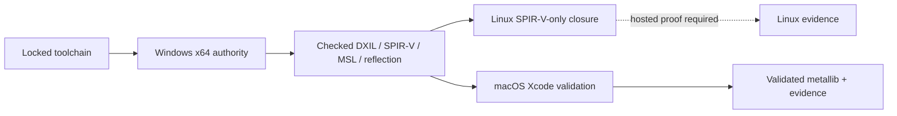

# Shader pipeline

Use this guide to see which host owns checked shader bytes, what each validation host proves, and
how the Metal library reaches packages. Detailed schema and provenance rules remain below.

**On this page:** [Authority flow](#authority-and-validation-flow) ·
[Checked artifacts](#checked-artifacts) · [Workflow validation](#workflow-validation) ·
[Payload contracts](#payload-contracts) · [Metal packaging](#metal-packaging) ·
[Related documentation](#related-documentation)

## Authority and validation flow

The Linux implementation generates, validates, and reproduces only the ten SPIR-V targets without
requiring DXC. It also structurally validates the full committed checked payload and proves SPIR-V
corruption rejection. The dashed edge remains until a hosted run provides green evidence.

macOS is restricted the same way, to the Metal artifact scope. DXIL emission loads the `dxcompiler`
and `dxil` libraries, which exist only on Windows, so the macOS job builds the MSL text and the
compiled `metallib` and never attempts DXIL. Windows win-x64 remains the only host that produces the
full checked payload.

## Checked artifacts

The build-time shader scaffold is documented in
[`eng/shaders/README.md`](../eng/shaders/README.md). Its lock file records every
network URL and SHA-256 digest. Generated compilers, caches, and transient
outputs are ignored. Reviewed DXIL, SPIR-V, MSL source, normalized reflection,
and their command/hash manifest are checked into `eng/shaders/checked`; no
consumer build or runtime downloads or compiles shaders.

Windows win-x64 is the authoritative host for checked DXIL, SPIR-V, MSL source,
normalized reflection, and publication.
Release packaging for Metal uses macOS osx-arm64 with exactly Xcode 16.4:
all ten checked mesh, pick, selection mask, selection outline, fill, and scale
MSL files are compiled as
Metal 2.4 AIR and linked into exactly one `mesh.metallib`. The library is staged at
`eng/shaders/checked/mesh.metallib` for the Metal RHI project and packaged at
`runtimes/osx/native/mesh.metallib`. Cross-host Slang output and metallib bytes
are not claimed to be identical to Windows outputs.

The Metal project property `OpenUsdRequireMetalShaderLibrary` defaults to
`false`. This keeps ordinary compilation and analyzers portable when no
metallib exists. Workflows that execute Metal or consume its package set it to
`true`; the project then fails before build or publish when the staged library
is missing. `Pack` is stricter: before package emission it invokes the shared
schema-v4 validator over the actual library bytes, all checked source and
provenance hashes, and the exact source/AIR/entry/command contract. It then
requires the opt-in property and a macOS host. A non-macOS Metal pack is never
considered a production package.

The checked reflection schema preserves D3D register spaces, Vulkan descriptor
sets, resource shapes and access, array and element strides, recursive
struct/matrix layout, semantic indices, and stage interfaces. System-value
locations are null. The checked manifest records actual generated command
arguments and hashes all relevant source, lock, manifest, and generation
scripts.

## Workflow validation

`.github/workflows/shaders.yml` provides path-filtered platform validation.
Windows x64 proves offline rehydration, checked byte/hash equality, the pinned
SPIR-V validator, and full same-host reproducibility. Linux x64 independently
generates, validates, and reproduces only the ten SPIR-V targets, then
structurally validates the full committed payload and runs a checked SPIR-V
corruption rejection test. macOS arm64 selects the lock-specified Xcode,
compiles committed MSL into
`eng/shaders/out/checked-payload/osx-arm64`, checks exact entry symbols with
`metal-objdump`, and runs an MSL corruption rejection test. Only verified
download archives are cached. Host tool versions, manifests, logs, and macOS
metallib evidence are uploaded for review.

## Payload contracts

MSL stage attributes must be attached to the exact expected function
declaration; prior attributes and helper or prefix/suffix names are rejected.
Metallib symbol validation requires an exact exported function-table entry.
Metallib manifests contain repository-relative commands and paths, symbol-dump
hashes, and provenance hashes for Xcode selection, payload validation, and
checked packaging scripts; source or output roots outside the repository fail.
The combined manifest records `vertexMain`/vertex, `fragmentMain`/fragment,
`pickVertexMain`/vertex, `pickFragmentMain`/fragment,
`selectionMaskVertexMain`/vertex, `selectionMaskFragmentMain`/fragment,
`selectionOutlineVertexMain`/vertex, `selectionOutlineFragmentMain`/fragment,
`fillMain`/compute, and `scaleMain`/compute contracts, plus every checked source
and AIR hash and repository-relative command. macOS conformance builds and
Metal packaging fail when the staged library or its validation sidecar is
absent. Package validation byte-compares both staged files with their native
package assets and rejects any missing visible, pick, selection, or compute entry.

The Metal sidecar has one exact schema, version 4. Its top level contains only
`schemaVersion`, `rid`, `checkedRoot`, `payloadRoot`, `stagedManifestPath`,
`toolchain`, `provenance`, and `library`. The library record contains its exact
name, output and staged paths, hash and size; exactly ten source records,
exactly ten AIR records, and exactly ten entry records; the symbol-dump path,
hash, and size; and exact compile, link, inspect, and per-entry symbol-check
commands. Every source and AIR record includes program, relative path, hash,
size, stage, and entry point. Provenance is the exact centralized input set.
The shared validator rejects missing or extra fields and records, duplicates,
absolute or traversing paths and command arguments, invalid hashes or sizes,
mapping drift, provenance drift, and staged-library byte/hash mismatches.
Generation, staging, Python package verification, and macOS package tests all
use this validator.

Reflection normalization rejects omitted access except Slang's implicit
read-only texture access, malformed compute group sizes, and inconsistent
target group sizes. Matrix layout records both stride and the locked row-major
or supported column-major orientation, including rectangular matrices. Boolean
compute dimensions are rejected even though Python otherwise treats booleans
as integers.

Checked payload provenance must equal the centralized required input set:
omissions, unexpected entries, and duplicate paths fail before hash validation.
Update and publication reject any required checked input containing carriage
returns before raw hashing, so checked provenance can bless only LF bytes.
Windows never generates or commits `mesh.metallib`; the macOS workflow remains
the authoritative generator.

## Metal packaging

Shader and package workflows invoke the locked Xcode 16.4 preparation path
before Metal conformance, package creation, or package execution. Both compare
the packaged native entry with the staged library. Regular macOS CI skips Metal
execution and is explicitly compile-only; the render workflow's macOS job is an
OpenGL proof and explicitly disables the Metal-library requirement.

## Related documentation

- [Rendering](rendering.md) shows where checked shaders enter the Silk RHI path.
- [Packaging](packaging.md) describes runtime and Metal package resolution.
- [Testing](testing.md) shows how shader evidence contributes to the release gate.
