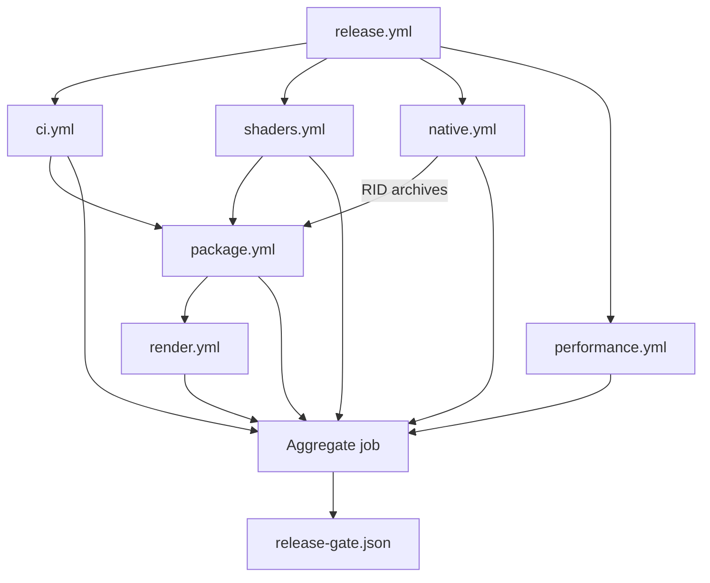

# Testing

Use this guide to choose the smallest local gate for a change and to understand how reusable
workflows combine managed, native, shader, package, render, and performance evidence for release.

**On this page:** [Workflow graph](#workflow-and-evidence-graph) ·
[Managed runner](#managed-test-runner) · [Performance](#performance-safety-gates) ·
[Fuzzing](#native-stagelayer-fuzzing) · [Windows Storm](#windows-native-storm-child) ·
[Linux Storm](#linux-native-storm-child) ·
[macOS and Metal](#macos-native-storm-child-and-metal-shell) ·
[Shared-stage soak](#shared-stage-soak) · [Related documentation](#related-documentation)

## Workflow and evidence graph



The dependency arrows show reusable workflow ordering and native artifact flow. Every workflow
result also feeds the aggregate job, which records one release decision without duplicating each
workflow's detailed evidence contract.

Managed tests use TUnit on Microsoft.Testing.Platform. The current pre-alpha baseline includes
managed data, interop, package, rendering, and viewer suites; native ABI and OpenUSD compatibility
CTest coverage; clean-package and NativeAOT consumers; and backend-neutral plus platform render
conformance gates.

Interactive render paths may not use CPU readback. Headless image tests compare against pinned
Storm references with perceptual tolerances rather than exact cross-driver pixels.

## Managed test runner

With the pinned .NET SDK 10.0.301 global Microsoft.Testing.Platform runner and TUnit
1.59, `dotnet test` can launch test DLLs through the wrong path, report zero executed
tests, and exit with code 5. Build first and run the generated test applications
directly instead:

```powershell
dotnet build OpenUsd.slnx -c Release
./eng/run-managed-tests.ps1 -Configuration Release
```

The runner discovers repository test projects by default, evaluates their declared
target frameworks, assembly names, and output DLLs through MSBuild, and executes every
framework with `dotnet <test.dll> --minimum-expected-tests 1`. Missing binaries,
non-test projects, unsupported frameworks, zero executed tests, and non-zero test
application exits fail the run.

On Windows and Linux, the rendering conformance project defaults to its packaged
SwiftShader ICD so repeated device-lifecycle tests use the deterministic software
backend they name and gate. `eng/vulkan-test-runtime.lock.json` pins the loader and
driver bytes; `eng/prepare-vulkan-test-runtime.ps1` verifies them and writes an
absolute Vulkan 1.3 ICD manifest because the upstream package manifest advertises an
obsolete Vulkan 1.0 API. Set either `VK_DRIVER_FILES` or `VK_ICD_FILENAMES` before
invoking the runner to preserve an explicit system or hosted-runner ICD instead.

Projects and frameworks can be selected explicitly. Test application arguments are
passed as a PowerShell array so filters and paths remain single arguments:

```powershell
./eng/run-managed-tests.ps1 `
  -Project tests/OpenUsd.Rendering.ConformanceTests/OpenUsd.Rendering.ConformanceTests.csproj `
  -Framework net10.0 `
  -Configuration Release `
  -TestArguments @(
    '--treenode-filter',
    '/*/*/VulkanCompositionPresentationTests/D3D11BridgeImportsPixelsAndReusesKeyedMutex')
```

Coverage also runs the built DLL directly:

```powershell
./eng/run-managed-tests.ps1 `
  -Project tests/OpenUsd.Tests/OpenUsd.Tests.csproj `
  -Framework net10.0 `
  -TestArguments @(
    '--results-directory', (Join-Path $PWD 'TestResults'),
    '--coverage',
    '--coverage-settings', (Join-Path $PWD 'eng/coverage.config'),
    '--coverage-output-format', 'cobertura',
    '--coverage-output', 'coverage.cobertura.xml')
```

After a Release build, run the Pester-free runner contract checks with:

```powershell
./eng/test-run-managed-tests.ps1
```

## Performance safety gates

The native-independent performance gate builds the focused TUnit safety project, repeats allocation,
retained-resource, batching, and P/Invoke-boundary contracts, then runs a BenchmarkDotNet smoke:

```powershell
./eng/run-performance.ps1
```

The default smoke uses BenchmarkDotNet's `Dry` job for a low-flake correctness check. Use a short
measurement locally when validating the workflow:

```powershell
./eng/run-performance.ps1 -Mode Smoke -BenchmarkJob Short -Repeat 3
```

Full benchmark artifacts are opt-in and remain informational until release-machine baselines are
calibrated. Ordinary CI fails only on deterministic allocation, resource, source-boundary, build, or
benchmark execution regressions; it does not assert wall-clock timings:

```powershell
./eng/run-performance.ps1 `
  -Mode Artifacts `
  -BenchmarkJob Short `
  -ArtifactsPath artifacts/performance
```

The suite requires .NET SDK 10.0.301 but no native OpenUSD installation. Results include
BenchmarkDotNet Markdown, CSV, and full JSON reports under the selected artifact directory.

Workflow and native-input contracts are also executable without a platform build:

```powershell
./eng/test-linux-native-prerequisites.ps1
./eng/test-native-artifact-workflow.ps1
./eng/test-continuous-safety-workflow.ps1
./eng/test-render-native-archive.ps1
./eng/run-native-fuzz.ps1 -SelfTest
./eng/shaders/test-expand-verified-archive.ps1
```

## Native stage/layer fuzzing

The project-owned stage/layer C ABI has an opt-in Linux Clang libFuzzer target.
It writes each bounded input to an isolated temporary USDA file, opens it through
`openusd_stage_open`, and exercises layer identifiers plus packed prim and layer-stack
results after successful parses. Ordinary native builds and CTest do not create or run
the fuzzer.

After the locked `native/install/linux-x64` build exists, run a bounded ASAN/UBSAN pass:

```powershell
./eng/run-native-fuzz.ps1 -MaxTotalTime 60 -TimeoutSeconds 10
```

The runner copies the deterministic corpus from `test-assets/fuzz-seeds/stage-layer`,
first requires the known-good USDA seed to register plugins and parse successfully,
then uses libFuzzer seed 1337 for the bounded mutation campaign. libFuzzer executes
the empty unit before the seed corpus, and an empty layer can never parse, so the
harness returns early for a zero-length input rather than tripping that requirement.
Leak detection stays enabled, with `eng/native-fuzz-lsan.supp` suppressing the
OpenUSD and TBB process-lifetime singletons - the registry manager state, interned
path nodes and tokens, and trace event lists - that are never freed by design. It
cleans its mutable corpus and temporary files and retains reproducible crash
artifacts under `artifacts/native-fuzz/linux-x64`. The native artifact workflow runs
this only on its Linux source-build producer; archive-only package and render
consumers do not run fuzzing.

The `release.yml` reusable-workflow graph is the aggregate release check. It runs
managed CI, deterministic performance safety, shader reproducibility, verified native
archive production, package-only consumers, and platform render evidence on the same
commit and artifact set.

## hdSilk command-page probe

`native/hdSilk/tests/hdsilk_probe.cpp` is the CTest that pins the pointer-free command page.
It asserts page ABI 5 and the exact byte offsets of `FRAME`, `MESH_UPSERT`, and the 24-byte
`MESH_REMOVE` command, including the `instance_index` field that ABI 3 added to removals.

Instance identity has dedicated coverage. One case serializes a point-instanced scene and
requires one record per resolved instance, each with the shared prototype path, its own
zero-based `instance_index`, a stable non-zero `instance_id`, and its own resolved transform.
Another replaces a single mesh and requires that only the affected `(path, instance_index)`
identities are retired, so a shrinking instancer emits exactly one removal per dropped instance.

Per-prim isolation is asserted as a skip rather than a throw: a record that fails validation must
be omitted from the page and counted by the rejected-mesh counter while every valid sibling still
serializes. This is what stops one malformed prim in a production asset from blanking a frame.

## Storm-to-hdSilk parity comparison

`ParityImageComparer` in `OpenUsd.Rendering` is the renderer-neutral core of the parity
harness. It compares a Storm reference capture with an hdSilk candidate capture as raw
top-down RGBA8 buffers of identical dimensions, and is deliberately geometry-first: hdSilk
still shades with an absolute-normal debug visualization, so colour comparison is opt-in and
disabled by the default `ParityTolerance.Geometry` contract.

A pixel counts as covered when any channel differs from the declared background by more than
`BackgroundChannelTolerance`. From the two coverage masks the comparer reports intersection,
union, and per-capture coverage counts.

Rasterization and anti-aliasing legitimately differ by about a pixel between backends and
drivers, so a coverage disagreement is forgiven when the other capture has coverage within
`EdgeDilationRadius`. Two values are therefore reported: the raw
`CoverageIntersectionOverUnion`, and the dilation-aware
`AdjustedCoverageIntersectionOverUnion` that treats a forgiven shift as agreement. The
adjusted value is the one gated, together with the fraction of unforgiven disagreements.
Gating the raw value would fail a one-pixel silhouette shift on small shapes even though the
dilation contract already accepted it.

When `CompareColor` is enabled the comparer also reports the maximum and mean per-channel
difference over the agreed coverage only, gated by `MaximumChannelDifference` and
`MaximumMeanChannelDifference`. Every comparison emits an RGBA diff image for artifacts:
reference-only coverage is blue, candidate-only coverage is red, agreed coverage is grey, and
agreed background is black.

`ParityImageComparisonTests` covers exact agreement, empty captures, forgiven and unforgiven
one-pixel shifts, entirely missing geometry, colour opt-in, diff-image encoding, and rejection
of mismatched dimensions, truncated buffers, and impossible tolerances.

`SilkCrossBackendParityTests` is the first gate built on the comparer. Storm remains the eventual
reference, but the hdSilk backends must first agree with each other, so it renders one retained
scene offscreen through D3D12 WARP and through Vulkan SwiftShader and requires the two captures to
match under the geometry tolerance. Both are software rasterizers, which keeps the comparison
deterministic on any host. A companion case renders the same scene with one mesh displaced and
requires the comparison to fail, so the gate cannot pass vacuously. This is what catches a
backend-only regression such as an index format or vertex layout that only one RHI got right.

## Windows native Storm child

The native child-host CTest proves the application-owned `WS_CHILD`, parent/process/creator-thread
identity, worker-thread destroy rejection followed by successful UI-thread destruction, WGL
4.6/4.5 compatibility profile and procedure-pointer sentinel checks, dedicated render-thread
affinity, exact shared-stage retention, first/live-edit frames, and context-loss recreation. It
also covers 150%/200% DPI transitions, focus/input delivery, a 10,000-request bounded coalescing
burst, concurrent render/request/resize/diagnostics/focus versus Stop, stale handles, and retryable
Storm destroy/abandon, WGL unbind/context deletion, DC release, and `DestroyWindow` failures.
The ABI v7 framebuffer/navigation gate rejects invalid camera sizes, modes, NaN/Inf matrices,
invalid navigation layouts, and capture before a
frame and after destruction, reads a real
shared-stage Storm frame, verifies dimensions/DPI and non-background pixels, proves a
render-relevant live visibility edit changes the hash, and checks an exact centered test pattern
with a stable hash and 12,288 non-background pixels at 256 by 192. It also proves latest-camera
coalescing, sequenced pointer/button/modifier/wheel/command snapshots, concurrent polling, and
camera/input persistence across context recreation. Platform probes verify that held F/Home/P keys
advance each counter once, release/repress advances it again, and focus loss clears pressed state.
The macOS source/native gates additionally pin non-precise detents, fractional precise deltas,
40 points per step, four-step bounds, direction inversion, sign, and magnitude. Managed tests also prove a
disposed session rejects diagnostic capture without entering native code.

Windows CTest reports the WGL-only probes as capability skips only when the host lacks the required
WGL context-creation or framebuffer extension. Context creation and incomplete-framebuffer failures
on a capable host remain failures. The separate `windows-wgl` platform smoke remains the required
end-to-end proof on a WGL-capable Windows host.

macOS CTest applies the same contract to the Storm child probe. A hosted macOS runner has no window
server session that can vend an accelerated OpenGL 4.1 core pixel format, so the probe exits with
the shared capability code and CTest records a skip. Every other failure, including a failure to
create the context on a host that did provide the pixel format, remains a hard failure.

```powershell
ctest --test-dir native/build/shim/win-x64 -C Release --output-on-failure
```

The complete Viewer gate classifies ANGLE/D3D11 only after successful runtime
`D3D11TextureNtHandle` imports with keyed-mutex synchronization and a compositor device LUID.
It performs 100 in-process
Storm/D3D12/Vulkan switches while preserving the exact render-state object, survives at least
90 seconds, simulates one Storm context loss, checks native pixel and composition draw evidence,
runs fifteen fresh processes, executes one authored stage-camera scenario, forces automatic
Storm-to-D3D12 fallback, and persistently fails Storm cleanup to prove its backend kind stays
quarantined until cleanup recovers. The Windows aggregate therefore contains exactly 22 scenarios
(15 fresh processes plus seven named/special runs):

```powershell
./eng/run-storm-native-child.ps1
```

Each run requires zero live child wrappers, managed/native Storm and Silk sessions, pages, GPU
scenes, and GPU meshes after shutdown. A context-loss run requires exactly one abandoned GL engine;
normal current-context destruction requires none. Windows evidence also records routed Avalonia
and native-child input deltas after real resize/input paths, plus enumerated Storm HWND visibility,
class, parent, process, thread, and retirement transitions. Configured-only compositor strings,
fabricated counters, and Avalonia control counts are rejected. The quarantine proof records candidate,
factory, attach, retired-owner, native-child peak/live, and hidden retained-HWND measurements.
Viewer evidence schema 8 additionally records canonical automatic/explicit/restored camera payloads
and SHA-256 signatures, binds all three non-background pixel artifacts, and proves the explicit frame
differs on Storm, D3D12, and Vulkan. Storm transitions must match child ABI v7 latest-requested
revision and latest requested/rendered camera signatures. Windows Storm runs also bind OS-routed
Alt-left input, ABI-7 navigation sequence/state provenance, the changed Viewer camera, and a changed
pixel artifact while requiring zero duplicate Avalonia routed events. Managed and PowerShell
adversarial tests reject schema 7, altered payloads/signatures, stale pixels, unbound camera
artifacts, and malformed native-navigation proof. The `stage-camera-backend-smoke` run additionally
binds the repository-authored USD file, selected camera path, initial/sampled snapshot hashes,
per-backend camera revisions/native signatures, changed initial-versus-sampled pixels, and automatic
reset pixels. Missing/non-camera source outcomes, stale path/time/state, missing hashes or pixels,
and source identities that omit either the asset or its short runner are rejected.

Run the bounded Windows picking and selection-outline proof with
`./eng/run-viewer-picking-smoke.ps1 -SmokeSeconds 180`. Its schema-2 artifact requires the same
`/World/Cube` hit and an empty-space miss on Storm, D3D12, and Vulkan, exactly one stale retry, exact
Storm selected-to-baseline restoration, rendered D3D12/Vulkan mask and composite passes, no
additional outline pass after clear, source/shader/test hashes, and zero final Viewer resources.
Real pixel shape, physical width, occlusion, resize, device-loss, and cleanup are additionally
enforced by `D3D12SelectionOutlineTests` on WARP and `VulkanSelectionOutlineTests` on SwiftShader;
Metal uses the equivalent hosted Xcode 16.4 conformance class.

Run only the bounded headed Windows authored-camera proof with:

```powershell
./eng/run-viewer-stage-camera-smoke.ps1
```

This short proof renders Storm, D3D12, and Vulkan once at each authored camera sample and also runs
the existing schema-8 camera/input contract transitions. It does not run the 100-switch soak or the
15-process aggregate.

## Linux native Storm child

Linux builds the parallel ABI as `libopenusd_storm_child.so`. Its CTest creates an
application-owned child XID, a dedicated GLX 4.6/4.5 compatibility render thread, and an
exact-stage Storm session. It verifies first frame, live edit, diagnostic capture, resize/DPI,
X11 input, request coalescing, wrong-thread destruction, context recreation, and zero live child
wrappers after teardown.

```shell
ctest --test-dir native/build/shim/linux-x64 --output-on-failure
bash ./eng/run-storm-native-child-linux.sh x11
bash ./eng/run-storm-native-child-linux.sh xwayland
bash ./eng/test-storm-native-child-linux.sh
```

The X11 gate uses Xvfb. The Wayland gate uses Weston's compositor-managed XWayland/XWM and runs the
entire mapped Avalonia shell through it so Storm and Vulkan can switch without restarting the
process. The native probe serializes process-global X error traps, injects a GLX 4.6 X error and
proves clean 4.5 fallback, rejects destroyed parent XIDs, and proves capture still returns the exact
pre-swap frame after the post-swap backbuffer is corrupted. Viewer evidence requires native
focus/pointer/wheel/key counter deltas and mapped-shell `XGetImage` pixels. Vulkan opaque-FD support
produces 100 Storm/Vulkan switches; only a schema-valid typed unavailable diagnostic permits the
Storm-only proof. Runner crashes, timeouts, missing/malformed artifacts, and zero native counters
fail.

## macOS native Storm child and Metal shell

The macOS child is an application-owned `NSView` hosted by Avalonia `NativeControlHost` while
Avalonia remains fixed to its Metal renderer. Cocoa creates, attaches, sizes, focuses, hides, and
detaches the view and creates/attaches the `NSOpenGLContext` drawable on the main thread. A dedicated
owner thread exclusively makes the context current, updates, renders, preserves exact pre-flush RGBA
bytes, flushes, recreates Storm from the retained stage, and clears current ownership. Cocoa input
evidence uses NSEvent/NSView injection, never user32. macOS exposes OpenGL 4.1 core, not a
compatibility profile. The probe requires `openusd_hydra` itself to report exactly `Storm / Metal`;
the child preserves that name and appends only `OpenGL 4.1 core presentation`.

The `macos-15` Apple Silicon render job selects Xcode 16.4, validates the ten-entry metallib and sidecar,
runs the same native first/edit/preserved-capture probe for build or archive input, runs the signed
package-only launch and real `IOSurfaceRef`/`MetalSharedEvent` tests, then performs 100 Storm/Metal
switches in one Avalonia process:

```powershell
./eng/run-silk-probe.ps1 -Rid osx-arm64 -MetalComposition
./eng/run-storm-native-child-macos.ps1 -SwitchCount 100 -SurvivalSeconds 90 -NativeSource build
```

The shader workflow is also the required hosted Metal picking gate. After staging the real
ten-entry library, it runs Metal conformance for nearest-depth overlap, physical top-left coordinate
mapping, token-zero miss, stale resize and simulated command-failure generation, nullable hit
geometry, persistent three-slot ring saturation/reuse, and warm zero-churn resource counts. Windows
runs the same multi-TFM source and contract tests, but cannot satisfy this execution gate because it
has neither Xcode 16.4 nor a real `mesh.metallib`.

The gate requires Cocoa input counters, main/render thread ownership, first/edit hash changes,
preserved-frame identity after diagnostic capture, resize/DPI evidence, context generation two,
safe-abandon teardown, actual `Storm / Metal` Hgi identity, non-zero Metal stage draws and triangles,
live display-color and transform IOSurface hash changes, ring reuse, no `STAGE_DRAW_BLOCKED`
diagnostic, and zero final resources.
The native probe also starts concurrent coalesced frame requests behind a barrier and performs 64
main-thread resizes. Every completed resize generation must have a matching context-update generation
before a frame with its exact width, height, and DPI is preserved.
Its recovery barrier pauses after the render thread has staged the old context and cleared renderer/
preserved-frame state, but before Cocoa-main replacement. The main thread resizes, detaches and
reattaches the NSView, and reads diagnostics in that phase, then releases recovery while pumping the
run loop. The gate requires monotonic context generation, renderer/context generation identity, no
half-published state, and exact dimensions/DPI on the first post-recovery preserved frame.
Native staging rejects a macOS runtime that omits the child library or installed probe.
The hardening implementation is complete when cross-build and source-contract tests pass; the
original macOS hosted proof remains blocked until this exact job succeeds on `macos-15`.

## Shared-stage soak

The NativeAOT hdSilk gate runs the deterministic 10,000-edit plus 2,500-read same-stage workload and writes a JSON
artifact:

```powershell
./eng/run-silk-probe.ps1 -Rid win-x64 -SharedStageSoak
```

The Windows WGL gate runs the same scheduler/source concurrently through Storm and hdSilk, simulates one
Storm context-loss abandon/recreate, survives for at least 90 seconds, and exits only after renderer,
source, and scheduler teardown:

```powershell
./eng/run-platform-smoke.ps1 -Platform windows-wgl -SharedStageSoak -SoakSeconds 90
```

The workload deterministically interleaves two property edits, one topology edit, one composition edit,
and one read in each five-operation cycle. It authors two meshes, changes render-relevant points and
canonical display color, and proves a controlled color edit upserts only the target mesh. Exact
invalidation counts, monotonic stage serials, page revisions, stable mesh IDs, removals, and steady pages
are required. The final gate compares the complete sorted hdSilk mesh ID/path set with the initialized
steady set, proves both soak meshes were removed and restored under their original **paths**, and checks the
default-time Mesh A display color exactly as `(0.92, 0.752, 0.416, 1)`. Path, not prim ID, is the identity
that survives a delete and recreate: Hydra assigns a fresh `PrimId` to a recreated prim and never reuses
the retired one, so restoration can only be proven by path.

Artifacts report source/build identity, ABI versions, timestamps, operation counts, serial and
notification coalescing, Storm pre/post-loss frames and faults, hdSilk pages/upserts/removals, and
baseline/peak/final native and managed resource counters. Forced-GC checkpoints every 500 operations
after warmup record retained bytes and working set; later-window least-squares slopes must remain below
the deterministic ceilings. `render.yml` runs the NativeAOT soak plus Windows WGL and Linux X11/XWayland
soaks as blocking steps. `eng/shared-stage-soak-identity.ps1` causes each runner to reject stale source,
executable hash, or executable timestamp evidence. The source identity covers all production `src`
projects (including every Silk backend), native shim sources/CMake/resources, tests/probes/assets,
root build/version/package inputs, rendering workflow, and engineering scripts while excluding generated
build/install/download outputs. Viewer evidence is finalized only after the GL render pump reports
shutdown completion and fresh post-teardown renderer fault and resource diagnostics are read.

## Render gate capability limits

Two render proofs still need graphics capabilities that a hosted GitHub runner does not have. Both are
narrowed rather than deleted: everything the runner can prove still runs and still blocks, the
unprovable part records a `status: skipped` evidence artifact naming its reason, and the work needed to
restore full coverage is listed below. Narrowing is deliberately not automatic. Each one is opt-in at
the call site in `.github/workflows/render.yml`, so a capability regression on a capable host is still a
hard failure, and the narrowing is visible in the workflow rather than buried in a script.

**`windows-wgl` shared-stage soak.** Hosted Windows exposes only the generic GDI OpenGL 1.1
implementation, so the gate stages a hash-locked Mesa llvmpipe `opengl32.dll` before starting
Avalonia/Storm. The soak is mandatory again on hosted Windows.

**Windows Avalonia Vulkan composition.** Hosted Windows has no GPU driver and therefore no system
Vulkan ICD. The skip is recorded in `artifacts/render-capability/windows-vulkan.json`.

**Linux X11 and Wayland Vulkan import.** The hosted Linux compositor accepts no external Vulkan
images at all, reporting `supported image handles: (none)`, so the opaque-FD import this proves
cannot be exercised. The skip is recorded in
`artifacts/avalonia-vulkan-smoke/linux-x64/<platform>-capability.json`. Note that lavapipe itself is
fine and is still used: the limit is the compositor, not the driver.

What still blocks on the hosted runner: the Windows WGL job keeps the NativeAOT shared-stage soak,
the native probe, the soak identity gate, and the WGL soak; the Windows Vulkan job keeps the viewer
source-identity and evidence contracts; the Linux job keeps its CTest suite, both X11 and XWayland
shared-stage soaks, and the Storm child switching gates. Renderer-neutral and hdSilk Vulkan behaviour
that does not need composition stays covered by the managed conformance suite in `ci.yml`, which runs
against the pinned SwiftShader driver.

### Unblocking the WGL soak

The WGL soak is unblocked with the same supply-chain model as the SwiftShader Vulkan runtime:
`eng/mesa-wgl-test-runtime.lock.json` pins the exact Mesa release, archive URL, archive SHA-256, and
staged `opengl32.dll` SHA-256 for `win-x64`. `eng/prepare-mesa-wgl-test-runtime.ps1` downloads the
archive only from that pinned URL, verifies the archive hash, extracts only the locked file, verifies
the staged file hash, prepends its directory to `PATH`, and copies it next to the viewer's native
runtime before the soak starts.

The helper also runs a WGL preflight and writes `mesa-wgl-runtime.json` plus
`mesa-wgl-preflight.json` under `artifacts/platform-smoke/windows-wgl/mesa-wgl-runtime`. Those files
record the loaded `opengl32.dll`, its SHA-256, and `GL_VENDOR`, `GL_RENDERER`, and `GL_VERSION`.
The gate requires the preflight renderer to contain `llvmpipe`, so a hosted Windows pass records that
it used Mesa software rasterisation instead of silently falling back to the generic GDI OpenGL 1.1
driver or an installed GPU driver.

This proves the Storm WGL render path, shared-stage scheduling, teardown, and diagnostics on a
reproducible software OpenGL implementation. It is not a Windows GPU driver-conformance proof:
driver-specific WGL pixel-format quirks, swap-chain behaviour, and vendor OpenGL bugs still need a
self-hosted Windows runner with that driver stack. A separate self-hosted GPU driver proof should
bypass the Mesa staging helper so the loaded `opengl32.dll` evidence names the vendor driver.

### Unblocking the Vulkan composition gates

Neither the Windows nor the Linux Vulkan composition proof can be solved in software, and for the
same underlying reason: both import a Vulkan image into the windowing system's compositor, so both
need a real GPU stack on both sides of that import.

On Windows the proof exports a Vulkan image to a D3D11 shared handle and imports it with a keyed
mutex, so it needs a Vulkan driver that implements both `VK_KHR_external_memory_win32` and
`VK_KHR_external_semaphore_win32` **and** reports the same adapter LUID as the compositor.
SwiftShader implements neither extension, which is directly observable:

```powershell
./eng/run-managed-tests.ps1 `
  -Project tests/OpenUsd.Rendering.ConformanceTests/OpenUsd.Rendering.ConformanceTests.csproj `
  -Framework net10.0 `
  -Configuration Release `
  -TestArguments @('--treenode-filter', '/*/*/VulkanCompositionPresentationTests/*')
```

Under SwiftShader that reports `SwiftShaderExportsAndReusesCompositionRingWhenSupported` skipping
with `Vulkan external-object extensions are unavailable: VK_KHR_external_memory_win32,
VK_KHR_external_semaphore_win32`, and `D3D11BridgeImportsPixelsAndReusesKeyedMutex` skipping with
`The Vulkan renderer and compositor use different adapter LUIDs`.

On Linux the driver is not the problem. Lavapipe is present and used, and the smoke reaches the
compositor; the compositor is what reports `supported image handles: (none)`, so there is no handle
type through which an external image could be imported.

Both are restored the same way: run these jobs on a GPU-equipped self-hosted runner. On Windows,
once an ICD exists the `Resolve system Vulkan ICD` step reports `available=true` and every guarded
step below it runs unchanged. On Linux, drop `OPENUSD_ALLOW_UNAVAILABLE_CAPABILITY` from the two
import smoke steps.

## Related documentation

- [Rendering](rendering.md) defines the backend paths exercised by render evidence.
- [Native build](native-build.md) defines the verified archives reused by package and render jobs.
- [Packaging](packaging.md) defines clean-feed and package-only execution gates.
- [Shader pipeline](shader-pipeline.md) defines authoritative and platform shader validation.

### Parity capture driver contract

`StormSilkParityCaptureDriverTests` is the first automated producer for the
`ParityImageComparer` contract. The renderer-neutral driver opens one stage
through `UsdStageScheduler`, acquires one `UsdStageRenderSource`, and renders the
same retained stage twice: Storm through an `IStormGlContext` supplied by the
platform shim, then hdSilk through each requested `SilkParityBackend`. The Windows
shim is `WindowsWglStormContextFactory`; it owns only the hidden WGL window,
current OpenGL context, framebuffer, depth renderbuffer, `glReadPixels`, and the
bottom-up to top-down row conversion. A Linux GLX/Xvfb follow-up should add a new
`IStormGlContextFactory` implementation without changing the driver.

Every input that can otherwise create false parity failures is pinned by
`ParityCaptureInput`: stage path, time code, resolution, explicit matrix camera,
clear colour, and the published Storm headlight. The driver validates that the
requested `RenderHeadlight` exactly equals `OpenUsdStormRuntime.Headlight` before
capturing, so the harness does not silently compare unlike lighting conventions.
Storm and hdSilk both render with opaque black clear in the initial gate.

Normalisation is intentionally narrow. Storm readback uses OpenGL `glReadPixels`,
so the WGL shim converts row order with `ParityImage.FromBottomUpRgba`; hdSilk
readbacks are already top-down. The driver also maps the exact captured corner background to the requested clear
colour and forces alpha to opaque for both captures. This corrects clear and
background representation differences without altering covered RGB pixels. No
colour-space, premultiplication, material colour, or threshold massaging is
performed; colour remains a separate opt-in comparer metric because hdSilk still
shades with its debug absolute-normal model rather than the Storm material and
headlight path.

The conformance test runs each capture twice and requires identical SHA-256 input
bytes for Storm and for every hdSilk backend it exercises. It also writes a small
text artifact under `TestResults/parity-capture/` with source-bound evidence:
backend name, draw count, hdSilk revision, raw and adjusted coverage IoU,
coverage disagreement fraction, colour metrics, hashes, and perturbation
results. The perturbation test compares against a deliberate vertical mirror and
a shifted camera; both must fail the geometry tolerance so the gate proves it can
observe real differences.
