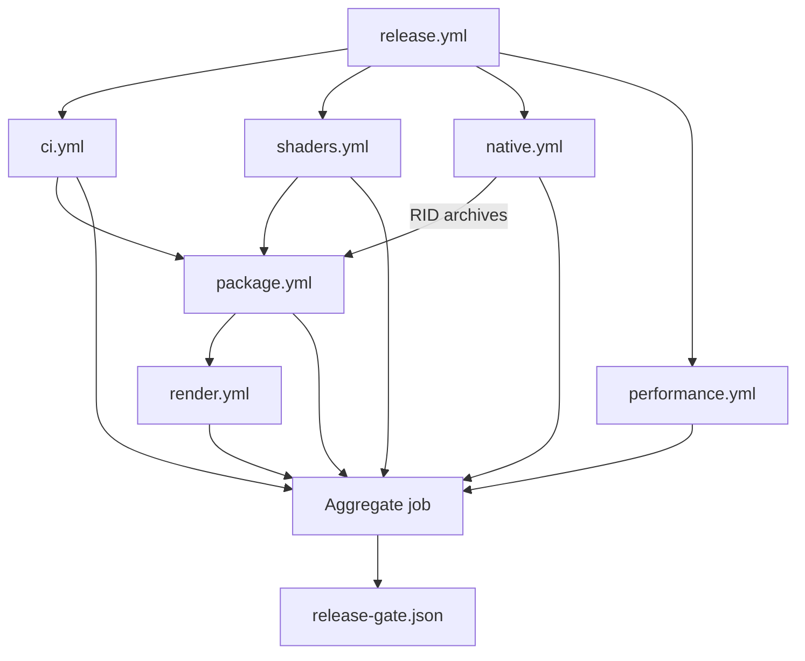

# Testing

Use this guide to choose the smallest local gate for a change and to understand how reusable
workflows combine managed, native, shader, package, render, and performance evidence for release.

**On this page:** [Workflow graph](#workflow-and-evidence-graph) ·
[Managed runner](#managed-test-runner) · [Performance](#performance-safety-gates) ·
[Fuzzing](#native-stagelayer-fuzzing) · [Continuous render](#continuous-render-gates) ·
[Windows Storm](#windows-native-storm-child) ·
[Linux Storm](#linux-native-storm-child) ·
[macOS and Metal](#macos-native-storm-child-and-metal-shell) ·
[Shared-stage soak](#shared-stage-soak) · [Related documentation](#related-documentation)

## Workflow and evidence graph



The dependency arrows show reusable release-workflow ordering and native artifact flow.
`package.yml` also runs outside release: after successful `native artifact pipeline` runs on `main`,
and on pushes or pull requests that touch packaging paths, package tests, runtime package projects,
Cesium inputs, or native hdSilk/package-validation inputs. `render.yml` also runs after the
native pipeline publishes verified RID archives on `main`, and on pushes that touch render scripts,
rendering/viewer/package tests consumed by render legs, rendering/viewer sources, or shader payloads.
Every workflow result also feeds the aggregate job, which records one release decision without
duplicating each workflow's detailed evidence contract.

Managed tests use TUnit on Microsoft.Testing.Platform. The current pre-alpha baseline includes
managed data, interop, package, rendering, and viewer suites; native ABI and OpenUSD compatibility
CTest coverage; clean-package and NativeAOT consumers; and backend-neutral plus platform render
conformance gates.

The MCP suites cover official protocol discovery/invocation/resource reads and the local RID bundle
contract. Package tests execute synthetic win-x64, linux-x64, and osx-arm64 preflight layouts plus
real metadata verification against synthetic Windows installs. They reject mismatched lock/source
metadata, a capability mask missing bounded stage inspection, and changed native binary hashes
before publish, launch, output mutation, or staging-directory creation. Failed publish, invalid
exclusion, previous-output survival, successful replacement, and temporary staging cleanup remain
covered for published and source-run layouts. Commands and native prerequisites are in
[OpenUSD MCP server](mcp.md#testing).

Interactive render paths may not use CPU readback. Headless image tests compare against pinned
Storm references with perceptual tolerances rather than exact cross-driver pixels.

## Continuous render gates

`render.yml` is no longer release-only. It runs when the `native artifact pipeline` completes on
`main` and on path-filtered pushes that touch render workflow scripts, native-input preparation,
shader payloads, rendering/viewer sources, or the package and render tests that its legs execute. A
release still calls the same reusable workflow, but every repository workflow now has a path to run
outside a release.

The workflow consumes verified native archives when a native pipeline run id is available instead of
rebuilding OpenUSD in each render leg. On path-filtered pushes without a published native tree, each
leg records a `RENDER_SMOKE_DEFERRED` notice and waits for the workflow-run trigger from the native
producer to cover that native input. That keeps render changes visible before release without making
four one-hour consumers rebuild the same native payload.

The four current render legs are blocking when their native input is ready:

- `Windows WGL`
- `Windows Avalonia Vulkan required`
- `Linux X11 and compositor-managed XWayland required gate`
- `macOS arm64 Storm child and Metal`

The most recent `main` workflow-run render checked in this documentation pass was run `31290108017`
for commit `4df16ccb1da5907704ea7118bafd1d58a57f5502`; all four jobs completed with `success`. That
is important structurally as well as tactically: render defects are now discovered by push or native
archive publication, not for the first time inside a tag release.

## Managed test runner

With the pinned .NET SDK 10.0.301 global Microsoft.Testing.Platform runner and TUnit
1.59, `dotnet test` can launch test DLLs through the wrong path, report zero executed
tests, and exit with code 5. Build first and run the generated test applications
directly instead:

```powershell
dotnet build OpenUsd.slnx -c Release
./eng/run-managed-tests.ps1 -Configuration Release
```

The runner discovers repository test projects by default, evaluates their declared
target frameworks, assembly names, and output DLLs through MSBuild, and executes every
framework with `dotnet <test.dll> --minimum-expected-tests 1`. Missing binaries,
non-test projects, unsupported frameworks, zero executed tests, and non-zero test
application exits fail the run.

On Windows and Linux, the rendering conformance project defaults to its packaged
SwiftShader loader and ICD so repeated device-lifecycle tests use the deterministic
software backend they name and gate. The runner activates and restores the complete
runtime for every test process rather than relying on a system Vulkan loader.
`eng/vulkan-test-runtime.lock.json` pins the loader and driver bytes;
`eng/prepare-vulkan-test-runtime.ps1` verifies them and writes an
absolute Vulkan 1.3 ICD manifest because the upstream package manifest advertises an
obsolete Vulkan 1.0 API. Set either `VK_DRIVER_FILES` or `VK_ICD_FILENAMES` before
invoking the runner to preserve an explicit system or hosted-runner ICD instead.

Projects and frameworks can be selected explicitly. Test application arguments are
passed as a PowerShell array so filters and paths remain single arguments:

```powershell
./eng/run-managed-tests.ps1 `
  -Project tests/OpenUsd.Rendering.ConformanceTests/OpenUsd.Rendering.ConformanceTests.csproj `
  -Framework net10.0 `
  -Configuration Release `
  -TestArguments @(
    '--treenode-filter',
    '/*/*/VulkanCompositionPresentationTests/D3D11BridgeImportsPixelsAndReusesKeyedMutex')
```

Coverage also runs the built DLL directly:

```powershell
./eng/run-managed-tests.ps1 `
  -Project tests/OpenUsd.Tests/OpenUsd.Tests.csproj `
  -Framework net10.0 `
  -TestArguments @(
    '--results-directory', (Join-Path $PWD 'TestResults'),
    '--coverage',
    '--coverage-settings', (Join-Path $PWD 'eng/coverage.config'),
    '--coverage-output-format', 'cobertura',
    '--coverage-output', 'coverage.cobertura.xml')
```

After a Release build, run the Pester-free runner contract checks with:

```powershell
./eng/test-run-managed-tests.ps1
```

## Performance safety gates

The native-independent performance gate builds the focused TUnit safety project, repeats allocation,
retained-resource, batching, checked-shader cold-start, and P/Invoke-boundary contracts, then runs a
BenchmarkDotNet smoke:

```powershell
./eng/run-performance.ps1
```

The default smoke uses BenchmarkDotNet's `Dry` job for a low-flake correctness check. Use a short
measurement locally when validating the workflow:

```powershell
./eng/run-performance.ps1 -Mode Smoke -BenchmarkJob Short -Repeat 3
```

Full benchmark artifacts are opt-in and remain informational until release-machine baselines are
calibrated. Ordinary CI fails only on deterministic allocation, resource, source-boundary, checked
shader, curated-scene counter, build, or benchmark execution regressions; it does not assert wall-clock
timings:

```powershell
./eng/run-performance.ps1 `
  -Mode Artifacts `
  -BenchmarkJob Short `
  -ArtifactsPath artifacts/performance
```

The suite requires .NET SDK 10.0.301 but no native OpenUSD installation. Results include
BenchmarkDotNet Markdown, CSV, and full JSON reports under the selected artifact directory.

The curated Storm/hdSilk parity capture remains the render gate for the 25 scene set. In addition to
the adjusted-IoU floor, each captured hdSilk backend must stay under per-scene deterministic resource
thresholds recorded in [Performance](performance.md#object-and-resource-churn). Thresholds are measured
counter values plus modest headroom, not shared global ceilings. These gates prefer counters over
frame-time budgets because hosted runners have noisy CPU/GPU scheduling; the counters catch the resource
regressions the renderer controls without becoming flaky.

## Storm offscreen harness capability limits

Twenty-two scenes are gated at adjusted IoU `1.000000`; three are measured but ungated:
MaterialX standard-surface, Catmull-Clark subdivision, and `light-distant-shadow`. The shadow scene
matches the direct-lit image (`maxChannelDiff=3`, `meanChannelDiff=0.161`) but the paired
shadow-disabled stage is byte-identical in Storm (`disabledAdjustedIoU=1.000000`, unchanged Storm
hash `E0713BDEA4E1D9B817A367160F13B3B23D6A06DCC6AC04858D985B8497024B03`), proving this offscreen
harness does not render that authored shadow at all.

Storm was not simply left unconfigured. A diagnostic native experiment enabled
`GlfSimpleLight::SetHasShadow(true)`, allocated a `GlfSimpleShadowArray` at 1024x1024, set both the
legacy and scene-index `HdxShadowTask` switches, and supplied explicit light-space matrices. The
capture stayed byte-identical through every one of them, so the limit is the offscreen configuration
rather than a missing flag. The experiment was reverted; no native change ships from it.

Two similarly-named switches are involved and must not be confused, because conflating them has
already cost this project several debugging rounds. The `OPENUSD_STORM_RENDER_USE_SCENE_LIGHTS`
render flag selects whether `SetLightingState` is given the authored scene lights or the
deterministic headlight, and is what makes the gated `UsdLux` scenes work. Separately,
`UsdImagingGLRenderParams::enableSceneLights` stays `false`, because setting it `true` lets
UsdImaging's own light handling override the explicit `SetLightingState` and made the
doubled-intensity sensitivity probe fail with `ChangedStorm=false`.

Shadows are therefore a recorded Storm offscreen-harness capability limit, not a reference hdSilk
can be built against -- the third such limit alongside subdivision, where Storm renders the control
cage, and MaterialX, where Storm renders black. `-StormGl Mesa` runs 21 of the 25 registered scenes
and continues to exclude four Mesa/llvmpipe Storm divergences: `single-sided-winding`,
`bounds-draw-mode`, `origin-draw-mode`, and `subdivision-catmull-clark`.

Workflow and native-input contracts are also executable without a platform build:

```powershell
./eng/test-linux-native-prerequisites.ps1
./eng/test-native-artifact-workflow.ps1
./eng/test-continuous-safety-workflow.ps1
./eng/test-render-native-archive.ps1
./eng/run-native-fuzz.ps1 -SelfTest
./eng/shaders/test-expand-verified-archive.ps1
```

## Rebuilding only the project native layer

`eng/build-native.ps1` builds OpenUSD from source, which takes roughly ninety
minutes. Iterating on the project's own native layer does not need that: point
`OPENUSD_ROOT` at an existing install and build the shim preset directly, which
takes about thirty seconds after the first configure.

```
cmake --preset win-x64
cmake --build --preset win-x64
ctest --test-dir build/shim/win-x64 --output-on-failure
```

`native/CMakeLists.txt` has `find_package(Vulkan REQUIRED COMPONENTS
shaderc_combined)`, and the Vulkan SDK that satisfies it is fetched into
`native/install/vulkan-sdk-<version>/`, which is not in source control. **A
checkout that has never run the full native build therefore fails to configure
with `Could NOT find Vulkan (missing: Vulkan_LIBRARY Vulkan_INCLUDE_DIR
shaderc_combined)`**, even though nothing about the project layer needs the SDK
to be fetched again. Point `VULKAN_SDK` at an existing one:

```
$env:OPENUSD_ROOT = '<repo>/native/install/win-x64'
$env:VULKAN_SDK   = '<repo>/native/install/vulkan-sdk-1.4.321.0'
```

This matters more than it looks: without it the native probes cannot run at all,
so a change to `native/hdSilk` can only be compile-checked. Two separate pieces
of work were landed compile-only for exactly this reason before the cause was
identified.

`CMAKE_PREFIX_PATH` has to name the install prefix exactly, with no surrounding
whitespace or quote pair. `native/tests/CMakeLists.txt` builds the probe's
plugin directory and its library search path by concatenating onto it, so a
prefix configured as `-DCMAKE_PREFIX_PATH='<path> '` produced `<path> /lib` and
`<path> /lib/usd`: directories that do not exist. On Windows the resulting
loader failure is a modal error box rather than a non-zero exit, so
`openusd_native_probe` hung until the ctest timeout instead of failing, and the
recorded cost data showed fifty runs at zero seconds.
`cmake/OpenUsdNormalizePrefixPath.cmake` now strips surrounding whitespace and
at most one matching leading/trailing quote pair -- the pair a shell would have
consumed -- and the configure step then checks for `lib/usd`, so a mistyped
prefix is a named configure error. Quote characters *inside* the path are part
of the path and are preserved: a directory called `Ann's Files` is ordinary, and
the first implementation, which deleted every quote in the string, turned it
into a directory that does not exist and reproduced the same hang. That
distinction is gated by the `openusd_prefix_path_contract` test.

## Native stage/layer fuzzing

The project-owned stage/layer C ABI has an opt-in Linux Clang libFuzzer target.
It writes each bounded input to an isolated temporary USDA file, opens it through
`openusd_stage_open`, and exercises layer identifiers plus packed prim and layer-stack
results after successful parses. Ordinary native builds and CTest do not create or run
the fuzzer.

After the locked `native/install/linux-x64` build exists, run a bounded ASAN/UBSAN pass:

```powershell
./eng/run-native-fuzz.ps1 -MaxTotalTime 60 -TimeoutSeconds 10
```

The runner copies the deterministic corpus from `test-assets/fuzz-seeds/stage-layer`,
first requires the known-good USDA seed to register plugins and parse successfully,
then uses libFuzzer seed 1337 for the bounded mutation campaign. libFuzzer executes
the empty unit before the seed corpus, and an empty layer can never parse, so the
harness returns early for a zero-length input rather than tripping that requirement.
Leak detection stays enabled, with `eng/native-fuzz-lsan.supp` suppressing the
OpenUSD and TBB process-lifetime singletons - the registry manager state, interned
path nodes and tokens, and trace event lists - that are never freed by design. It
cleans its mutable corpus and temporary files and retains reproducible crash
artifacts under `artifacts/native-fuzz/linux-x64`. The native artifact workflow runs
this only on its Linux source-build producer; archive-only package and render
consumers do not run fuzzing.

The `release.yml` reusable-workflow graph is the aggregate release check. It runs
managed CI, deterministic performance safety, shader reproducibility, verified native
archive production, package-only consumers, and platform render evidence on the same
commit and artifact set.

## Third-party resolver plugin gate

`native/tests/resolver_plugin` proves the third-party resolver contract with a real out-of-tree
plugin instead of a linked stub. `testResolver.cpp` implements an `ArResolver` with its own
context type and the `openusdtest` URI scheme; CMake builds it as a `MODULE` into
`plugins/openusdTestResolver` under the build tree with its own unflattened
`resources/plugInfo.json`. It is never linked into the shim and never installed, so passing this
gate means the plugin was found only through `PlugRegistry`.

`openusd_native_probe` receives that `plugInfo.json` path as an argument and, before it resolves
its first asset, registers the tree and asserts the new plugin appears in the enumeration and the
`openusdtest` scheme becomes a registered URI scheme. It also asserts the opposite for the type
list: `ArGetAvailableResolvers` reports *primary-resolver candidates*, and upstream marks a
resolver that declares URI/IRI schemes as never eligible to be primary, so `OpenUsdTestResolver`
must **not** appear among the available type names while `ArDefaultResolver` must. That asymmetry
is the point of the assertion - the scheme list, not the type list, is what proves a vendor URI
resolver is live.

The probe then creates a context that carries a string for both the primary resolver and the URI
scheme, binds it for one bulk `openusd_resolver_resolve` call covering resolved, unresolved, and
absolute paths, and unbinds it. Binding semantics are gated in the same pass: a cross-thread
release is rejected with `OPENUSD_STATUS_WRONG_THREAD` and an out-of-order release is rejected as
an invalid argument, and both rejections leave the binding still owned and still bound so the owner
thread can retry it in order. An explicitly empty context is bound like any other, both as a
`resolve` argument and as a nested binding, so it shadows the ambient binding rather than silently
inheriting it, and the outer binding is proven to come back once the nested one is released. Both a
missing asset and a malformed context-string list are contract results rather than crashes.

Two further asymmetries are gated because a weaker implementation passes without them:

- **Refresh is scoped by context identity, process-wide.** With the context bound, refreshing *it*
  is rejected from the binding thread *and* from another thread, while an unrelated context still
  refreshes freely, and the rejected refresh succeeds once the binding is released. A thread-local
  "is anything bound here" check passes the first assertion and fails the other three.
- **An empty identifier is unresolved.** `testResolver.cpp` deliberately returns an empty
  `CreateIdentifier` for an asset whose file exists and whose `_Resolve` would find it. The record
  must be unresolved with an empty identifier, and `openusd_stage_open_with_context` must fail for
  the same path, proving the batch agrees with composition instead of falling back to resolving the
  raw asset path.

Nothing in this gate invokes a managed callback. The resolver ABI is bulk and handle based on
purpose: the shim binds the caller's context once for a whole batch and returns one record per
requested path, so a third-party resolver can never re-enter the runtime that called it. The
managed mirrors of the same contract are
`tests/OpenUsd.NativeCoverage.Tests/ResolverPluginNativeCoverageTests.cs`, the NativeAOT
`tests/OpenUsd.NativeProbe`, and the packaged vendor-tree assertions in the
[package-only execution gate](packaging.md#package-only-execution-gate). The packaged gate stages a
*resource* plugin rather than a second `ArResolver`, because a package consumer cannot compile a
native plugin: it covers the packaging half of the contract, and this CTest covers the executable
half.

The managed mirror is `[NotInParallel]` as a whole class. Every test in it touches process-global
OpenUSD state — the plugin registry, the thread-local binding stack, and the process-wide registry
of bound contexts that gates `Refresh` — so running two at once would let one test's binding decide
another test's refresh result. Managed tests also never hold a binding across an `await`. A binding
is a thread-local `ArResolverContextBinder`, so a continuation resuming on another thread would
both resolve without the binding and fail to release it; the tests capture results inside the bound
scope and assert them after it.

## hdSilk command-page probe

`native/hdSilk/tests/hdsilk_probe.cpp` is the CTest that pins the pointer-free command page.
It asserts page ABI 23 and the exact byte offsets of `FRAME`, `MESH_UPSERT`, and the 24-byte
`MESH_REMOVE` command, including the `instance_index` field that ABI 3 added to removals.

Instance identity has dedicated coverage. One case serializes a point-instanced scene and
requires one record per resolved instance, each with the shared prototype path, its own
`instance_index`, a stable non-zero `instance_id`, and its own resolved transform.
ABI 8 also requires only the payload record to carry prototype geometry; later records are
lightweight. Since ABI 14 that payload record is the lowest `instance_index` a path publishes
rather than index zero.
Another replaces a single mesh and requires that only the affected `(path, instance_index)`
identities are retired, so a shrinking instancer emits exactly one removal per dropped instance.
`VerifySparsePrototypeInstanceSerialization` pins the sparse case at the serializer:
a prototype publishing only instances 1 and 3 must put the payload on index 1, and nothing on the
wire may depend on an index-zero record existing.

`test-assets/hdsilk-pointinstancer-probe.usda` drives the point-instancer subset hdSilk claims:
two prototypes under one instancer, `protoIndices` that change between frames, `invisibleIds`
hiding an instance, two levels of nesting with one and with two prototypes, and an empty instanced
mesh. It is the negative control for the identity rule.
Frame 1 authors proto indices `[0, 1, 0, 1]`, so the second prototype publishes instances 1 and 3
and its payload rides on index 1 -- an implementation that published the resolved-array ordinal
would publish 0 and 1 instead. Frame 2 swaps the assignment and requires the old identities to
retire and the new ones to appear rather than the old ones silently changing meaning. Frame 3
hides instancer instance 0 and requires the surviving instance to keep index 2 instead of being
renumbered down to zero.

The nested instancers require the composed index `outer * inner_instance_count + inner`, and
`/World/NestedMulti` is what makes the radix claim testable: its inner instancer has four instances
and two prototypes, so both must be numbered against 4 and share one interleaved index space
(`TwigA` at 0, 2, 4, 6 and `TwigB` at 1, 3, 5, 7 on frame 1). That was measured rather than
assumed -- deriving the radix from the samples of the prototype being resolved instead of from the
instancer's own instance count was reintroduced behind a temporary edit, and `TwigA` then numbered
against 3 and published `0, 2, 3, 5`, failing with
`prototype 'TwigA' record 2 published index 3 ... expected index 4`. The same inner instancer
repeats the proto-index swap and the `invisibleIds` hide, so frames 2 and 3 require the prototypes
to trade whole index sets and require hiding inner instance 0 to retire exactly the composed
indices 0 and 4 without renumbering anything that survived. An index the authoritative instance
count cannot explain has no unique composition and is dropped with a diagnostic instead.

`/World/HollowInstancer` instances a mesh with no points and no faces and requires that it publish
nothing at all. This is not cosmetic: an empty record is byte-identical on the wire to an ABI 8
instance reference, so without the removal guard the payload record of the empty prototype looks
like a record reusing a payload. Removing the guard publishes two such records and fails the case
with `prototype 'Hollow' published 2 instances, expected 0`.

`/World/CurveInstancer` and `/World/PointsInstancer` prove the ABI 8 elision is topology neutral.
Each instances two prototypes with proto indices `[0, 1, 0]`, so the first prototype publishes a
payload on index 0 and a reference on index 2 while the second publishes its payload on index 1
alone -- a non-triangle payload that never publishes an index-zero record. Publishing the full
payload per instance instead, as `BasisCurves` and `Points` did before, fails with
`prototype 'StrandA' record 1 published index 2 geometry 2 ... expected geometry no`. The managed
half is `ANonTriangleInstancedPrototypeElidesItsPayloadAfterTheLowestIndex`, which requires the
reconstructed line-list and point-list references to match their payload record's points, indices,
subprim count, and topology fingerprint exactly.

`test-assets/hdsilk-nested-linking-probe.usda` is the end-to-end evidence that per-instance UsdLux
linking reaches the composed identities of a nested instancer, and that a collection naming a point
instancer reaches the prototypes it scatters. Two instanceable prims inside a prototype that two more
instanceable prims reference make UsdImaging build an inner instancer whose parent is an outer one, so
hdSilk publishes four identities: `outer * 2 + inner`. Two direct lights and two dome lights carry
five collections that partition those identities several ways at once, so
`VerifyNestedInstanceLinkingProbe` requires composed 0 and 1 to resolve to `light=1 shadow=0 dome=2`
and composed 2 and 3 to `light=0 shadow=1 dome=1`, requires the prototype to publish exactly its path
row plus one row per published identity -- so a resolution that emitted a row per (outer, inner) pair
without intersecting against the indices each level draws is caught by the count alone -- and requires
every identity to keep its own composed transform (`x = 0, 2, 100, 102`) while its masks are split.

The same stage carries `/World/Scatter`, a `PointInstancer` with two prototypes that live *outside*
its namespace, proto indices `[0, 1, 0, 1]` and instance 2 hidden through `invisibleIds`. Every
collection that reaches those prototypes names `/World/Scatter` and excludes the prototype scope, so
all three of their masks -- `light=2 shadow=2 dome=1` -- can only have arrived through the instancer
prim's own path-wide categories, which is how `HdsiLightLinkingSceneIndex` reports a linked point
instancer. That was measured rather than assumed: dropping the leaf level's contribution behind a
temporary edit resolved all three masks to zero and failed with
`scattered prototype instance -1 resolved to light=0 shadow=0 dome=0, expected light=2 shadow=2
dome=1`. The case also requires the red prototype to publish only instance 0 and the blue one only 1
and 3, and each of them exactly one link entry, so a hidden instance and the instances a prototype
does not own consume no row.

The analytic half runs without a stage. `VerifyNestedInstanceMembershipsResolveComposedIdentities`
drives a three-instance outer level over a four-instance inner level with two prototypes and requires
each prototype's rows to name exactly its own composed indices; the two prototypes share the index
space and neither publishes a row the other owns.
`VerifyNestedInstanceMembershipsSkipHiddenAndDeepIdentities` adds a hidden outer instance -- whose
collection must reach nothing -- and a three-level chain whose composed index is
`((outer * 3) + middle) * 2 + inner`. `VerifyNestedPrototypeWideMembershipsStaySparse` requires 4096
identities that all resolve to the prototype's row, and an ancestor collection covering all of them, to
publish no per-instance row at all -- the case a resolution that folded a path-wide set in per identity
would turn into a full, useless table. `VerifyNestedInstanceMembershipsAreBoundedAndDiagnosed` covers
the malformed and bounded cases: an index the level's own instance count cannot explain, a level that
reports per-instance categories but not for an instance it publishes, a composed index past the wire's
signed 32-bit instance index, and a chain that resolves more identities than
`OPENUSD_SILK_MAX_LINK_ENTRIES` admits -- which must fill the table exactly, with the lowest composed
identities, and say that it did. `VerifyNestedInstanceLinksReachTheWire` carries the same chain through
`BuildPage`, requires one sparse ABI 21 entry per composed identity with its own light, shadow and dome
masks, requires an unchanged chain to republish nothing, requires moving the ancestor collection to a
different outer instance to move the dome bit to a different composed range, and requires retirement to
publish the canonical empty table exactly once.

`tests/OpenUsd.Rendering.ConformanceTests/SilkNestedInstanceLinkConformance.cs` is the cross-backend
pixel half on D3D12 WARP and Vulkan SwiftShader: four composed instances of one prototype under
complementary direct and dome collections, split into two instanced batches, each keeping its own
column and its own channels. Changing only the caster restriction must reproduce the previous image
byte for byte while the retained table reports the new casters, which is what separates "the three
masks are independent" from "the shadow mask is ignored".

Its coverage claim is anchored to the cleared background of the same frame rather than to an absolute
channel: a texel counts as covered when it differs from the frame's own corner. Counting an alpha
channel above a threshold instead measured the opaque `rgba(0,0,0,255)` clear and was true of every
texel in the image, so the "nothing moved" assertion held whatever the renderer drew. The case now
requires the sampled row to contain exactly four disjoint covered runs, requires the centre column of
each composed instance to be covered and the columns between and outside them to stay cleared, and
requires the covered set to be identical column for column before and after the masks split the
batch. That was measured: reverting the per-batch instance-transform slots behind a temporary edit,
so both batches share one mutable table, failed with
`The composed 0 at (13,32) was rgba(0,0,0,255)` on both backends.

`VerifyDefaultPrimsDoNotConsumeTheLinkBudget`,
`VerifyCategoryDifferingInstancesResolvingToTheirPathCostNothing` and
`VerifyOversizedPathOverridesFailOpenAsAWholeGroup` gate the budget rules through the collector's own
entry point, `HdSilkAppendPathMemberships`, and the real page build. The first collects 4096 prims
that link to every light plus one prim a collection excludes, and requires the published table to be
exactly one entry with no truncation at all. The second collects 5000 instances of one prototype whose
categories all differ from it but name no light the scene authors, plus one instance in the light's
caster collection, and requires all 5001 rows to be collected and the published table to be exactly
two entries -- the path row and that single override -- again with no truncation: a category set that
differs is not yet a mask that differs, and charging unresolved rows against the ABI budget refused
the whole prototype. That was measured: setting `HdSilkMaxCollectedInstanceRows` to
`OPENUSD_SILK_MAX_LINK_ENTRIES` behind a temporary edit failed with
`refused to collect 5000 category-differing instance rows`. The third keeps the genuine case failing
open: 4128 instances that really do resolve to a different mask exceed the table, so the whole path --
its path-wide row included, which a consumer would otherwise apply to the instances that were dropped
-- is omitted and reported, and two paths of 3001 entries each publish the first whole and the second
not at all. Letting the table fill partially instead was measured too: it published 4096 entries
including a restrictive path row whose overrides had been cut, and failed with
`atomic link group published 4096 entries, unsupported 1`.

`openusd_prefix_path_contract` runs `native/tests/normalize-prefix-path-contract.cmake` through
`cmake -P`, so it exercises the same `openusd_normalize_prefix_path` function the configure step runs.
It pins that the normalization removes surrounding whitespace and at most **one** matching
leading/trailing quote pair, and nothing else: a prefix such as `/home/ann/Ann's Files/usd` must
survive unchanged, `'/home/ann/Ann's Files/usd'` must lose only the outer pair, and a mismatched or
unterminated quote must be left alone because it is part of the path. The first implementation
stripped every quote character in the string and passed the padded and quoted cases while silently
corrupting exactly those paths; reinstating it behind a temporary edit fails four of the cases,
including `embedded apostrophe` and `embedded double quote`.

`VerifyMalformedRecordIsRejectedBeforeTransforms` covers the order of validation. `ApplyDrawMode`
and `ApplyComplexity` both dereference `record.indices` into `record.points` and into vertex
attribute data: wireframe draw mode carries the authored index values through into a line list
unchanged, and medium complexity then reads both endpoints of every line and interpolates every
`VERTEX` attribute at the subdivision parameter. A three-point triangle whose third index is 4096
therefore reads past the end of both arrays, and the *transformed* record then validates cleanly
because the transforms rebuild the topology with fresh sequential indices -- so the page would
publish garbage geometry rather than reject anything. Validating the record as published closes
that; the case runs all three converting draw modes at medium complexity and requires a page
carrying only the healthy sibling path.

`VerifyComplexityDirtiesConvertedTriangles` covers the other half of that interaction. Complexity is
applied after the draw mode, so a triangle-list record becomes lines or points on the way to the
wire, and a complexity change has to republish it. The case renders one triangle under each
converting draw mode, requires the primitive count to double at medium complexity and to come back
down at low, and fails when only the records already stored as lines or points are dirtied.

`VerifyComplexityKeepsPointIdentity` pins what that duplication does to ABI v22 subprim identity. A
point list is duplicated, not resubdivided: every copy of authored point `p` sits at authored point
`p`'s position, so the emitted-vertex-to-authored-point mapping stays exact and the transform has to
carry each source origin onto every copy. `ApplyComplexity` used to refuse *all* subprim identity
whenever it re-emitted a record, which is correct for a resubdivided line and wrong here -- a point
cloud viewed at anything above Low answered no point pick and published `authored_point_count` zero.
The case runs Low, Medium, High and VeryHigh, requires the point-origin table to be exactly the
authored table with each entry repeated once per copy, requires `authored_point_count` to survive
unchanged and `Face`/`Edge` to stay refused with `TopologyMode`, and separately requires a
resubdivided line to still refuse everything and an incomplete point-origin table -- one whose
emitted entries no longer name the authored space the record declares -- to be refused with
`Geometry` while the duplicated geometry is still published.
`SilkSubprimIdentityTests.EveryComplexityCopyOfOnePointResolvesToItsAuthoredPoint` is the managed
half: every duplicated copy owns its own pick token and every token resolves back to the one
authored point.

`VerifyCurveWidthResolution` covers the width resolver and
the line builder directly, without a render index, because UsdImaging never authors
`HdBasisCurvesTopology` curve indices and an indexed topology cannot otherwise be reached from a
stage.

`VerifyOrientationWinding` pins the winding hdSilk emits for each authored USD `orientation`, and it
exists because the obvious reading of the code is wrong. `rightHanded` faces are counter-clockwise seen
from the front and `leftHanded` clockwise; every backend rasterizes counter-clockwise-front; and
`HdMeshUtil::ComputeTriangleIndices` looks like it triangulates in authored index order and leaves the
convention to the renderer. It does not -- it already reverses a `leftHanded` face's corners. Adding a
reversal in the delegate on that assumption made the `leftHanded` quad publish `2,0,1,2,3,0`, the
double-reversed order, which inverts facing for exactly the prims USD had already handled; the reversal
was then removed. The case authors two quads that are byte-identical apart from that one token and pins
`0,1,2,0,2,3` against `2,1,0,2,0,3`, so both a dropped and a duplicated correction are red.

A third quad, `/World/ProbeLeftHandedFaceVaryingMesh`, carries a face-varying `primvars:cornerId`. That
data is one element per triangulated corner in the same `HdMeshUtil` order, and the same orientation
handling reorders those corners, so the two stay aligned only while neither is permuted alone. The
face-varying primvar forces the expanded-topology path, so the winding shows up in the emitted point
order rather than in the indices, and the case cross-checks each of the six emitted vertices against the
corner value authored for the point it was expanded from -- a relation no permutation of one array alone
can satisfy. Permuting only the corner array fails it at
`expanded vertex 1 at (1, 0) carries corner 10, expected 11`.

All three are authored in `test-assets/hdsilk-probe-stage.usda` rather than through the probe's C ABI,
because primvar interpolation is attribute metadata and the C ABI exposes prim metadata only: authoring
`primvars:cornerId` without it made the primvar resolve as `constant` with four elements, which the
record validator correctly rejected and the per-path atomic rollback correctly dropped.

Per-prim isolation is asserted as a skip rather than a throw: a record that fails validation must
be omitted from the page and counted by the rejected-mesh counter while every valid sibling still
serializes. This is what stops one malformed prim in a production asset from blanking a frame.
Isolation is per path, not per record, because ABI 8 makes the records of one path interdependent:
`VerifyRejectedPayloadDropsWholePath` publishes a path whose payload record is one subprim index
short alongside a healthy sibling path, and requires the page to carry the sibling and *none* of
the broken path's records. Rolling back only the failing record instead publishes instance
references that no consumer can resolve, and the case fails when that is reinstated.

Material connections are pinned by the same probe. Its stage wires `diffuseColor` to the
`UsdUVTexture`'s `outputs:rgb` and `metallic` to that same prim's `outputs:b`, then requires two
published texture entries naming one asset with `OPENUSD_SILK_TEXTURE_CHANNEL_RGB` and
`OPENUSD_SILK_TEXTURE_CHANNEL_B` respectively. Nothing but the ABI 13 `output_channel` field can
tell those two entries apart, so the case fails if the authored output token is dropped, guessed,
or reconstructed from the asset path. The probe also enforces the channel/width pairing on every
entry it parses.

`VerifyMaterialXUvChainProjection` in the same probe resolves material networks directly through
`HdSilkMaterial::Resolve`, without a render index, and pins the constant texture-coordinate fold. It
requires the exact `NG_place2d_vector2` result for an SRT scale/offset, for a quarter turn about the tile
centre, and for the TRS operation order, which no approximated rotation or operation order can satisfy. It
requires two chained `place2d` nodes to compose into the single affine neither node produces alone, and it
requires `UsdTransform2d` to fold with UsdPreviewSurface's opposite, counter-clockwise rotation sense while
preserving the `UsdPrimvarReader_float2` primvar behind it -- a shared matrix builder would transpose the
off-diagonal terms, and a fallback to the default `st` would sample a primvar nothing authored. It also
requires four rejections: a `place2d` whose `offset` is connected, a `place2d` sitting behind a per-pixel
`ND_multiply_vector2`, a `UsdTransform2d` with no upstream reader, and -- for the one-stream-per-material
limit -- a transformed base colour beside an untransformed normal map, where exactly one texture and one
transform survive. It then pins the primvar half of that same limit, which the transform cases cannot reach because
every entry there already agrees: a base colour on `uvSet0` beside a normal map on `uvSet1`, both carrying the
identity affine, must keep exactly the base colour, and the reversed authoring must keep the base colour on `uvSet1`
so the surviving stream is proven to follow the first texture in the fixed input order rather than whichever primvar
name sorts first. The same two-image shape on one shared primvar must keep **both** entries, which is what stops the
two divergence cases from being satisfied by a projection that simply drops every normal map. Finally it serializes
the folded record through `HdSilkSceneState::BuildPage` and reads
the ABI 14 `uv_transform` back out of the page bytes, because the renderer only ever sees the page.

`StormSilkParityCaptureDriverTests.MaterialXPlace2dUvTransformSelectsAnotherTexelOnVulkan` and its
D3D12 WARP counterpart supply the pixel evidence. Both meshes carry the same authored texture
coordinate, so only the published UV transform can change which texel of a 2x2 image the candidate
samples. Each backend runs three captures: the folded `(1, 0, 0, 1, 0.5, 0.5)` translation and the
`(0, -1, 1, 0, 1, 0)` quarter turn a `UsdTransform2d` produces both match a constant reference of the texel
they select at `maxChannelDelta=2` / `meanChannelDelta=0.017`, and the identity transform fails the same
comparison at `maxChannelDelta=244`. The rotation capture is what proves the off-diagonal matrix terms reach
the shader; a translation-only capture leaves them at zero and cannot. The three are written to
`uv-transform-<backend>-self-consistency.txt`, `uv-transform-<backend>-rotation.txt`, and
`uv-transform-<backend>-divergence.txt`.

`VerifyMaterialXImageArithmeticProjection` pins the fold of constant arithmetic over exactly one image
into the texture entry's scale and bias. `mix(0.2, image * 0.5, 0.75)` must fold to
`image * 0.375 + 0.05`, which neither the multiply nor the mix produces alone, and the same shape on a
scalar input must fold only the red channel because the consumer replicates the connected output channel
after scale and bias. It also requires five rejections: an affine that leaves the unit range, two images
multiplied into one input, a non-affine `clamp` over an image, arithmetic on the `normal` input, and a
regression guard that the direct-image path still publishes its texture.
`StormSilkParityCaptureDriverTests.MaterialXImageArithmeticFoldsToTextureScaleBiasOnVulkan` and its D3D12
WARP counterpart supply the pixel evidence. A 0.4 texel folded by `image * 0.375 + 0.05` must shade like a
constant material of 0.2; both are exactly representable in eight bits (102/255 and 51/255), so the gate
asserts transported arithmetic at `maxChannelDelta=0` rather than a rounding tolerance, and the same image
bound with the identity scale and bias diverges at `maxChannelDelta=49`. The pair is written to
`image-arithmetic-<backend>-self-consistency.txt` and `image-arithmetic-<backend>-divergence.txt`.
`SilkTextureResidencyTests.ChangingTheFoldedScaleAndBiasReDecodesTheSameAsset` proves the folded constants
are part of the decoded texture's effective identity: re-authoring the same asset with a different constant
disposes the entry and creates a new device texture instead of serving the previously folded pixels.

`VerifyMaterialXImageSamplingProjection` pins MaterialX image sampling to MaterialX's own names and defaults. It
requires an image with no authored address mode to publish periodic on both axes, requires each of `constant`,
`clamp`, `periodic`, and `mirror` to map to its own wire mode with the two axes read independently and with one axis
authored as a `TfToken` and the other as a `std::string`, requires an address mode outside that enumeration to be
rejected, requires the MaterialX `default` colour to become the entry fallback while the unauthored alpha stays
opaque, and requires a `ND_texcoord_vector2` with `index = 1` to be rejected where `index = 0` resolves to `st`.

`VerifyMaterialXConstantFoldProjection` pins the constant folds to the MaterialX nodedefs. It requires
`ND_constant_color3` to fold from `value`, requires an unauthored `mix` factor to default to `0` and therefore select
`bg` rather than the midpoint, and requires four separate cases where an input the author replaced with a connection is
*not* folded from the value Hydra leaves behind it: a connected `ND_constant_color3` value, a connected mix factor, a
`ND_clamp_color3` whose `in` is an image, and a relationship naming a node the network does not carry. The
unconnected `in` case is asserted alongside them so the pass-through shortcut is proven still to work rather than
merely disabled.

`StormSilkParityCaptureDriverTests.MaterialXPeriodicAddressModeTilesOnVulkan` and its D3D12 WARP counterpart supply
the pixel evidence for that address-mode change. A coordinate of 1.25 on a 2x2 image is the smallest case that
separates the two candidate modes: periodic wraps it onto the first column and clamp-to-edge reads the last, and both
land exactly on a texel centre so the comparison is against an exact constant colour. Periodic matches the wrapped
texel and the black mode matches the clamped one, each at `maxChannelDelta=2`, while the black mode compared
against the wrapped texel diverges at `maxChannelDelta=244`. The three are written to
`address-mode-<backend>-periodic.txt`, `address-mode-<backend>-constant.txt`, and
`address-mode-<backend>-divergence.txt`.

`MaterialCompositeSlotContractTests` pins the material's single two-image composite slot to the five places that
independently state it and that no compiler relates: the shader manifest, the checked SPIR-V/DXIL reflections, the
checked Metal source, the managed binding layout, and the permutation budget. It requires the slot to appear in the two
`MAP_MATERIAL` reflections and in **neither** of the UV-only ones nor in `mesh.volume.fragment`, and it requires the
mesh fragment budget to stay at eight, which is the statement that one universal slot cost no shader variants. The
Metal case reads the `[[texture(15)]]` and `[[sampler(12)]]` indices straight out of the shipped MSL, because that is
the only check that runs on a non-macOS host and can still catch a Metal index that disagrees with the managed mapping.

`StormSilkParityCaptureDriverTests.MaterialXTwoImageCompositeShadesPerPixelOnVulkan` and its D3D12 WARP counterpart
supply the pixel evidence. Both images are one texel of a constant colour chosen so every asserted result is exactly
representable in eight bits: `204/255 * 128/255` is `0.4` and the same pair mixed at `0.25` is `0.7255`. Multiply and
mix each match a constant reference at `maxChannelDelta=2`, and the same primary image bound with **no** composite --
which is where a renderer that ignored the second image would land -- diverges from the product reference at
`maxChannelDelta=99`. Mix is not redundant with multiply: no single hard-coded operator produces both, so the operator
id and the blend factor must both reach the shader. The four captures are written to
`composite-<backend>-multiply.txt`, `composite-<backend>-mix.txt` and `composite-<backend>-divergence.txt`.

`SurfaceConstantsSizeContractTests` is the surface-block counterpart of `FrameConstantsSizeContractTests`. Page ABI 14
grew the block from 144 to 176 bytes, and a hand-written copy that stops at 144 hands the shader an all-zero UV affine
that collapses every texture coordinate onto one texel, which renders as a plausible flat image rather than as an
obvious failure. The test derives the size from `SurfaceParameters` in `mesh.slang` and requires both hand-written
copies to write that many floats, not merely to allocate that many bytes: the offscreen RHI conformance harness
allocated the right size and filled two rows fewer.

## Optional MDL adapter gates

The MDL slice is proven in two configurations, because the two states it must handle are mutually
exclusive within one build.

The **default** native build compiles the hdSilk probe without `HDSILK_PROBE_MDL_ADAPTER`, so the
only MDL cases it can assert are the ones every base package ships in.
`VerifyMdlAdapterUnavailable` points the loader at a library that is not there and requires
`HdSilkMaterial::Resolve` to publish `OPENUSD_SILK_SURFACE_MDL_UNAVAILABLE` with empty scalar and
texture tables. Publishing a *supported* record with nothing in it would be byte-indistinguishable
from a material that authored nothing, which is exactly the silent default grey this slice removes.
`VerifyMdlDoesNotDisplacePreviewSurface` requires an authored `UsdPreviewSurface` terminal to keep
winning now that the delegate also asks for the `mdl` render context; adding a context must not
change how a dual-context material resolves.
`VerifyMdlOnlyStageProbe` drives `test-assets/omniverse/mdl-only-omnipbr.usda` through the whole
product path -- UsdImaging, the scene index plugin that gives the MDL node an identifier, the
delegate's material render contexts, and the page wire format -- and requires the material to be
published by path with an MDL surface kind. Before this slice that material reached the delegate
with no surface terminal at all and was published as plain `UNSUPPORTED`, which a consumer cannot
tell from an unrecognised graph. That fixture is named directly in `native.yml`'s `push` and
`pull_request` path filters, because editing it changes what the probe asserts and `native.yml` is
the only workflow that also builds the adapter-present half against it.

Both configurations select that one CTest **by name**, and CTest exits 0 when a `-R` expression
selects nothing -- a renamed or unregistered probe would leave either gate green having executed no
test at all. Every run therefore passes `--no-tests=error`. The adapter-present run is the filtered
`ctest -C Release -R hdsilk_probe --no-tests=error` that `eng/build-mdl-shim.ps1 -RunProbe` issues
against `native/build/shim/win-x64-mdl`; the adapter-absent runs are `ci.yml`'s
`-R '^hdsilk_probe$' --no-tests=error` step over the Linux default build and `native.yml`'s
unfiltered CTest steps over the per-RID default build trees.
`WorkflowStructureContractTests.MdlNativeProbeRunsFailClosedInBothAdapterStates` reads all of that
out of the checked-in files rather than restating it: `add_test(NAME hdsilk_probe ...)` must be
registered in `native/hdSilk/tests/CMakeLists.txt` *outside* the `OPENUSD_WITH_MDL` guard, so the
default build has it too; the filter literal in `eng/build-mdl-shim.ps1` must actually match that
name, in both its default and its `-MdlSdkRoot` arm; and each run must carry the fail-closed flag.
`eng/run-silk-probe.ps1` is **not** part of this evidence and is not claimed to be: it publishes
and runs the managed `OpenUsd.SilkProbe` executable and invokes no CTest at all, so it never
executes `hdsilk_probe`.

The **`-DOPENUSD_WITH_MDL=ON`** build (`./eng/build-mdl-shim.ps1 -Rid win-x64 -RunProbe`, run by
`native.yml` on Windows only) additionally compiles the distillation cases. `VerifyMdlDistillation`
requires the accepted OmniPBR subset to land in the same scalar and texture tables a
`UsdPreviewSurface` fills, with the normal map raw, three-channel, and reading the `st` primvar.
`VerifyMdlUnsupportedModule` requires a module outside the accepted set to be refused by name rather
than distilled through a different module's mapping. `VerifyMdlConnectedInputsRefused` covers the
case that would otherwise render an authored value the graph replaced: Hydra leaves the replaced
constant in `parameters` behind a connection, so a material whose every accepted input is connected
must distil to nothing, and nothing must be a failure rather than an empty success.

`tests/OpenUsd.Tests/MdlOnlyMaterialFixtureTests.cs` pins the fixture's authored shape, including
that it authors no universal and no MaterialX terminal, and that `OmniPBR.mdl` does *not* resolve
through the Sdr registry -- the honest answer that explains why the identifier has to be synthesized
from the source asset at all.

`tests/OpenUsd.Package.Tests/MdlAdapterIsolationTests.cs` and
`RuntimePackageTests.WindowsBasePackagesExcludeABuiltMdlAdapter` cover the packaging half: the
adapter option is off by default, the dependency-free adapter links nothing, neither adapter links
an MDL SDK, the release SBOM carries no MDL or NVIDIA component, `eng/mdl.lock.json` pins a verified
BSD-3-Clause baseline with a SHA-256 for every acquirable asset and records redistribution as not
supported, and a base package packed from a shim prefix that *contains* a built adapter, its
SDK-backed sibling, and an NVIDIA MDL SDK runtime still excludes every one of them. Asserting that a
package lacks a file that was never produced would prove nothing;
staging the adapter first is what makes the exclusion evidence.

### MDL SDK-backed module evaluation

`native/openusd_mdl/tests/mdl_sdk_probe.cpp` drives an adapter through its own C ABI, so one probe
covers both adapters and proves the shipped boundary rather than internal C++ no consumer reaches.
`mdl_adapter_probe` runs it against the dependency-free adapter and `mdl_sdk_adapter_probe` against
the SDK-backed one; with no SDK runtime configured the second reports the unavailable state and
still passes, because a check that fails when an optional dependency is absent is a check nobody can
run.

The bounded-configuration cases run in both: a relative module search path must be refused outright,
and more search paths than the ABI declares must be refused rather than silently truncated. The
authored fast path is asserted in both too -- the same authored OmniPBR input must distil
identically whether or not an SDK is present, which is what an operator relies on when they deploy
the SDK-backed adapter with no module at all.

The module-evaluation cases run against `test-assets/mdl/openusd_probe.mdl`, which is written by
this repository: no Omniverse module source is copied. `openusd_probe_defaults` authors nothing, so
every published value must have come out of the compiled module and must say so.
`openusd_probe_expressions` covers a broadcast colour constructor and a parameter alias that
forwards another parameter's default. `openusd_probe_unsupported` covers the opposite: three
defaults that are real computations over a layered BSDF, which must distil to *nothing* and be
reported by parameter name. A missing module is required to report module-not-found, which is the
one failure an operator can fix by supplying the module.

`hdsilk_probe`'s `VerifyMdlModuleDefaultsStageProbe` is the end-to-end half.
`test-assets/mdl/mdl-module-defaults.usda` authors exactly one input and leaves the rest of the
accepted subset unauthored, so the published record can only be right if the authored value won for
its input *and* the module defaults filled the others. Either alone would pass a weaker test and
prove nothing about module evaluation.

### Adapter loader resolution

A shared library loaded by bare name is a shared library an attacker can substitute, so the loader's
resolution rules are gated behaviourally in the probe rather than asserted in prose. All of these run
in **both** native configurations except the sibling-load case, which needs an adapter to place.

`VerifyMdlAdapterRejectsRelativePath` sets `OPENUSD_MDL_ADAPTER_PATH` to a bare library name and
requires the `PathNotAbsolute` state and an `MDL_UNAVAILABLE` material. A relative path would be
resolved against the process working directory, which is the search the loader exists to avoid.

`VerifyMdlAdapterMissingExplicitPath` requires an absolute path naming a library that is not there to
report `LoadFailed` rather than `NotInstalled`: the operator asked for a specific library and did not
get it, and that is a different thing to report than a default install.

`VerifyMdlAdapterIgnoresWorkingDirectory` plants a file named exactly like the adapter in the process
working directory, with the default slot beside the loader's own module empty, and requires
`NotInstalled` plus the module-sibling path -- that is, no load attempt at all. It changes the
working directory for the duration, because CTest runs the probe from the same directory the probe's
copy of the loader treats as the default location, and a decoy planted there would land in the
default slot and prove nothing.

`VerifyMdlAdapterAbiMismatchAndSiblingDependency` points the loader at `openusd_mdl_abi_stub`, a
library that exports the whole project-owned C ABI but reports a version this build does not
understand. Reaching the `AbiMismatch` verdict is itself the dependency evidence: the stub is staged
in a private directory that is on no search path and links a support library staged beside it, so a
loader that did not resolve the stub's dependency from the directory the stub was loaded from
(`LOAD_LIBRARY_SEARCH_DLL_LOAD_DIR` on Windows, `$ORIGIN`/`@loader_path` elsewhere) would fail to
load the stub and the probe would observe `LoadFailed`.

`VerifyMdlAdapterLoadsFromModuleSibling`, compiled only with `OPENUSD_WITH_MDL`, copies the built
adapter into the loader's own default slot, clears the environment override, and requires the
adapter to load from there and distil. It asks the loader for that path rather than deriving one, so
the check tests the loader's resolution instead of the probe's path arithmetic.

## Physics package gates

Eight gates in `tests/OpenUsd.Package.Tests/RuntimePackageTests.cs` cover the physics packages, and
they are deliberately split between the seven that run everywhere and the one that needs a native
install.

`WindowsPhysicsPackageCarriesOnlyTheSolverShim`, `LinuxPhysicsPackageCarriesOnlyTheSolverShim`,
`NoPublishedPackageCarriesProprietaryPhysXGpuModules`,
`PhysXNoticeSeparatesRedistributedFromProprietaryModules`,
`MacOsHasNoPhysicsPackageBecauseTheSimulationSdkHasNoMacOsBuild`, and
`MissingPhysicsShimFailsPackClearly`, and `PhysicsManagedPackageCarriesEmbeddedSchemaResources` pack
against a synthetic install and need no native build. The last of those reads the packed managed
assembly's manifest resources for all three target frameworks, so a `plugInfo.json` or
`generatedSchema.usda` that stopped being embedded fails on any host, with no native tree.
The synthetic physics prefix deliberately contains a duplicate `openusd_dotnet`, `openusd_hydra`,
`openusd_hdsilk`, and `openusd_storm_child`, because the physics CMake preset genuinely leaves them
there, and it stages the NVIDIA `PhysXGpu`/`PhysXDevice` modules for the same reason. A package that
swept up the first kind would publish it at a consumer's application root, where it is loaded
instead of the archive-verified binary; one that swept up the second would redistribute proprietary
binaries this project has no licence for. The layout assertions require the package to contain
exactly one native asset and none of those names.

`PhysicsPackageExecutesRetainedSimulationFromCleanFeed` is the execution gate. It packs the managed
and runtime packages, publishes a NativeAOT consumer from a feed containing only those archives,
simulates a stage with a scene, a static collider, and two rigid bodies, and requires bodies to have
moved. It also extracts the codeless `openUsdPhysics` schema plugin from the packaged assembly and
registers it, which is what proves the embedded resources are usable rather than merely present: a
package that shipped an unreadable plugin would still restore and still compile. The gate
additionally requires that a
package-only deployment resolves no GPU module and reports no CUDA capability, so an absent GPU
payload can never be reported as a present capability. On `osx-arm64` it reports an unavailable host
capability rather than a missing prerequisite, because no macOS physics package exists to run.

Four contract suites keep those gates honest. `PhysicsAbiLockContractTests` in
`tests/OpenUsd.Physics.Tests` ties the world and extraction ABI generations to
`eng/openusd.lock.json`, the native headers, the managed mirrors, the packaging validator, and the
package suite's own constants. In `tests/OpenUsd.Native.Tests`,
`NativeShimPrefixContractTests` requires the physics shim to install into its own `<rid>-physx`
prefix, requires the packaging to name its asset rather than glob that prefix, requires
`PhysXVehicle2` to be located and linked explicitly wherever the pinned port does not, and requires
the physics presets to exist for two RIDs with Vulkan off;
`WorkflowStructureContractTests` requires the physics workflow steps to be skipped on macOS, Linux
to run the end-to-end vehicle probe, no workflow to touch a GPU module or a CUDA package id, and the
release SBOM to describe PhysX scope and licences truthfully, at the root scope as well as on the
component; and `NativeManagedTestStagingContractTests` requires the native managed test runner to
scan both install layouts, to derive `OPENUSD_REQUIRE_NATIVE_PHYSICS` from that scan, and to stage
the optional CUDA modules beside the runtime on every platform. All of these run on an ordinary
push, which the package suite does not.

Vehicle support on Linux has its own CI proof. The pinned port's CMake config appends
`PhysXVehicle2` to its aggregate SDK target only on Windows, so a Windows-only run proves nothing
about Linux vehicles. The Linux package job runs `openusd_physx_vehicle_probe`, which drives a real
four wheeled engine drive vehicle and requires it to accelerate, shift, steer, and brake.

## Storm physics transform override probe

`native/openusd_hydra/tests/physics_override_contract_probe.cpp` is the CTest that pins the Storm
physics transform override overlay. It `static_assert`s the three packed ABI struct sizes from
`native/include/openusd_render_physics.h` (152/48/64 bytes) so a managed mirror can never drift
silently, then drives `OpenUsdPhysicsOverrideSceneIndex` over an `HdRetainedSceneIndex`.

The behavioural cases are the ones that matter for a physics-driven frame: an empty overlay must
return the authored xform untouched; an applied batch must replace only the overridden prim's matrix
and set `resetXformStack`, leaving unrelated prims authored; exactly the overridden prim must be
dirtied and only for the xform locator; clearing the overrides must restore the authored transform
and re-dirty the prim, which is how reset and stop return the stage to its authored render state
without authoring USD; removing a prim from the input scene must drop its retained override; and
rejected batches must be accounted separately from applied ones.

The last case runs 2000 batch replacements on the calling thread against a concurrent reader calling
`GetPrim`, because Hydra reads prims from sync worker threads while the render thread swaps batches.
A reader that observed a `resetXformStack` override without the matching translation would mean a
torn table, and the probe fails on it.

The probe also pins the scale and shear preservation the managed batch relies on. An authored prim
built as `shear * rotation * translation` is overridden with a rotation-only pose carrying the
preserve-stretch flag: the composed Gram matrix must equal the authored one, so no authored scale or
shear was lost; the composed basis must differ from the authored one, so the authored rotation really
was replaced; and the composed translation must be the simulated one. Re-composing the authored
rotation must reproduce the authored basis exactly. A singular authored basis must stay finite with
its collapsed axis still collapsed, a non-finite authored basis must fall back to the unstretched
simulated pose, and clearing must restore the authored sheared transform.

`native/openusd_hydra/tests/storm_wgl_shared_stage_probe.cpp` closes the loop against a real Storm
render. It runs in both the legacy emulation and scene-index configurations and prints
`Transform override evidence:` and `Transform override clear evidence:` lines. Applying a batch to
the picked prim must change the framebuffer hash and report `applied=1` with the submitted revision;
naming a prim the stage does not carry must succeed with `unresolved_count == 1` and leave the
baseline pixels untouched; and clearing the batch must reproduce the baseline framebuffer byte for
byte, which is the end-to-end proof that overrides never author the stage. Version and struct-size
guards on both entry points are asserted to return `OPENUSD_STATUS_INVALID_ARGUMENT`.

## Storm-to-hdSilk parity comparison

`ParityImageComparer` in `OpenUsd.Rendering` is the renderer-neutral core of the parity
harness. It compares a Storm reference capture with an hdSilk candidate capture as raw
top-down RGBA8 buffers of identical dimensions, and is deliberately geometry-first: hdSilk
still shades with an absolute-normal debug visualization, so colour comparison is opt-in and
disabled by the default `ParityTolerance.Geometry` contract.

A pixel counts as covered when any channel differs from the declared background by more than
`BackgroundChannelTolerance`. From the two coverage masks the comparer reports intersection,
union, and per-capture coverage counts.

Rasterization and anti-aliasing legitimately differ by about a pixel between backends and
drivers, so a coverage disagreement is forgiven when the other capture has coverage within
`EdgeDilationRadius`. Two values are therefore reported: the raw
`CoverageIntersectionOverUnion`, and the dilation-aware
`AdjustedCoverageIntersectionOverUnion` that treats a forgiven shift as agreement. The
adjusted value is the one gated, together with the fraction of unforgiven disagreements.
Gating the raw value would fail a one-pixel silhouette shift on small shapes even though the
dilation contract already accepted it.

When `CompareColor` is enabled the comparer also reports the maximum and mean per-channel
difference over the agreed coverage only, gated by `MaximumChannelDifference` and
`MaximumMeanChannelDifference`. Every comparison emits an RGBA diff image for artifacts:
reference-only coverage is blue, candidate-only coverage is red, agreed coverage is grey, and
agreed background is black.

`ParityImageComparisonTests` covers exact agreement, empty captures, forgiven and unforgiven
one-pixel shifts, entirely missing geometry, colour opt-in, diff-image encoding, and rejection
of mismatched dimensions, truncated buffers, and impossible tolerances.

`SilkCrossBackendParityTests` is the first gate built on the comparer. Storm remains the eventual
reference, but the hdSilk backends must first agree with each other, so it renders one retained
scene offscreen through D3D12 WARP and through Vulkan SwiftShader and requires the two captures to
match under the geometry tolerance. Both are software rasterizers, which keeps the comparison
deterministic on any host. A companion case renders the same scene with one mesh displaced and
requires the comparison to fail, so the gate cannot pass vacuously. This is what catches a
backend-only regression such as an index format or vertex layout that only one RHI got right.

The 22-scene Storm/hdSilk parity claim rests on the D3D12 WARP and Vulkan SwiftShader captures run
by `eng/run-parity-capture.ps1`. The macOS render job wires the same curated capture to CGL/Metal
only when `resolve-macos-cgl-capability.ps1` proves that hosted CGL can create the required pixel
format; otherwise it records `artifacts/render-capability/macos-cgl.json` and does not count
Storm/Metal parity as observed. The hosted macOS evidence outside that conditional path is Metal
pipeline/composition, MaterialX self-consistency, lifecycle, and Storm/Metal switching.

### Sampled OpenVDB density

`VolumeRenderingConformanceTests` runs in three render jobs and writes its deltas to
`TestResults/volumes/*.txt`, uploaded as `render-volume-evidence-win-x64-<run>`,
`render-volume-evidence-linux-x64-<run>`, and `render-volume-evidence-osx-arm64-<run>`.
Each backend gate renders the same VDB three
ways -- sampled, uniform at the grid's mean density, and sampled from a translated grid --
and requires the sampled render to differ from both.

The split between the jobs is a platform fact, not a coverage gap. `windows-wgl` runs the
whole class: the D3D12 WARP gate, the Vulkan SwiftShader gate, and the cross-backend
comparison. `linux-presentation` runs the two Vulkan legs against lavapipe, reusing the
runtime the GLX parity capture already staged in that job, because Direct3D 12 exists only
on Windows and the D3D12 legs report a platform skip there. `macos-arm64` runs the two Metal
legs, because Metal exists only on macOS.

Self-divergence alone was not sufficient evidence. D3D12 passed its own sampled-versus-uniform
check for a while by rendering a flat authored density of `1.0` against a uniform proxy at the
grid mean `0.033835`: its checked DXIL mesh fragment declared no density texture at all, so its
images were byte-identical under a translated grid (`maxChannelDelta=0`).
`SampledOpenVdbDensityAgreesBetweenD3D12AndVulkan`
closes that hole by comparing the two backends' sampled images directly; they now agree at
`maxChannelDelta=0` / `meanChannelDelta=0.000000` with identical footprint variance `890.508958`.
Storm is still not a usable reference here: it renders the sampled, uniform, and translated stages
identically, so `SampledOpenVdbDensityUsesStormReferenceWhenAvailable` records that in
`volume-vdb-storm-reference.txt` and reports a capability skip rather than a pass.

`VolumePipelineSelectionConformanceTests` gates the other half of the same failure mode in
both jobs and needs no native runtime. There is exactly one checked fragment program that
samples the density grid, so a volume mesh that also binds 2D material maps has no correct
pipeline at all. The test drives a real device and requires that combination to raise an
`InvalidDataException` naming the prim and the features, and its companion case requires the
ordinary volume mesh to still draw, so the rejection cannot pass by refusing everything. The
contract is renderer-neutral but still needs a device, because the selection only happens on
the draw path; Vulkan is used because it is the one backend present in every render job, and
a host without it reports a capability skip rather than a failure that would look exactly
like hdSilk having stopped rejecting the combination.

`VolumeDepthSamplingConformanceTests` gates the density integration against the grid's own
Z resolution, on real D3D12 WARP and Vulkan SwiftShader devices. It authors its scene
commands directly through `VolumeCommandAuthoring` instead of reading a `.vdb`, for two
reasons: the grid has to be chosen, because no checked-in asset has the resolution that
exposes the defect, and the gate then needs no native runtime, so it keeps proving the
integration while the hdSilk delegate is between ABI revisions.

The exact layer-centre integration contract is bounded to 512 layers. Deeper grids are rejected explicitly instead of
falling back to a lower sample count that could step over thin density features.

The measured numbers are the point. Over a 96-deep grid holding a two-layer slab, the
retired fixed-32 lattice integrates the column to exactly `0.0`, so the volume renders
identically to an empty one; one sample per layer returns the exact mean `2/96`. The gate
requires the slab to reach the image at all -- measured `maxChannelDelta=9`,
`meanChannelDelta=1.166667` against an empty proxy, where the retired integrator gives
`0` -- and then requires the integration to be *exact*, not merely close: the sampled slab
and a uniform proxy authored at `0.020833` render bit-identically, `maxChannelDelta=0` and
`meanChannelDelta=0.000000`. D3D12 and Vulkan agree at `maxChannelDelta=0`. A 32-deep
control reproduces the old result exactly, which is what keeps the recorded deltas in the
VDB gates above valid rather than silently re-baselined.

`MetalArgumentBufferContractTests` guards the Metal binding path that carries the volume
texture, and runs on every host because none of what it checks is observable from a Metal
API result. Metal does not report a fragment argument buffer no shader reads, does not
report a direct texture argument left unbound, and accepts a `Type2D` argument descriptor
for a slot the shader declares as `texture3d`. A Tier 2 device would therefore have encoded
the density grid into a buffer nobody reads and still produced a plausible image. The tests
require the sampled-volume layout to be refused for the type mismatch specifically -- with a
layout carrying only the volume texture, so the refusal cannot be an accident of the blanket
rule -- require every texture-bearing layout to be refused while no checked program declares
an argument buffer, require a buffer-only layout *not* to be refused so the predicate is not
vacuously rejecting everything, and read the checked `*.metal` sources to prove the switch
still matches them.

`MetalSampledVolumeConformanceTests` covers the Metal half, which has no executed pixel
evidence at all: a Metal volume image can only be rendered on macOS and no render job
captures one. It therefore runs on every host that runs the conformance assembly and proves
only what a file can prove -- that `MetalSilkGraphicsDevice` still implements
`ISilkVolumeTextureGraphicsDevice` with the expected `CreateTexture3D` shape, that
`MetalSilkGraphicsCommandList` still implements `ISilkVolumeTextureCommandList`, that the
checked `mesh.volume.fragment.metal` binds its `texture3d` and sampler at the argument
indices `MetalShaderResourceIndices` encodes, and that no other checked mesh Metal source
declares a `texture3d`. Losing the two implementations is silent rather than loud:
`SilkMeshRenderer` selects the sampled-volume pipeline only for a device that implements
them, so a Metal backend without them renders the proxy at the authored uniform density.
Passing these does not make Metal sampled volumes supported; it only keeps the wiring from
disappearing between macOS runs.

#### The executed Metal gate and its promotion step

`UniformDensityVolumeGatesOnMetal` and `SampledOpenVdbDensityGatesOnMetal` are the real
pixel gates. They call the same `RunUniformDensityVolumeGate` and
`RunSampledOpenVdbDensityGate` helpers the Vulkan and D3D12 legs call, with the same stages,
crops, and thresholds, so a Metal backend that ignored the density grid would fail the
shifted-grid assertion exactly as D3D12 did. Writing Metal-shaped assertions instead would
only prove Metal agrees with itself.

`macos-arm64` stages their runtime with `eng/stage-hdsilk-runtime.ps1 -Rid osx-arm64`, which
merges OpenUSD's plugin tree and the hdSilk delegate's into the single directory
`OPENUSD_PLUGIN_PATH` can name, and reports the `DYLD_LIBRARY_PATH` the step exports before
launching the test host -- dyld reads it once at process start, so setting it from inside
the host would do nothing. The staging is separate from `eng/run-parity-capture.ps1` on
purpose: that script also performs the Storm capture and runs only when hosted CGL works, so
reusing it would make a Metal-only gate disappear whenever hosted OpenGL regressed.

A skipped gate exits zero, and an artifact of skip notes reads exactly like an artifact of
measured deltas, so `eng/assert-volume-evidence.ps1` classifies the result into
`volume-evidence-metal-status.json` and keeps two failure classes apart. Missing or malformed
evidence is a wiring fault and always fails the job. A capability skip -- no native runtime,
or no `hioOpenVDB` reader in the profile -- is a documented outcome that `-AllowCapabilitySkip`
downgrades to a warning while still recording `status=capability-skip`.

That switch is the promotion gate, and it is the only thing to change. osx-arm64 is
deliberately absent from the sampled-volume evidence platforms until a run uploads
`volume-evidence-metal-status.json` with `status=executed`; at that point the switch is
removed, the Metal gate becomes required evidence on that runner the way the D3D12 WARP gate
already is on Windows, and osx-arm64 joins the claim. Until then the Metal legs are wired and
executed but their result is unobserved, which is not the same as passing.

## Windows native Storm child

The native child-host CTest proves the application-owned `WS_CHILD`, parent/process/creator-thread
identity, worker-thread destroy rejection followed by successful UI-thread destruction, WGL
4.6/4.5 compatibility profile and procedure-pointer sentinel checks, dedicated render-thread
affinity, exact shared-stage retention, first/live-edit frames, and context-loss recreation. It
also covers 150%/200% DPI transitions, focus/input delivery, a 10,000-request bounded coalescing
burst, concurrent render/request/resize/diagnostics/focus versus Stop, stale handles, and retryable
Storm destroy/abandon, WGL unbind/context deletion, DC release, and `DestroyWindow` failures.
The ABI v8 framebuffer/navigation gate rejects invalid camera sizes, modes, NaN/Inf matrices,
invalid navigation layouts, and capture before a
frame and after destruction, reads a real
shared-stage Storm frame, verifies dimensions/DPI and non-background pixels, proves a
render-relevant live visibility edit changes the hash, and checks an exact centered test pattern
with a stable hash and 12,288 non-background pixels at 256 by 192. It also proves latest-camera
coalescing, sequenced pointer/button/modifier/wheel/command snapshots, concurrent polling, and
camera/input persistence across context recreation. Platform probes verify that held F/Home/P advance
once per physical press, held arrows continue through platform key repeat, release/repress starts a
new sequence, and focus loss clears pressed state.
The macOS source/native gates additionally pin non-precise detents, fractional precise deltas,
40 points per step, four-step bounds, direction inversion, sign, and magnitude. Managed tests also prove a
disposed session rejects diagnostic capture without entering native code.

Windows CTest reports the WGL-only probes as capability skips only when the host lacks the required
WGL context-creation or framebuffer extension. Context creation and incomplete-framebuffer failures
on a capable host remain failures. The separate `windows-wgl` platform smoke remains the required
end-to-end proof on a WGL-capable Windows host.

macOS CTest applies the same contract to the Storm child probe. A hosted macOS runner has no window
server session that can vend an accelerated OpenGL 4.1 core pixel format, so the probe exits with
the shared capability code and CTest records a skip. Every other failure, including a failure to
create the context on a host that did provide the pixel format, remains a hard failure.

```powershell
ctest --test-dir native/build/shim/win-x64 -C Release --output-on-failure
```

The complete Viewer gate classifies ANGLE/D3D11 only after successful runtime
`D3D11TextureNtHandle` imports with keyed-mutex synchronization and a compositor device LUID.
It performs 100 in-process
Storm/D3D12/Vulkan switches while preserving the exact render-state object, survives at least
90 seconds, simulates one Storm context loss, checks native pixel and composition draw evidence,
runs fifteen fresh processes, executes one authored stage-camera scenario, forces automatic
Storm-to-D3D12 fallback, and persistently fails Storm cleanup to prove its backend kind stays
quarantined until cleanup recovers. The Windows aggregate therefore contains exactly 22 scenarios
(15 fresh processes plus seven named/special runs):

```powershell
./eng/run-storm-native-child.ps1
```

Each run requires zero live child wrappers, managed/native Storm and Silk sessions, pages, GPU
scenes, and GPU meshes after shutdown. A context-loss run requires exactly one abandoned GL engine;
normal current-context destruction requires none. Windows evidence also records routed Avalonia
and native-child input deltas after real resize/input paths, plus enumerated Storm HWND visibility,
class, parent, process, thread, and retirement transitions. Configured-only compositor strings,
fabricated counters, and Avalonia control counts are rejected. The quarantine proof records candidate,
factory, attach, retired-owner, native-child peak/live, and hidden retained-HWND measurements.
Viewer evidence schema 8 additionally records canonical automatic/explicit/restored camera payloads
and SHA-256 signatures, binds all three non-background pixel artifacts, and proves the explicit frame
differs on Storm, D3D12, and Vulkan. Storm transitions must match child ABI v8 latest-requested
revision and latest requested/rendered camera signatures. Windows Storm runs also bind OS-routed
Alt-left input, ABI-8 navigation sequence/state provenance, the changed Viewer camera, and a changed
pixel artifact while requiring zero duplicate Avalonia routed events. Managed and PowerShell
adversarial tests reject schema 7, altered payloads/signatures, stale pixels, unbound camera
artifacts, and malformed native-navigation proof. The `stage-camera-backend-smoke` run additionally
binds the repository-authored USD file, selected camera path, initial/sampled snapshot hashes,
per-backend camera revisions/native signatures, changed initial-versus-sampled pixels, and automatic
reset pixels. Missing/non-camera source outcomes, stale path/time/state, missing hashes or pixels,
and source identities that omit either the asset or its short runner are rejected.

Run the bounded Windows picking and selection-outline proof with
`./eng/run-viewer-picking-smoke.ps1 -SmokeSeconds 180`. Its schema-2 artifact requires the same
`/World/Cube` hit and an empty-space miss on Storm, D3D12, and Vulkan, exactly one stale retry, exact
Storm selected-to-baseline restoration, rendered D3D12/Vulkan mask and composite passes, no
additional outline pass after clear, source/shader/test hashes, and zero final Viewer resources.
Real pixel shape, physical width, occlusion, resize, device-loss, and cleanup are additionally
enforced by `D3D12SelectionOutlineTests` on WARP and `VulkanSelectionOutlineTests` on SwiftShader;
Metal uses the equivalent hosted Xcode 16.4 conformance class.

The colour-managed display transform is gated on real pixels rather than on its own diagnostics.
`D3D12DisplayTransformTests` on WARP and `VulkanDisplayTransformTests` on SwiftShader render a
scene through the fullscreen pass and compare every pixel against the CPU
`SilkOpenColorIoProcessor`'s own output for the same linear input and exposure, requiring agreement
within 2 8-bit code values, so a lattice, shaper, tile-interpolation, or binding regression in
either backend fails immediately. The same classes prove that a transform-free frame is restored
byte-for-byte, that the transformed frame differs from the untransformed one by far more than the
tolerance, that a missing config and an absent view each report a bounded diagnostic and fall back
to untransformed colour rather than a success-shaped identity, that the lattice, pipeline, binding,
and intermediate are each built once across frames and exposure changes, that a device-generation
invalidation rebuilds the pipeline and binding without leaking the previous ones or rebaking the
lattice, that disposal releases every native resource, and that an ordinary
`SilkFrameCapture.CaptureRetained` capture goes through the same transform while refusing to also
run the CPU export processor over the same frame. `SilkDisplayTransformTests` covers the
renderer-neutral descriptor's path, name, size, and shaper validation, the exact 32-byte constant
buffer, the shaped lattice layout, and the bounded least-recently-used lattice cache without a GPU.
`ViewerColorManagementTests` covers the Viewer's persisted choice, `OCIO` environment fallback, and
the mutual exclusion between a display transform and the built-in output transform.
Metal remains source-complete and compile-only, consistent with every other Metal capability here.

Run only the bounded headed Windows authored-camera proof with:

```powershell
./eng/run-viewer-stage-camera-smoke.ps1
```

This short proof renders Storm, D3D12, and Vulkan once at each authored camera sample and also runs
the existing schema-8 camera/input contract transitions. It does not run the 100-switch soak or the
15-process aggregate.

## Linux native Storm child

Linux builds the parallel ABI as `libopenusd_storm_child.so`. Its CTest creates an
application-owned child XID, a dedicated GLX 4.6/4.5 compatibility render thread, and an
exact-stage Storm session. It verifies first frame, live edit, diagnostic capture, resize/DPI,
X11 input, request coalescing, wrong-thread destruction, context recreation, and zero live child
wrappers after teardown.

```shell
ctest --test-dir native/build/shim/linux-x64 --output-on-failure
bash ./eng/run-storm-native-child-linux.sh x11
bash ./eng/run-storm-native-child-linux.sh xwayland
bash ./eng/test-storm-native-child-linux.sh
```

The X11 gate uses Xvfb. The Wayland gate uses Weston's compositor-managed XWayland/XWM and runs the
entire mapped Avalonia shell through it so Storm and Vulkan can switch without restarting the
process. The native probe serializes process-global X error traps, injects a GLX 4.6 X error and
proves clean 4.5 fallback, rejects destroyed parent XIDs, and proves capture still returns the exact
pre-swap frame after the post-swap backbuffer is corrupted. Viewer evidence requires native
focus/pointer/wheel/key counter deltas and mapped-shell `XGetImage` pixels. Vulkan opaque-FD support
produces 100 Storm/Vulkan switches; only a schema-valid typed unavailable diagnostic permits the
Storm-only proof. Runner crashes, timeouts, missing/malformed artifacts, and zero native counters
fail.

Archive-mode runs execute the installed Linux probe at
`native/install/shim/linux-x64/bin/openusd_storm_child_probe` before the viewer soak. The probe's
Linux ABI-8 contract requires three arguments: the OpenUSD plugin directory, the stage path, and the
installed shim `lib` directory containing `libopenusd_storm_child.so -> .so.8 -> .so.8.0.0`. Passing
the runtime directory is part of the gate, not a convenience: release run `30699741174` reached this
step and failed with the probe's usage error before it could collect any Storm switching evidence.
The older `30440292326` release failed earlier on stale Vulkan ICD discovery, which is a separate
workflow defect in the same hosted Linux graphics setup rather than Storm child product behaviour.

## macOS native Storm child and Metal shell

The macOS child is an application-owned `NSView` hosted by Avalonia `NativeControlHost` while
Avalonia remains fixed to its Metal renderer. Cocoa creates, attaches, sizes, focuses, hides, and
detaches the view and creates/attaches the `NSOpenGLContext` drawable on the main thread. A dedicated
owner thread exclusively makes the context current, updates, renders, preserves exact pre-flush RGBA
bytes, flushes, recreates Storm from the retained stage, and clears current ownership. Cocoa input
evidence uses NSEvent/NSView injection, never user32. macOS exposes OpenGL 4.1 core, not a
compatibility profile. The probe requires `openusd_hydra` itself to report exactly `Storm / Metal`;
the child preserves that name and appends only `OpenGL 4.1 core presentation`.

The `macos-15` Apple Silicon render job selects Xcode 16.4, validates the manifest-derived metallib and sidecar,
runs the same native first/edit/preserved-capture probe for build or archive input, runs the signed
package-only launch and real `IOSurfaceRef`/`MetalSharedEvent` tests, then performs 100 Storm/Metal
switches in one Avalonia process:

```powershell
./eng/run-silk-probe.ps1 -Rid osx-arm64 -MetalComposition
./eng/run-storm-native-child-macos.ps1 -SwitchCount 100 -SurvivalSeconds 90 -NativeSource build
```

The shader workflow is also the required hosted Metal picking gate. After staging the real
the combined library, it runs Metal conformance for nearest-depth overlap, physical top-left coordinate
mapping, token-zero miss, stale resize and simulated command-failure generation, nullable hit
geometry, persistent three-slot ring saturation/reuse, and warm zero-churn resource counts. Windows
runs the same multi-TFM source and contract tests, but cannot satisfy this execution gate because it
has neither Xcode 16.4 nor a real `mesh.metallib`.

The gate requires Cocoa input counters, main/render thread ownership, first/edit hash changes,
preserved-frame identity after diagnostic capture, resize/DPI evidence, context generation two,
safe-abandon teardown, actual `Storm / Metal` Hgi identity, non-zero Metal stage draws and triangles,
live display-color and transform IOSurface hash changes, ring reuse, no `STAGE_DRAW_BLOCKED`
diagnostic, and zero final resources.
The native probe also starts concurrent coalesced frame requests behind a barrier and performs 64
main-thread resizes. Every completed resize generation must have a matching context-update generation
before a frame with its exact width, height, and DPI is preserved.
Its recovery barrier pauses after the render thread has staged the old context and cleared renderer/
preserved-frame state, but before Cocoa-main replacement. The main thread resizes, detaches and
reattaches the NSView, and reads diagnostics in that phase, then releases recovery while pumping the
run loop. The gate requires monotonic context generation, renderer/context generation identity, no
half-published state, and exact dimensions/DPI on the first post-recovery preserved frame.
Native staging rejects a macOS runtime that omits the child library or installed probe.
The hardening implementation is complete when cross-build and source-contract tests pass; the
original macOS hosted proof remains blocked until this exact job succeeds on `macos-15`.

## Shared-stage soak

The NativeAOT hdSilk gate runs the deterministic 10,000-edit plus 2,500-read same-stage workload and writes a JSON
artifact:

```powershell
./eng/run-silk-probe.ps1 -Rid win-x64 -SharedStageSoak
```

The Windows WGL gate runs the same scheduler/source concurrently through Storm and hdSilk, simulates one
Storm context-loss abandon/recreate, survives for at least 90 seconds, and exits only after renderer,
source, and scheduler teardown:

```powershell
./eng/run-platform-smoke.ps1 -Platform windows-wgl -SharedStageSoak -SoakSeconds 90
```

The workload deterministically interleaves two property edits, one topology edit, one composition edit,
and one read in each five-operation cycle. It authors two meshes, changes render-relevant points and
canonical display color, and proves a controlled color edit upserts only the target mesh. Exact
invalidation counts, monotonic stage serials, page revisions, stable mesh IDs, removals, and steady pages
are required. The final gate compares the complete sorted hdSilk mesh ID/path set with the initialized
steady set, proves both soak meshes were removed and restored under their original **paths**, and checks the
default-time Mesh A display color exactly as `(0.92, 0.752, 0.416, 1)`. Path, not prim ID, is the identity
that survives a delete and recreate: Hydra assigns a fresh `PrimId` to a recreated prim and never reuses
the retired one, so restoration can only be proven by path.

Artifacts report source/build identity, ABI versions, timestamps, operation counts, serial and
notification coalescing, Storm pre/post-loss frames and faults, hdSilk pages/upserts/removals, and
baseline/peak/final native and managed resource counters. Forced-GC checkpoints every 500 operations
after warmup record retained bytes and working set; later-window least-squares slopes must remain below
the deterministic ceilings. `render.yml` runs the NativeAOT soak plus Windows WGL and Linux X11/XWayland
soaks as blocking steps on releases, after native archive publication on `main`, and on path-filtered
render pushes. `eng/shared-stage-soak-identity.ps1` causes each runner to reject stale source,
executable hash, or executable timestamp evidence. The source identity covers all production `src`
projects (including every Silk backend), native shim sources/CMake/resources, tests/probes/assets,
root build/version/package inputs, rendering workflow, and engineering scripts while excluding generated
build/install/download outputs. Viewer evidence is finalized only after the GL render pump reports
shutdown completion and fresh post-teardown renderer fault and resource diagnostics are read.

## OPC UA live-authoring final acceptance

The external Pump is not part of this repository. `OpenUsd.LiveAuthoring` is a supported NuGet package
published from `src/OpenUsd.LiveAuthoring`, so "against release-candidate packages" means: an isolated
consumer resolves the shipped OpenUSD package set, including `OpenUsd.LiveAuthoring` itself, from a
local RC feed. The `PackageOnlyPumpSpikeAppliesOrderedExternalBatches` package-consumer test packs and
restores `OpenUsd.LiveAuthoring` from that feed exactly like `OpenUsd` and `OpenUsd.Interop`; it is not
a spike/back-compatibility probe against vendored source.

Use complementary checks for final acceptance:

```powershell
dotnet run --project tests\OpenUsd.LiveAuthoring.Tests\OpenUsd.LiveAuthoring.Tests.csproj `
    -f net10.0 -c Release --no-launch-profile
dotnet run --project tests\OpenUsd.Package.Tests\OpenUsd.Package.Tests.csproj `
    -f net10.0 -c Release --no-launch-profile -- `
    --treenode-filter '/*/*/RuntimePackageTests/PackageOnlyPumpSpikeAppliesOrderedExternalBatches'
pwsh eng\run-viewer.ps1 -Rid win-x64 -RendererSwitchSoak -SwitchCount 6 -SwitchSoakSeconds 90
pwsh eng\run-viewer.ps1 -Rid win-x64 -SharedStageSoak -SoakSeconds 90 -ReusePublishedOutput
```

The live-authoring tests deliberately run red-path assertions as part of the green test process: gap,
reorder, capacity-overflow, missing-coalescing, and missed-source-sequence checks must all throw before
the test can pass. The queue test project additionally covers admission-versus-applied-result
separation, opaque correlation/origin propagation, structured health snapshots/events, the bounded
data model (arrays, matrices, metadata, the curated API-schema registry), and partial-failure
retention when an unsupported update fails after earlier updates in the same batch already applied.
`LiveAuthoringSessionCoordinatorTests` covers the recovery contracts on top of that unchanged queue:
session states, epoch identity, identity validation ahead of loop suppression, fingerprint-backed
duplicate/conflict/expired replay classification, replay-ledger bounds and reset, gap rules, bridge-scope
rejection, overlay bounds, snapshot export/import round-trips, apply-failure resync, and deterministic
disposal.
`LiveAuthoringBridgeOverlayNativeCoverageTests` proves the same replacement against a real native
stage — including that a user-edit layer, a `UsdSessionOverlay` physics overlay, and content outside the
bridge root all survive a full overlay replacement, and that neither an identical replay nor a
conflicting one authors the stage a second time — and the package-consumer test exercises the
coordinator from a restored NuGet feed rather than from source. The
Viewer switch soak proves visible native Storm plus managed hdSilk updates and state-preserving backend
switches. The shared-stage soak is the bounded-memory evidence shape; its pass line must include
advancing edit/read/frame/sync/resource counters and `resourcesReleased=True`.

What this does not prove locally is a real OPC UA client's reconnect, resubscribe, namespace, and
quality-code policy, nor a network transport for the recovery contracts. Those remain Pump-owned
behaviours outside this repository, or the later wire-contract phase for this package. It also does not
prove Storm on machines without a real GL context; use the existing native child and platform smoke
scripts for those hosts.

## Render gate capability limits

Some render proofs still need graphics capabilities that a hosted GitHub runner does not have. They are
narrowed rather than deleted: everything the runner can prove still runs and still blocks, the
unprovable part records a `status: skipped` evidence artifact naming its reason, and the work needed to
restore full coverage is listed below. Narrowing is deliberately not automatic. Each one is opt-in at
the call site in `.github/workflows/render.yml`, so a capability regression on a capable host is still a
hard failure, and the narrowing is visible in the workflow rather than buried in a script.

**`windows-wgl` shared-stage soak.** Hosted Windows exposes only the generic GDI OpenGL 1.1
implementation, so the hosted gate explicitly selects the hash-locked Mesa llvmpipe `opengl32.dll`
before starting Avalonia/Storm. The soak is mandatory again on hosted Windows.

**`windows-wgl` parity capture.** The hosted WGL job is a WGL/OpenGL proof. Render run 31263500952
showed that letting that job execute Vulkan self-consistency tests fails with
`vkCreateInstance failed: ErrorIncompatibleDriver`, because the hosted runner has no system Vulkan ICD.
The Mesa WGL parity capture therefore scopes the managed test invocation to the two
`StormSilkParityCaptureDriverTests` driver proofs plus the five non-Vulkan D3D12/Silk proofs, and
scopes Windows hdSilk backends to D3D12 WARP. The hosted WGL path therefore executes 7 parity tests
instead of the class-wide 28. It still fails if Mesa WGL, Storm capture, D3D12 hdSilk capture,
determinism, perturbation detection, scene-count accounting, the explicit Mesa scene-exclusion
contract, Silk complexity, frame capture, draw-mode divergence, or D3D12 MaterialX self-consistency
regresses.

**Windows Avalonia Vulkan composition.** Hosted Windows has no GPU driver and therefore no system
Vulkan ICD. The skip is recorded in `artifacts/render-capability/windows-vulkan.json`.

**macOS CGL Storm parity.** The macOS parity shim asks CGL for an accelerated OpenGL 3.2 core pixel
format, now including `kCGLPFAAllowOfflineRenderers` so a headless host with an offline renderer can
still run the proof. If `CGLChoosePixelFormat failed with CGL error 10002` (`kCGLBadPixelFormat`) on a
hosted arm64 runner, the CGL Storm-to-Metal parity step is skipped and recorded in
`artifacts/render-capability/macos-cgl.json`. The rest of the macOS job still runs the package gates,
NativeAOT/shared-stage probes, Metal composition tests, MaterialX Metal self-consistency, viewer
lifecycle tests, and Storm/Metal no-restart switching loops.

**macOS Viewer bundle composition.** Hosted macOS can initialize the Viewer bundle's Metal
IOSurface path and the render gate's IOSurface Metal tests prove the producer path on the same
runner. A Viewer bundle skip is allowed only after the status trace proves that Metal reported
ready and the render loop reached one of two observed stall points, and that no `frame rendered`
status arrived before the bounded 120-second wait. The two accepted stages are `frame-submitted`
(the loop submitted a frame to the Avalonia compositor and it was never presented, job
93187310918) and `composition-ready` (composition reached `ready (W x H)` and no frame was ever
submitted, job 93732536613). Both follow `VIEWER_METAL_HDSILK_READY` and share the same accepted
cause: the macOS UI thread stops servicing dispatcher work once Metal composition begins. Any
trace that does not reach `ready` is not this condition and still fails. The stage reached is
recorded as `compositionStage` in
`artifacts/viewer-distribution-smoke/osx-arm64/viewer-composition-capability.json`. The package
launch, native asset checks, crash/hang diagnostics, and the render gate's Metal IOSurface proofs
still run and still fail on regression.

When CGL is available, the macOS CGL parity step executes 5 parity tests: the two Storm-to-Metal
driver proofs, the two platform-neutral Silk complexity proofs, and the Metal MaterialX
self-consistency proof. Linux still executes the class-wide 28 parity tests because lavapipe is present
and those Vulkan self-consistency tests are valid there.

**Linux X11 and Wayland Vulkan import.** The hosted Linux compositor accepts no external Vulkan
images at all, reporting `supported image handles: (none)`, so the opaque-FD import this proves
cannot be exercised. The skip is recorded in
`artifacts/avalonia-vulkan-smoke/linux-x64/<platform>-capability.json`. Note that lavapipe itself is
fine and is still used: the limit is the compositor, not the driver.

What still blocks on the hosted runner: the Windows WGL job keeps the NativeAOT shared-stage soak,
the native probe, the soak identity gate, the WGL soak, and the D3D12-backed WGL parity driver proofs;
the Windows Vulkan job keeps the viewer source-identity and evidence contracts; the Linux job keeps
its CTest suite, both X11 and XWayland shared-stage soaks, and the Storm child switching gates; the
macOS job keeps its Metal and Storm/Metal child proofs. Renderer-neutral and hdSilk Vulkan behaviour
that does not need composition stays covered by the managed conformance suite in `ci.yml`, which runs
against the pinned SwiftShader driver.

### Unblocking the WGL soak

The WGL soak is unblocked with the same supply-chain model as the SwiftShader Vulkan runtime:
`eng/mesa-wgl-test-runtime.lock.json` pins the exact Mesa release, archive URL, archive SHA-256, and
staged `opengl32.dll` SHA-256 for `win-x64`. `eng/prepare-mesa-wgl-test-runtime.ps1` downloads the
archive only from that pinned URL, verifies the archive hash, extracts only the locked file, verifies
the staged file hash, prepends its directory to `PATH`, and sets llvmpipe/software environment knobs
before the soak starts.

The Windows loader does not resolve `opengl32.dll` from `PATH` while the System32 GDI OpenGL library
is available. The WGL parity gate therefore copies the pinned Mesa `opengl32.dll` into both the test
host application directory and the staged native runtime `bin` directory, then tells the conformance
test host to load the application-directory copy before any Storm native module imports OpenGL. This
keeps the managed WGL context and OpenUSD Glf/Garch on the same Mesa module. Without that explicit
early load, the managed side can create a Mesa context while `usd_ms.dll`/`openusd_hydra.dll` imports
System32 `opengl32.dll`; Glf then sees no valid current context even though managed WGL calls report
one.

The helper also runs a WGL preflight and writes `mesa-wgl-runtime.json` plus
`mesa-wgl-preflight.json` under `artifacts/platform-smoke/windows-wgl/mesa-wgl-runtime`. Those files
record the loaded `opengl32.dll`, its SHA-256, and `GL_VENDOR`, `GL_RENDERER`, and `GL_VERSION`.
The gate requires the preflight renderer to contain `llvmpipe`, so a hosted Windows pass records that
it used Mesa software rasterisation instead of silently falling back to the generic GDI OpenGL 1.1
driver or an installed GPU driver. The parity capture evidence also records the test host's loaded
OpenGL path, SHA-256, renderer, version, and current WGL handles beside the scene metrics.

`eng/run-parity-capture.ps1` defaults to `-StormGl Auto`. In that mode the script removes any stale
test-host `opengl32.dll` override, preflights the system WGL implementation, selects all 25 registered scenes, and
gates the scenes whose measured thresholds are enabled. If the system driver is unavailable, Auto falls back to Mesa
with a warning that the selected set has changed to 21 scenes. Hosted CI passes `-StormGl Mesa` explicitly so the
result is deterministic and runner-safe. Both modes publish the scene count and excluded scene names, and the test host
asserts the expected count so the parity subset cannot shrink silently.

The Mesa WGL parity run selects every registered scene except the four whose Storm reference is not stable across
Mesa llvmpipe, conformant-driver Storm, D3D12 WARP, and Vulkan SwiftShader. The selected set still includes the
deliberately ungated MaterialX and shadow diagnostics; it does not convert them into support claims. The four excluded
scenes remain valuable GPU-driver conformance probes, but Mesa llvmpipe exposed Storm implementation differences rather
than hdSilk regressions:

- `single-sided-winding`: Mesa Storm covered 2,201 pixels in the single-sided pennant region while
  hdSilk covered the expected 875-pixel double-sided banner, with no overlap (`adjustedIoU=0.000000`).
  The first failing assertion is the adjusted-IoU gate; positive coverage holds for both images.
- `bounds-draw-mode`: Mesa Storm covered 0 pixels for the draw-mode basis-curves bounds proxy, while
  hdSilk covered the expected 251 one-pixel line pixels (`adjustedIoU=0.000000`). If gated, this
  would fail the reference positive-coverage assertion.
- `origin-draw-mode`: Mesa Storm covered 0 pixels for the draw-mode basis-curves origin proxy, while
  hdSilk covered the expected 116 one-pixel line pixels (`adjustedIoU=0.000000`). If gated, this
  would fail the reference positive-coverage assertion.
- `subdivision-catmull-clark`: Mesa Storm's Catmull-Clark reference differs from the system-driver
  Storm capture, so the deliberately ungated subdivision measurement remains Auto-only for now.

The WGL gate writes `parity-capture-mesa-wgl-exclusions.json`/`.txt` so the subset is explicit in CI
artifacts. If a future Mesa/OpenUSD update makes those scenes agree with the real-GPU measurements,
remove the exclusion and restore all 25 registered scenes to the WGL parity subset.

Those four scenes are selected only when `-StormGl Auto` finds a conformant system driver. Hosted CI has no
such driver today, so authored double-sidedness and the two basis-curves line-topology draw-mode probes
are not covered by hosted WGL CI; they need a self-hosted GPU-equipped Windows runner or a Mesa/OpenUSD fix.

This proves the Storm WGL render path, shared-stage scheduling, teardown, and diagnostics on a
reproducible software OpenGL implementation. It is not a Windows GPU driver-conformance proof:
driver-specific WGL pixel-format quirks, swap-chain behaviour, and vendor OpenGL bugs still need a
self-hosted Windows runner with that driver stack. A separate self-hosted GPU driver proof should
bypass the Mesa staging helper so the loaded `opengl32.dll` evidence names the vendor driver.

### Unblocking the Vulkan composition gates

Neither the Windows nor the Linux Vulkan composition proof can be solved in software, and for the
same underlying reason: both import a Vulkan image into the windowing system's compositor, so both
need a real GPU stack on both sides of that import.

On Windows the proof exports a Vulkan image to a D3D11 shared handle and imports it with a keyed
mutex, so it needs a Vulkan driver that implements both `VK_KHR_external_memory_win32` and
`VK_KHR_external_semaphore_win32` **and** reports the same adapter LUID as the compositor.
SwiftShader implements neither extension, which is directly observable:

```powershell
./eng/run-managed-tests.ps1 `
  -Project tests/OpenUsd.Rendering.ConformanceTests/OpenUsd.Rendering.ConformanceTests.csproj `
  -Framework net10.0 `
  -Configuration Release `
  -TestArguments @('--treenode-filter', '/*/*/VulkanCompositionPresentationTests/*')
```

Under SwiftShader that reports `SwiftShaderExportsAndReusesCompositionRingWhenSupported` skipping
with `Vulkan external-object extensions are unavailable: VK_KHR_external_memory_win32,
VK_KHR_external_semaphore_win32`, and `D3D11BridgeImportsPixelsAndReusesKeyedMutex` skipping with
`The Vulkan renderer and compositor use different adapter LUIDs`.

On Linux the driver is not the problem. Lavapipe is present and used, and the smoke reaches the
compositor; the compositor is what reports `supported image handles: (none)`, so there is no handle
type through which an external image could be imported.

Both are restored the same way: run these jobs on a GPU-equipped self-hosted runner. On Windows,
once an ICD exists the `Resolve system Vulkan ICD` step reports `available=true` and every guarded
step below it runs unchanged. On Linux, drop `OPENUSD_ALLOW_UNAVAILABLE_CAPABILITY` from the two
import smoke steps.

## Related documentation

- [Rendering](rendering.md) defines the backend paths exercised by render evidence.
- [Native build](native-build.md) defines the verified archives reused by package and render jobs.
- [Packaging](packaging.md) defines clean-feed and package-only execution gates.
- [Shader pipeline](shader-pipeline.md) defines authoritative and platform shader validation.

### Parity capture driver contract

**The parity gate is opt-in strict, and this is load bearing.** When Storm's
native library cannot be loaded the driver skips, and a skipped test still counts
as a pass. That means the gate reported success while proving nothing: it was
introduced in exactly that state, with every scene skipping because no native
runtime was staged beside the test binaries. Set
`OPENUSD_PARITY_CAPTURE_REQUIRED=1` to turn an unavailable capture into a hard
failure. CI must set it; it stays opt-in locally so a developer without a staged
native runtime is not blocked. Verified by running the suite both ways: with the
variable set the parity tests fail naming the missing library, without it they
skip and the suite stays green.

The parity scenes were measured on Windows with the staged Storm runtime from
`native/install`, Mesa llvmpipe WGL 26.1.5, D3D12 WARP, and packaged
SwiftShader. Each gated scene must keep at least 0.18 adjusted-IoU separation
between the correct capture and the closest vertical, horizontal, transpose, or
camera-shift perturbation before it can use the 0.92 threshold.

| Scene | Correct | Vertical | Horizontal | Transpose | Shift | Margin | Gate |
| --- | ---: | ---: | ---: | ---: | ---: | ---: | --- |
| `orientation-asymmetric` | 1.000000 | 0.592750 | 0.360720 | 0.563545 | 0.193474 | 0.407250 | 0.92 |
| `clip-plane-asymmetric` | 1.000000 | 0.675442 | 0.195327 | 0.358933 | 0.563869 | 0.324558 | 0.92 |
| `depth-overlap-multiprim` | 1.000000 | 0.718102 | 0.815667 | 0.737040 | 0.432669 | 0.184333 | 0.92 |
| `material-normals-uv` | 1.000000 | 0.310060 | 0.253340 | 0.557888 | 0.216277 | 0.442112 | 0.92 |
| `materials-textures` | 1.000000 | 0.781397 | 0.503618 | 0.422400 | 0.434662 | 0.218603 | 0.92 |
| MaterialX preview equivalent | 1.000000 | 0.310060 | 0.253340 | 0.557888 | 0.216277 | 0.442112 | 0.92 |
| `light-distant-specular` | 1.000000 | 0.390726 | 0.331192 | 0.347444 | 0.209455 | 0.609274 | 0.92 |
| `point-instancer-cluster` | 1.000000 | 0.089474 | 0.042808 | 0.126576 | 0.034647 | 0.873424 | 0.92 |
| `points-asymmetric` | 1.000000 | 0.277778 | 0.436893 | 0.071066 | 0.274112 | 0.563107 | 0.92 |
| `cards-draw-mode` | 1.000000 | 0.250000 | 0.418182 | 0.730337 | 0.431193 | 0.269663 | 0.92 |
| `single-sided-winding` | 1.000000 | 0.000000 | 0.000000 | 0.450163 | 0.060213 | 0.549837 | 0.92 |
| `bounds-draw-mode` | 1.000000 | 0.094421 | 0.231884 | 0.047847 | 0.243309 | 0.756691 | 0.92 |
| `origin-draw-mode` | 1.000000 | 0.000000 | 0.229167 | 0.046083 | 0.175000 | 0.770833 | 0.92 |
| `time-varying-transform-primvar` | 1.000000 | 0.287766 | 0.401624 | 0.317643 | 0.193264 | 0.598376 | 0.92 |
| `skinned-pennant` | 1.000000 | 0.725652 | 0.000000 | 0.121114 | 0.077607 | 0.274348 | 0.92 |

Storm and hdSilk agree **exactly** on coverage for every curated scene: raw IoU
1.000000 with identical coverage counts. All gated scenes use a 0.92 threshold,
which leaves 0.08 for rasterization differences on backends other than D3D12
WARP and Vulkan SwiftShader -- both of which currently produce byte-identical
captures -- while staying at least 0.18 clear of the nearest perturbation.

### Colour parity

Colour is now measured on every scene and reported as `maxChannelDelta` and
`meanChannelDelta` over the agreed coverage, but it only **gates** a scene that
binds a real `UsdPreviewSurface` and has measured deltas within the shaded
threshold. `material-normals-uv` measures 10 maximum and 3.793 mean after the
eye-space position interpolant replaced the constant eye vector, gated at 16 and
8. `materials-textures` exercises real texture decode and GPU binding with an
asymmetric sRGB gradient texture; it gates colour at the same 16/8 threshold and
currently measures 13 maximum and 4.476 mean on D3D12 WARP, 13 maximum and 4.466
mean on Vulkan SwiftShader.

| Shading | max delta | mean delta |
| --- | ---: | ---: |
| Debug `abs(normal) * tint` | 149 | 140.726 |
| BRDF with unnormalized Lambert | 15 | 13.072 |
| BRDF modelled on Storm's Preview.Lighting | **16** | **11.677** |
| BRDF with per-pixel `normalize(-Peye)` | **10** | **3.793** |

The BRDF is written against Storm's own `Preview.Lighting` rather than against
the UsdPreviewSurface prose: the same Trowbridge-Reitz distribution including
its epsilon, the same Schlick-GGX geometric term with `k = alpha/2`, the same
`4·NdotL·NdotE + EPSILON` denominator, the same `F0`/`F90` construction from
`(1-ior)/(1+ior)`, and the same `(1-F)` diffuse attenuation. Storm's
`evaluateDirectDiffuse` returns `1/pi`, so an intensity of one is an irradiance
of pi, which is what makes a fully lit Lambertian surface return its albedo.
Normals are faced with `SV_IsFrontFace`, as Storm's mesh shader does with
`gl_FrontFacing`; without that a prim whose computed face normal points away
renders black. hdSilk also interpolates eye-space position and uses Storm's
per-pixel `normalize(-Peye)` eye vector for the specular lobe.

The previous constant-eye residual was 16 max / 11.677 mean. The remaining
10 max / 3.793 mean residual is below the tightened 16 / 8 gate with headroom.

The other scenes bind no material, so Storm shades them through its own
fallback -- which is markedly brighter and which hdSilk does not reproduce.
Their colour deltas are recorded as evidence, not gated. Making
them colour-gateable means binding materials to them, which is a scene change
rather than a renderer change.

### A measured gap, now closed: clip planes

`test-assets/parity/parity-clip-plane-asymmetric.usda` pairs a large lobe that
straddles an eye-space clip plane with an anchor mesh that must survive. The
harness supplies plane `(1, 0, 0, 0.12)`, and Storm and hdSilk agree exactly at
3907 covered pixels. That confirms the sign convention used by both renderers:
discard when `dot(plane.xyz, Peye) + plane.w < 0`.

Correct adjusted IoU is 1.000000. The closest perturbation is the vertical flip
at 0.675442, so the measured margin is **0.324558** and the scene gates at 0.92.
Deliberately disabling hdSilk clip-plane upload made the candidate draw the
rejected lobe too: adjusted IoU fell to **0.554411**, candidate coverage rose
from 3907 to 7186 pixels, and the gate failed red before the change was reverted.

### A measured gap, now closed: authored double-sidedness

`test-assets/parity/parity-single-sided-winding.usda` began as a pennant wound so
the camera sees its back face, with `doubleSided = 0`. It measured:

| `doubleSided` | Storm coverage | hdSilk coverage |
| ---: | ---: | ---: |
| `0` | **0** | 2279 |
| `1` | 2279 | 2279 |

Same geometry, same winding, one attribute changed. Storm culled the back faces
of a single-sided prim and hdSilk did not, because hdSilk's mesh pipeline was
created with no cull mode and the page ABI carried no per-mesh sidedness.
Setting `cullStyle` on `UsdImagingGLRenderParams` does not change this: the
prim's own cull style wins, so the global render parameter is not the lever.

Worth stating plainly: every scene gated before this declared `doubleSided = 1`,
so the existing suite could never have found the gap. It took a scene written
specifically to discriminate on the attribute.

hdSilk now carries resolved double-sidedness and cull style per mesh over page
ABI 6 and selects a back-face cull pipeline for single-sided meshes, so the
scene is registered and gated.

#### Why the scene has two prims

The first attempt at registering it gated the culled pennant **alone**. Storm
and hdSilk then both produced zero coverage and scored a perfect 1.000000 --
which is also what any bug that made hdSilk draw nothing at all would score, for
any reason whatsoever. Every geometric perturbation of an empty image is also
empty, so all four perturbations scored 1.000000 too, and the harness could not
discriminate. Registering it in that form required switching **off** both of the
harness's non-vacuity safeguards, the positive-coverage requirement and the
perturbation-discrimination requirement. That is a gate that cannot fail, which
is the exact defect this document keeps recording.

The scene now pairs two prims that differ in **one attribute only**. Both are
wound back-facing; the banner is `doubleSided = 1` and must be drawn, the
pennant is `doubleSided = 0` and must be culled. That makes all three failure
modes visible to the standard safeguards, with no opt-outs:

| Failure mode | How the gate catches it |
| --- | --- |
| Culling regresses | Pennant coverage returns; measured Storm 875 vs hdSilk 3076, adjusted IoU **0.284460**, gate red |
| Culling is too aggressive | Double-sided banner disappears, tripping the positive-coverage requirement |
| Renderer draws nothing | Same as above |
| Geometry drifts | Banner is asymmetric in both axes; perturbations measure 0.000000, 0.000000, 0.450163 and 0.060213 |

Correct is 875 against 875, adjusted IoU 1.000000, weakest margin **0.549837**
-- the second widest of any scene. The broken-culling number above was produced
by deliberately forcing `GetCullMode` to `None` and confirming the gate went
red, then reverting.

#### The front cull styles were inverted, not merely ungated

That scene, and the `cull-style-back` self-consistency pair beside it, only ever
exercised `back` and `backUnlessDoubleSided`. `front` and `frontUnlessDoubleSided`
had no rasterizer state at all: `SilkCullMode` declared only `None` and `Back`,
and `SilkGraphicsPipelineDescriptor.Validate` rejected anything else, so the
renderer's cull mapping resolved both front styles through a catch-all that
returned **`Back`** -- culling exactly the set of faces they ask to keep. Because
the inversion was consistent across backends, nothing that compared two backends
against each other could have caught it.

`CullStyleFrontCullsTheOppositeFacesOfBackOnD3D12AndVulkan` renders one
front-facing and one back-facing single-sided quad, one per half of the canvas,
under three cull styles, and requires the halves they select to be disjoint:

| cull style | left (front-facing) | right (back-facing) |
| --- | ---: | ---: |
| `back` | 2323 | 0 |
| `front` | 0 | 2323 |
| `frontUnlessDoubleSided`, `doubleSided = 1` | 2323 | 2323 |

Identical on D3D12 WARP and Vulkan SwiftShader, adjusted IoU passing for all
three passes, recorded in `cull-style-facing.txt`. Reinstating the catch-all
produces `front = 2323/0` on both backends -- byte-identical to `back` -- and
fails on the first assertion. The third row is what proves the "unless" clause
reaches the front variant too rather than only the back one, and
`PipelineDescriptorAcceptsEveryResolvableCullMode` is the contract half that
keeps a future backend from dropping `Front` into its own catch-all, and
`EveryCullStyleRoutesToItsOwnRasterizerCullMode` is the routing half: it drives
all five styles against both sidedness values through a recording device and
requires the bound pipeline state to carry the matching `SilkCullMode`.
`LineAndPointBatchesAreNeverCulled` pins the companion invariant that a
screen-space line or point resolves to `None` whatever style the wire carries.

Those two exist because the renderer used to carry an eager fast path that
bypassed the pipeline cache and resolved the cull mode as
`cullMode == Back ? backCull : none`, mapping `Front` to `None`. The path was
unreachable -- `SilkVertexLayoutDescriptor` is a record struct whose
`Attributes` is an `IReadOnlyList`, and `PositionNormal` allocates a fresh array
per access, so its equality check was reference-based and never true -- so it
was a latent trap rather than a live bug, and making that equality structural
would have re-armed it. The path and its four eager pipelines are removed. That
was measured, not assumed: `ColdStartLoadsOnlyCheckedShaderArtifacts`
recorded five pipelines and four shader modules for a single one-triangle draw,
of which four and two were never bound; it now records one and two.

There is no Storm parity scene for the front cull styles, and the reason is worth
stating rather than leaving as an omission. USD gprims author `doubleSided`, not
a Hydra cull style; the cull style comes from `UsdImagingGLRenderParams`, and the
hosted hdSilk session pins that to `CULL_STYLE_BACK_UNLESS_DOUBLE_SIDED` so
authored `doubleSided` is honoured against the Storm reference. So a `.usda`
scene cannot ask either renderer for a front cull style at all: on the current
stage path the front styles are unreachable, and they are reachable only through
the page, which is exactly where this gate drives them. That also bounds the
claim -- the fix is that a consumer authoring `front` on the wire now gets front
culling instead of back culling; it is not a claim about stage-authored content.
`cullStyle=nothing` remains ungated.

### Draw modes: cards already worked; origin and bounds are now gated

`UsdImagingGLDrawModeAdapter` inserts the `cards` draw mode as an ordinary
**mesh** Rprim and `origin`/`bounds` as **basisCurves**. hdSilk declares only
`mesh` in `SUPPORTED_RPRIM_TYPES`, so UsdImaging warns and skips the latter two
entirely. Measured on the same model:

| `model:drawMode` | Storm | hdSilk |
| --- | ---: | ---: |
| `cards` | 3773 | 3773 |
| `bounds` | 276 | **0** |

So cards was already at exact parity and had simply never been tested, while
origin and bounds rendered nothing at all in hdSilk before line topology landed. The curves are
`HdBasisCurvesTopology(linear, bezier, segmented)` -- independent line segments
with widths. `parity-origin-draw-mode.usda` now closes the remaining draw-mode
parity gap: its translated, non-square component puts the compact origin axes
off centre so the one-pixel line shape discriminates under the standard
perturbations.

#### Ribbon tessellation was tried and measured, and it cannot work

The obvious design is to tessellate each segment into a two-triangle ribbon and
emit it as an ordinary mesh record, needing no new page ABI command, RHI
topology or pipeline. That was implemented and measured, and it is wrong.
`UsdImagingGLDrawModeAdapter` authors `widths = [1.0]` constant for bounds and
origin (`drawModeAdapter.cpp:641-644`). Ribbons built from that width against a
~1.2 unit box swallow the screen:

| `parity-bounds-draw-mode.usda` | coverage |
| --- | ---: |
| Storm | 251 |
| hdSilk, world-space ribbons | 10878 |

The decisive measurement is a plain `BasisCurves` prim, not a draw mode, with an
explicit large constant width of 0.24 world units --
`parity-curve-width-probe.usda`:

| | coverage |
| --- | ---: |
| Storm | 128 |
| hdSilk, world-space ribbons | 2093 |

Two segments of roughly 71 px projected length are ~142 px if drawn one pixel
wide, and Storm measured 128. **Storm rasterizes linear basis curves as
1-pixel screen-space lines and ignores authored world-space widths entirely.**
That is not specific to draw modes; it is how Storm draws linear curves at the
complexity the harness uses.

So no ribbon width and no orientation rule can reach parity, because Storm is
not drawing a ribbon at all. It also explains why the ribbon attempt had no
good answer for orientation: `Sync()` has no camera state, and a camera-facing
ribbon is exactly what Storm never builds.

The corrected design is to emit **line topology**. D3D12 has no line width state
at all, Vulkan needs the `wideLines` feature for anything but 1.0, and Metal has
none, so all three rasterize lines at exactly one pixel -- matching Storm by
construction rather than by tuning a constant. `SilkTopologyKind` gains
`LineList`, which is additive because the wire already carries a topology kind
field, so this is **not** a page ABI change.

Thin one-pixel lines are the worst case for coverage IoU, since a single pixel
of rasterization difference is a large fraction of a thin shape, so whether the
scenes could be gated at all was left as an open measurement rather than an
assumption. It was then measured, and the concern did not materialise. For
`parity-bounds-draw-mode.usda`, Storm, D3D12 WARP and Vulkan SwiftShader all
produce **exactly 251** covered pixels, adjusted IoU 1.000000, against a
0.243309 worst perturbation -- a 0.756691 margin. For
`parity-origin-draw-mode.usda`, all three produce **exactly 116** covered
pixels, adjusted IoU 1.000000, against a 0.229167 worst perturbation -- a
0.770833 margin. Both scenes are gated at 0.92.

Matching by construction is what made that possible. Because none of the three
backends has a line width state to get wrong, there was no constant left to
tune, and the agreement is exact rather than approximate.

#### Curve widths: every interpolation is resolved; none of them widen a line

Line topology closed the draw-mode gap, but it left a real defect behind. hdSilk
accepted only a scalar or single-element `widths` array. Anything else -- a
per-curve `uniform` array, or the per-control-point `varying`/`vertex` array
that `UsdGeomCurves` defaults to -- failed extraction, and the delegate removed
the whole Rprim from the scene state. Storm renders those curves. hdSilk drew
nothing.

`parity-curve-width-interpolation.usda` is that defect made measurable. It
authors the same two-segment asymmetric shape four times, one per screen
quadrant, with byte-identical `points` and `curveVertexCounts`, differing only in
the authored widths interpolation: `constant [0.05]`, `uniform [0.05, 0.11]`,
`varying [0.02, 0.04, 0.08, 0.16]`, and `vertex [0.03, 0.06, 0.12, 0.24]`.

| | published curve prims | D3D12 WARP coverage | quadrants |
| --- | ---: | ---: | --- |
| Before | 1 of 4 | 11 | 0, 0, 11, 0 |
| After | 4 of 4 | 50 | 11, 15, 11, 13 |

The "before" row is not a recollection: the drop was reintroduced by requiring a
constant interpolation again, measured, and reverted. On the packaged
SwiftShader Vulkan ICD the same experiment measures 11 and `0, 0, 11, 0` broken
against 56 and `14, 15, 11, 16` correct, and the two backends compare at
adjusted IoU **1.000000** either way -- which is exactly why a cross-backend gate
alone could not have caught this and the published prim count is asserted
directly. The per-quadrant counts are ICD- and driver-dependent, so the gate
asserts a factor-of-two spread and a total coverage cap rather than these exact
numbers; only the D3D12 WARP draw-mode counts are pinned exactly.

hdSilk now resolves all four interpolations onto the emitted line vertices and
publishes them as an `OPENUSD_SILK_ATTRIBUTE_WIDTH` vertex attribute named
`widths`. A constant width still collapses to one `CONSTANT` wire element, so a
constant-width scene keeps the payload it always had; the other three publish one
`VERTEX` element per emitted vertex, with `uniform` expanded from its per-curve
value onto both endpoints of every segment that curve emits. The two gated
draw-mode curve scenes are the ones that had to stay still, because
`UsdImagingGLDrawModeAdapter` authors constant `widths = [1.0]` for them: on
D3D12 WARP under the page-level test camera they cover **181** and **59** pixels,
and rebuilding hdSilk from the pre-change source produced exactly the same two
numbers.

Complexity subdivides those segments, and a subdivided segment is still the same
segment, so every `VERTEX` attribute is interpolated at the same parameter as the
position. At `RenderComplexity.Medium` each segment is halved, and the authored
`vertex` ramp `0.03, 0.06, 0.12, 0.24` publishes
`0.03, 0.045, 0.045, 0.06, 0.12, 0.18, 0.18, 0.24`. Copying the nearer endpoint
instead -- which is what the complexity path originally did for attributes, while
already interpolating the position -- turns that ramp into a step function and
publishes `0.03, 0.03, 0.06, 0.06, ...`. That was measured rather than assumed:
reinstating endpoint selection behind a temporary switch failed
`VerifyMediumComplexityInterpolatesWidths` in `hdsilk_probe` with
`mediumTriangles=4 lowTriangles=2`, and removing it passed. The constant entry
stays a single `CONSTANT` element through subdivision, because halving a segment
cannot make a per-mesh value per-vertex.

The native probe covers what a stage cannot reach.
`VerifyUniformWidthCurves` authors two curves with one width each and requires
`0.25, 0.25, 0.75, 0.75` on the emitted vertices, which no
first-value-wins shortcut produces. `VerifyCurveWidthResolution` calls
`HdSilkResolveCurveWidths` and `HdSilkBuildLinearSegmentedCurveLines` directly,
without a render index, because `UsdImaging` never authors
`HdBasisCurvesTopology` curve indices and an indexed topology therefore cannot be
reached from a stage. It is still a topology Hydra may hand a delegate, and
vertex widths are parallel to the points array, so the lookup has to follow the
resolved point index exactly as the position does: with `curveIndices =
[3, 2, 1, 0]` the emitted widths are the reversed authored order. The same case
pins the expected element counts (an indexed topology expects one width per
authored point, an unindexed one expects one per flattened control point), the
uniform inference that overrides a mismatched declared interpolation, double
arrays, negative clamping, the empty-value default, and the two rejections --
an unexplainable element count and a non-finite width.

Acceptance is slightly wider than that canonical count in one direction only.
An unindexed curve resolves a point by its flattened control-point ordinal, so a
widths array parallel to a points array longer than the curves consume -- which
USD permits -- indexes identically and is accepted alongside the control-point
count. `VerifyCurveWidthResolution` runs that case end to end: six points, two
curves consuming four of them, six authored widths, and the emitted line vertices
must carry `0.1, 0.2, 0.3, 0.4`. Before the points-sized count was accepted this
fell through to the fallback and published a flat `1.0`. A *shorter* array is
still rejected, because the line builder would read past it, and an indexed
topology still requires exactly one width per authored point.

Value types are covered in the same case. Widths are read from `float`,
`double`, and `GfHalf` scalars and from `VtFloatArray`, `VtDoubleArray`, and
`VtHalfArray`. `UsdGeomCurves` declares `widths` as `float[]`, so the half forms
are unreachable from a stage, but a scene index or a delegate is free to hand
Hydra the half-precision primvar it authored and `GfHalf` converts to `float`
exactly. The half array is authored with a negative first element so it exercises
the same clamp the float path does, and the half scalar resolves as constant
because one element can only be that for a two-curve topology.

**The widths do not widen anything, and that is the correct behaviour, not a
shortcut.** Storm rasterizes linear basis curves as one-pixel screen-space lines
at the harness refinement and ignores authored world-space widths entirely --
`parity-curve-width-probe.usda` measured Storm at 128 pixels for two segments
authored 0.24 units wide, against 2093 for world-space ribbons. Expanding widths
into geometry would therefore be a parity regression, not parity progress. It is
also not portable: D3D12 has no line width state, Vulkan needs the optional
`wideLines` feature for anything but 1.0, and Metal has none.

So the honest scope of this capability is exact: **authored width
interpolation is resolved and published; authored width does not change which
pixels are covered.** The quadrant coverages above are the assertion that keeps
it honest -- four shapes whose authored widths span a twelvefold range stay
within a factor of two of each other, and the whole scene stays under 200 covered
pixels, so a regression that started expanding widths into geometry is red
rather than silently prettier. Ribbons and half-tubes at higher refinement
remain unimplemented and unclaimed; Storm at the harness complexity does not
draw them either, so there is currently no reference to gate them against.

These are executed gates, not files that merely exist.
`HdSilkResolvesEveryCurveWidthInterpolationOntoLineVertices`,
`HdSilkCurveWidthsDoNotMoveEmittedLineVertices`, and
`HdSilkMediumComplexityInterpolatesCurveWidthsAlongEachSegment` need only the
hdSilk native runtime, so `eng/run-parity-capture.ps1` runs them on all three
platform jobs of `render.yml`, and `-MinimumExpectedTests` counts them.
`HdSilkCurveWidthsRasterizeIdenticallyOnD3D12AndVulkan` and
`HdSilkDrawModeCurveCoverageIsUnchangedByPublishedWidths` need a device and run
on `windows-wgl`, where both software backends are present: D3D12 WARP and the
packaged SwiftShader ICD that `run-managed-tests.ps1` selects. The D3D12 half of
the cross-backend gate is required; the Vulkan half runs wherever an ICD resolves
and otherwise records `vulkan=unavailable:<reason>` in
`curve-width-cross-backend.txt`, so a host without SwiftShader narrows the claim
instead of turning the gate red or passing silently. `hdsilk_probe` carries the
native half and is executed by the `coverage` job of `ci.yml` and by the `build`
job of `native.yml` on all three platforms.

### Points: default width is world-space; one-pixel points are gated

`UsdGeomPoints` was absent from `SUPPORTED_RPRIM_TYPES`, so UsdImaging skipped
points exactly as it once skipped draw-mode basis curves. Measuring Storm first
showed an important constraint: with no authored widths, Storm treats the default
point width as world-space and `parity-points-asymmetric.usda` covered 14589
pixels, while a GPU point-list implementation covered 109. The admitted scene
therefore authors constant `widths = [0.0001]`; at that width Storm, D3D12 WARP,
and Vulkan SwiftShader all cover exactly **109** pixels.

The gated result is adjusted IoU **1.000000** against a 0.436893 worst
perturbation, a **0.563107** margin. Deliberately removing `points` from the
hdSilk supported Rprim list made the scene draw nothing: correct fell to
0.000000, the weakest margin was 0.000000, and the gate failed before the change
was reverted.

### Subdivision: Low-complexity Storm parity and analytic refinement gates

`parity-subdivision-catmull-clark.usda` exists because subdivision is the same
kind of trap as curve widths: assuming what Storm "should" draw is not enough.
The scene is an off-centre, strongly non-square all-quad frustum with
`uniform token subdivisionScheme = "catmullClark"` plus a lower-right anchor
that makes vertical flips and camera shifts fail. Its diagnostic companion,
`parity-subdivision-control-cage.usda`, uses identical authored geometry with
`subdivisionScheme = "none"` so the subdivided stage can be compared against its
control cage.

At the harness's Low complexity, Storm does not produce full Catmull-Clark
refinement; its output is closest to hdSilk's coarse control-cage path. The
Catmull-Clark scene covered **5192** pixels in
Storm and **5190** in hdSilk. Their adjusted IoU is **0.931015** against a
**0.695708** worst perturbation, but this is an ungated known divergence rather
than an agreement claim. A forced `0.99` diagnostic run dumped the captures and
showed **247** Storm-only and **240** hdSilk-only pixels; roughly **294** of the
487 differing pixels were near silhouette edges and **193** were interior fill,
so the mismatch is not only a one-pixel edge-rasterization nudge. The control
cage is deliberately not gated; it measured only **0.910543** against hdSilk,
while Storm covered **5824** pixels, proving the authored `catmullClark` scene is
not an empty or invariant duplicate of its control.

An early eager-refinement experiment was used as the required "break it" proof.
Enabling one Catmull-Clark refinement level at the Low-complexity parity point
reduced the same frustum candidate to **2273** pixels and the adjusted IoU to
**0.533246**, so unconditional refinement would have diverged from Storm. The
production implementation instead maps Low/Medium/High/VeryHigh to refinement
levels 0/1/2/3. The parity scene remains `GateEnabled: false`, while
`native/hdSilk/tests/hdsilk_subdivision_probe.cpp` and
`test-assets/hdsilk-subdivision-probe.usda` gate exact refined component counts,
closed-form Catmull-Clark face/edge/vertex points, vertex and varying partition
of unity, creases and corners, hole propagation, subset and uniform mapping,
face-varying UV and normal refinement, bilinear and Loop schemes, animated-point
cache reuse, and bounded complete-cage fallback. The topology comparison
showed hdSilk draws the `HdMeshUtil` face-local 0-2 split for every quad. A
diagnostic run forcing the opposite 1-3 split worsened the adjusted IoU to
**0.872473** with 719 differing pixels, so the residual is not a simple global
diagonal mismatch; it is Storm's coarse all-quad handling differing from the
triangle-list topology hdSilk publishes. Mesa llvmpipe refines
or rasterizes this scene differently at the same harness settings and scored
0.120809, so the scene joins the Windows Mesa exclusion list rather than
weakening or falsely gating a backend-specific divergence.

Excluded from the Storm parity gate, but covered by the analytic native gate:
Catmull-Clark, Loop and bilinear refinement, creases, corners, holes, and
subdivision-aware interpolation. Adaptive or limit-surface tessellation
and GPU subdivision remain excluded.

### UsdPreviewSurface displacement: geometry, gated analytically and by pixels

`displacement` is not Storm-gated. Storm's offscreen harness renders no
displacement reference at these settings, so a parity scene would compare hdSilk
against a surface Storm left where it was authored and would score a difference
that means nothing. It is gated instead at three stages.

The **producer** is gated by `VerifyDisplacementTerminal` in
`native/hdSilk/tests/hdsilk_probe.cpp`, run through CTest as `hdsilk_probe`. Its
six cases vary exactly one thing against one surface shader whose
`inputs:displacement` is authored non-zero throughout: no displacement terminal,
a terminal with the constant, a terminal driven by a `UsdUVTexture`, one driven
by a primvar reader, one with a dangling connection, and one whose terminal is
not a `UsdPreviewSurface`. Re-adding `displacement` to the surface-input table --
which is how it used to be resolved -- turns the first case red immediately.

`VerifyDisplacementStageProbe` in the same probe adds the evidence a hand-built
network map cannot produce: it opens
`test-assets/displacement-terminal-stage.usda`, lets UsdImaging compose it, and
reads the published page that `HdSilkMaterial::Sync` produced from
`GetMaterialResource`. Five materials on that stage pin five claims -- a connected
`outputs:displacement` publishes; an unconnected one publishes nothing even though
the same shader authors the same non-zero input; an unshadeable surface does not
suppress a valid displacement terminal; a `UsdUVTexture` with no authored file
publishes the node's own `fallback` through its `scale` and `bias`; and a height
field reading `st2` under a surface texture reading `st` publishes both primvars
rather than reconciling one into the other. Removing the displacement resolution
from the unshadeable-surface exit turns the third case red, and including
displacement in the surface UV reconciliation turns the fifth red. The hand-built
cases in `VerifyDisplacementTerminal` cover what a stage cannot reach cheaply: an
empty-file texture folding to the authored fallback, a node reading `outputs:a`
with no authored fallback taking the UsdUVTexture schema's alpha of one, and an
unsupported connected chain refused rather than converted to a fallback.

The **resolver** is gated by the analytic cases in
`tests/OpenUsd.Rendering.Tests/SilkDisplacementTests.cs`: closed-form sampler,
wrap addressing including the bilinear border contribution and the authored bias
a border sample carries, affine folding, per-vertex resolution, signed and
over-unit float heights against an oracle computed in the case, `auto` colour
space resolved from the observed image colour space, `useMetadata` resolved from
observed per-axis wrap metadata, both deferred inputs refused by name when the
image library was not consulted, an observed mode the wire cannot carry refused by
name, the authored-fallback substitution, repair-and-retry, a hostile image header
refused before any decode, cache-hit counters across instances and republication,
material rebinding, UV data edits, UV data edits under a surface material this
renderer cannot shade at all, per-instance verdicts surviving a sibling's
retirement, the parameterless retry keeping state it cannot rebuild, the
scene-scoped retry advancing both the selection and shadow revisions before any
disposal, the refusal reason reaching the deformation kernel's geometry key across
the unauthored/UDIM/unreadable transitions, the retained vertex buffer's actual
contents, both budgets, disposal, the shadow-bounds verdict following the shadow
table, and every named refusal.

The `openusd_image_info` seam's own layout is pinned separately by
`NativeContractTests.ImageInfoLayoutMatchesTheVersionTwoCAbi` in
`tests/OpenUsd.Interop.Tests`, which fixes the version-2 size, all ten field
offsets and the 16-byte version-1 prefix boundary the native entry points still
accept.

The **pixels** are gated by seven cases per backend in
`tests/OpenUsd.Rendering.ConformanceTests/SilkDisplacementRenderConformance.cs`,
run on D3D12 WARP through `D3D12DeviceTests` and on Vulkan SwiftShader through
`VulkanDeviceTests`.

Each pixel gate renders three images: the displaced scene, a control scene whose
points the case itself moved by the same amounts along the same normals with a
material that displaces nothing, and the undisplaced scene. The first two must be
byte-identical and the third must differ, so a renderer that ignored the input
fails on the equality and a renderer that shifted a colour rather than a position
fails on the silhouette. The texture case additionally rejects a field folded to a
single constant, and the deformation case additionally rejects both the displaced
bind pose and the undisplaced deformed surface, which are the two pictures a wrong
ordering would draw.

The normals in these scenes are deliberately tilted out of the view axis: under
the harness's orthographic identity projection a camera-facing quad displaced
along its own normal would move only in depth, and every comparison would be
vacuous. Removing the displacement term from `SilkMeshGeometryBuilder.Build`
turns all six pixel gates and six of the analytic cases red, which is the
non-vacuity proof for the set.

The seventh gate, `RepairingAHeightFieldReachesSelectionAndShadows`, is the one
that renders rather than only counts. It repairs an unreadable height field while
the displaced caster is both selected and shadowing, then renders again and
requires the repaired frame to differ from the broken one and, with the selection
cleared, to equal the same shadow scene authored already displaced. Removing the
two revision advances from `RetryFailedTextures(SilkSceneState)` -- leaving the
resolved selection and the retained shadow atlas keyed to resources the retry
replaced -- turns it red on both backends.

Metal is source-complete and compile-only for this feature by construction: the
slice changes no shader and no backend code, so the Metal backend draws the same
displaced vertex buffer without executed evidence on this host.

### UsdSkel: direct CPU deformation remains exact

`test-assets/parity/parity-skinned-pennant.usda` was added only after measuring
Storm. The scene authors an off-centre, strongly non-square pennant under a
two-joint `UsdSkel` rig and captures at timeCode 2, where the tip joint is
rotated from its timeCode 1 rest pose. Storm and hdSilk still agree exactly
after hdSilk replaced the skinned-mesh ExtComputation `points` pull for the
supported subset with direct `UsdSkelCache` CPU evaluation in the render path.
Correct adjusted IoU is **1.000000** with 2606 covered pixels on Storm, D3D12
WARP, and Vulkan SwiftShader.

The perturbation evidence is deliberately non-vacuous: vertical flip 0.725652,
horizontal mirror 0.000000, transpose 0.121114, shifted camera 0.077607, and the
wrong-time probe 0.534601. The weakest required margin is therefore **0.274348**.
Capturing the undeformed timeCode 1 pose was the deliberate red proof for this
gate; it failed the 0.92 threshold before the registration stayed at timeCode 2.
Direct evaluation now covers blend-shape meshes as well, including in-between
shapes and blend-shape normal offsets; the Hydra computed-points fallback is
reserved for procedural deformations UsdSkel does not describe. GPU compute
skinning remains a measured gap rather than a claimed feature.

### UsdSkel: analytic deformation probe

`test-assets/hdsilk-deformation-probe.usda` is the negative control for the CPU
deformation subset, and it is asserted analytically rather than by capture. Every
expected value is computed from the authored stage:

- `InbetweenTriangle` authors an in-between shape at weight 0.5 whose point
  offset `(0.25, 0, 0)` is deliberately not the linear midpoint of the primary
  offset `(2, 0, 0)`, so a renderer that ignored in-betweens would publish
  `x = 1`. Its normal offsets are asserted the same way at both the in-between
  and the primary weight.
- `SkinnedNormalQuad` binds a joint that rotates 90 degrees about X at timeCode
  3, so its authored `(0, 0, 1)` normals must arrive as `(0, -1, 0)`: bind-pose
  normals and skinned normals differ by a full axis.
- `FaceVaryingNormalTriangle` authors face-varying normals on a deformed mesh.
  Blend-shape normal offsets and joint influences are both addressed by point
  index, so those normals cannot be deformed and must be omitted rather than
  published at the bind pose.

`VerifyDeformationInvalidation` then scrubs one session across timeCodes 1, 3,
and 1 again and requires the deformed point and the skinned normal to follow the
evaluation time in both directions, so neither a cached bind pose nor a cached
deformed pose can survive a scrub. This probe is also what caught the scope bug
behind the subset: the evaluation stage and time were thread-local, so a stage
with several skinned meshes resolved deformation only for whichever prims Hydra
happened to sync on the thread that called `Render()`.

### UsdSkel: the bounded deformation block agrees with the CPU deformation

Page ABI v20 publishes the whole rig of a deformed prototype beside the
CPU-resolved points -- bind pose, fixed-width influences, the remapped joint
palette, the geom bind transform, and sparse blend ranges over sparse deltas.
The D3D12 and Vulkan renderers consume it through the checked deformation
kernel, while the CPU result remains the authoritative oracle and fallback.
The block-to-CPU equivalence property is gated three times over before the GPU
pixel gates run.

- hdSilk gates itself. Before publishing, it evaluates the rig in single
  precision in the order the ABI documents and compares it against the points
  its own double-precision CPU deformation produced. A rig that disagrees is
  dropped with `OPENUSD_SILK_DEFORMATION_UNSUPPORTED_UNVERIFIED` rather than
  published as a second, disagreeing answer, so a wrong rig cannot reach a
  consumer even in principle. Normals are compared as directions, and a
  collapsed normal is ignorable only when both sides collapse it: an
  implementation that skipped whenever *either* side was degenerate would accept
  a rig that annihilated a direction the CPU deformation kept. That case cannot
  be reached from a stage fixture, so `hdsilk_probe` constructs all four
  combinations through `openusd_hdsilk_test_verify_degenerate_normal_rule` and
  requires the two one-sided ones to be refused.
- `hdsilk_probe` gates it from outside the producer. It decodes every published
  block off the wire, recomputes the block's own identity hash from those bytes,
  re-evaluates the rig from them, and requires the result to be the deformed
  points the same record carries -- at timeCodes 1, 2 and 3 of
  `hdsilk-deformation-probe.usda`, and for at least two published rigs, so a
  page that stopped publishing them fails rather than passes.
- `SilkDeformationEquivalenceConformance` gates the managed consumer. It syncs
  the same stage through the real native delegate and requires
  `SilkDeformationEvaluator` -- the renderer-neutral contract a backend kernel
  must satisfy -- to reproduce the CPU-resolved points and the CPU-resolved
  normals within the ABI's tolerance at each of those time codes, applying the
  same both-degenerate rule the producer uses. It also
  requires a published rig never to carry a whole-rig refusal reason, and
  requires `FaceVaryingNormalTriangle` to publish a rig that names its omitted
  normals, so the "diagnose rather than silently publish the bind pose" rule is
  measured rather than asserted.

`SilkDeformationWireTests` covers the wire contract itself: every stream at its
own offset, the identity hash over the published bytes, and hand-computed
answers for linear blending, for the geom bind transform ordering, for two
weighted sparse ranges addressing one point, and for inverse-transpose
renormalized normals under an anisotropic joint scale. Every bound the ABI
declares is rejected at decode rather than at evaluation, because a consumer
sizes GPU allocations from those counts before it evaluates anything. Two
classes of malformed page are gated there specifically because nothing else
sees them:

- **Non-finite streams.** Every floating table -- geom bind transform, bind
  points, bind normals, joint weights, joint matrices, blend range weights and
  both delta channels -- is rejected at decode when it carries a NaN or an
  infinity. A non-finite element does not fail loudly; it propagates through the
  whole evaluation and arrives as a NaN vertex, which every rasterizer silently
  discards, so the only symptom would be a surface that quietly loses triangles.
  Each table is a separate parameterized case, so a regression names which one
  stopped being checked, and `TheSameRigWithoutPoisonIsAccepted` keeps the
  fixture honest by proving the rejections come from the poisoned element rather
  than the fixture's shape.
- **A stale identity.** The production parser recomputes the FNV-1a over the
  block's own bytes and refuses a mismatch before anything is retained.
  `AlteredRigContentUnderAStaleIdentityIsRejected` alters a joint matrix
  translation and deliberately leaves the declared identity untouched: the block
  still decodes, every bound still holds, every stream is still finite, and only
  the recomputation can catch it.
  `ARigThatFailsTheIdentityCheckNeverReachesTheRetainedScene` then proves the
  refusal happens early enough that no mesh is retained and the deformation
  revision never moves, so no cache key is ever built from a rig the parser
  could not vouch for.

Three red proofs were run rather than assumed, each landing on exactly its own
cases and nothing else:

- Restoring the two-sided degenerate-normal skip in the producer made
  `hdsilk_probe` fail with "a degenerate CPU normal against a resolved rig
  normal must be refused".
- Disabling the identity recomputation in the parser failed exactly the three
  identity tests and nothing else.
- Removing the joint-weight finiteness check failed exactly the two
  `JointWeights` cases and nothing else.

The conformance normal comparison normalizes both sides before comparing them.
The evaluated side is unit length by contract, but the published side is
whatever `ComputeSkinnedNormals` produced, and any joint whose upper
three-by-three is not orthogonal leaves it scaled; comparing a unit vector
against a scaled one would fail a rig that agrees perfectly about direction.
That is measured, not assumed: with the normalization removed,
`TheNormalComparisonRejectsAOneSidedDegeneracy` reports 0.5 against a tolerance
of 0.0001 for a doubled published normal. The fixture stage authors only
rotations, so the passing measurement would otherwise have been green for the
wrong reason.

A red proof for the equivalence gate was also run: injecting a
one-unit perturbation into the evaluated points made all three time codes fail
with a worst relative error of 1 against a tolerance of 0.0001, and removing it
made them pass again. `TheEquivalenceComparisonRejectsAPerturbedEvaluation` and
`TheNormalComparisonRejectsAOneSidedDegeneracy` keep that non-vacuity permanent,
so neither comparator can silently degrade into one that reports no error.

### The GPU deformation kernel is held to the same oracle

`SilkDeformationComputeConformance` executes the checked `deform.compute` kernel
on the device under test and requires it to reproduce
`SilkDeformationEvaluator` -- the same oracle hdSilk's producer verifies its
published rigs against. It passes on **D3D12 WARP and Vulkan SwiftShader**. The
rigs are chosen so a convention error cannot hide: the matrices carry
translation *and* non-uniform scale so a transpose changes the answer, the two
joints are asymmetric so a swapped palette index changes it, two blend ranges
overlap on one point so a regrouping that reordered the accumulation changes it,
and one joint scales anisotropically so a normal transformed by the matrix
rather than by its inverse transpose changes it.

Two further properties are gated because the renderer depends on them.
`DeformationKernelWritesOnlyPositionsAndNormals` seeds the destination with the
checked `compute.fill` kernel and requires every float past the texture
coordinates of a twelve-float vertex to survive untouched, and the uploaded
coordinates to be passed through in order, with a non-vacuity check that the
deformed range really was rewritten -- a stride error would otherwise overwrite
the coordinates a material samples through. Seeding through the other checked
kernel is deliberate: it makes the seed reproducible arithmetic rather than an
assumption about uninitialized device memory, and it proves two kernels with
different generalized binding layouts share one command list and one destination
buffer. `DeformationKernelIsIdempotentForOneIdentity` dispatches the same
payload twice and requires identical bytes, which is what makes skipping a
dispatch for an unchanged rig identity sound.

The matrix convention was red-proofed rather than assumed: replacing the
row-vector transform with its transpose made both
`WarpDeformationKernelMatchesTheCpuEvaluator` and
`SwiftShaderDeformationKernelMatchesTheCpuEvaluator` fail, each naming the
offending rig, point and component, and restoring it made them pass.

### The rendered image is gated against the CPU-resolved one

`SilkDeformationRenderConformance` renders a deformed prim through the retained
renderer on **D3D12 WARP and Vulkan SwiftShader** and requires the pixels the GPU
deformation pass produces to equal the pixels the authoritative CPU geometry
produces. It is instrumented so it can only pass if the kernel ran: the GPU
record publishes its *bind-pose* points while carrying the rig that moves them,
the CPU reference record publishes the resolved points and no rig, and a
GPU-deformed geometry never uploads a record's points -- its vertex buffer lives
on the device heap and is written only by the kernel. A third image proves the
bind pose is a different picture, so the agreement is not vacuous.

Five scenarios run per backend: the image match at three poses; a repeated frame
and a republished identical rig dispatching nothing while a scrubbed pose
dispatches exactly once, changes the picture and rebuilds no geometry; a device
generation reset re-dispatching exactly once, reproducing the same pixels and
then settling; an ineligible rig -- one with no authored bind normals -- drawing
the CPU-resolved geometry rather than the bind pose and dispatching nothing; and
a shadowed scene whose caster is deformed matching the CPU-resolved one while
moving the caster moves what the shadow pass rendered.

Two red-proofs make those decisive. Moving the dispatch after
`_shadowMaps.Prepare` fails only the shadow gate, on both backends, which is what
pins the ordering: the shadow cache submits its own command list the renderer
does not compose, so the deformation pass runs on its own submitted and waited
list before it. Making the dispatch recording a no-op fails the image and shadow
gates on both backends. The pose-identity comparison in
`SilkMeshGpuResource.HasSameGeometry` was found by the second scenario, which
failed before it existed because a record whose points were unchanged never
routed back through the geometry cache and drew the previous palette.

`SilkDeformationGpuPolicyTests` gates the eligibility policy separately, because
a wrong refusal is invisible -- the image is still correct, so nothing else
would notice a rig that quietly stopped being eligible. Every refusal reason has
its own case, the byte budget is shown to refuse from the counts rather than
after allocating, and the blend regrouping is shown to preserve (range, delta)
order on a deliberately interleaved layout that a sort by delta index alone
would reverse.

### UsdLux lighting scenes

`parity-light-distant-exposure.usda`, `parity-light-sphere-point.usda`, and
`parity-light-dome-ambient.usda` are registered with `ColorComparisonReady: true`.
The first run found exact coverage but very large colour deltas because hdSilk
packed light constants as an array-of-structs while the shader reflection expects
four structure-of-arrays tables. That made direct lights read the wrong slots.

After fixing that packing, all three direct-light captures are colour-ready. The
untextured dome ambient gate has adjusted IoU **1.000000**, worst perturbation
**0.537545**, margin **0.462455**, and colour deltas **11 / 3.619** on Auto and
**11 / 3.573** on Mesa for both D3D12 WARP and Vulkan SwiftShader.

The ratio measurement identified why the first direct-light captures were wrong:
Storm was not using the authored light. `openusd_hydra.cpp` unconditionally called
`UsdImagingGLEngine::SetLightingState` with the deterministic headlight, replacing
the stage's `UsdLux` lights. Mean Storm/Silk channel ratios on non-background,
non-clipped D3D12 and Vulkan pixels are **0.4225 / 0.5983 / 1.0347**. The
authored light scale is `intensity * 2^exposure * color`, or
`1.6 * 2^0.5 * (1.0, 0.72, 0.42)` = **2.2627 / 1.6292 / 0.9504**; its inverse is
**0.4419 / 0.6138 / 1.0522**, matching the measured ratios within the saturated
pixels. The direct-light delta is therefore not a π/exposure transport bug in
hdSilk; it was Storm's explicit white fallback headlight.

The parity driver now requests scene lighting per render for the direct-light
scenes and keeps the fallback headlight for all existing scenes. The
`light-distant-exposure` probe also captures a doubled-intensity stage and
records `doubledIntensityChangedStorm=True`, proving Storm responds to authored
light intensity. The next measured gaps were max-only rather than mean-scale:
Auto reported distant **42 / 8.675** and sphere **36 / 2.878** on both D3D12 WARP
and Vulkan SwiftShader. Dumping the captures located the worst pixels in compact
interior highlight boxes, not on silhouettes: distant residuals >= 30 were at
`x=79..80, y=63..64`, and sphere residuals >= 30 were at `x=79, y=59..60`. The
source was the authored glossy specular lobe, so the gate scenes now use matte
PreviewSurface materials with `useSpecularWorkflow = 1` and zero `specularColor`.

The glossy specular gap is now covered separately. The BRDF path already matched
Storm's `previewSurface.glslfx` headlight implementation, so the new
`light-distant-specular` scene keeps the direct-light transport isolated while
adding a glossy `useSpecularWorkflow = 1` lobe under a `UsdLuxDistantLight`. It
gates with adjusted IoU **1.000000**, weakest perturbation **0.390726**, margin
**0.609274**, and colour deltas **10 / 6.027**. A deliberate red proof replaced
that asset with a centred square; the perturbation test failed both vertical and
horizontal variants and reported weakest margin **0.000000**, then the asymmetric
asset was restored.

The redesigned direct-light silhouettes are off-centre and non-square. Distant
now gates with adjusted IoU **1.000000**, weakest perturbation **0.390726**,
margin **0.609274**, and colour deltas **4 / 1.095**. Sphere now gates with
adjusted IoU **1.000000**, weakest perturbation **0.457248**, margin
**0.542752**, and colour deltas **13 / 0.782**. A deliberate red proof halved
hdSilk's scene-light exposure during capture: the distant gate failed at
**127 / 126.087**, and the sphere gate failed at **128 / 75.214**, then the
transport was restored.

The implementation introduced direct DistantLight/SphereLight data and untextured
DomeLight ambient in page ABI 9. PCF and instanced-shadow parity remain scoped
out until the Storm measurements can support real gates. Shadows and light
linking are now implemented and gated analytically on WARP and SwiftShader
instead of against Storm, and textured-dome image-based lighting is gated the
same way -- Storm's offscreen harness renders no dome texture, so it cannot be
the reference. See "hdSilk textured-dome image-based lighting" in
`docs/rendering.md`.

Dome linking is gated the same way and on the same two devices.
`SilkDomeLinkConformance` puts two identical quads under a red dome and a blue
dome, requires each to keep exactly the sky its `collection:lightLink` admits --
once through the diffuse irradiance atlas and once, on a metal, through the
prefiltered specular one -- and requires the unlinked image back **byte for
byte** when the collection is retired. A third case masks an untextured dome,
whose whole contribution is one summand of the frame ambient term and which
therefore travels a different path from a prefiltered dome. The byte-identity
claim is why an unlinked scene keeps the single-group environment bake at all:
the grouped atlas is addressed through different texture coordinates, so a scene
that links no dome has to stay on the layout whose pixels it already produced.

The analytic halves are `SilkDomeEnvironmentGroupTests` for the grouped bake --
per-group isolation, the composed group as the exact sum, the byte budget and the
cache identity -- and `SilkDomeFrameWireTests` for the ABI v21 frame dome table,
including that summing every published dome reproduces the scene-wide ambient
term exactly. The producer half is `hdsilk_probe`, which authors a real
`collection:lightLink:excludes` on a `DomeLight` and requires the excluded prim to
lose its dome bit after UsdImaging and Hydra have resolved it. Metal has
**translation coverage only**: `MetalEnvironmentSourceContractTests` proves the
dome block reached the checked MSL, and nothing here executes Metal.

Four gates exist because the first implementation passed the ones above while
still being wrong. `WarpKeepsEveryInstanceTransformAcrossSplitDomeMasks` scatters
four instances of one prototype under complementary dome collections: with a
single shared instance-transform table the second batch overwrites the first
before either is submitted, and the first batch's instances disappear rather than
render with the wrong sky, so only a pixel gate that counts columns catches it.
`VerifyInstanceMembershipsFollowPublishedPrototypeIndices` scatters two
prototypes across more instances than the membership table can hold and requires
the rows to name only identities that were actually published --
`GetInstanceCategories` describes every instance of the *instancer*, so without
intersecting `GetInstanceIndices` a two-prototype instancer spends its whole
budget on rows no record can ever match. `SilkPagePreflightTests` requires a page
whose `ENVIRONMENT` or `LIGHT_LINK` disagrees with the frame's dome table to
mutate **nothing**, not to retain its valid prefix. And `SilkDomeFrameWireTests`
runs an adversarial untextured/textured/untextured ordering, because an aggregate
ambient term summed in a different order from the per-dome table is off by
rounding and the all-domes mask stops being bit-identical.

Four more exist because rejecting a page is only useful if it costs nothing.
`SilkTransactionalApplyTests` puts a valid mesh, material or environment first
and an offending command after it, and compares the retained records, the pick
ranges and all five revisions as one value before and after: a page either
applies completely or leaves a consumer with nothing to rebuild.
`SilkInstanceSlotTests` refuses the instance buffer allocation and then fails one
of its writes, and requires the slot to be exactly what it was and the retry to
upload what the device does not hold -- a retained image advanced past a failed
write would compare equal forever and the instance would keep its old transform.
`SilkPagePreflightTests` adds the cross-command rules a single command cannot
see: a non-canonical link table must index the frame's own light and dome counts,
and the surviving environment records must map one-to-one onto the frame's
textured dome entries -- a textured entry with no record, a removal that strands
one, and two records claiming one entry are each refused, while a record a later
command on the same path supersedes is not validated at all. It also drives those
from the *retained* side -- a page carrying nothing but a frame, growing and
shrinking the light count, growing and shrinking the dome table, and moving a
retained record from indexed to unindexed and back -- because a page that carries
no link table and no environment record still changes what the retained ones mean.
A twelve-command page over one dome pins that the bound is the number of distinct
paths rather than the number of commands: a fixed span indexed once per command
overran on the ninth. And
`Warp/SwiftShaderUploadsTheEnvironmentAgainAfterAFailedSubmission` wraps the real
device so that one submission, and then one wait, fails on the frame that carries
an environment *rebuild*: the device still holds the previous bake, so an upload
wrongly counted as done shows up as the old sky rather than as an empty one.

Four of these gates inject a failure that has no natural trigger.
`AFailedJournalRecordLeavesTheRetainedIdentityUntouched` fails each journal record
of a two-mesh page in turn and requires the retained pick range to still resolve
afterwards, because a table that published a token range and then failed to record
its undo looks exactly like one that never allocated.
`AFailedSlotPublicationDisposesTheBufferItHadAlreadyCreated` fails in the window
between the instance buffer existing and anything referencing it, and counts the
device's live allocations.
`ARejectedShadowTableKeepsTheDescriptorListAConsumerAlreadyHolds` captures the
descriptor list before a rejected replacement and requires the same reference,
showing the restored values, to keep tracking later accepted updates -- the defect
a container swap produces is invisible through the table itself and only visible
through the reference a consumer already holds. And
`WarpReleasesEverySubmissionResourceWhenTheWaitFails` makes every fence wait on a
real WARP device fail -- persistently, the way a removed device does, so that the
wait disposal makes fails too -- and then requires the original exception back and
the device to tear down, which it refuses to do while any submission is still
registered against it.


### Draw modes: cards, bounds, and origin are gated

`parity-cards-draw-mode.usda` gates the mesh half. Two things about it are
deliberate. Its inner mesh is a small triangle rather than a quad matching the
model extent, because the first version used a matching quad and measured
identically whether or not the draw mode applied -- it could not have failed.
And its extent is off-centre and strongly non-square, because a card is an
axis-aligned rectangle: a centred near-square one measured a weakest
perturbation margin of 0.012661, far below the 0.18 the harness requires, even
though its correct score was exactly 1.000000.

`material-normals-uv` was the last scene admitted. Once exact agreement removed
the projection error, its remaining weakness was its own silhouette: a vertical
flip of the original fan shape still scored 0.865109, a 0.134891 margin below
the required 0.18. It was redesigned as a pennant, a thin full-height mast with
a triangle on its top half only, so mass sits in the upper right against an
empty lower right. A vertical flip now costs 0.689940 and the margin is
0.442112. The scene keeps its bound PreviewSurface, authored vertex normals and
UVs, so it still proves what it exists to prove.

Display styles remain partial. Cards, bounds, origin draw modes, points, and
one-pixel line topology have measured parity; wireframe, shaded-wire, and
related display styles are not implemented or gated in hdSilk yet.

### Three shipped defects the harness found

The gate paid for itself before it was finished. All three were reported by
measurement rather than by review, and each had been mis-attributed to scene
design.

**hdSilk never conformed the projection to the viewport.** Storm reaches Hydra
through `UsdImagingGLEngine`, whose free camera conforms the projection to the
render buffer aspect with `CameraUtilFit`. hdSilk published the caller's raw
matrix instead, so on any non-square viewport the same stage rendered at a
different scale. It showed up as hdSilk covering 1.243 to 1.270 times Storm on
every scene -- suspiciously close to the 160x128 aspect of 1.25 -- and was
confirmed by rendering at 128x128, where the two compared byte-identical. This
was a user-visible bug: switching a non-square Viewer between Storm and hdSilk
changed the framing. Conforming the published matrix took every scene to 1.0.

**hdSilk point instancing had never worked.** `HdSilkMesh::GetInitialDirtyBitsMask`
omitted `HdChangeTracker::DirtyInstancer`, so `HdRprim::_UpdateInstancer` never
ran, `GetInstancerId()` stayed empty, and each prototype was emitted once at its
own transform instead of once per instance -- while the unexpanded full-size
prototype was drawn as well. hdSilk covered 7373 pixels against Storm's 1193.
hdEmbree seeds the same bit.

**Instance transforms were composed backwards**, as `instance * prototype` where
Hydra composes row vectors and so uses `prototype * instance`. Latent until a
prototype carries its own local transform.

A fourth defect was in the test asset rather than the renderer:
`parity-point-instancer-cluster.usda` authored `quatf[] orientations`, but
`UsdGeomPointInstancer` declares `quath[] orientations` and puts float
quaternions in `orientationsf`. The type mismatch meant the orientations were
silently dropped by *both* renderers, so the scene never tested the rotation it
claimed to.

`StormSilkParityCaptureDriverTests` is the first automated producer for the
`ParityImageComparer` contract. The renderer-neutral driver opens one stage
through `UsdStageScheduler`, acquires one `UsdStageRenderSource`, and renders the
same retained stage twice: Storm through an `IStormGlContext` supplied by the
platform shim, then hdSilk through each requested `SilkParityBackend`. The
platform shims are selected explicitly: Windows uses `WindowsWglStormContextFactory`,
and Linux uses `LinuxGlxStormContextFactory`.
Each shim owns only its offscreen context, framebuffer, depth renderbuffer,
`glReadPixels`, and the bottom-up to top-down row conversion. The Linux shim
creates a GLX 1.3 pbuffer against the active `DISPLAY`, so it runs under the
Xvfb gate without depending on a window manager. Missing `libGL.so.1`,
`libX11.so.6`, GLX 1.3, pbuffer FBConfigs, required FBO entry points, or an
incomplete framebuffer are reported as explicit skip diagnostics in
`TestResults/parity-capture/parity-capture-skip.txt`; the harness does not
silently fall back to a blank Storm image. CI runs `eng/run-parity-capture.ps1`
on Windows WGL and Linux GLX. The script
stages the native `bin`, `lib`, and merged `plugin/usd` trees from
`native/install/<rid>` and `native/install/shim/<rid>` into
`artifacts/parity-capture/<rid>/runtime`, sets `OPENUSD_PLUGIN_PATH`, prepends
the staged native directories to the loader path, and sets
`OPENUSD_PARITY_CAPTURE_REQUIRED=1`. Windows additionally activates the
hash-locked Mesa llvmpipe WGL runtime before creating Storm's WGL context. Linux
starts the same script under Xvfb. If any native dependency is unavailable, those
diagnostics fail the gate instead of turning parity capture into a capability
skip.

Every input that can otherwise create false parity failures is pinned by
`ParityCaptureInput`: stage path, time code, resolution, explicit matrix camera,
clear colour, and the published Storm headlight. The driver validates that the
requested `RenderHeadlight` exactly equals `OpenUsdStormRuntime.Headlight` before
capturing, so the harness does not silently compare unlike lighting conventions.
Storm and hdSilk both render with opaque black clear in the initial gate.

Normalisation is intentionally narrow. Storm readback uses OpenGL `glReadPixels`,
so the WGL shim converts row order with `ParityImage.FromBottomUpRgba`; hdSilk
readbacks are already top-down. The driver also maps the exact captured corner background to the requested clear
colour and forces alpha to opaque for both captures. This corrects clear and
background representation differences without altering covered RGB pixels. No
colour-space, premultiplication, material colour, or threshold massaging is
performed; colour remains a separate opt-in comparer metric because hdSilk still
shades with its debug absolute-normal model rather than the Storm material and
headlight path.

The conformance test runs each capture twice and requires identical SHA-256 input
bytes for Storm and for every hdSilk backend it exercises. It also writes a small
text artifact and JSON evidence under `TestResults/parity-capture/`. The JSON
schema binds `sourceIdentity` (the comparer, driver, tests, docs, and USDA
scene hashes), per-scene `stageIdentity`, `cameraIdentity` (resolution, time,
clear colour, matrices, and headlight), and `packageIdentity` (runtime plugin
and native package hashes). A stored parity result is stale if any of those
identities changes.

The curated parity set lives under `test-assets/parity/` and is intentionally
small. `orientation-asymmetric` is the orientation gate: its hook silhouette is
asymmetric in both axes. `depth-overlap-multiprim` exercises multiple retained
draws, depth, and per-prim transforms. `material-normals-uv` carries a bound
PreviewSurface plus authored normals and UVs so colour comparison can be enabled
when hdSilk leaves debug normal shading. `materials-textures` gates the checked
base-colour texture permutation at max 13 / mean 4.48 channel delta.
`materialx-standard-surface-constant` is deliberately ungated evidence for the
MaterialX subset: Storm renders only the PreviewSurface anchor in this harness,
while hdSilk shades the MaterialX standard_surface mesh, producing 0.071085
adjusted IoU with colour max 3 / mean 2.813. The staged runtime includes
`usdMtlx`, `MaterialXCore`, `MaterialXGenGlsl`, and the standard libraries, and
the scene now uses the MaterialX `out` terminal, but Storm still leaves the
MaterialX mesh black through `UsdImagingGLEngine` with scene materials enabled.
The honest fallback is `materialx-standard-surface-preview-equivalent`, a
hand-authored `UsdPreviewSurface` using the same projected constant values; it
gates at adjusted IoU **1.000000**, weakest perturbation **0.310060**, margin
**0.442112**, and colour deltas **10 / 4.424**. A deliberate centred-square red
proof failed with weakest margin **0.000000** before the asymmetric asset was
restored.

The MaterialX surface-model fixtures live outside the parity set, under
`test-assets/materialx/`, because they are ingestion evidence rather than
Storm-comparison scenes. `materialx-openpbr-constant.usda` authors an
`ND_open_pbr_surface_surfaceshader` and `materialx-standard-surface-extended.usda`
an `ND_standard_surface_surfaceshader`; both are fully synthetic and reference no
external asset, so they are redistributable on their own. Each authors two kinds
of input on purpose: the ones the hdSilk projection carries, and lobes such as
`transmission_weight`, `subsurface_weight`, `sheen` and `specular_color` that it
does not, moved off their nodedef defaults so the ingestion path must report each
by name. `MaterialXSurfaceModelFixtureTests` holds the fixtures to those two
tables, asserts the exact nodedef identifiers, and asserts each mesh carries
exactly one `texCoord2f` primvar, because hdSilk binds one texture-coordinate
stream per material and a second UV set in a fixture would read as a support
claim the wire does not make. The projection itself is proved natively by
`VerifySurfaceModelProjection` in `native/hdSilk/tests/hdsilk_probe.cpp`, and the
resulting page is proved against the managed renderer by
`ProjectedOpenPbrScalarsReachEverySurfaceUniform`,
`ProjectedMaterialWithNoCarriedLobesKeepsRendererDefaults` and
`ProjectedMaterialTexturesSelectCheckedBackendPermutations` in
`SilkMaterialCommandTests`; the last of those asserts the expanded projection can
only select shader permutations already compiled for both the D3D12 (DXIL) and
Vulkan (SPIR-V) paths, so the expansion needs no new checked shader artifact.
`point-instancer-cluster` proves
prototype expansion and per-instance transforms. `time-varying-transform-primvar`
is registered and gated at timeCode 2; its wrong-time probe compares the time 2
Storm reference with a time 1 hdSilk capture and scores 0.045334 adjusted IoU,
so a missed time sample is not silently equivalent. `skinned-pennant` does the
same for `UsdSkel`; its time 2 deformed pose gates exactly while the time 1
capture scores 0.534601. For every scene the
perturbation evidence reports the correct Storm-vs-hdSilk adjusted IoU, vertical
flip, horizontal mirror, transposed-axis, and shifted-camera values plus the
weakest discrimination margin; scenes below the required margin are rejected
rather than thresholded into the gate.
