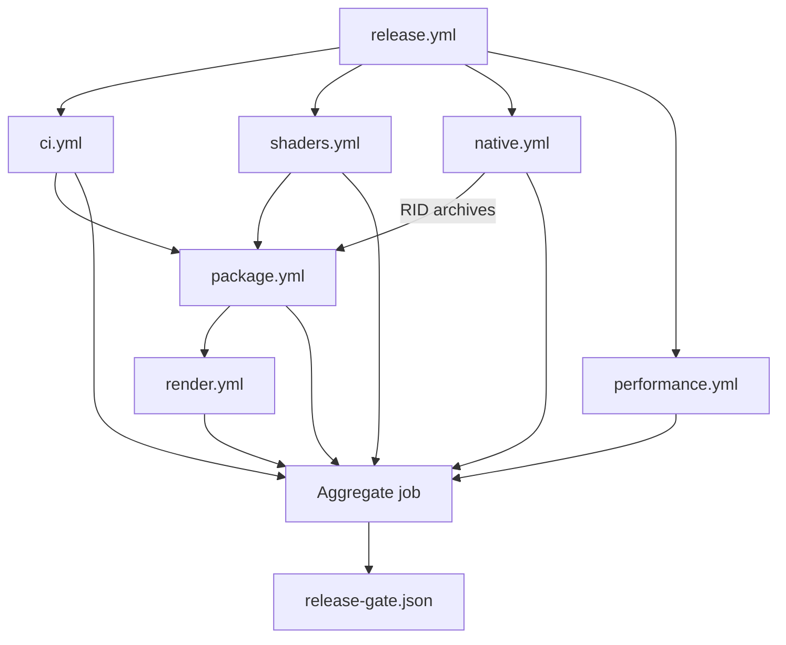

# Testing

Use this guide to choose the smallest local gate for a change and to understand how reusable
workflows combine managed, native, shader, package, render, and performance evidence for release.

**On this page:** [Workflow graph](#workflow-and-evidence-graph) ·
[Managed runner](#managed-test-runner) · [Performance](#performance-safety-gates) ·
[Fuzzing](#native-stagelayer-fuzzing) · [Windows Storm](#windows-native-storm-child) ·
[Linux Storm](#linux-native-storm-child) ·
[macOS and Metal](#macos-native-storm-child-and-metal-shell) ·
[Shared-stage soak](#shared-stage-soak) · [Related documentation](#related-documentation)

## Workflow and evidence graph



The dependency arrows show reusable workflow ordering and native artifact flow. Every workflow
result also feeds the aggregate job, which records one release decision without duplicating each
workflow's detailed evidence contract.

Managed tests use TUnit on Microsoft.Testing.Platform. The current pre-alpha baseline includes
managed data, interop, package, rendering, and viewer suites; native ABI and OpenUSD compatibility
CTest coverage; clean-package and NativeAOT consumers; and backend-neutral plus platform render
conformance gates.

Interactive render paths may not use CPU readback. Headless image tests compare against pinned
Storm references with perceptual tolerances rather than exact cross-driver pixels.

## Managed test runner

With the pinned .NET SDK 10.0.301 global Microsoft.Testing.Platform runner and TUnit
1.59, `dotnet test` can launch test DLLs through the wrong path, report zero executed
tests, and exit with code 5. Build first and run the generated test applications
directly instead:

```powershell
dotnet build OpenUsd.slnx -c Release
./eng/run-managed-tests.ps1 -Configuration Release
```

The runner discovers repository test projects by default, evaluates their declared
target frameworks, assembly names, and output DLLs through MSBuild, and executes every
framework with `dotnet <test.dll> --minimum-expected-tests 1`. Missing binaries,
non-test projects, unsupported frameworks, zero executed tests, and non-zero test
application exits fail the run.

On Windows and Linux, the rendering conformance project defaults to its packaged
SwiftShader ICD so repeated device-lifecycle tests use the deterministic software
backend they name and gate. `eng/vulkan-test-runtime.lock.json` pins the loader and
driver bytes; `eng/prepare-vulkan-test-runtime.ps1` verifies them and writes an
absolute Vulkan 1.3 ICD manifest because the upstream package manifest advertises an
obsolete Vulkan 1.0 API. Set either `VK_DRIVER_FILES` or `VK_ICD_FILENAMES` before
invoking the runner to preserve an explicit system or hosted-runner ICD instead.

Projects and frameworks can be selected explicitly. Test application arguments are
passed as a PowerShell array so filters and paths remain single arguments:

```powershell
./eng/run-managed-tests.ps1 `
  -Project tests/OpenUsd.Rendering.ConformanceTests/OpenUsd.Rendering.ConformanceTests.csproj `
  -Framework net10.0 `
  -Configuration Release `
  -TestArguments @(
    '--treenode-filter',
    '/*/*/VulkanCompositionPresentationTests/D3D11BridgeImportsPixelsAndReusesKeyedMutex')
```

Coverage also runs the built DLL directly:

```powershell
./eng/run-managed-tests.ps1 `
  -Project tests/OpenUsd.Tests/OpenUsd.Tests.csproj `
  -Framework net10.0 `
  -TestArguments @(
    '--results-directory', (Join-Path $PWD 'TestResults'),
    '--coverage',
    '--coverage-settings', (Join-Path $PWD 'eng/coverage.config'),
    '--coverage-output-format', 'cobertura',
    '--coverage-output', 'coverage.cobertura.xml')
```

After a Release build, run the Pester-free runner contract checks with:

```powershell
./eng/test-run-managed-tests.ps1
```

## Performance safety gates

The native-independent performance gate builds the focused TUnit safety project, repeats allocation,
retained-resource, batching, checked-shader cold-start, and P/Invoke-boundary contracts, then runs a
BenchmarkDotNet smoke:

```powershell
./eng/run-performance.ps1
```

The default smoke uses BenchmarkDotNet's `Dry` job for a low-flake correctness check. Use a short
measurement locally when validating the workflow:

```powershell
./eng/run-performance.ps1 -Mode Smoke -BenchmarkJob Short -Repeat 3
```

Full benchmark artifacts are opt-in and remain informational until release-machine baselines are
calibrated. Ordinary CI fails only on deterministic allocation, resource, source-boundary, checked
shader, curated-scene counter, build, or benchmark execution regressions; it does not assert wall-clock
timings:

```powershell
./eng/run-performance.ps1 `
  -Mode Artifacts `
  -BenchmarkJob Short `
  -ArtifactsPath artifacts/performance
```

The suite requires .NET SDK 10.0.301 but no native OpenUSD installation. Results include
BenchmarkDotNet Markdown, CSV, and full JSON reports under the selected artifact directory.

The curated Storm/hdSilk parity capture remains the render gate for the 19 scene set. In addition to
the adjusted-IoU floor, each captured hdSilk backend must stay under per-scene deterministic resource
thresholds recorded in [Performance](performance.md#object-and-resource-churn). Thresholds are measured
counter values plus modest headroom, not shared global ceilings. These gates prefer counters over
frame-time budgets because hosted runners have noisy CPU/GPU scheduling; the counters catch the resource
regressions the renderer controls without becoming flaky.

Sixteen scenes are gated at adjusted IoU `1.000000`; three are measured but ungated:
MaterialX standard-surface, Catmull-Clark subdivision, and `light-distant-shadow`. The shadow scene
matches the direct-lit image (`maxChannelDiff=3`, `meanChannelDiff=0.161`) but the paired
shadow-disabled stage is byte-identical in Storm, proving this offscreen harness does not render that
authored shadow yet. `-StormGl Mesa` gates 15 scenes and continues to exclude four Mesa/llvmpipe
Storm divergences.

Workflow and native-input contracts are also executable without a platform build:

```powershell
./eng/test-linux-native-prerequisites.ps1
./eng/test-native-artifact-workflow.ps1
./eng/test-continuous-safety-workflow.ps1
./eng/test-render-native-archive.ps1
./eng/run-native-fuzz.ps1 -SelfTest
./eng/shaders/test-expand-verified-archive.ps1
```

## Rebuilding only the project native layer

`eng/build-native.ps1` builds OpenUSD from source, which takes roughly ninety
minutes. Iterating on the project's own native layer does not need that: point
`OPENUSD_ROOT` at an existing install and build the shim preset directly, which
takes about thirty seconds after the first configure.

```
cmake --preset win-x64
cmake --build --preset win-x64
ctest --test-dir build/shim/win-x64 --output-on-failure
```

`native/CMakeLists.txt` has `find_package(Vulkan REQUIRED COMPONENTS
shaderc_combined)`, and the Vulkan SDK that satisfies it is fetched into
`native/install/vulkan-sdk-<version>/`, which is not in source control. **A
checkout that has never run the full native build therefore fails to configure
with `Could NOT find Vulkan (missing: Vulkan_LIBRARY Vulkan_INCLUDE_DIR
shaderc_combined)`**, even though nothing about the project layer needs the SDK
to be fetched again. Point `VULKAN_SDK` at an existing one:

```
$env:OPENUSD_ROOT = '<repo>/native/install/win-x64'
$env:VULKAN_SDK   = '<repo>/native/install/vulkan-sdk-1.4.321.0'
```

This matters more than it looks: without it the native probes cannot run at all,
so a change to `native/hdSilk` can only be compile-checked. Two separate pieces
of work were landed compile-only for exactly this reason before the cause was
identified.

## Native stage/layer fuzzing

The project-owned stage/layer C ABI has an opt-in Linux Clang libFuzzer target.
It writes each bounded input to an isolated temporary USDA file, opens it through
`openusd_stage_open`, and exercises layer identifiers plus packed prim and layer-stack
results after successful parses. Ordinary native builds and CTest do not create or run
the fuzzer.

After the locked `native/install/linux-x64` build exists, run a bounded ASAN/UBSAN pass:

```powershell
./eng/run-native-fuzz.ps1 -MaxTotalTime 60 -TimeoutSeconds 10
```

The runner copies the deterministic corpus from `test-assets/fuzz-seeds/stage-layer`,
first requires the known-good USDA seed to register plugins and parse successfully,
then uses libFuzzer seed 1337 for the bounded mutation campaign. libFuzzer executes
the empty unit before the seed corpus, and an empty layer can never parse, so the
harness returns early for a zero-length input rather than tripping that requirement.
Leak detection stays enabled, with `eng/native-fuzz-lsan.supp` suppressing the
OpenUSD and TBB process-lifetime singletons - the registry manager state, interned
path nodes and tokens, and trace event lists - that are never freed by design. It
cleans its mutable corpus and temporary files and retains reproducible crash
artifacts under `artifacts/native-fuzz/linux-x64`. The native artifact workflow runs
this only on its Linux source-build producer; archive-only package and render
consumers do not run fuzzing.

The `release.yml` reusable-workflow graph is the aggregate release check. It runs
managed CI, deterministic performance safety, shader reproducibility, verified native
archive production, package-only consumers, and platform render evidence on the same
commit and artifact set.

## hdSilk command-page probe

`native/hdSilk/tests/hdsilk_probe.cpp` is the CTest that pins the pointer-free command page.
It asserts page ABI 9 and the exact byte offsets of `FRAME`, `MESH_UPSERT`, and the 24-byte
`MESH_REMOVE` command, including the `instance_index` field that ABI 3 added to removals.

Instance identity has dedicated coverage. One case serializes a point-instanced scene and
requires one record per resolved instance, each with the shared prototype path, its own
zero-based `instance_index`, a stable non-zero `instance_id`, and its own resolved transform.
ABI 8 also requires only instance zero to carry prototype geometry; later records are lightweight.
Another replaces a single mesh and requires that only the affected `(path, instance_index)`
identities are retired, so a shrinking instancer emits exactly one removal per dropped instance.

Per-prim isolation is asserted as a skip rather than a throw: a record that fails validation must
be omitted from the page and counted by the rejected-mesh counter while every valid sibling still
serializes. This is what stops one malformed prim in a production asset from blanking a frame.

## Storm-to-hdSilk parity comparison

`ParityImageComparer` in `OpenUsd.Rendering` is the renderer-neutral core of the parity
harness. It compares a Storm reference capture with an hdSilk candidate capture as raw
top-down RGBA8 buffers of identical dimensions, and is deliberately geometry-first: hdSilk
still shades with an absolute-normal debug visualization, so colour comparison is opt-in and
disabled by the default `ParityTolerance.Geometry` contract.

A pixel counts as covered when any channel differs from the declared background by more than
`BackgroundChannelTolerance`. From the two coverage masks the comparer reports intersection,
union, and per-capture coverage counts.

Rasterization and anti-aliasing legitimately differ by about a pixel between backends and
drivers, so a coverage disagreement is forgiven when the other capture has coverage within
`EdgeDilationRadius`. Two values are therefore reported: the raw
`CoverageIntersectionOverUnion`, and the dilation-aware
`AdjustedCoverageIntersectionOverUnion` that treats a forgiven shift as agreement. The
adjusted value is the one gated, together with the fraction of unforgiven disagreements.
Gating the raw value would fail a one-pixel silhouette shift on small shapes even though the
dilation contract already accepted it.

When `CompareColor` is enabled the comparer also reports the maximum and mean per-channel
difference over the agreed coverage only, gated by `MaximumChannelDifference` and
`MaximumMeanChannelDifference`. Every comparison emits an RGBA diff image for artifacts:
reference-only coverage is blue, candidate-only coverage is red, agreed coverage is grey, and
agreed background is black.

`ParityImageComparisonTests` covers exact agreement, empty captures, forgiven and unforgiven
one-pixel shifts, entirely missing geometry, colour opt-in, diff-image encoding, and rejection
of mismatched dimensions, truncated buffers, and impossible tolerances.

`SilkCrossBackendParityTests` is the first gate built on the comparer. Storm remains the eventual
reference, but the hdSilk backends must first agree with each other, so it renders one retained
scene offscreen through D3D12 WARP and through Vulkan SwiftShader and requires the two captures to
match under the geometry tolerance. Both are software rasterizers, which keeps the comparison
deterministic on any host. A companion case renders the same scene with one mesh displaced and
requires the comparison to fail, so the gate cannot pass vacuously. This is what catches a
backend-only regression such as an index format or vertex layout that only one RHI got right.

## Windows native Storm child

The native child-host CTest proves the application-owned `WS_CHILD`, parent/process/creator-thread
identity, worker-thread destroy rejection followed by successful UI-thread destruction, WGL
4.6/4.5 compatibility profile and procedure-pointer sentinel checks, dedicated render-thread
affinity, exact shared-stage retention, first/live-edit frames, and context-loss recreation. It
also covers 150%/200% DPI transitions, focus/input delivery, a 10,000-request bounded coalescing
burst, concurrent render/request/resize/diagnostics/focus versus Stop, stale handles, and retryable
Storm destroy/abandon, WGL unbind/context deletion, DC release, and `DestroyWindow` failures.
The ABI v7 framebuffer/navigation gate rejects invalid camera sizes, modes, NaN/Inf matrices,
invalid navigation layouts, and capture before a
frame and after destruction, reads a real
shared-stage Storm frame, verifies dimensions/DPI and non-background pixels, proves a
render-relevant live visibility edit changes the hash, and checks an exact centered test pattern
with a stable hash and 12,288 non-background pixels at 256 by 192. It also proves latest-camera
coalescing, sequenced pointer/button/modifier/wheel/command snapshots, concurrent polling, and
camera/input persistence across context recreation. Platform probes verify that held F/Home/P keys
advance each counter once, release/repress advances it again, and focus loss clears pressed state.
The macOS source/native gates additionally pin non-precise detents, fractional precise deltas,
40 points per step, four-step bounds, direction inversion, sign, and magnitude. Managed tests also prove a
disposed session rejects diagnostic capture without entering native code.

Windows CTest reports the WGL-only probes as capability skips only when the host lacks the required
WGL context-creation or framebuffer extension. Context creation and incomplete-framebuffer failures
on a capable host remain failures. The separate `windows-wgl` platform smoke remains the required
end-to-end proof on a WGL-capable Windows host.

macOS CTest applies the same contract to the Storm child probe. A hosted macOS runner has no window
server session that can vend an accelerated OpenGL 4.1 core pixel format, so the probe exits with
the shared capability code and CTest records a skip. Every other failure, including a failure to
create the context on a host that did provide the pixel format, remains a hard failure.

```powershell
ctest --test-dir native/build/shim/win-x64 -C Release --output-on-failure
```

The complete Viewer gate classifies ANGLE/D3D11 only after successful runtime
`D3D11TextureNtHandle` imports with keyed-mutex synchronization and a compositor device LUID.
It performs 100 in-process
Storm/D3D12/Vulkan switches while preserving the exact render-state object, survives at least
90 seconds, simulates one Storm context loss, checks native pixel and composition draw evidence,
runs fifteen fresh processes, executes one authored stage-camera scenario, forces automatic
Storm-to-D3D12 fallback, and persistently fails Storm cleanup to prove its backend kind stays
quarantined until cleanup recovers. The Windows aggregate therefore contains exactly 22 scenarios
(15 fresh processes plus seven named/special runs):

```powershell
./eng/run-storm-native-child.ps1
```

Each run requires zero live child wrappers, managed/native Storm and Silk sessions, pages, GPU
scenes, and GPU meshes after shutdown. A context-loss run requires exactly one abandoned GL engine;
normal current-context destruction requires none. Windows evidence also records routed Avalonia
and native-child input deltas after real resize/input paths, plus enumerated Storm HWND visibility,
class, parent, process, thread, and retirement transitions. Configured-only compositor strings,
fabricated counters, and Avalonia control counts are rejected. The quarantine proof records candidate,
factory, attach, retired-owner, native-child peak/live, and hidden retained-HWND measurements.
Viewer evidence schema 8 additionally records canonical automatic/explicit/restored camera payloads
and SHA-256 signatures, binds all three non-background pixel artifacts, and proves the explicit frame
differs on Storm, D3D12, and Vulkan. Storm transitions must match child ABI v7 latest-requested
revision and latest requested/rendered camera signatures. Windows Storm runs also bind OS-routed
Alt-left input, ABI-7 navigation sequence/state provenance, the changed Viewer camera, and a changed
pixel artifact while requiring zero duplicate Avalonia routed events. Managed and PowerShell
adversarial tests reject schema 7, altered payloads/signatures, stale pixels, unbound camera
artifacts, and malformed native-navigation proof. The `stage-camera-backend-smoke` run additionally
binds the repository-authored USD file, selected camera path, initial/sampled snapshot hashes,
per-backend camera revisions/native signatures, changed initial-versus-sampled pixels, and automatic
reset pixels. Missing/non-camera source outcomes, stale path/time/state, missing hashes or pixels,
and source identities that omit either the asset or its short runner are rejected.

Run the bounded Windows picking and selection-outline proof with
`./eng/run-viewer-picking-smoke.ps1 -SmokeSeconds 180`. Its schema-2 artifact requires the same
`/World/Cube` hit and an empty-space miss on Storm, D3D12, and Vulkan, exactly one stale retry, exact
Storm selected-to-baseline restoration, rendered D3D12/Vulkan mask and composite passes, no
additional outline pass after clear, source/shader/test hashes, and zero final Viewer resources.
Real pixel shape, physical width, occlusion, resize, device-loss, and cleanup are additionally
enforced by `D3D12SelectionOutlineTests` on WARP and `VulkanSelectionOutlineTests` on SwiftShader;
Metal uses the equivalent hosted Xcode 16.4 conformance class.

Run only the bounded headed Windows authored-camera proof with:

```powershell
./eng/run-viewer-stage-camera-smoke.ps1
```

This short proof renders Storm, D3D12, and Vulkan once at each authored camera sample and also runs
the existing schema-8 camera/input contract transitions. It does not run the 100-switch soak or the
15-process aggregate.

## Linux native Storm child

Linux builds the parallel ABI as `libopenusd_storm_child.so`. Its CTest creates an
application-owned child XID, a dedicated GLX 4.6/4.5 compatibility render thread, and an
exact-stage Storm session. It verifies first frame, live edit, diagnostic capture, resize/DPI,
X11 input, request coalescing, wrong-thread destruction, context recreation, and zero live child
wrappers after teardown.

```shell
ctest --test-dir native/build/shim/linux-x64 --output-on-failure
bash ./eng/run-storm-native-child-linux.sh x11
bash ./eng/run-storm-native-child-linux.sh xwayland
bash ./eng/test-storm-native-child-linux.sh
```

The X11 gate uses Xvfb. The Wayland gate uses Weston's compositor-managed XWayland/XWM and runs the
entire mapped Avalonia shell through it so Storm and Vulkan can switch without restarting the
process. The native probe serializes process-global X error traps, injects a GLX 4.6 X error and
proves clean 4.5 fallback, rejects destroyed parent XIDs, and proves capture still returns the exact
pre-swap frame after the post-swap backbuffer is corrupted. Viewer evidence requires native
focus/pointer/wheel/key counter deltas and mapped-shell `XGetImage` pixels. Vulkan opaque-FD support
produces 100 Storm/Vulkan switches; only a schema-valid typed unavailable diagnostic permits the
Storm-only proof. Runner crashes, timeouts, missing/malformed artifacts, and zero native counters
fail.

Archive-mode runs execute the installed Linux probe at
`native/install/shim/linux-x64/bin/openusd_storm_child_probe` before the viewer soak. The probe's
Linux ABI-7 contract requires three arguments: the OpenUSD plugin directory, the stage path, and the
installed shim `lib` directory containing `libopenusd_storm_child.so -> .so.7 -> .so.7.0.0`. Passing
the runtime directory is part of the gate, not a convenience: release run `30699741174` reached this
step and failed with the probe's usage error before it could collect any Storm switching evidence.
The older `30440292326` release failed earlier on stale Vulkan ICD discovery, which is a separate
workflow defect in the same hosted Linux graphics setup rather than Storm child product behaviour.

## macOS native Storm child and Metal shell

The macOS child is an application-owned `NSView` hosted by Avalonia `NativeControlHost` while
Avalonia remains fixed to its Metal renderer. Cocoa creates, attaches, sizes, focuses, hides, and
detaches the view and creates/attaches the `NSOpenGLContext` drawable on the main thread. A dedicated
owner thread exclusively makes the context current, updates, renders, preserves exact pre-flush RGBA
bytes, flushes, recreates Storm from the retained stage, and clears current ownership. Cocoa input
evidence uses NSEvent/NSView injection, never user32. macOS exposes OpenGL 4.1 core, not a
compatibility profile. The probe requires `openusd_hydra` itself to report exactly `Storm / Metal`;
the child preserves that name and appends only `OpenGL 4.1 core presentation`.

The `macos-15` Apple Silicon render job selects Xcode 16.4, validates the ten-entry metallib and sidecar,
runs the same native first/edit/preserved-capture probe for build or archive input, runs the signed
package-only launch and real `IOSurfaceRef`/`MetalSharedEvent` tests, then performs 100 Storm/Metal
switches in one Avalonia process:

```powershell
./eng/run-silk-probe.ps1 -Rid osx-arm64 -MetalComposition
./eng/run-storm-native-child-macos.ps1 -SwitchCount 100 -SurvivalSeconds 90 -NativeSource build
```

The shader workflow is also the required hosted Metal picking gate. After staging the real
ten-entry library, it runs Metal conformance for nearest-depth overlap, physical top-left coordinate
mapping, token-zero miss, stale resize and simulated command-failure generation, nullable hit
geometry, persistent three-slot ring saturation/reuse, and warm zero-churn resource counts. Windows
runs the same multi-TFM source and contract tests, but cannot satisfy this execution gate because it
has neither Xcode 16.4 nor a real `mesh.metallib`.

The gate requires Cocoa input counters, main/render thread ownership, first/edit hash changes,
preserved-frame identity after diagnostic capture, resize/DPI evidence, context generation two,
safe-abandon teardown, actual `Storm / Metal` Hgi identity, non-zero Metal stage draws and triangles,
live display-color and transform IOSurface hash changes, ring reuse, no `STAGE_DRAW_BLOCKED`
diagnostic, and zero final resources.
The native probe also starts concurrent coalesced frame requests behind a barrier and performs 64
main-thread resizes. Every completed resize generation must have a matching context-update generation
before a frame with its exact width, height, and DPI is preserved.
Its recovery barrier pauses after the render thread has staged the old context and cleared renderer/
preserved-frame state, but before Cocoa-main replacement. The main thread resizes, detaches and
reattaches the NSView, and reads diagnostics in that phase, then releases recovery while pumping the
run loop. The gate requires monotonic context generation, renderer/context generation identity, no
half-published state, and exact dimensions/DPI on the first post-recovery preserved frame.
Native staging rejects a macOS runtime that omits the child library or installed probe.
The hardening implementation is complete when cross-build and source-contract tests pass; the
original macOS hosted proof remains blocked until this exact job succeeds on `macos-15`.

## Shared-stage soak

The NativeAOT hdSilk gate runs the deterministic 10,000-edit plus 2,500-read same-stage workload and writes a JSON
artifact:

```powershell
./eng/run-silk-probe.ps1 -Rid win-x64 -SharedStageSoak
```

The Windows WGL gate runs the same scheduler/source concurrently through Storm and hdSilk, simulates one
Storm context-loss abandon/recreate, survives for at least 90 seconds, and exits only after renderer,
source, and scheduler teardown:

```powershell
./eng/run-platform-smoke.ps1 -Platform windows-wgl -SharedStageSoak -SoakSeconds 90
```

The workload deterministically interleaves two property edits, one topology edit, one composition edit,
and one read in each five-operation cycle. It authors two meshes, changes render-relevant points and
canonical display color, and proves a controlled color edit upserts only the target mesh. Exact
invalidation counts, monotonic stage serials, page revisions, stable mesh IDs, removals, and steady pages
are required. The final gate compares the complete sorted hdSilk mesh ID/path set with the initialized
steady set, proves both soak meshes were removed and restored under their original **paths**, and checks the
default-time Mesh A display color exactly as `(0.92, 0.752, 0.416, 1)`. Path, not prim ID, is the identity
that survives a delete and recreate: Hydra assigns a fresh `PrimId` to a recreated prim and never reuses
the retired one, so restoration can only be proven by path.

Artifacts report source/build identity, ABI versions, timestamps, operation counts, serial and
notification coalescing, Storm pre/post-loss frames and faults, hdSilk pages/upserts/removals, and
baseline/peak/final native and managed resource counters. Forced-GC checkpoints every 500 operations
after warmup record retained bytes and working set; later-window least-squares slopes must remain below
the deterministic ceilings. `render.yml` runs the NativeAOT soak plus Windows WGL and Linux X11/XWayland
soaks as blocking steps. `eng/shared-stage-soak-identity.ps1` causes each runner to reject stale source,
executable hash, or executable timestamp evidence. The source identity covers all production `src`
projects (including every Silk backend), native shim sources/CMake/resources, tests/probes/assets,
root build/version/package inputs, rendering workflow, and engineering scripts while excluding generated
build/install/download outputs. Viewer evidence is finalized only after the GL render pump reports
shutdown completion and fresh post-teardown renderer fault and resource diagnostics are read.

## Render gate capability limits

Two render proofs still need graphics capabilities that a hosted GitHub runner does not have. Both are
narrowed rather than deleted: everything the runner can prove still runs and still blocks, the
unprovable part records a `status: skipped` evidence artifact naming its reason, and the work needed to
restore full coverage is listed below. Narrowing is deliberately not automatic. Each one is opt-in at
the call site in `.github/workflows/render.yml`, so a capability regression on a capable host is still a
hard failure, and the narrowing is visible in the workflow rather than buried in a script.

**`windows-wgl` shared-stage soak.** Hosted Windows exposes only the generic GDI OpenGL 1.1
implementation, so the hosted gate explicitly selects the hash-locked Mesa llvmpipe `opengl32.dll`
before starting Avalonia/Storm. The soak is mandatory again on hosted Windows.

**Windows Avalonia Vulkan composition.** Hosted Windows has no GPU driver and therefore no system
Vulkan ICD. The skip is recorded in `artifacts/render-capability/windows-vulkan.json`.

**Linux X11 and Wayland Vulkan import.** The hosted Linux compositor accepts no external Vulkan
images at all, reporting `supported image handles: (none)`, so the opaque-FD import this proves
cannot be exercised. The skip is recorded in
`artifacts/avalonia-vulkan-smoke/linux-x64/<platform>-capability.json`. Note that lavapipe itself is
fine and is still used: the limit is the compositor, not the driver.

What still blocks on the hosted runner: the Windows WGL job keeps the NativeAOT shared-stage soak,
the native probe, the soak identity gate, and the WGL soak; the Windows Vulkan job keeps the viewer
source-identity and evidence contracts; the Linux job keeps its CTest suite, both X11 and XWayland
shared-stage soaks, and the Storm child switching gates. Renderer-neutral and hdSilk Vulkan behaviour
that does not need composition stays covered by the managed conformance suite in `ci.yml`, which runs
against the pinned SwiftShader driver.

### Unblocking the WGL soak

The WGL soak is unblocked with the same supply-chain model as the SwiftShader Vulkan runtime:
`eng/mesa-wgl-test-runtime.lock.json` pins the exact Mesa release, archive URL, archive SHA-256, and
staged `opengl32.dll` SHA-256 for `win-x64`. `eng/prepare-mesa-wgl-test-runtime.ps1` downloads the
archive only from that pinned URL, verifies the archive hash, extracts only the locked file, verifies
the staged file hash, prepends its directory to `PATH`, and sets llvmpipe/software environment knobs
before the soak starts.

The Windows loader does not resolve `opengl32.dll` from `PATH` while the System32 GDI OpenGL library
is available. The WGL parity gate therefore copies the pinned Mesa `opengl32.dll` into both the test
host application directory and the staged native runtime `bin` directory, then tells the conformance
test host to load the application-directory copy before any Storm native module imports OpenGL. This
keeps the managed WGL context and OpenUSD Glf/Garch on the same Mesa module. Without that explicit
early load, the managed side can create a Mesa context while `usd_ms.dll`/`openusd_hydra.dll` imports
System32 `opengl32.dll`; Glf then sees no valid current context even though managed WGL calls report
one.

The helper also runs a WGL preflight and writes `mesa-wgl-runtime.json` plus
`mesa-wgl-preflight.json` under `artifacts/platform-smoke/windows-wgl/mesa-wgl-runtime`. Those files
record the loaded `opengl32.dll`, its SHA-256, and `GL_VENDOR`, `GL_RENDERER`, and `GL_VERSION`.
The gate requires the preflight renderer to contain `llvmpipe`, so a hosted Windows pass records that
it used Mesa software rasterisation instead of silently falling back to the generic GDI OpenGL 1.1
driver or an installed GPU driver. The parity capture evidence also records the test host's loaded
OpenGL path, SHA-256, renderer, version, and current WGL handles beside the scene metrics.

`eng/run-parity-capture.ps1` defaults to `-StormGl Auto`. In that mode the script removes any stale
test-host `opengl32.dll` override, preflights the system WGL implementation, selects seventeen scenes, and
gates the scenes whose measured thresholds are enabled. If the
system driver is unavailable, Auto falls back to Mesa with a warning that the selected set has changed to
thirteen scenes. Hosted CI passes `-StormGl Mesa` explicitly so the result is
deterministic and runner-safe. Both modes publish the scene count and excluded scene names, and the test
host asserts the expected count so the parity subset cannot shrink silently.

The Mesa WGL parity run selects the thirteen scenes whose Storm reference is stable across Mesa llvmpipe,
D3D12 WARP, and Vulkan SwiftShader: `orientation-asymmetric`, `clip-plane-asymmetric`,
`depth-overlap-multiprim`, `material-normals-uv`, `materials-textures`, `light-dome-ambient`,
`point-instancer-cluster`, `points-asymmetric`, `cards-draw-mode`, `time-varying-transform-primvar`,
and `skinned-pennant`. The four excluded scenes remain valuable GPU-driver conformance probes, but Mesa llvmpipe exposed
Storm implementation differences rather than hdSilk regressions:

- `single-sided-winding`: Mesa Storm covered 2,201 pixels in the single-sided pennant region while
  hdSilk covered the expected 875-pixel double-sided banner, with no overlap (`adjustedIoU=0.000000`).
  The first failing assertion is the adjusted-IoU gate; positive coverage holds for both images.
- `bounds-draw-mode`: Mesa Storm covered 0 pixels for the draw-mode basis-curves bounds proxy, while
  hdSilk covered the expected 251 one-pixel line pixels (`adjustedIoU=0.000000`). If gated, this
  would fail the reference positive-coverage assertion.
- `origin-draw-mode`: Mesa Storm covered 0 pixels for the draw-mode basis-curves origin proxy, while
  hdSilk covered the expected 116 one-pixel line pixels (`adjustedIoU=0.000000`). If gated, this
  would fail the reference positive-coverage assertion.
- `subdivision-catmull-clark`: Mesa Storm's Catmull-Clark reference differs from the system-driver
  Storm capture, so the deliberately ungated subdivision measurement remains Auto-only for now.

The WGL gate writes `parity-capture-mesa-wgl-exclusions.json`/`.txt` so the subset is explicit in CI
artifacts. If a future Mesa/OpenUSD update makes those scenes agree with the real-GPU measurements,
remove the exclusion and restore all seventeen scenes to the WGL parity subset.

Those four scenes are selected only when `-StormGl Auto` finds a conformant system driver. Hosted CI has no
such driver today, so authored double-sidedness and the two basis-curves line-topology draw-mode probes
are not covered by hosted WGL CI; they need the same class of self-hosted GPU-equipped Windows runner as
the Vulkan composition gates below.

This proves the Storm WGL render path, shared-stage scheduling, teardown, and diagnostics on a
reproducible software OpenGL implementation. It is not a Windows GPU driver-conformance proof:
driver-specific WGL pixel-format quirks, swap-chain behaviour, and vendor OpenGL bugs still need a
self-hosted Windows runner with that driver stack. A separate self-hosted GPU driver proof should
bypass the Mesa staging helper so the loaded `opengl32.dll` evidence names the vendor driver.

### Unblocking the Vulkan composition gates

Neither the Windows nor the Linux Vulkan composition proof can be solved in software, and for the
same underlying reason: both import a Vulkan image into the windowing system's compositor, so both
need a real GPU stack on both sides of that import.

On Windows the proof exports a Vulkan image to a D3D11 shared handle and imports it with a keyed
mutex, so it needs a Vulkan driver that implements both `VK_KHR_external_memory_win32` and
`VK_KHR_external_semaphore_win32` **and** reports the same adapter LUID as the compositor.
SwiftShader implements neither extension, which is directly observable:

```powershell
./eng/run-managed-tests.ps1 `
  -Project tests/OpenUsd.Rendering.ConformanceTests/OpenUsd.Rendering.ConformanceTests.csproj `
  -Framework net10.0 `
  -Configuration Release `
  -TestArguments @('--treenode-filter', '/*/*/VulkanCompositionPresentationTests/*')
```

Under SwiftShader that reports `SwiftShaderExportsAndReusesCompositionRingWhenSupported` skipping
with `Vulkan external-object extensions are unavailable: VK_KHR_external_memory_win32,
VK_KHR_external_semaphore_win32`, and `D3D11BridgeImportsPixelsAndReusesKeyedMutex` skipping with
`The Vulkan renderer and compositor use different adapter LUIDs`.

On Linux the driver is not the problem. Lavapipe is present and used, and the smoke reaches the
compositor; the compositor is what reports `supported image handles: (none)`, so there is no handle
type through which an external image could be imported.

Both are restored the same way: run these jobs on a GPU-equipped self-hosted runner. On Windows,
once an ICD exists the `Resolve system Vulkan ICD` step reports `available=true` and every guarded
step below it runs unchanged. On Linux, drop `OPENUSD_ALLOW_UNAVAILABLE_CAPABILITY` from the two
import smoke steps.

## Related documentation

- [Rendering](rendering.md) defines the backend paths exercised by render evidence.
- [Native build](native-build.md) defines the verified archives reused by package and render jobs.
- [Packaging](packaging.md) defines clean-feed and package-only execution gates.
- [Shader pipeline](shader-pipeline.md) defines authoritative and platform shader validation.

### Parity capture driver contract

**The parity gate is opt-in strict, and this is load bearing.** When Storm's
native library cannot be loaded the driver skips, and a skipped test still counts
as a pass. That means the gate reported success while proving nothing: it was
introduced in exactly that state, with every scene skipping because no native
runtime was staged beside the test binaries. Set
`OPENUSD_PARITY_CAPTURE_REQUIRED=1` to turn an unavailable capture into a hard
failure. CI must set it; it stays opt-in locally so a developer without a staged
native runtime is not blocked. Verified by running the suite both ways: with the
variable set the parity tests fail naming the missing library, without it they
skip and the suite stays green.

The parity scenes were measured on Windows with the staged Storm runtime from
`native/install`, Mesa llvmpipe WGL 26.1.5, D3D12 WARP, and packaged
SwiftShader. Each gated scene must keep at least 0.18 adjusted-IoU separation
between the correct capture and the closest vertical, horizontal, transpose, or
camera-shift perturbation before it can use the 0.92 threshold.

| Scene | Correct | Vertical | Horizontal | Transpose | Shift | Margin | Gate |
| --- | ---: | ---: | ---: | ---: | ---: | ---: | --- |
| `orientation-asymmetric` | 1.000000 | 0.592750 | 0.360720 | 0.563545 | 0.193474 | 0.407250 | 0.92 |
| `clip-plane-asymmetric` | 1.000000 | 0.675442 | 0.195327 | 0.358933 | 0.563869 | 0.324558 | 0.92 |
| `depth-overlap-multiprim` | 1.000000 | 0.718102 | 0.815667 | 0.737040 | 0.432669 | 0.184333 | 0.92 |
| `material-normals-uv` | 1.000000 | 0.310060 | 0.253340 | 0.557888 | 0.216277 | 0.442112 | 0.92 |
| `materials-textures` | 1.000000 | 0.781397 | 0.503618 | 0.422400 | 0.434662 | 0.218603 | 0.92 |
| MaterialX preview equivalent | 1.000000 | 0.310060 | 0.253340 | 0.557888 | 0.216277 | 0.442112 | 0.92 |
| `light-distant-specular` | 1.000000 | 0.390726 | 0.331192 | 0.347444 | 0.209455 | 0.609274 | 0.92 |
| `point-instancer-cluster` | 1.000000 | 0.089474 | 0.042808 | 0.126576 | 0.034647 | 0.873424 | 0.92 |
| `points-asymmetric` | 1.000000 | 0.277778 | 0.436893 | 0.071066 | 0.274112 | 0.563107 | 0.92 |
| `cards-draw-mode` | 1.000000 | 0.250000 | 0.418182 | 0.730337 | 0.431193 | 0.269663 | 0.92 |
| `single-sided-winding` | 1.000000 | 0.000000 | 0.000000 | 0.450163 | 0.060213 | 0.549837 | 0.92 |
| `bounds-draw-mode` | 1.000000 | 0.094421 | 0.231884 | 0.047847 | 0.243309 | 0.756691 | 0.92 |
| `origin-draw-mode` | 1.000000 | 0.000000 | 0.229167 | 0.046083 | 0.175000 | 0.770833 | 0.92 |
| `time-varying-transform-primvar` | 1.000000 | 0.287766 | 0.401624 | 0.317643 | 0.193264 | 0.598376 | 0.92 |
| `skinned-pennant` | 1.000000 | 0.725652 | 0.000000 | 0.121114 | 0.077607 | 0.274348 | 0.92 |

Storm and hdSilk agree **exactly** on coverage for every curated scene: raw IoU
1.000000 with identical coverage counts. All gated scenes use a 0.92 threshold,
which leaves 0.08 for rasterization differences on backends other than D3D12
WARP and Vulkan SwiftShader -- both of which currently produce byte-identical
captures -- while staying at least 0.18 clear of the nearest perturbation.

### Colour parity

Colour is now measured on every scene and reported as `maxChannelDelta` and
`meanChannelDelta` over the agreed coverage, but it only **gates** a scene that
binds a real `UsdPreviewSurface` and has measured deltas within the shaded
threshold. `material-normals-uv` measures 10 maximum and 3.793 mean after the
eye-space position interpolant replaced the constant eye vector, gated at 16 and
8. `materials-textures` exercises real texture decode and GPU binding with an
asymmetric sRGB gradient texture; it gates colour at the same 16/8 threshold and
currently measures 13 maximum and 4.476 mean on D3D12 WARP, 13 maximum and 4.466
mean on Vulkan SwiftShader.

| Shading | max delta | mean delta |
| --- | ---: | ---: |
| Debug `abs(normal) * tint` | 149 | 140.726 |
| BRDF with unnormalized Lambert | 15 | 13.072 |
| BRDF modelled on Storm's Preview.Lighting | **16** | **11.677** |
| BRDF with per-pixel `normalize(-Peye)` | **10** | **3.793** |

The BRDF is written against Storm's own `Preview.Lighting` rather than against
the UsdPreviewSurface prose: the same Trowbridge-Reitz distribution including
its epsilon, the same Schlick-GGX geometric term with `k = alpha/2`, the same
`4·NdotL·NdotE + EPSILON` denominator, the same `F0`/`F90` construction from
`(1-ior)/(1+ior)`, and the same `(1-F)` diffuse attenuation. Storm's
`evaluateDirectDiffuse` returns `1/pi`, so an intensity of one is an irradiance
of pi, which is what makes a fully lit Lambertian surface return its albedo.
Normals are faced with `SV_IsFrontFace`, as Storm's mesh shader does with
`gl_FrontFacing`; without that a prim whose computed face normal points away
renders black. hdSilk also interpolates eye-space position and uses Storm's
per-pixel `normalize(-Peye)` eye vector for the specular lobe.

The previous constant-eye residual was 16 max / 11.677 mean. The remaining
10 max / 3.793 mean residual is below the tightened 16 / 8 gate with headroom.

The other scenes bind no material, so Storm shades them through its own
fallback -- which is markedly brighter and which hdSilk does not reproduce.
Their colour deltas are recorded as evidence, not gated. Making
them colour-gateable means binding materials to them, which is a scene change
rather than a renderer change.

### A measured gap, now closed: clip planes

`test-assets/parity/parity-clip-plane-asymmetric.usda` pairs a large lobe that
straddles an eye-space clip plane with an anchor mesh that must survive. The
harness supplies plane `(1, 0, 0, 0.12)`, and Storm and hdSilk agree exactly at
3907 covered pixels. That confirms the sign convention used by both renderers:
discard when `dot(plane.xyz, Peye) + plane.w < 0`.

Correct adjusted IoU is 1.000000. The closest perturbation is the vertical flip
at 0.675442, so the measured margin is **0.324558** and the scene gates at 0.92.
Deliberately disabling hdSilk clip-plane upload made the candidate draw the
rejected lobe too: adjusted IoU fell to **0.554411**, candidate coverage rose
from 3907 to 7186 pixels, and the gate failed red before the change was reverted.

### A measured gap, now closed: authored double-sidedness

`test-assets/parity/parity-single-sided-winding.usda` began as a pennant wound so
the camera sees its back face, with `doubleSided = 0`. It measured:

| `doubleSided` | Storm coverage | hdSilk coverage |
| ---: | ---: | ---: |
| `0` | **0** | 2279 |
| `1` | 2279 | 2279 |

Same geometry, same winding, one attribute changed. Storm culled the back faces
of a single-sided prim and hdSilk did not, because hdSilk's mesh pipeline was
created with no cull mode and the page ABI carried no per-mesh sidedness.
Setting `cullStyle` on `UsdImagingGLRenderParams` does not change this: the
prim's own cull style wins, so the global render parameter is not the lever.

Worth stating plainly: every scene gated before this declared `doubleSided = 1`,
so the existing suite could never have found the gap. It took a scene written
specifically to discriminate on the attribute.

hdSilk now carries resolved double-sidedness and cull style per mesh over page
ABI 6 and selects a back-face cull pipeline for single-sided meshes, so the
scene is registered and gated.

#### Why the scene has two prims

The first attempt at registering it gated the culled pennant **alone**. Storm
and hdSilk then both produced zero coverage and scored a perfect 1.000000 --
which is also what any bug that made hdSilk draw nothing at all would score, for
any reason whatsoever. Every geometric perturbation of an empty image is also
empty, so all four perturbations scored 1.000000 too, and the harness could not
discriminate. Registering it in that form required switching **off** both of the
harness's non-vacuity safeguards, the positive-coverage requirement and the
perturbation-discrimination requirement. That is a gate that cannot fail, which
is the exact defect this document keeps recording.

The scene now pairs two prims that differ in **one attribute only**. Both are
wound back-facing; the banner is `doubleSided = 1` and must be drawn, the
pennant is `doubleSided = 0` and must be culled. That makes all three failure
modes visible to the standard safeguards, with no opt-outs:

| Failure mode | How the gate catches it |
| --- | --- |
| Culling regresses | Pennant coverage returns; measured Storm 875 vs hdSilk 3076, adjusted IoU **0.284460**, gate red |
| Culling is too aggressive | Double-sided banner disappears, tripping the positive-coverage requirement |
| Renderer draws nothing | Same as above |
| Geometry drifts | Banner is asymmetric in both axes; perturbations measure 0.000000, 0.000000, 0.450163 and 0.060213 |

Correct is 875 against 875, adjusted IoU 1.000000, weakest margin **0.549837**
-- the second widest of any scene. The broken-culling number above was produced
by deliberately forcing `GetCullMode` to `None` and confirming the gate went
red, then reverting.

### Draw modes: cards already worked; origin and bounds are now gated

`UsdImagingGLDrawModeAdapter` inserts the `cards` draw mode as an ordinary
**mesh** Rprim and `origin`/`bounds` as **basisCurves**. hdSilk declares only
`mesh` in `SUPPORTED_RPRIM_TYPES`, so UsdImaging warns and skips the latter two
entirely. Measured on the same model:

| `model:drawMode` | Storm | hdSilk |
| --- | ---: | ---: |
| `cards` | 3773 | 3773 |
| `bounds` | 276 | **0** |

So cards was already at exact parity and had simply never been tested, while
origin and bounds rendered nothing at all in hdSilk before line topology landed. The curves are
`HdBasisCurvesTopology(linear, bezier, segmented)` -- independent line segments
with widths. `parity-origin-draw-mode.usda` now closes the remaining draw-mode
parity gap: its translated, non-square component puts the compact origin axes
off centre so the one-pixel line shape discriminates under the standard
perturbations.

#### Ribbon tessellation was tried and measured, and it cannot work

The obvious design is to tessellate each segment into a two-triangle ribbon and
emit it as an ordinary mesh record, needing no new page ABI command, RHI
topology or pipeline. That was implemented and measured, and it is wrong.
`UsdImagingGLDrawModeAdapter` authors `widths = [1.0]` constant for bounds and
origin (`drawModeAdapter.cpp:641-644`). Ribbons built from that width against a
~1.2 unit box swallow the screen:

| `parity-bounds-draw-mode.usda` | coverage |
| --- | ---: |
| Storm | 251 |
| hdSilk, world-space ribbons | 10878 |

The decisive measurement is a plain `BasisCurves` prim, not a draw mode, with an
explicit large constant width of 0.24 world units --
`parity-curve-width-probe.usda`:

| | coverage |
| --- | ---: |
| Storm | 128 |
| hdSilk, world-space ribbons | 2093 |

Two segments of roughly 71 px projected length are ~142 px if drawn one pixel
wide, and Storm measured 128. **Storm rasterizes linear basis curves as
1-pixel screen-space lines and ignores authored world-space widths entirely.**
That is not specific to draw modes; it is how Storm draws linear curves at the
complexity the harness uses.

So no ribbon width and no orientation rule can reach parity, because Storm is
not drawing a ribbon at all. It also explains why the ribbon attempt had no
good answer for orientation: `Sync()` has no camera state, and a camera-facing
ribbon is exactly what Storm never builds.

The corrected design is to emit **line topology**. D3D12 has no line width state
at all, Vulkan needs the `wideLines` feature for anything but 1.0, and Metal has
none, so all three rasterize lines at exactly one pixel -- matching Storm by
construction rather than by tuning a constant. `SilkTopologyKind` gains
`LineList`, which is additive because the wire already carries a topology kind
field, so this is **not** a page ABI change.

Thin one-pixel lines are the worst case for coverage IoU, since a single pixel
of rasterization difference is a large fraction of a thin shape, so whether the
scenes could be gated at all was left as an open measurement rather than an
assumption. It was then measured, and the concern did not materialise. For
`parity-bounds-draw-mode.usda`, Storm, D3D12 WARP and Vulkan SwiftShader all
produce **exactly 251** covered pixels, adjusted IoU 1.000000, against a
0.243309 worst perturbation -- a 0.756691 margin. For
`parity-origin-draw-mode.usda`, all three produce **exactly 116** covered
pixels, adjusted IoU 1.000000, against a 0.229167 worst perturbation -- a
0.770833 margin. Both scenes are gated at 0.92.

Matching by construction is what made that possible. Because none of the three
backends has a line width state to get wrong, there was no constant left to
tune, and the agreement is exact rather than approximate.

### Points: default width is world-space; one-pixel points are gated

`UsdGeomPoints` was absent from `SUPPORTED_RPRIM_TYPES`, so UsdImaging skipped
points exactly as it once skipped draw-mode basis curves. Measuring Storm first
showed an important constraint: with no authored widths, Storm treats the default
point width as world-space and `parity-points-asymmetric.usda` covered 14589
pixels, while a GPU point-list implementation covered 109. The admitted scene
therefore authors constant `widths = [0.01]`; at that width Storm, D3D12 WARP,
and Vulkan SwiftShader all cover exactly **109** pixels.

The gated result is adjusted IoU **1.000000** against a 0.436893 worst
perturbation, a **0.563107** margin. Deliberately removing `points` from the
hdSilk supported Rprim list made the scene draw nothing: correct fell to
0.000000, the weakest margin was 0.000000, and the gate failed before the change
was reverted.

### Subdivision: Storm's default complexity is measured before refinement

`parity-subdivision-catmull-clark.usda` exists because subdivision is the same
kind of trap as curve widths: assuming what Storm "should" draw is not enough.
The scene is an off-centre, strongly non-square all-quad frustum with
`uniform token subdivisionScheme = "catmullClark"` plus a lower-right anchor
that makes vertical flips and camera shifts fail. Its diagnostic companion,
`parity-subdivision-control-cage.usda`, uses identical authored geometry with
`subdivisionScheme = "none"` so the subdivided stage can be compared against its
control cage.

Measurement came first. At the harness's default Storm complexity, Storm does
not produce full Catmull-Clark refinement; its output is closest to hdSilk's
coarse control-cage path. The Catmull-Clark scene covered **5192** pixels in
Storm and **5190** in hdSilk. Their adjusted IoU is **0.931015** against a
**0.695708** worst perturbation, but this is an ungated known divergence rather
than an agreement claim. A forced `0.99` diagnostic run dumped the captures and
showed **247** Storm-only and **240** hdSilk-only pixels; roughly **294** of the
487 differing pixels were near silhouette edges and **193** were interior fill,
so the mismatch is not only a one-pixel edge-rasterization nudge. The control
cage is deliberately not gated; it measured only **0.910543** against hdSilk,
while Storm covered **5824** pixels, proving the authored `catmullClark` scene is
not an empty or invariant duplicate of its control.

An OpenSubdiv uniform-refinement experiment was then used as the required
"break it" proof. Enabling one Catmull-Clark refinement level in hdSilk reduced
the same frustum candidate to **2273** pixels and the adjusted IoU to
**0.533246**, so implementing eager subdivision at this complexity would have
diverged from Storm rather than converged. The experiment was reverted, and the
scene remains `GateEnabled: false`: hdSilk keeps subdivision schemes on the
coarse path until the harness deliberately raises complexity/refine level or the
remaining 0.931015-vs-1.000000 divergence is eliminated. The topology comparison
showed hdSilk draws the `HdMeshUtil` face-local 0-2 split for every quad. A
diagnostic run forcing the opposite 1-3 split worsened the adjusted IoU to
**0.872473** with 719 differing pixels, so the residual is not a simple global
diagonal mismatch; it is Storm's coarse all-quad handling differing from the
triangle-list topology hdSilk publishes. Mesa llvmpipe refines
or rasterizes this scene differently at the same harness settings and scored
0.120809, so the scene joins the Windows Mesa exclusion list rather than
weakening or falsely gating a backend-specific divergence.

Excluded for this gate: general Catmull-Clark limit evaluation, Loop surfaces,
bilinear refinement, creases/corners/holes beyond what the coarse mesh already
expresses, and subdivision-aware interpolation of non-constant primvars.

### UsdSkel: direct CPU deformation remains exact

`test-assets/parity/parity-skinned-pennant.usda` was added only after measuring
Storm. The scene authors an off-centre, strongly non-square pennant under a
two-joint `UsdSkel` rig and captures at timeCode 2, where the tip joint is
rotated from its timeCode 1 rest pose. Storm and hdSilk still agree exactly
after hdSilk replaced the skinned-mesh ExtComputation `points` pull for the
supported subset with direct `UsdSkelCache` CPU evaluation in the render path.
Correct adjusted IoU is **1.000000** with 2606 covered pixels on Storm, D3D12
WARP, and Vulkan SwiftShader.

The perturbation evidence is deliberately non-vacuous: vertical flip 0.725652,
horizontal mirror 0.000000, transpose 0.121114, shifted camera 0.077607, and the
wrong-time probe 0.534601. The weakest required margin is therefore **0.274348**.
Capturing the undeformed timeCode 1 pose was the deliberate red proof for this
gate; it failed the 0.92 threshold before the registration stayed at timeCode 2.
Direct evaluation intentionally skips blend-shape meshes for this slice and
falls back to Hydra computed points there. GPU compute skinning remains a
measured gap rather than a claimed feature.

### UsdLux lighting scenes

`parity-light-distant-exposure.usda`, `parity-light-sphere-point.usda`, and
`parity-light-dome-ambient.usda` are registered with `ColorComparisonReady: true`.
The first run found exact coverage but very large colour deltas because hdSilk
packed light constants as an array-of-structs while the shader reflection expects
four structure-of-arrays tables. That made direct lights read the wrong slots.

After fixing that packing, all three direct-light captures are colour-ready. The
untextured dome ambient gate has adjusted IoU **1.000000**, worst perturbation
**0.537545**, margin **0.462455**, and colour deltas **11 / 3.619** on Auto and
**11 / 3.573** on Mesa for both D3D12 WARP and Vulkan SwiftShader.

The ratio measurement identified why the first direct-light captures were wrong:
Storm was not using the authored light. `openusd_hydra.cpp` unconditionally called
`UsdImagingGLEngine::SetLightingState` with the deterministic headlight, replacing
the stage's `UsdLux` lights. Mean Storm/Silk channel ratios on non-background,
non-clipped D3D12 and Vulkan pixels are **0.4225 / 0.5983 / 1.0347**. The
authored light scale is `intensity * 2^exposure * color`, or
`1.6 * 2^0.5 * (1.0, 0.72, 0.42)` = **2.2627 / 1.6292 / 0.9504**; its inverse is
**0.4419 / 0.6138 / 1.0522**, matching the measured ratios within the saturated
pixels. The direct-light delta is therefore not a π/exposure transport bug in
hdSilk; it was Storm's explicit white fallback headlight.

The parity driver now requests scene lighting per render for the direct-light
scenes and keeps the fallback headlight for all existing scenes. The
`light-distant-exposure` probe also captures a doubled-intensity stage and
records `doubledIntensityChangedStorm=True`, proving Storm responds to authored
light intensity. The next measured gaps were max-only rather than mean-scale:
Auto reported distant **42 / 8.675** and sphere **36 / 2.878** on both D3D12 WARP
and Vulkan SwiftShader. Dumping the captures located the worst pixels in compact
interior highlight boxes, not on silhouettes: distant residuals >= 30 were at
`x=79..80, y=63..64`, and sphere residuals >= 30 were at `x=79, y=59..60`. The
source was the authored glossy specular lobe, so the gate scenes now use matte
PreviewSurface materials with `useSpecularWorkflow = 1` and zero `specularColor`.

The glossy specular gap is now covered separately. The BRDF path already matched
Storm's `previewSurface.glslfx` headlight implementation, so the new
`light-distant-specular` scene keeps the direct-light transport isolated while
adding a glossy `useSpecularWorkflow = 1` lobe under a `UsdLuxDistantLight`. It
gates with adjusted IoU **1.000000**, weakest perturbation **0.390726**, margin
**0.609274**, and colour deltas **10 / 6.027**. A deliberate red proof replaced
that asset with a centred square; the perturbation test failed both vertical and
horizontal variants and reported weakest margin **0.000000**, then the asymmetric
asset was restored.

The redesigned direct-light silhouettes are off-centre and non-square. Distant
now gates with adjusted IoU **1.000000**, weakest perturbation **0.390726**,
margin **0.609274**, and colour deltas **4 / 1.095**. Sphere now gates with
adjusted IoU **1.000000**, weakest perturbation **0.457248**, margin
**0.542752**, and colour deltas **13 / 0.782**. A deliberate red proof halved
hdSilk's scene-light exposure during capture: the distant gate failed at
**127 / 126.087**, and the sphere gate failed at **128 / 75.214**, then the
transport was restored.

The implementation carries direct DistantLight/SphereLight data and untextured
DomeLight ambient through page ABI 9, but shadows, PCF, light linking, dome
textures/image lighting, and instanced-shadow parity remain scoped out until the
Storm measurements can support real gates.


### Draw modes: cards, bounds, and origin are gated

`parity-cards-draw-mode.usda` gates the mesh half. Two things about it are
deliberate. Its inner mesh is a small triangle rather than a quad matching the
model extent, because the first version used a matching quad and measured
identically whether or not the draw mode applied -- it could not have failed.
And its extent is off-centre and strongly non-square, because a card is an
axis-aligned rectangle: a centred near-square one measured a weakest
perturbation margin of 0.012661, far below the 0.18 the harness requires, even
though its correct score was exactly 1.000000.

`material-normals-uv` was the last scene admitted. Once exact agreement removed
the projection error, its remaining weakness was its own silhouette: a vertical
flip of the original fan shape still scored 0.865109, a 0.134891 margin below
the required 0.18. It was redesigned as a pennant, a thin full-height mast with
a triangle on its top half only, so mass sits in the upper right against an
empty lower right. A vertical flip now costs 0.689940 and the margin is
0.442112. The scene keeps its bound PreviewSurface, authored vertex normals and
UVs, so it still proves what it exists to prove.

Display styles remain partial. Cards, bounds, origin draw modes, points, and
one-pixel line topology have measured parity; wireframe, shaded-wire, and
related display styles are not implemented or gated in hdSilk yet.

### Three shipped defects the harness found

The gate paid for itself before it was finished. All three were reported by
measurement rather than by review, and each had been mis-attributed to scene
design.

**hdSilk never conformed the projection to the viewport.** Storm reaches Hydra
through `UsdImagingGLEngine`, whose free camera conforms the projection to the
render buffer aspect with `CameraUtilFit`. hdSilk published the caller's raw
matrix instead, so on any non-square viewport the same stage rendered at a
different scale. It showed up as hdSilk covering 1.243 to 1.270 times Storm on
every scene -- suspiciously close to the 160x128 aspect of 1.25 -- and was
confirmed by rendering at 128x128, where the two compared byte-identical. This
was a user-visible bug: switching a non-square Viewer between Storm and hdSilk
changed the framing. Conforming the published matrix took every scene to 1.0.

**hdSilk point instancing had never worked.** `HdSilkMesh::GetInitialDirtyBitsMask`
omitted `HdChangeTracker::DirtyInstancer`, so `HdRprim::_UpdateInstancer` never
ran, `GetInstancerId()` stayed empty, and each prototype was emitted once at its
own transform instead of once per instance -- while the unexpanded full-size
prototype was drawn as well. hdSilk covered 7373 pixels against Storm's 1193.
hdEmbree seeds the same bit.

**Instance transforms were composed backwards**, as `instance * prototype` where
Hydra composes row vectors and so uses `prototype * instance`. Latent until a
prototype carries its own local transform.

A fourth defect was in the test asset rather than the renderer:
`parity-point-instancer-cluster.usda` authored `quatf[] orientations`, but
`UsdGeomPointInstancer` declares `quath[] orientations` and puts float
quaternions in `orientationsf`. The type mismatch meant the orientations were
silently dropped by *both* renderers, so the scene never tested the rotation it
claimed to.

`StormSilkParityCaptureDriverTests` is the first automated producer for the
`ParityImageComparer` contract. The renderer-neutral driver opens one stage
through `UsdStageScheduler`, acquires one `UsdStageRenderSource`, and renders the
same retained stage twice: Storm through an `IStormGlContext` supplied by the
platform shim, then hdSilk through each requested `SilkParityBackend`. The
platform shims are selected explicitly: Windows uses `WindowsWglStormContextFactory`,
and Linux uses `LinuxGlxStormContextFactory`.
Each shim owns only its offscreen context, framebuffer, depth renderbuffer,
`glReadPixels`, and the bottom-up to top-down row conversion. The Linux shim
creates a GLX 1.3 pbuffer against the active `DISPLAY`, so it runs under the
Xvfb gate without depending on a window manager. Missing `libGL.so.1`,
`libX11.so.6`, GLX 1.3, pbuffer FBConfigs, required FBO entry points, or an
incomplete framebuffer are reported as explicit skip diagnostics in
`TestResults/parity-capture/parity-capture-skip.txt`; the harness does not
silently fall back to a blank Storm image. CI runs `eng/run-parity-capture.ps1`
on Windows WGL and Linux GLX. The script
stages the native `bin`, `lib`, and merged `plugin/usd` trees from
`native/install/<rid>` and `native/install/shim/<rid>` into
`artifacts/parity-capture/<rid>/runtime`, sets `OPENUSD_PLUGIN_PATH`, prepends
the staged native directories to the loader path, and sets
`OPENUSD_PARITY_CAPTURE_REQUIRED=1`. Windows additionally activates the
hash-locked Mesa llvmpipe WGL runtime before creating Storm's WGL context. Linux
starts the same script under Xvfb. If any native dependency is unavailable, those
diagnostics fail the gate instead of turning parity capture into a capability
skip.

Every input that can otherwise create false parity failures is pinned by
`ParityCaptureInput`: stage path, time code, resolution, explicit matrix camera,
clear colour, and the published Storm headlight. The driver validates that the
requested `RenderHeadlight` exactly equals `OpenUsdStormRuntime.Headlight` before
capturing, so the harness does not silently compare unlike lighting conventions.
Storm and hdSilk both render with opaque black clear in the initial gate.

Normalisation is intentionally narrow. Storm readback uses OpenGL `glReadPixels`,
so the WGL shim converts row order with `ParityImage.FromBottomUpRgba`; hdSilk
readbacks are already top-down. The driver also maps the exact captured corner background to the requested clear
colour and forces alpha to opaque for both captures. This corrects clear and
background representation differences without altering covered RGB pixels. No
colour-space, premultiplication, material colour, or threshold massaging is
performed; colour remains a separate opt-in comparer metric because hdSilk still
shades with its debug absolute-normal model rather than the Storm material and
headlight path.

The conformance test runs each capture twice and requires identical SHA-256 input
bytes for Storm and for every hdSilk backend it exercises. It also writes a small
text artifact and JSON evidence under `TestResults/parity-capture/`. The JSON
schema binds `sourceIdentity` (the comparer, driver, tests, docs, and USDA
scene hashes), per-scene `stageIdentity`, `cameraIdentity` (resolution, time,
clear colour, matrices, and headlight), and `packageIdentity` (runtime plugin
and native package hashes). A stored parity result is stale if any of those
identities changes.

The curated parity set lives under `test-assets/parity/` and is intentionally
small. `orientation-asymmetric` is the orientation gate: its hook silhouette is
asymmetric in both axes. `depth-overlap-multiprim` exercises multiple retained
draws, depth, and per-prim transforms. `material-normals-uv` carries a bound
PreviewSurface plus authored normals and UVs so colour comparison can be enabled
when hdSilk leaves debug normal shading. `materials-textures` gates the checked
base-colour texture permutation at max 13 / mean 4.48 channel delta.
`materialx-standard-surface-constant` is deliberately ungated evidence for the
MaterialX subset: Storm renders only the PreviewSurface anchor in this harness,
while hdSilk shades the MaterialX standard_surface mesh, producing 0.071085
adjusted IoU with colour max 3 / mean 2.813. The staged runtime includes
`usdMtlx`, `MaterialXCore`, `MaterialXGenGlsl`, and the standard libraries, and
the scene now uses the MaterialX `out` terminal, but Storm still leaves the
MaterialX mesh black through `UsdImagingGLEngine` with scene materials enabled.
The honest fallback is `materialx-standard-surface-preview-equivalent`, a
hand-authored `UsdPreviewSurface` using the same projected constant values; it
gates at adjusted IoU **1.000000**, weakest perturbation **0.310060**, margin
**0.442112**, and colour deltas **10 / 4.424**. A deliberate centred-square red
proof failed with weakest margin **0.000000** before the asymmetric asset was
restored. `point-instancer-cluster` proves
prototype expansion and per-instance transforms. `time-varying-transform-primvar`
is registered and gated at timeCode 2; its wrong-time probe compares the time 2
Storm reference with a time 1 hdSilk capture and scores 0.045334 adjusted IoU,
so a missed time sample is not silently equivalent. `skinned-pennant` does the
same for `UsdSkel`; its time 2 deformed pose gates exactly while the time 1
capture scores 0.534601. For every scene the
perturbation evidence reports the correct Storm-vs-hdSilk adjusted IoU, vertical
flip, horizontal mirror, transposed-axis, and shifted-camera values plus the
weakest discrimination margin; scenes below the required margin are rejected
rather than thresholded into the gate.
