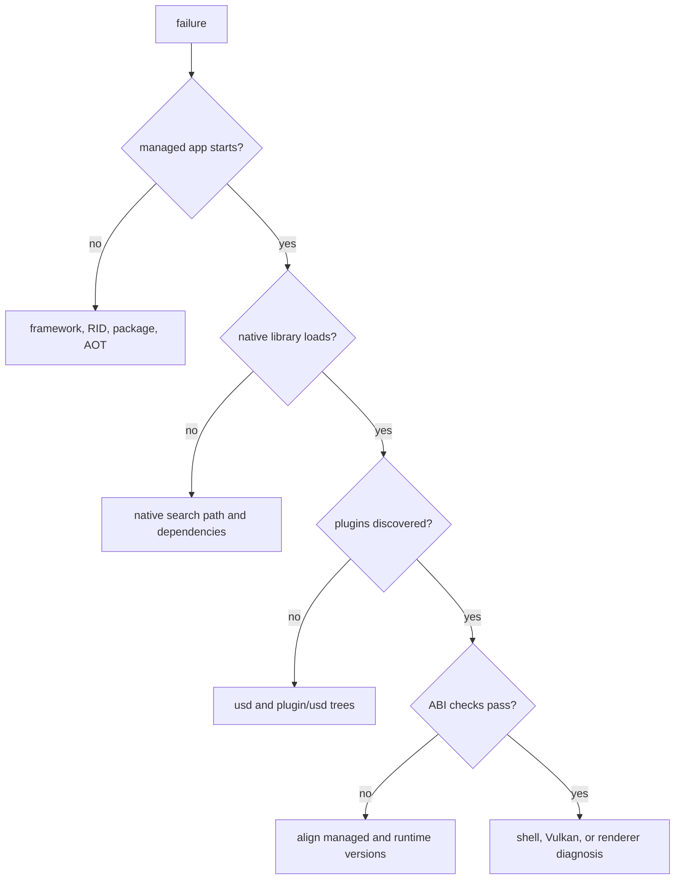

# Troubleshooting

Diagnose OpenUsd failures from the outside in: process and package identity, native loading, plugin
discovery, ABI validation, platform shell, renderer, then evidence. Do not replace several files at once
or add global search paths before identifying the failing layer.

See [Packaging](packaging.md) for complete package commands and [Native build](native-build.md) for
producing source-build runtime installs.

## Triage flow



Capture the first exception, native diagnostic, process output, and exact command before changing the
environment. Later failures are often consequences of the first one.

## Native library loading

Common symptoms include `DllNotFoundException`, a loader error naming `openusd_dotnet`,
`openusd_hydra`, `openusd_hdsilk`, or `openusd_storm_child`, or a failure in one of their dependencies.

First identify how the application is being run.

### Repository source-build runner

`eng/run-native-probe.ps1`, `eng/run-silk-probe.ps1`, and `eng/run-viewer.ps1` stage native files from:

```text
native/install/<rid>
native/install/shim/<rid>
```

Their publish layouts contain `bin`, `lib`, and `plugin/usd`, and the scripts configure the applicable
Windows, ELF, or Mach-O loader path for the child process. Prefer these runners over manually copying
one native file.

For a data and NativeAOT check:

```powershell
.\eng\run-native-probe.ps1 -Rid win-x64
```

For the Viewer:

```powershell
.\eng\run-viewer.ps1 -Rid win-x64
```

Use the RID that matches the host and available native install.

### NuGet package consumer

Runtime packages place native files under `runtimes/<rid>/native`. NuGet copies selected native assets
to publish output. `buildTransitive` targets separately preserve the `usd/**` and `plugin/usd/**`
resource trees.

Check for:

- a supported publish RID rather than a portable publish;
- the exact matching runtime package version;
- no stale native file copied by the application project;
- no globally installed OpenUSD library winning resolution; and
- all dependent native libraries beside the resolved shim or on its validated loader path.

On Linux, preserve the packaged Storm-child symlink chain. Replacing links with duplicate regular files
can change loader behavior and fails package validation.

## ABI or capability mismatch

Typical messages name the managed and native ABI values or report missing required capabilities.

The current contracts are:

- data ABI 8 with required capabilities `0x1FF`;
- direct Storm ABI 6;
- Storm child ABI 7;
- hdSilk session ABI 4; and
- hdSilk command-page ABI 9.

Do not work around a mismatch by suppressing initialization or editing a constant. Remove mixed native
assets, align all managed and runtime package versions, and rebuild or republish.

For source builds, inspect `native/install/<rid>/.openusd-install-metadata.json`. If source headers, the
lock file, or installed binaries changed after metadata was written, rebuild the native install.

See [Versioning and compatibility](versioning-compatibility.md) for the coordinated change process.

## Plugin discovery

Native libraries can load successfully while USD or Hydra plugin discovery still fails.

Core requires the data plugin tree rooted at `usd/**`. Imaging requires renderer resources under
`plugin/usd/**`, including the root `plugInfo.json`, Storm metadata, and hdSilk metadata.

For the repository Viewer runner, verify at least:

```text
plugin/usd/plugInfo.json
plugin/usd/hdStorm/resources/plugInfo.json
plugin/usd/hdSilk/resources/plugInfo.json
```

The runner sets `OPENUSD_PLUGIN_PATH` to the staged `plugin/usd` root. A package consumer normally gets
resource trees from the runtime package targets; preserve their relative directory names.

If a plugin cannot load:

1. confirm its `plugInfo.json` exists in the deployed tree;
2. inspect the metadata's library path relative to that file;
3. confirm the referenced library exists and matches the host architecture;
4. check that the library's own dependencies resolve; and
5. remove source-build or system plugin paths from the experiment.

Do not flatten plugin trees. Several plugins use the same metadata filename in different directories.

## Vulkan and SwiftShader

The Silk Vulkan backend loads platform Vulkan library names explicitly:

- Windows: `vulkan-1.dll`
- Linux: `libvulkan.so.1`, then `libvulkan.so`
- macOS device path: `libvulkan.1.dylib`, then `libvulkan.dylib`

An error that no Vulkan loader could be loaded is different from an error that no physical device or
required extension is available.

On Windows, the Core runtime package carries the locked Vulkan loader used by this repository. Confirm
that another SDK or system copy is not being selected first.

Deterministic Windows and Linux conformance runs use a packaged, hash-verified SwiftShader ICD. The
runner sets both variables to the same manifest:

```text
VK_DRIVER_FILES=<absolute SwiftShader ICD JSON>
VK_ICD_FILENAMES=<absolute SwiftShader ICD JSON>
```

Use `eng/run-managed-tests.ps1`, `eng/run-rhi-probe.ps1`, or `eng/run-silk-probe.ps1` so the manifest and
library are validated together. Do not point these variables at an unverified JSON file while claiming
deterministic evidence.

If a developer GPU should be used instead, clear both overrides and record the actual loader, ICD,
device, and driver. Results from a hardware ICD and SwiftShader are not interchangeable evidence.

## Viewer platform shells

### Windows

The Viewer defaults to Avalonia ANGLE/EGL. `OPENUSD_VIEWER_PLATFORM=windows-wgl` selects WGL. Shared-stage
soak also selects WGL. Record the configured shell and runtime-observed compositor before comparing
results.

Storm's direct path requires the creating OpenGL thread and context. The Storm child owns a dedicated
render thread and native child window; do not invoke child lifecycle operations through an unrelated
threading model.

### Linux

The Viewer uses one fixed X11/GLX shell for Storm and Vulkan switching. A Wayland session requires a
compositor-managed XWayland server and a valid `DISPLAY`. `WAYLAND_DISPLAY` alone is insufficient.

`XInitThreads` and the Storm-child Linux dispatcher must initialize before Avalonia or any other Xlib
call. An `XInitThreads failed` message is a startup-order failure, not a renderer fallback condition.

Check:

```powershell
$env:DISPLAY
$env:WAYLAND_DISPLAY
$env:XDG_SESSION_TYPE
```

Do not force a native Wayland interpretation for this Viewer shell; the current platform decision still
requires X11 or XWayland.

### macOS

The Viewer uses Avalonia Native with Metal. The supported runtime RID is `osx-arm64`. Confirm the process
architecture, dylib install names and rpaths, and any backend-specific Metal shader library and sidecar.

## NativeAOT and package-only failures

A successful `dotnet publish -p:PublishAot=true` proves compilation, not runtime completeness.

For a failing NativeAOT executable, verify:

- the application published for a current RID;
- the matching Core runtime is referenced;
- Imaging is referenced when the selected renderer needs it;
- native libraries were copied to publish output;
- `usd/**` and `plugin/usd/**` were copied without flattening;
- no reflection-only path was trimmed;
- ABI and capability checks execute successfully; and
- the process runs from a clean directory without repository loader paths.

Package-only probes deliberately reject `ProjectReference`, `native/install`, and repository source-path
leaks. If a probe passes only after adding a source tree to `PATH`, `LD_LIBRARY_PATH`,
`DYLD_LIBRARY_PATH`, or plugin discovery, the package deployment is still incomplete.

Do not suppress trim or AOT warnings to make publish succeed. Production builds treat those diagnostics
as errors.

## Stage and authoring symptoms

| Symptom | Likely cause | Check |
| --- | --- | --- |
| Stage file not found | Wrong working directory or undeployed asset | Log `Path.GetFullPath(stagePath)`. |
| Prim path rejected | Invalid USD identifier | Check Unicode XID path rules and embedded NULs. |
| Scheduler call hangs | Callback blocked or reentered scheduler | Keep callbacks synchronous and bounded. |
| Canceled live call still edits | Cancellation happened after queue admission | Review the live queue boundary. |
| Stage-bound result rejected | Callback returned a wrapper or lazy value | Materialize detached DTOs in the callback. |
| Live batch sequence rejected | Independent producers raced | Serialize before assigning and submitting. |
| Live edit not saved | Session layer is selected | Select root deliberately and save in the host. |
| Renderer misses edits | Consumer reopened the stage path | Use the host-provided render source. |

See [Programming model](programming-model.md) and [Live authoring](live-authoring.md) for the exact
contracts.

## Evidence failures

Evidence JSON is useful only with the artifacts and identities it references. Treat a lone JSON file as
an index, not proof.

When a soak, package, switching, or presentation validator rejects evidence, check:

1. the evidence schema version matches the validator;
2. source identity was captured before and after and remained unchanged;
3. executable and native binary hashes, lengths, and timestamps match the recorded run;
4. referenced images, logs, manifests, packages, or validation files still exist;
5. every referenced artifact hash matches;
6. the run used the recorded RID, backend, shell, loader, and driver;
7. the process exited with the expected success marker; and
8. final managed, native, page, child, and GPU resource counters reached their required state.

`eng/run-viewer.ps1` can write an identity manifest and rejects source or binary changes during a run.
Its renderer-switch soak also requires final zero-resource status, except for explicitly recorded
quarantine behavior in the relevant failure scenario.

Re-run the producing script rather than manually repairing evidence. Copy the entire artifact set
together so relative references and hashes remain meaningful.

## Information to include in a report

- exact command and exit code;
- first managed exception and native diagnostic;
- OS, architecture, RID, SDK, and package versions;
- data, Storm, child, and Silk ABI values relevant to the path;
- absolute path of each resolved project native library;
- plugin root and relevant `plugInfo.json`;
- Viewer shell or Vulkan loader, ICD, device, and driver;
- whether NativeAOT, package-only, source-build, or repository runner was used; and
- the complete evidence directory when evidence validation failed.

Redact user-profile or source paths when sharing diagnostics outside the trusted environment.

## Related documentation

- [Architecture](architecture.md)
- [Programming model](programming-model.md)
- [Live authoring](live-authoring.md)
- [Versioning and compatibility](versioning-compatibility.md)
- [Performance](performance.md)
- [Packaging](packaging.md)
- [Native build](native-build.md)
- [Rendering](rendering.md)
- [Viewer](viewer.md)
