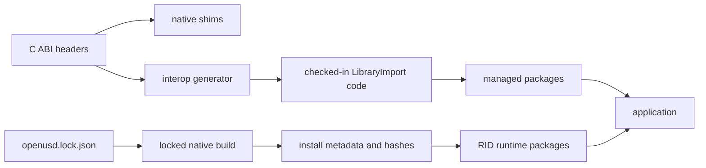

# Versioning and compatibility

OpenUsd compatibility spans managed APIs, the project-owned native ABIs, the locked OpenUSD build,
runtime assets, plugin metadata, and platform-specific graphics dependencies. A matching assembly alone
is not a complete deployment contract.

This document describes the repository's current contracts. It does not imply support for unlisted RIDs,
backends, upstream OpenUSD releases, or future ABI versions.

## Compatibility layers



Compatibility succeeds only when the managed surface, native entry points, wire layouts, runtime
libraries, and plugin resources agree.

## Managed public API

Production libraries target:

- `net8.0`
- `net9.0`
- `net10.0`

Each managed production library uses `PublicAPI.Shipped.txt` and `PublicAPI.Unshipped.txt` with
`Microsoft.CodeAnalysis.PublicApiAnalyzers`.

For an intentional public addition, removal, or signature change:

1. update the affected `PublicAPI.Unshipped.txt`;
2. keep `PublicAPI.Shipped.txt` stable unless performing an explicit release-baseline update;
3. review nullable annotations, ownership, disposal, and thread affinity;
4. verify behavior on all three target frameworks; and
5. update ABI, package, documentation, and compatibility tests when the change crosses those boundaries.

The baseline prevents accidental surface drift. It is not a substitute for behavioral compatibility
tests or clear ownership documentation.

Runtime packages are deliberately outside the managed API baseline and .NET package-validation
contract. The RID-agnostic packages contain only dependencies on RID-specific runtime packages, and
the RID-specific packages set `IncludeBuildOutput=false` so they ship native `runtimes/<rid>` assets
and `buildTransitive` targets instead of managed `lib` or `ref` assemblies. Their compatibility is
covered by package layout, native ABI, native-loader, and package-only execution gates.

Package versions are derived by the repository versioning configuration. Upstream OpenUSD has a
separate locked version in `eng/openusd.lock.json`; the current lock is OpenUSD 26.05 at a specific
commit and archive hash.

## Generated data interop

`native/openusd_dotnet/include/openusd_dotnet.h` and its companion headers (including
`openusd_hierarchy.h` and `openusd_property_inspection.h`) are the source contract for the data C ABI.
`eng/generate-interop.py` generates the checked-in
`src/OpenUsd.Interop/OpenUsdNativeMethods.g.cs`. `eng/generate-capabilities.py` treats the
capability macros and `OPENUSD_DATA_ABI_VERSION` in `openusd_dotnet.h` as the source of truth for
the native data capability consumers; it verifies `eng/openusd.lock.json` instead of rewriting that
supply-chain artifact.

Run both forms after changing the header:

```powershell
python eng/generate-interop.py
python eng/generate-interop.py --verify
python eng/generate-capabilities.py
python eng/generate-capabilities.py --verify
```

CI runs the verification forms. Do not hand-edit generated declarations or capability consumers
without changing their source contract and regenerating them.

The generator maps C types to source-generated `LibraryImport` declarations and the custom UTF-8
marshaller. C++ OpenUSD types remain behind opaque C handles.

Renderer, Storm-child, and hdSilk contracts have separate headers and managed wrappers. They are not
generated by `generate-interop.py` or `generate-capabilities.py`, so header, implementation, managed
constants, package validation, and tests must be updated together.

## Current native contracts

| Boundary | Current contract | Runtime check |
| --- | ---: | --- |
| Data shim `openusd_dotnet` | ABI 24, required capabilities `0x1FFFFFFFF` | Managed runtime validates both. |
| Direct Storm `openusd_hydra` | ABI 9 | Managed Storm runtime requires an exact version. |
| Viewer Storm child | ABI 9 | Managed child runtime requires the exact locked version. |
| hdSilk session API | ABI 6 | Session/page exports are required and checked before creation. |
| hdSilk command page | ABI 23 | Every managed page is validated before parsing. |
| Retained physics `openusd_physx` | ABI 7 | Negotiated exactly, including every record size. |
| Physics extraction page | ABI 1 | Every managed page is validated before parsing. |

The data capability mask is part of compatibility. A native library with ABI 24 but an older capability
mask is rejected, as is an older ABI that happens to report newer capability bits.

Direct Storm ABI 9 adds the owned bulk AOV contract in `openusd_storm_aov.h`:
`openusd_storm_aov_capture`, `openusd_storm_aov_get_view`, and `openusd_storm_aov_release`.
The managed `OpenUsdStormRenderer.RenderAovs` API requires the matching ABI 9 Imaging runtime.
That direct AOV addition left Storm-child ABI 8 unchanged. The subsequent child ABI 9 adds
`openusd_storm_child_capture_aovs`, reusing the version-1 direct AOV owner/view and returning
native viewport RGBA8 from the same queued operation. `OpenUsdStormChildSession.RenderAovs`
requires this exact child version, now pinned in `eng/openusd.lock.json`; child ABI 8 cannot
satisfy it. Neither addition changes the hdSilk contracts. The published `0.14.0-alpha`
Storm runtime remains ABI 8 and cannot serve these unreleased APIs. Native output formats,
snapshot-local identity, known-copy budgets and explicit unsupported outputs are described in
[Rendering](rendering.md#native-storm-aov-snapshots).

Data ABI 24 adds `OPENUSD_CAPABILITY_IMAGE_EXR_OUTPUT` (`0x100000000`) and the bulk
`openusd_image_encode_exr_rgba16f_v1` export. Its portable header and guarded capability do
not imply portable file-handle support: the initial encoder accepts Windows x64 synchronous,
buffered, writable empty regular files only. Other hosts refuse explicitly. The renderer-neutral
`ExrRgba16FloatWriter` preserves raw binary16 values and stored alpha without color conversion
or an image-sized copy; encoded extent is bounded, native codec heap is not. See
[EXR output](image-exr-output.md). Existing 398 Windows export ordinals are preserved by the
source-owned CMake definition file; the new export is appended at ordinal 399.

ABI 23 was additive over ABI 22. `OPENUSD_CAPABILITY_PRIM_PROPERTY_SNAPSHOT` (`0x80000000`) adds
the version-1 selected-prim property snapshot in `openusd_property_inspection.h` and immutable
`UsdStage.GetPrimPropertySnapshot` DTOs. One native query and release return complete bounded
property rows, typed value prefixes, sample/target counts and native-proven composed provenance.
Connections remain graph identities alongside USD values; schema fallback, block, unset and
deferred backing-store/clip/array-edit domains are distinct. This inspection snapshot does not
replace exact authored `CaptureAuthored` state, and changes no review/checkpoint wire format.
All managed APIs remain Unshipped. Existing ABI22 runtimes must not be paired with ABI23 references.

ABI 22 is additive over ABI 21. `OPENUSD_CAPABILITY_HIERARCHY_SNAPSHOT` (`0x40000000`) adds
the version-1 owned bulk hierarchy query in `openusd_hierarchy.h` and detached
`UsdStage.GetHierarchySnapshot` DTOs. Complete all-prim rows, separate shared prototypes and
bounded native variant metadata replace per-element inspection. Prim/text/depth/variant/work
quotas refuse without partial rows. Ordinary USDA and USDC hierarchies remain supported;
deferred crate string-list operations or unknown stores explicitly defer selectors per entry,
making `IsComplete` false without hiding any hierarchy rows. This does not expand portable-review
format support or change any prior editing/inspection wire format. All new managed APIs remain
Unshipped. Windows x64 execution does not imply Linux/macOS execution evidence.

ABI 21 is additive over ABI 20. `OPENUSD_CAPABILITY_PORTABLE_REVIEW_DOCUMENT_INSPECTION`
(`0x20000000`) adds native-decoded, metadata-only `UsdReviewDocument.Inspect(bytes)` and an
immutable `UsdReviewDocumentInfo`. RDI1 carries recorded provenance/dependencies without a
document payload, native identity or receipt. The native decoder applies full structural/checksum
guards with lexical paths and no filesystem access; ordinary explicit-source Read/Import keep
their existing physical/source validation. Inspection claims never authorize file access or replay.
Cold inspection uses pinned built-in field/type rules and synchronous temporary storage rather than
initializing the SDK schema/plugin registry. Plugin-defined metadata validation remains a later
explicit Read/Import responsibility. This correction changes no ABI, capability or wire layout.
URD1 bytes remain version 1. Unix verified-origin and crate portability are not implied.

ABI 20 is additive over ABI 19. `OPENUSD_CAPABILITY_PORTABLE_REVIEW_DOCUMENT` (`0x10000000`)
adds explicit `OpenForReview` origin binding and native URD1 review sidecars with source,
dependency, target and asset-anchor provenance. Read never grants a save receipt; new-session
import verifies provenance and creates new history rather than patching UED1 process identities.
Original source graphs/files/root metadata remain unchanged. The verified-open implementation
currently requires Windows filesystem read stability and the bounded USDA/text-USD/concrete-asset
profile; non-Windows verified opening, crate/custom/template/package/URI portability and
inherit/specialize/relocate/value-clip composition explicitly refuse. Normal Open/render support
for other formats is not reduced. Source/root saving and silent legacy-session rebinding are not
provided. See [portable review documents](data-api.md#portable-review-documents).

ABI 19 is additive over ABI 18. `OPENUSD_CAPABILITY_LAYER_AUTHORED_EDIT_TRANSACTIONS`
(`0x8000000`) adds the version-1 UED1 authored-layer packet contract in `openusd_layer_edit.h`.
It covers exact target-layer capture, affected-state compare/apply/replay, counted owned review
layers, state/permissions and conditional checkpoint/save-baseline operations. Detached packets
carry logical identities, not handles. Generic imported layers remain capture-only, and unsupported
values/anchors and cross-process recovery rebind are not implied. The exact project-owned counted
review store is accepted by render admission through inherited resident reads; arbitrary subclasses
and deferred value/backing preparation remain unsupported. This private addition changes no ABI layout.
Checkpoint replacement verifies bit-exact canonical authored content before success. Failed
transactions restore bounded affected parent inventories with their original presence/order
before reinstating a saved logical baseline. These correctness fixes do not change packet version,
capabilities or ABI layout.
Simulation-overlay normalization also retains an existing owned review layer/history when its
container and topology can be adopted without moving opinions. Unsafe adoption is refused instead
of silently replacing the review target. This uses the existing overlay and authored-edit APIs;
there is no packet identity remapping or additional ABI capability.
See [exact authored layer editing](data-api.md#exact-authored-layer-editing).

ABI 18 is additive over ABI 17: every v17 export and capability is preserved, and
`OPENUSD_CAPABILITY_RENDER_SPECIFICATION_QUERY` (`0x4000000`) adds an owned, bounded version-1
view of standard `UsdRenderComputeSpec` results. One stage query and one release carry the
products, shared render variables, ordered variable indices, purposes, and packed UTF-8 names.
The snapshot uses uniform/default-time settings, not animated camera evaluation. Invalid
relationships, invalid numeric values, and exceeded budgets fail instead of publishing a partial
render request. Custom property names remain explicit unevaluated metadata; this capability does
not claim output/AOV execution or execute RenderPass commands. See the
[render specification contract](data-api.md#detached-render-specifications).
The version-1 render view admits inspectable resident `SdfData`/`SdfUsdaData`, the exact
project-owned counted review store, and bounded native purpose-array edits. Actual crate payloads
additionally require the isolated storage-admission SDK extension version 1, with exact source
patch/header/binary provenance enforced at configure and every shim build. The extension adds no
managed or project C ABI export, layout or capability; it was introduced under data ABI 23
and remains required by the current matching runtime.
Unextended SDKs and unknown backing/type domains still refuse unprovable reads before materialization.
Stage metadata absence is admitted only over a valid root layer-stack inventory.
The source walk is capped at 1,048,576 visits, independently of the unchanged record/string limits.
This fail-closed eligibility rule does not alter the native view layout or public snapshot types.

ABI 17 was additive over ABI 16: every v16 export and capability is preserved, and
`OPENUSD_CAPABILITY_SDR_NODE_DEFINITION_QUERY` (`0x2000000`) adds bulk, read-only introspection of
the process-global Sdr shader node-definition registry, including the source-asset lookup that
reports not-found rather than erroring when no MDL SDK parser plugin is registered.

ABI 16 was additive over ABI 15 in the same way: every v15 export and capability is preserved, and
`OPENUSD_CAPABILITY_RESOLVER_CONTEXT_INSPECTION` (`0x1000000`) adds resolver contexts, scoped
context binding, bulk asset resolution, and plugin enumeration. The new exports are bulk and
handle based by contract, so no managed callback is reachable from a native asset path and a
third-party resolver plugin can never re-enter the runtime that called it. Two runtime rules ride
along with that capability and are part of the contract, not implementation detail: the primary
resolver is constructed once on first use and cannot be discovered concurrently with that
construction, and `RefreshContext` is process-wide rather than per context. A third-party plugin
tree is a packaging contract rather than an ABI extension point; see
[Packaging](packaging.md#third-party-resolver-plugin-contract).

The hdSilk page is a pointer-free, little-endian wire format. A page-version change must update the
native header and writer, managed parser, tests, lock metadata, and package evidence. Session ABI 6
exports `openusd_silk_get_session_abi_version` and `openusd_silk_get_page_abi_version`; managed
session creation rejects missing exports or mismatched versions before consuming scene data.
It adds the version-1 explicit scene-ingestion request without changing page ABI 23.
Earlier session-5 libraries do not satisfy this interface and must not be mixed with these bindings.

The Storm child ABI also participates in native filename policy. Linux packages use the ABI-9 SONAME and
validated symlink chain; Windows and macOS packages validate the corresponding exported contract.

The physics ABI fails closed rather than degrading. The managed mirror asserts its own record sizes,
compares every one of them against the sizes the runtime reports, and then compares the page magic,
the page alignment, and every declared limit. Any difference is reported as an unavailable backend
with a diagnostic instead of being used with reinterpreted memory, so a mismatched pair produces an
honest capability answer rather than corrupted simulation results.

## ABI change rules

Treat a native contract change as a coordinated change set.

For the data ABI:

1. update the C header and implementation;
2. update the ABI version or capability mask as the contract requires;
3. regenerate managed declarations;
4. update `OpenUsdNativeContract` and the lock file;
5. add positive and negative compatibility tests;
6. rebuild each applicable RID; and
7. update package metadata, package tests, and documentation.

For renderer or child ABIs, also update exact managed constants, native filename or SONAME rules,
platform export validation, and package-only probes.

For command pages or shared structs, version the serialized or natural-layout contract explicitly.
Never infer compatibility from `sizeof` alone, and never put native pointers into a persisted page.

## Runtime package alignment

The current runtime matrix is:

| RID | Core package | Imaging package |
| --- | --- | --- |
| `win-x64` | `OpenUsd.Runtime.Core.win-x64` | `OpenUsd.Runtime.Imaging.win-x64` |
| `linux-x64` | `OpenUsd.Runtime.Core.linux-x64` | `OpenUsd.Runtime.Imaging.linux-x64` |
| `osx-arm64` | `OpenUsd.Runtime.Core.osx-arm64` | `OpenUsd.Runtime.Imaging.osx-arm64` |

| RID | Physics package | GPU domains |
| --- | --- | --- |
| `win-x64` | `OpenUsd.Runtime.Physics.win-x64` | User-supplied NVIDIA modules |
| `linux-x64` | `OpenUsd.Runtime.Physics.linux-x64` | User-supplied NVIDIA modules |
| `osx-arm64` | none | none |

Core contains the OpenUSD runtime, its load-time dependencies, the data shim, and the `usd/**` data
plugin tree. Imaging adds Hydra, hdSilk, Storm-child assets, renderer plugins, and
`plugin/usd/**`. Physics adds the retained PhysX solver shim, which links the OpenUSD monolith and
statically links the BSD-3-Clause simulation SDK including Vehicle2. No package carries an NVIDIA
GPU module.

Imaging and Physics each have an exact NuGet dependency on the matching Core package version.
Applications should use the same repository version for managed OpenUsd packages and the selected
runtime packages. Do not mix assets copied from source builds, another package version, another
RID, or a system installation.

Select Core for data-only applications. Add Imaging when the application uses Hydra, Storm, hdSilk, or a
concrete Silk renderer. Add Physics when the application simulates on `win-x64` or `linux-x64`.
Concrete managed backends may also carry backend-specific assets, such as a validated Metal shader
library.

Physics is a platform capability, not a compatibility level. `osx-arm64` has no physics package
because the pinned vcpkg PhysX port declares no `arm64-osx` support, and a macOS application that
references `OpenUsd.Physics` reports an unavailable backend rather than failing to start. GPU
domains behave the same way on every RID: without the user-supplied NVIDIA modules the reported
capability set omits `Cuda`. Neither absence is a compatibility break; the packages and the managed
library are complete without them.

## Build and install identity

`eng/openusd.lock.json` pins upstream source and dependency inputs. A completed native build writes
install metadata containing the RID, locked source identity, ABI values, source hashes, and installed
binary hashes.

Package and workflow validation rejects stale native installs when:

- the lock or relevant source header changed after the build;
- an ABI or capability value differs;
- an expected binary is missing or has a different hash;
- a platform loader path, install name, SONAME, or symlink policy differs; or
- required plugin resources are absent.

Rebuild the native install instead of editing metadata or copying a single replacement binary into it.

## Consumer compatibility checklist

When diagnosing or reviewing a deployment, verify:

1. the application's target framework is supported;
2. the publish RID is one of the current runtime RIDs;
3. all managed and runtime OpenUsd packages use the same version;
4. Imaging's exact Core dependency resolved without override;
5. data ABI 17 and capabilities `0x3FFFFFF` are reported;
6. any selected rendering path has its matching ABI and plugin assets;
7. `usd/**` and `plugin/usd/**` retain their directory structure, and any third-party resolver tree
   keeps its own directory and `plugInfo.json` beside them;
8. no source-build or globally installed library wins native resolution; and
9. NativeAOT publish output passes the applicable package-only probe.

See [Troubleshooting](troubleshooting.md) for symptom-driven checks and [Packaging](packaging.md) for the
full package layout and validation commands.

## Related documentation

- [Architecture](architecture.md)
- [Programming model](programming-model.md)
- [Packaging](packaging.md)
- [Native build](native-build.md)
- [Rendering](rendering.md)
- [Troubleshooting](troubleshooting.md)
- [Testing](testing.md)
