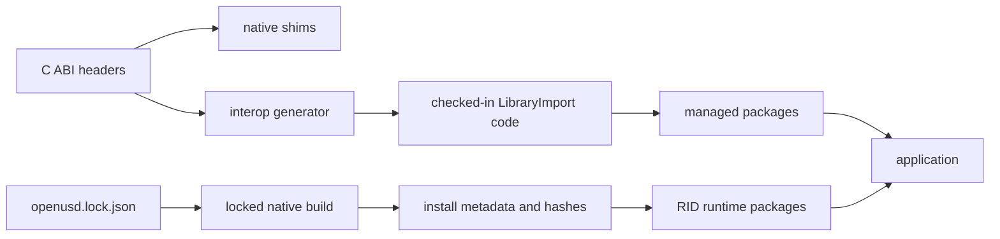

# Versioning and compatibility

OpenUsd compatibility spans managed APIs, the project-owned native ABIs, the locked OpenUSD build,
runtime assets, plugin metadata, and platform-specific graphics dependencies. A matching assembly alone
is not a complete deployment contract.

This document describes the repository's current contracts. It does not imply support for unlisted RIDs,
backends, upstream OpenUSD releases, or future ABI versions.

## Compatibility layers



Compatibility succeeds only when the managed surface, native entry points, wire layouts, runtime
libraries, and plugin resources agree.

## Managed public API

Production libraries target:

- `net8.0`
- `net9.0`
- `net10.0`

Each managed production library uses `PublicAPI.Shipped.txt` and `PublicAPI.Unshipped.txt` with
`Microsoft.CodeAnalysis.PublicApiAnalyzers`.

For an intentional public addition, removal, or signature change:

1. update the affected `PublicAPI.Unshipped.txt`;
2. keep `PublicAPI.Shipped.txt` stable unless performing an explicit release-baseline update;
3. review nullable annotations, ownership, disposal, and thread affinity;
4. verify behavior on all three target frameworks; and
5. update ABI, package, documentation, and compatibility tests when the change crosses those boundaries.

The baseline prevents accidental surface drift. It is not a substitute for behavioral compatibility
tests or clear ownership documentation.

Runtime packages are deliberately outside the managed API baseline and .NET package-validation
contract. The RID-agnostic packages contain only dependencies on RID-specific runtime packages, and
the RID-specific packages set `IncludeBuildOutput=false` so they ship native `runtimes/<rid>` assets
and `buildTransitive` targets instead of managed `lib` or `ref` assemblies. Their compatibility is
covered by package layout, native ABI, native-loader, and package-only execution gates.

Package versions are derived by the repository versioning configuration. Upstream OpenUSD has a
separate locked version in `eng/openusd.lock.json`; the current lock is OpenUSD 26.05 at a specific
commit and archive hash.

## Generated data interop

`native/openusd_dotnet/include/openusd_dotnet.h` is the source contract for the data C ABI.
`eng/generate-interop.py` generates the checked-in
`src/OpenUsd.Interop/OpenUsdNativeMethods.g.cs`. `eng/generate-capabilities.py` treats the
capability macros and `OPENUSD_DATA_ABI_VERSION` in `openusd_dotnet.h` as the source of truth for
the native data capability consumers; it verifies `eng/openusd.lock.json` instead of rewriting that
supply-chain artifact.

Run both forms after changing the header:

```powershell
python eng/generate-interop.py
python eng/generate-interop.py --verify
python eng/generate-capabilities.py
python eng/generate-capabilities.py --verify
```

CI runs the verification forms. Do not hand-edit generated declarations or capability consumers
without changing their source contract and regenerating them.

The generator maps C types to source-generated `LibraryImport` declarations and the custom UTF-8
marshaller. C++ OpenUSD types remain behind opaque C handles.

Renderer, Storm-child, and hdSilk contracts have separate headers and managed wrappers. They are not
generated by `generate-interop.py` or `generate-capabilities.py`, so header, implementation, managed
constants, package validation, and tests must be updated together.

## Current native contracts

| Boundary | Current contract | Runtime check |
| --- | ---: | --- |
| Data shim `openusd_dotnet` | ABI 15, required capabilities `0x3FFFF` | Managed runtime validates both. |
| Direct Storm `openusd_hydra` | ABI 6 | Managed Storm runtime requires an exact version. |
| Viewer Storm child | ABI 8 | Managed child runtime requires an exact version. |
| hdSilk session API | ABI 5 | Kept aligned through the matched Imaging runtime. |
| hdSilk command page | ABI 11 | Every managed page is validated before parsing. |

The data capability mask is part of compatibility. A native library with ABI 15 but an older capability
mask is rejected, as is an older ABI that happens to report newer capability bits.

The hdSilk page is a pointer-free, little-endian wire format. A page-version change must update the
native header and writer, managed parser, tests, lock metadata, and package evidence. Session ABI 5 does
not expose a separate managed runtime version query, so exact package alignment is especially important.

The Storm child ABI also participates in native filename policy. Linux packages use the ABI-8 SONAME and
validated symlink chain; Windows and macOS packages validate the corresponding exported contract.

## ABI change rules

Treat a native contract change as a coordinated change set.

For the data ABI:

1. update the C header and implementation;
2. update the ABI version or capability mask as the contract requires;
3. regenerate managed declarations;
4. update `OpenUsdNativeContract` and the lock file;
5. add positive and negative compatibility tests;
6. rebuild each applicable RID; and
7. update package metadata, package tests, and documentation.

For renderer or child ABIs, also update exact managed constants, native filename or SONAME rules,
platform export validation, and package-only probes.

For command pages or shared structs, version the serialized or natural-layout contract explicitly.
Never infer compatibility from `sizeof` alone, and never put native pointers into a persisted page.

## Runtime package alignment

The current runtime matrix is:

| RID | Core package | Imaging package |
| --- | --- | --- |
| `win-x64` | `OpenUsd.Runtime.Core.win-x64` | `OpenUsd.Runtime.Imaging.win-x64` |
| `linux-x64` | `OpenUsd.Runtime.Core.linux-x64` | `OpenUsd.Runtime.Imaging.linux-x64` |
| `osx-arm64` | `OpenUsd.Runtime.Core.osx-arm64` | `OpenUsd.Runtime.Imaging.osx-arm64` |

Core contains the OpenUSD runtime, its load-time dependencies, the data shim, and the `usd/**` data
plugin tree. Imaging adds Hydra, hdSilk, Storm-child assets, renderer plugins, and
`plugin/usd/**`.

Imaging has an exact NuGet dependency on the matching Core package version. Applications should use the
same repository version for managed OpenUsd packages and the selected runtime packages. Do not mix
assets copied from source builds, another package version, another RID, or a system installation.

Select Core for data-only applications. Add Imaging when the application uses Hydra, Storm, hdSilk, or a
concrete Silk renderer. Concrete managed backends may also carry backend-specific assets, such as a
validated Metal shader library.

## Build and install identity

`eng/openusd.lock.json` pins upstream source and dependency inputs. A completed native build writes
install metadata containing the RID, locked source identity, ABI values, source hashes, and installed
binary hashes.

Package and workflow validation rejects stale native installs when:

- the lock or relevant source header changed after the build;
- an ABI or capability value differs;
- an expected binary is missing or has a different hash;
- a platform loader path, install name, SONAME, or symlink policy differs; or
- required plugin resources are absent.

Rebuild the native install instead of editing metadata or copying a single replacement binary into it.

## Consumer compatibility checklist

When diagnosing or reviewing a deployment, verify:

1. the application's target framework is supported;
2. the publish RID is one of the current runtime RIDs;
3. all managed and runtime OpenUsd packages use the same version;
4. Imaging's exact Core dependency resolved without override;
5. data ABI 15 and capabilities `0x3FFFF` are reported;
6. any selected rendering path has its matching ABI and plugin assets;
7. `usd/**` and `plugin/usd/**` retain their directory structure;
8. no source-build or globally installed library wins native resolution; and
9. NativeAOT publish output passes the applicable package-only probe.

See [Troubleshooting](troubleshooting.md) for symptom-driven checks and [Packaging](packaging.md) for the
full package layout and validation commands.

## Related documentation

- [Architecture](architecture.md)
- [Programming model](programming-model.md)
- [Packaging](packaging.md)
- [Native build](native-build.md)
- [Rendering](rendering.md)
- [Troubleshooting](troubleshooting.md)
- [Testing](testing.md)
